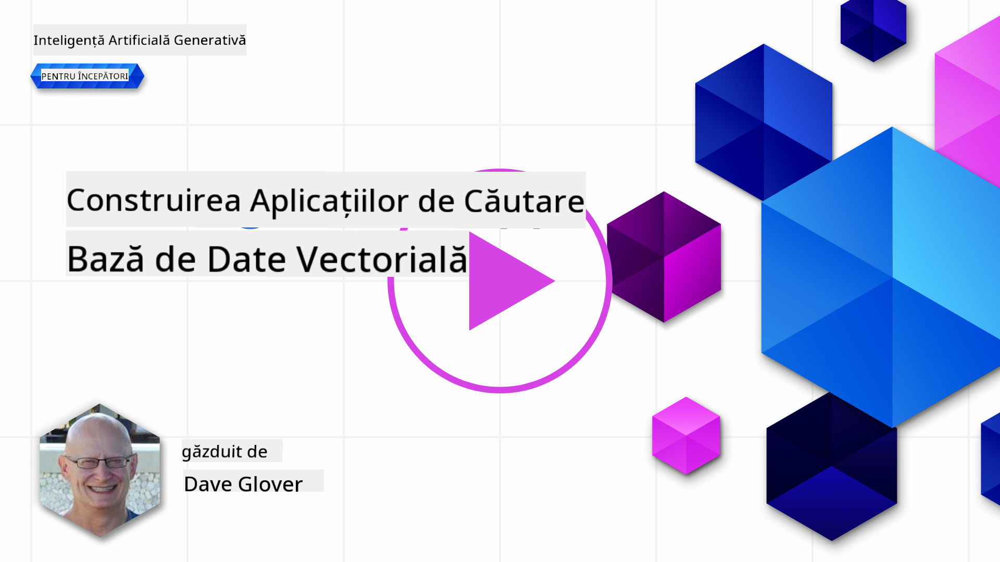
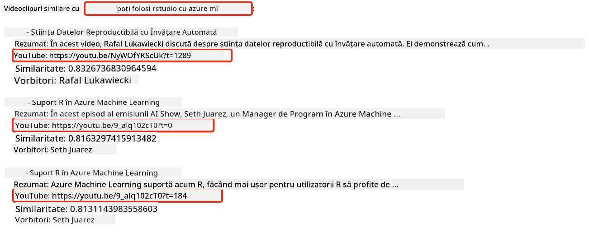
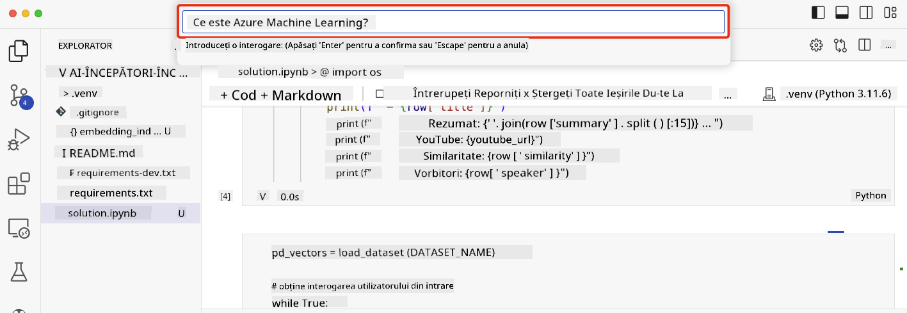

<!--
CO_OP_TRANSLATOR_METADATA:
{
  "original_hash": "d46aad0917a1a342d613e2c13d457da5",
  "translation_date": "2025-06-25T16:42:25+00:00",
  "source_file": "08-building-search-applications/README.md",
  "language_code": "ro"
}
-->
# Construirea unei aplicații de căutare

[](https://aka.ms/gen-ai-lesson8-gh?WT.mc_id=academic-105485-koreyst)

> > _Faceți clic pe imaginea de mai sus pentru a viziona videoclipul acestei lecții_

Există mai multe lucruri în LLM-uri decât chatboți și generare de text. Este posibil să construiești aplicații de căutare folosind Embeddings. Embeddings sunt reprezentări numerice ale datelor, cunoscute și sub numele de vectori, și pot fi utilizate pentru căutarea semantică a datelor.

În această lecție, vei construi o aplicație de căutare pentru startup-ul nostru educațional. Startup-ul nostru este o organizație non-profit care oferă educație gratuită studenților din țările în curs de dezvoltare. Startup-ul nostru are un număr mare de videoclipuri YouTube pe care studenții le pot folosi pentru a învăța despre AI. Startup-ul nostru dorește să construiască o aplicație de căutare care să permită studenților să caute un videoclip YouTube introducând o întrebare.

De exemplu, un student ar putea să scrie 'Ce sunt Jupyter Notebooks?' sau 'Ce este Azure ML' și aplicația de căutare va returna o listă de videoclipuri YouTube relevante pentru întrebare și, mai mult decât atât, aplicația de căutare va returna un link către locul din videoclip unde se află răspunsul la întrebare.

## Introducere

În această lecție, vom acoperi:

- Căutarea semantică vs. Căutarea după cuvinte cheie.
- Ce sunt Embeddings de text.
- Crearea unui Index de Embeddings de text.
- Căutarea într-un Index de Embeddings de text.

## Obiective de învățare

După finalizarea acestei lecții, vei putea:

- Să diferențiezi între căutarea semantică și căutarea după cuvinte cheie.
- Să explici ce sunt Embeddings de text.
- Să creezi o aplicație folosind Embeddings pentru a căuta date.

## De ce să construiești o aplicație de căutare?

Crearea unei aplicații de căutare te va ajuta să înțelegi cum să folosești Embeddings pentru a căuta date. De asemenea, vei învăța cum să construiești o aplicație de căutare care poate fi folosită de studenți pentru a găsi rapid informații.

Lecția include un Index de Embeddings al transcrierilor YouTube pentru canalul YouTube [AI Show](https://www.youtube.com/playlist?list=PLlrxD0HtieHi0mwteKBOfEeOYf0LJU4O1). AI Show este un canal YouTube care te învață despre AI și învățare automată. Indexul de Embeddings conține Embeddings pentru fiecare dintre transcrierile YouTube până în octombrie 2023. Vei folosi Indexul de Embeddings pentru a construi o aplicație de căutare pentru startup-ul nostru. Aplicația de căutare returnează un link către locul din videoclip unde se află răspunsul la întrebare. Aceasta este o modalitate excelentă pentru studenți de a găsi rapid informațiile de care au nevoie.

Următorul este un exemplu de interogare semantică pentru întrebarea 'poți folosi rstudio cu azure ml?'. Verifică URL-ul YouTube, vei vedea că URL-ul conține un timestamp care te duce la locul din videoclip unde se află răspunsul la întrebare.



## Ce este căutarea semantică?

Acum poate te întrebi, ce este căutarea semantică? Căutarea semantică este o tehnică de căutare care folosește semantica, sau sensul, cuvintelor dintr-o interogare pentru a returna rezultate relevante.

Iată un exemplu de căutare semantică. Să zicem că doreai să cumperi o mașină, ai putea căuta 'mașina mea de vis', căutarea semantică înțelege că nu `dreaming` despre o mașină, ci mai degrabă cauți să cumperi `ideal` mașină. Căutarea semantică înțelege intenția ta și returnează rezultate relevante. Alternativa este `keyword search` care ar căuta literalmente vise despre mașini și adesea returnează rezultate irelevante.

## Ce sunt Embeddings de text?

[Embeddings de text](https://en.wikipedia.org/wiki/Word_embedding?WT.mc_id=academic-105485-koreyst) sunt o tehnică de reprezentare a textului utilizată în [procesarea limbajului natural](https://en.wikipedia.org/wiki/Natural_language_processing?WT.mc_id=academic-105485-koreyst). Embeddings de text sunt reprezentări numerice semantice ale textului. Embeddings sunt folosite pentru a reprezenta datele într-un mod ușor de înțeles pentru o mașină. Există multe modele pentru construirea embeddings de text, în această lecție, ne vom concentra pe generarea embeddings folosind Modelul de Embeddings OpenAI.

Iată un exemplu, imaginează-ți că următorul text se află într-o transcriere dintr-unul dintre episoadele de pe canalul YouTube AI Show:

```text
Today we are going to learn about Azure Machine Learning.
```

Am trimite textul către API-ul OpenAI Embedding și acesta ar returna următorul embedding format din 1536 de numere, cunoscut și sub numele de vector. Fiecare număr din vector reprezintă un aspect diferit al textului. Pentru concizie, iată primele 10 numere din vector.

```python
[-0.006655829958617687, 0.0026128944009542465, 0.008792596869170666, -0.02446001023054123, -0.008540431968867779, 0.022071078419685364, -0.010703742504119873, 0.003311325330287218, -0.011632772162556648, -0.02187200076878071, ...]
```

## Cum este creat Indexul de Embeddings?

Indexul de Embeddings pentru această lecție a fost creat cu o serie de scripturi Python. Vei găsi scripturile împreună cu instrucțiuni în [README](./scripts/README.md?WT.mc_id=academic-105485-koreyst) în folderul 'scripts' pentru această lecție. Nu este nevoie să rulezi aceste scripturi pentru a finaliza această lecție, deoarece Indexul de Embeddings este furnizat pentru tine.

Scripturile efectuează următoarele operațiuni:

1. Transcrierea pentru fiecare videoclip YouTube din playlistul [AI Show](https://www.youtube.com/playlist?list=PLlrxD0HtieHi0mwteKBOfEeOYf0LJU4O1) este descărcată.
2. Folosind [Funcțiile OpenAI](https://learn.microsoft.com/azure/ai-services/openai/how-to/function-calling?WT.mc_id=academic-105485-koreyst), se încearcă extragerea numelui vorbitorului din primele 3 minute ale transcrierii YouTube. Numele vorbitorului pentru fiecare videoclip este stocat în Indexul de Embeddings numit `embedding_index_3m.json`.
3. Textul transcrierii este apoi împărțit în **segmente de text de 3 minute**. Segmentul include aproximativ 20 de cuvinte care se suprapun din segmentul următor pentru a se asigura că Embedding-ul pentru segment nu este tăiat și pentru a oferi un context mai bun pentru căutare.
4. Fiecare segment de text este apoi trimis la API-ul OpenAI Chat pentru a rezuma textul în 60 de cuvinte. Rezumatul este, de asemenea, stocat în Indexul de Embeddings `embedding_index_3m.json`.
5. În final, textul segmentului este trimis la API-ul OpenAI Embedding. API-ul Embedding returnează un vector de 1536 de numere care reprezintă semnificația semantică a segmentului. Segmentul împreună cu vectorul OpenAI Embedding este stocat într-un Index de Embeddings `embedding_index_3m.json`.

### Baze de date vectoriale

Pentru simplitatea lecției, Indexul de Embeddings este stocat într-un fișier JSON numit `embedding_index_3m.json` și încărcat într-un DataFrame Pandas. Totuși, în producție, Indexul de Embeddings ar fi stocat într-o bază de date vectorială precum [Azure Cognitive Search](https://learn.microsoft.com/training/modules/improve-search-results-vector-search?WT.mc_id=academic-105485-koreyst), [Redis](https://cookbook.openai.com/examples/vector_databases/redis/readme?WT.mc_id=academic-105485-koreyst), [Pinecone](https://cookbook.openai.com/examples/vector_databases/pinecone/readme?WT.mc_id=academic-105485-koreyst), [Weaviate](https://cookbook.openai.com/examples/vector_databases/weaviate/readme?WT.mc_id=academic-105485-koreyst), pentru a numi doar câteva.

## Înțelegerea similarității cosinusului

Am învățat despre embeddings de text, următorul pas este să învățăm cum să folosim embeddings de text pentru a căuta date și în special pentru a găsi cele mai similare embeddings cu o interogare dată folosind similaritatea cosinusului.

### Ce este similaritatea cosinusului?

Similaritatea cosinusului este o măsură a similarității între doi vectori, vei auzi de asemenea acest termen sub denumirea de `nearest neighbor search`. Pentru a efectua o căutare de similaritate cosinus, trebuie să _vectorizezi_ textul _interogării_ folosind API-ul OpenAI Embedding. Apoi calculezi _similaritatea cosinusului_ între vectorul interogării și fiecare vector din Indexul de Embeddings. Amintește-ți, Indexul de Embeddings are un vector pentru fiecare segment de text al transcrierii YouTube. În final, sortezi rezultatele după similaritatea cosinusului, iar segmentele de text cu cea mai mare similaritate cosinus sunt cele mai similare cu interogarea.

Dintr-o perspectivă matematică, similaritatea cosinusului măsoară cosinusul unghiului dintre doi vectori proiectați într-un spațiu multidimensional. Această măsurătoare este benefică, deoarece dacă două documente sunt departe unul de altul prin distanța euclidiană din cauza dimensiunii, ele ar putea totuși să aibă un unghi mai mic între ele și, prin urmare, o similaritate cosinus mai mare. Pentru mai multe informații despre ecuațiile de similaritate cosinus, vezi [Similaritatea cosinusului](https://en.wikipedia.org/wiki/Cosine_similarity?WT.mc_id=academic-105485-koreyst).

## Construirea primei tale aplicații de căutare

În continuare, vom învăța cum să construim o aplicație de căutare folosind Embeddings. Aplicația de căutare va permite studenților să caute un videoclip introducând o întrebare. Aplicația de căutare va returna o listă de videoclipuri care sunt relevante pentru întrebare. Aplicația de căutare va returna, de asemenea, un link către locul din videoclip unde se află răspunsul la întrebare.

Această soluție a fost construită și testată pe Windows 11, macOS și Ubuntu 22.04 folosind Python 3.10 sau o versiune ulterioară. Poți descărca Python de pe [python.org](https://www.python.org/downloads/?WT.mc_id=academic-105485-koreyst).

## Sarcină - construirea unei aplicații de căutare, pentru a permite studenților

Am introdus startup-ul nostru la începutul acestei lecții. Acum este momentul să permitem studenților să construiască o aplicație de căutare pentru evaluările lor.

În această sarcină, vei crea Serviciile Azure OpenAI care vor fi utilizate pentru a construi aplicația de căutare. Vei crea următoarele Servicii Azure OpenAI. Vei avea nevoie de un abonament Azure pentru a finaliza această sarcină.

### Începe Azure Cloud Shell

1. Conectează-te la [portalul Azure](https://portal.azure.com/?WT.mc_id=academic-105485-koreyst).
2. Selectează pictograma Cloud Shell din colțul din dreapta sus al portalului Azure.
3. Selectează **Bash** pentru tipul de mediu.

#### Creează un grup de resurse

> Pentru aceste instrucțiuni, folosim grupul de resurse numit "semantic-video-search" în East US.
> Poți schimba numele grupului de resurse, dar când schimbi locația pentru resurse,
> verifică [tabelul de disponibilitate al modelelor](https://aka.ms/oai/models?WT.mc_id=academic-105485-koreyst).

```shell
az group create --name semantic-video-search --location eastus
```

#### Creează o resursă Azure OpenAI Service

Din Azure Cloud Shell, rulează următoarea comandă pentru a crea o resursă Azure OpenAI Service.

```shell
az cognitiveservices account create --name semantic-video-openai --resource-group semantic-video-search \
    --location eastus --kind OpenAI --sku s0
```

#### Obține punctul final și cheile pentru utilizare în această aplicație

Din Azure Cloud Shell, rulează următoarele comenzi pentru a obține punctul final și cheile pentru resursa Azure OpenAI Service.

```shell
az cognitiveservices account show --name semantic-video-openai \
   --resource-group  semantic-video-search | jq -r .properties.endpoint
az cognitiveservices account keys list --name semantic-video-openai \
   --resource-group semantic-video-search | jq -r .key1
```

#### Desfășoară modelul OpenAI Embedding

Din Azure Cloud Shell, rulează următoarea comandă pentru a desfășura modelul OpenAI Embedding.

```shell
az cognitiveservices account deployment create \
    --name semantic-video-openai \
    --resource-group  semantic-video-search \
    --deployment-name text-embedding-ada-002 \
    --model-name text-embedding-ada-002 \
    --model-version "2"  \
    --model-format OpenAI \
    --sku-capacity 100 --sku-name "Standard"
```

## Soluție

Deschide [caietul soluției](../../../08-building-search-applications/python/aoai-solution.ipynb) în GitHub Codespaces și urmează instrucțiunile din Jupyter Notebook.

Când rulezi caietul, ți se va cere să introduci o interogare. Caseta de introducere va arăta astfel:



## Felicitări! Continuă-ți învățarea

După finalizarea acestei lecții, verifică colecția noastră [Generative AI Learning](https://aka.ms/genai-collection?WT.mc_id=academic-105485-koreyst) pentru a continua să-ți îmbunătățești cunoștințele despre AI Generativ!

Mergi la Lecția 9 unde vom analiza cum să [construiești aplicații de generare a imaginilor](../09-building-image-applications/README.md?WT.mc_id=academic-105485-koreyst)!

**Declinarea responsabilității**:  
Acest document a fost tradus folosind serviciul de traducere AI [Co-op Translator](https://github.com/Azure/co-op-translator). Deși ne străduim să asigurăm acuratețea, vă rugăm să fiți conștienți de faptul că traducerile automate pot conține erori sau inexactități. Documentul original în limba sa maternă ar trebui considerat sursa autoritară. Pentru informații critice, se recomandă traducerea profesională umană. Nu ne asumăm responsabilitatea pentru eventualele neînțelegeri sau interpretări greșite care pot apărea din utilizarea acestei traduceri.