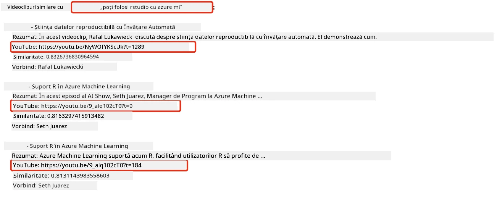
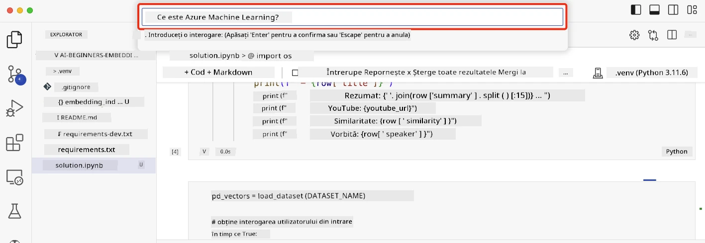

# Construirea unor aplicații de căutare

[](https://youtu.be/W0-nzXjOjr0?si=GcsqiTTvd7RKbo7V)

> > _Faceți clic pe imaginea de mai sus pentru a viziona videoclipul acestei lecții_

Există mai mult decât chatboți și generarea de text în LLM-uri. De asemenea, este posibil să construiți aplicații de căutare folosind Embeddings. Embeddings sunt reprezentări numerice ale datelor, cunoscute și sub numele de vectori, și pot fi folosite pentru căutarea semantică a datelor.

În această lecție, veți construi o aplicație de căutare pentru startup-ul nostru educațional. Startup-ul nostru este o organizație nonprofit care oferă educație gratuită elevilor din țările în dezvoltare. Startup-ul nostru deține un număr mare de videoclipuri YouTube pe care elevii le pot folosi pentru a învăța despre AI. Startup-ul nostru dorește să construiască o aplicație de căutare care să permită elevilor să caute un videoclip YouTube tastând o întrebare.

De exemplu, un elev ar putea tasta 'Ce sunt Jupyter Notebooks?' sau 'Ce este Azure ML' iar aplicația de căutare va returna o listă de videoclipuri YouTube relevante pentru întrebare și, mai mult, aplicația va returna un link către locul din video unde se află răspunsul la întrebare.

## Introducere

În această lecție, vom acoperi:

- Diferența dintre căutarea semantică și cea pe cuvinte cheie.
- Ce sunt Text Embeddings.
- Crearea unui Index de Text Embeddings.
- Căutarea într-un Index de Text Embeddings.

## Obiective de învățare

După ce terminați această lecție, veți putea:

- Să faceți diferența între căutarea semantică și cea pe cuvinte cheie.
- Să explicați ce sunt Text Embeddings.
- Să creați o aplicație folosind Embeddings pentru căutarea datelor.

## De ce să construim o aplicație de căutare?

Construirea unei aplicații de căutare vă va ajuta să înțelegeți cum să folosiți Embeddings pentru căutarea datelor. De asemenea, veți învăța cum să construiți o aplicație de căutare care poate fi folosită de elevi pentru a găsi rapid informații.

Lecția include un Index de Embeddings al transcrierilor YouTube pentru canalul [AI Show](https://www.youtube.com/playlist?list=PLlrxD0HtieHi0mwteKBOfEeOYf0LJU4O1) de pe YouTube Microsoft. AI Show este un canal YouTube care te învață despre AI și învățare automată. Indexul de Embeddings conține Embeddings pentru fiecare transcriere YouTube până în octombrie 2023. Veți folosi Indexul de Embeddings pentru a construi o aplicație de căutare pentru startup-ul nostru. Aplicația de căutare returnează un link către locul din video unde se află răspunsul la întrebare. Aceasta este o metodă excelentă pentru ca elevii să găsească rapid informațiile de care au nevoie.

Mai jos este un exemplu de interogare semantică pentru întrebarea 'poți folosi rstudio cu azure ml?'. Uită-te la URL-ul YouTube, vei vedea că URL-ul conține un timestamp care te duce la locul din video unde se află răspunsul la întrebare.



## Ce este căutarea semantică?

Acum te întrebi poate, ce este căutarea semantică? Căutarea semantică este o tehnică de căutare care folosește semantica, sau sensul cuvintelor dintr-o interogare, pentru a returna rezultate relevante.

Iată un exemplu de căutare semantică. Să spunem că vrei să cumperi o mașină, ai putea căuta 'mașina mea de vis', căutarea semantică înțelege că nu visezi efectiv la o mașină, ci cauți să cumperi mașina ta `ideală`. Căutarea semantică înțelege intenția ta și returnează rezultate relevante. Alternativa este căutarea pe `cuvinte cheie` care ar căuta literalmente vise despre mașini și deseori ar returna rezultate irelevante.

## Ce sunt Text Embeddings?

[Text embeddings](https://en.wikipedia.org/wiki/Word_embedding?WT.mc_id=academic-105485-koreyst) sunt o tehnică de reprezentare a textului folosită în [procesarea limbajului natural](https://en.wikipedia.org/wiki/Natural_language_processing?WT.mc_id=academic-105485-koreyst). Text embeddings sunt reprezentări numerice semantice ale textului. Embeddings sunt folosite pentru a reprezenta datele într-un mod ușor de înțeles de către o mașină. Există multe modele pentru construirea text embeddings; în această lecție ne vom concentra pe generarea embeddings folosind Modelul de Embedding OpenAI.

Iată un exemplu, imaginează-ți următorul text într-o transcriere de la unul dintre episoadele de pe canalul YouTube AI Show:

```text
Today we are going to learn about Azure Machine Learning.
```

Am introduce textul în API-ul de Embedding OpenAI și acesta ar returna următorul embedding format din 1536 de numere, adică un vector. Fiecare număr din vector reprezintă un aspect diferit al textului. Pentru concizie, iată primele 10 numere din vector.

```python
[-0.006655829958617687, 0.0026128944009542465, 0.008792596869170666, -0.02446001023054123, -0.008540431968867779, 0.022071078419685364, -0.010703742504119873, 0.003311325330287218, -0.011632772162556648, -0.02187200076878071, ...]
```

## Cum se creează indexul de Embeddings?

Indexul de Embeddings pentru această lecție a fost creat cu o serie de scripturi Python. Vei găsi scripturile împreună cu instrucțiunile în [README](./scripts/README.md?WT.mc_id=academic-105485-koreyst) în folderul 'scripts' pentru această lecție. Nu este nevoie să rulezi aceste scripturi pentru a termina lecția deoarece Indexul de Embeddings este furnizat pentru tine.

Scripturile realizează următoarele operații:

1. Transcrierea pentru fiecare videoclip YouTube din playlistul [AI Show](https://www.youtube.com/playlist?list=PLlrxD0HtieHi0mwteKBOfEeOYf0LJU4O1) este descărcată.
2. Folosind [Funcțiile OpenAI](https://learn.microsoft.com/azure/ai-foundry/openai/how-to/function-calling?WT.mc_id=academic-105485-koreyst), se face o încercare de extragere a numelui vorbitorului din primele 3 minute ale transcrierii YouTube. Numele vorbitorului pentru fiecare video este stocat în Indexul de Embeddings numit `embedding_index_3m.json`.
3. Textul transcrierii este apoi împărțit în **segmente de text de 3 minute**. Segmentul include aproximativ 20 de cuvinte care se suprapun din segmentul următor pentru a asigura că Embedding-ul pentru segment nu este întrerupt și pentru a oferi un context mai bun pentru căutare.
4. Fiecare segment de text este apoi transmis API-ului OpenAI Chat pentru a rezuma textul în 60 de cuvinte. Rezumatul este de asemenea stocat în Indexul de Embeddings `embedding_index_3m.json`.
5. În final, segmentul de text este transmis API-ului OpenAI Embedding. API-ul Embedding returnează un vector de 1536 de numere care reprezintă sensul semantic al segmentului. Segmentul împreună cu vectorul OpenAI Embedding sunt stocate într-un Index de Embeddings `embedding_index_3m.json`.

### Baze de date vectoriale

Pentru simplitatea lecției, Indexul de Embeddings este stocat într-un fișier JSON numit `embedding_index_3m.json` și încărcat într-un Pandas DataFrame. Totuși, în producție, Indexul de Embeddings ar fi stocat într-o bază de date vectorială, cum ar fi [Azure Cognitive Search](https://learn.microsoft.com/training/modules/improve-search-results-vector-search?WT.mc_id=academic-105485-koreyst), [Redis](https://cookbook.openai.com/examples/vector_databases/redis/readme?WT.mc_id=academic-105485-koreyst), [Pinecone](https://cookbook.openai.com/examples/vector_databases/pinecone/readme?WT.mc_id=academic-105485-koreyst), [Weaviate](https://cookbook.openai.com/examples/vector_databases/weaviate/readme?WT.mc_id=academic-105485-koreyst), ca să numim doar câteva.

## Înțelegerea similarității cosinus

Am învățat despre text embeddings, următorul pas este să învățăm cum să folosim text embeddings pentru a căuta date și în special să găsim embeddings cele mai similare unei interogări folosind similaritatea cosinus.

### Ce este similaritatea cosinus?

Similaritatea cosinus este o măsură a similitudinii între doi vectori, vei mai auzi acest lucru denumit `căutarea celui mai apropiat vecin`. Pentru a efectua o căutare bazată pe similaritatea cosinus trebuie să _vectorizezi_ textul de _interogare_ folosind API-ul OpenAI Embedding. Apoi calculezi _similaritatea cosinus_ dintre vectorul interogării și fiecare vector din Indexul de Embeddings. Amintește-ți, Indexul de Embeddings are un vector pentru fiecare segment de text din transcrierea YouTube. În final, sortezi rezultatele după similaritatea cosinus iar segmentele de text cu cea mai mare similaritate cosinus sunt cele mai similare cu interogarea.

Din punct de vedere matematic, similaritatea cosinus măsoară cosinusul unghiului dintre doi vectori proiectați într-un spațiu multidimensional. Această măsură este utilă, deoarece dacă două documente sunt îndepărtate prin distanța euclidiană din cauza dimensiunii, ele pot avea totuși un unghi mai mic între ele și, prin urmare, o similaritate cosinus mai mare. Pentru mai multe informații despre ecuațiile similarității cosinus, vezi [Similaritatea cosinus](https://en.wikipedia.org/wiki/Cosine_similarity?WT.mc_id=academic-105485-koreyst).

## Construirea primei tale aplicații de căutare

În continuare, vom învăța cum să construim o aplicație de căutare folosind Embeddings. Aplicația de căutare va permite elevilor să caute un video tastând o întrebare. Aplicația de căutare va returna o listă de videoclipuri relevante pentru întrebare. Aplicația de căutare va returna și un link către locul din video unde se află răspunsul la întrebare.

Această soluție a fost construită și testată pe Windows 11, macOS și Ubuntu 22.04 folosind Python 3.10 sau versiuni mai recente. Poți descărca Python de la [python.org](https://www.python.org/downloads/?WT.mc_id=academic-105485-koreyst).

## Tema - construirea unei aplicații de căutare pentru a ajuta elevii

Am prezentat startup-ul nostru la începutul acestei lecții. Acum este momentul să permită elevilor să construiască o aplicație de căutare pentru evaluările lor.

În această temă, vei crea serviciile Azure OpenAI care vor fi folosite pentru a construi aplicația de căutare. Vei crea următoarele servicii Azure OpenAI. Pentru a finaliza această temă ai nevoie de un abonament Azure.

### Pornește Azure Cloud Shell

1. Conectează-te la [portalul Azure](https://portal.azure.com/?WT.mc_id=academic-105485-koreyst).
2. Selectează pictograma Cloud Shell în colțul din dreapta sus al portalului Azure.
3. Selectează **Bash** ca tip de mediu.

#### Creează un grup de resurse

> Pentru aceste instrucțiuni, folosim grupul de resurse numit "semantic-video-search" în East US.
> Poți schimba numele grupului de resurse, dar când modifici locația resurselor,
> verifică [tabelul de disponibilitate al modelelor](https://aka.ms/oai/models?WT.mc_id=academic-105485-koreyst).

```shell
az group create --name semantic-video-search --location eastus
```

#### Creează o resursă Azure OpenAI Service

Din Azure Cloud Shell, rulează următoarea comandă pentru a crea o resursă Azure OpenAI Service.

```shell
az cognitiveservices account create --name semantic-video-openai --resource-group semantic-video-search \
    --location eastus --kind OpenAI --sku s0
```

#### Obține endpoint-ul și cheile pentru utilizare în această aplicație

Din Azure Cloud Shell, rulează următoarele comenzi pentru a obține endpoint-ul și cheile pentru resursa Azure OpenAI Service.

```shell
az cognitiveservices account show --name semantic-video-openai \
   --resource-group  semantic-video-search | jq -r .properties.endpoint
az cognitiveservices account keys list --name semantic-video-openai \
   --resource-group semantic-video-search | jq -r .key1
```

#### Implementarea modelului OpenAI Embedding

Din Azure Cloud Shell, rulează următoarea comandă pentru a implementa modelul OpenAI Embedding.

```shell
az cognitiveservices account deployment create \
    --name semantic-video-openai \
    --resource-group  semantic-video-search \
    --deployment-name text-embedding-ada-002 \
    --model-name text-embedding-ada-002 \
    --model-version "2"  \
    --model-format OpenAI \
    --sku-capacity 100 --sku-name "Standard"
```

## Soluție

Deschide [notebook-ul soluției](./python/aoai-solution.ipynb?WT.mc_id=academic-105485-koreyst) în GitHub Codespaces și urmează instrucțiunile din Jupyter Notebook.

Când rulezi notebook-ul, vei fi invitat să introduci o interogare. Caseta de intrare va arăta astfel:



## Foarte bine! Continuă să înveți

După ce termini această lecție, aruncă o privire la colecția noastră [Generative AI Learning](https://aka.ms/genai-collection?WT.mc_id=academic-105485-koreyst) pentru a-ți continua aprofundarea cunoștințelor despre AI Generativ!

Mergi la Lecția 9 unde vom vedea cum să [construim aplicații de generare de imagini](../09-building-image-applications/README.md?WT.mc_id=academic-105485-koreyst)!

---

<!-- CO-OP TRANSLATOR DISCLAIMER START -->
**Declinare a responsabilității**:
Acest document a fost tradus folosind serviciul de traducere AI [Co-op Translator](https://github.com/Azure/co-op-translator). În timp ce ne străduim pentru acuratețe, vă rugăm să rețineți că traducerile automate pot conține erori sau inexactități. Documentul original în limba sa nativă trebuie considerat sursa autorizată. Pentru informații critice, se recomandă traducerea profesională realizată de un om. Nu ne asumăm responsabilitatea pentru eventualele neînțelegeri sau interpretări greșite care decurg din utilizarea acestei traduceri.
<!-- CO-OP TRANSLATOR DISCLAIMER END -->