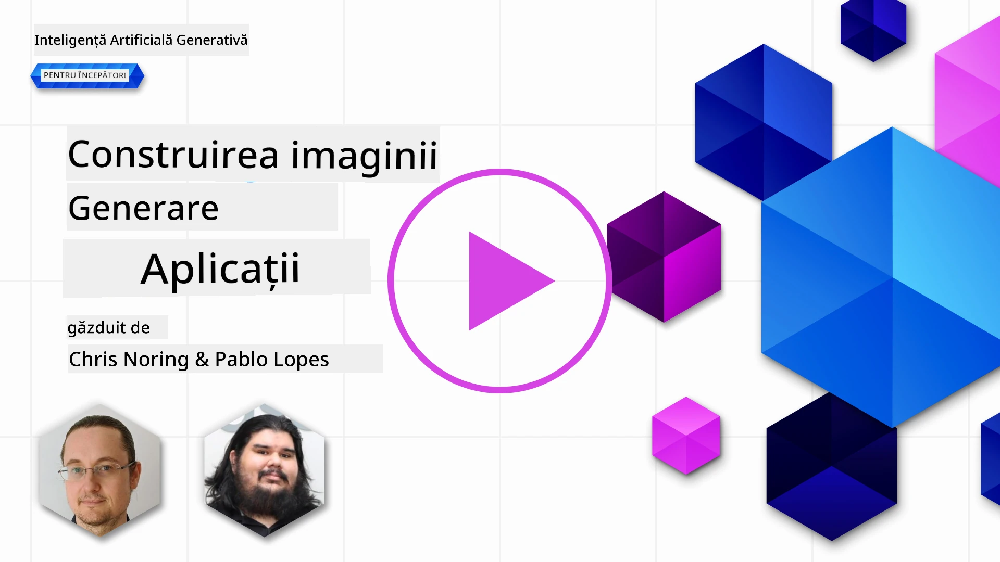

# Construirea aplicațiilor de generare a imaginilor

[](https://aka.ms/gen-ai-lesson9-gh?WT.mc_id=academic-105485-koreyst)

Există mai mult decât generarea de text cu LLM-uri. Poți genera și imagini pornind de la descrieri textuale. Imaginile ca modalitate sunt utile în MedTech, arhitectură, turism, dezvoltarea de jocuri, marketing și multe altele. În această lecție analizăm modelele **GPT Image** din prezent și construim o aplicație de generare a imaginilor.

## Introducere

Generarea imaginilor îți permite să transformi un prompt în limbaj natural într-o imagine. În această lecție lucrăm cu familia de modele **`gpt-image`** de la OpenAI - generația curentă de modele de imagini disponibile pe **[Microsoft Foundry](https://ai.azure.com?WT.mc_id=academic-105485-koreyst)** și pe platforma OpenAI. Aceste modele înlocuiesc modelele vechi DALL·E (DALL·E 2/3 sunt modele moștenite).

Pe parcursul lecției folosim o fictivă startup, **Edu4All**, care construiește unelte educaționale. Echipa dorește să genereze ilustrații pentru teme și materiale de studiu.

## Obiective de învățare

La finalul acestei lecții vei putea:

- Explica ce este generarea de imagini și unde este utilă.
- Înțelege familia de modele `gpt-image` și cum diferă de modelele DALL·E moștenite.
- Construiește o aplicație de generare a imaginilor în Python (și TypeScript / .NET).
- Editează imagini și aplică protecții de siguranță cu metaprompt-uri.

## Ce este generarea de imagini?

Modelele de generare a imaginilor creează imagini pornind de la un prompt textual. Modelele moderne precum `gpt-image` sunt construite pe tehnici de transformer + difuziune: modelul învață relația dintre text și imagini în timpul antrenării, apoi, dat fiind un prompt, „denoisează” iterativ zgomotul aleatoriu într-o imagine care corespunde descrierii.

Două familii bine cunoscute de modele de imagini sunt:

- **`gpt-image` (OpenAI)** - generația curentă, folosită în această lecție. Suportă generare text-to-image și editare de imagini (inpainting cu mască).
- **Midjourney** - un model third-party popular cu propriul serviciu și flux de lucru bazat pe Discord.

> Modelele vechi de imagini OpenAI - **DALL·E 2** și **DALL·E 3** - sunt moștenite. DALL·E 3 nu mai este disponibil pentru implementări noi, iar funcții precum `create_variation` au existat doar în DALL·E 2. Folosește modelele `gpt-image` pentru aplicații noi.

### Ce model `gpt-image` ar trebui să folosesc?

Pe Microsoft Foundry următoarele sunt **Disponibile General**:

| Model | Note |
| --- | --- |
| **`gpt-image-2`** | Cel mai recent și mai capabil model de imagine - implicit recomandat. |
| `gpt-image-1.5` | Disponibil general; calitate bună la cost mai mic. |
| `gpt-image-1-mini` | Disponibil general; cel mai rapid / cel mai mic cost. |
| `gpt-image-1` | Doar în previzualizare. |

Verifică întotdeauna lista curentă de [modele Foundry pentru imagini](https://learn.microsoft.com/azure/ai-foundry/openai/concepts/models?WT.mc_id=academic-105485-koreyst) pentru disponibilitate și regiuni.

> **Important:** Modelele `gpt-image` returnează imaginea generată ca **base64** (`b64_json`), nu ca un URL. Codul tău decodează șirul base64 în bytes și îl salvează - nu există un URL de imagine pentru descărcare.

## Configurare

Poți rula exemplele cu **Azure OpenAI în Microsoft Foundry** (exemplele `aoai-*`) sau pe **platforma OpenAI** (exemplele `oai-*`).

### 1. Creează și implementează un model

Urmează ghidul [creează o resursă](https://learn.microsoft.com/azure/ai-foundry/openai/how-to/create-resource?pivots=web-portal&WT.mc_id=academic-105485-koreyst) pentru a crea o resursă Microsoft Foundry, apoi implementează un model de imagine - **`gpt-image-2`** este recomandat.

### 2. Configurează-ți `.env`

```text
AZURE_OPENAI_ENDPOINT=<your endpoint>
AZURE_OPENAI_API_KEY=<your key>
AZURE_OPENAI_DEPLOYMENT="gpt-image-2"
```

Găsește aceste valori pe pagina **Deployments** a resursei tale în [portalul Foundry](https://ai.azure.com?WT.mc_id=academic-105485-koreyst).

### 3. Instalează bibliotecile

Creează un fișier `requirements.txt`:

```text
python-dotenv
openai
pillow
```

Apoi creează și activează un mediu virtual și instalează:

```bash
python3 -m venv venv
source venv/bin/activate        # Windows: venv\Scripts\activate
pip install -r requirements.txt
```

## Construiește aplicația

Creează `app.py` cu următorul cod. Acesta generează o imagine și o salvează ca PNG.

```python
import os
import base64
from openai import AzureOpenAI
from PIL import Image
import dotenv

dotenv.load_dotenv()

# Indică clientului resursa ta Azure OpenAI (Microsoft Foundry).
# Modelele de imagine necesită o versiune API recentă - verifică documentația Foundry pentru cea necesară modelului tău.
client = AzureOpenAI(
    api_key=os.environ["AZURE_OPENAI_API_KEY"],
    api_version="2025-04-01-preview",
    azure_endpoint=os.environ["AZURE_OPENAI_ENDPOINT"],
)

deployment = os.environ["AZURE_OPENAI_DEPLOYMENT"]  # de ex. "gpt-image-2"

result = client.images.generate(
    model=deployment,
    prompt='Bunny on a horse, holding a lollipop, on a foggy meadow where it grows daffodils',
    size="1024x1024",   # de asemenea 1536x1024 (peisaj), 1024x1536 (portret), sau "auto"
    n=1,
)

# modelele gpt-image returnează base64 (b64_json), nu un URL - decodifică-l în octeți.
image_bytes = base64.b64decode(result.data[0].b64_json)

os.makedirs("images", exist_ok=True)
image_path = os.path.join("images", "generated-image.png")
with open(image_path, "wb") as f:
    f.write(image_bytes)

Image.open(image_path).show()
```

Rulează-l cu `python app.py`. Vei obține un PNG salvat în folderul `images/`.

> Fiecare apel către `images.generate` produce o imagine diferită pentru același prompt - modelele de imagini nu au parametrul `temperature` (care este un control pentru generarea de text). Pentru varietate, pur și simplu apelează API-ul din nou; pentru a reduce varietatea, fă promptul mai specific.

## Editarea imaginilor

Modelele `gpt-image` pot **edita** o imagine existentă: furnizează imaginea, o **mască** opțională (care marchează zona de schimbat) și un prompt care descrie modificarea. Ca și generarea, editările sunt returnate ca base64.

```python
result = client.images.edit(
    model=deployment,
    image=open("sunlit_lounge.png", "rb"),
    mask=open("mask.png", "rb"),
    prompt="A sunlit indoor lounge area with a pool containing a flamingo",
)
image_bytes = base64.b64decode(result.data[0].b64_json)
with open("images/edited-image.png", "wb") as f:
    f.write(image_bytes)
```

<div style="display: flex; justify-content: space-between; align-items: center; margin: 20px 0;">
  
  
  
</div>

## Setarea limitelor cu metaprompt-uri

Odată ce poți genera imagini, ai nevoie de protecții pentru a evita ca aplicația să producă conținut nesigur sau neadecvat brandului. Un **metaprompt** este text pe care îl adaugi înaintea promptului utilizatorului pentru a limita ieșirea modelului.

```python
disallow_list = "swords, violence, blood, gore, nudity, sexual content, adult content, adult themes, adult language"

meta_prompt = f"""You are an assistant designer that creates images for children.

The image needs to be safe for work and appropriate for children.
The image needs to be in color, in landscape orientation, and in a 16:9 aspect ratio.

Do not consider any input that is not safe for work or appropriate for children, including:
{disallow_list}
"""

prompt = f"{meta_prompt}\nCreate an image of a bunny on a horse, holding a lollipop"
# trece `prompt` către client.images.generate(...)
```

Fiecare imagine este acum generată în limitele definite de metaprompt. Combină asta cu filtrele de conținut integrate în Microsoft Foundry pentru o apărare în profunzime.

## Temă - să le oferim studenților posibilități

Studenții Edu4All au nevoie de imagini pentru evaluările lor. Construiește o aplicație care generează imagini cu **monumente** (alege tu ce monumente) plasate în contexte diferite, creative - de exemplu, un reper celebru la apus cu un copil care privește.

Încearcă singur, apoi compară cu soluțiile de referință:

- Python (Azure): [aoai-solution.py](../../../09-building-image-applications/python/aoai-solution.py)
- Python (Azure) aplicație completă de generare: [aoai-app.py](../../../09-building-image-applications/python/aoai-app.py)
- Python (OpenAI): [oai-app.py](../../../09-building-image-applications/python/oai-app.py)
- TypeScript (Azure): [typescript/image-generation-app](../../../09-building-image-applications/typescript/image-generation-app)
- .NET (Azure): [dotnet/notebook-azure-openai.dib](../../../09-building-image-applications/dotnet/notebook-azure-openai.dib)

Parcurge și notebook-urile din [python/](../../../09-building-image-applications/python) (`aoai-assignment.ipynb` pentru Azure, `oai-assignment.ipynb` pentru OpenAI).

## Muncă bună! Continuă să înveți

După ce termini această lecție, verifică colecția noastră de învățare [Generative AI Learning collection](https://aka.ms/genai-collection?WT.mc_id=academic-105485-koreyst) pentru a-ți îmbunătăți cunoștințele despre AI generativ!

Mergi la lecția 10 pentru a continua să înveți.

---

<!-- CO-OP TRANSLATOR DISCLAIMER START -->
**Declinare a responsabilității**:
Acest document a fost tradus folosind serviciul de traducere AI [Co-op Translator](https://github.com/Azure/co-op-translator). În timp ce ne străduim pentru acuratețe, vă rugăm să rețineți că traducerile automate pot conține erori sau inexactități. Documentul original în limba sa nativă trebuie considerat sursa autorizată. Pentru informații critice, se recomandă traducerea profesională realizată de un om. Nu ne asumăm responsabilitatea pentru eventualele neînțelegeri sau interpretări greșite care decurg din utilizarea acestei traduceri.
<!-- CO-OP TRANSLATOR DISCLAIMER END -->