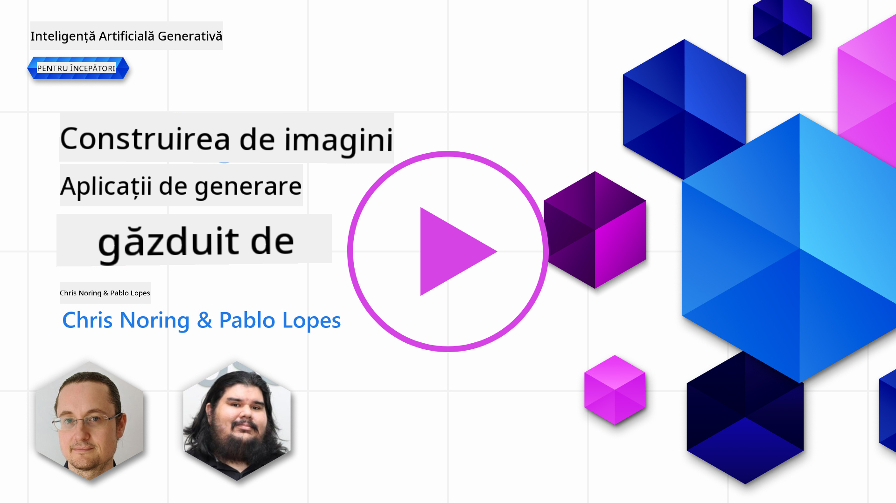

<!--
CO_OP_TRANSLATOR_METADATA:
{
  "original_hash": "1a7fd0f95f9eb673b79da47c0814f4d4",
  "translation_date": "2025-07-09T13:33:21+00:00",
  "source_file": "09-building-image-applications/README.md",
  "language_code": "ro"
}
-->
# Construirea aplicațiilor de generare a imaginilor

[](https://aka.ms/gen-ai-lesson9-gh?WT.mc_id=academic-105485-koreyst)

LLM-urile nu se limitează doar la generarea de text. Este posibil să generăm și imagini pornind de la descrieri textuale. Utilizarea imaginilor ca modalitate poate fi extrem de utilă în diverse domenii, de la MedTech, arhitectură, turism, dezvoltare de jocuri și multe altele. În acest capitol, vom explora cele două modele de generare a imaginilor cele mai populare, DALL-E și Midjourney.

## Introducere

În această lecție vom aborda:

- Generarea imaginilor și de ce este utilă.
- DALL-E și Midjourney, ce sunt și cum funcționează.
- Cum să construiești o aplicație de generare a imaginilor.

## Obiective de învățare

După ce vei parcurge această lecție, vei putea:

- Să construiești o aplicație de generare a imaginilor.
- Să definești limite pentru aplicația ta folosind meta prompturi.
- Să lucrezi cu DALL-E și Midjourney.

## De ce să construiești o aplicație de generare a imaginilor?

Aplicațiile de generare a imaginilor sunt o modalitate excelentă de a explora capabilitățile AI-ului generativ. Ele pot fi folosite, de exemplu, pentru:

- **Editare și sinteză de imagini**. Poți genera imagini pentru diverse cazuri de utilizare, cum ar fi editarea și sinteza imaginilor.

- **Aplicabilitate în diverse industrii**. Pot fi folosite pentru a genera imagini în industrii precum MedTech, turism, dezvoltare de jocuri și altele.

## Scenariu: Edu4All

Ca parte a acestei lecții, vom continua să lucrăm cu startup-ul nostru, Edu4All. Studenții vor crea imagini pentru evaluările lor; ce imagini vor fi exact depinde de ei, dar ar putea fi ilustrații pentru propriul lor basm, crearea unui personaj nou pentru povestea lor sau ajutor pentru a-și vizualiza ideile și conceptele.

Iată ce ar putea genera studenții Edu4All, de exemplu, dacă lucrează în clasă pe tema monumentelor:


folosind un prompt precum

> „Câine lângă Turnul Eiffel în lumina dimineții”

## Ce sunt DALL-E și Midjourney?

[DALL-E](https://openai.com/dall-e-2?WT.mc_id=academic-105485-koreyst) și [Midjourney](https://www.midjourney.com/?WT.mc_id=academic-105485-koreyst) sunt două dintre cele mai populare modele de generare a imaginilor, care îți permit să folosești prompturi pentru a genera imagini.

### DALL-E

Să începem cu DALL-E, un model AI generativ care creează imagini pornind de la descrieri textuale.

> [DALL-E este o combinație a două modele, CLIP și diffused attention](https://towardsdatascience.com/openais-dall-e-and-clip-101-a-brief-introduction-3a4367280d4e?WT.mc_id=academic-105485-koreyst).

- **CLIP** este un model care generează embeddings, adică reprezentări numerice ale datelor, din imagini și text.

- **Diffused attention** este un model care generează imagini pornind de la embeddings. DALL-E este antrenat pe un set de date cu imagini și texte și poate fi folosit pentru a genera imagini din descrieri textuale. De exemplu, DALL-E poate genera imagini cu o pisică cu pălărie sau un câine cu mohawk.

### Midjourney

Midjourney funcționează similar cu DALL-E, generând imagini din prompturi textuale. Midjourney poate fi folosit pentru a genera imagini cu prompturi precum „o pisică cu pălărie” sau „un câine cu mohawk”.

  
_Imagine preluată de pe Wikipedia, generată de Midjourney_

## Cum funcționează DALL-E și Midjourney

Mai întâi, [DALL-E](https://arxiv.org/pdf/2102.12092.pdf?WT.mc_id=academic-105485-koreyst). DALL-E este un model AI generativ bazat pe arhitectura transformer, cu un _transformer autoregresiv_.

Un _transformer autoregresiv_ definește modul în care un model generează imagini din descrieri textuale, generând câte un pixel pe rând, folosind pixelii generați pentru a genera următorul pixel. Procesul trece prin mai multe straturi într-o rețea neuronală, până când imaginea este completă.

Prin acest proces, DALL-E controlează atributele, obiectele, caracteristicile și altele din imaginea generată. Totuși, DALL-E 2 și 3 oferă un control mai mare asupra imaginii generate.

## Construirea primei tale aplicații de generare a imaginilor

Ce este necesar pentru a construi o aplicație de generare a imaginilor? Ai nevoie de următoarele biblioteci:

- **python-dotenv**, este recomandat să folosești această bibliotecă pentru a păstra secretele într-un fișier _.env_, separat de cod.
- **openai**, această bibliotecă este folosită pentru a interacționa cu API-ul OpenAI.
- **pillow**, pentru a lucra cu imagini în Python.
- **requests**, pentru a face cereri HTTP.

1. Creează un fișier _.env_ cu următorul conținut:

   ```text
   AZURE_OPENAI_ENDPOINT=<your endpoint>
   AZURE_OPENAI_API_KEY=<your key>
   ```

   Găsește aceste informații în Portalul Azure, în secțiunea „Keys and Endpoint” pentru resursa ta.

1. Adună bibliotecile de mai sus într-un fișier numit _requirements.txt_, astfel:

   ```text
   python-dotenv
   openai
   pillow
   requests
   ```

1. Apoi, creează un mediu virtual și instalează bibliotecile:

   ```bash
   python3 -m venv venv
   source venv/bin/activate
   pip install -r requirements.txt
   ```

   Pentru Windows, folosește următoarele comenzi pentru a crea și activa mediul virtual:

   ```bash
   python3 -m venv venv
   venv\Scripts\activate.bat
   ```

1. Adaugă următorul cod într-un fișier numit _app.py_:

   ```python
   import openai
   import os
   import requests
   from PIL import Image
   import dotenv

   # import dotenv
   dotenv.load_dotenv()

   # Get endpoint and key from environment variables
   openai.api_base = os.environ['AZURE_OPENAI_ENDPOINT']
   openai.api_key = os.environ['AZURE_OPENAI_API_KEY']

   # Assign the API version (DALL-E is currently supported for the 2023-06-01-preview API version only)
   openai.api_version = '2023-06-01-preview'
   openai.api_type = 'azure'


   try:
       # Create an image by using the image generation API
       generation_response = openai.Image.create(
           prompt='Bunny on horse, holding a lollipop, on a foggy meadow where it grows daffodils',    # Enter your prompt text here
           size='1024x1024',
           n=2,
           temperature=0,
       )
       # Set the directory for the stored image
       image_dir = os.path.join(os.curdir, 'images')

       # If the directory doesn't exist, create it
       if not os.path.isdir(image_dir):
           os.mkdir(image_dir)

       # Initialize the image path (note the filetype should be png)
       image_path = os.path.join(image_dir, 'generated-image.png')

       # Retrieve the generated image
       image_url = generation_response["data"][0]["url"]  # extract image URL from response
       generated_image = requests.get(image_url).content  # download the image
       with open(image_path, "wb") as image_file:
           image_file.write(generated_image)

       # Display the image in the default image viewer
       image = Image.open(image_path)
       image.show()

   # catch exceptions
   except openai.InvalidRequestError as err:
       print(err)

   ```

Să explicăm acest cod:

- Mai întâi, importăm bibliotecile necesare, inclusiv biblioteca OpenAI, dotenv, requests și Pillow.

  ```python
  import openai
  import os
  import requests
  from PIL import Image
  import dotenv
  ```

- Apoi, încărcăm variabilele de mediu din fișierul _.env_.

  ```python
  # import dotenv
  dotenv.load_dotenv()
  ```

- După aceea, setăm endpoint-ul, cheia pentru API-ul OpenAI, versiunea și tipul.

  ```python
  # Get endpoint and key from environment variables
  openai.api_base = os.environ['AZURE_OPENAI_ENDPOINT']
  openai.api_key = os.environ['AZURE_OPENAI_API_KEY']

  # add version and type, Azure specific
  openai.api_version = '2023-06-01-preview'
  openai.api_type = 'azure'
  ```

- Urmează generarea imaginii:

  ```python
  # Create an image by using the image generation API
  generation_response = openai.Image.create(
      prompt='Bunny on horse, holding a lollipop, on a foggy meadow where it grows daffodils',    # Enter your prompt text here
      size='1024x1024',
      n=2,
      temperature=0,
  )
  ```

  Codul de mai sus răspunde cu un obiect JSON care conține URL-ul imaginii generate. Putem folosi URL-ul pentru a descărca imaginea și a o salva într-un fișier.

- În final, deschidem imaginea și o afișăm cu vizualizatorul standard de imagini:

  ```python
  image = Image.open(image_path)
  image.show()
  ```

### Mai multe detalii despre generarea imaginii

Să analizăm codul care generează imaginea în detaliu:

```python
generation_response = openai.Image.create(
        prompt='Bunny on horse, holding a lollipop, on a foggy meadow where it grows daffodils',    # Enter your prompt text here
        size='1024x1024',
        n=2,
        temperature=0,
    )
```

- **prompt** este textul folosit pentru a genera imaginea. În acest caz, folosim promptul „Iepuraș pe cal, ținând un acadea, pe o pajiște cețoasă unde cresc narcise”.
- **size** este dimensiunea imaginii generate. În acest caz, generăm o imagine de 1024x1024 pixeli.
- **n** este numărul de imagini generate. În acest caz, generăm două imagini.
- **temperature** este un parametru care controlează gradul de aleatoriu al rezultatului unui model AI generativ. Temperatura este o valoare între 0 și 1, unde 0 înseamnă că rezultatul este determinist, iar 1 înseamnă că rezultatul este aleatoriu. Valoarea implicită este 0.7.

Există și alte lucruri pe care le poți face cu imaginile, pe care le vom acoperi în secțiunea următoare.

## Capacități suplimentare ale generării imaginilor

Până acum ai văzut cum am generat o imagine folosind câteva linii de cod în Python. Totuși, există mai multe lucruri pe care le poți face cu imaginile.

Poți face și următoarele:

- **Efectuarea de editări**. Furnizând o imagine existentă, o mască și un prompt, poți modifica o imagine. De exemplu, poți adăuga ceva într-o anumită zonă a imaginii. Imaginează-ți imaginea cu iepurașul, poți adăuga o pălărie iepurașului. Cum faci asta? Furnizând imaginea, o mască (care identifică zona ce trebuie modificată) și un prompt text care spune ce trebuie făcut.

  ```python
  response = openai.Image.create_edit(
    image=open("base_image.png", "rb"),
    mask=open("mask.png", "rb"),
    prompt="An image of a rabbit with a hat on its head.",
    n=1,
    size="1024x1024"
  )
  image_url = response['data'][0]['url']
  ```

  Imaginea de bază ar conține doar iepurașul, dar imaginea finală va avea pălăria pe iepuraș.

- **Crearea de variații**. Ideea este să iei o imagine existentă și să ceri crearea unor variații. Pentru a crea o variație, furnizezi o imagine și un prompt text, apoi folosești codul astfel:

  ```python
  response = openai.Image.create_variation(
    image=open("bunny-lollipop.png", "rb"),
    n=1,
    size="1024x1024"
  )
  image_url = response['data'][0]['url']
  ```

  > Notă, acest lucru este suportat doar de OpenAI

## Temperatura

Temperatura este un parametru care controlează gradul de aleatoriu al rezultatului unui model AI generativ. Temperatura este o valoare între 0 și 1, unde 0 înseamnă că rezultatul este determinist, iar 1 înseamnă că rezultatul este aleatoriu. Valoarea implicită este 0.7.

Să vedem un exemplu despre cum funcționează temperatura, rulând acest prompt de două ori:

> Prompt: „Iepuraș pe cal, ținând un acadea, pe o pajiște cețoasă unde cresc narcise”


Acum să rulăm același prompt doar ca să vedem că nu vom obține aceeași imagine de două ori:


După cum vezi, imaginile sunt asemănătoare, dar nu identice. Să încercăm să schimbăm valoarea temperaturii la 0.1 și să vedem ce se întâmplă:

```python
 generation_response = openai.Image.create(
        prompt='Bunny on horse, holding a lollipop, on a foggy meadow where it grows daffodils',    # Enter your prompt text here
        size='1024x1024',
        n=2
    )
```

### Schimbarea temperaturii

Să încercăm să facem răspunsul mai determinist. Am observat din cele două imagini generate că în prima imagine apare un iepuraș, iar în a doua un cal, deci imaginile diferă mult.

Așadar, să schimbăm codul și să setăm temperatura la 0, astfel:

```python
generation_response = openai.Image.create(
        prompt='Bunny on horse, holding a lollipop, on a foggy meadow where it grows daffodils',    # Enter your prompt text here
        size='1024x1024',
        n=2,
        temperature=0
    )
```

Acum, când rulezi acest cod, vei obține aceste două imagini:

- 
- 

Aici poți observa clar cum imaginile seamănă mult mai mult între ele.

## Cum să definești limite pentru aplicația ta folosind metaprompturi

Cu demo-ul nostru, putem deja genera imagini pentru clienții noștri. Totuși, trebuie să creăm niște limite pentru aplicația noastră.

De exemplu, nu vrem să generăm imagini care nu sunt potrivite pentru locul de muncă sau care nu sunt adecvate pentru copii.

Putem face asta folosind _metaprompturi_. Metaprompturile sunt prompturi text folosite pentru a controla rezultatul unui model AI generativ. De exemplu, putem folosi metaprompturi pentru a controla rezultatul și a ne asigura că imaginile generate sunt sigure pentru locul de muncă sau potrivite pentru copii.

### Cum funcționează?

Cum funcționează metaprompturile?

Metaprompturile sunt prompturi text folosite pentru a controla rezultatul unui model AI generativ, ele sunt plasate înaintea promptului text și sunt folosite pentru a controla rezultatul modelului, fiind integrate în aplicații pentru a controla ieșirea modelului. Astfel, promptul de intrare și metapromptul sunt încapsulate într-un singur prompt text.

Un exemplu de metaprompt ar fi următorul:

```text
You are an assistant designer that creates images for children.

The image needs to be safe for work and appropriate for children.

The image needs to be in color.

The image needs to be in landscape orientation.

The image needs to be in a 16:9 aspect ratio.

Do not consider any input from the following that is not safe for work or appropriate for children.

(Input)

```

Acum, să vedem cum putem folosi metaprompturile în demo-ul nostru.

```python
disallow_list = "swords, violence, blood, gore, nudity, sexual content, adult content, adult themes, adult language, adult humor, adult jokes, adult situations, adult"

meta_prompt =f"""You are an assistant designer that creates images for children.

The image needs to be safe for work and appropriate for children.

The image needs to be in color.

The image needs to be in landscape orientation.

The image needs to be in a 16:9 aspect ratio.

Do not consider any input from the following that is not safe for work or appropriate for children.
{disallow_list}
"""

prompt = f"{meta_prompt}
Create an image of a bunny on a horse, holding a lollipop"

# TODO add request to generate image
```

Din promptul de mai sus, poți vedea cum toate imaginile generate iau în considerare metapromptul.

## Tema - să dăm putere studenților

Am introdus Edu4All la începutul acestei lecții. Acum este momentul să le permitem studenților să genereze imagini pentru evaluările lor.

Studenții vor crea imagini pentru evaluările lor care să conțină monumente, iar ce monumente vor fi exact depinde de ei. Studenții sunt încurajați să folosească creativitatea pentru a plasa aceste monumente în contexte diferite.

## Soluție

Iată o posibilă soluție:

```python
import openai
import os
import requests
from PIL import Image
import dotenv

# import dotenv
dotenv.load_dotenv()

# Get endpoint and key from environment variables
openai.api_base = "<replace with endpoint>"
openai.api_key = "<replace with api key>"

# Assign the API version (DALL-E is currently supported for the 2023-06-01-preview API version only)
openai.api_version = '2023-06-01-preview'
openai.api_type = 'azure'

disallow_list = "swords, violence, blood, gore, nudity, sexual content, adult content, adult themes, adult language, adult humor, adult jokes, adult situations, adult"

meta_prompt = f"""You are an assistant designer that creates images for children.

The image needs to be safe for work and appropriate for children.

The image needs to be in color.

The image needs to be in landscape orientation.

The image needs to be in a 16:9 aspect ratio.

Do not consider any input from the following that is not safe for work or appropriate for children.
{disallow_list}"""

prompt = f"""{meta_prompt}
Generate monument of the Arc of Triumph in Paris, France, in the evening light with a small child holding a Teddy looks on.
""""

try:
    # Create an image by using the image generation API
    generation_response = openai.Image.create(
        prompt=prompt,    # Enter your prompt text here
        size='1024x1024',
        n=2,
        temperature=0,
    )
    # Set the directory for the stored image
    image_dir = os.path.join(os.curdir, 'images')

    # If the directory doesn't exist, create it
    if not os.path.isdir(image_dir):
        os.mkdir(image_dir)

    # Initialize the image path (note the filetype should be png)
    image_path = os.path.join(image_dir, 'generated-image.png')

    # Retrieve the generated image
    image_url = generation_response["data"][0]["url"]  # extract image URL from response
    generated_image = requests.get(image_url).content  # download the image
    with open(image_path, "wb") as image_file:
        image_file.write(generated_image)

    # Display the image in the default image viewer
    image = Image.open(image_path)
    image.show()

# catch exceptions
except openai.InvalidRequestError as err:
    print(err)
```

## Bravo! Continuă să înveți

După ce ai terminat această lecție, consultă colecția noastră [Generative AI Learning collection](https://aka.ms/genai-collection?WT.mc_id=academic-105485-koreyst) pentru a-ți continua dezvoltarea cunoștințelor despre AI generativ!

Mergi la Lecția 10, unde vom vedea cum să [construim aplicații AI cu low-code](../10-building-low-code-ai-applications/README.md?WT.mc_id=academic-105485-koreyst)

**Declinare de responsabilitate**:  
Acest document a fost tradus folosind serviciul de traducere AI [Co-op Translator](https://github.com/Azure/co-op-translator). Deși ne străduim pentru acuratețe, vă rugăm să rețineți că traducerile automate pot conține erori sau inexactități. Documentul original în limba sa nativă trebuie considerat sursa autorizată. Pentru informații critice, se recomandă traducerea profesională realizată de un specialist uman. Nu ne asumăm răspunderea pentru eventualele neînțelegeri sau interpretări greșite rezultate din utilizarea acestei traduceri.