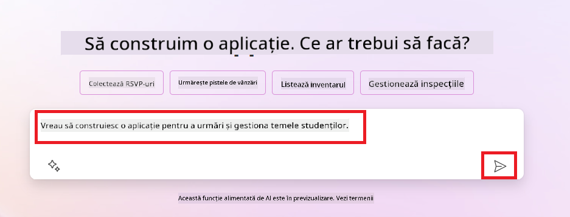
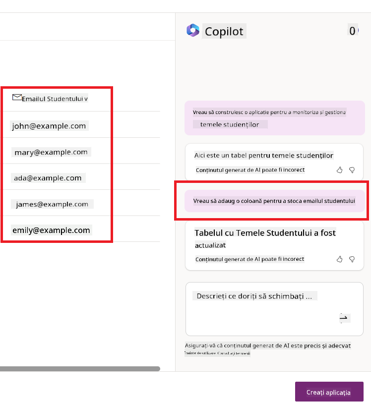
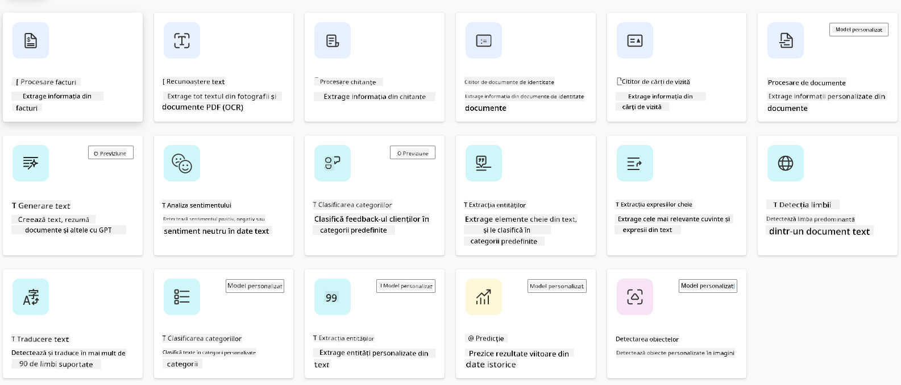
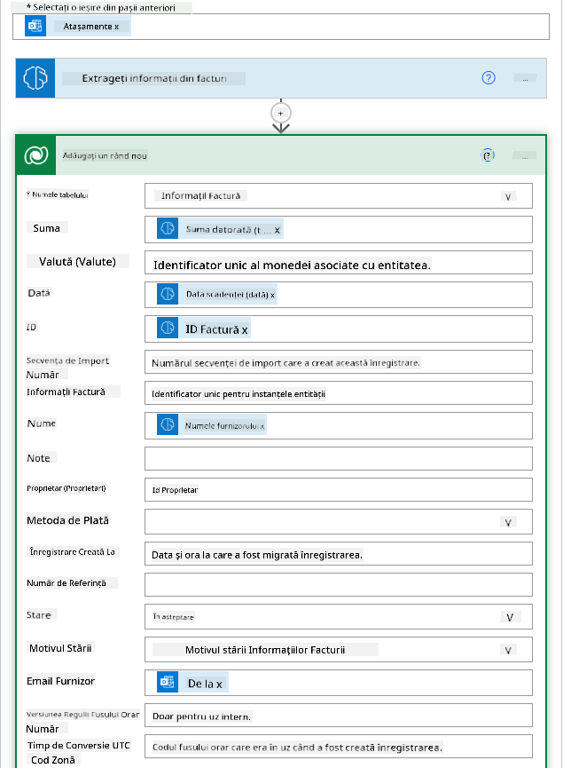

<!--
CO_OP_TRANSLATOR_METADATA:
{
  "original_hash": "f5ff3b6204a695a117d6f452403c95f7",
  "translation_date": "2025-05-19T21:06:18+00:00",
  "source_file": "10-building-low-code-ai-applications/README.md",
  "language_code": "ro"
}
-->
# Construirea aplicațiilor AI cu cod redus

> _(Click pe imaginea de mai sus pentru a viziona videoclipul acestei lecții)_

## Introducere

Acum că am învățat cum să construim aplicații de generare de imagini, să discutăm despre codul redus. AI generativ poate fi utilizat într-o varietate de domenii, inclusiv cod redus, dar ce este codul redus și cum putem adăuga AI la acesta?

Construirea de aplicații și soluții a devenit mai ușoară pentru dezvoltatorii tradiționali și cei care nu sunt dezvoltatori prin utilizarea platformelor de dezvoltare cu cod redus. Platformele de dezvoltare cu cod redus îți permit să construiești aplicații și soluții cu puțin sau deloc cod. Acest lucru este realizat prin furnizarea unui mediu de dezvoltare vizual care îți permite să tragi și să plasezi componente pentru a construi aplicații și soluții. Acest lucru îți permite să construiești aplicații și soluții mai rapid și cu mai puține resurse. În această lecție, vom aprofunda modul în care să utilizăm codul redus și cum să îmbunătățim dezvoltarea cu cod redus cu AI folosind Power Platform.

Power Platform oferă organizațiilor oportunitatea de a împuternici echipele să-și construiască propriile soluții printr-un mediu intuitiv cu cod redus sau fără cod. Acest mediu ajută la simplificarea procesului de construire a soluțiilor. Cu Power Platform, soluțiile pot fi construite în zile sau săptămâni, în loc de luni sau ani. Power Platform constă în cinci produse cheie: Power Apps, Power Automate, Power BI, Power Pages și Copilot Studio.

Această lecție acoperă:

- Introducere în AI generativ în Power Platform
- Introducere în Copilot și cum să-l folosim
- Utilizarea AI generativ pentru a construi aplicații și fluxuri în Power Platform
- Înțelegerea modelelor AI în Power Platform cu AI Builder

## Obiective de învățare

Până la sfârșitul acestei lecții, vei fi capabil să:

- Înțelegi cum funcționează Copilot în Power Platform.

- Construiești o aplicație de urmărire a temelor pentru studenți pentru startup-ul nostru educațional.

- Construiești un flux de procesare a facturilor care folosește AI pentru a extrage informații din facturi.

- Aplici cele mai bune practici atunci când folosești modelul AI Create Text cu GPT.

Instrumentele și tehnologiile pe care le vei folosi în această lecție sunt:

- **Power Apps**, pentru aplicația de urmărire a temelor pentru studenți, care oferă un mediu de dezvoltare cu cod redus pentru construirea de aplicații pentru a urmări, gestiona și interacționa cu datele.

- **Dataverse**, pentru stocarea datelor pentru aplicația de urmărire a temelor pentru studenți, unde Dataverse va oferi o platformă de date cu cod redus pentru stocarea datelor aplicației.

- **Power Automate**, pentru fluxul de procesare a facturilor, unde vei avea un mediu de dezvoltare cu cod redus pentru construirea de fluxuri de lucru pentru a automatiza procesul de procesare a facturilor.

- **AI Builder**, pentru modelul AI de procesare a facturilor, unde vei folosi modele AI preconstruite pentru a procesa facturile pentru startup-ul nostru.

## AI generativ în Power Platform

Îmbunătățirea dezvoltării și aplicațiilor cu cod redus cu AI generativ este o zonă cheie de interes pentru Power Platform. Scopul este de a permite tuturor să construiască aplicații, site-uri, tablouri de bord și să automatizeze procesele cu AI, _fără a necesita expertiză în știința datelor_. Acest scop este realizat prin integrarea AI generativ în experiența de dezvoltare cu cod redus în Power Platform sub forma Copilot și AI Builder.

### Cum funcționează acest lucru?

Copilot este un asistent AI care îți permite să construiești soluții Power Platform descriindu-ți cerințele într-o serie de pași conversaționali folosind limbaj natural. Poți, de exemplu, să instruiți asistentul AI să spună ce câmpuri va folosi aplicația ta și acesta va crea atât aplicația cât și modelul de date subiacente sau ai putea specifica cum să configurezi un flux în Power Automate.

Poți utiliza funcționalitățile conduse de Copilot ca o caracteristică în ecranele aplicației tale pentru a permite utilizatorilor să descopere informații prin interacțiuni conversaționale.

AI Builder este o capacitate AI cu cod redus disponibilă în Power Platform care îți permite să utilizezi modele AI pentru a te ajuta să automatizezi procesele și să prezici rezultatele. Cu AI Builder poți aduce AI în aplicațiile și fluxurile tale care se conectează la datele tale din Dataverse sau din diverse surse de date cloud, cum ar fi SharePoint, OneDrive sau Azure.

Copilot este disponibil în toate produsele Power Platform: Power Apps, Power Automate, Power BI, Power Pages și Power Virtual Agents. AI Builder este disponibil în Power Apps și Power Automate. În această lecție, ne vom concentra pe modul în care să folosim Copilot și AI Builder în Power Apps și Power Automate pentru a construi o soluție pentru startup-ul nostru educațional.

### Copilot în Power Apps

Ca parte a Power Platform, Power Apps oferă un mediu de dezvoltare cu cod redus pentru construirea de aplicații pentru a urmări, gestiona și interacționa cu datele. Este un pachet de servicii de dezvoltare a aplicațiilor cu o platformă de date scalabilă și capacitatea de a se conecta la servicii cloud și date locale. Power Apps îți permite să construiești aplicații care rulează pe browsere, tablete și telefoane și pot fi partajate cu colegii. Power Apps introduce utilizatorii în dezvoltarea aplicațiilor cu o interfață simplă, astfel încât fiecare utilizator de afaceri sau dezvoltator profesionist să poată construi aplicații personalizate. Experiența de dezvoltare a aplicațiilor este, de asemenea, îmbunătățită cu AI generativ prin Copilot.

Funcția asistentului AI Copilot în Power Apps îți permite să descrii ce tip de aplicație ai nevoie și ce informații vrei ca aplicația ta să urmărească, colecteze sau să afișeze. Copilot generează apoi o aplicație Canvas responsivă bazată pe descrierea ta. Poți personaliza aplicația pentru a se potrivi nevoilor tale. Copilotul AI generează și sugerează o tabelă Dataverse cu câmpurile de care ai nevoie pentru a stoca datele pe care vrei să le urmărești și câteva date de exemplu. Vom analiza ce este Dataverse și cum poți să-l folosești în Power Apps în această lecție mai târziu. Poți apoi personaliza tabelul pentru a se potrivi nevoilor tale folosind funcția asistentului AI Copilot prin pași conversaționali. Această funcție este disponibilă direct de pe ecranul principal Power Apps.

### Copilot în Power Automate

Ca parte a Power Platform, Power Automate le permite utilizatorilor să creeze fluxuri de lucru automate între aplicații și servicii. Ajută la automatizarea proceselor de afaceri repetitive, cum ar fi comunicarea, colectarea de date și aprobările deciziilor. Interfața sa simplă permite utilizatorilor cu orice competență tehnică (de la începători la dezvoltatori experimentați) să automatizeze sarcinile de lucru. Experiența de dezvoltare a fluxurilor de lucru este, de asemenea, îmbunătățită cu AI generativ prin Copilot.

Funcția asistentului AI Copilot în Power Automate îți permite să descrii ce tip de flux ai nevoie și ce acțiuni vrei ca fluxul tău să efectueze. Copilot generează apoi un flux bazat pe descrierea ta. Poți personaliza fluxul pentru a se potrivi nevoilor tale. Copilotul AI generează și sugerează acțiunile de care ai nevoie pentru a efectua sarcina pe care vrei să o automatizezi. Vom analiza ce sunt fluxurile și cum le poți folosi în Power Automate în această lecție mai târziu. Poți apoi personaliza acțiunile pentru a se potrivi nevoilor tale folosind funcția asistentului AI Copilot prin pași conversaționali. Această funcție este disponibilă direct de pe ecranul principal Power Automate.

## Temă: Gestionarea temelor pentru studenți și facturilor pentru startup-ul nostru, folosind Copilot

Startup-ul nostru oferă cursuri online studenților. Startup-ul a crescut rapid și acum se luptă să țină pasul cu cererea pentru cursurile sale. Startup-ul te-a angajat ca dezvoltator Power Platform pentru a-i ajuta să construiască o soluție cu cod redus pentru a-i ajuta să gestioneze temele studenților și facturile. Soluția lor ar trebui să îi ajute să urmărească și să gestioneze temele studenților printr-o aplicație și să automatizeze procesul de procesare a facturilor printr-un flux de lucru. Ai fost rugat să folosești AI generativ pentru a dezvolta soluția.

Când începi să folosești Copilot, poți utiliza [Biblioteca de prompturi Copilot Power Platform](https://github.com/pnp/powerplatform-prompts?WT.mc_id=academic-109639-somelezediko) pentru a începe cu prompturile. Această bibliotecă conține o listă de prompturi pe care le poți folosi pentru a construi aplicații și fluxuri cu Copilot. Poți, de asemenea, folosi prompturile din bibliotecă pentru a-ți face o idee despre cum să îți descrii cerințele către Copilot.

### Construiește o aplicație de urmărire a temelor pentru studenți pentru startup-ul nostru

Educațorii de la startup-ul nostru s-au luptat să țină evidența temelor studenților. Ei au folosit un tabel pentru a urmări temele, dar acest lucru a devenit dificil de gestionat pe măsură ce numărul de studenți a crescut. Ei te-au rugat să construiești o aplicație care să-i ajute să urmărească și să gestioneze temele studenților. Aplicația ar trebui să le permită să adauge teme noi, să vizualizeze temele, să actualizeze temele și să șteargă temele. Aplicația ar trebui să permită, de asemenea, educatorilor și studenților să vizualizeze temele care au fost notate și cele care nu au fost notate.

Vei construi aplicația folosind Copilot în Power Apps urmând pașii de mai jos:

1. Navighează la ecranul principal [Power Apps](https://make.powerapps.com?WT.mc_id=academic-105485-koreyst).

1. Folosește zona de text de pe ecranul principal pentru a descrie aplicația pe care vrei să o construiești. De exemplu, **_Vreau să construiesc o aplicație pentru a urmări și gestiona temele studenților_**. Apasă pe butonul **Trimite** pentru a trimite promptul către AI Copilot.

1. AI Copilot va sugera o tabelă Dataverse cu câmpurile de care ai nevoie pentru a stoca datele pe care vrei să le urmărești și câteva date de exemplu. Poți apoi personaliza tabelul pentru a se potrivi nevoilor tale folosind funcția asistentului AI Copilot prin pași conversaționali.

   > **Important**: Dataverse este platforma de date subiacente pentru Power Platform. Este o platformă de date cu cod redus pentru stocarea datelor aplicației. Este un serviciu complet gestionat care stochează în siguranță datele în Cloud-ul Microsoft și este aprovizionat în mediul tău Power Platform. Vine cu capacități de guvernare a datelor integrate, cum ar fi clasificarea datelor, linia de date, controlul accesului fin și multe altele. Poți afla mai multe despre Dataverse [aici](https://docs.microsoft.com/powerapps/maker/data-platform/data-platform-intro?WT.mc_id=academic-109639-somelezediko).

   

1. Educatorii doresc să trimită emailuri studenților care și-au trimis temele pentru a-i ține la curent cu progresul temelor lor. Poți folosi Copilot pentru a adăuga un nou câmp în tabel pentru a stoca emailul studentului. De exemplu, poți folosi următorul prompt pentru a adăuga un nou câmp în tabel: **_Vreau să adaug o coloană pentru a stoca emailul studentului_**. Apasă pe butonul **Trimite** pentru a trimite promptul către AI Copilot.

1. AI Copilot va genera un nou câmp și poți apoi personaliza câmpul pentru a se potrivi nevoilor tale.

1. După ce ai terminat cu tabelul, apasă pe butonul **Creează aplicația** pentru a crea aplicația.

1. AI Copilot va genera o aplicație Canvas responsivă bazată pe descrierea ta. Poți apoi personaliza aplicația pentru a se potrivi nevoilor tale.

1. Pentru ca educatorii să trimită emailuri studenților, poți folosi Copilot pentru a adăuga un nou ecran în aplicație. De exemplu, poți folosi următorul prompt pentru a adăuga un nou ecran în aplicație: **_Vreau să adaug un ecran pentru a trimite emailuri studenților_**. Apasă pe butonul **Trimite** pentru a trimite promptul către AI Copilot.

1. AI Copilot va genera un nou ecran și poți apoi personaliza ecranul pentru a se potrivi nevoilor tale.

1. După ce ai terminat cu aplicația, apasă pe butonul **Salvează** pentru a salva aplicația.

1. Pentru a partaja aplicația cu educatorii, apasă pe butonul **Partajează** și apoi apasă din nou pe butonul **Partajează**. Poți apoi partaja aplicația cu educatorii introducând adresele lor de email.

> **Temă pentru acasă**: Aplicația pe care tocmai ai construit-o este un început bun, dar poate fi îmbunătățită. Cu funcția de email, educatorii pot trimite emailuri studenților doar manual, fiind nevoiți să tasteze emailurile. Poți folosi Copilot pentru a construi o automatizare care să permită educatorilor să trimită emailuri studenților automat când aceștia își trimit temele? Indiciul tău este că cu promptul potrivit poți folosi Copilot în Power Automate pentru a construi acest lucru.

### Construiește un tabel de informații despre facturi pentru startup-ul nostru

Echipa financiară a startup-ului nostru s-a luptat să țină evidența facturilor. Ei au folosit un tabel pentru a urmări facturile, dar acest lucru a devenit dificil de gestionat pe măsură ce numărul de facturi a crescut. Ei te-au rugat să construiești un tabel care să-i ajute să stocheze, să urmărească și să gestioneze informațiile facturilor pe care le-au primit. Tabelul ar trebui să fie folosit pentru a construi o automatizare care va extrage toate informațiile facturilor și le va stoca în tabel. Tabelul ar trebui să permită, de asemenea, echipei financiare să vizualizeze facturile care au fost plătite și cele care nu au fost plătite.

Power Platform are o platformă de date subiacente numită Dataverse care îți permite să stochezi datele pentru aplicațiile și soluțiile tale. Dataverse oferă o platformă de date cu cod redus pentru stocarea datelor aplicației. Este un serviciu complet gestionat care stochează în siguranță datele în Cloud-ul Microsoft și este aprovizionat în mediul tău Power Platform. Vine cu capacități de guvernare a datelor integrate, cum ar fi clasificarea datelor, linia de date, controlul accesului fin și multe altele. Poți afla mai multe [despre Dataverse aici](https://docs.microsoft.com/powerapps/maker/data-platform/data-platform-intro?WT.mc_id=academic-109639-somelezediko).

De ce ar trebui să folosim Dataverse pentru startup-ul nostru? Tabelele standard și personalizate din Dataverse oferă o opțiune de stocare sigură și bazată pe cloud pentru datele tale. Tabelele îți permit să stochezi diferite tipuri de date, similar cu modul în care ai putea folosi mai multe foi de lucru într-un singur caiet Excel. Poți folosi tabelele pentru a stoca date care sunt specifice organizației sau nevoilor tale de afaceri. Unele dintre beneficiile pe care startup-ul nostru
un text. - **Analiza Sentimentului**: Acest model detectează sentimentul pozitiv, negativ, neutru sau mixt din text. - **Cititor de Cărți de Vizită**: Acest model extrage informații de pe cărți de vizită. - **Recunoaștere Text**: Acest model extrage textul din imagini. - **Detectarea Obiectelor**: Acest model detectează și extrage obiecte din imagini. - **Procesarea Documentelor**: Acest model extrage informații din formulare. - **Procesarea Facturilor**: Acest model extrage informații din facturi. Cu Modelele AI Personalizate, poți aduce propriul tău model în AI Builder astfel încât să funcționeze ca orice model personalizat AI Builder, permițându-ți să antrenezi modelul folosind propriile tale date. Poți folosi aceste modele pentru a automatiza procesele și a prezice rezultate atât în Power Apps cât și în Power Automate. Când folosești propriul tău model, există limitări care se aplică. Citește mai multe despre aceste [limitări](https://learn.microsoft.com/ai-builder/byo-model#limitations?WT.mc_id=academic-105485-koreyst).  ## Sarcina #2 - Construiește un Flux de Procesare a Facturilor pentru Startup-ul Nostru Echipa financiară a avut dificultăți în procesarea facturilor. Au folosit un tabel pentru a urmări facturile, dar gestionarea acestuia a devenit dificilă pe măsură ce numărul facturilor a crescut. Te-au rugat să construiești un flux de lucru care să îi ajute să proceseze facturile folosind AI. Fluxul de lucru ar trebui să le permită să extragă informații din facturi și să stocheze informațiile într-un tabel Dataverse. De asemenea, fluxul de lucru ar trebui să le permită să trimită un email echipei financiare cu informațiile extrase. Acum că știi ce este AI Builder și de ce ar trebui să-l folosești, să vedem cum poți folosi Modelul AI de Procesare a Facturilor în AI Builder, pe care l-am acoperit mai devreme, pentru a construi un flux de lucru care să ajute echipa financiară să proceseze facturile. Pentru a construi un flux de lucru care să ajute echipa financiară să proceseze facturile folosind Modelul AI de Procesare a Facturilor în AI Builder, urmează pașii de mai jos: 1. Navighează la ecranul principal [Power Automate](https://make.powerautomate.com?WT.mc_id=academic-105485-koreyst). 2. Folosește zona de text de pe ecranul principal pentru a descrie fluxul de lucru pe care vrei să-l construiești. De exemplu, **_Procesează o factură când ajunge în căsuța mea poștală_**. Apasă butonul **Trimite** pentru a trimite promptul către AI Copilot.  3. AI Copilot va sugera acțiunile de care ai nevoie pentru a efectua sarcina pe care vrei să o automatizezi. Poți apăsa pe butonul **Următorul** pentru a parcurge pașii următori. 4. În pasul următor, Power Automate te va îndemna să configurezi conexiunile necesare pentru flux. Odată ce ai terminat, apasă pe butonul **Creează flux** pentru a crea fluxul. 5. AI Copilot va genera un flux și apoi poți personaliza fluxul pentru a-ți satisface nevoile. 6. Actualizează declanșatorul fluxului și setează **Folderul** la dosarul în care vor fi stocate facturile. De exemplu, poți seta dosarul la **Inbox**. Apasă pe **Afișează opțiunile avansate** și setează **Doar cu atașamente** la **Da**. Acest lucru va asigura că fluxul rulează doar când un email cu un atașament este primit în dosar. 7. Elimină următoarele acțiuni din flux: **HTML la text**, **Compose**, **Compose 2**, **Compose 3** și **Compose 4** pentru că nu le vei folosi. 8. Elimină acțiunea **Condition** din flux pentru că nu o vei folosi. Ar trebui să arate ca în captura de ecran următoare:  9. Apasă pe butonul **Adaugă o acțiune** și caută **Dataverse**. Selectează acțiunea **Adaugă un rând nou**. 10. La acțiunea **Extrage Informații din facturi**, actualizează **Fișierul Factură** pentru a indica către **Conținutul Atașamentului** din email. Acest lucru va asigura că fluxul extrage informații din atașamentul facturii. 11. Selectează **Tabelul** pe care l-ai creat mai devreme. De exemplu, poți selecta tabelul **Informații Factură**. Alege conținutul dinamic din acțiunea anterioară pentru a completa următoarele câmpuri: - ID - Suma - Data - Nume - Status - Setează **Status** la **În așteptare**. - Email Furnizor - Folosește conținutul dinamic **De la** din declanșatorul **Când sosește un email nou**.  12. Odată ce ai terminat cu fluxul, apasă pe butonul **Salvează** pentru a salva fluxul. Poți apoi testa fluxul trimițând un email cu o factură către dosarul specificat în declanșator. > **Tema ta**: Fluxul pe care tocmai l-ai construit este un început bun, acum trebuie să te gândești cum poți construi o automatizare care să permită echipei noastre financiare să trimită un email furnizorului pentru a-l actualiza cu starea curentă a facturii sale. Indicația ta: fluxul trebuie să ruleze când starea facturii se schimbă.

## Folosește un Model AI de Generare Text în Power Automate

Modelul AI de Creare Text cu GPT în AI Builder îți permite să generezi text bazat pe un prompt și este alimentat de Serviciul Microsoft Azure OpenAI. Cu această capacitate, poți încorpora tehnologia GPT (Generative Pre-Trained Transformer) în aplicațiile și fluxurile tale pentru a construi o varietate de fluxuri automate și aplicații perspicace.

Modelele GPT sunt antrenate extensiv pe cantități mari de date, permițându-le să producă text care seamănă îndeaproape cu limbajul uman când li se oferă un prompt. Când sunt integrate cu automatizarea fluxurilor de lucru, modelele AI precum GPT pot fi folosite pentru a simplifica și automatiza o gamă largă de sarcini.

De exemplu, poți construi fluxuri pentru a genera automat text pentru o varietate de cazuri de utilizare, cum ar fi: ciorne de emailuri, descrieri de produse și altele. Poți folosi, de asemenea, modelul pentru a genera text pentru o varietate de aplicații, cum ar fi chatbot-uri și aplicații de servicii pentru clienți care permit agenților de servicii pentru clienți să răspundă eficient și eficace la întrebările clienților.

Pentru a învăța cum să folosești acest Model AI în Power Automate, parcurge modulul [Adaugă inteligență cu AI Builder și GPT](https://learn.microsoft.com/training/modules/ai-builder-text-generation/?WT.mc_id=academic-109639-somelezediko).

## Felicitări! Continuă Învățarea

După ce ai finalizat această lecție, verifică colecția noastră de [Învățare AI Generativă](https://aka.ms/genai-collection?WT.mc_id=academic-105485-koreyst) pentru a continua să îți îmbunătățești cunoștințele despre AI Generativ!

Mergi la Lecția 11 unde vom vedea cum să [integrăm AI Generativ cu Apeluri de Funcții](../11-integrating-with-function-calling/README.md?WT.mc_id=academic-105485-koreyst)!

**Declinarea responsabilității**:  
Acest document a fost tradus folosind serviciul de traducere AI [Co-op Translator](https://github.com/Azure/co-op-translator). Deși ne străduim să asigurăm acuratețea, vă rugăm să fiți conștienți că traducerile automate pot conține erori sau inexactități. Documentul original în limba sa nativă ar trebui considerat sursa autoritară. Pentru informații critice, se recomandă traducerea umană profesională. Nu suntem răspunzători pentru eventualele neînțelegeri sau interpretări greșite care pot apărea din utilizarea acestei traduceri.