# Construirea aplicațiilor AI cu cod redus

[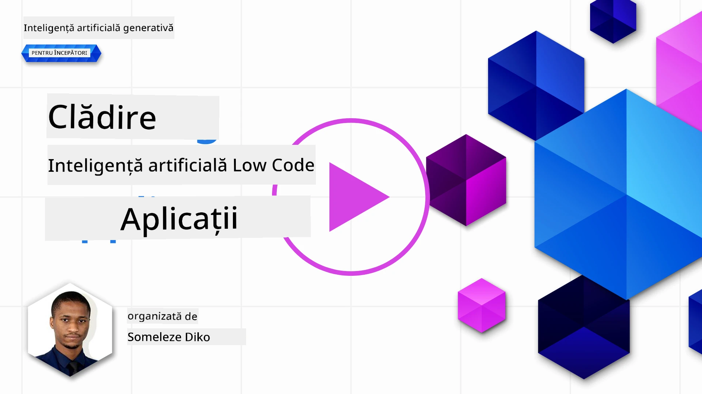](https://youtu.be/1vzq3Nd8GBA?si=h6LHWJXdmqf6mhDg)

> _(Faceți clic pe imaginea de mai sus pentru a viziona videoclipul acestei lecții)_

## Introducere

Acum că am învățat cum să construim aplicații care generează imagini, să vorbim despre codul redus. AI generativ poate fi utilizat într-o varietate de domenii, inclusiv codul redus, dar ce este codul redus și cum putem adăuga AI la acesta?

Construirea aplicațiilor și soluțiilor a devenit mai ușoară pentru dezvoltatorii tradiționali și non-dezvoltatori prin utilizarea platformelor de dezvoltare Low Code. Platformele de dezvoltare Low Code vă permit să construiți aplicații și soluții cu puțin sau deloc cod. Acest lucru se realizează prin oferirea unui mediu vizual de dezvoltare care vă permite să trageți și să plasați componente pentru a construi aplicații și soluții. Aceasta vă permite să construiți aplicații și soluții mai rapid și cu mai puține resurse. În această lecție, analizăm în profunzime cum să folosim Low Code și cum să îmbunătățim dezvoltarea cu cod redus cu AI folosind Power Platform.

Power Platform oferă organizațiilor oportunitatea de a-și împuternici echipele să își construiască propriile soluții printr-un mediu intuitiv low-code sau no-code. Acest mediu ajută la simplificarea procesului de construire a soluțiilor. Cu Power Platform, soluțiile pot fi construite în zile sau săptămâni în loc de luni sau ani. Power Platform constă în cinci produse cheie: Power Apps, Power Automate, Power BI, Power Pages și Copilot Studio.

Această lecție acoperă:

- Introducere în AI generativ în Power Platform
- Introducere în Copilot și cum să îl folosești
- Utilizarea AI generativ pentru a construi aplicații și fluxuri în Power Platform
- Înțelegerea modelelor AI în Power Platform cu AI Builder
- Construirea agenților inteligenți cu Microsoft Copilot Studio

## Obiective de învățare

Până la sfârșitul acestei lecții, veți putea să:

- Înțelegeți cum funcționează Copilot în Power Platform.

- Construiți o aplicație Student Assignment Tracker pentru startup-ul nostru educațional.

- Construiți un flux de Procesare Facturi care folosește AI pentru a extrage informații din facturi.

- Aplicați bune practici când utilizați modelul AI Create Text with GPT.

- Înțelegeți ce este Microsoft Copilot Studio și cum să construiți agenți inteligenți cu acesta.

Instrumentele și tehnologiile pe care le veți folosi în această lecție sunt:

- **Power Apps**, pentru aplicația Student Assignment Tracker, care oferă un mediu de dezvoltare low-code pentru construirea aplicațiilor ce urmăresc, gestionează și interacționează cu datele.

- **Dataverse**, pentru stocarea datelor aplicației Student Assignment Tracker, unde Dataverse va furniza o platformă de date low-code pentru stocarea datelor aplicației.

- **Power Automate**, pentru fluxul de procesare a facturilor, unde veți avea un mediu de dezvoltare low-code pentru construirea fluxurilor de lucru care automatizează procesul de procesare a facturilor.

- **AI Builder**, pentru modelul AI de procesare a facturilor, unde veți folosi modele AI predefinite pentru a procesa facturile pentru startup-ul nostru.

## AI generativ în Power Platform

Îmbunătățirea dezvoltării și aplicațiilor low-code cu AI generativ este un domeniu cheie pentru Power Platform. Scopul este de a permite tuturor să construiască aplicații, site-uri, tablouri de bord și să automatizeze procese cu AI, _fără a necesita expertiză în știința datelor_. Acest obiectiv se realizează prin integrarea AI generativ în experiența de dezvoltare low-code în Power Platform sub forma Copilot și AI Builder.

### Cum funcționează acest lucru?

Copilot este un asistent AI care vă permite să construiți soluții Power Platform descriind cerințele dvs. într-o serie de pași conversaționali folosind limbaj natural. De exemplu, puteți instrui asistentul AI să precizeze ce câmpuri va folosi aplicația dvs. și el va crea atât aplicația, cât și modelul de date subiacente sau puteți specifica cum să configurați un flux în Power Automate.

Puteți utiliza funcționalități conduse de Copilot ca o caracteristică în ecranele aplicației dvs. pentru a permite utilizatorilor să descopere informații prin interacțiuni conversaționale.

AI Builder este o capacitate AI low-code disponibilă în Power Platform care vă permite să folosiți modele AI pentru a automatiza procese și a prezice rezultate. Cu AI Builder puteți aduce AI în aplicațiile și fluxurile dvs. care se conectează la datele din Dataverse sau din diverse surse de date cloud, cum ar fi SharePoint, OneDrive sau Azure.

Copilot este disponibil în toate produsele Power Platform: Power Apps, Power Automate, Power BI, Power Pages și Copilot Studio (fost Power Virtual Agents). AI Builder este disponibil în Power Apps și Power Automate. În această lecție, ne vom concentra pe cum să folosim Copilot și AI Builder în Power Apps și Power Automate pentru a construi o soluție pentru startup-ul nostru educațional.

### Copilot în Power Apps

Ca parte a Power Platform, Power Apps oferă un mediu de dezvoltare low-code pentru construirea aplicațiilor care urmăresc, gestionează și interacționează cu datele. Este un set de servicii de dezvoltare de aplicații cu o platformă de date scalabilă și capacitatea de a se conecta la servicii cloud și date locale. Power Apps vă permite să construiți aplicații care rulează pe browsere, tablete și telefoane și pot fi partajate cu colegii. Power Apps facilitează utilizatorilor dezvoltarea aplicațiilor printr-o interfață simplă, astfel încât orice utilizator de afaceri sau dezvoltator profesionist să poată construi aplicații personalizate. Experiența dezvoltării aplicațiilor este, de asemenea, îmbunătățită cu AI generativ prin Copilot.

Funcția de asistent AI copilot în Power Apps vă permite să descrieți ce fel de aplicație aveți nevoie și ce informații doriți ca aplicația dvs. să urmărească, să colecteze sau să afișeze. Copilot generează apoi o aplicație Canvas responsivă bazată pe descrierea dvs. Puteți apoi personaliza aplicația pentru a corespunde nevoilor dvs. AI Copilot generează și sugerează un tabel Dataverse cu câmpurile necesare pentru a stoca datele pe care doriți să le urmăriți și unele date de exemplu. Vom analiza ce este Dataverse și cum îl puteți utiliza în Power Apps mai târziu în această lecție. Puteți apoi personaliza tabelul pentru a răspunde nevoilor dvs. folosind funcția asistent AI Copilot prin pași conversaționali. Această caracteristică este disponibilă direct de pe ecranul de start Power Apps.

### Copilot în Power Automate

Ca parte a Power Platform, Power Automate permite utilizatorilor să creeze fluxuri automate între aplicații și servicii. Ajută la automatizarea proceselor repetitive de afaceri, cum ar fi comunicarea, colectarea de date și aprobările deciziilor. Interfața sa simplă permite utilizatorilor cu orice nivel tehnic (de la începători la dezvoltatori experimentați) să automatizeze sarcini de lucru. Experiența dezvoltării fluxurilor este de asemenea îmbunătățită cu AI generativ prin Copilot.

Funcția de asistent AI copilot în Power Automate vă permite să descrieți ce fel de flux aveți nevoie și ce acțiuni doriți ca fluxul dvs. să efectueze. Copilot generează apoi un flux bazat pe descrierea dvs. Puteți apoi personaliza fluxul pentru a corespunde nevoilor dvs. AI Copilot generează și sugerează acțiunile necesare pentru a efectua sarcina pe care doriți să o automatizați. Vom analiza ce sunt fluxurile și cum le puteți folosi în Power Automate mai târziu în această lecție. Puteți apoi personaliza acțiunile pentru a corespunde nevoilor dvs. folosind funcția asistent AI Copilot prin pași conversaționali. Această caracteristică este disponibilă direct de pe ecranul de start Power Automate.

## Construirea agenților inteligenți cu Microsoft Copilot Studio

[Microsoft Copilot Studio](https://learn.microsoft.com/microsoft-copilot-studio/fundamentals-what-is-copilot-studio?WT.mc_id=academic-105485-koreyst) (fost Power Virtual Agents) este membrul low-code al Power Platform pentru construirea **agenților AI** — copiloți conversaționali care pot răspunde la întrebări, lua acțiuni și automatiza sarcini în numele utilizatorilor dvs. La fel ca restul Power Platform, construiți acești agenți într-o experiență vizuală, cu limbaj natural în prim plan: descrieți ce doriți să facă agentul și Copilot Studio ajută la structurarea instrucțiunilor, cunoștințelor și acțiunilor acestuia.

Pentru startup-ul nostru educațional, ați putea construi un agent care răspunde la întrebările studenților despre cursuri, verifică termenele limită pentru temele de lucru și chiar trimite email unui instructor — toate fără a scrie cod.

Iată câteva dintre cele mai recente capabilități care fac Copilot Studio puternic:

- **Răspunsuri generative din cunoștințele dvs.**. În loc să creați manual fiecare conversație, puteți conecta **surse de cunoștințe** — site-uri publice, SharePoint, OneDrive, Dataverse, fișiere încărcate sau date de întreprindere prin conectori — iar agentul generează răspunsuri fundamentate din acestea.

- **Orchestrare generativă**. În loc să se bazeze pe fraze rigide de declanșare, agentul folosește AI pentru a înțelege o cerere și decide dinamic ce cunoștințe, subiecte și acțiuni să combine pentru a o îndeplini, inclusiv legând mai mulți pași împreună.

- **Acțiuni și conectori**. Agenții pot *face* lucruri, nu doar să discute. Puteți da unui agent acțiuni susținute de cei peste 1.500 de conectori predefiniți Power Platform, fluxuri Power Automate, API-uri REST personalizate, prompturi sau servere **Model Context Protocol (MCP)**.

- **Agenți autonomi**. Agenții nu sunt limitați la a răspunde într-o fereastră de chat. Puteți construi **agenți autonomi** care sunt declanșați de evenimente — cum ar fi un email nou, un nou înregistrare în Dataverse sau un fișier încărcat — și apoi acționează în fundal pentru a finaliza o sarcină.

- **Orchestrare multi-agent**. Agenții pot apela alți agenți. Un agent Copilot Studio poate transfera, sau poate fi extins de, alți agenți, inclusiv agenți publicați în Microsoft 365 Copilot și agenți construiți în Microsoft Foundry.

- **Alegerea modelului**. Dincolo de modelele încorporate, puteți aduce modele din catalogul Microsoft Foundry pentru a adapta modul în care agentul dvs. raționează și răspunde.

- **Publicare oriunde**. Odată construit, un agent poate fi publicat pe mai multe canale — Microsoft Teams, Microsoft 365 Copilot, un site web sau o aplicație personalizată și altele — cu securitate, autentificare și analitică gestionate prin experiența de administrare Power Platform.

Puteți începe să construiți primul agent la [copilotstudio.microsoft.com](https://copilotstudio.microsoft.com?WT.mc_id=academic-105485-koreyst) și să aflați mai multe în [documentația Microsoft Copilot Studio](https://learn.microsoft.com/microsoft-copilot-studio/?WT.mc_id=academic-105485-koreyst).

## Tema: Gestionarea temelor și facturilor studenților pentru startup-ul nostru, folosind Copilot

Startup-ul nostru oferă cursuri online studenților. Startup-ul a crescut rapid și acum întâmpină dificultăți în a ține pasul cu cererea pentru cursurile sale. Startup-ul v-a angajat ca dezvoltator Power Platform pentru a-i ajuta să construiască o soluție low code pentru a gestiona temele și facturile studenților. Soluția lor ar trebui să îi ajute să urmărească și să gestioneze temele studenților printr-o aplicație și să automatizeze procesul de procesare a facturilor printr-un flux de lucru. Vi s-a cerut să utilizați AI generativ pentru a dezvolta soluția.

Când începeți să folosiți Copilot, puteți folosi [Power Platform Copilot Prompt Library](https://github.com/pnp/powerplatform-prompts?WT.mc_id=academic-109639-somelezediko) pentru a vă iniția cu prompturile. Această bibliotecă conține o listă de prompturi pe care le puteți folosi pentru a construi aplicații și fluxuri cu Copilot. De asemenea, puteți folosi prompturile din bibliotecă pentru a vă face o idee despre cum să vă descrieți cerințele către Copilot.

### Construiți o aplicație Student Assignment Tracker pentru startup-ul nostru

Profesorii de la startup-ul nostru au întâmpinat dificultăți în a ține evidența temelor studenților. Aceștia au folosit un spreadsheet pentru a urmări temele, dar acest lucru a devenit greu de gestionat pe măsură ce numărul studenților a crescut. V-au cerut să construiți o aplicație care să îi ajute să urmărească și să gestioneze temele studenților. Aplicația ar trebui să le permită să adauge teme noi, să vizualizeze temele, să actualizeze temele și să șteargă temele. De asemenea, aplicația ar trebui să le permită educatorilor și studenților să vizualizeze temele care au fost evaluate și pe cele care nu au fost evaluate.

Veți construi aplicația folosind Copilot în Power Apps urmând pașii de mai jos:

1. Navigați la ecranul de start [Power Apps](https://make.powerapps.com?WT.mc_id=academic-105485-koreyst).

1. Folosiți zona de text de pe ecranul de start pentru a descrie aplicația pe care doriți să o construiți. De exemplu, **_Vreau să construiesc o aplicație pentru a urmări și gestiona temele studenților_**. Faceți clic pe butonul **Trimite** pentru a trimite promptul asistentului AI Copilot.

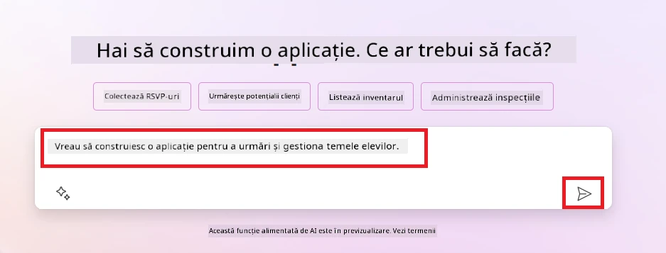

1. Asistentul AI Copilot va sugera un tabel Dataverse cu câmpurile necesare pentru a stoca datele pe care doriți să le urmăriți și unele date de exemplu. Puteți apoi personaliza tabelul pentru a răspunde nevoilor dvs. folosind funcția asistent AI Copilot prin pași conversaționali.

   > **Important**: Dataverse este platforma de date subiacente pentru Power Platform. Este o platformă de date low-code pentru stocarea datelor aplicației. Este un serviciu complet gestionat care stochează date în siguranță în Microsoft Cloud și este provisionat în cadrul mediului dvs. Power Platform. Vine cu capabilități integrate de guvernanță a datelor, cum ar fi clasificarea datelor, linia de descendență a datelor, controlul accesului granulat și altele. Puteți afla mai multe despre Dataverse [aici](https://docs.microsoft.com/powerapps/maker/data-platform/data-platform-intro?WT.mc_id=academic-109639-somelezediko).

   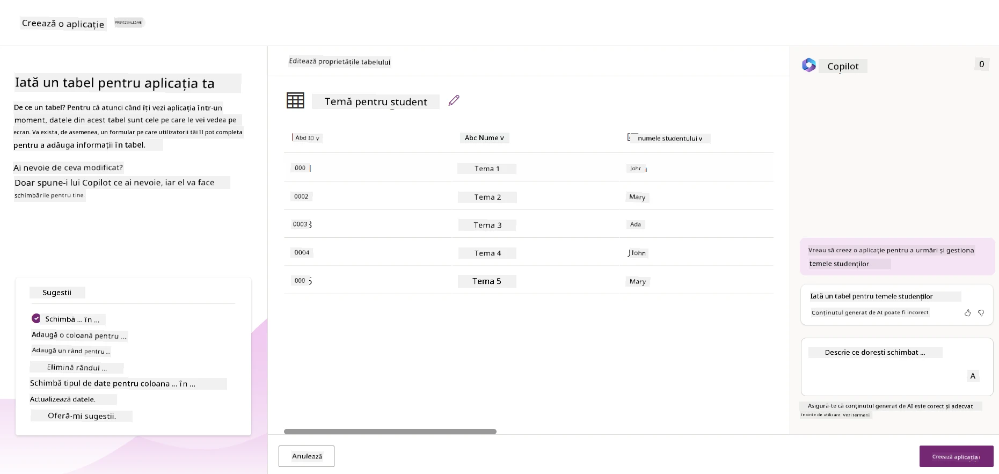

1. Educatorii doresc să trimită email-uri studenților care și-au predat temele pentru a-i ține la curent cu progresul temelor. Puteți folosi Copilot pentru a adăuga un câmp nou în tabel pentru a stoca email-ul studentului. De exemplu, puteți folosi următorul prompt pentru a adăuga un câmp nou în tabel: **_Vreau să adaug o coloană pentru a stoca email-ul studentului_**. Faceți clic pe butonul **Trimite** pentru a trimite promptul asistentului AI Copilot.

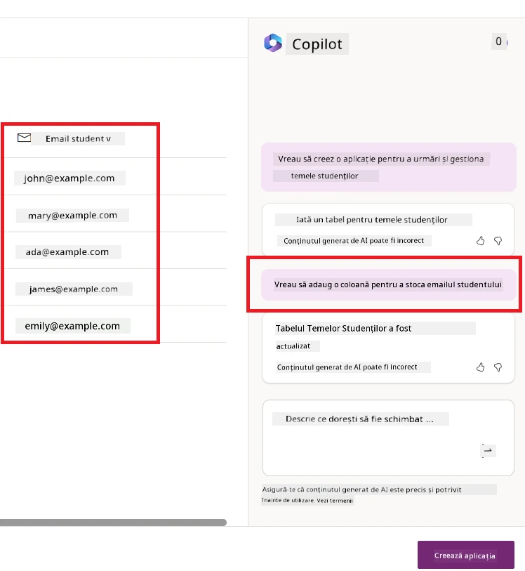

1. Asistentul AI Copilot va genera un câmp nou și apoi puteți personaliza câmpul pentru a răspunde nevoilor dvs.

1. Odată ce ați terminat cu tabelul, faceți clic pe butonul **Create app** pentru a crea aplicația.

1. AI Copilot va genera o aplicație Canvas responsabilă bazată pe descrierea dvs. Puteți apoi personaliza aplicația pentru a vă satisface nevoile.

1. Pentru ca educatorii să trimită emailuri către studenți, puteți folosi Copilot pentru a adăuga un ecran nou în aplicație. De exemplu, puteți folosi următoarea comandă pentru a adăuga un ecran nou aplicației: **_Vreau să adaug un ecran pentru a trimite emailuri studenților_**. Faceți clic pe butonul **Send** pentru a trimite comanda către AI Copilot.

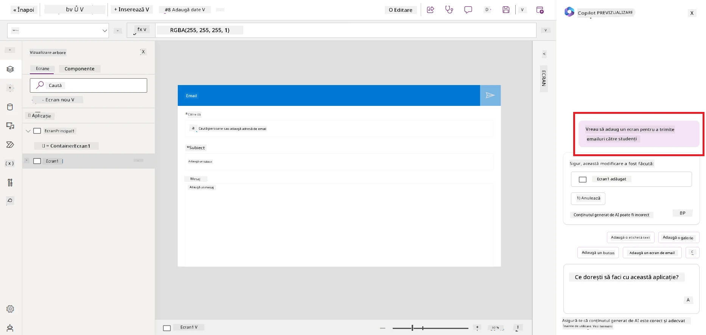

1. AI Copilot va genera un ecran nou și puteți apoi personaliza ecranul pentru a se potrivi nevoilor dvs.

1. Odată ce ați terminat cu aplicația, faceți clic pe butonul **Save** pentru a salva aplicația.

1. Pentru a partaja aplicația cu educatorii, faceți clic pe butonul **Share** și apoi faceți clic din nou pe butonul **Share**. Puteți apoi partaja aplicația cu educatorii introducând adresele lor de email.

> **Tema ta**: Aplicația pe care tocmai ai construit-o este un început bun, dar poate fi îmbunătățită. Cu funcția de email, educatorii pot trimite emailuri studenților numai manual, trebuit să introducă manual adresele lor de email. Poți folosi Copilot pentru a construi o automatizare care să permită educatorilor să trimită emailuri studenților automat când aceștia predau temele? Indiciul tău este că, cu comanda corectă, poți folosi Copilot în Power Automate pentru a construi acest lucru.

### Construiește un Tabel cu Informații despre Facturi pentru Startup-ul Nostru

Echipa financiară a startup-ului nostru întâmpină dificultăți în a ține evidența facturilor. Folosesc un tabel de calcul pentru a urmări facturile, dar această metodă a devenit dificil de gestionat pe măsură ce numărul facturilor a crescut. Ei ți-au cerut să construiești un tabel care să îi ajute să stocheze, urmărească și să gestioneze informațiile facturilor primite. Tabelul trebuie să fie folosit pentru a construi o automatizare care să extragă toate informațiile facturii și să le stocheze în tabel. Tabelul trebuie, de asemenea, să permită echipei financiare să vizualizeze facturile care au fost plătite și pe cele care nu au fost plătite.

Power Platform are o platformă de date subiacente numită Dataverse care vă permite să stocați datele pentru aplicațiile și soluțiile dvs. Dataverse oferă o platformă de date low-code pentru a stoca datele aplicației. Este un serviciu complet administrat care stochează sigur datele în Microsoft Cloud și este configurat în mediul dvs. Power Platform. Vine cu capabilități încorporate de guvernanță a datelor, precum clasificarea datelor, proveniența datelor, controlul fin al accesului și altele. Puteți afla mai multe [despre Dataverse aici](https://docs.microsoft.com/powerapps/maker/data-platform/data-platform-intro?WT.mc_id=academic-109639-somelezediko).

De ce ar trebui să folosim Dataverse pentru startup-ul nostru? Tabelele standard și personalizate din Dataverse oferă o opțiune de stocare securizată și bazată pe cloud pentru datele dvs. Tabelele vă permit să stocați diferite tipuri de date, similar cu modul în care ați folosi mai multe foi de calcul într-un singur workbook Excel. Puteți folosi tabele pentru a stoca date specifice organizației sau afacerii dvs. Unele dintre beneficiile pe care startup-ul nostru le va obține folosind Dataverse includ, dar nu se limitează la:

- **Ușor de gestionat**: Atât metadatele cât și datele sunt stocate în cloud, așa că nu trebuie să vă faceți griji cu privire la detaliile despre cum sunt stocate sau gestionate. Puteți să vă concentrați pe construirea aplicațiilor și soluțiilor dvs.

- **Securizat**: Dataverse oferă o opțiune securizată și bazată pe cloud pentru stocarea datelor dvs. Puteți controla cine are acces la datele din tabelele dvs. și modul în care pot accesa folosind securitatea bazată pe roluri.

- **Metadate bogate**: Tipurile de date și relațiile sunt folosite direct în Power Apps

- **Logică și validare**: Puteți folosi reguli de afaceri, câmpuri calculate și reguli de validare pentru a impune logica de afaceri și a menține acuratețea datelor.

Acum că știți ce este Dataverse și de ce ar trebui să îl folosiți, să vedem cum puteți folosi Copilot pentru a crea un tabel în Dataverse care să răspundă cerințelor echipei noastre financiare.

> **Notă** : Veți folosi acest tabel în secțiunea următoare pentru a construi o automatizare care va extrage toate informațiile facturii și le va stoca în tabel.

Pentru a crea un tabel în Dataverse folosind Copilot, urmați pașii de mai jos:

1. Accesați ecranul principal [Power Apps](https://make.powerapps.com?WT.mc_id=academic-105485-koreyst).

2. În bara de navigare din stânga, selectați **Tables**, apoi faceți clic pe **Describe the new Table**.

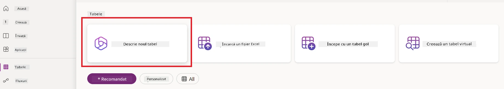

1. Pe ecranul **Describe the new Table**, folosiți aria de text pentru a descrie tabelul pe care doriți să îl creați. De exemplu, **_Vreau să creez un tabel pentru a stoca informațiile despre facturi_**. Faceți clic pe butonul **Send** pentru a trimite comanda către AI Copilot.

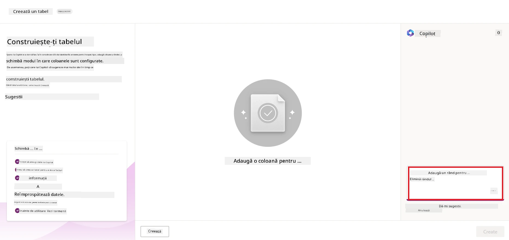

1. AI Copilot va sugera un tabel Dataverse cu câmpurile necesare pentru a stoca datele pe care doriți să le urmăriți și cu unele date de exemplu. Puteți apoi personaliza tabelul pentru a vă satisface nevoile folosind funcția asistent AI Copilot prin pași conversaționali.

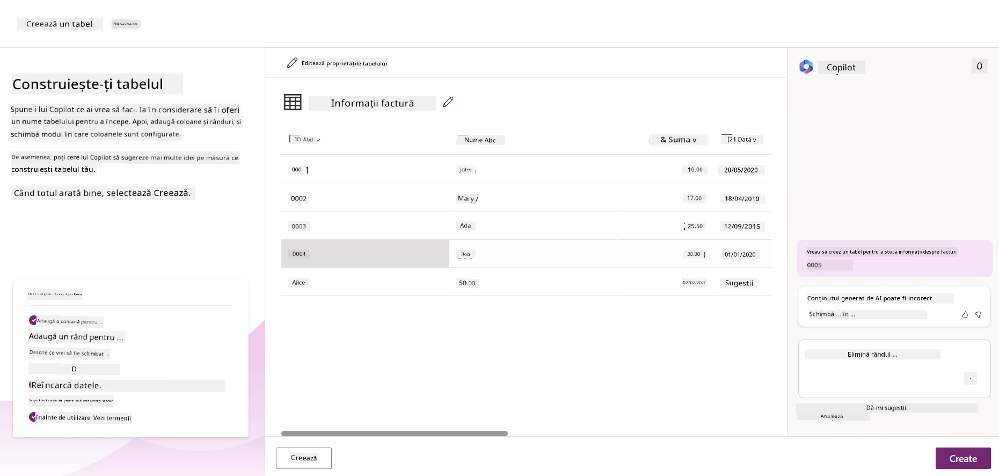

1. Echipa financiară dorește să trimită un email furnizorului pentru a-l actualiza cu statutul curent al facturii. Puteți folosi Copilot pentru a adăuga un câmp nou în tabel pentru a stoca emailul furnizorului. De exemplu, puteți folosi următoarea comandă pentru a adăuga un câmp nou în tabel: **_Vreau să adaug o coloană pentru a stoca emailul furnizorului_**. Faceți clic pe butonul **Send** pentru a trimite comanda către AI Copilot.

1. AI Copilot va genera un câmp nou și puteți apoi personaliza câmpul pentru a se potrivi nevoilor dvs.

1. Odată ce ați terminat cu tabelul, faceți clic pe butonul **Create** pentru a crea tabelul.

## Modele AI în Power Platform cu AI Builder

AI Builder este o capacitate AI low-code disponibilă în Power Platform care vă permite să folosiți Modele AI pentru a automatiza procese și a prezice rezultate. Cu AI Builder puteți aduce AI aplicațiilor și fluxurilor dvs. care se conectează la datele dvs. în Dataverse sau în diverse surse de date cloud, precum SharePoint, OneDrive sau Azure.

## Modele AI Preconstruite vs Modele AI Personalizate

AI Builder oferă două tipuri de modele AI: Modele AI Preconstruite și Modele AI Personalizate. Modelele AI Preconstruite sunt modele AI gata de utilizat, antrenate de Microsoft și disponibile în Power Platform. Acestea vă ajută să adăugați inteligență aplicațiilor și fluxurilor fără a fi nevoie să colectați date și apoi să construiți, antrenați și publicați propriile modele. Puteți folosi aceste modele pentru a automatiza procese și a prezice rezultate.

Unele dintre Modelele AI Preconstruite disponibile în Power Platform includ:

- **Extracția frazelor cheie**: Acest model extrage fraze cheie din text.
- **Detectarea limbii**: Acest model detectează limba unui text.
- **Analiza sentimentelor**: Acest model detectează sentimentul pozitiv, negativ, neutru sau mixt într-un text.
- **Cititor de cărți de vizită**: Acest model extrage informații din cărți de vizită.
- **Recunoașterea textului**: Acest model extrage text din imagini.
- **Detectarea obiectelor**: Acest model detectează și extrage obiecte din imagini.
- **Procesarea documentelor**: Acest model extrage informații din formulare.
- **Procesarea facturilor**: Acest model extrage informații din facturi.

Cu Modele AI Personalizate puteți aduce propriul model în AI Builder astfel încât să funcționeze ca orice model AI Builder personalizat, permițându-vă să antrenați modelul cu propriile date. Puteți folosi aceste modele pentru a automatiza procese și a prezice rezultate atât în Power Apps cât și în Power Automate. Există limitări care se aplică când folosiți propriul model. Citiți mai multe despre aceste [limitări](https://learn.microsoft.com/ai-builder/byo-model#limitations?WT.mc_id=academic-105485-koreyst).

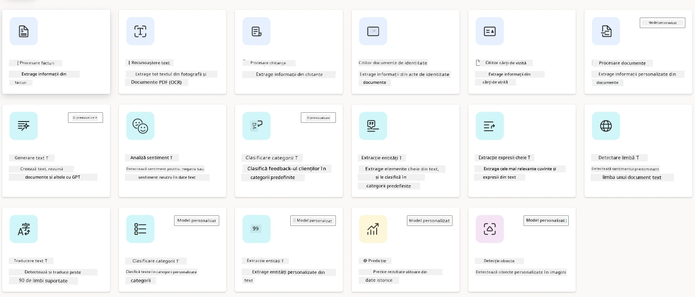

## Tema #2 - Construiește un Flux de Procesare Facturi pentru Startup-ul Nostru

Echipa financiară întâmpină dificultăți la procesarea facturilor. Foloseau un tabel de calcul pentru a urmări facturile, dar aceasta a devenit dificil de gestionat pe măsură ce numărul facturilor a crescut. Ei ți-au cerut să construiești un flux de lucru care să-i ajute să proceseze facturile folosind AI. Fluxul de lucru ar trebui să le permită să extragă informațiile din facturi și să stocheze informațiile într-un tabel Dataverse. Fluxul ar trebui, de asemenea, să le permită să trimită un email echipei financiare cu informațiile extrase.

Acum că știți ce este AI Builder și de ce ar trebui să îl folosiți, să vedem cum puteți folosi Modelul AI pentru Procesarea Facturilor din AI Builder, pe care l-am prezentat anterior, pentru a construi un flux de lucru care să ajute echipa financiară să proceseze facturile.

Pentru a construi un flux de lucru care să ajute echipa financiară să proceseze facturile folosind Modelul AI pentru Procesarea Facturilor din AI Builder, urmați pașii de mai jos:

1. Accesați ecranul principal [Power Automate](https://make.powerautomate.com?WT.mc_id=academic-105485-koreyst).

2. Folosiți aria de text de pe ecranul principal pentru a descrie fluxul de lucru pe care doriți să-l construiți. De exemplu, **_Procesează o factură când aceasta sosește în căsuța mea poștală_**. Faceți clic pe butonul **Send** pentru a trimite comanda către AI Copilot.

   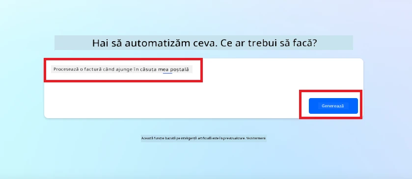

3. AI Copilot va sugera acțiunile necesare pentru a îndeplini sarcina pe care doriți să o automatizați. Puteți face clic pe butonul **Next** pentru a parcurge pașii următori.

4. La pasul următor, Power Automate vă va solicita să configurați conexiunile necesare pentru flux. Odată ce ați terminat, faceți clic pe butonul **Create flow** pentru a crea fluxul.

5. AI Copilot va genera fluxul și puteți apoi personaliza fluxul pentru a se potrivi nevoilor dvs.

6. Actualizați trigger-ul fluxului și setați **Folder** la folderul unde vor fi stocate facturile. De exemplu, puteți seta folderul la **Inbox**. Faceți clic pe **Show advanced options** și setați **Only with Attachments** la **Yes**. Aceasta va asigura că fluxul rulează doar când un email cu atașament este primit în acel folder.

7. Înlăturați următoarele acțiuni din flux: **HTML to text**, **Compose**, **Compose 2**, **Compose 3** și **Compose 4** pentru că nu le veți folosi.

8. Înlăturați acțiunea **Condition** din flux pentru că nu o veți folosi. Ar trebui să arate ca în captura de ecran următoare:

   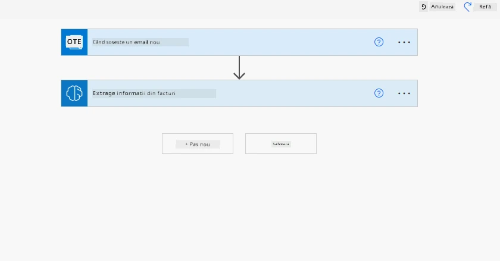

9. Faceți clic pe butonul **Add an action** și căutați **Dataverse**. Selectați acțiunea **Add a new row**.

10. La acțiunea **Extract Information from invoices**, actualizați câmpul **Invoice File** să indice către **Attachment Content** din email. Aceasta va asigura ca fluxul să extragă informațiile din atașamentul facturii.

11. Selectați **Table** pe care ați creat-o anterior. De exemplu, puteți selecta tabelul **Invoice Information**. Alegeți conținutul dinamic din acțiunea precedentă pentru a popula următoarele câmpuri:

    - ID
    - Amount
    - Date
    - Name
    - Status - Setați **Status** la **Pending**.
    - Supplier Email - Folosiți conținutul dinamic **From** din trigger-ul **When a new email arrives**.

    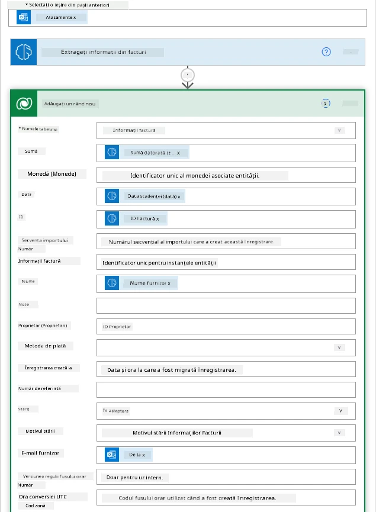

12. Odată ce ați terminat cu fluxul, faceți clic pe butonul **Save** pentru a salva fluxul. Puteți apoi testa fluxul trimițând un email cu o factură către folderul specificat în trigger.

> **Tema ta**: Fluxul pe care tocmai l-ai construit este un început bun, acum trebuie să te gândești cum poți construi o automatizare care să permită echipei noastre financiare să trimită un email furnizorului pentru a-l actualiza cu statutul curent al facturii. Indiciul tău: fluxul trebuie să ruleze când statusul facturii se schimbă.

## Folosește un Model AI de Generare Text în Power Automate

Modelul AI Create Text with GPT din AI Builder vă permite să generați text bazat pe o comandă și este alimentat de Microsoft Azure OpenAI Service. Cu această capacitate, puteți integra tehnologia GPT (Generative Pre-Trained Transformer) în aplicațiile și fluxurile dvs. pentru a construi o varietate de fluxuri automate și aplicații utile.

Modelele GPT trec printr-un antrenament extins pe cantități mari de date, permițându-le să producă text ce seamănă îndeaproape cu limbajul uman atunci când li se furnizează o comandă. Integrate cu automatizarea fluxului de lucru, modelele AI precum GPT pot fi folosite pentru a simplifica și automatiza o gamă largă de sarcini.

De exemplu, puteți construi fluxuri pentru a genera automat text pentru diverse cazuri de utilizare, cum ar fi: emailuri în draft, descrieri de produse și altele. De asemenea, puteți folosi modelul pentru a genera text pentru diverse aplicații, precum chatboți și aplicații de servicii pentru clienți care permit agenților să răspundă eficient și rapid la întrebările clienților.

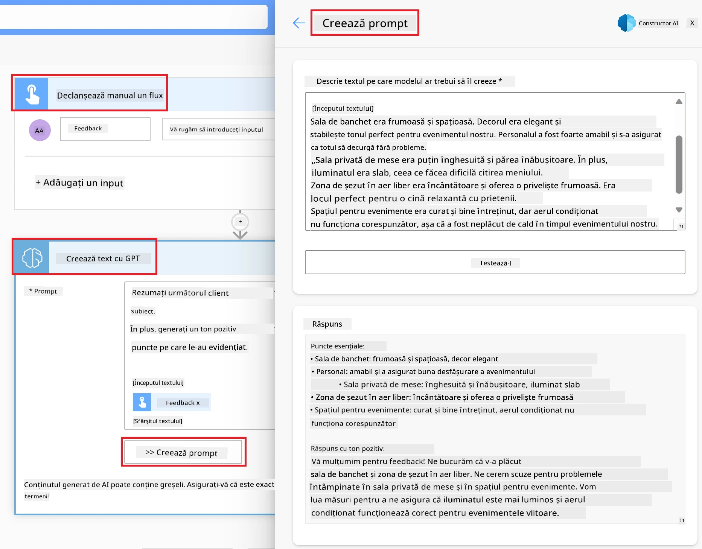

Pentru a învăța cum să folosești acest Model AI în Power Automate, parcurge modulul [Adaugă inteligență cu AI Builder și GPT](https://learn.microsoft.com/training/modules/ai-builder-text-generation/?WT.mc_id=academic-109639-somelezediko).

## Foarte bine! Continuă-ți învățarea

După ce ai terminat această lecție, consultă colecția noastră [Învățarea AI Generative](https://aka.ms/genai-collection?WT.mc_id=academic-105485-koreyst) pentru a-ți continua dezvoltarea cunoștințelor despre AI Generativ!

Vrei să personalizezi și să obții mai mult de la Copilot? Explorează [Awesome Copilot](https://github.com/github/awesome-copilot?WT.mc_id=academic-105485-koreyst) — o colecție contribuție a comunității cu instrucțiuni, agenți, abilități și configurații care te ajută să profiți la maximum de GitHub Copilot.

Mergi la Lecția 11 unde vom vedea cum să [integrezi AI Generativ cu Apelarea Funcțiilor](../11-integrating-with-function-calling/README.md?WT.mc_id=academic-105485-koreyst)!

---

<!-- CO-OP TRANSLATOR DISCLAIMER START -->
**Declinare a responsabilității**:
Acest document a fost tradus folosind serviciul de traducere AI [Co-op Translator](https://github.com/Azure/co-op-translator). În timp ce ne străduim pentru acuratețe, vă rugăm să rețineți că traducerile automate pot conține erori sau inexactități. Documentul original în limba sa nativă trebuie considerat sursa autorizată. Pentru informații critice, se recomandă traducerea profesională realizată de un om. Nu ne asumăm responsabilitatea pentru eventualele neînțelegeri sau interpretări greșite care decurg din utilizarea acestei traduceri.
<!-- CO-OP TRANSLATOR DISCLAIMER END -->