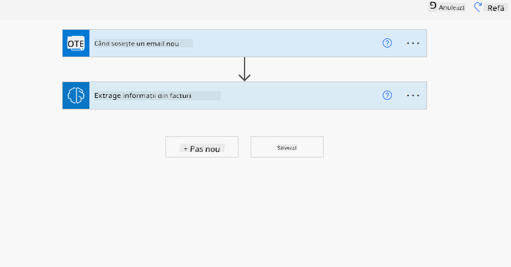
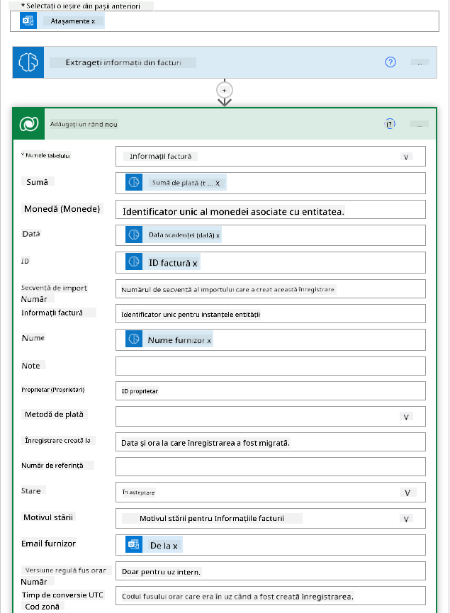

<!--
CO_OP_TRANSLATOR_METADATA:
{
  "original_hash": "846ac8e3b7dcfb697d3309fec05f0fea",
  "translation_date": "2025-10-17T22:08:08+00:00",
  "source_file": "10-building-low-code-ai-applications/README.md",
  "language_code": "ro"
}
-->
# Construirea aplicațiilor AI cu cod redus

> _(Faceți clic pe imaginea de mai sus pentru a viziona videoclipul acestei lecții)_

## Introducere

Acum că am învățat cum să construim aplicații de generare de imagini, să vorbim despre codul redus. Inteligența artificială generativă poate fi utilizată în diverse domenii, inclusiv cod redus, dar ce este codul redus și cum putem adăuga AI la acesta?

Construirea aplicațiilor și soluțiilor a devenit mai ușoară pentru dezvoltatorii tradiționali și pentru cei fără experiență în programare, datorită utilizării platformelor de dezvoltare cu cod redus. Aceste platforme permit crearea de aplicații și soluții cu puțin sau deloc cod. Acest lucru se realizează prin furnizarea unui mediu de dezvoltare vizual care permite utilizatorilor să tragă și să plaseze componente pentru a construi aplicații și soluții. Astfel, aplicațiile și soluțiile pot fi dezvoltate mai rapid și cu resurse mai puține. În această lecție, vom explora în detaliu cum să utilizăm codul redus și cum să îmbunătățim dezvoltarea cu cod redus folosind AI în Power Platform.

Power Platform oferă organizațiilor oportunitatea de a-și împuternici echipele să își construiască propriile soluții printr-un mediu intuitiv de cod redus sau fără cod. Acest mediu simplifică procesul de creare a soluțiilor. Cu Power Platform, soluțiile pot fi construite în zile sau săptămâni, în loc de luni sau ani. Power Platform constă în cinci produse cheie: Power Apps, Power Automate, Power BI, Power Pages și Copilot Studio.

Această lecție acoperă:

- Introducere în AI generativ în Power Platform
- Introducere în Copilot și cum să îl utilizăm
- Utilizarea AI generativ pentru a construi aplicații și fluxuri în Power Platform
- Înțelegerea modelelor AI din Power Platform cu AI Builder

## Obiective de învățare

Până la sfârșitul acestei lecții, veți putea:

- Să înțelegeți cum funcționează Copilot în Power Platform.

- Să construiți o aplicație de urmărire a temelor pentru studenți pentru startup-ul nostru educațional.

- Să creați un flux de procesare a facturilor care utilizează AI pentru a extrage informații din facturi.

- Să aplicați cele mai bune practici atunci când utilizați modelul AI Create Text cu GPT.

Instrumentele și tehnologiile pe care le veți utiliza în această lecție sunt:

- **Power Apps**, pentru aplicația de urmărire a temelor studenților, care oferă un mediu de dezvoltare cu cod redus pentru construirea aplicațiilor care să urmărească, să gestioneze și să interacționeze cu datele.

- **Dataverse**, pentru stocarea datelor aplicației de urmărire a temelor studenților, unde Dataverse va oferi o platformă de date cu cod redus pentru stocarea datelor aplicației.

- **Power Automate**, pentru fluxul de procesare a facturilor, unde veți avea un mediu de dezvoltare cu cod redus pentru construirea fluxurilor de lucru care automatizează procesul de procesare a facturilor.

- **AI Builder**, pentru modelul AI de procesare a facturilor, unde veți utiliza modele AI predefinite pentru a procesa facturile startup-ului nostru.

## AI generativ în Power Platform

Îmbunătățirea dezvoltării și aplicațiilor cu cod redus prin AI generativ este o zonă cheie de interes pentru Power Platform. Scopul este de a permite tuturor să construiască aplicații, site-uri, tablouri de bord și să automatizeze procesele cu ajutorul AI, _fără a fi necesare cunoștințe de specialitate în știința datelor_. Acest scop este atins prin integrarea AI generativ în experiența de dezvoltare cu cod redus din Power Platform sub forma Copilot și AI Builder.

### Cum funcționează?

Copilot este un asistent AI care vă permite să construiți soluții Power Platform descriindu-vă cerințele într-o serie de pași conversaționali folosind limbaj natural. De exemplu, puteți instrui asistentul AI să precizeze ce câmpuri va utiliza aplicația dvs., iar acesta va crea atât aplicația, cât și modelul de date de bază, sau puteți specifica cum să configurați un flux în Power Automate.

Funcționalitățile bazate pe Copilot pot fi utilizate ca o caracteristică în ecranele aplicației dvs., permițând utilizatorilor să descopere informații prin interacțiuni conversaționale.

AI Builder este o capacitate AI cu cod redus disponibilă în Power Platform, care vă permite să utilizați modele AI pentru a vă ajuta să automatizați procesele și să preziceți rezultate. Cu AI Builder, puteți adăuga AI în aplicațiile și fluxurile dvs. care se conectează la datele din Dataverse sau din diverse surse de date cloud, cum ar fi SharePoint, OneDrive sau Azure.

Copilot este disponibil în toate produsele Power Platform: Power Apps, Power Automate, Power BI, Power Pages și Power Virtual Agents. AI Builder este disponibil în Power Apps și Power Automate. În această lecție, ne vom concentra pe modul de utilizare a Copilot și AI Builder în Power Apps și Power Automate pentru a construi o soluție pentru startup-ul nostru educațional.

### Copilot în Power Apps

Ca parte a Power Platform, Power Apps oferă un mediu de dezvoltare cu cod redus pentru construirea aplicațiilor care să urmărească, să gestioneze și să interacționeze cu datele. Este o suită de servicii de dezvoltare a aplicațiilor cu o platformă de date scalabilă și capacitatea de a se conecta la servicii cloud și date locale. Power Apps permite construirea de aplicații care rulează pe browsere, tablete și telefoane și pot fi partajate cu colegii. Power Apps facilitează utilizatorii în dezvoltarea aplicațiilor printr-o interfață simplă, astfel încât fiecare utilizator de afaceri sau dezvoltator profesionist să poată construi aplicații personalizate. Experiența de dezvoltare a aplicațiilor este, de asemenea, îmbunătățită cu AI generativ prin Copilot.

Funcția de asistent AI Copilot din Power Apps vă permite să descrieți ce tip de aplicație aveți nevoie și ce informații doriți ca aplicația dvs. să urmărească, colecteze sau afișeze. Copilot generează apoi o aplicație Canvas receptivă pe baza descrierii dvs. Ulterior, puteți personaliza aplicația pentru a se potrivi nevoilor dvs. Asistentul AI Copilot generează și sugerează o tabelă Dataverse cu câmpurile necesare pentru a stoca datele pe care doriți să le urmăriți și câteva date de exemplu. Vom analiza ce este Dataverse și cum îl puteți utiliza în Power Apps mai târziu în această lecție. Ulterior, puteți personaliza tabela pentru a se potrivi nevoilor dvs. utilizând funcția de asistent AI Copilot prin pași conversaționali. Această funcție este disponibilă direct de pe ecranul principal al Power Apps.

### Copilot în Power Automate

Ca parte a Power Platform, Power Automate permite utilizatorilor să creeze fluxuri de lucru automatizate între aplicații și servicii. Ajută la automatizarea proceselor repetitive de afaceri, cum ar fi comunicarea, colectarea datelor și aprobările deciziilor. Interfața sa simplă permite utilizatorilor de toate nivelurile de competență tehnică (de la începători la dezvoltatori experimentați) să automatizeze sarcinile de lucru. Experiența de dezvoltare a fluxurilor de lucru este, de asemenea, îmbunătățită cu AI generativ prin Copilot.

Funcția de asistent AI Copilot din Power Automate vă permite să descrieți ce tip de flux aveți nevoie și ce acțiuni doriți ca fluxul dvs. să efectueze. Copilot generează apoi un flux pe baza descrierii dvs. Ulterior, puteți personaliza fluxul pentru a se potrivi nevoilor dvs. Asistentul AI Copilot generează și sugerează acțiunile necesare pentru a efectua sarcina pe care doriți să o automatizați. Vom analiza ce sunt fluxurile și cum le puteți utiliza în Power Automate mai târziu în această lecție. Ulterior, puteți personaliza acțiunile pentru a se potrivi nevoilor dvs. utilizând funcția de asistent AI Copilot prin pași conversaționali. Această funcție este disponibilă direct de pe ecranul principal al Power Automate.

## Temă: Gestionarea temelor studenților și a facturilor pentru startup-ul nostru, folosind Copilot

Startup-ul nostru oferă cursuri online studenților. Startup-ul a crescut rapid și acum întâmpină dificultăți în a face față cererii pentru cursurile sale. Startup-ul v-a angajat ca dezvoltator Power Platform pentru a-i ajuta să construiască o soluție cu cod redus care să îi ajute să gestioneze temele studenților și facturile. Soluția lor ar trebui să îi ajute să urmărească și să gestioneze temele studenților printr-o aplicație și să automatizeze procesul de procesare a facturilor printr-un flux de lucru. Vi s-a cerut să utilizați AI generativ pentru a dezvolta soluția.

Când începeți să utilizați Copilot, puteți folosi [Biblioteca de Prompts Copilot pentru Power Platform](https://github.com/pnp/powerplatform-prompts?WT.mc_id=academic-109639-somelezediko) pentru a începe cu prompturile. Această bibliotecă conține o listă de prompturi pe care le puteți utiliza pentru a construi aplicații și fluxuri cu Copilot. De asemenea, puteți folosi prompturile din bibliotecă pentru a vă face o idee despre cum să descrieți cerințele dvs. către Copilot.

### Construirea unei aplicații de urmărire a temelor studenților pentru startup-ul nostru

Educatorii din startup-ul nostru întâmpină dificultăți în a ține evidența temelor studenților. Au folosit un fișier Excel pentru a urmări temele, dar acest lucru a devenit dificil de gestionat pe măsură ce numărul de studenți a crescut. Aceștia v-au cerut să construiți o aplicație care să îi ajute să urmărească și să gestioneze temele studenților. Aplicația ar trebui să le permită să adauge teme noi, să vizualizeze temele, să actualizeze temele și să șteargă temele. Aplicația ar trebui să permită, de asemenea, educatorilor și studenților să vizualizeze temele care au fost notate și cele care nu au fost notate.

Veți construi aplicația folosind Copilot în Power Apps urmând pașii de mai jos:

1. Accesați ecranul principal [Power Apps](https://make.powerapps.com?WT.mc_id=academic-105485-koreyst).

1. Utilizați zona de text de pe ecranul principal pentru a descrie aplicația pe care doriți să o construiți. De exemplu, **_Vreau să construiesc o aplicație pentru a urmări și gestiona temele studenților_**. Faceți clic pe butonul **Trimite** pentru a trimite promptul către AI Copilot.

1. AI Copilot va sugera o tabelă Dataverse cu câmpurile necesare pentru a stoca datele pe care doriți să le urmăriți și câteva date de exemplu. Ulterior, puteți personaliza tabela pentru a se potrivi nevoilor dvs. utilizând funcția de asistent AI Copilot prin pași conversaționali.

   > **Important**: Dataverse este platforma de date de bază pentru Power Platform. Este o platformă de date cu cod redus pentru stocarea datelor aplicației. Este un serviciu complet gestionat care stochează datele în mod securizat în Microsoft Cloud și este furnizat în cadrul mediului dvs. Power Platform. Vine cu capacități integrate de guvernanță a datelor, cum ar fi clasificarea datelor, linia de date, controlul accesului detaliat și altele. Puteți afla mai multe despre Dataverse [aici](https://docs.microsoft.com/powerapps/maker/data-platform/data-platform-intro?WT.mc_id=academic-109639-somelezediko).

   

1. Educatorii doresc să trimită e-mailuri studenților care și-au predat temele pentru a-i ține la curent cu progresul temelor lor. Puteți utiliza Copilot pentru a adăuga un nou câmp în tabelă pentru a stoca e-mailul studentului. De exemplu, puteți utiliza următorul prompt pentru a adăuga un nou câmp în tabelă: **_Vreau să adaug o coloană pentru a stoca e-mailul studentului_**. Faceți clic pe butonul **Trimite** pentru a trimite promptul către AI Copilot.

1. AI Copilot va genera un nou câmp și ulterior îl puteți personaliza pentru a se potrivi nevoilor dvs.

1. După ce ați terminat cu tabela, faceți clic pe butonul **Creează aplicație** pentru a crea aplicația.

1. AI Copilot va genera o aplicație Canvas receptivă pe baza descrierii dvs. Ulterior, puteți personaliza aplicația pentru a se potrivi nevoilor dvs.

1. Pentru ca educatorii să trimită e-mailuri studenților, puteți utiliza Copilot pentru a adăuga un nou ecran în aplicație. De exemplu, puteți utiliza următorul prompt pentru a adăuga un nou ecran în aplicație: **_Vreau să adaug un ecran pentru a trimite e-mailuri studenților_**. Faceți clic pe butonul **Trimite** pentru a trimite promptul către AI Copilot.

1. AI Copilot va genera un nou ecran și ulterior îl puteți personaliza pentru a se potrivi nevoilor dvs.

1. După ce ați terminat cu aplicația, faceți clic pe butonul **Salvează** pentru a salva aplicația.

1. Pentru a partaja aplicația cu educatorii, faceți clic pe butonul **Partajează** și apoi faceți clic din nou pe butonul **Partajează**. Puteți partaja aplicația cu educatorii introducând adresele lor de e-mail.

> **Tema dvs.**: Aplicația pe care tocmai ați construit-o este un început bun, dar poate fi îmbunătățită. Cu funcția de e-mail, educatorii pot trimite e-mailuri studenților doar manual, fiind nevoiți să tasteze e-mailurile. Puteți utiliza Copilot pentru a construi o automatizare care să permită educatorilor să trimită e-mailuri studenților automat atunci când aceștia își predau temele? Indiciul dvs. este că, cu promptul potrivit, puteți utiliza Copilot în Power Automate pentru a construi acest lucru.

### Construirea unei tabele de informații despre facturi pentru startup-ul nostru

Echipa financiară a startup-ului nostru întâmpină dificultăți în a ține evidența facturilor. Au folosit un fișier Excel pentru a urmări facturile, dar acest lucru a devenit dificil de gestionat pe măsură ce numărul de facturi a crescut. Aceștia v-au cerut să construiți o tabelă care să îi ajute să stocheze, să urmărească și să gestioneze informațiile facturilor primite. Tabela ar trebui să fie utilizată pentru a construi o automatizare care să extragă toate informațiile facturilor și să le stocheze în tabelă. Tabela ar trebui să permită, de asemenea, echipei financiare să vizualizeze facturile care au fost plătite și cele care nu au fost plătite.

Power Platform are o platformă de date de bază numită Dataverse, care vă permite să stocați datele pentru aplicațiile și soluțiile dvs. Dataverse oferă o platformă de date cu cod redus pentru stocarea datelor aplicației. Este un serviciu complet gestionat care stochează datele în mod securizat în Microsoft Cloud și este furnizat în cadrul mediului dvs. Power Platform. Vine cu capacități integrate de guvernanță a datelor, cum ar fi clasificarea datelor, linia de date, controlul accesului detaliat și altele. Puteți afla mai multe [despre Dataverse aici](https://docs.microsoft.com/powerapps/maker/data-platform/data-platform-intro?WT.mc_id=academic-109639-somelezediko).
De ce ar trebui să folosim Dataverse pentru startup-ul nostru? Tabelele standard și personalizate din Dataverse oferă o opțiune sigură și bazată pe cloud pentru stocarea datelor tale. Tabelele îți permit să stochezi diferite tipuri de date, similar cu utilizarea mai multor foi de lucru într-un singur fișier Excel. Poți folosi tabelele pentru a stoca date specifice organizației sau nevoilor afacerii tale. Unele dintre beneficiile pe care startup-ul nostru le va obține utilizând Dataverse includ, dar nu se limitează la:

- **Ușor de gestionat**: Atât metadatele, cât și datele sunt stocate în cloud, astfel încât nu trebuie să te îngrijorezi de detaliile legate de modul în care sunt stocate sau gestionate. Te poți concentra pe construirea aplicațiilor și soluțiilor tale.

- **Sigur**: Dataverse oferă o opțiune sigură și bazată pe cloud pentru stocarea datelor tale. Poți controla cine are acces la datele din tabelele tale și cum le poate accesa, utilizând securitatea bazată pe roluri.

- **Metadate bogate**: Tipurile de date și relațiile sunt utilizate direct în Power Apps.

- **Logică și validare**: Poți folosi reguli de afaceri, câmpuri calculate și reguli de validare pentru a aplica logica de afaceri și a menține acuratețea datelor.

Acum că știi ce este Dataverse și de ce ar trebui să-l folosești, să vedem cum poți folosi Copilot pentru a crea o tabelă în Dataverse care să îndeplinească cerințele echipei noastre financiare.

> **Note**: Vei folosi această tabelă în secțiunea următoare pentru a construi o automatizare care va extrage toate informațiile despre facturi și le va stoca în tabelă.

Pentru a crea o tabelă în Dataverse folosind Copilot, urmează pașii de mai jos:

1. Accesează ecranul principal [Power Apps](https://make.powerapps.com?WT.mc_id=academic-105485-koreyst).

2. În bara de navigare din stânga, selectează **Tables** și apoi apasă pe **Describe the new Table**.

3. Pe ecranul **Describe the new Table**, folosește zona de text pentru a descrie tabelul pe care vrei să-l creezi. De exemplu, **_Vreau să creez un tabel pentru a stoca informații despre facturi_**. Apasă pe butonul **Send** pentru a trimite cererea către AI Copilot.

4. AI Copilot va sugera un tabel Dataverse cu câmpurile necesare pentru a stoca datele pe care vrei să le urmărești și câteva date de exemplu. Poți personaliza tabelul pentru a se potrivi nevoilor tale folosind funcția de asistență AI Copilot prin pași conversaționali.

5. Echipa financiară dorește să trimită un email furnizorului pentru a-l informa despre starea actuală a facturii sale. Poți folosi Copilot pentru a adăuga un câmp nou în tabel pentru a stoca emailul furnizorului. De exemplu, poți folosi următorul prompt pentru a adăuga un câmp nou în tabel: **_Vreau să adaug o coloană pentru a stoca emailul furnizorului_**. Apasă pe butonul **Send** pentru a trimite cererea către AI Copilot.

6. AI Copilot va genera un câmp nou și apoi poți personaliza câmpul pentru a se potrivi nevoilor tale.

7. După ce ai terminat cu tabelul, apasă pe butonul **Create** pentru a crea tabelul.

## Modele AI în Power Platform cu AI Builder

AI Builder este o capacitate AI low-code disponibilă în Power Platform care îți permite să folosești modele AI pentru a te ajuta să automatizezi procesele și să prezici rezultate. Cu AI Builder poți aduce AI în aplicațiile și fluxurile tale care se conectează la datele din Dataverse sau din diverse surse de date cloud, cum ar fi SharePoint, OneDrive sau Azure.

## Modele AI predefinite vs Modele AI personalizate

AI Builder oferă două tipuri de modele AI: Modele AI predefinite și Modele AI personalizate. Modelele AI predefinite sunt modele AI gata de utilizare, antrenate de Microsoft și disponibile în Power Platform. Acestea te ajută să adaugi inteligență aplicațiilor și fluxurilor tale fără a fi nevoie să colectezi date și apoi să construiești, să antrenezi și să publici propriile modele. Poți folosi aceste modele pentru a automatiza procesele și a prezice rezultate.

Unele dintre modelele AI predefinite disponibile în Power Platform includ:

- **Extracția frazelor cheie**: Acest model extrage fraze cheie din text.
- **Detectarea limbii**: Acest model detectează limba unui text.
- **Analiza sentimentului**: Acest model detectează sentimentul pozitiv, negativ, neutru sau mixt din text.
- **Cititor de cărți de vizită**: Acest model extrage informații din cărți de vizită.
- **Recunoașterea textului**: Acest model extrage text din imagini.
- **Detectarea obiectelor**: Acest model detectează și extrage obiecte din imagini.
- **Procesarea documentelor**: Acest model extrage informații din formulare.
- **Procesarea facturilor**: Acest model extrage informații din facturi.

Cu Modelele AI personalizate poți aduce propriul model în AI Builder astfel încât să funcționeze ca orice model personalizat AI Builder, permițându-ți să antrenezi modelul folosind propriile date. Poți folosi aceste modele pentru a automatiza procesele și a prezice rezultate atât în Power Apps, cât și în Power Automate. Când folosești propriul model, există limitări care se aplică. Citește mai multe despre aceste [limitări](https://learn.microsoft.com/ai-builder/byo-model#limitations?WT.mc_id=academic-105485-koreyst).

## Tema #2 - Construiește un flux de procesare a facturilor pentru startup-ul nostru

Echipa financiară s-a confruntat cu dificultăți în procesarea facturilor. Au folosit un fișier Excel pentru a urmări facturile, dar acest lucru a devenit dificil de gestionat pe măsură ce numărul facturilor a crescut. Ne-au cerut să construim un flux de lucru care să îi ajute să proceseze facturile folosind AI. Fluxul de lucru ar trebui să le permită să extragă informații din facturi și să stocheze informațiile într-un tabel Dataverse. Fluxul de lucru ar trebui, de asemenea, să le permită să trimită un email echipei financiare cu informațiile extrase.

Acum că știi ce este AI Builder și de ce ar trebui să-l folosești, să vedem cum poți folosi modelul AI de procesare a facturilor din AI Builder, pe care l-am acoperit mai devreme, pentru a construi un flux de lucru care să ajute echipa financiară să proceseze facturile.

Pentru a construi un flux de lucru care să ajute echipa financiară să proceseze facturile folosind modelul AI de procesare a facturilor din AI Builder, urmează pașii de mai jos:

1. Accesează ecranul principal [Power Automate](https://make.powerautomate.com?WT.mc_id=academic-105485-koreyst).

2. Folosește zona de text de pe ecranul principal pentru a descrie fluxul de lucru pe care vrei să-l construiești. De exemplu, **_Procesează o factură când ajunge în căsuța mea de email_**. Apasă pe butonul **Send** pentru a trimite cererea către AI Copilot.

   

3. AI Copilot va sugera acțiunile necesare pentru a îndeplini sarcina pe care vrei să o automatizezi. Poți apăsa pe butonul **Next** pentru a parcurge pașii următori.

4. În pasul următor, Power Automate te va solicita să configurezi conexiunile necesare pentru flux. După ce ai terminat, apasă pe butonul **Create flow** pentru a crea fluxul.

5. AI Copilot va genera un flux și apoi poți personaliza fluxul pentru a se potrivi nevoilor tale.

6. Actualizează declanșatorul fluxului și setează **Folder** la folderul unde vor fi stocate facturile. De exemplu, poți seta folderul la **Inbox**. Apasă pe **Show advanced options** și setează **Only with Attachments** la **Yes**. Acest lucru va asigura că fluxul rulează doar atunci când un email cu un atașament este primit în folder.

7. Elimină următoarele acțiuni din flux: **HTML to text**, **Compose**, **Compose 2**, **Compose 3** și **Compose 4**, deoarece nu le vei folosi.

8. Elimină acțiunea **Condition** din flux, deoarece nu o vei folosi. Ar trebui să arate ca în următoarea captură de ecran:

   

9. Apasă pe butonul **Add an action** și caută **Dataverse**. Selectează acțiunea **Add a new row**.

10. În acțiunea **Extract Information from invoices**, actualizează **Invoice File** pentru a indica **Attachment Content** din email. Acest lucru va asigura că fluxul extrage informații din atașamentul facturii.

11. Selectează **Table** pe care l-ai creat mai devreme. De exemplu, poți selecta tabelul **Invoice Information**. Alege conținutul dinamic din acțiunea anterioară pentru a completa următoarele câmpuri:

    - ID
    - Amount
    - Date
    - Name
    - Status - Setează **Status** la **Pending**.
    - Supplier Email - Folosește conținutul dinamic **From** din declanșatorul **When a new email arrives**.

    

12. După ce ai terminat cu fluxul, apasă pe butonul **Save** pentru a salva fluxul. Poți apoi testa fluxul trimițând un email cu o factură către folderul specificat în declanșator.

> **Tema ta**: Fluxul pe care tocmai l-ai construit este un început bun, acum trebuie să te gândești cum poți construi o automatizare care să permită echipei financiare să trimită un email furnizorului pentru a-l informa despre starea actuală a facturii sale. Indiciul tău: fluxul trebuie să ruleze atunci când starea facturii se schimbă.

## Folosește un model AI de generare de text în Power Automate

Modelul AI Create Text with GPT din AI Builder îți permite să generezi text pe baza unui prompt și este alimentat de Microsoft Azure OpenAI Service. Cu această capacitate, poți încorpora tehnologia GPT (Generative Pre-Trained Transformer) în aplicațiile și fluxurile tale pentru a construi o varietate de fluxuri automate și aplicații perspicace.

Modelele GPT trec printr-un proces extins de antrenare pe cantități mari de date, permițându-le să producă text care seamănă foarte mult cu limbajul uman atunci când li se oferă un prompt. Când sunt integrate cu automatizarea fluxurilor de lucru, modelele AI precum GPT pot fi utilizate pentru a simplifica și automatiza o gamă largă de sarcini.

De exemplu, poți construi fluxuri pentru a genera automat text pentru diverse utilizări, cum ar fi: schițe de emailuri, descrieri de produse și altele. Poți folosi modelul pentru a genera text pentru diverse aplicații, cum ar fi chatbots și aplicații de servicii pentru clienți care permit agenților de servicii pentru clienți să răspundă eficient și eficace la solicitările clienților.

Pentru a învăța cum să folosești acest model AI în Power Automate, parcurge modulul [Add intelligence with AI Builder and GPT](https://learn.microsoft.com/training/modules/ai-builder-text-generation/?WT.mc_id=academic-109639-somelezediko).

## Felicitări! Continuă să înveți

După ce ai finalizat această lecție, consultă [Generative AI Learning collection](https://aka.ms/genai-collection?WT.mc_id=academic-105485-koreyst) pentru a continua să îți dezvolți cunoștințele despre Generative AI!

Mergi la Lecția 11 unde vom analiza cum să [integrezi Generative AI cu Function Calling](../11-integrating-with-function-calling/README.md?WT.mc_id=academic-105485-koreyst)!

---

**Declinare de responsabilitate**:  
Acest document a fost tradus folosind serviciul de traducere AI [Co-op Translator](https://github.com/Azure/co-op-translator). Deși ne străduim să asigurăm acuratețea, vă rugăm să fiți conștienți că traducerile automate pot conține erori sau inexactități. Documentul original în limba sa natală ar trebui considerat sursa autoritară. Pentru informații critice, se recomandă traducerea profesională realizată de un specialist uman. Nu ne asumăm responsabilitatea pentru eventualele neînțelegeri sau interpretări greșite care pot apărea din utilizarea acestei traduceri.