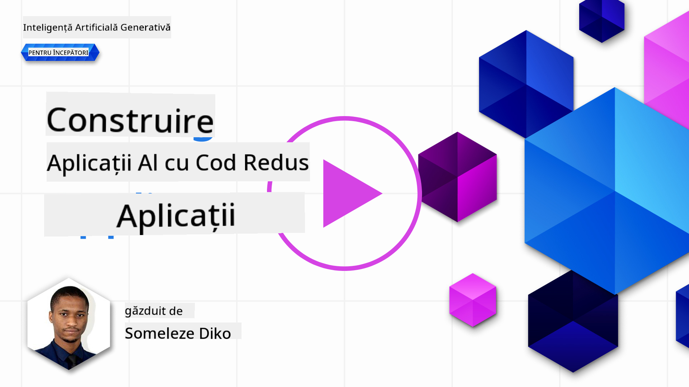
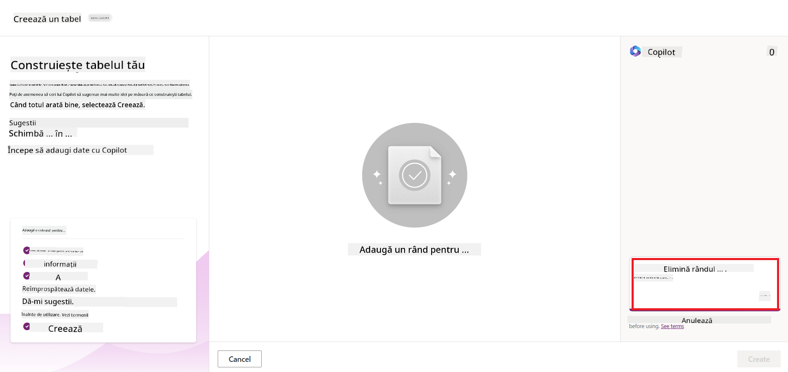

<!--
CO_OP_TRANSLATOR_METADATA:
{
  "original_hash": "f5ff3b6204a695a117d6f452403c95f7",
  "translation_date": "2025-07-09T14:13:28+00:00",
  "source_file": "10-building-low-code-ai-applications/README.md",
  "language_code": "ro"
}
-->
# Construirea aplicațiilor AI cu Low Code

> _(Click pe imaginea de mai sus pentru a viziona videoclipul acestei lecții)_

## Introducere

Acum că am învățat cum să construim aplicații care generează imagini, să vorbim despre low code. AI generativ poate fi folosit în diverse domenii, inclusiv low code, dar ce este low code și cum putem integra AI în acesta?

Construirea aplicațiilor și soluțiilor a devenit mai ușoară atât pentru dezvoltatorii tradiționali, cât și pentru cei fără experiență în programare, prin utilizarea platformelor de dezvoltare Low Code. Platformele Low Code permit crearea de aplicații și soluții cu puțin sau fără cod. Acest lucru se realizează prin oferirea unui mediu vizual de dezvoltare care permite să tragi și să plasezi componente pentru a construi aplicații și soluții. Astfel, poți dezvolta aplicații și soluții mai rapid și cu mai puține resurse. În această lecție, vom explora în detaliu cum să folosim Low Code și cum să îmbunătățim dezvoltarea low code cu AI folosind Power Platform.

Power Platform oferă organizațiilor oportunitatea de a-și împuternici echipele să construiască propriile soluții printr-un mediu intuitiv low-code sau no-code. Acest mediu simplifică procesul de construire a soluțiilor. Cu Power Platform, soluțiile pot fi dezvoltate în zile sau săptămâni, în loc de luni sau ani. Power Platform este compus din cinci produse cheie: Power Apps, Power Automate, Power BI, Power Pages și Copilot Studio.

Această lecție acoperă:

- Introducere în Generative AI în Power Platform  
- Introducere în Copilot și cum să-l folosești  
- Utilizarea Generative AI pentru a construi aplicații și fluxuri în Power Platform  
- Înțelegerea modelelor AI din Power Platform cu AI Builder  

## Obiective de învățare

La finalul acestei lecții, vei putea:

- Înțelege cum funcționează Copilot în Power Platform.  
- Construi o aplicație Student Assignment Tracker pentru startup-ul nostru educațional.  
- Construi un flux de procesare a facturilor care folosește AI pentru a extrage informații din facturi.  
- Aplica cele mai bune practici când folosești modelul AI Create Text with GPT.  

Instrumentele și tehnologiile pe care le vei folosi în această lecție sunt:

- **Power Apps**, pentru aplicația Student Assignment Tracker, care oferă un mediu de dezvoltare low-code pentru construirea aplicațiilor ce urmăresc, gestionează și interacționează cu datele.  
- **Dataverse**, pentru stocarea datelor aplicației Student Assignment Tracker, oferind o platformă low-code pentru date.  
- **Power Automate**, pentru fluxul de procesare a facturilor, oferind un mediu low-code pentru construirea fluxurilor de lucru care automatizează procesul de procesare a facturilor.  
- **AI Builder**, pentru modelul AI de procesare a facturilor, unde vei folosi modele AI predefinite pentru a procesa facturile startup-ului nostru.  

## Generative AI în Power Platform

Îmbunătățirea dezvoltării low-code și a aplicațiilor cu AI generativ este un domeniu cheie pentru Power Platform. Scopul este să permită oricui să construiască aplicații, site-uri, dashboard-uri și să automatizeze procese cu AI, _fără a necesita expertiză în știința datelor_. Acest obiectiv este atins prin integrarea AI generativ în experiența de dezvoltare low-code din Power Platform, sub forma Copilot și AI Builder.

### Cum funcționează?

Copilot este un asistent AI care îți permite să construiești soluții Power Platform descriind cerințele tale printr-o serie de pași conversaționali folosind limbaj natural. De exemplu, poți instrui asistentul AI să specifice ce câmpuri va folosi aplicația ta și acesta va crea atât aplicația, cât și modelul de date subiacente, sau poți indica cum să configurezi un flux în Power Automate.

Poți folosi funcționalitățile conduse de Copilot ca o caracteristică în ecranele aplicației tale pentru a permite utilizatorilor să descopere informații prin interacțiuni conversaționale.

AI Builder este o capacitate AI low-code disponibilă în Power Platform care îți permite să folosești modele AI pentru a automatiza procese și a prezice rezultate. Cu AI Builder poți aduce AI în aplicațiile și fluxurile tale care se conectează la datele din Dataverse sau din diverse surse cloud, cum ar fi SharePoint, OneDrive sau Azure.

Copilot este disponibil în toate produsele Power Platform: Power Apps, Power Automate, Power BI, Power Pages și Power Virtual Agents. AI Builder este disponibil în Power Apps și Power Automate. În această lecție, ne vom concentra pe cum să folosim Copilot și AI Builder în Power Apps și Power Automate pentru a construi o soluție pentru startup-ul nostru educațional.

### Copilot în Power Apps

Ca parte a Power Platform, Power Apps oferă un mediu de dezvoltare low-code pentru construirea aplicațiilor care urmăresc, gestionează și interacționează cu datele. Este un set de servicii pentru dezvoltarea aplicațiilor, cu o platformă de date scalabilă și capacitatea de a se conecta la servicii cloud și date on-premises. Power Apps permite construirea de aplicații care rulează pe browsere, tablete și telefoane și pot fi partajate cu colegii. Power Apps facilitează dezvoltarea aplicațiilor printr-o interfață simplă, astfel încât orice utilizator de business sau dezvoltator profesionist să poată crea aplicații personalizate. Experiența de dezvoltare a aplicațiilor este îmbunătățită și prin AI generativ prin Copilot.

Funcția de asistent AI Copilot în Power Apps îți permite să descrii ce fel de aplicație ai nevoie și ce informații vrei să urmărească, colecteze sau afișeze aplicația ta. Copilot generează apoi o aplicație Canvas responsivă bazată pe descrierea ta. Poți personaliza aplicația pentru a se potrivi nevoilor tale. AI Copilot generează și sugerează un tabel Dataverse cu câmpurile necesare pentru a stoca datele pe care vrei să le urmărești, împreună cu date de exemplu. Vom vedea mai târziu în această lecție ce este Dataverse și cum îl poți folosi în Power Apps. Poți personaliza tabelul pentru a se potrivi nevoilor tale folosind funcția de asistent AI Copilot prin pași conversaționali. Această funcție este disponibilă direct din ecranul principal Power Apps.

### Copilot în Power Automate

Ca parte a Power Platform, Power Automate permite utilizatorilor să creeze fluxuri de lucru automate între aplicații și servicii. Ajută la automatizarea proceselor repetitive de business, cum ar fi comunicarea, colectarea datelor și aprobările deciziilor. Interfața simplă permite utilizatorilor cu orice nivel tehnic (de la începători la dezvoltatori experimentați) să automatizeze sarcini de lucru. Experiența de dezvoltare a fluxurilor este îmbunătățită și prin AI generativ prin Copilot.

Funcția de asistent AI Copilot în Power Automate îți permite să descrii ce fel de flux ai nevoie și ce acțiuni vrei să execute fluxul tău. Copilot generează apoi un flux bazat pe descrierea ta. Poți personaliza fluxul pentru a se potrivi nevoilor tale. AI Copilot generează și sugerează acțiunile necesare pentru a îndeplini sarcina pe care vrei să o automatizezi. Vom vedea mai târziu în această lecție ce sunt fluxurile și cum le poți folosi în Power Automate. Poți personaliza acțiunile pentru a se potrivi nevoilor tale folosind funcția de asistent AI Copilot prin pași conversaționali. Această funcție este disponibilă direct din ecranul principal Power Automate.

## Tema: Gestionează temele studenților și facturile pentru startup-ul nostru, folosind Copilot

Startup-ul nostru oferă cursuri online studenților. Startup-ul a crescut rapid și acum întâmpină dificultăți în a face față cererii pentru cursurile sale. Startup-ul te-a angajat ca dezvoltator Power Platform pentru a-i ajuta să construiască o soluție low code care să îi ajute să gestioneze temele studenților și facturile. Soluția lor ar trebui să poată urmări și gestiona temele studenților printr-o aplicație și să automatizeze procesul de procesare a facturilor printr-un flux de lucru. Ți s-a cerut să folosești Generative AI pentru a dezvolta soluția.

Când începi să folosești Copilot, poți folosi [Power Platform Copilot Prompt Library](https://github.com/pnp/powerplatform-prompts?WT.mc_id=academic-109639-somelezediko) pentru a te familiariza cu prompturile. Această bibliotecă conține o listă de prompturi pe care le poți folosi pentru a construi aplicații și fluxuri cu Copilot. De asemenea, poți folosi prompturile din bibliotecă pentru a-ți face o idee despre cum să-ți descrii cerințele către Copilot.

### Construiește o aplicație Student Assignment Tracker pentru startup-ul nostru

Educatorii din startup-ul nostru au avut dificultăți în a urmări temele studenților. Au folosit un tabel Excel pentru a urmări temele, dar acest lucru a devenit greu de gestionat pe măsură ce numărul studenților a crescut. Ei ți-au cerut să construiești o aplicație care să îi ajute să urmărească și să gestioneze temele studenților. Aplicația ar trebui să le permită să adauge teme noi, să vizualizeze temele, să actualizeze temele și să șteargă teme. Aplicația ar trebui să permită, de asemenea, educatorilor și studenților să vadă temele care au fost notate și cele care nu au fost notate.

Vei construi aplicația folosind Copilot în Power Apps urmând pașii de mai jos:

1. Accesează ecranul principal [Power Apps](https://make.powerapps.com?WT.mc_id=academic-105485-koreyst).

1. Folosește zona de text de pe ecranul principal pentru a descrie aplicația pe care vrei să o construiești. De exemplu, **_Vreau să construiesc o aplicație pentru a urmări și gestiona temele studenților_**. Apasă butonul **Send** pentru a trimite promptul către AI Copilot.

1. AI Copilot va sugera un tabel Dataverse cu câmpurile necesare pentru a stoca datele pe care vrei să le urmărești și câteva date de exemplu. Poți personaliza apoi tabelul pentru a se potrivi nevoilor tale folosind funcția de asistent AI Copilot prin pași conversaționali.

   > **Important**: Dataverse este platforma de date subiacente pentru Power Platform. Este o platformă low-code pentru stocarea datelor aplicației. Este un serviciu complet gestionat care stochează datele în siguranță în Microsoft Cloud și este provisionat în mediul tău Power Platform. Vine cu capabilități încorporate de guvernanță a datelor, cum ar fi clasificarea datelor, trasabilitatea datelor, controlul accesului detaliat și altele. Poți afla mai multe despre Dataverse [aici](https://docs.microsoft.com/powerapps/maker/data-platform/data-platform-intro?WT.mc_id=academic-109639-somelezediko).

   

1. Educatorii vor să trimită emailuri studenților care și-au predat temele pentru a-i ține la curent cu progresul temelor. Poți folosi Copilot pentru a adăuga un câmp nou în tabel pentru a stoca emailul studentului. De exemplu, poți folosi următorul prompt pentru a adăuga un câmp nou în tabel: **_Vreau să adaug o coloană pentru a stoca emailul studentului_**. Apasă butonul **Send** pentru a trimite promptul către AI Copilot.

1. AI Copilot va genera un câmp nou și apoi îl poți personaliza pentru a se potrivi nevoilor tale.

1. După ce ai terminat cu tabelul, apasă butonul **Create app** pentru a crea aplicația.

1. AI Copilot va genera o aplicație Canvas responsivă bazată pe descrierea ta. Poți personaliza apoi aplicația pentru a se potrivi nevoilor tale.

1. Pentru ca educatorii să poată trimite emailuri studenților, poți folosi Copilot pentru a adăuga un ecran nou în aplicație. De exemplu, poți folosi următorul prompt pentru a adăuga un ecran nou în aplicație: **_Vreau să adaug un ecran pentru a trimite emailuri studenților_**. Apasă butonul **Send** pentru a trimite promptul către AI Copilot.

1. AI Copilot va genera un ecran nou și apoi îl poți personaliza pentru a se potrivi nevoilor tale.

1. După ce ai terminat cu aplicația, apasă butonul **Save** pentru a salva aplicația.

1. Pentru a partaja aplicația cu educatorii, apasă butonul **Share** și apoi din nou butonul **Share**. Poți partaja aplicația cu educatorii introducând adresele lor de email.

> **Tema ta**: Aplicația pe care tocmai ai construit-o este un început bun, dar poate fi îmbunătățită. Cu funcția de email, educatorii pot trimite emailuri studenților doar manual, tastând adresele lor de email. Poți folosi Copilot pentru a construi o automatizare care să permită educatorilor să trimită emailuri studenților automat atunci când aceștia predau temele? Indiciul tău este că, cu promptul potrivit, poți folosi Copilot în Power Automate pentru a construi acest flux.

### Construiește un tabel pentru informațiile facturilor pentru startup-ul nostru

Echipa financiară a startup-ului nostru a avut dificultăți în a urmări facturile. Au folosit un tabel Excel pentru a urmări facturile, dar acest lucru a devenit greu de gestionat pe măsură ce numărul facturilor a crescut. Ei ți-au cerut să construiești un tabel care să îi ajute să stocheze, urmărească și gestioneze informațiile facturilor primite. Tabelul ar trebui folosit pentru a construi o automatizare care să extragă toate informațiile facturilor și să le stocheze în tabel. Tabelul ar trebui să permită, de asemenea, echipei financiare să vadă facturile care au fost plătite și cele care nu au fost plătite.

Power Platform are o platformă de date subiacente numită Dataverse care îți permite să stochezi datele pentru aplicațiile și soluțiile tale. Dataverse oferă o platformă low-code pentru stocarea datelor aplicației. Este un serviciu complet gestionat care stochează datele în siguranță în Microsoft Cloud și este provisionat în mediul tău Power Platform. Vine cu capabilități încorporate de guvernanță a datelor, cum ar fi clasificarea datelor, trasabilitatea datelor, controlul accesului detaliat și altele. Poți afla mai multe [despre Dataverse aici](https://docs.microsoft.com/powerapps/maker/data-platform/data-platform-intro?WT.mc_id=academic-109639-somelezediko).

De ce ar trebui să folosim Dataverse pentru startup-ul nostru? Tabelele standard și personalizate din Dataverse oferă o opțiune sigură și bazată pe cloud pentru stocarea datelor tale. Tabelele îți permit să stochezi diferite tipuri de date, similar cu modul în care ai folosi mai multe foi de calcul într-un singur registru Excel. Poți folosi tabele pentru a stoca date specifice organizației sau nevoilor tale de business. Unele dintre beneficiile pe care startup-ul nostru le va obține folosind Dataverse includ, dar nu se limitează la:
- **Ușor de gestionat**: Atât metadatele, cât și datele sunt stocate în cloud, așa că nu trebuie să te îngrijorezi de detaliile legate de modul în care sunt stocate sau gestionate. Te poți concentra pe construirea aplicațiilor și soluțiilor tale.

- **Securizat**: Dataverse oferă o opțiune sigură și bazată pe cloud pentru stocarea datelor tale. Poți controla cine are acces la datele din tabelele tale și cum pot accesa acestea folosind securitatea bazată pe roluri.

- **Metadate bogate**: Tipurile de date și relațiile sunt utilizate direct în Power Apps.

- **Logică și validare**: Poți folosi reguli de afaceri, câmpuri calculate și reguli de validare pentru a impune logica de afaceri și a menține acuratețea datelor.

Acum că știi ce este Dataverse și de ce ar trebui să îl folosești, să vedem cum poți folosi Copilot pentru a crea un tabel în Dataverse care să îndeplinească cerințele echipei noastre financiare.

> **Note** : Vei folosi acest tabel în secțiunea următoare pentru a construi o automatizare care va extrage toate informațiile facturii și le va stoca în tabel.

Pentru a crea un tabel în Dataverse folosind Copilot, urmează pașii de mai jos:

1. Navighează la ecranul principal [Power Apps](https://make.powerapps.com?WT.mc_id=academic-105485-koreyst).

2. În bara de navigare din stânga, selectează **Tables** și apoi fă clic pe **Describe the new Table**.

3. Pe ecranul **Describe the new Table**, folosește zona de text pentru a descrie tabelul pe care vrei să îl creezi. De exemplu, **_Vreau să creez un tabel pentru a stoca informații despre facturi_**. Apasă butonul **Send** pentru a trimite promptul către AI Copilot.

4. AI Copilot va sugera un tabel Dataverse cu câmpurile necesare pentru a stoca datele pe care vrei să le urmărești și câteva date de exemplu. Apoi poți personaliza tabelul pentru a se potrivi nevoilor tale folosind funcția asistent AI Copilot prin pași conversaționali.

5. Echipa financiară dorește să trimită un email furnizorului pentru a-l informa despre stadiul curent al facturii. Poți folosi Copilot pentru a adăuga un câmp nou în tabel pentru a stoca emailul furnizorului. De exemplu, poți folosi următorul prompt pentru a adăuga un câmp nou în tabel: **_Vreau să adaug o coloană pentru a stoca emailul furnizorului_**. Apasă butonul **Send** pentru a trimite promptul către AI Copilot.

6. AI Copilot va genera un câmp nou, iar tu îl poți personaliza pentru a se potrivi nevoilor tale.

7. După ce ai terminat cu tabelul, apasă butonul **Create** pentru a crea tabelul.

## Modele AI în Power Platform cu AI Builder

AI Builder este o capacitate AI low-code disponibilă în Power Platform care îți permite să folosești Modele AI pentru a automatiza procese și a prezice rezultate. Cu AI Builder poți integra AI în aplicațiile și fluxurile tale care se conectează la datele din Dataverse sau din diverse surse de date cloud, cum ar fi SharePoint, OneDrive sau Azure.

## Modele AI predefinite vs Modele AI personalizate

AI Builder oferă două tipuri de modele AI: Modele AI predefinite și Modele AI personalizate. Modelele AI predefinite sunt modele gata de utilizare, antrenate de Microsoft și disponibile în Power Platform. Acestea te ajută să adaugi inteligență aplicațiilor și fluxurilor tale fără să fie nevoie să colectezi date și să construiești, antrenezi și publici propriile modele. Poți folosi aceste modele pentru a automatiza procese și a prezice rezultate.

Unele dintre Modelele AI predefinite disponibile în Power Platform includ:

- **Key Phrase Extraction**: Acest model extrage expresii cheie din text.
- **Language Detection**: Acest model detectează limba unui text.
- **Sentiment Analysis**: Acest model detectează sentimente pozitive, negative, neutre sau mixte în text.
- **Business Card Reader**: Acest model extrage informații din cărți de vizită.
- **Text Recognition**: Acest model extrage text din imagini.
- **Object Detection**: Acest model detectează și extrage obiecte din imagini.
- **Document processing**: Acest model extrage informații din formulare.
- **Invoice Processing**: Acest model extrage informații din facturi.

Cu Modelele AI personalizate poți aduce propriul model în AI Builder astfel încât să funcționeze ca orice model personalizat AI Builder, permițându-ți să antrenezi modelul folosind propriile date. Poți folosi aceste modele pentru a automatiza procese și a prezice rezultate atât în Power Apps, cât și în Power Automate. Când folosești propriul model, există anumite limitări care se aplică. Citește mai multe despre aceste [limitări](https://learn.microsoft.com/ai-builder/byo-model#limitations?WT.mc_id=academic-105485-koreyst).

## Tema #2 - Construiește un flux de procesare a facturilor pentru startup-ul nostru

Echipa financiară a întâmpinat dificultăți în procesarea facturilor. Au folosit un tabel Excel pentru a urmări facturile, dar acest lucru a devenit greu de gestionat pe măsură ce numărul facturilor a crescut. Ei ți-au cerut să construiești un flux de lucru care să îi ajute să proceseze facturile folosind AI. Fluxul de lucru ar trebui să le permită să extragă informații din facturi și să stocheze aceste informații într-un tabel Dataverse. De asemenea, fluxul ar trebui să le permită să trimită un email echipei financiare cu informațiile extrase.

Acum că știi ce este AI Builder și de ce ar trebui să îl folosești, să vedem cum poți folosi modelul AI Invoice Processing din AI Builder, pe care l-am acoperit anterior, pentru a construi un flux de lucru care să ajute echipa financiară să proceseze facturile.

Pentru a construi un flux de lucru care să ajute echipa financiară să proceseze facturile folosind modelul AI Invoice Processing din AI Builder, urmează pașii de mai jos:

1. Navighează la ecranul principal [Power Automate](https://make.powerautomate.com?WT.mc_id=academic-105485-koreyst).

2. Folosește zona de text de pe ecranul principal pentru a descrie fluxul de lucru pe care vrei să îl construiești. De exemplu, **_Procesează o factură când ajunge în căsuța mea poștală_**. Apasă butonul **Send** pentru a trimite promptul către AI Copilot.

   

3. AI Copilot va sugera acțiunile necesare pentru a automatiza sarcina dorită. Poți apăsa butonul **Next** pentru a parcurge pașii următori.

4. La pasul următor, Power Automate îți va cere să configurezi conexiunile necesare pentru flux. După ce ai terminat, apasă butonul **Create flow** pentru a crea fluxul.

5. AI Copilot va genera un flux pe care îl poți personaliza pentru a se potrivi nevoilor tale.

6. Actualizează declanșatorul fluxului și setează **Folder** la folderul în care vor fi stocate facturile. De exemplu, poți seta folderul la **Inbox**. Apasă pe **Show advanced options** și setează **Only with Attachments** pe **Yes**. Astfel, fluxul va rula doar când un email cu atașament este primit în folder.

7. Elimină următoarele acțiuni din flux: **HTML to text**, **Compose**, **Compose 2**, **Compose 3** și **Compose 4**, deoarece nu le vei folosi.

8. Elimină acțiunea **Condition** din flux deoarece nu o vei folosi. Ar trebui să arate ca în captura de ecran de mai jos:

   

9. Apasă pe butonul **Add an action** și caută **Dataverse**. Selectează acțiunea **Add a new row**.

10. La acțiunea **Extract Information from invoices**, actualizează **Invoice File** să indice către **Attachment Content** din email. Astfel, fluxul va extrage informații din atașamentul facturii.

11. Selectează **Table** pe care ai creat-o anterior. De exemplu, poți selecta tabelul **Invoice Information**. Alege conținutul dinamic din acțiunea anterioară pentru a completa următoarele câmpuri:

    - ID
    - Amount
    - Date
    - Name
    - Status - Setează **Status** pe **Pending**.
    - Supplier Email - Folosește conținutul dinamic **From** din declanșatorul **When a new email arrives**.

    

12. După ce ai terminat cu fluxul, apasă butonul **Save** pentru a salva fluxul. Poți testa fluxul trimițând un email cu o factură către folderul specificat în declanșator.

> **Tema ta**: Fluxul pe care tocmai l-ai construit este un început bun, acum trebuie să te gândești cum poți construi o automatizare care să permită echipei noastre financiare să trimită un email furnizorului pentru a-l informa despre stadiul curent al facturii. Indiciul tău: fluxul trebuie să ruleze când se schimbă statusul facturii.

## Folosește un model AI de generare text în Power Automate

Modelul AI Create Text with GPT din AI Builder îți permite să generezi text pe baza unui prompt și este alimentat de Microsoft Azure OpenAI Service. Cu această capacitate, poți integra tehnologia GPT (Generative Pre-Trained Transformer) în aplicațiile și fluxurile tale pentru a construi o varietate de fluxuri automate și aplicații inteligente.

Modelele GPT sunt antrenate pe cantități mari de date, ceea ce le permite să producă texte care seamănă foarte mult cu limbajul uman atunci când primesc un prompt. Integrate în automatizarea fluxurilor de lucru, modelele AI precum GPT pot fi folosite pentru a simplifica și automatiza o gamă largă de sarcini.

De exemplu, poți construi fluxuri care generează automat texte pentru diverse cazuri de utilizare, cum ar fi: schițe de emailuri, descrieri de produse și altele. De asemenea, poți folosi modelul pentru a genera text pentru diverse aplicații, cum ar fi chatboți și aplicații de servicii pentru clienți care permit agenților să răspundă eficient și rapid la întrebările clienților.

Pentru a învăța cum să folosești acest model AI în Power Automate, parcurge modulul [Add intelligence with AI Builder and GPT](https://learn.microsoft.com/training/modules/ai-builder-text-generation/?WT.mc_id=academic-109639-somelezediko).

## Bravo! Continuă să înveți

După ce ai terminat această lecție, consultă colecția noastră [Generative AI Learning collection](https://aka.ms/genai-collection?WT.mc_id=academic-105485-koreyst) pentru a-ți aprofunda cunoștințele despre Generative AI!

Mergi la Lecția 11 unde vom vedea cum să [integrezi Generative AI cu Function Calling](../11-integrating-with-function-calling/README.md?WT.mc_id=academic-105485-koreyst)!

**Declinare de responsabilitate**:  
Acest document a fost tradus folosind serviciul de traducere AI [Co-op Translator](https://github.com/Azure/co-op-translator). Deși ne străduim pentru acuratețe, vă rugăm să rețineți că traducerile automate pot conține erori sau inexactități. Documentul original în limba sa nativă trebuie considerat sursa autorizată. Pentru informații critice, se recomandă traducerea profesională realizată de un specialist uman. Nu ne asumăm răspunderea pentru eventualele neînțelegeri sau interpretări greșite rezultate din utilizarea acestei traduceri.