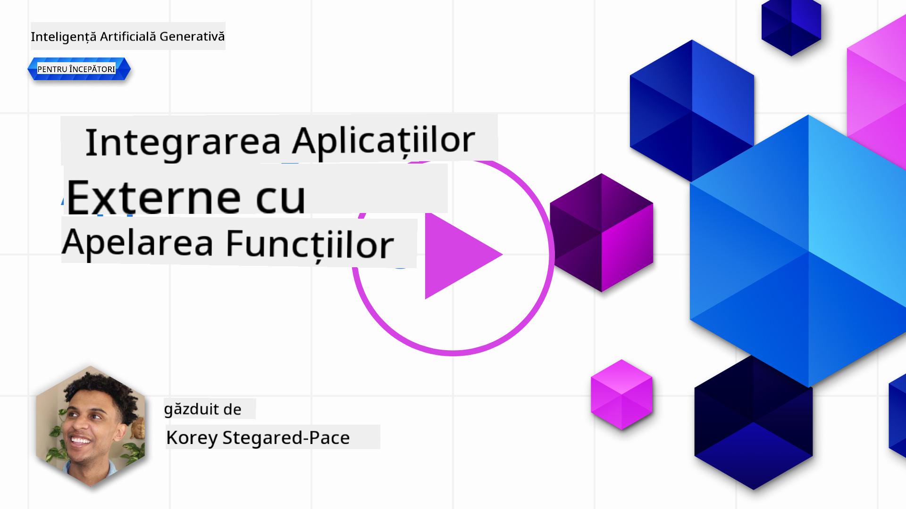
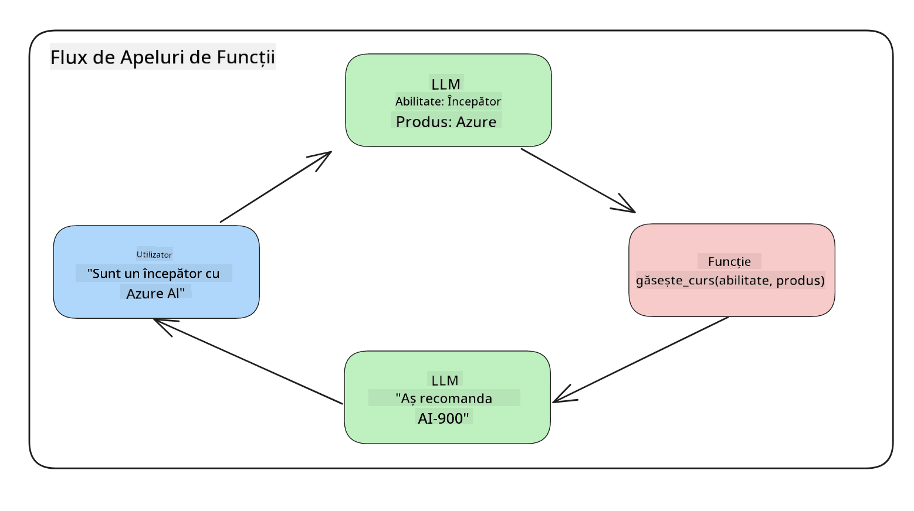

<!--
CO_OP_TRANSLATOR_METADATA:
{
  "original_hash": "77a48a201447be19aa7560706d6f93a0",
  "translation_date": "2025-05-19T21:38:03+00:00",
  "source_file": "11-integrating-with-function-calling/README.md",
  "language_code": "ro"
}
-->
# Integrarea cu apelarea funcțiilor

[](https://aka.ms/gen-ai-lesson11-gh?WT.mc_id=academic-105485-koreyst)

Ai învățat destul de multe până acum în lecțiile anterioare. Totuși, putem să îmbunătățim și mai mult. Unele lucruri pe care le putem aborda sunt cum putem obține un format de răspuns mai consistent pentru a fi mai ușor de lucrat cu răspunsul ulterior. De asemenea, poate dorim să adăugăm date din alte surse pentru a îmbogăți aplicația noastră.

Problemele menționate mai sus sunt ceea ce acest capitol dorește să abordeze.

## Introducere

Această lecție va acoperi:

- Explicarea ce este apelarea funcțiilor și cazurile de utilizare ale acesteia.
- Crearea unui apel de funcție folosind Azure OpenAI.
- Cum să integrezi un apel de funcție într-o aplicație.

## Obiective de învățare

Până la sfârșitul acestei lecții, vei putea:

- Explica scopul utilizării apelării funcțiilor.
- Configura apelul de funcție folosind serviciul Azure OpenAI.
- Proiecta apeluri de funcții eficiente pentru cazurile de utilizare ale aplicației tale.

## Scenariu: Îmbunătățirea chatbot-ului nostru cu funcții

Pentru această lecție, dorim să construim o caracteristică pentru startup-ul nostru educațional care să permită utilizatorilor să folosească un chatbot pentru a găsi cursuri tehnice. Vom recomanda cursuri care se potrivesc nivelului lor de competență, rolului actual și tehnologiei de interes.

Pentru a finaliza acest scenariu, vom folosi o combinație de:

- `Azure OpenAI` pentru a crea o experiență de chat pentru utilizator.
- `Microsoft Learn Catalog API` pentru a ajuta utilizatorii să găsească cursuri pe baza cererii utilizatorului.
- `Function Calling` pentru a lua interogarea utilizatorului și a o trimite către o funcție pentru a face cererea API.

Pentru a începe, să vedem de ce am dori să folosim apelarea funcțiilor în primul rând:

## De ce apelarea funcțiilor

Înainte de apelarea funcțiilor, răspunsurile de la un LLM erau nestructurate și inconsistente. Dezvoltatorii erau nevoiți să scrie cod de validare complex pentru a se asigura că pot gestiona fiecare variație a unui răspuns. Utilizatorii nu puteau obține răspunsuri precum "Care este vremea actuală în Stockholm?". Acest lucru se întâmplă deoarece modelele erau limitate la timpul în care datele au fost antrenate.

Apelarea funcțiilor este o caracteristică a serviciului Azure OpenAI pentru a depăși următoarele limitări:

- **Format de răspuns consistent**. Dacă putem controla mai bine formatul răspunsului, putem integra mai ușor răspunsul ulterior în alte sisteme.
- **Date externe**. Capacitatea de a folosi date din alte surse ale unei aplicații într-un context de chat.

## Ilustrarea problemei printr-un scenariu

> Recomandăm să folosești [notebook-ul inclus](../../../11-integrating-with-function-calling/python/aoai-assignment.ipynb) dacă dorești să rulezi scenariul de mai jos. Poți, de asemenea, să citești mai departe, deoarece încercăm să ilustrăm o problemă unde funcțiile pot ajuta la abordarea problemei.

Să privim exemplul care ilustrează problema formatului de răspuns:

Să presupunem că dorim să creăm o bază de date cu datele studenților pentru a le putea sugera cursul potrivit. Mai jos avem două descrieri ale studenților care sunt foarte asemănătoare în datele pe care le conțin.

1. Creează o conexiune la resursa noastră Azure OpenAI:

   ```python
   import os
   import json
   from openai import AzureOpenAI
   from dotenv import load_dotenv
   load_dotenv()

   client = AzureOpenAI(
   api_key=os.environ['AZURE_OPENAI_API_KEY'],  # this is also the default, it can be omitted
   api_version = "2023-07-01-preview"
   )

   deployment=os.environ['AZURE_OPENAI_DEPLOYMENT']
   ```

   Mai jos este un cod Python pentru configurarea conexiunii noastre la Azure OpenAI unde setăm `api_type`, `api_base`, `api_version` and `api_key`.

1. Creating two student descriptions using variables `student_1_description` and `student_2_description`.

   ```python
   student_1_description="Emily Johnson is a sophomore majoring in computer science at Duke University. She has a 3.7 GPA. Emily is an active member of the university's Chess Club and Debate Team. She hopes to pursue a career in software engineering after graduating."

   student_2_description = "Michael Lee is a sophomore majoring in computer science at Stanford University. He has a 3.8 GPA. Michael is known for his programming skills and is an active member of the university's Robotics Club. He hopes to pursue a career in artificial intelligence after finishing his studies."
   ```

   Dorim să trimitem descrierile studenților de mai sus la un LLM pentru a analiza datele. Aceste date pot fi utilizate ulterior în aplicația noastră și trimise la un API sau stocate într-o bază de date.

1. Să creăm două prompturi identice în care instruim LLM-ul asupra informațiilor care ne interesează:

   ```python
   prompt1 = f'''
   Please extract the following information from the given text and return it as a JSON object:

   name
   major
   school
   grades
   club

   This is the body of text to extract the information from:
   {student_1_description}
   '''

   prompt2 = f'''
   Please extract the following information from the given text and return it as a JSON object:

   name
   major
   school
   grades
   club

   This is the body of text to extract the information from:
   {student_2_description}
   '''
   ```

   Prompturile de mai sus instruiesc LLM-ul să extragă informații și să returneze răspunsul în format JSON.

1. După ce am configurat prompturile și conexiunea la Azure OpenAI, vom trimite acum prompturile către LLM folosind `openai.ChatCompletion`. We store the prompt in the `messages` variable and assign the role to `user`. Acest lucru este pentru a imita un mesaj de la un utilizator scris către un chatbot.

   ```python
   # response from prompt one
   openai_response1 = client.chat.completions.create(
   model=deployment,
   messages = [{'role': 'user', 'content': prompt1}]
   )
   openai_response1.choices[0].message.content

   # response from prompt two
   openai_response2 = client.chat.completions.create(
   model=deployment,
   messages = [{'role': 'user', 'content': prompt2}]
   )
   openai_response2.choices[0].message.content
   ```

Acum putem trimite ambele cereri către LLM și examina răspunsul pe care îl primim găsindu-l astfel `openai_response1['choices'][0]['message']['content']`.

1. Lastly, we can convert the response to JSON format by calling `json.loads`:

   ```python
   # Loading the response as a JSON object
   json_response1 = json.loads(openai_response1.choices[0].message.content)
   json_response1
   ```

   Răspunsul 1:

   ```json
   {
     "name": "Emily Johnson",
     "major": "computer science",
     "school": "Duke University",
     "grades": "3.7",
     "club": "Chess Club"
   }
   ```

   Răspunsul 2:

   ```json
   {
     "name": "Michael Lee",
     "major": "computer science",
     "school": "Stanford University",
     "grades": "3.8 GPA",
     "club": "Robotics Club"
   }
   ```

   Deși prompturile sunt aceleași și descrierile sunt similare, vedem valori ale `Grades` property formatted differently, as we can sometimes get the format `3.7` or `3.7 GPA` for example.

   This result is because the LLM takes unstructured data in the form of the written prompt and returns also unstructured data. We need to have a structured format so that we know what to expect when storing or using this data

So how do we solve the formatting problem then? By using functional calling, we can make sure that we receive structured data back. When using function calling, the LLM does not actually call or run any functions. Instead, we create a structure for the LLM to follow for its responses. We then use those structured responses to know what function to run in our applications.



We can then take what is returned from the function and send this back to the LLM. The LLM will then respond using natural language to answer the user's query.

## Use Cases for using function calls

There are many different use cases where function calls can improve your app like:

- **Calling External Tools**. Chatbots are great at providing answers to questions from users. By using function calling, the chatbots can use messages from users to complete certain tasks. For example, a student can ask the chatbot to "Send an email to my instructor saying I need more assistance with this subject". This can make a function call to `send_email(to: string, body: string)`

- **Create API or Database Queries**. Users can find information using natural language that gets converted into a formatted query or API request. An example of this could be a teacher who requests "Who are the students that completed the last assignment" which could call a function named `get_completed(student_name: string, assignment: int, current_status: string)`

- **Creating Structured Data**. Users can take a block of text or CSV and use the LLM to extract important information from it. For example, a student can convert a Wikipedia article about peace agreements to create AI flashcards. This can be done by using a function called `get_important_facts(agreement_name: string, date_signed: string, parties_involved: list)`

## Creating Your First Function Call

The process of creating a function call includes 3 main steps:

1. **Calling** the Chat Completions API with a list of your functions and a user message.
2. **Reading** the model's response to perform an action i.e. execute a function or API Call.
3. **Making** another call to Chat Completions API with the response from your function to use that information to create a response to the user.


### Step 1 - creating messages

The first step is to create a user message. This can be dynamically assigned by taking the value of a text input or you can assign a value here. If this is your first time working with the Chat Completions API, we need to define the `role` and the `content` of the message.

The `role` can be either `system` (creating rules), `assistant` (the model) or `user` (the end-user). For function calling, we will assign this as `user` și o întrebare exemplu.

```python
messages= [ {"role": "user", "content": "Find me a good course for a beginner student to learn Azure."} ]
```

Prin atribuirea de roluri diferite, este clar pentru LLM dacă sistemul spune ceva sau utilizatorul, ceea ce ajută la construirea unui istoric de conversație pe care LLM-ul poate construi.

### Pasul 2 - crearea funcțiilor

În continuare, vom defini o funcție și parametrii acelei funcții. Vom folosi doar o funcție aici numită `search_courses` but you can create multiple functions.

> **Important** : Functions are included in the system message to the LLM and will be included in the amount of available tokens you have available.

Below, we create the functions as an array of items. Each item is a function and has properties `name`, `description` and `parameters`:

```python
functions = [
   {
      "name":"search_courses",
      "description":"Retrieves courses from the search index based on the parameters provided",
      "parameters":{
         "type":"object",
         "properties":{
            "role":{
               "type":"string",
               "description":"The role of the learner (i.e. developer, data scientist, student, etc.)"
            },
            "product":{
               "type":"string",
               "description":"The product that the lesson is covering (i.e. Azure, Power BI, etc.)"
            },
            "level":{
               "type":"string",
               "description":"The level of experience the learner has prior to taking the course (i.e. beginner, intermediate, advanced)"
            }
         },
         "required":[
            "role"
         ]
      }
   }
]
```

Să descriem fiecare instanță de funcție mai detaliat mai jos:

- `name` - The name of the function that we want to have called.
- `description` - This is the description of how the function works. Here it's important to be specific and clear.
- `parameters` - A list of values and format that you want the model to produce in its response. The parameters array consists of items where the items have the following properties:
  1.  `type` - The data type of the properties will be stored in.
  1.  `properties` - List of the specific values that the model will use for its response
      1. `name` - The key is the name of the property that the model will use in its formatted response, for example, `product`.
      1. `type` - The data type of this property, for example, `string`.
      1. `description` - Description of the specific property.

There's also an optional property `required` - required property for the function call to be completed.

### Step 3 - Making the function call

After defining a function, we now need to include it in the call to the Chat Completion API. We do this by adding `functions` to the request. In this case `functions=functions`.

There is also an option to set `function_call` to `auto`. This means we will let the LLM decide which function should be called based on the user message rather than assigning it ourselves.

Here's some code below where we call `ChatCompletion.create`, note how we set `functions=functions` and `function_call="auto"` și astfel dând LLM-ului alegerea când să apeleze funcțiile pe care le oferim:

```python
response = client.chat.completions.create(model=deployment,
                                        messages=messages,
                                        functions=functions,
                                        function_call="auto")

print(response.choices[0].message)
```

Răspunsul care vine înapoi arată acum astfel:

```json
{
  "role": "assistant",
  "function_call": {
    "name": "search_courses",
    "arguments": "{\n  \"role\": \"student\",\n  \"product\": \"Azure\",\n  \"level\": \"beginner\"\n}"
  }
}
```

Aici putem vedea cum funcția `search_courses` was called and with what arguments, as listed in the `arguments` property in the JSON response.

The conclusion the LLM was able to find the data to fit the arguments of the function as it was extracting it from the value provided to the `messages` parameter in the chat completion call. Below is a reminder of the `messages` valoare:

```python
messages= [ {"role": "user", "content": "Find me a good course for a beginner student to learn Azure."} ]
```

După cum poți vedea, `student`, `Azure` and `beginner` was extracted from `messages` and set as input to the function. Using functions this way is a great way to extract information from a prompt but also to provide structure to the LLM and have reusable functionality.

Next, we need to see how we can use this in our app.

## Integrating Function Calls into an Application

After we have tested the formatted response from the LLM, we can now integrate this into an application.

### Managing the flow

To integrate this into our application, let's take the following steps:

1. First, let's make the call to the OpenAI services and store the message in a variable called `response_message`.

   ```python
   response_message = response.choices[0].message
   ```

1. Acum vom defini funcția care va apela API-ul Microsoft Learn pentru a obține o listă de cursuri:

   ```python
   import requests

   def search_courses(role, product, level):
     url = "https://learn.microsoft.com/api/catalog/"
     params = {
        "role": role,
        "product": product,
        "level": level
     }
     response = requests.get(url, params=params)
     modules = response.json()["modules"]
     results = []
     for module in modules[:5]:
        title = module["title"]
        url = module["url"]
        results.append({"title": title, "url": url})
     return str(results)
   ```

   Observă cum acum creăm o funcție Python reală care se mapă la numele funcțiilor introduse în `functions` variable. We're also making real external API calls to fetch the data we need. In this case, we go against the Microsoft Learn API to search for training modules.

Ok, so we created `functions` variables and a corresponding Python function, how do we tell the LLM how to map these two together so our Python function is called?

1. To see if we need to call a Python function, we need to look into the LLM response and see if `function_call` face parte din aceasta și apelăm funcția indicată. Iată cum poți face verificarea menționată mai jos:

   ```python
   # Check if the model wants to call a function
   if response_message.function_call.name:
    print("Recommended Function call:")
    print(response_message.function_call.name)
    print()

    # Call the function.
    function_name = response_message.function_call.name

    available_functions = {
            "search_courses": search_courses,
    }
    function_to_call = available_functions[function_name]

    function_args = json.loads(response_message.function_call.arguments)
    function_response = function_to_call(**function_args)

    print("Output of function call:")
    print(function_response)
    print(type(function_response))


    # Add the assistant response and function response to the messages
    messages.append( # adding assistant response to messages
        {
            "role": response_message.role,
            "function_call": {
                "name": function_name,
                "arguments": response_message.function_call.arguments,
            },
            "content": None
        }
    )
    messages.append( # adding function response to messages
        {
            "role": "function",
            "name": function_name,
            "content":function_response,
        }
    )
   ```

   Aceste trei linii asigură extragerea numelui funcției, a argumentelor și efectuarea apelului:

   ```python
   function_to_call = available_functions[function_name]

   function_args = json.loads(response_message.function_call.arguments)
   function_response = function_to_call(**function_args)
   ```

   Mai jos este ieșirea din rularea codului nostru:

   **Output**

   ```Recommended Function call:
   {
     "name": "search_courses",
     "arguments": "{\n  \"role\": \"student\",\n  \"product\": \"Azure\",\n  \"level\": \"beginner\"\n}"
   }

   Output of function call:
   [{'title': 'Describe concepts of cryptography', 'url': 'https://learn.microsoft.com/training/modules/describe-concepts-of-cryptography/?
   WT.mc_id=api_CatalogApi'}, {'title': 'Introduction to audio classification with TensorFlow', 'url': 'https://learn.microsoft.com/en-
   us/training/modules/intro-audio-classification-tensorflow/?WT.mc_id=api_CatalogApi'}, {'title': 'Design a Performant Data Model in Azure SQL
   Database with Azure Data Studio', 'url': 'https://learn.microsoft.com/training/modules/design-a-data-model-with-ads/?
   WT.mc_id=api_CatalogApi'}, {'title': 'Getting started with the Microsoft Cloud Adoption Framework for Azure', 'url':
   'https://learn.microsoft.com/training/modules/cloud-adoption-framework-getting-started/?WT.mc_id=api_CatalogApi'}, {'title': 'Set up the
   Rust development environment', 'url': 'https://learn.microsoft.com/training/modules/rust-set-up-environment/?WT.mc_id=api_CatalogApi'}]
   <class 'str'>
   ```

1. Acum vom trimite mesajul actualizat, `messages` către LLM pentru a primi un răspuns în limbaj natural în loc de un răspuns formatat JSON API.

   ```python
   print("Messages in next request:")
   print(messages)
   print()

   second_response = client.chat.completions.create(
      messages=messages,
      model=deployment,
      function_call="auto",
      functions=functions,
      temperature=0
         )  # get a new response from GPT where it can see the function response


   print(second_response.choices[0].message)
   ```

   **Output**

   ```python
   {
     "role": "assistant",
     "content": "I found some good courses for beginner students to learn Azure:\n\n1. [Describe concepts of cryptography] (https://learn.microsoft.com/training/modules/describe-concepts-of-cryptography/?WT.mc_id=api_CatalogApi)\n2. [Introduction to audio classification with TensorFlow](https://learn.microsoft.com/training/modules/intro-audio-classification-tensorflow/?WT.mc_id=api_CatalogApi)\n3. [Design a Performant Data Model in Azure SQL Database with Azure Data Studio](https://learn.microsoft.com/training/modules/design-a-data-model-with-ads/?WT.mc_id=api_CatalogApi)\n4. [Getting started with the Microsoft Cloud Adoption Framework for Azure](https://learn.microsoft.com/training/modules/cloud-adoption-framework-getting-started/?WT.mc_id=api_CatalogApi)\n5. [Set up the Rust development environment](https://learn.microsoft.com/training/modules/rust-set-up-environment/?WT.mc_id=api_CatalogApi)\n\nYou can click on the links to access the courses."
   }

   ```

## Temă

Pentru a continua învățarea despre Azure OpenAI Function Calling poți construi:

- Mai mulți parametri ai funcției care ar putea ajuta cursanții să găsească mai multe cursuri.
- Creează un alt apel de funcție care ia mai multe informații de la cursant, cum ar fi limba lor maternă.
- Creează gestionarea erorilor atunci când apelul funcției și/sau apelul API nu returnează niciun curs potrivit.

Sugestie: Urmează pagina de [documentație de referință API Learn](https://learn.microsoft.com/training/support/catalog-api-developer-reference?WT.mc_id=academic-105485-koreyst) pentru a vedea cum și unde sunt disponibile aceste date.

## Felicitări! Continuă călătoria

După ce ai completat această lecție, verifică [colecția noastră de învățare AI generativă](https://aka.ms/genai-collection?WT.mc_id=academic-105485-koreyst) pentru a continua să-ți îmbunătățești cunoștințele despre AI generativă!

Mergi la Lecția 12, unde vom privi cum să [proiectăm UX pentru aplicații AI](../12-designing-ux-for-ai-applications/README.md?WT.mc_id=academic-105485-koreyst)!

**Declinarea responsabilității**:  
Acest document a fost tradus folosind serviciul de traducere AI [Co-op Translator](https://github.com/Azure/co-op-translator). Deși ne străduim să asigurăm acuratețea, vă rugăm să fiți conștienți de faptul că traducerile automate pot conține erori sau inexactități. Documentul original în limba sa maternă ar trebui considerat sursa autoritară. Pentru informații critice, se recomandă traducerea profesională umană. Nu suntem responsabili pentru neînțelegerile sau interpretările greșite care pot apărea din utilizarea acestei traduceri.