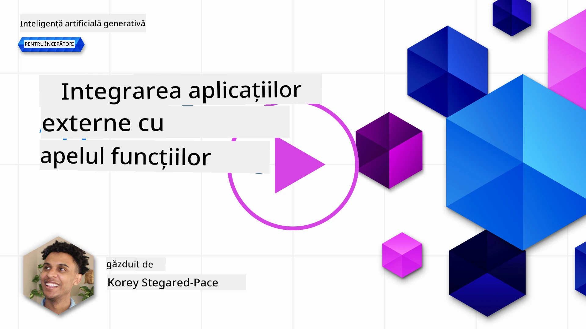
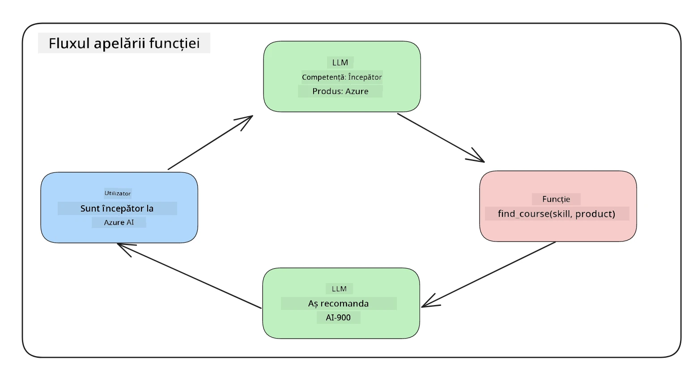
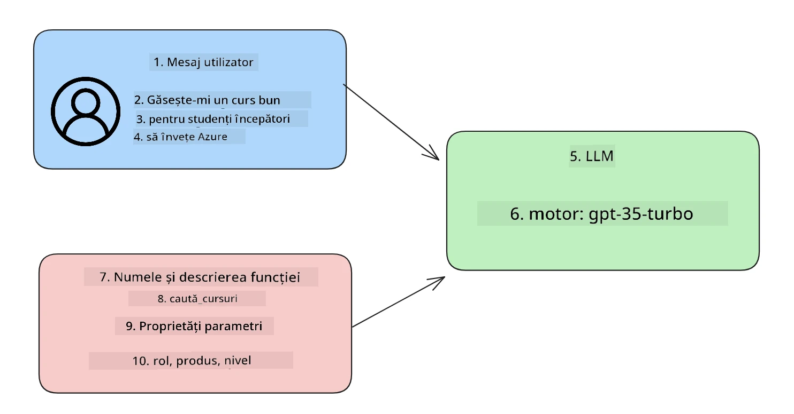

# Integrarea cu apelarea funcțiilor

[](https://youtu.be/DgUdCLX8qYQ?si=f1ouQU5HQx6F8Gl2)

Ai învățat destul de multe până acum în lecțiile anterioare. Cu toate acestea, putem să îmbunătățim și mai mult. Unele aspecte pe care le putem aborda sunt cum putem obține un format de răspuns mai consistent pentru a fi mai ușor să lucrăm cu răspunsul ulterior. De asemenea, am putea dori să adăugăm date din alte surse pentru a îmbogăți aplicația noastră.

Problemele menționate mai sus sunt cele pe care acest capitol dorește să le abordeze.

## Introducere

Această lecție va acoperi:

- Explicarea ce este apelarea funcțiilor și cazurile sale de utilizare.
- Crearea unui apel de funcție folosind Azure OpenAI.
- Cum să integrăm un apel de funcție într-o aplicație.

## Obiective de învățare

Până la sfârșitul acestei lecții, vei putea:

- Să explici scopul folosirii apelării funcțiilor.
- Să configurezi Apelul de Funcție folosind serviciul Azure OpenAI.
- Să proiectezi apeluri de funcții eficiente pentru cazul de utilizare al aplicației tale.

## Scenariu: Îmbunătățirea chatbot-ului nostru cu funcții

Pentru această lecție, vrem să construim o caracteristică pentru startup-ul nostru educațional care să permită utilizatorilor să folosească un chatbot pentru a găsi cursuri tehnice. Vom recomanda cursuri care se potrivesc nivelului lor de competență, rolului actual și tehnologiei de interes.

Pentru a finaliza acest scenariu, vom folosi o combinație de:

- `Azure OpenAI` pentru a crea o experiență de chat pentru utilizator.
- `Microsoft Learn Catalog API` pentru a ajuta utilizatorii să găsească cursuri bazate pe cererea utilizatorului.
- `Function Calling` pentru a prelua întrebarea utilizatorului și a o trimite către o funcție pentru a face cererea API.

Pentru a începe, să vedem de ce am vrea să folosim apelarea funcțiilor în primul rând:

## De ce Apelarea Funcțiilor

Înainte de apelarea funcțiilor, răspunsurile de la un LLM erau ne-structurate și inconsistente. Dezvoltatorii erau nevoiți să scrie cod complex de validare pentru a se asigura că pot gestiona fiecare variație a unui răspuns. Utilizatorii nu puteau obține răspunsuri precum „Care este vremea curentă în Stockholm?”. Acest lucru se datorează faptului că modelele erau limitate la momentul în care au fost antrenate datele.

Apelarea Funcțiilor este o caracteristică a Serviciului Azure OpenAI pentru a depăși următoarele limitări:

- **Format de răspuns consistent**. Dacă putem controla mai bine formatul răspunsului, putem integra mai ușor răspunsul ulterior în alte sisteme.
- **Date externe**. Capacitatea de a folosi date din alte surse ale unei aplicații într-un context de chat.

## Ilustrarea problemei printr-un scenariu

> Îți recomandăm să folosești [notebook-ul inclus](./python/aoai-assignment.ipynb?WT.mc_id=academic-105485-koreyst) dacă vrei să rulezi scenariul de mai jos. De asemenea, poți doar să citești în timp ce încercăm să ilustram o problemă pe care funcțiile o pot ajuta să o rezolve.

Să vedem exemplul care ilustrează problema formatului de răspuns:

Să presupunem că vrem să creăm o bază de date cu date despre studenți pentru a le putea sugera cursul potrivit. Mai jos avem două descrieri ale studenților care sunt foarte similare în datele pe care le conțin.

1. Crearea unei conexiuni către resursa noastră Azure OpenAI:

   ```python
   import os
   import json
   from openai import OpenAI
   from dotenv import load_dotenv
   load_dotenv()

   # API-ul de Răspunsuri este oferit de la endpoint-ul Azure OpenAI (Microsoft Foundry) v1
   # așa că indicăm clientul OpenAI către <your-endpoint>/openai/v1/.
   endpoint = os.environ['AZURE_OPENAI_ENDPOINT']
   client = OpenAI(
   api_key=os.environ['AZURE_OPENAI_API_KEY'],
   base_url=f"{endpoint.rstrip('/')}/openai/v1/",
   )

   deployment=os.environ['AZURE_OPENAI_DEPLOYMENT']
   ```

   Mai jos este un cod Python pentru configurarea conexiunii noastre la Azure OpenAI. Deoarece folosim endpoint-ul v1, trebuie doar să setăm `api_key` și `base_url` (nu este necesar `api_version`).

1. Crearea a două descrieri de studenți folosind variabilele `student_1_description` și `student_2_description`.

   ```python
   student_1_description="Emily Johnson is a sophomore majoring in computer science at Duke University. She has a 3.7 GPA. Emily is an active member of the university's Chess Club and Debate Team. She hopes to pursue a career in software engineering after graduating."

   student_2_description = "Michael Lee is a sophomore majoring in computer science at Stanford University. He has a 3.8 GPA. Michael is known for his programming skills and is an active member of the university's Robotics Club. He hopes to pursue a career in artificial intelligence after finishing his studies."
   ```

   Dorim să trimitem descrierile de mai sus către un LLM pentru a parse datele. Aceste date pot fi utilizate ulterior în aplicația noastră și trimise către un API sau stocate într-o bază de date.

1. Hai să creăm două prompturi identice în care instruim LLM ce informații ne interesează:

   ```python
   prompt1 = f'''
   Please extract the following information from the given text and return it as a JSON object:

   name
   major
   school
   grades
   club

   This is the body of text to extract the information from:
   {student_1_description}
   '''

   prompt2 = f'''
   Please extract the following information from the given text and return it as a JSON object:

   name
   major
   school
   grades
   club

   This is the body of text to extract the information from:
   {student_2_description}
   '''
   ```

   Prompturile de mai sus instruiesc LLM-ul să extragă informațiile și să returneze răspunsul în format JSON.

1. După ce am configurat prompturile și conexiunea la Azure OpenAI, vom trimite prompturile către LLM folosind `client.responses.create`. Stocăm promptul în variabila `input` și atribuim rolul `user`. Acest lucru imită un mesaj trimis de un utilizator către un chatbot.

   ```python
   # răspuns de la promptul unu
   openai_response1 = client.responses.create(
   model=deployment,
   input = [{'role': 'user', 'content': prompt1}],
   store=False,
   )
   openai_response1.output_text

   # răspuns de la promptul doi
   openai_response2 = client.responses.create(
   model=deployment,
   input = [{'role': 'user', 'content': prompt2}],
   store=False,
   )
   openai_response2.output_text
   ```

Acum putem trimite ambele cereri către LLM și examina răspunsul primit găsindu-l astfel `openai_response1.output_text`.

1. În cele din urmă, putem converti răspunsul în format JSON apelând `json.loads`:

   ```python
   # Se încarcă răspunsul ca un obiect JSON
   json_response1 = json.loads(openai_response1.output_text)
   json_response1
   ```

   Răspuns 1:

   ```json
   {
     "name": "Emily Johnson",
     "major": "computer science",
     "school": "Duke University",
     "grades": "3.7",
     "club": "Chess Club"
   }
   ```

   Răspuns 2:

   ```json
   {
     "name": "Michael Lee",
     "major": "computer science",
     "school": "Stanford University",
     "grades": "3.8 GPA",
     "club": "Robotics Club"
   }
   ```

   Chiar dacă prompturile sunt identice și descrierile sunt similare, vedem că valorile proprietății `Grades` sunt formatate diferit, deoarece uneori primim formatul `3.7` sau `3.7 GPA`, de exemplu.

   Acest rezultat este pentru că LLM ia date ne-structurate sub formă de prompt scris și returnează, de asemenea, date ne-structurate. Trebuie să avem un format structurat pentru a ști la ce să ne așteptăm când stocăm sau folosim aceste date.

Deci, cum rezolvăm problema formatării? Folosind apelarea funcțiilor, putem fi siguri că primim date structurate înapoi. Când folosim apelarea funcțiilor, LLM-ul nu apelează sau rulează efectiv nicio funcție. În schimb, creăm o structură pe care LLM-ul trebuie să o urmeze pentru răspunsurile sale. Apoi folosim acele răspunsuri structurate pentru a ști ce funcție să rulăm în aplicațiile noastre.



Putem apoi lua ceea ce este returnat de funcție și trimite acest răspuns înapoi la LLM. LLM-ul va răspunde apoi folosind limbaj natural pentru a răspunde întrebării utilizatorului.

## Cazuri de utilizare pentru apelarea funcțiilor

Există multe cazuri în care apelarea funcțiilor poate îmbunătăți aplicația ta, precum:

- **Apelarea uneltelor externe**. Chatbot-urile sunt excelente la oferirea de răspunsuri utilizatorilor. Folosind apelarea funcțiilor, chatbot-urile pot folosi mesajele utilizatorilor pentru a îndeplini anumite sarcini. De exemplu, un student poate cere chatbot-ului să "Trimită un email instructorului meu spunând că am nevoie de mai mult ajutor cu acest subiect". Acest lucru poate face un apel de funcție la `send_email(to: string, body: string)`.

- **Crearea de interogări API sau baze de date**. Utilizatorii pot găsi informații folosind limbaj natural care se transformă într-o interogare formatată sau cerere API. Un exemplu ar fi un profesor care cere "Cine sunt studenții care au finalizat ultima temă" care poate apela o funcție numită `get_completed(student_name: string, assignment: int, current_status: string)`.

- **Crearea de date structurate**. Utilizatorii pot lua un bloc de text sau CSV și pot folosi LLM pentru a extrage informații importante din el. De exemplu, un student poate converti un articol Wikipedia despre acordurile de pace pentru a crea fișe AI. Acest lucru poate fi realizat folosind o funcție numită `get_important_facts(agreement_name: string, date_signed: string, parties_involved: list)`.

## Crearea Primului Tău Apel de Funcție

Procesul de creare a unui apel de funcție include 3 pași principali:

1. **Apelează** Responses API cu o listă a funcțiilor tale (uneltelor) și un mesaj de utilizator.
2. **Citește** răspunsul modelului pentru a efectua o acțiune, adică să execuți o funcție sau apel de API.
3. **Fă** un alt apel către Responses API cu răspunsul funcției tale pentru a folosi acea informație pentru a crea un răspuns la utilizator.



### Pasul 1 - crearea mesajelor

Primul pas este să creezi un mesaj de utilizator. Acesta poate fi atribuit dinamic luând valoarea unui câmp de text sau poți atribui o valoare aici. Dacă este prima dată când lucrezi cu Responses API, trebuie să definim `role` și `content` ale mesajului.

`Role` poate fi fie `system` (crearea regulilor), `assistant` (modelul) sau `user` (utilizatorul final). Pentru apelarea funcțiilor, vom atribui `user` și o întrebare exemplu.

```python
messages= [ {"role": "user", "content": "Find me a good course for a beginner student to learn Azure."} ]
```

Prin atribuirea diferitelor roluri, LLM știe dacă este sistemul care spune ceva sau utilizatorul, ceea ce ajută la construirea istoricului conversației pe care LLM îl poate folosi.

### Pasul 2 - crearea funcțiilor

Următorul pas este să definim o funcție și parametrii acelei funcții. Vom folosi aici doar o funcție numită `search_courses`, dar poți crea mai multe funcții.

> **Important**: Funcțiile sunt incluse în mesajul sistem către LLM și vor fi incluse în numărul de tokeni disponibili.

Mai jos, creăm funcțiile ca un array de elemente. Fiecare element este o unealtă în formatul flat al Responses API, cu proprietăți `type`, `name`, `description` și `parameters`:

```python
functions = [
   {
      "type":"function",
      "name":"search_courses",
      "description":"Retrieves courses from the search index based on the parameters provided",
      "parameters":{
         "type":"object",
         "properties":{
            "role":{
               "type":"string",
               "description":"The role of the learner (i.e. developer, data scientist, student, etc.)"
            },
            "product":{
               "type":"string",
               "description":"The product that the lesson is covering (i.e. Azure, Power BI, etc.)"
            },
            "level":{
               "type":"string",
               "description":"The level of experience the learner has prior to taking the course (i.e. beginner, intermediate, advanced)"
            }
         },
         "required":[
            "role"
         ]
      }
   }
]
```

Să descriem fiecare instanță de funcție mai detaliat:

- `name` - Numele funcției pe care dorim să o apelăm.
- `description` - Aceasta este descrierea modului în care funcția operează. Este important să fie specific și clar aici.
- `parameters` - O listă de valori și formate pe care dorești ca modelul să le producă în răspunsul său. Array-ul de parametri constă în elemente cu următoarele proprietăți:
  1.  `type` - Tipul de date al proprietăților în care vor fi stocate.
  1.  `properties` - Lista valorilor specifice pe care modelul le va folosi în răspuns.
      1. `name` - Cheia este numele proprietății pe care modelul o va folosi în răspunsul său formatat, de exemplu, `product`.
      1. `type` - Tipul de date al acestei proprietăți, de exemplu, `string`.
      1. `description` - Descrierea proprietății specifice.

Există de asemenea o proprietate opțională `required` - proprietate necesară pentru ca apelul funcției să fie complet.

### Pasul 3 - Efectuarea apelului funcției

După definirea unei funcții, trebuie să o includem în apelul către Responses API. Facem acest lucru adăugând `tools` în cerere. În acest caz `tools=functions`.

Există de asemenea opțiunea de a seta `tool_choice` la `auto`. Aceasta înseamnă că vom lăsa LLM să decidă ce funcție să apeleze bazat pe mesajul utilizatorului, în loc să o atribuim noi.

Mai jos este un cod unde apelăm `client.responses.create`, observă cum setăm `tools=functions` și `tool_choice="auto"` oferind astfel LLM-ului alegerea când să apeleze funcțiile pe care i le furnizăm:

```python
response = client.responses.create(model=deployment,
                                        input=messages,
                                        tools=functions,
                                        tool_choice="auto",
                                        store=False)

print(response.output)
```

Răspunsul primit acum include un element `function_call` în `response.output` care arată astfel:

```json
{
  "type": "function_call",
  "name": "search_courses",
  "call_id": "call_abc123",
  "arguments": "{\n  \"role\": \"student\",\n  \"product\": \"Azure\",\n  \"level\": \"beginner\"\n}"
}
```

Aici putem vedea cum funcția `search_courses` a fost apelată și cu ce argumente, listate în proprietatea `arguments` din răspunsul JSON.

Concluzia este că LLM a putut găsi datele pentru a se potrivi cu argumentele funcției, extrăgându-le din valoarea oferită parametrului `input` în apelul Responses API. Mai jos este un reminder al valorii `messages`:

```python
messages= [ {"role": "user", "content": "Find me a good course for a beginner student to learn Azure."} ]
```

După cum vezi, `student`, `Azure` și `beginner` au fost extrase din `messages` și setate ca input pentru funcție. Folosirea funcțiilor în acest mod este o metodă excelentă de a extrage informații dintr-un prompt, dar și de a oferi structură LLM-ului și de a avea funcționalitate reutilizabilă.

Următorul pas este să vedem cum putem folosi acest lucru în aplicația noastră.

## Integrarea Apelurilor de Funcții într-o Aplicație

După ce am testat răspunsul formatat de la LLM, putem acum integra acest lucru într-o aplicație.

### Gestionarea fluxului

Pentru a integra acest lucru în aplicația noastră, să urmăm pașii următori:

1. Mai întâi, facem apelul către serviciile OpenAI și extragem elementele apelului funcției din răspunsul `output`.

   ```python
   response_items = response.output
   tool_calls = [item for item in response_items if item.type == "function_call"]
   ```

1. Acum definim funcția care va apela Microsoft Learn API pentru a obține o listă de cursuri:

   ```python
   import requests

   def search_courses(role, product, level):
     url = "https://learn.microsoft.com/api/catalog/"
     params = {
        "role": role,
        "product": product,
        "level": level
     }
     response = requests.get(url, params=params)
     modules = response.json()["modules"]
     results = []
     for module in modules[:5]:
        title = module["title"]
        url = module["url"]
        results.append({"title": title, "url": url})
     return str(results)
   ```

   Observă cum acum creăm o funcție Python efectivă care corespunde numelor funcțiilor introduse în variabila `functions`. De asemenea, facem apeluri reale externe API pentru a obține datele necesare. În acest caz, interogăm Microsoft Learn API pentru a căuta module de training.

Ok, am creat variabila `functions` și o funcție Python corespunzătoare, cum îi spunem LLM-ului cum să le coreleze astfel încât funcția Python să fie apelată?

1. Pentru a vedea dacă trebuie să apelăm o funcție Python, trebuie să verificăm răspunsul LLM să vedem dacă un element `function_call` face parte din el și să apelăm funcția indicată. Iată cum poți face această verificare mai jos:

   ```python
   # Verifică dacă modelul dorește să apeleze o funcție
   if tool_calls:
    for tool_call in tool_calls:
     print("Recommended Function call:")
     print(tool_call.name)
     print()

     # Apelează funcția.
     function_name = tool_call.name

     available_functions = {
             "search_courses": search_courses,
     }
     function_to_call = available_functions[function_name]

     function_args = json.loads(tool_call.arguments)
     function_response = function_to_call(**function_args)

     print("Output of function call:")
     print(function_response)
     print(type(function_response))

     # Adaugă apelul funcției și rezultatul acesteia înapoi în conversație.
     # Elementul function_call al modelului trebuie adăugat înainte de ieșirea sa.
     messages.append(tool_call)  # elementul function_call al asistentului
     messages.append( # rezultatul funcției
         {
             "type": "function_call_output",
             "call_id": tool_call.call_id,
             "output": function_response,
         }
     )
   ```

   Aceste trei linii asigură extragerea numelui funcției, argumentelor și executarea apelului:

   ```python
   function_to_call = available_functions[function_name]

   function_args = json.loads(tool_call.arguments)
   function_response = function_to_call(**function_args)
   ```

   Mai jos este output-ul din rularea codului:

   **Output**

   ```Recommended Function call:
   {
     "name": "search_courses",
     "arguments": "{\n  \"role\": \"student\",\n  \"product\": \"Azure\",\n  \"level\": \"beginner\"\n}"
   }

   Output of function call:
   [{'title': 'Describe concepts of cryptography', 'url': 'https://learn.microsoft.com/training/modules/describe-concepts-of-cryptography/?
   WT.mc_id=api_CatalogApi'}, {'title': 'Introduction to audio classification with TensorFlow', 'url': 'https://learn.microsoft.com/en-
   us/training/modules/intro-audio-classification-tensorflow/?WT.mc_id=api_CatalogApi'}, {'title': 'Design a Performant Data Model in Azure SQL
   Database with Azure Data Studio', 'url': 'https://learn.microsoft.com/training/modules/design-a-data-model-with-ads/?
   WT.mc_id=api_CatalogApi'}, {'title': 'Getting started with the Microsoft Cloud Adoption Framework for Azure', 'url':
   'https://learn.microsoft.com/training/modules/cloud-adoption-framework-getting-started/?WT.mc_id=api_CatalogApi'}, {'title': 'Set up the
   Rust development environment', 'url': 'https://learn.microsoft.com/training/modules/rust-set-up-environment/?WT.mc_id=api_CatalogApi'}]
   <class 'str'>
   ```

1. Acum vom trimite mesajul actualizat `messages` către LLM pentru a primi un răspuns în limbaj natural în loc de un răspuns formatat JSON.

   ```python
   print("Messages in next request:")
   print(messages)
   print()

   second_response = client.responses.create(
      input=messages,
      model=deployment,
      tool_choice="auto",
      tools=functions,
      temperature=0,
      store=False,
         )  # obține un nou răspuns de la model unde poate vedea răspunsul funcției


   print(second_response.output_text)
   ```

   **Output**

   ```text
   I found some good courses for beginner students to learn Azure:

   1. [Describe concepts of cryptography](https://learn.microsoft.com/training/modules/describe-concepts-of-cryptography/?WT.mc_id=api_CatalogApi)
   2. [Introduction to audio classification with TensorFlow](https://learn.microsoft.com/training/modules/intro-audio-classification-tensorflow/?WT.mc_id=api_CatalogApi)
   3. [Design a Performant Data Model in Azure SQL Database with Azure Data Studio](https://learn.microsoft.com/training/modules/design-a-data-model-with-ads/?WT.mc_id=api_CatalogApi)
   4. [Getting started with the Microsoft Cloud Adoption Framework for Azure](https://learn.microsoft.com/training/modules/cloud-adoption-framework-getting-started/?WT.mc_id=api_CatalogApi)
   5. [Set up the Rust development environment](https://learn.microsoft.com/training/modules/rust-set-up-environment/?WT.mc_id=api_CatalogApi)

   You can click on the links to access the courses.
   ```

## Sarcină

Pentru a-ți continua învățarea privind Apelarea Funcțiilor în Azure OpenAI poți construi:

- Mai mulți parametri ai funcției care ar putea ajuta cursanții să găsească mai multe cursuri.

- Creează un alt apel de funcție care să preia mai multe informații de la cursant, cum ar fi limba lor maternă
- Creează gestionarea erorilor atunci când apelul funcției și/sau apelul API nu returnează cursuri potrivite

Hint: Urmează pagina [Learn API reference documentation](https://learn.microsoft.com/training/support/catalog-api-developer-reference?WT.mc_id=academic-105485-koreyst) pentru a vedea cum și unde sunt disponibile aceste date.

## Muncă excelentă! Continuă călătoria

După finalizarea acestei lecții, consultă colecția noastră [Generative AI Learning collection](https://aka.ms/genai-collection?WT.mc_id=academic-105485-koreyst) pentru a-ți continua dezvoltarea cunoștințelor despre Inteligența Artificială Generativă!

Mergi la Lecția 12, unde vom analiza cum să [proiectezi UX pentru aplicații AI](../12-designing-ux-for-ai-applications/README.md?WT.mc_id=academic-105485-koreyst)!

---

<!-- CO-OP TRANSLATOR DISCLAIMER START -->
**Declinare a responsabilității**:
Acest document a fost tradus folosind serviciul de traducere AI [Co-op Translator](https://github.com/Azure/co-op-translator). În timp ce ne străduim pentru acuratețe, vă rugăm să rețineți că traducerile automate pot conține erori sau inexactități. Documentul original în limba sa nativă trebuie considerat sursa autorizată. Pentru informații critice, se recomandă traducerea profesională realizată de un om. Nu ne asumăm responsabilitatea pentru eventualele neînțelegeri sau interpretări greșite care decurg din utilizarea acestei traduceri.
<!-- CO-OP TRANSLATOR DISCLAIMER END -->