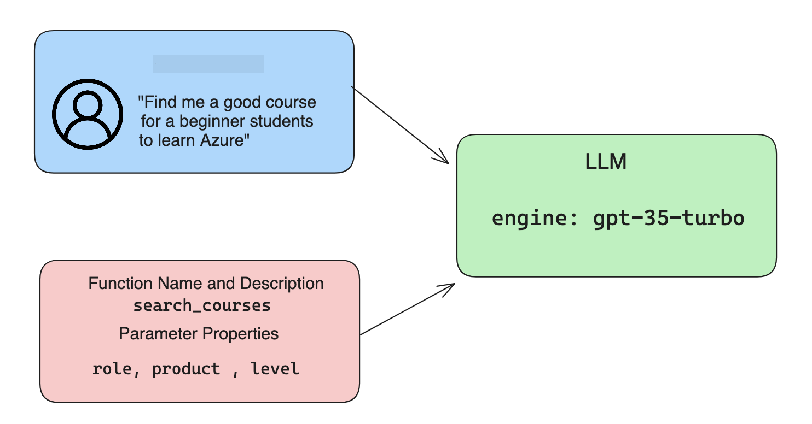

<!--
CO_OP_TRANSLATOR_METADATA:
{
  "original_hash": "f6f84f9ef2d066cd25850cab93580a50",
  "translation_date": "2025-10-17T22:05:04+00:00",
  "source_file": "11-integrating-with-function-calling/README.md",
  "language_code": "ro"
}
-->
# Integrarea cu apelarea funcțiilor

[](https://youtu.be/DgUdCLX8qYQ?si=f1ouQU5HQx6F8Gl2)

Ai învățat destul de multe până acum în lecțiile anterioare. Totuși, putem îmbunătăți și mai mult. Unele aspecte pe care le putem aborda sunt cum să obținem un format de răspuns mai consistent pentru a facilita utilizarea răspunsului în etapele ulterioare. De asemenea, s-ar putea să dorim să adăugăm date din alte surse pentru a îmbogăți aplicația noastră.

Problemele menționate mai sus sunt cele pe care acest capitol își propune să le abordeze.

## Introducere

Această lecție va acoperi:

- Explicarea conceptului de apelare a funcțiilor și a cazurilor sale de utilizare.
- Crearea unui apel de funcție folosind Azure OpenAI.
- Cum să integrezi un apel de funcție într-o aplicație.

## Obiective de învățare

Până la sfârșitul acestei lecții, vei putea:

- Explica scopul utilizării apelării funcțiilor.
- Configura Apelul Funcției folosind Serviciul Azure OpenAI.
- Proiecta apeluri de funcții eficiente pentru cazul de utilizare al aplicației tale.

## Scenariu: Îmbunătățirea chatbot-ului nostru cu funcții

Pentru această lecție, dorim să construim o funcționalitate pentru startup-ul nostru educațional care să permită utilizatorilor să folosească un chatbot pentru a găsi cursuri tehnice. Vom recomanda cursuri care se potrivesc nivelului lor de competență, rolului actual și tehnologiei de interes.

Pentru a finaliza acest scenariu, vom folosi o combinație de:

- `Azure OpenAI` pentru a crea o experiență de chat pentru utilizator.
- `Microsoft Learn Catalog API` pentru a ajuta utilizatorii să găsească cursuri pe baza cererii lor.
- `Apelarea Funcțiilor` pentru a prelua interogarea utilizatorului și a o trimite unei funcții pentru a face cererea API.

Pentru a începe, să vedem de ce am dori să folosim apelarea funcțiilor în primul rând:

## De ce apelarea funcțiilor

Înainte de apelarea funcțiilor, răspunsurile de la un LLM erau nestructurate și inconsistente. Dezvoltatorii erau nevoiți să scrie coduri complexe de validare pentru a se asigura că pot gestiona fiecare variație a unui răspuns. Utilizatorii nu puteau obține răspunsuri precum "Care este vremea actuală în Stockholm?". Acest lucru se întâmpla deoarece modelele erau limitate la perioada în care datele au fost antrenate.

Apelarea funcțiilor este o caracteristică a Serviciului Azure OpenAI care depășește următoarele limitări:

- **Format de răspuns consistent**. Dacă putem controla mai bine formatul răspunsului, putem integra mai ușor răspunsul în alte sisteme.
- **Date externe**. Capacitatea de a utiliza date din alte surse ale unei aplicații într-un context de chat.

## Ilustrarea problemei printr-un scenariu

> Vă recomandăm să folosiți [notebook-ul inclus](./python/aoai-assignment.ipynb?WT.mc_id=academic-105485-koreyst) dacă doriți să rulați scenariul de mai jos. De asemenea, puteți doar să citiți mai departe, deoarece încercăm să ilustrăm o problemă unde funcțiile pot ajuta la rezolvarea acesteia.

Să analizăm exemplul care ilustrează problema formatului răspunsului:

Să presupunem că dorim să creăm o bază de date cu datele studenților pentru a le sugera cursurile potrivite. Mai jos avem două descrieri ale studenților care sunt foarte similare în datele pe care le conțin.

1. Crearea unei conexiuni la resursa noastră Azure OpenAI:

   ```python
   import os
   import json
   from openai import AzureOpenAI
   from dotenv import load_dotenv
   load_dotenv()

   client = AzureOpenAI(
   api_key=os.environ['AZURE_OPENAI_API_KEY'],  # this is also the default, it can be omitted
   api_version = "2023-07-01-preview"
   )

   deployment=os.environ['AZURE_OPENAI_DEPLOYMENT']
   ```

   Mai jos este un cod Python pentru configurarea conexiunii noastre la Azure OpenAI unde setăm `api_type`, `api_base`, `api_version` și `api_key`.

1. Crearea a două descrieri ale studenților folosind variabilele `student_1_description` și `student_2_description`.

   ```python
   student_1_description="Emily Johnson is a sophomore majoring in computer science at Duke University. She has a 3.7 GPA. Emily is an active member of the university's Chess Club and Debate Team. She hopes to pursue a career in software engineering after graduating."

   student_2_description = "Michael Lee is a sophomore majoring in computer science at Stanford University. He has a 3.8 GPA. Michael is known for his programming skills and is an active member of the university's Robotics Club. He hopes to pursue a career in artificial intelligence after finishing his studies."
   ```

   Dorim să trimitem descrierile studenților de mai sus către un LLM pentru a analiza datele. Aceste date pot fi utilizate ulterior în aplicația noastră și pot fi trimise către un API sau stocate într-o bază de date.

1. Să creăm două prompturi identice în care instruim LLM-ul despre informațiile care ne interesează:

   ```python
   prompt1 = f'''
   Please extract the following information from the given text and return it as a JSON object:

   name
   major
   school
   grades
   club

   This is the body of text to extract the information from:
   {student_1_description}
   '''

   prompt2 = f'''
   Please extract the following information from the given text and return it as a JSON object:

   name
   major
   school
   grades
   club

   This is the body of text to extract the information from:
   {student_2_description}
   '''
   ```

   Prompturile de mai sus instruiesc LLM-ul să extragă informații și să returneze răspunsul în format JSON.

1. După configurarea prompturilor și a conexiunii la Azure OpenAI, vom trimite acum prompturile către LLM folosind `openai.ChatCompletion`. Stocăm promptul în variabila `messages` și atribuim rolul `user`. Acest lucru este pentru a imita un mesaj de la un utilizator scris unui chatbot.

   ```python
   # response from prompt one
   openai_response1 = client.chat.completions.create(
   model=deployment,
   messages = [{'role': 'user', 'content': prompt1}]
   )
   openai_response1.choices[0].message.content

   # response from prompt two
   openai_response2 = client.chat.completions.create(
   model=deployment,
   messages = [{'role': 'user', 'content': prompt2}]
   )
   openai_response2.choices[0].message.content
   ```

Acum putem trimite ambele cereri către LLM și examina răspunsul pe care îl primim găsindu-l astfel: `openai_response1['choices'][0]['message']['content']`.

1. În cele din urmă, putem converti răspunsul în format JSON apelând `json.loads`:

   ```python
   # Loading the response as a JSON object
   json_response1 = json.loads(openai_response1.choices[0].message.content)
   json_response1
   ```

   Răspuns 1:

   ```json
   {
     "name": "Emily Johnson",
     "major": "computer science",
     "school": "Duke University",
     "grades": "3.7",
     "club": "Chess Club"
   }
   ```

   Răspuns 2:

   ```json
   {
     "name": "Michael Lee",
     "major": "computer science",
     "school": "Stanford University",
     "grades": "3.8 GPA",
     "club": "Robotics Club"
   }
   ```

   Chiar dacă prompturile sunt aceleași și descrierile sunt similare, vedem valorile proprietății `Grades` formatate diferit, deoarece uneori putem obține formatul `3.7` sau `3.7 GPA`, de exemplu.

   Acest rezultat se datorează faptului că LLM-ul preia date nestructurate sub forma promptului scris și returnează, de asemenea, date nestructurate. Trebuie să avem un format structurat astfel încât să știm la ce să ne așteptăm atunci când stocăm sau utilizăm aceste date.

Deci, cum rezolvăm problema formatării? Prin utilizarea apelării funcțiilor, putem asigura că primim date structurate înapoi. Când folosim apelarea funcțiilor, LLM-ul nu apelează sau rulează de fapt nicio funcție. În schimb, creăm o structură pe care LLM-ul să o urmeze pentru răspunsurile sale. Apoi folosim aceste răspunsuri structurate pentru a ști ce funcție să rulăm în aplicațiile noastre.


Putem apoi să luăm ceea ce este returnat de funcție și să trimitem acest lucru înapoi către LLM. LLM-ul va răspunde apoi folosind limbaj natural pentru a răspunde la interogarea utilizatorului.

## Cazuri de utilizare pentru apelarea funcțiilor

Există multe cazuri de utilizare diferite în care apelarea funcțiilor poate îmbunătăți aplicația ta, cum ar fi:

- **Apelarea instrumentelor externe**. Chatbot-urile sunt excelente pentru a oferi răspunsuri la întrebările utilizatorilor. Prin utilizarea apelării funcțiilor, chatbot-urile pot folosi mesajele de la utilizatori pentru a îndeplini anumite sarcini. De exemplu, un student poate cere chatbot-ului să "Trimită un e-mail instructorului meu spunând că am nevoie de mai mult ajutor la acest subiect". Acest lucru poate face un apel de funcție la `send_email(to: string, body: string)`.

- **Crearea de interogări API sau baze de date**. Utilizatorii pot găsi informații folosind limbaj natural care este convertit într-o interogare formatată sau cerere API. Un exemplu ar putea fi un profesor care solicită "Cine sunt studenții care au finalizat ultima temă", ceea ce ar putea apela o funcție numită `get_completed(student_name: string, assignment: int, current_status: string)`.

- **Crearea de date structurate**. Utilizatorii pot lua un bloc de text sau CSV și pot folosi LLM-ul pentru a extrage informații importante din acesta. De exemplu, un student poate converti un articol Wikipedia despre acorduri de pace pentru a crea fișe de învățare AI. Acest lucru poate fi realizat prin utilizarea unei funcții numite `get_important_facts(agreement_name: string, date_signed: string, parties_involved: list)`.

## Crearea primului apel de funcție

Procesul de creare a unui apel de funcție include 3 pași principali:

1. **Apelarea** API-ului Chat Completions cu o listă de funcții și un mesaj de la utilizator.
2. **Citirea** răspunsului modelului pentru a efectua o acțiune, adică executarea unei funcții sau a unui apel API.
3. **Realizarea** unui alt apel către API-ul Chat Completions cu răspunsul de la funcția ta pentru a folosi acea informație pentru a crea un răspuns pentru utilizator.



### Pasul 1 - crearea mesajelor

Primul pas este să creezi un mesaj de utilizator. Acesta poate fi atribuit dinamic prin preluarea valorii unui câmp de text sau poți atribui o valoare aici. Dacă este prima dată când lucrezi cu API-ul Chat Completions, trebuie să definești `role` și `content` al mesajului.

Rolul `role` poate fi fie `system` (crearea regulilor), `assistant` (modelul) sau `user` (utilizatorul final). Pentru apelarea funcțiilor, îl vom atribui ca `user` și vom folosi o întrebare exemplu.

```python
messages= [ {"role": "user", "content": "Find me a good course for a beginner student to learn Azure."} ]
```

Prin atribuirea diferitelor roluri, este clar pentru LLM dacă este sistemul care spune ceva sau utilizatorul, ceea ce ajută la construirea unui istoric de conversație pe care LLM-ul îl poate folosi.

### Pasul 2 - crearea funcțiilor

Următorul pas este să definim o funcție și parametrii acelei funcții. Vom folosi doar o funcție aici numită `search_courses`, dar poți crea mai multe funcții.

> **Important**: Funcțiile sunt incluse în mesajul sistemului către LLM și vor fi incluse în numărul de tokeni disponibili pe care îi ai.

Mai jos, creăm funcțiile ca un array de elemente. Fiecare element este o funcție și are proprietăți `name`, `description` și `parameters`:

```python
functions = [
   {
      "name":"search_courses",
      "description":"Retrieves courses from the search index based on the parameters provided",
      "parameters":{
         "type":"object",
         "properties":{
            "role":{
               "type":"string",
               "description":"The role of the learner (i.e. developer, data scientist, student, etc.)"
            },
            "product":{
               "type":"string",
               "description":"The product that the lesson is covering (i.e. Azure, Power BI, etc.)"
            },
            "level":{
               "type":"string",
               "description":"The level of experience the learner has prior to taking the course (i.e. beginner, intermediate, advanced)"
            }
         },
         "required":[
            "role"
         ]
      }
   }
]
```

Să descriem fiecare instanță a funcției mai detaliat mai jos:

- `name` - Numele funcției pe care dorim să o apelăm.
- `description` - Aceasta este descrierea modului în care funcția funcționează. Aici este important să fii specific și clar.
- `parameters` - O listă de valori și format pe care dorim ca modelul să le producă în răspunsul său. Array-ul de parametri constă în elemente unde elementele au următoarele proprietăți:
  1.  `type` - Tipul de date în care vor fi stocate proprietățile.
  1.  `properties` - Lista valorilor specifice pe care modelul le va folosi pentru răspunsul său formatat.
      1. `name` - Cheia este numele proprietății pe care modelul o va folosi în răspunsul său formatat, de exemplu, `product`.
      1. `type` - Tipul de date al acestei proprietăți, de exemplu, `string`.
      1. `description` - Descrierea proprietății specifice.

Există, de asemenea, o proprietate opțională `required` - proprietatea necesară pentru ca apelul funcției să fie complet.

### Pasul 3 - Realizarea apelului funcției

După definirea unei funcții, acum trebuie să o includem în apelul către API-ul Chat Completion. Facem acest lucru adăugând `functions` la cerere. În acest caz, `functions=functions`.

Există, de asemenea, o opțiune de a seta `function_call` la `auto`. Acest lucru înseamnă că vom lăsa LLM-ul să decidă ce funcție ar trebui să fie apelată pe baza mesajului utilizatorului, mai degrabă decât să o atribuim noi înșine.

Iată un cod mai jos unde apelăm `ChatCompletion.create`, observă cum setăm `functions=functions` și `function_call="auto"` și astfel oferim LLM-ului opțiunea de a decide când să apeleze funcțiile pe care i le oferim:

```python
response = client.chat.completions.create(model=deployment,
                                        messages=messages,
                                        functions=functions,
                                        function_call="auto")

print(response.choices[0].message)
```

Răspunsul care vine înapoi arată astfel:

```json
{
  "role": "assistant",
  "function_call": {
    "name": "search_courses",
    "arguments": "{\n  \"role\": \"student\",\n  \"product\": \"Azure\",\n  \"level\": \"beginner\"\n}"
  }
}
```

Aici putem vedea cum funcția `search_courses` a fost apelată și cu ce argumente, așa cum sunt listate în proprietatea `arguments` din răspunsul JSON.

Concluzia este că LLM-ul a fost capabil să găsească datele pentru a se potrivi argumentelor funcției, deoarece le-a extras din valoarea furnizată parametrului `messages` în apelul de completare a chatului. Mai jos este o reamintire a valorii `messages`:

```python
messages= [ {"role": "user", "content": "Find me a good course for a beginner student to learn Azure."} ]
```

După cum poți vedea, `student`, `Azure` și `beginner` au fost extrase din `messages` și setate ca intrare pentru funcție. Utilizarea funcțiilor în acest mod este o modalitate excelentă de a extrage informații dintr-un prompt, dar și de a oferi structură LLM-ului și de a avea funcționalități reutilizabile.

Următorul pas este să vedem cum putem folosi acest lucru în aplicația noastră.

## Integrarea apelurilor funcțiilor într-o aplicație

După ce am testat răspunsul formatat de la LLM, putem acum să integrăm acest lucru într-o aplicație.

### Gestionarea fluxului

Pentru a integra acest lucru în aplicația noastră, să urmăm pașii următori:

1. Mai întâi, să facem apelul către serviciile OpenAI și să stocăm mesajul într-o variabilă numită `response_message`.

   ```python
   response_message = response.choices[0].message
   ```

1. Acum vom defini funcția care va apela API-ul Microsoft Learn pentru a obține o listă de cursuri:

   ```python
   import requests

   def search_courses(role, product, level):
     url = "https://learn.microsoft.com/api/catalog/"
     params = {
        "role": role,
        "product": product,
        "level": level
     }
     response = requests.get(url, params=params)
     modules = response.json()["modules"]
     results = []
     for module in modules[:5]:
        title = module["title"]
        url = module["url"]
        results.append({"title": title, "url": url})
     return str(results)
   ```

   Observă cum acum creăm o funcție Python reală care se potrivește cu numele funcțiilor introduse în variabila `functions`. De asemenea, facem apeluri API externe reale pentru a obține datele de care avem nevoie. În acest caz, mergem către API-ul Microsoft Learn pentru a căuta module de instruire.

Ok, deci am creat variabilele `functions` și o funcție Python corespunzătoare, cum spunem LLM-ului cum să le mapăm astfel încât funcția Python să fie apelată?

1. Pentru a vedea dacă trebuie să apelăm o funcție Python, trebuie să analizăm răspunsul LLM și să vedem dacă `function_call` face parte din acesta și să apelăm funcția indicată. Iată cum poți face verificarea menționată mai jos:

   ```python
   # Check if the model wants to call a function
   if response_message.function_call.name:
    print("Recommended Function call:")
    print(response_message.function_call.name)
    print()

    # Call the function.
    function_name = response_message.function_call.name

    available_functions = {
            "search_courses": search_courses,
    }
    function_to_call = available_functions[function_name]

    function_args = json.loads(response_message.function_call.arguments)
    function_response = function_to_call(**function_args)

    print("Output of function call:")
    print(function_response)
    print(type(function_response))


    # Add the assistant response and function response to the messages
    messages.append( # adding assistant response to messages
        {
            "role": response_message.role,
            "function_call": {
                "name": function_name,
                "arguments": response_message.function_call.arguments,
            },
            "content": None
        }
    )
    messages.append( # adding function response to messages
        {
            "role": "function",
            "name": function_name,
            "content":function_response,
        }
    )
   ```

   Aceste trei linii asigură că extragem numele funcției, argumentele și facem apelul:

   ```python
   function_to_call = available_functions[function_name]

   function_args = json.loads(response_message.function_call.arguments)
   function_response = function_to_call(**function_args)
   ```

   Mai jos este rezultatul rulării codului nostru:

   **Rezultat**

   ```Recommended Function call:
   {
     "name": "search_courses",
     "arguments": "{\n  \"role\": \"student\",\n  \"product\": \"Azure\",\n  \"level\": \"beginner\"\n}"
   }

   Output of function call:
   [{'title': 'Describe concepts of cryptography', 'url': 'https://learn.microsoft.com/training/modules/describe-concepts-of-cryptography/?
   WT.mc_id=api_CatalogApi'}, {'title': 'Introduction to audio classification with TensorFlow', 'url': 'https://learn.microsoft.com/en-
   us/training/modules/intro-audio-classification-tensorflow/?WT.mc_id=api_CatalogApi'}, {'title': 'Design a Performant Data Model in Azure SQL
   Database with Azure Data Studio', 'url': 'https://learn.microsoft.com/training/modules/design-a-data-model-with-ads/?
   WT.mc_id=api_CatalogApi'}, {'title': 'Getting started with the Microsoft Cloud Adoption Framework for Azure', 'url':
   'https://learn.microsoft.com/training/modules/cloud-adoption-framework-getting-started/?WT.mc_id=api_CatalogApi'}, {'title': 'Set up the
   Rust development environment', 'url': 'https://learn.microsoft.com/training/modules/rust-set-up-environment/?WT.mc_id=api_CatalogApi'}]
   <class 'str'>
   ```

1. Acum vom trimite mesajul actualizat, `messages`, către LLM astfel încât să putem primi un răspuns în limbaj natural în loc de un răspuns formatat JSON API.

   ```python
   print("Messages in next request:")
   print(messages)
   print()

   second_response = client.chat.completions.create(
      messages=messages,
      model=deployment,
      function_call="auto",
      functions=functions,
      temperature=0
         )  # get a new response from GPT where it can see the function response


   print(second_response.choices[0].message)
   ```

   **Rezultat**

   ```python
   {
     "role": "assistant",
     "content": "I found some good courses for beginner students to learn Azure:\n\n1. [Describe concepts of cryptography] (https://learn.microsoft.com/training/modules/describe-concepts-of-cryptography/?WT.mc_id=api_CatalogApi)\n2. [Introduction to audio classification with TensorFlow](https://learn.microsoft.com/training/modules/intro-audio-classification-tensorflow/?WT.mc_id=api_CatalogApi)\n3. [Design a Performant Data Model in Azure SQL Database with Azure Data Studio](https://learn.microsoft.com/training/modules/design-a-data-model-with-ads/?WT.mc_id=api_CatalogApi)\n4. [Getting started with the Microsoft Cloud Adoption Framework for Azure](https://learn.microsoft.com/training/modules/cloud-adoption-framework-getting-started/?WT.mc_id=api_CatalogApi)\n5. [Set up the Rust development environment](https://learn.microsoft.com/training/modules/rust-set-up-environment/?WT.mc_id=api_CatalogApi)\n\nYou can click on the links to access the courses."
   }

   ```

## Temă

Pentru a continua învățarea despre Apelarea Funcțiilor Azure OpenAI, poți construi:

- Mai mulți parametri ai funcției care ar putea ajuta cursanții să găsească mai multe cursuri.
- Creează un alt apel de funcție care să preia mai multe informații de la cursant, cum ar fi limba lor maternă.
- Creează gestionarea erorilor atunci când apelul funcției și/sau apelul API nu returnează niciun curs potrivit

Sugestie: Urmează pagina [Learn API reference documentation](https://learn.microsoft.com/training/support/catalog-api-developer-reference?WT.mc_id=academic-105485-koreyst) pentru a vedea cum și unde sunt disponibile aceste date.

## Felicitări! Continuă călătoria

După ce finalizezi această lecție, verifică colecția noastră [Generative AI Learning collection](https://aka.ms/genai-collection?WT.mc_id=academic-105485-koreyst) pentru a continua să îți dezvolți cunoștințele despre Generative AI!

Mergi la Lecția 12, unde vom analiza cum să [proiectăm UX pentru aplicații AI](../12-designing-ux-for-ai-applications/README.md?WT.mc_id=academic-105485-koreyst)!

---

**Declinare de responsabilitate**:  
Acest document a fost tradus folosind serviciul de traducere AI [Co-op Translator](https://github.com/Azure/co-op-translator). Deși ne străduim să asigurăm acuratețea, vă rugăm să fiți conștienți că traducerile automate pot conține erori sau inexactități. Documentul original în limba sa maternă ar trebui considerat sursa autoritară. Pentru informații critice, se recomandă traducerea profesională realizată de oameni. Nu ne asumăm responsabilitatea pentru neînțelegerile sau interpretările greșite care pot apărea din utilizarea acestei traduceri.