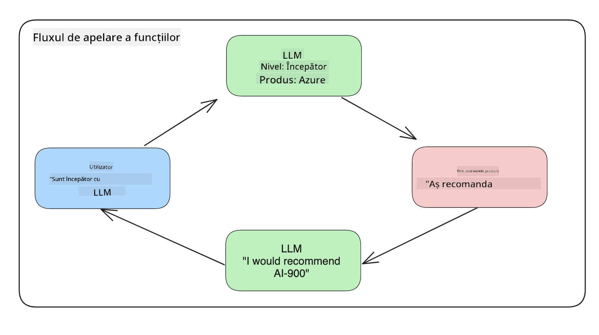

<!--
CO_OP_TRANSLATOR_METADATA:
{
  "original_hash": "77a48a201447be19aa7560706d6f93a0",
  "translation_date": "2025-07-09T14:43:14+00:00",
  "source_file": "11-integrating-with-function-calling/README.md",
  "language_code": "ro"
}
-->
# Integrarea cu function calling

[](https://aka.ms/gen-ai-lesson11-gh?WT.mc_id=academic-105485-koreyst)

Până acum ai învățat destul de multe în lecțiile anterioare. Totuși, putem face și mai bine. Unele aspecte pe care le putem îmbunătăți sunt modul în care obținem un format de răspuns mai consistent pentru a facilita lucrul cu răspunsul ulterior. De asemenea, am putea dori să adăugăm date din alte surse pentru a îmbogăți și mai mult aplicația noastră.

Problemele menționate mai sus sunt cele pe care acest capitol își propune să le abordeze.

## Introducere

Această lecție va acoperi:

- Explicarea ce este function calling și cazurile sale de utilizare.
- Crearea unui apel de funcție folosind Azure OpenAI.
- Cum să integrezi un apel de funcție într-o aplicație.

## Obiective de învățare

La finalul acestei lecții, vei putea:

- Explica scopul utilizării function calling.
- Configura Function Call folosind Azure OpenAI Service.
- Proiecta apeluri de funcții eficiente pentru cazul tău de utilizare în aplicație.

## Scenariu: Îmbunătățirea chatbot-ului nostru cu funcții

Pentru această lecție, vrem să construim o funcționalitate pentru startup-ul nostru educațional care să permită utilizatorilor să folosească un chatbot pentru a găsi cursuri tehnice. Vom recomanda cursuri care se potrivesc nivelului lor de competență, rolului actual și tehnologiei de interes.

Pentru a finaliza acest scenariu, vom folosi o combinație de:

- `Azure OpenAI` pentru a crea o experiență de chat pentru utilizator.
- `Microsoft Learn Catalog API` pentru a ajuta utilizatorii să găsească cursuri pe baza cererii lor.
- `Function Calling` pentru a prelua întrebarea utilizatorului și a o trimite către o funcție care face cererea API.

Pentru a începe, să vedem de ce am vrea să folosim function calling în primul rând:

## De ce Function Calling

Înainte de function calling, răspunsurile de la un LLM erau neorganizate și inconsistente. Dezvoltatorii trebuiau să scrie cod complex de validare pentru a se asigura că pot gestiona fiecare variație a unui răspuns. Utilizatorii nu puteau obține răspunsuri precum „Care este vremea actuală în Stockholm?”. Acest lucru se datorează faptului că modelele erau limitate la momentul în care datele au fost antrenate.

Function Calling este o caracteristică a Azure OpenAI Service care depășește următoarele limitări:

- **Format consistent al răspunsului**. Dacă putem controla mai bine formatul răspunsului, putem integra mai ușor răspunsul în alte sisteme.
- **Date externe**. Posibilitatea de a folosi date din alte surse ale unei aplicații într-un context de chat.

## Ilustrarea problemei printr-un scenariu

> Îți recomandăm să folosești [notebook-ul inclus](../../../11-integrating-with-function-calling/python/aoai-assignment.ipynb) dacă vrei să rulezi scenariul de mai jos. Poți și doar să citești în continuare, deoarece încercăm să ilustrăm o problemă pe care funcțiile o pot ajuta să fie rezolvată.

Să vedem exemplul care ilustrează problema formatului răspunsului:

Să presupunem că vrem să creăm o bază de date cu date despre studenți pentru a le putea sugera cursul potrivit. Mai jos avem două descrieri ale studenților care sunt foarte asemănătoare în datele pe care le conțin.

1. Creăm o conexiune la resursa noastră Azure OpenAI:

   ```python
   import os
   import json
   from openai import AzureOpenAI
   from dotenv import load_dotenv
   load_dotenv()

   client = AzureOpenAI(
   api_key=os.environ['AZURE_OPENAI_API_KEY'],  # this is also the default, it can be omitted
   api_version = "2023-07-01-preview"
   )

   deployment=os.environ['AZURE_OPENAI_DEPLOYMENT']
   ```

   Mai jos este un cod Python pentru configurarea conexiunii la Azure OpenAI unde setăm `api_type`, `api_base`, `api_version` și `api_key`.

1. Creăm două descrieri de studenți folosind variabilele `student_1_description` și `student_2_description`.

   ```python
   student_1_description="Emily Johnson is a sophomore majoring in computer science at Duke University. She has a 3.7 GPA. Emily is an active member of the university's Chess Club and Debate Team. She hopes to pursue a career in software engineering after graduating."

   student_2_description = "Michael Lee is a sophomore majoring in computer science at Stanford University. He has a 3.8 GPA. Michael is known for his programming skills and is an active member of the university's Robotics Club. He hopes to pursue a career in artificial intelligence after finishing his studies."
   ```

   Dorim să trimitem aceste descrieri către un LLM pentru a parsa datele. Aceste date pot fi folosite ulterior în aplicația noastră și pot fi trimise către un API sau stocate într-o bază de date.

1. Să creăm două prompturi identice în care îi spunem LLM-ului ce informații ne interesează:

   ```python
   prompt1 = f'''
   Please extract the following information from the given text and return it as a JSON object:

   name
   major
   school
   grades
   club

   This is the body of text to extract the information from:
   {student_1_description}
   '''

   prompt2 = f'''
   Please extract the following information from the given text and return it as a JSON object:

   name
   major
   school
   grades
   club

   This is the body of text to extract the information from:
   {student_2_description}
   '''
   ```

   Prompturile de mai sus îi cer LLM-ului să extragă informații și să returneze răspunsul în format JSON.

1. După ce am configurat prompturile și conexiunea la Azure OpenAI, vom trimite prompturile către LLM folosind `openai.ChatCompletion`. Stocăm promptul în variabila `messages` și atribuim rolul `user`. Acest lucru imită un mesaj scris de un utilizator către chatbot.

   ```python
   # response from prompt one
   openai_response1 = client.chat.completions.create(
   model=deployment,
   messages = [{'role': 'user', 'content': prompt1}]
   )
   openai_response1.choices[0].message.content

   # response from prompt two
   openai_response2 = client.chat.completions.create(
   model=deployment,
   messages = [{'role': 'user', 'content': prompt2}]
   )
   openai_response2.choices[0].message.content
   ```

Acum putem trimite ambele cereri către LLM și să examinăm răspunsul primit, accesându-l astfel: `openai_response1['choices'][0]['message']['content']`.

1. În final, putem converti răspunsul în format JSON apelând `json.loads`:

   ```python
   # Loading the response as a JSON object
   json_response1 = json.loads(openai_response1.choices[0].message.content)
   json_response1
   ```

   Răspuns 1:

   ```json
   {
     "name": "Emily Johnson",
     "major": "computer science",
     "school": "Duke University",
     "grades": "3.7",
     "club": "Chess Club"
   }
   ```

   Răspuns 2:

   ```json
   {
     "name": "Michael Lee",
     "major": "computer science",
     "school": "Stanford University",
     "grades": "3.8 GPA",
     "club": "Robotics Club"
   }
   ```

   Chiar dacă prompturile sunt identice și descrierile sunt similare, observăm că valorile proprietății `Grades` sunt formatate diferit, uneori primim formatul `3.7`, alteori `3.7 GPA`, de exemplu.

   Acest rezultat apare deoarece LLM primește date neorganizate sub forma promptului scris și returnează tot date neorganizate. Avem nevoie de un format structurat pentru a ști la ce să ne așteptăm când stocăm sau folosim aceste date.

Deci, cum rezolvăm problema formatării? Folosind function calling, ne asigurăm că primim înapoi date structurate. Când folosim function calling, LLM-ul nu apelează sau execută efectiv funcții. În schimb, creăm o structură pe care LLM-ul trebuie să o urmeze pentru răspunsurile sale. Apoi folosim aceste răspunsuri structurate pentru a ști ce funcție să rulăm în aplicațiile noastre.



Putem apoi lua ceea ce este returnat de funcție și să trimitem înapoi acest lucru către LLM. LLM va răspunde apoi folosind limbaj natural pentru a răspunde întrebării utilizatorului.

## Cazuri de utilizare pentru function calls

Există multe cazuri diferite în care apelurile de funcții pot îmbunătăți aplicația ta, cum ar fi:

- **Apelarea uneltelor externe**. Chatbot-urile sunt excelente pentru a oferi răspunsuri la întrebările utilizatorilor. Folosind function calling, chatbot-urile pot folosi mesajele utilizatorilor pentru a îndeplini anumite sarcini. De exemplu, un student poate cere chatbot-ului „Trimite un email instructorului meu spunând că am nevoie de mai mult ajutor la acest subiect”. Acesta poate face un apel de funcție la `send_email(to: string, body: string)`.

- **Crearea de interogări API sau baze de date**. Utilizatorii pot găsi informații folosind limbaj natural care este convertit într-o interogare formatată sau cerere API. Un exemplu ar fi un profesor care cere „Cine sunt studenții care au terminat ultima temă” și care poate apela o funcție numită `get_completed(student_name: string, assignment: int, current_status: string)`.

- **Crearea de date structurate**. Utilizatorii pot lua un bloc de text sau CSV și pot folosi LLM pentru a extrage informații importante din el. De exemplu, un student poate converti un articol Wikipedia despre acorduri de pace pentru a crea fișe AI. Acest lucru se poate face folosind o funcție numită `get_important_facts(agreement_name: string, date_signed: string, parties_involved: list)`.

## Crearea primului tău apel de funcție

Procesul de creare a unui apel de funcție include 3 pași principali:

1. **Apelarea** API-ului Chat Completions cu o listă de funcții și un mesaj de la utilizator.
2. **Citirea** răspunsului modelului pentru a efectua o acțiune, adică executarea unei funcții sau apel API.
3. **Realizarea** unui alt apel către API-ul Chat Completions cu răspunsul funcției pentru a folosi acea informație în crearea unui răspuns pentru utilizator.


### Pasul 1 - crearea mesajelor

Primul pas este să creăm un mesaj de utilizator. Acesta poate fi atribuit dinamic preluând valoarea unui input text sau poți atribui o valoare aici. Dacă este prima dată când lucrezi cu API-ul Chat Completions, trebuie să definim `role` și `content` al mesajului.

`role` poate fi fie `system` (crearea regulilor), `assistant` (modelul) sau `user` (utilizatorul final). Pentru function calling, vom atribui `user` și o întrebare exemplu.

```python
messages= [ {"role": "user", "content": "Find me a good course for a beginner student to learn Azure."} ]
```

Prin atribuirea diferitelor roluri, se clarifică pentru LLM dacă este sistemul care spune ceva sau utilizatorul, ceea ce ajută la construirea unui istoric al conversației pe care LLM îl poate folosi.

### Pasul 2 - crearea funcțiilor

Următorul pas este să definim o funcție și parametrii acelei funcții. Vom folosi o singură funcție aici numită `search_courses`, dar poți crea mai multe funcții.

> **Important** : Funcțiile sunt incluse în mesajul sistem către LLM și vor fi incluse în numărul de tokeni disponibili.

Mai jos, creăm funcțiile ca un array de elemente. Fiecare element este o funcție și are proprietățile `name`, `description` și `parameters`:

```python
functions = [
   {
      "name":"search_courses",
      "description":"Retrieves courses from the search index based on the parameters provided",
      "parameters":{
         "type":"object",
         "properties":{
            "role":{
               "type":"string",
               "description":"The role of the learner (i.e. developer, data scientist, student, etc.)"
            },
            "product":{
               "type":"string",
               "description":"The product that the lesson is covering (i.e. Azure, Power BI, etc.)"
            },
            "level":{
               "type":"string",
               "description":"The level of experience the learner has prior to taking the course (i.e. beginner, intermediate, advanced)"
            }
         },
         "required":[
            "role"
         ]
      }
   }
]
```

Să descriem fiecare instanță de funcție mai detaliat:

- `name` - Numele funcției pe care dorim să o apelăm.
- `description` - Descrierea modului în care funcția funcționează. Aici este important să fim specifici și clari.
- `parameters` - O listă de valori și formatul pe care dorim ca modelul să le producă în răspunsul său. Array-ul de parametri conține elemente care au următoarele proprietăți:
  1.  `type` - Tipul de date în care vor fi stocate proprietățile.
  2.  `properties` - Lista valorilor specifice pe care modelul le va folosi în răspunsul său formatat.
      1. `name` - Cheia este numele proprietății pe care modelul o va folosi în răspunsul formatat, de exemplu, `product`.
      2. `type` - Tipul de date al acestei proprietăți, de exemplu, `string`.
      3. `description` - Descrierea proprietății specifice.

Există și o proprietate opțională `required` - proprietate obligatorie pentru ca apelul funcției să fie complet.

### Pasul 3 - Realizarea apelului de funcție

După ce am definit o funcție, trebuie să o includem în apelul către API-ul Chat Completion. Facem acest lucru adăugând `functions` în cerere. În acest caz `functions=functions`.

Există și opțiunea de a seta `function_call` la `auto`. Aceasta înseamnă că lăsăm LLM să decidă ce funcție să apeleze pe baza mesajului utilizatorului, în loc să o atribuim noi.

Mai jos este un cod în care apelăm `ChatCompletion.create`, observă cum setăm `functions=functions` și `function_call="auto"`, oferind astfel LLM-ului libertatea de a alege când să apeleze funcțiile pe care i le oferim:

```python
response = client.chat.completions.create(model=deployment,
                                        messages=messages,
                                        functions=functions,
                                        function_call="auto")

print(response.choices[0].message)
```

Răspunsul primit arată astfel:

```json
{
  "role": "assistant",
  "function_call": {
    "name": "search_courses",
    "arguments": "{\n  \"role\": \"student\",\n  \"product\": \"Azure\",\n  \"level\": \"beginner\"\n}"
  }
}
```

Aici putem vedea cum funcția `search_courses` a fost apelată și cu ce argumente, listate în proprietatea `arguments` din răspunsul JSON.

Concluzia este că LLM a reușit să găsească datele pentru a completa argumentele funcției, extrăgându-le din valoarea oferită parametrului `messages` în apelul chat completion. Mai jos este un reminder al valorii `messages`:

```python
messages= [ {"role": "user", "content": "Find me a good course for a beginner student to learn Azure."} ]
```

După cum vezi, `student`, `Azure` și `beginner` au fost extrase din `messages` și setate ca input pentru funcție. Folosirea funcțiilor în acest mod este o metodă excelentă de a extrage informații dintr-un prompt, dar și de a oferi structură LLM-ului și de a avea funcționalitate reutilizabilă.

Următorul pas este să vedem cum putem folosi asta în aplicația noastră.

## Integrarea apelurilor de funcții într-o aplicație

După ce am testat răspunsul formatat de la LLM, acum îl putem integra într-o aplicație.

### Gestionarea fluxului

Pentru a integra asta în aplicația noastră, să urmăm pașii următori:

1. Mai întâi, facem apelul către serviciile OpenAI și stocăm mesajul într-o variabilă numită `response_message`.

   ```python
   response_message = response.choices[0].message
   ```

1. Acum definim funcția care va apela Microsoft Learn API pentru a obține o listă de cursuri:

   ```python
   import requests

   def search_courses(role, product, level):
     url = "https://learn.microsoft.com/api/catalog/"
     params = {
        "role": role,
        "product": product,
        "level": level
     }
     response = requests.get(url, params=params)
     modules = response.json()["modules"]
     results = []
     for module in modules[:5]:
        title = module["title"]
        url = module["url"]
        results.append({"title": title, "url": url})
     return str(results)
   ```

   Observă cum acum creăm o funcție Python reală care corespunde numelor funcțiilor introduse în variabila `functions`. De asemenea, facem apeluri reale către API-uri externe pentru a prelua datele necesare. În acest caz, apelăm Microsoft Learn API pentru a căuta module de training.

Ok, am creat variabila `functions` și o funcție Python corespunzătoare, cum îi spunem LLM-ului cum să le asocieze astfel încât funcția Python să fie apelată?

1. Pentru a vedea dacă trebuie să apelăm o funcție Python, trebuie să verificăm răspunsul LLM și să vedem dacă `function_call` face parte din el și să apelăm funcția indicată. Iată cum poți face această verificare:

   ```python
   # Check if the model wants to call a function
   if response_message.function_call.name:
    print("Recommended Function call:")
    print(response_message.function_call.name)
    print()

    # Call the function.
    function_name = response_message.function_call.name

    available_functions = {
            "search_courses": search_courses,
    }
    function_to_call = available_functions[function_name]

    function_args = json.loads(response_message.function_call.arguments)
    function_response = function_to_call(**function_args)

    print("Output of function call:")
    print(function_response)
    print(type(function_response))


    # Add the assistant response and function response to the messages
    messages.append( # adding assistant response to messages
        {
            "role": response_message.role,
            "function_call": {
                "name": function_name,
                "arguments": response_message.function_call.arguments,
            },
            "content": None
        }
    )
    messages.append( # adding function response to messages
        {
            "role": "function",
            "name": function_name,
            "content":function_response,
        }
    )
   ```

   Aceste trei linii asigură extragerea numelui funcției, a argumentelor și efectuarea apelului:

   ```python
   function_to_call = available_functions[function_name]

   function_args = json.loads(response_message.function_call.arguments)
   function_response = function_to_call(**function_args)
   ```

   Mai jos este output-ul obținut la rularea codului nostru:

   **Output**

   ```Recommended Function call:
   {
     "name": "search_courses",
     "arguments": "{\n  \"role\": \"student\",\n  \"product\": \"Azure\",\n  \"level\": \"beginner\"\n}"
   }

   Output of function call:
   [{'title': 'Describe concepts of cryptography', 'url': 'https://learn.microsoft.com/training/modules/describe-concepts-of-cryptography/?
   WT.mc_id=api_CatalogApi'}, {'title': 'Introduction to audio classification with TensorFlow', 'url': 'https://learn.microsoft.com/en-
   us/training/modules/intro-audio-classification-tensorflow/?WT.mc_id=api_CatalogApi'}, {'title': 'Design a Performant Data Model in Azure SQL
   Database with Azure Data Studio', 'url': 'https://learn.microsoft.com/training/modules/design-a-data-model-with-ads/?
   WT.mc_id=api_CatalogApi'}, {'title': 'Getting started with the Microsoft Cloud Adoption Framework for Azure', 'url':
   'https://learn.microsoft.com/training/modules/cloud-adoption-framework-getting-started/?WT.mc_id=api_CatalogApi'}, {'title': 'Set up the
   Rust development environment', 'url': 'https://learn.microsoft.com/training/modules/rust-set-up-environment/?WT.mc_id=api_CatalogApi'}]
   <class 'str'>
   ```

1. Acum vom trimite mesajul actualizat, `messages` către LLM pentru a primi un răspuns în limbaj natural în loc de un răspuns formatat JSON de la API.

   ```python
   print("Messages in next request:")
   print(messages)
   print()

   second_response = client.chat.completions.create(
      messages=messages,
      model=deployment,
      function_call="auto",
      functions=functions,
      temperature=0
         )  # get a new response from GPT where it can see the function response


   print(second_response.choices[0].message)
   ```

   **Output**

   ```python
   {
     "role": "assistant",
     "content": "I found some good courses for beginner students to learn Azure:\n\n1. [Describe concepts of cryptography] (https://learn.microsoft.com/training/modules/describe-concepts-of-cryptography/?WT.mc_id=api_CatalogApi)\n2. [Introduction to audio classification with TensorFlow](https://learn.microsoft.com/training/modules/intro-audio-classification-tensorflow/?WT.mc_id=api_CatalogApi)\n3. [Design a Performant Data Model in Azure SQL Database with Azure Data Studio](https://learn.microsoft.com/training/modules/design-a-data-model-with-ads/?WT.mc_id=api_CatalogApi)\n4. [Getting started with the Microsoft Cloud Adoption Framework for Azure](https://learn.microsoft.com/training/modules/cloud-adoption-framework-getting-started/?WT.mc_id=api_CatalogApi)\n5. [Set up the Rust development environment](https://learn.microsoft.com/training/modules/rust-set-up-environment/?WT.mc_id=api_CatalogApi)\n\nYou can click on the links to access the courses."
   }

   ```

## Tema

Pentru a-ți continua învățarea despre Azure OpenAI Function Calling poți construi:

- Mai mulți parametri ai funcției care să ajute cursanții să găsească mai multe cursuri.
- Creează un alt apel de funcție care să preia mai multe informații de la cursant, cum ar fi limba maternă.
- Creează gestionarea erorilor când apelul funcției și/sau apelul API nu returnează cursuri potrivite.
## Excelent! Continuă călătoria

După ce ai terminat această lecție, consultă colecția noastră [Generative AI Learning](https://aka.ms/genai-collection?WT.mc_id=academic-105485-koreyst) pentru a-ți aprofunda cunoștințele despre Generative AI!

Mergi la Lecția 12, unde vom explora cum să [proiectăm UX pentru aplicații AI](../12-designing-ux-for-ai-applications/README.md?WT.mc_id=academic-105485-koreyst)!

**Declinare de responsabilitate**:  
Acest document a fost tradus folosind serviciul de traducere AI [Co-op Translator](https://github.com/Azure/co-op-translator). Deși ne străduim pentru acuratețe, vă rugăm să rețineți că traducerile automate pot conține erori sau inexactități. Documentul original în limba sa nativă trebuie considerat sursa autorizată. Pentru informații critice, se recomandă traducerea profesională realizată de un specialist uman. Nu ne asumăm răspunderea pentru eventualele neînțelegeri sau interpretări greșite rezultate din utilizarea acestei traduceri.