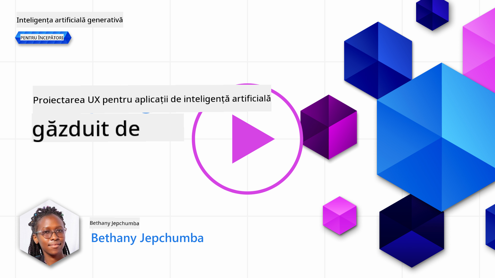
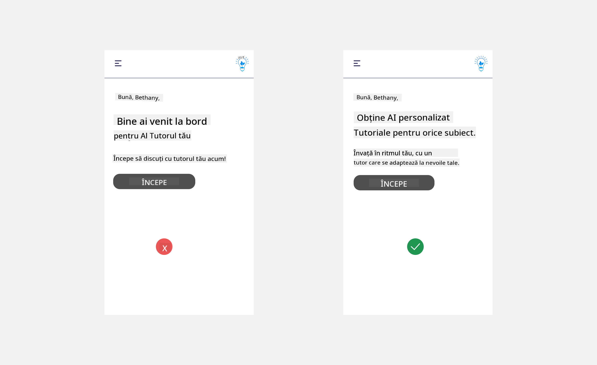
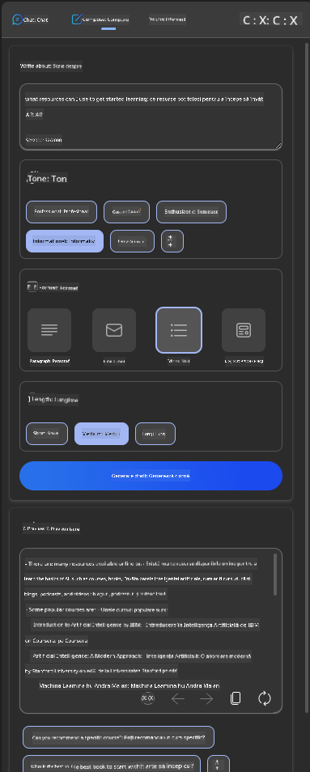
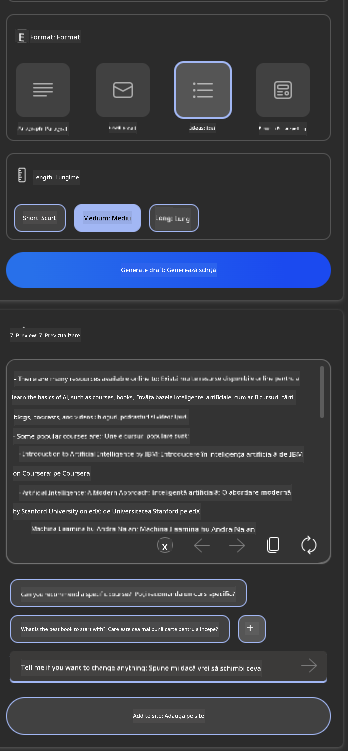

<!--
CO_OP_TRANSLATOR_METADATA:
{
  "original_hash": "ec385b41ee50579025d50cc03bfb3a25",
  "translation_date": "2025-05-19T22:05:41+00:00",
  "source_file": "12-designing-ux-for-ai-applications/README.md",
  "language_code": "ro"
}
-->
# Proiectarea UX pentru aplicații AI

> _(Apasă pe imaginea de mai sus pentru a viziona videoclipul acestei lecții)_

Experiența utilizatorului este un aspect foarte important în construirea aplicațiilor. Utilizatorii trebuie să poată folosi aplicația ta într-un mod eficient pentru a îndeplini sarcini. A fi eficient este un lucru, dar trebuie să proiectezi aplicații astfel încât să poată fi folosite de toată lumea, pentru a le face _accesibile_. Acest capitol se va concentra pe această zonă, astfel încât să ajungi să proiectezi o aplicație pe care oamenii pot și vor să o folosească.

## Introducere

Experiența utilizatorului se referă la modul în care un utilizator interacționează și utilizează un produs sau serviciu specific, fie că este un sistem, un instrument sau un design. Când dezvoltăm aplicații AI, dezvoltatorii nu se concentrează doar pe asigurarea unei experiențe eficiente, ci și etice. În această lecție, discutăm cum să construim aplicații de Inteligență Artificială (AI) care să răspundă nevoilor utilizatorilor.

Lecția va acoperi următoarele domenii:

- Introducere în Experiența Utilizatorului și Înțelegerea Nevoilor Utilizatorului
- Proiectarea Aplicațiilor AI pentru Încredere și Transparență
- Proiectarea Aplicațiilor AI pentru Colaborare și Feedback

## Obiective de învățare

După parcurgerea acestei lecții, vei putea:

- Înțelege cum să construiești aplicații AI care să răspundă nevoilor utilizatorilor.
- Proiecta aplicații AI care să promoveze încrederea și colaborarea.

### Cerințe preliminare

Alocă timp pentru a citi mai multe despre [experiența utilizatorului și design thinking.](https://learn.microsoft.com/training/modules/ux-design?WT.mc_id=academic-105485-koreyst)

## Introducere în Experiența Utilizatorului și Înțelegerea Nevoilor Utilizatorului

În startup-ul nostru fictiv de educație, avem doi utilizatori principali, profesori și elevi. Fiecare dintre cei doi utilizatori are nevoi unice. Un design centrat pe utilizator prioritizează utilizatorul, asigurându-se că produsele sunt relevante și benefice pentru cei cărora le sunt destinate.

Aplicația ar trebui să fie **utilă, fiabilă, accesibilă și plăcută** pentru a oferi o bună experiență utilizatorului.

### Utilitate

A fi util înseamnă că aplicația are funcționalități care corespund scopului său, cum ar fi automatizarea procesului de notare sau generarea de fișe de studiu pentru revizuire. O aplicație care automatizează procesul de notare ar trebui să poată atribui corect și eficient note lucrărilor elevilor pe baza unor criterii predefinite. În mod similar, o aplicație care generează fișe de revizuire ar trebui să poată crea întrebări relevante și diverse pe baza datelor sale.

### Fiabilitate

A fi fiabil înseamnă că aplicația poate îndeplini sarcinile sale în mod constant și fără erori. Cu toate acestea, AI, la fel ca oamenii, nu este perfectă și poate fi predispusă la erori. Aplicațiile pot întâmpina erori sau situații neașteptate care necesită intervenție sau corecție umană. Cum gestionezi erorile? În ultima secțiune a acestei lecții, vom acoperi cum sunt proiectate sistemele și aplicațiile AI pentru colaborare și feedback.

### Accesibilitate

A fi accesibil înseamnă extinderea experienței utilizatorului la utilizatori cu diverse abilități, inclusiv cei cu dizabilități, asigurându-se că nimeni nu este lăsat pe dinafară. Urmând ghidurile și principiile de accesibilitate, soluțiile AI devin mai incluzive, utilizabile și benefice pentru toți utilizatorii.

### Plăcut

A fi plăcut înseamnă că aplicația este plăcută de utilizat. O experiență utilizator plăcută poate avea un impact pozitiv asupra utilizatorului, încurajându-l să revină la aplicație și crescând veniturile afacerii.

Nu fiecare provocare poate fi rezolvată cu AI. AI vine să îmbunătățească experiența utilizatorului, fie că este vorba de automatizarea sarcinilor manuale sau personalizarea experiențelor utilizatorului.

## Proiectarea Aplicațiilor AI pentru Încredere și Transparență

Construirea încrederii este esențială atunci când proiectăm aplicații AI. Încrederea asigură utilizatorul că aplicația va îndeplini sarcinile, va livra rezultate constant și că rezultatele sunt ceea ce utilizatorul are nevoie. Un risc în această zonă este neîncrederea și supraincrederea. Neîncrederea apare atunci când un utilizator are puțină sau deloc încredere într-un sistem AI, ceea ce duce la respingerea aplicației tale. Supraincrederea apare atunci când un utilizator supraestimează capacitatea unui sistem AI, determinând utilizatorii să aibă prea multă încredere în sistemul AI. De exemplu, un sistem automatizat de notare, în cazul supraincrederii, ar putea determina profesorul să nu mai verifice unele lucrări pentru a se asigura că sistemul de notare funcționează corect. Acest lucru ar putea duce la note nedrepte sau inexacte pentru elevi sau la pierderea oportunităților de feedback și îmbunătățire.

Două modalități de a te asigura că încrederea este plasată chiar în centrul designului sunt explicabilitatea și controlul.

### Explicabilitate

Când AI ajută la informarea deciziilor, cum ar fi transmiterea cunoștințelor către generațiile viitoare, este esențial ca profesorii și părinții să înțeleagă cum sunt luate deciziile AI. Aceasta este explicabilitatea - înțelegerea modului în care aplicațiile AI iau decizii. Proiectarea pentru explicabilitate include adăugarea detaliilor despre ce poate face o aplicație AI. De exemplu, în loc de "Începe cu profesorul AI", sistemul poate folosi: "Rezumați notițele pentru o revizuire mai ușoară folosind AI."

Un alt exemplu este modul în care AI utilizează datele utilizatorului și datele personale. De exemplu, un utilizator cu persona de elev poate avea limitări bazate pe persona sa. AI-ul poate să nu fie capabil să dezvăluie răspunsuri la întrebări, dar poate ajuta să ghideze utilizatorul să gândească cum poate rezolva o problemă.

O ultimă parte cheie a explicabilității este simplificarea explicațiilor. Elevii și profesorii s-ar putea să nu fie experți în AI, prin urmare explicațiile despre ce poate sau nu poate face aplicația ar trebui să fie simplificate și ușor de înțeles.

### Control

AI generativă creează o colaborare între AI și utilizator, unde, de exemplu, un utilizator poate modifica prompturile pentru a obține rezultate diferite. În plus, odată ce un rezultat este generat, utilizatorii ar trebui să poată modifica rezultatele, oferindu-le un sentiment de control. De exemplu, când folosești Bing, poți adapta promptul în funcție de format, ton și lungime. În plus, poți adăuga modificări la rezultat și modifica rezultatul așa cum se arată mai jos:

O altă caracteristică în Bing care permite unui utilizator să aibă control asupra aplicației este abilitatea de a opta pentru sau împotriva datelor pe care AI le folosește. Pentru o aplicație școlară, un elev ar putea dori să folosească notițele sale, precum și resursele profesorilor ca material de revizuire.

> Când proiectezi aplicații AI, intenționalitatea este esențială pentru a te asigura că utilizatorii nu au așteptări nerealiste față de capabilitățile acesteia. O modalitate de a face acest lucru este prin crearea de fricțiune între prompturi și rezultate. Reamintește utilizatorului că aceasta este AI și nu un alt om.

## Proiectarea Aplicațiilor AI pentru Colaborare și Feedback

Așa cum am menționat anterior, AI generativă creează o colaborare între utilizator și AI. Majoritatea interacțiunilor sunt cu un utilizator care introduce un prompt și AI-ul generează un rezultat. Ce se întâmplă dacă rezultatul este incorect? Cum gestionează aplicația erorile dacă apar? AI-ul învinovățește utilizatorul sau își face timp să explice eroarea?

Aplicațiile AI ar trebui să fie construite pentru a primi și oferi feedback. Acest lucru nu doar că ajută sistemul AI să se îmbunătățească, dar și construiește încrederea cu utilizatorii. Un circuit de feedback ar trebui să fie inclus în design, un exemplu putând fi un simplu thumbs up sau down pe rezultat.

O altă modalitate de a gestiona acest lucru este să comunici clar capacitățile și limitările sistemului. Când un utilizator face o eroare cerând ceva dincolo de capacitățile AI, ar trebui să existe și o modalitate de a gestiona acest lucru, așa cum se arată mai jos.

Erorile sistemului sunt comune în aplicațiile unde utilizatorul ar putea avea nevoie de asistență cu informații în afara domeniului de aplicare al AI-ului sau aplicația ar putea avea o limită asupra câtor întrebări/subiecte un utilizator poate genera rezumate. De exemplu, o aplicație AI antrenată cu date pe subiecte limitate, de exemplu, Istorie și Matematică, s-ar putea să nu poată gestiona întrebări legate de Geografie. Pentru a atenua acest lucru, sistemul AI poate oferi un răspuns precum: "Ne pare rău, produsul nostru a fost antrenat cu date în următoarele subiecte....., nu pot răspunde la întrebarea pe care ai pus-o."

Aplicațiile AI nu sunt perfecte, prin urmare, sunt predispuse să facă greșeli. Când îți proiectezi aplicațiile, ar trebui să te asiguri că creezi spațiu pentru feedback de la utilizatori și gestionarea erorilor într-un mod simplu și ușor de explicat.

## Temă

Ia în considerare orice aplicații AI pe care le-ai construit până acum și implementează următorii pași în aplicația ta:

- **Plăcut:** Gândește-te cum poți face aplicația ta mai plăcută. Adaugi explicații peste tot? Încurajezi utilizatorul să exploreze? Cum formulezi mesajele de eroare?

- **Utilitate:** Construiește o aplicație web. Asigură-te că aplicația ta este navigabilă atât cu mouse-ul, cât și cu tastatura.

- **Încredere și transparență:** Nu te încrede complet în AI și în rezultatele sale, gândește-te cum ai adăuga un om în proces pentru a verifica rezultatele. De asemenea, ia în considerare și implementează alte modalități de a obține încredere și transparență.

- **Control:** Oferă utilizatorului controlul asupra datelor pe care le oferă aplicației. Implementează o modalitate prin care un utilizator poate opta pentru sau împotriva colectării datelor în aplicația AI.

## Continuă-ți învățarea!

După ce ai finalizat această lecție, verifică [colecția noastră de Învățare AI Generativă](https://aka.ms/genai-collection?WT.mc_id=academic-105485-koreyst) pentru a continua să îți îmbunătățești cunoștințele despre AI Generativă!

Treci la Lecția 13, unde vom analiza cum să [securizăm aplicațiile AI](../13-securing-ai-applications/README.md?WT.mc_id=academic-105485-koreyst)!

**Declinarea responsabilității**:  
Acest document a fost tradus folosind serviciul de traducere AI [Co-op Translator](https://github.com/Azure/co-op-translator). Deși ne străduim să asigurăm acuratețea, vă rugăm să fiți conștienți că traducerile automate pot conține erori sau inexactități. Documentul original în limba sa nativă ar trebui considerat sursa autoritară. Pentru informații critice, se recomandă traducerea profesională umană. Nu suntem responsabili pentru eventualele neînțelegeri sau interpretări greșite care pot apărea din utilizarea acestei traduceri.