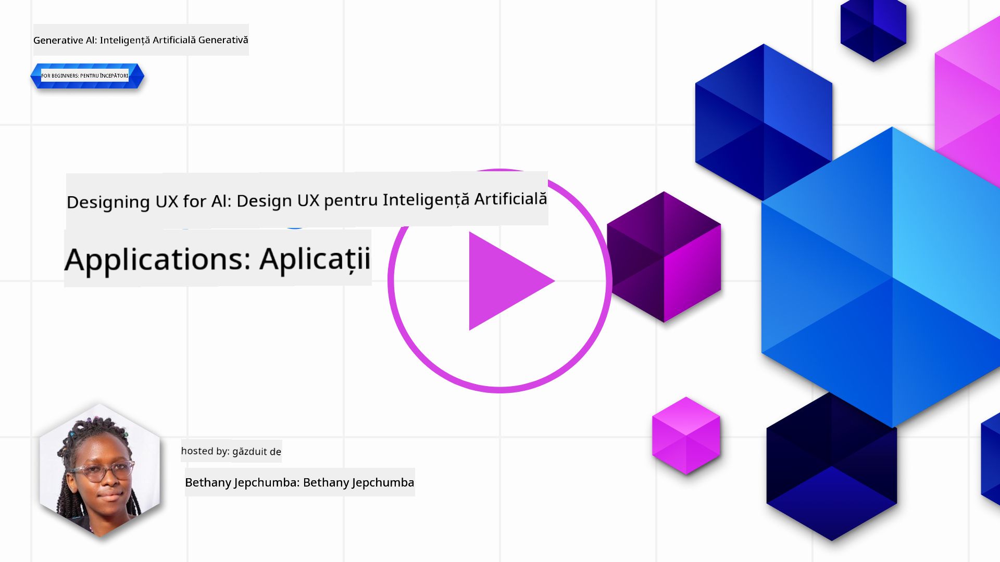
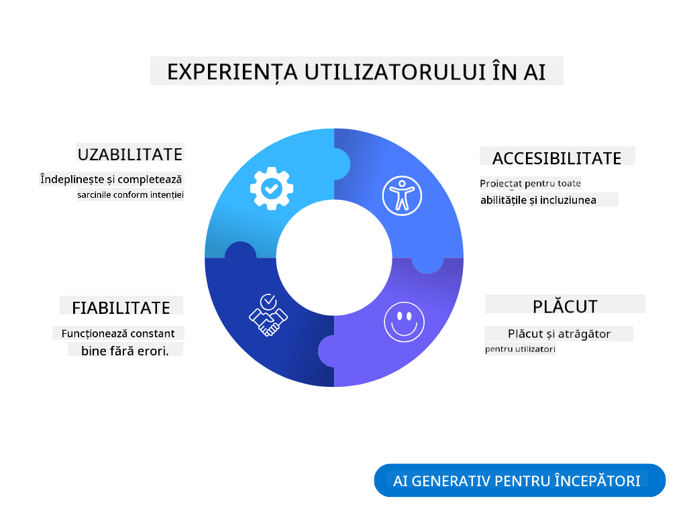
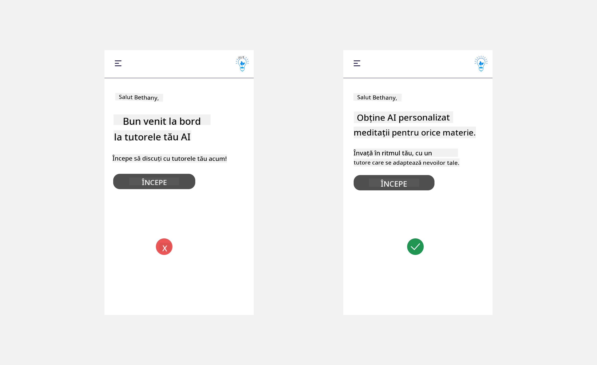
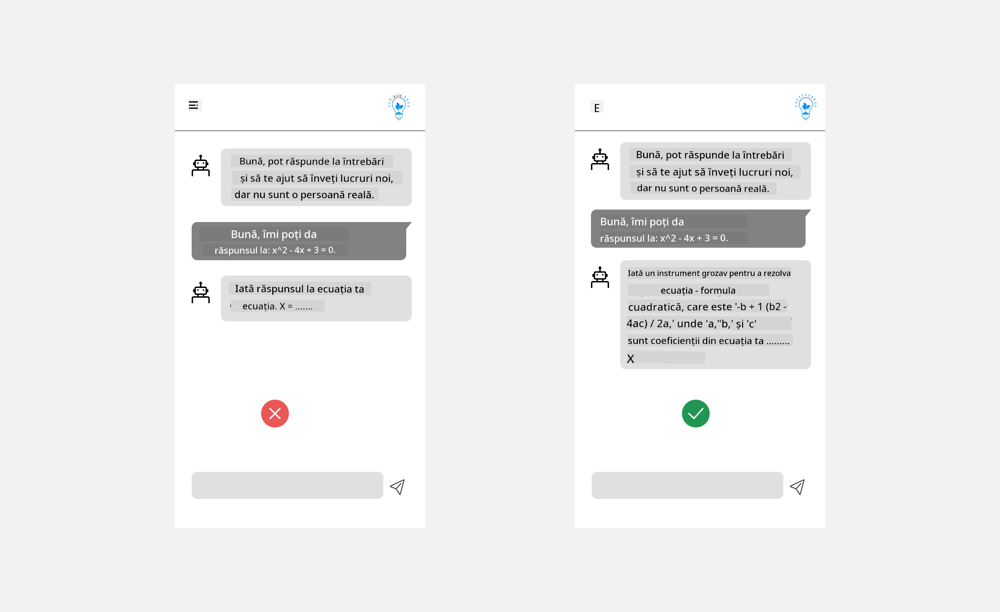
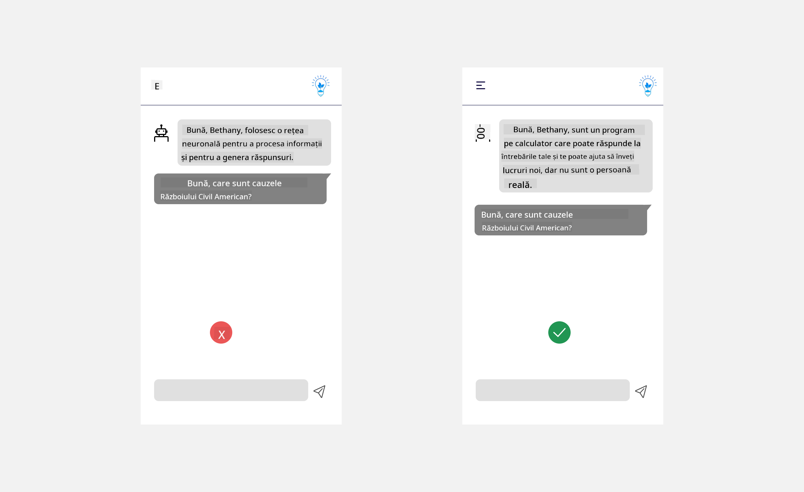
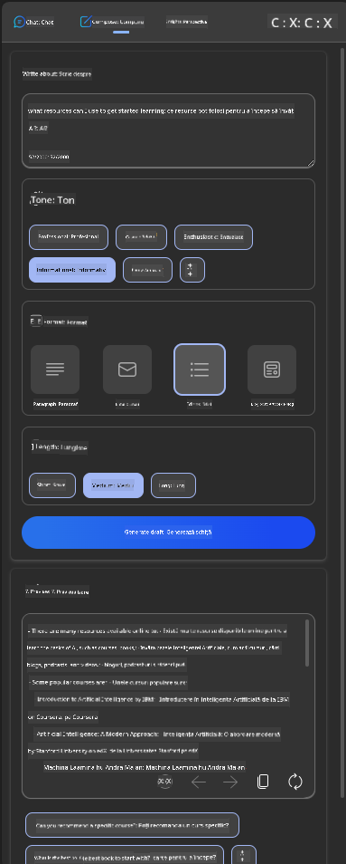
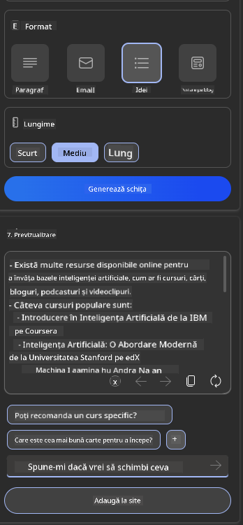
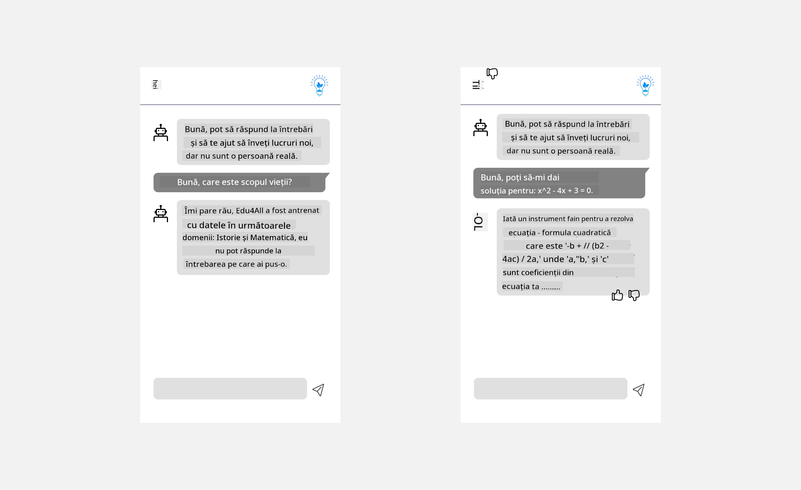

<!--
CO_OP_TRANSLATOR_METADATA:
{
  "original_hash": "ec385b41ee50579025d50cc03bfb3a25",
  "translation_date": "2025-07-09T15:04:40+00:00",
  "source_file": "12-designing-ux-for-ai-applications/README.md",
  "language_code": "ro"
}
-->
# Proiectarea UX pentru Aplicații AI

> _(Click pe imaginea de mai sus pentru a viziona videoclipul acestei lecții)_

Experiența utilizatorului este un aspect foarte important în construirea aplicațiilor. Utilizatorii trebuie să poată folosi aplicația ta într-un mod eficient pentru a-și îndeplini sarcinile. Eficiența este un lucru, dar trebuie să proiectezi aplicații astfel încât să poată fi folosite de toată lumea, pentru a le face _accesibile_. Acest capitol se va concentra pe acest aspect, astfel încât să ajungi să proiectezi o aplicație pe care oamenii o pot și vor să o folosească.

## Introducere

Experiența utilizatorului reprezintă modul în care un utilizator interacționează cu un produs sau serviciu specific, fie că este un sistem, un instrument sau un design. Atunci când dezvoltă aplicații AI, dezvoltatorii nu se concentrează doar pe asigurarea unei experiențe eficiente pentru utilizator, ci și pe aspecte etice. În această lecție, vom aborda cum să construim aplicații de Inteligență Artificială (AI) care să răspundă nevoilor utilizatorilor.

Lecția va acoperi următoarele domenii:

- Introducere în Experiența Utilizatorului și Înțelegerea Nevoilor Utilizatorilor
- Proiectarea Aplicațiilor AI pentru Încredere și Transparență
- Proiectarea Aplicațiilor AI pentru Colaborare și Feedback

## Obiective de învățare

După parcurgerea acestei lecții, vei putea:

- Să înțelegi cum să construiești aplicații AI care să răspundă nevoilor utilizatorilor.
- Să proiectezi aplicații AI care să promoveze încrederea și colaborarea.

### Prerechizite

Alocă-ți puțin timp pentru a citi mai multe despre [experiența utilizatorului și design thinking.](https://learn.microsoft.com/training/modules/ux-design?WT.mc_id=academic-105485-koreyst)

## Introducere în Experiența Utilizatorului și Înțelegerea Nevoilor Utilizatorilor

În startup-ul nostru fictiv din domeniul educației, avem doi utilizatori principali: profesori și elevi. Fiecare dintre acești utilizatori are nevoi unice. Un design centrat pe utilizator prioritizează utilizatorul, asigurând că produsele sunt relevante și benefice pentru cei cărora li se adresează.

Aplicația ar trebui să fie **utilă, fiabilă, accesibilă și plăcută** pentru a oferi o experiență bună utilizatorului.

### Utilizabilitate

A fi util înseamnă că aplicația are funcționalități care corespund scopului său, cum ar fi automatizarea procesului de notare sau generarea de fișe de studiu pentru recapitulare. O aplicație care automatizează procesul de notare ar trebui să poată atribui corect și eficient note lucrărilor elevilor, pe baza unor criterii predefinite. În mod similar, o aplicație care generează fișe de studiu ar trebui să poată crea întrebări relevante și variate, bazate pe datele sale.

### Fiabilitate

A fi fiabil înseamnă că aplicația poate îndeplini sarcina în mod constant și fără erori. Totuși, AI, la fel ca oamenii, nu este perfect și poate fi predispus la erori. Aplicațiile pot întâmpina erori sau situații neașteptate care necesită intervenție sau corecție umană. Cum gestionezi erorile? În ultima secțiune a acestei lecții vom aborda modul în care sistemele și aplicațiile AI sunt proiectate pentru colaborare și feedback.

### Accesibilitate

A fi accesibil înseamnă extinderea experienței utilizatorului către persoane cu diverse abilități, inclusiv cele cu dizabilități, asigurând că nimeni nu este exclus. Urmând ghidurile și principiile de accesibilitate, soluțiile AI devin mai incluzive, ușor de folosit și benefice pentru toți utilizatorii.

### Plăcut

A fi plăcut înseamnă că aplicația este agreabilă la utilizare. O experiență atractivă poate avea un impact pozitiv asupra utilizatorului, încurajându-l să revină la aplicație și crescând veniturile afacerii.

Nu orice provocare poate fi rezolvată cu AI. AI vine să completeze experiența utilizatorului, fie prin automatizarea sarcinilor manuale, fie prin personalizarea experiențelor utilizatorilor.

## Proiectarea Aplicațiilor AI pentru Încredere și Transparență

Construirea încrederii este esențială atunci când proiectezi aplicații AI. Încrederea asigură că utilizatorul are încredere că aplicația va îndeplini sarcina, va livra rezultate constante și că rezultatele sunt cele de care utilizatorul are nevoie. Un risc în acest domeniu este neîncrederea și supraîncrederea. Neîncrederea apare atunci când un utilizator are puțină sau deloc încredere într-un sistem AI, ceea ce duce la respingerea aplicației tale. Supraîncrederea apare atunci când un utilizator supraestimează capacitatea unui sistem AI, ceea ce duce la o încredere excesivă în sistem. De exemplu, un sistem automatizat de notare, în cazul supraîncrederii, poate determina profesorul să nu verifice unele lucrări pentru a se asigura că sistemul funcționează corect. Acest lucru poate duce la note nedrepte sau inexacte pentru elevi sau la pierderea oportunităților de feedback și îmbunătățire.

Două moduri de a asigura că încrederea este pusă în centrul designului sunt explicabilitatea și controlul.

### Explicabilitate

Atunci când AI ajută la luarea deciziilor, cum ar fi transmiterea cunoștințelor generațiilor viitoare, este esențial ca profesorii și părinții să înțeleagă cum sunt luate deciziile AI. Aceasta este explicabilitatea – înțelegerea modului în care aplicațiile AI iau decizii. Proiectarea pentru explicabilitate include adăugarea de detalii și exemple despre ce poate face o aplicație AI. De exemplu, în loc de „Începe cu profesorul AI”, sistemul poate folosi: „Rezumați notițele pentru o recapitulare mai ușoară folosind AI.”

Un alt exemplu este modul în care AI folosește datele utilizatorului și datele personale. De exemplu, un utilizator cu persona de elev poate avea limitări bazate pe această persona. AI poate să nu poată dezvălui răspunsurile la întrebări, dar poate ajuta utilizatorul să gândească cum să rezolve o problemă.

Un ultim aspect cheie al explicabilității este simplificarea explicațiilor. Elevii și profesorii nu sunt experți în AI, prin urmare explicațiile despre ce poate sau nu poate face aplicația ar trebui să fie simplificate și ușor de înțeles.

### Control

AI generativ creează o colaborare între AI și utilizator, unde, de exemplu, utilizatorul poate modifica prompturile pentru rezultate diferite. În plus, odată ce un rezultat este generat, utilizatorii ar trebui să poată modifica rezultatele, oferindu-le un sentiment de control. De exemplu, când folosești Bing, poți adapta promptul în funcție de format, ton și lungime. De asemenea, poți adăuga modificări la rezultatul obținut și îl poți ajusta, așa cum se arată mai jos:

O altă funcție în Bing care permite utilizatorului să aibă control asupra aplicației este posibilitatea de a opta pentru sau împotriva utilizării datelor AI. Pentru o aplicație școlară, un elev ar putea dori să folosească notițele proprii, precum și resursele profesorilor ca material de recapitulare.

> Când proiectezi aplicații AI, intenționalitatea este cheia pentru a te asigura că utilizatorii nu au o încredere excesivă, stabilind așteptări realiste privind capacitățile sale. Un mod de a face acest lucru este prin crearea unui mic obstacol între prompturi și rezultate. Amintind utilizatorului că acesta este AI și nu o ființă umană.

## Proiectarea Aplicațiilor AI pentru Colaborare și Feedback

Așa cum am menționat anterior, AI generativ creează o colaborare între utilizator și AI. Majoritatea interacțiunilor constau în introducerea unui prompt de către utilizator și generarea unui rezultat de către AI. Ce se întâmplă dacă rezultatul este incorect? Cum gestionează aplicația erorile dacă apar? AI dă vina pe utilizator sau își ia timp să explice eroarea?

Aplicațiile AI ar trebui să fie construite pentru a primi și oferi feedback. Acest lucru nu doar ajută sistemul AI să se îmbunătățească, ci și construiește încredere cu utilizatorii. Un ciclu de feedback ar trebui inclus în design, un exemplu fiind un simplu buton de like sau dislike pentru rezultat.

Un alt mod de a gestiona acest lucru este să comunici clar capabilitățile și limitările sistemului. Când un utilizator face o cerere care depășește capacitățile AI, ar trebui să existe o modalitate de a gestiona acest lucru, așa cum se arată mai jos.

Erorile de sistem sunt frecvente în aplicații unde utilizatorul poate avea nevoie de asistență cu informații din afara domeniului AI sau aplicația poate avea o limită privind numărul de întrebări/subiecte pentru care se pot genera rezumate. De exemplu, o aplicație AI antrenată cu date pe subiecte limitate, cum ar fi Istorie și Matematică, poate să nu poată răspunde la întrebări legate de Geografie. Pentru a atenua acest lucru, sistemul AI poate oferi un răspuns de genul: „Ne pare rău, produsul nostru a fost antrenat cu date în următoarele domenii....., nu pot răspunde la întrebarea pe care ați pus-o.”

Aplicațiile AI nu sunt perfecte, prin urmare, vor face greșeli. Când proiectezi aplicațiile, trebuie să te asiguri că lași loc pentru feedback din partea utilizatorilor și pentru gestionarea erorilor într-un mod simplu și ușor de explicat.

## Tema

Ia orice aplicație AI pe care ai construit-o până acum și ia în considerare implementarea următorilor pași în aplicația ta:

- **Plăcut:** Gândește-te cum poți face aplicația mai plăcută. Adaugi explicații peste tot? Încurajezi utilizatorul să exploreze? Cum formulezi mesajele de eroare?

- **Utilizabilitate:** Construiește o aplicație web. Asigură-te că aplicația ta poate fi navigată atât cu mouse-ul, cât și cu tastatura.

- **Încredere și transparență:** Nu avea încredere totală în AI și în rezultatele sale, gândește-te cum ai putea adăuga o persoană care să verifice rezultatul. De asemenea, ia în considerare și implementează alte metode pentru a obține încredere și transparență.

- **Control:** Oferă utilizatorului control asupra datelor pe care le furnizează aplicației. Implementează o modalitate prin care utilizatorul să poată opta pentru sau împotriva colectării datelor în aplicația AI.

## Continuă să înveți!

După ce ai terminat această lecție, consultă colecția noastră de [Învățare Generativă AI](https://aka.ms/genai-collection?WT.mc_id=academic-105485-koreyst) pentru a-ți continua dezvoltarea cunoștințelor despre Generative AI!

Mergi la Lecția 13, unde vom vedea cum să [securizăm aplicațiile AI](../13-securing-ai-applications/README.md?WT.mc_id=academic-105485-koreyst)!

**Declinare de responsabilitate**:  
Acest document a fost tradus folosind serviciul de traducere AI [Co-op Translator](https://github.com/Azure/co-op-translator). Deși ne străduim pentru acuratețe, vă rugăm să rețineți că traducerile automate pot conține erori sau inexactități. Documentul original în limba sa nativă trebuie considerat sursa autorizată. Pentru informații critice, se recomandă traducerea profesională realizată de un specialist uman. Nu ne asumăm răspunderea pentru eventualele neînțelegeri sau interpretări greșite rezultate din utilizarea acestei traduceri.