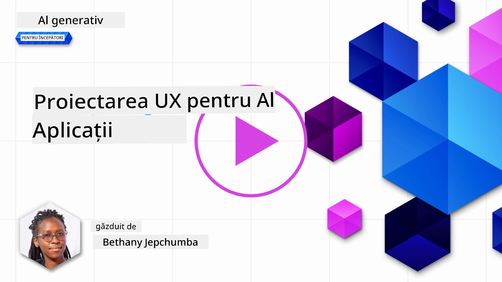
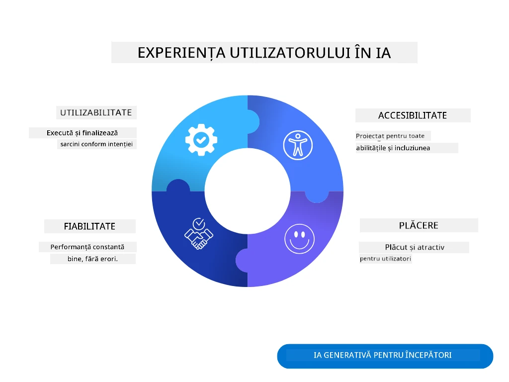
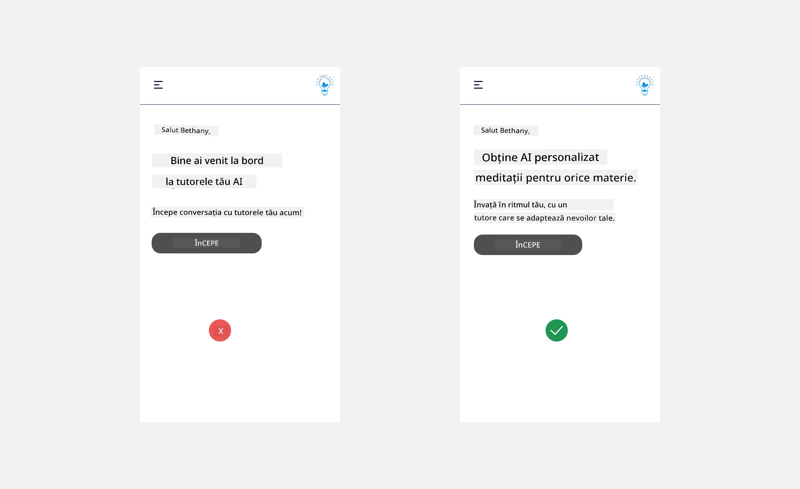
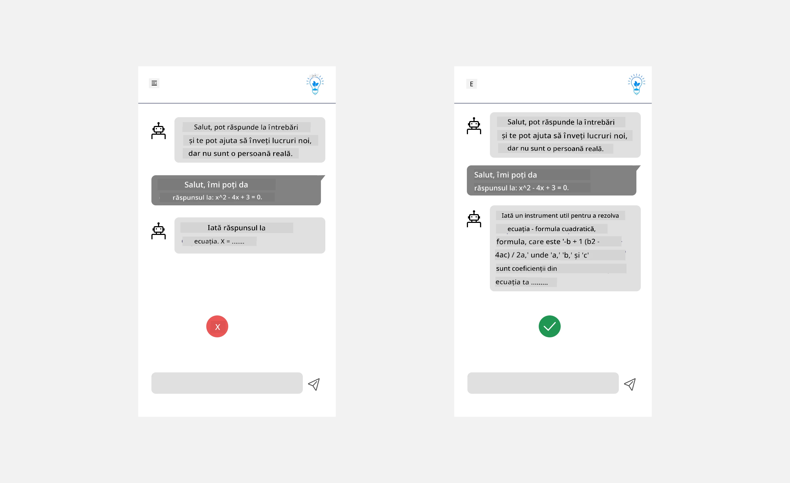
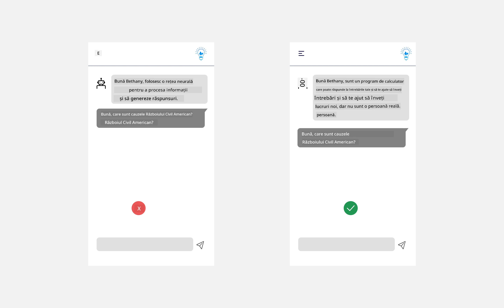
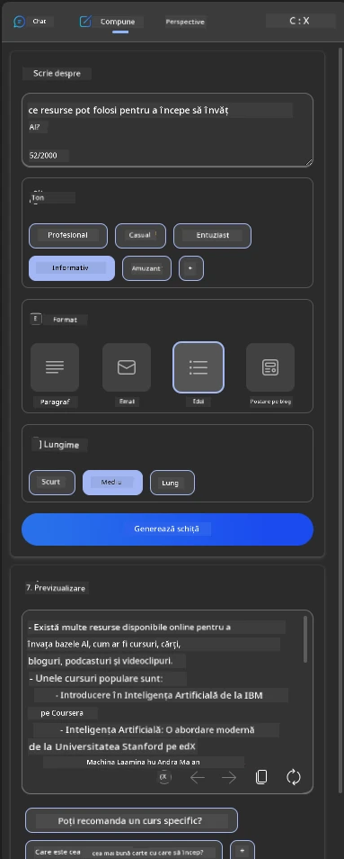
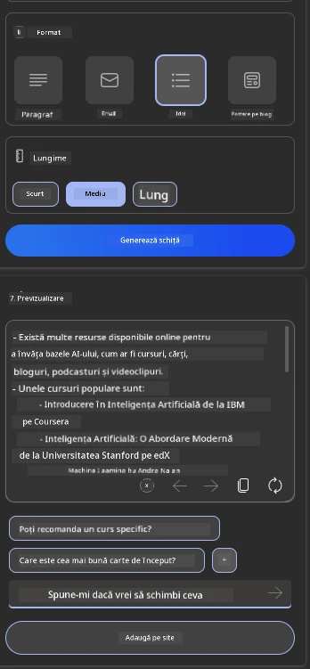
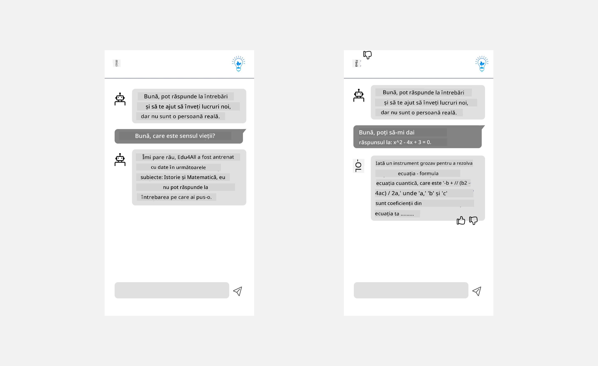

# Proiectarea UX pentru Aplicații AI

> _(Faceți clic pe imaginea de mai sus pentru a viziona videoclipul acestei lecții)_

Experiența utilizatorului este un aspect foarte important în construirea aplicațiilor. Utilizatorii trebuie să poată folosi aplicația dvs. într-un mod eficient pentru a îndeplini sarcini. Fiind eficient este un lucru, dar trebuie și să proiectați aplicații astfel încât să poată fi utilizate de către toată lumea, pentru a le face _accesibile_. Acest capitol se va concentra pe această zonă, astfel încât sperăm să ajungeți să proiectați o aplicație pe care oamenii o pot și doresc să o folosească.

## Introducere

Experiența utilizatorului este modul în care un utilizator interacționează și folosește un produs sau serviciu specific, fie acesta un sistem, un instrument sau un design. Când se dezvoltă aplicații AI, dezvoltatorii nu se concentrează doar pe asigurarea că experiența utilizatorului este eficientă, ci și etică. În această lecție, acoperim modul de construire a aplicațiilor de Inteligență Artificială (AI) care răspund nevoilor utilizatorilor.

Lecția va acoperi următoarele domenii:

- Introducere în Experiența Utilizatorului și Întelegerea Nevoilor Utilizatorilor
- Proiectarea Aplicațiilor AI pentru Încredere și Transparență
- Proiectarea Aplicațiilor AI pentru Colaborare și Feedback

## Obiective de învățare

După parcurgerea acestei lecții, veți fi capabil să:

- Înțelegeți cum să construiți aplicații AI care să răspundă nevoilor utilizatorilor.
- Proiectați aplicații AI care să promoveze încrederea și colaborarea.

### Precondiții

Luați ceva timp pentru a citi mai mult despre [experiența utilizatorului și gândirea de design.](https://learn.microsoft.com/training/modules/ux-design?WT.mc_id=academic-105485-koreyst)

## Introducere în Experiența Utilizatorului și Întelegerea Nevoilor Utilizatorilor

În startup-ul nostru fictiv de educație, avem doi utilizatori principali, profesorii și studenții. Fiecare dintre acești doi utilizatori are nevoi unice. Un design centrat pe utilizator pune utilizatorul pe primul loc, asigurând că produsele sunt relevante și benefice pentru cei pentru care sunt destinate.

Aplicația ar trebui să fie **utilă, fiabilă, accesibilă și plăcută** pentru a oferi o experiență bună utilizatorului.

### Utilitate

A fi util înseamnă că aplicația are funcționalități care se potrivesc scopului său intenționat, cum ar fi automatizarea procesului de notare sau generarea de fișe de studiu pentru recapitulare. O aplicație care automatizează procesul de notare ar trebui să poată atribui scoruri lucrărilor studenților în mod precis și eficient, bazat pe criterii predefinite. Similar, o aplicație care generează fișe de studiu ar trebui să poată crea întrebări relevante și diverse, bazate pe datele sale.

### Fiabilitate

A fi fiabil înseamnă că aplicația poate executa sarcina sa în mod constant și fără erori. Totuși, AI, la fel ca oamenii, nu este perfect și poate fi predispus la erori. Aplicațiile pot întâmpina erori sau situații neașteptate care necesită intervenție umană sau corecție. Cum gestionați erorile? În ultima secțiune a acestei lecții vom acoperi cum sistemele și aplicațiile AI sunt proiectate pentru colaborare și feedback.

### Accesibilitate

A fi accesibil înseamnă extinderea experienței utilizatorului către utilizatori cu diverse abilități, inclusiv cei cu dizabilități, asigurând că nimeni nu este exclus. Urmând ghidurile și principiile de accesibilitate, soluțiile AI devin mai incluzive, utilizabile și benefice pentru toți utilizatorii.

### Plăcut

A fi plăcut înseamnă că aplicația este agreabilă de folosit. O experiență atractivă poate avea un impact pozitiv asupra utilizatorului, încurajându-l să revină la aplicație și crescând veniturile afacerii.

Nu toate provocările pot fi rezolvate cu AI. AI vine să îmbunătățească experiența utilizatorului, fie automatizând sarcini manuale, fie personalizând experiențele utilizatorilor.

## Proiectarea Aplicațiilor AI pentru Încredere și Transparență

Construirea încrederii este critică când proiectați aplicații AI. Încrederea asigură că utilizatorul este încrezător că aplicația va îndeplini sarcina, va livra rezultate constante, iar rezultatele sunt cele de care utilizatorul are nevoie. Un risc în acest domeniu este neîncrederea și supraîncrederea. Neîncrederea apare când utilizatorul are puțină sau deloc încredere într-un sistem AI, ceea ce duce la respingerea aplicației. Supraîncrederea apare când utilizatorul supraestimează capacitatea unui sistem AI, determinând utilizatorii să aibă prea multă încredere în sistemul AI. De exemplu, un sistem automatizat de notare în cazul supraîncrederii poate determina profesorul să nu verifice lucrările pentru a se asigura că sistemul funcționează bine. Aceasta ar putea duce la note nedrepte sau inexacte pentru studenți, sau la oportunități ratate pentru feedback și îmbunătățire.

Două moduri de a asigura că încrederea este pusă în centrul designului sunt explicabilitatea și controlul.

### Explicabilitate

Când AI ajută la informarea deciziilor, cum ar fi transmiterea cunoștințelor generațiilor viitoare, este esențial pentru profesori și părinți să înțeleagă cum sunt luate deciziile de AI. Aceasta este explicabilitatea - înțelegerea modului în care aplicațiile AI iau decizii. Proiectarea pentru explicabilitate include adăugarea de detalii care evidențiază cum a ajuns AI la rezultat. Publicul trebuie să fie conștient că rezultatul este generat de AI și nu de un om. De exemplu, în loc să spuneți "Începe să conversezi cu tutorul tău acum" spuneți "Folosește tutorul AI care se adaptează nevoilor tale și te ajută să înveți în ritmul tău."

Un alt exemplu este modul în care AI folosește datele utilizatorului și datele personale. De exemplu, un utilizator cu persona student poate avea limitări bazate pe persona sa. AI poate să nu poată dezvălui răspunsurile la întrebări, dar poate să ghideze utilizatorul să gândească cum poate rezolva o problemă.

O ultimă parte cheie a explicabilității este simplificarea explicațiilor. Studenții și profesorii pot să nu fie experți în AI, prin urmare explicațiile despre ce poate sau nu poate face aplicația ar trebui să fie simplificate și ușor de înțeles.

### Control

AI generativ creează o colaborare între AI și utilizator, unde, de exemplu, utilizatorul poate modifica prompturile pentru rezultate diferite. În plus, odată ce un rezultat este generat, utilizatorii ar trebui să poată modifica rezultatele, oferindu-le un sentiment de control. De exemplu, când folosiți Microsoft Copilot (fost Bing Chat), puteți adapta promptul în funcție de format, ton și lungime. În plus, puteți adăuga modificări la rezultatul dvs. și puteți modifica rezultatul, după cum se arată mai jos:

O altă caracteristică în Microsoft Copilot care permite utilizatorului să aibă control asupra aplicației este capacitatea de a accepta sau refuza datele pe care AI le utilizează. Pentru o aplicație școlară, un student poate dori să folosească notițele sale, precum și resursele profesorilor ca material de recapitulare.

> Când proiectați aplicații AI, intenționalitatea este cheia pentru a vă asigura că utilizatorii nu au prea multă încredere, setând așteptări nerealiste privind capacitățile sale. Un mod de a face acest lucru este prin crearea de fricțiuni între prompturi și rezultate. Reamintind utilizatorului că aceasta este AI și nu un alt om.

## Proiectarea Aplicațiilor AI pentru Colaborare și Feedback

Așa cum s-a menționat anterior, AI generativ creează o colaborare între utilizator și AI. Majoritatea interacțiunilor sunt cu un utilizator care introduce un prompt iar AI generează un rezultat. Ce se întâmplă dacă rezultatul este incorect? Cum gestionează aplicația erorile dacă apar? AI dă vina pe utilizator sau își ia timp să explice eroarea?

Aplicațiile AI ar trebui construite pentru a primi și oferi feedback. Aceasta nu doar ajută sistemul AI să se îmbunătățească, ci și construiește încredere cu utilizatorii. Un ciclu de feedback ar trebui inclus în design, un exemplu putând fi un simplu deget mare în sus sau în jos pentru rezultat.

Un alt mod de a gestiona acest lucru este să comunicați clar capabilitățile și limitările sistemului. Când un utilizator face o greșeală cerând ceva dincolo de capabilitățile AI, ar trebui să existe și o modalitate de gestionare a acestei situații, așa cum se arată mai jos.

Erorile de sistem sunt comune în aplicațiile unde utilizatorul poate avea nevoie de asistență cu informații din afara domeniului AI sau aplicația poate avea o limită privind câte întrebări/subiecte un utilizator poate genera rezumate. De exemplu, o aplicație AI antrenată cu date pe subiecte limitate, de exemplu, Istorie și Matematică, poate să nu poată gestiona întrebări despre Geografie. Pentru a atenua acest lucru, sistemul AI poate răspunde cu: "Îmi pare rău, produsul nostru a fost antrenat cu date despre următoarele subiecte....., nu pot să răspund la întrebarea pe care ați pus-o."

Aplicațiile AI nu sunt perfecte, prin urmare, ele vor face greșeli. Când vă proiectați aplicațiile, trebuie să vă asigurați că creați spațiu pentru feedback de la utilizatori și gestionarea erorilor într-un mod simplu și ușor de explicat.

## Sarcină

Luați orice aplicații AI pe care le-ați construit până acum și luați în considerare implementarea următorilor pași în aplicația dvs.:

- **Plăcut:** Gândiți-vă cum puteți face aplicația dvs. mai plăcută. Adăugați explicații peste tot? Încurajați utilizatorul să exploreze? Cum formulați mesajele de eroare?

- **Utilitate:** Construiți o aplicație web. Asigurați-vă că aplicația este navigabilă atât cu mouse-ul, cât și cu tastatura.

- **Încredere și transparență:** Nu aveți încredere deplină în AI și în rezultatul său, gândiți-vă cum ați adăuga un om în proces pentru a verifica rezultatul. De asemenea, luați în considerare și implementați alte metode pentru a obține încredere și transparență.

- **Control:** Oferiți utilizatorului controlul asupra datelor pe care le oferă aplicației. Implementați o modalitate prin care utilizatorul poate opta să participe sau să refuze colectarea datelor în aplicația AI.

<!-- ## [Post-lecture quiz](../../../12-designing-ux-for-ai-applications/quiz-url) -->

## Continuați-vă Învățarea!

După ce ați terminat această lecție, verificați colecția noastră [Generative AI Learning collection](https://aka.ms/genai-collection?WT.mc_id=academic-105485-koreyst) pentru a continua să vă dezvoltați cunoștințele despre AI Generativ!

Mergeți la Lecția 13, unde vom analiza cum să [securizăm aplicațiile AI](../13-securing-ai-applications/README.md?WT.mc_id=academic-105485-koreyst)!

---

<!-- CO-OP TRANSLATOR DISCLAIMER START -->
**Declinare a responsabilității**:
Acest document a fost tradus folosind serviciul de traducere AI [Co-op Translator](https://github.com/Azure/co-op-translator). În timp ce ne străduim pentru acuratețe, vă rugăm să rețineți că traducerile automate pot conține erori sau inexactități. Documentul original în limba sa nativă trebuie considerat sursa autorizată. Pentru informații critice, se recomandă traducerea profesională realizată de un om. Nu ne asumăm responsabilitatea pentru eventualele neînțelegeri sau interpretări greșite care decurg din utilizarea acestei traduceri.
<!-- CO-OP TRANSLATOR DISCLAIMER END -->