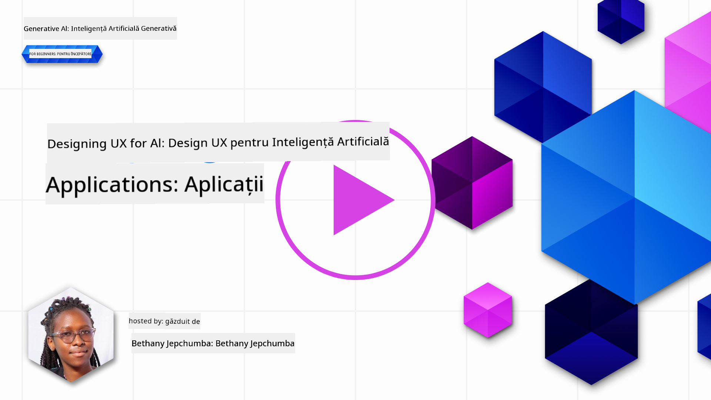
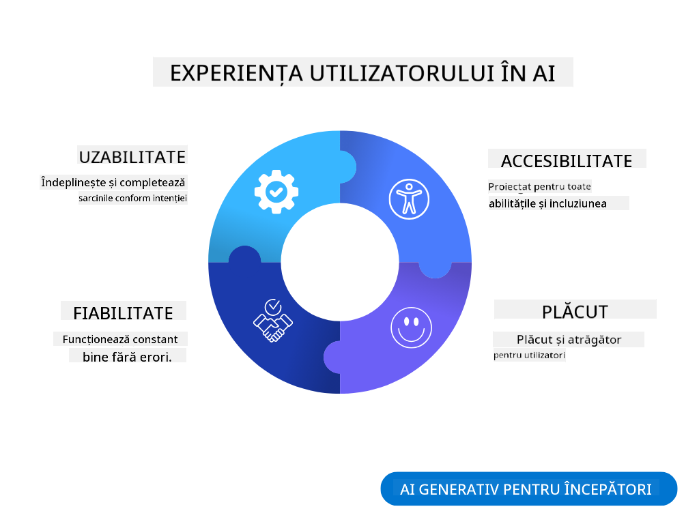
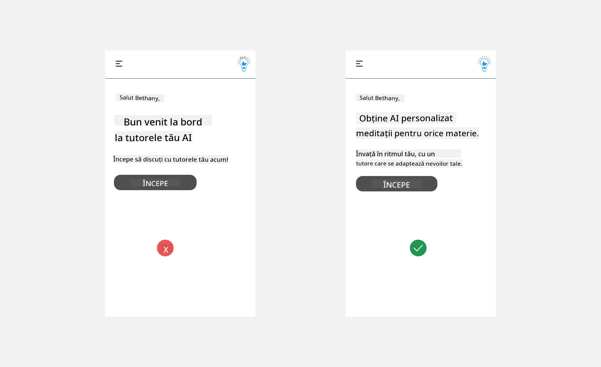
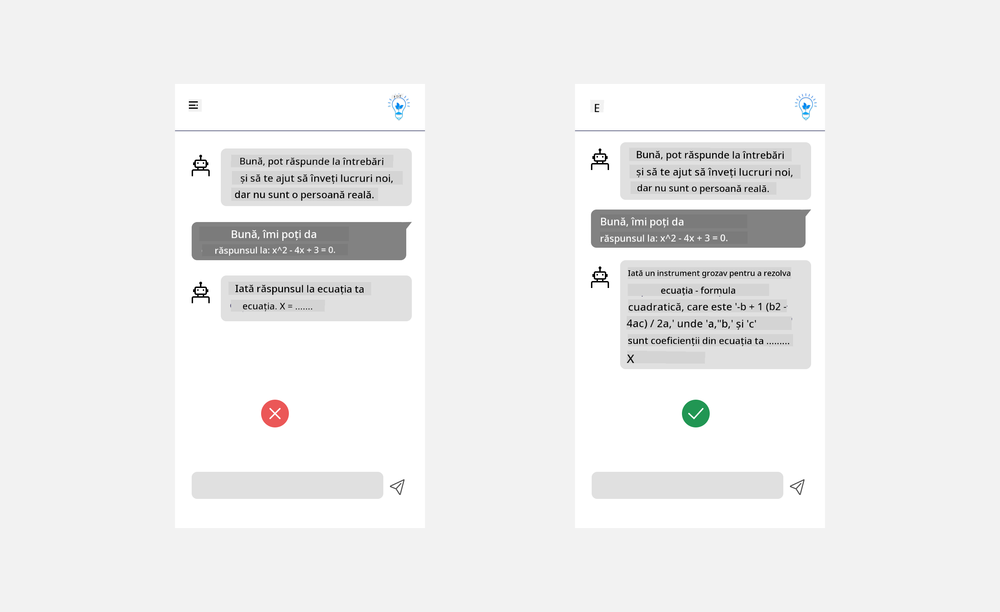
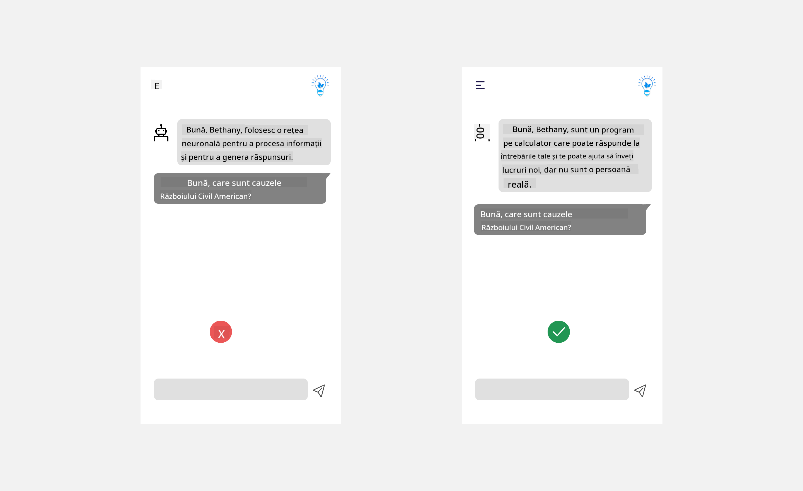
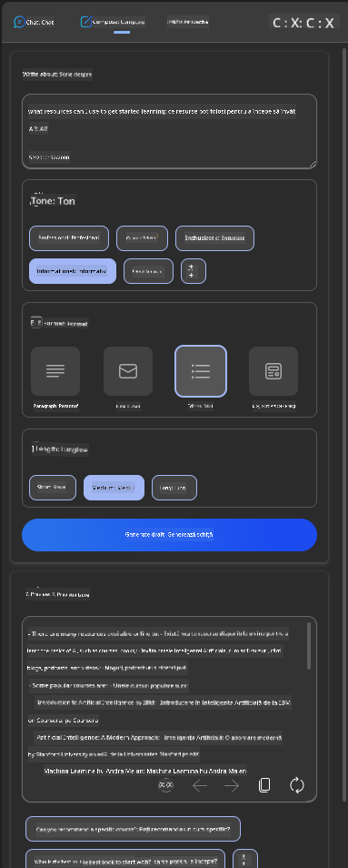
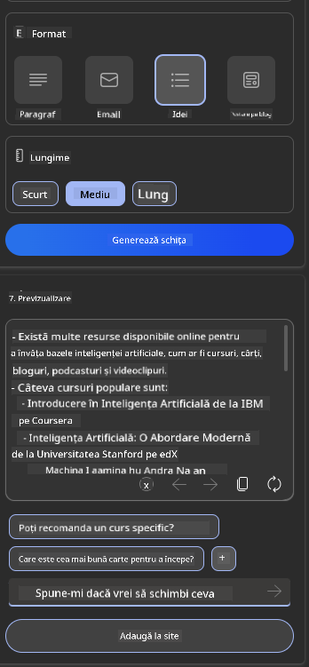
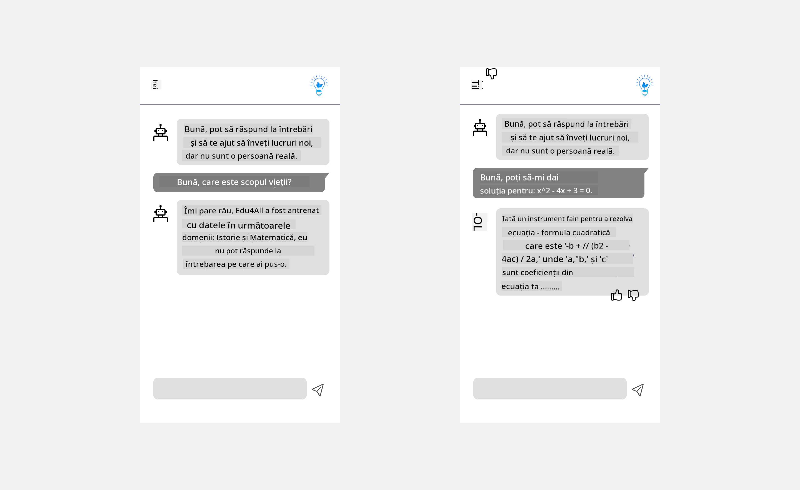

<!--
CO_OP_TRANSLATOR_METADATA:
{
  "original_hash": "ec385b41ee50579025d50cc03bfb3a25",
  "translation_date": "2025-06-25T20:33:11+00:00",
  "source_file": "12-designing-ux-for-ai-applications/README.md",
  "language_code": "ro"
}
-->
# Proiectarea UX pentru aplicații AI

> _(Click pe imaginea de mai sus pentru a viziona videoclipul lecției)_

Experiența utilizatorului este un aspect foarte important în construirea aplicațiilor. Utilizatorii trebuie să poată folosi aplicația eficient pentru a îndeplini sarcini. A fi eficient este un lucru, dar trebuie să proiectezi aplicații astfel încât să poată fi utilizate de toată lumea, pentru a le face _accesibile_. Acest capitol se va concentra pe această zonă, astfel încât să ajungi să proiectezi o aplicație pe care oamenii pot și doresc să o folosească.

## Introducere

Experiența utilizatorului se referă la modul în care un utilizator interacționează și utilizează un produs sau serviciu specific, fie că este un sistem, un instrument sau un design. Când dezvolți aplicații AI, dezvoltatorii nu se concentrează doar pe asigurarea unei experiențe eficiente, ci și etice. În această lecție, acoperim cum să construim aplicații de Inteligență Artificială (AI) care să răspundă nevoilor utilizatorului.

Lecția va acoperi următoarele domenii:

- Introducere în experiența utilizatorului și înțelegerea nevoilor utilizatorului
- Proiectarea aplicațiilor AI pentru încredere și transparență
- Proiectarea aplicațiilor AI pentru colaborare și feedback

## Obiective de învățare

După parcurgerea acestei lecții, vei putea:

- Înțelege cum să construiești aplicații AI care să îndeplinească nevoile utilizatorului.
- Proiecta aplicații AI care promovează încrederea și colaborarea.

### Cerințe preliminare

Ia-ți timp și citește mai multe despre [experiența utilizatorului și gândirea de design.](https://learn.microsoft.com/training/modules/ux-design?WT.mc_id=academic-105485-koreyst)

## Introducere în experiența utilizatorului și înțelegerea nevoilor utilizatorului

În startup-ul nostru fictiv de educație, avem doi utilizatori principali, profesori și elevi. Fiecare dintre cei doi utilizatori are nevoi unice. Un design centrat pe utilizator prioritizează utilizatorul, asigurându-se că produsele sunt relevante și benefice pentru cei cărora le sunt destinate.

Aplicația ar trebui să fie **utilă, fiabilă, accesibilă și plăcută** pentru a oferi o bună experiență utilizatorului.

### Utilitate

A fi util înseamnă că aplicația are funcționalități care se potrivesc scopului său, cum ar fi automatizarea procesului de notare sau generarea de fișe de revizuire. O aplicație care automatizează procesul de notare ar trebui să fie capabilă să atribuie corect și eficient punctaje lucrărilor elevilor pe baza unor criterii predefinite. În mod similar, o aplicație care generează fișe de revizuire ar trebui să fie capabilă să creeze întrebări relevante și diverse pe baza datelor sale.

### Fiabilitate

A fi fiabil înseamnă că aplicația poate îndeplini sarcina sa în mod constant și fără erori. Cu toate acestea, AI, la fel ca oamenii, nu este perfect și poate fi predispus la erori. Aplicațiile pot întâmpina erori sau situații neașteptate care necesită intervenția sau corectarea umană. Cum gestionezi erorile? În ultima secțiune a acestei lecții, vom acoperi cum sistemele și aplicațiile AI sunt proiectate pentru colaborare și feedback.

### Accesibilitate

A fi accesibil înseamnă extinderea experienței utilizatorului la utilizatori cu abilități variate, inclusiv cei cu dizabilități, asigurându-se că nimeni nu este lăsat pe dinafară. Urmând ghidurile și principiile de accesibilitate, soluțiile AI devin mai incluzive, utilizabile și benefice pentru toți utilizatorii.

### Plăcut

A fi plăcut înseamnă că aplicația este agreabilă de utilizat. O experiență utilizator atractivă poate avea un impact pozitiv asupra utilizatorului, încurajându-l să revină la aplicație și crescând veniturile afacerii.

Nu fiecare provocare poate fi rezolvată cu AI. AI vine să îmbunătățească experiența utilizatorului, fie că este vorba de automatizarea sarcinilor manuale sau personalizarea experiențelor utilizatorului.

## Proiectarea aplicațiilor AI pentru încredere și transparență

Construirea încrederii este esențială atunci când proiectezi aplicații AI. Încrederea asigură că un utilizator este sigur că aplicația va realiza sarcina, va livra rezultate în mod constant și că rezultatele sunt ceea ce utilizatorul are nevoie. Un risc în această zonă este neîncrederea și supraîncrederea. Neîncrederea apare atunci când un utilizator are puțină sau deloc încredere într-un sistem AI, ceea ce duce la respingerea aplicației tale de către utilizator. Supraîncrederea apare atunci când un utilizator supraestimează capacitatea unui sistem AI, ceea ce duce la o încredere excesivă în sistemul AI. De exemplu, un sistem automatizat de notare în cazul supraîncrederii ar putea duce profesorul să nu verifice unele dintre lucrări pentru a se asigura că sistemul de notare funcționează bine. Acest lucru ar putea rezulta în note nedrepte sau inexacte pentru elevi sau oportunități ratate de feedback și îmbunătățire.

Două moduri de a asigura că încrederea este pusă în centrul designului sunt explicabilitatea și controlul.

### Explicabilitate

Când AI ajută la informarea deciziilor, cum ar fi transmiterea cunoștințelor către generațiile viitoare, este esențial ca profesorii și părinții să înțeleagă cum sunt luate deciziile AI. Aceasta este explicabilitatea - înțelegerea modului în care aplicațiile AI iau decizii. Proiectarea pentru explicabilitate include adăugarea detaliilor cu exemple despre ceea ce poate face o aplicație AI. De exemplu, în loc de "Începeți cu AI pentru profesori", sistemul poate folosi: "Rezumați-vă notițele pentru o revizuire mai ușoară folosind AI."

Un alt exemplu este modul în care AI folosește datele utilizatorului și datele personale. De exemplu, un utilizator cu persona elev poate avea limitări bazate pe persona sa. AI poate să nu fie capabil să dezvăluie răspunsuri la întrebări, dar poate ajuta utilizatorul să gândească cum poate rezolva o problemă.

O ultimă parte cheie a explicabilității este simplificarea explicațiilor. Elevii și profesorii pot să nu fie experți în AI, de aceea explicațiile despre ceea ce aplicația poate sau nu poate face ar trebui să fie simplificate și ușor de înțeles.

### Control

Generative AI creează o colaborare între AI și utilizator, unde, de exemplu, un utilizator poate modifica solicitările pentru rezultate diferite. În plus, odată ce un rezultat este generat, utilizatorii ar trebui să poată modifica rezultatele, oferindu-le un sentiment de control. De exemplu, când folosești Bing, poți adapta solicitarea ta în funcție de format, ton și lungime. De asemenea, poți adăuga modificări la rezultatul tău și modifica rezultatul, așa cum este arătat mai jos:

O altă caracteristică în Bing care permite unui utilizator să aibă control asupra aplicației este capacitatea de a opta în și a opta din datele pe care AI le folosește. Pentru o aplicație școlară, un elev ar putea dori să folosească notițele sale, precum și resursele profesorilor ca material de revizuire.

> Când proiectezi aplicații AI, intenționalitatea este cheia pentru a asigura că utilizatorii nu supraîncredere, stabilind așteptări nerealiste ale capabilităților sale. Un mod de a face acest lucru este prin crearea de fricțiune între solicitări și rezultate. Amintind utilizatorului că aceasta este AI și nu un alt om

## Proiectarea aplicațiilor AI pentru colaborare și feedback

Așa cum am menționat anterior, generative AI creează o colaborare între utilizator și AI. Majoritatea interacțiunilor sunt cu un utilizator care introduce o solicitare și AI generează un rezultat. Ce se întâmplă dacă rezultatul este incorect? Cum gestionează aplicația erorile dacă acestea apar? AI acuză utilizatorul sau ia timp să explice eroarea?

Aplicațiile AI ar trebui să fie construite pentru a primi și a oferi feedback. Acest lucru nu doar ajută sistemul AI să se îmbunătățească, dar și construiește încrederea cu utilizatorii. Un circuit de feedback ar trebui să fie inclus în design, un exemplu poate fi un simplu thumbs up sau down pe rezultat.

Un alt mod de a gestiona acest lucru este să comunici clar capabilitățile și limitările sistemului. Când un utilizator face o eroare cerând ceva dincolo de capabilitățile AI, ar trebui să existe și un mod de a gestiona acest lucru, așa cum este arătat mai jos.

Erorile de sistem sunt comune în aplicații unde utilizatorul ar putea avea nevoie de asistență cu informații în afara domeniului de aplicare al AI sau aplicația poate avea o limită asupra câte întrebări/subiecte poate genera rezumate un utilizator. De exemplu, o aplicație AI antrenată cu date pe subiecte limitate, de exemplu, Istorie și Matematică, poate să nu fie capabilă să gestioneze întrebări legate de Geografie. Pentru a atenua acest lucru, sistemul AI poate oferi un răspuns de genul: "Ne pare rău, produsul nostru a fost antrenat cu date în următoarele subiecte....., nu pot să răspund la întrebarea pe care ai pus-o."

Aplicațiile AI nu sunt perfecte, prin urmare, sunt susceptibile să facă greșeli. Când îți proiectezi aplicațiile, ar trebui să te asiguri că creezi spațiu pentru feedback de la utilizatori și gestionarea erorilor într-un mod simplu și ușor de explicat.

## Temă

Ia orice aplicații AI pe care le-ai construit până acum, consideră implementarea pașilor de mai jos în aplicația ta:

- **Plăcut:** Gândește-te cum poți face aplicația ta mai plăcută. Adaugi explicații peste tot? Încurajezi utilizatorul să exploreze? Cum formulezi mesajele de eroare?

- **Utilitate:** Construiește o aplicație web. Asigură-te că aplicația ta este navigabilă atât cu mouse-ul, cât și cu tastatura.

- **Încredere și transparență:** Nu te încrede complet în AI și în rezultatul său, gândește-te cum ai adăuga un om în proces pentru a verifica rezultatul. De asemenea, consideră și implementează alte moduri de a obține încredere și transparență.

- **Control:** Oferă utilizatorului control asupra datelor pe care le furnizează aplicației. Implementează un mod prin care utilizatorul poate opta în și opta din colectarea datelor în aplicația AI.

## Continuă să înveți!

După ce ai completat această lecție, verifică colecția noastră de [Învățare AI Generativă](https://aka.ms/genai-collection?WT.mc_id=academic-105485-koreyst) pentru a continua să îți îmbunătățești cunoștințele în AI Generativă!

Mergi la Lecția 13, unde vom analiza cum să [securizăm aplicațiile AI](../13-securing-ai-applications/README.md?WT.mc_id=academic-105485-koreyst)!

**Declinarea responsabilității**:  
Acest document a fost tradus folosind serviciul de traducere AI [Co-op Translator](https://github.com/Azure/co-op-translator). Deși ne străduim să asigurăm acuratețea, vă rugăm să fiți conștienți că traducerile automate pot conține erori sau inexactități. Documentul original în limba sa natală ar trebui considerat sursa autoritară. Pentru informații critice, se recomandă traducerea profesională umană. Nu suntem responsabili pentru niciun fel de neînțelegeri sau interpretări greșite care ar putea apărea din utilizarea acestei traduceri.