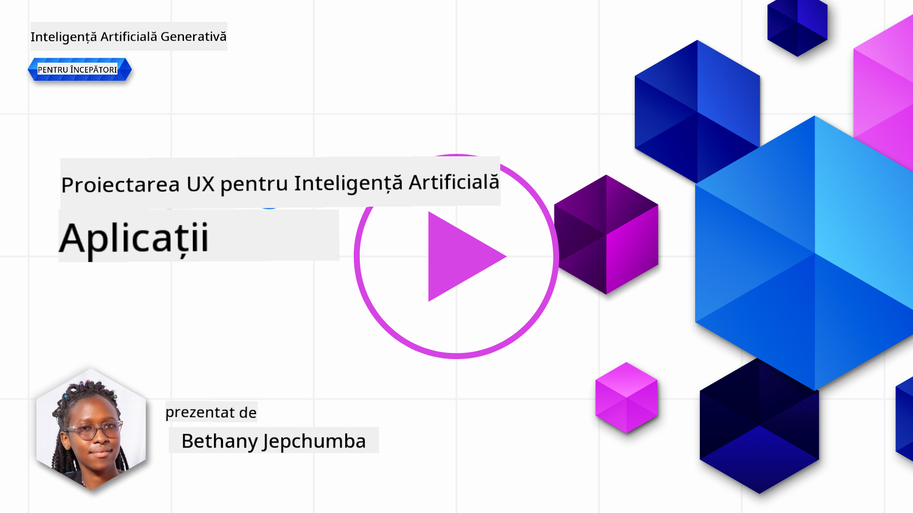
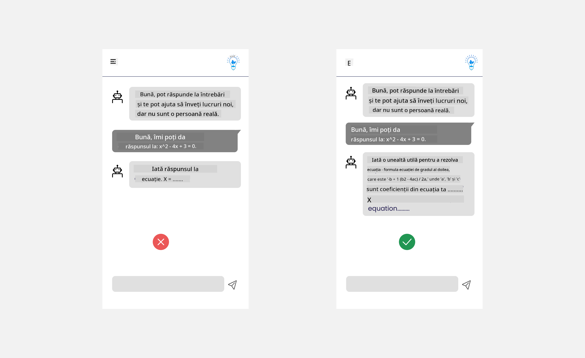
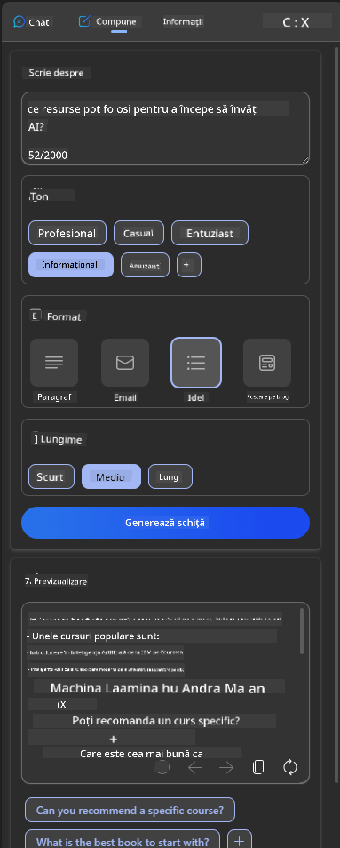
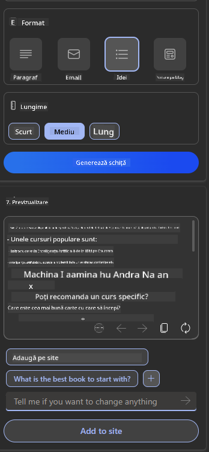

<!--
CO_OP_TRANSLATOR_METADATA:
{
  "original_hash": "747668e4c53d067369f06e9ec2e6313e",
  "translation_date": "2025-08-26T19:19:03+00:00",
  "source_file": "12-designing-ux-for-ai-applications/README.md",
  "language_code": "ro"
}
-->
# Proiectarea experienței utilizatorului pentru aplicații AI

> _(Apasă pe imaginea de mai sus pentru a vedea videoclipul lecției)_

Experiența utilizatorului este un aspect foarte important în dezvoltarea aplicațiilor. Utilizatorii trebuie să poată folosi aplicația ta eficient pentru a-și îndeplini sarcinile. Eficiența este importantă, dar trebuie să proiectezi aplicațiile astfel încât să poată fi folosite de toată lumea, adică să fie _accesibile_. Acest capitol se concentrează pe această zonă, astfel încât să ajungi să creezi o aplicație pe care oamenii chiar o pot și vor să o folosească.

## Introducere

Experiența utilizatorului reprezintă modul în care o persoană interacționează și folosește un anumit produs sau serviciu, fie că este vorba de un sistem, un instrument sau un design. Când dezvoltăm aplicații AI, dezvoltatorii nu se concentrează doar pe eficiența experienței utilizatorului, ci și pe aspectul etic. În această lecție, discutăm cum să construiești aplicații de Inteligență Artificială (AI) care răspund nevoilor utilizatorilor.

Lecția acoperă următoarele subiecte:

- Introducere în experiența utilizatorului și înțelegerea nevoilor utilizatorilor
- Proiectarea aplicațiilor AI pentru încredere și transparență
- Proiectarea aplicațiilor AI pentru colaborare și feedback

## Obiective de învățare

După această lecție, vei putea:

- Să înțelegi cum să construiești aplicații AI care răspund nevoilor utilizatorilor.
- Să proiectezi aplicații AI care promovează încrederea și colaborarea.

### Cerințe preliminare

Alocă puțin timp să citești mai multe despre [experiența utilizatorului și design thinking.](https://learn.microsoft.com/training/modules/ux-design?WT.mc_id=academic-105485-koreyst)

## Introducere în experiența utilizatorului și înțelegerea nevoilor utilizatorilor

În startup-ul nostru fictiv din domeniul educației, avem doi utilizatori principali: profesori și elevi. Fiecare dintre aceștia are nevoi specifice. Un design centrat pe utilizator pune pe primul loc utilizatorul, asigurându-se că produsele sunt relevante și utile pentru cei cărora le sunt destinate.

Aplicația ar trebui să fie **utilă, fiabilă, accesibilă și plăcută** pentru a oferi o experiență bună utilizatorului.

### Utilitate

A fi util înseamnă ca aplicația să aibă funcționalități care corespund scopului pentru care a fost creată, cum ar fi automatizarea procesului de notare sau generarea de fișe de învățare pentru recapitulare. O aplicație care automatizează notarea ar trebui să poată atribui corect și eficient punctaje lucrărilor elevilor, pe baza unor criterii prestabilite. La fel, o aplicație care generează fișe de recapitulare ar trebui să poată crea întrebări relevante și variate, pe baza datelor disponibile.

### Fiabilitate

A fi fiabil înseamnă ca aplicația să își îndeplinească sarcinile constant și fără erori. Totuși, AI, la fel ca oamenii, nu este perfectă și poate greși. Aplicațiile pot întâmpina erori sau situații neașteptate care necesită intervenție sau corectare umană. Cum gestionezi erorile? În ultima parte a acestei lecții, vom discuta cum sistemele și aplicațiile AI sunt proiectate pentru colaborare și feedback.

### Accesibilitate

A fi accesibil înseamnă să extinzi experiența utilizatorului către persoane cu diverse abilități, inclusiv cele cu dizabilități, astfel încât nimeni să nu fie exclus. Respectând principiile și ghidurile de accesibilitate, soluțiile AI devin mai incluzive, mai ușor de folosit și mai benefice pentru toți utilizatorii.

### Plăcut

A fi plăcut înseamnă ca aplicația să fie agreabilă la utilizare. O experiență atractivă poate avea un impact pozitiv asupra utilizatorului, determinându-l să revină la aplicație și să crească veniturile afacerii.

Nu orice provocare poate fi rezolvată cu AI. AI vine să îmbunătățească experiența utilizatorului, fie că automatizează sarcini manuale, fie că personalizează experiențele utilizatorilor.

## Proiectarea aplicațiilor AI pentru încredere și transparență

Construirea încrederii este esențială când proiectezi aplicații AI. Încrederea îi oferă utilizatorului siguranța că aplicația va rezolva sarcina, va livra rezultate constant și că rezultatele sunt cele de care are nevoie. Un risc aici este lipsa de încredere sau încrederea excesivă. Lipsa de încredere apare când utilizatorul nu are încredere în sistemul AI, ceea ce duce la respingerea aplicației. Încrederea excesivă apare când utilizatorul supraestimează capacitățile sistemului AI, ajungând să se bazeze prea mult pe acesta. De exemplu, un sistem automatizat de notare, în cazul încrederii excesive, poate determina profesorul să nu mai verifice unele lucrări pentru a se asigura că sistemul funcționează corect. Acest lucru poate duce la note incorecte sau nedrepte pentru elevi, sau la pierderea unor oportunități de feedback și îmbunătățire.

Două modalități de a pune încrederea în centrul designului sunt explicabilitatea și controlul.

### Explicabilitate

Când AI ajută la luarea deciziilor, cum ar fi transmiterea cunoștințelor către generațiile viitoare, este esențial ca profesorii și părinții să înțeleagă cum sunt luate deciziile de către AI. Aceasta este explicabilitatea – înțelegerea modului în care aplicațiile AI iau decizii. Proiectarea pentru explicabilitate presupune adăugarea de detalii care evidențiază modul în care AI a ajuns la un anumit rezultat. Publicul trebuie să știe că rezultatul este generat de AI, nu de un om. De exemplu, în loc să spui „Începe să discuți cu tutorul tău acum”, poți spune „Folosește tutorul AI care se adaptează nevoilor tale și te ajută să înveți în ritmul tău.”

Un alt exemplu este modul în care AI folosește datele personale ale utilizatorului. De exemplu, un utilizator cu rol de elev poate avea limitări în funcție de acest rol. AI poate să nu ofere direct răspunsuri la întrebări, dar poate ghida utilizatorul să gândească și să găsească soluții.

Un ultim aspect important al explicabilității este simplificarea explicațiilor. Elevii și profesorii nu sunt experți în AI, așa că explicațiile despre ce poate sau nu poate face aplicația trebuie să fie simple și ușor de înțeles.

### Control

AI generativă creează o colaborare între AI și utilizator, unde, de exemplu, utilizatorul poate modifica prompturile pentru rezultate diferite. De asemenea, odată ce un rezultat este generat, utilizatorii ar trebui să poată modifica rezultatul, oferindu-le un sentiment de control. De exemplu, când folosești Bing, poți personaliza promptul în funcție de format, ton și lungime. În plus, poți adăuga modificări la rezultat și să îl ajustezi, așa cum se vede mai jos:

O altă funcție în Bing care permite utilizatorului să controleze aplicația este posibilitatea de a alege dacă dorește sau nu ca AI să folosească anumite date. Pentru o aplicație școlară, un elev ar putea dori să folosească atât notițele proprii, cât și resursele profesorului pentru recapitulare.

> Când proiectezi aplicații AI, intenționalitatea este esențială pentru a te asigura că utilizatorii nu au încredere excesivă și nu își fac așteptări nerealiste despre capabilitățile AI. O modalitate de a face acest lucru este să creezi o „fricțiune” între prompturi și rezultate. Reamintește utilizatorului că acesta este AI, nu o altă persoană.

## Proiectarea aplicațiilor AI pentru colaborare și feedback

După cum am menționat anterior, AI generativă creează o colaborare între utilizator și AI. De cele mai multe ori, interacțiunea constă în introducerea unui prompt de către utilizator și generarea unui rezultat de către AI. Dar dacă rezultatul este greșit? Cum gestionează aplicația erorile care apar? AI dă vina pe utilizator sau explică eroarea?

Aplicațiile AI ar trebui să fie construite astfel încât să poată primi și oferi feedback. Acest lucru nu doar ajută sistemul AI să se îmbunătățească, ci și construiește încredere cu utilizatorii. Un circuit de feedback ar trebui inclus în design, de exemplu, un simplu buton de „thumbs up” sau „thumbs down” pe rezultat.

O altă modalitate de a gestiona acest aspect este să comunici clar capabilitățile și limitările sistemului. Când un utilizator face o greșeală cerând ceva dincolo de capabilitățile AI, ar trebui să existe o modalitate de a gestiona această situație, așa cum se vede mai jos.

Erorile de sistem sunt frecvente în aplicații, unde utilizatorul poate avea nevoie de informații dincolo de ce poate AI sau aplicația poate avea o limită privind numărul de întrebări/subiecte pentru care se pot genera rezumate. De exemplu, o aplicație AI antrenată doar cu date din istorie și matematică nu va putea răspunde la întrebări despre geografie. Pentru a gestiona această situație, sistemul AI poate răspunde cu: „Ne pare rău, produsul nostru a fost antrenat cu date din următoarele materii..., nu pot răspunde la întrebarea ta.”

Aplicațiile AI nu sunt perfecte, deci vor face greșeli. Când îți proiectezi aplicațiile, asigură-te că lași loc pentru feedback din partea utilizatorilor și pentru gestionarea erorilor într-un mod simplu și ușor de explicat.

## Temă

Ia orice aplicație AI pe care ai construit-o până acum și încearcă să implementezi pașii de mai jos:

- **Plăcut:** Gândește-te cum poți face aplicația mai plăcută. Adaugi explicații peste tot? Încurajezi utilizatorul să exploreze? Cum formulezi mesajele de eroare?

- **Utilitate:** Dacă construiești o aplicație web, asigură-te că poate fi navigată atât cu mouse-ul, cât și cu tastatura.

- **Încredere și transparență:** Nu te baza complet pe AI și pe rezultatele sale, gândește-te cum ai putea adăuga o verificare umană a rezultatelor. De asemenea, caută și implementează alte modalități de a obține încredere și transparență.

- **Control:** Oferă utilizatorului control asupra datelor pe care le furnizează aplicației. Implementează o modalitate prin care utilizatorul poate alege să participe sau nu la colectarea datelor în aplicația AI.

## Continuă să înveți!

După ce ai terminat această lecție, explorează [colecția noastră de învățare Generative AI](https://aka.ms/genai-collection?WT.mc_id=academic-105485-koreyst) pentru a-ți dezvolta cunoștințele despre Generative AI!

Treci la Lecția 13, unde vom vedea cum [să securizăm aplicațiile AI](../13-securing-ai-applications/README.md?WT.mc_id=academic-105485-koreyst)!

---

**Declarație de responsabilitate**:
Acest document a fost tradus folosind serviciul de traducere AI [Co-op Translator](https://github.com/Azure/co-op-translator). Deși ne străduim să asigurăm acuratețea, vă rugăm să rețineți că traducerile automate pot conține erori sau inexactități. Documentul original, în limba sa nativă, trebuie considerat sursa autoritară. Pentru informații critice, se recomandă traducerea profesională realizată de oameni. Nu ne asumăm răspunderea pentru eventuale neînțelegeri sau interpretări greșite care pot apărea din utilizarea acestei traduceri.