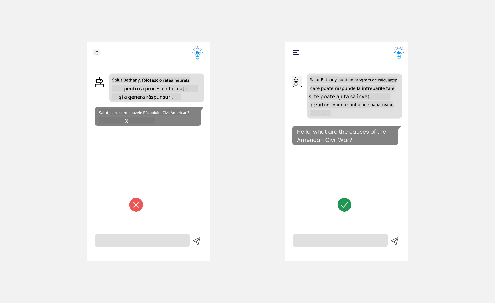
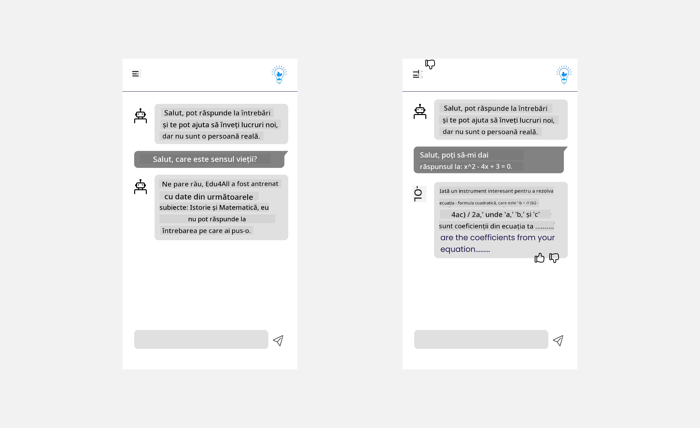

<!--
CO_OP_TRANSLATOR_METADATA:
{
  "original_hash": "78bbeed50fd4dc9fdee931f5daf98cb3",
  "translation_date": "2025-10-17T22:04:20+00:00",
  "source_file": "12-designing-ux-for-ai-applications/README.md",
  "language_code": "ro"
}
-->
# Proiectarea UX pentru aplicații AI

> _(Click pe imaginea de mai sus pentru a viziona videoclipul acestei lecții)_

Experiența utilizatorului este un aspect foarte important în construirea aplicațiilor. Utilizatorii trebuie să poată folosi aplicația într-un mod eficient pentru a îndeplini sarcini. Eficiența este un lucru, dar trebuie să proiectați aplicații astfel încât să poată fi utilizate de toată lumea, făcându-le _accesibile_. Acest capitol se va concentra pe acest domeniu, astfel încât să ajungeți să proiectați o aplicație pe care oamenii pot și doresc să o folosească.

## Introducere

Experiența utilizatorului reprezintă modul în care un utilizator interacționează cu și utilizează un produs sau serviciu specific, fie că este un sistem, un instrument sau un design. Când dezvoltați aplicații AI, dezvoltatorii nu se concentrează doar pe asigurarea unei experiențe eficiente, ci și etice. În această lecție, vom aborda modul de construire a aplicațiilor de Inteligență Artificială (AI) care răspund nevoilor utilizatorilor.

Lecția va acoperi următoarele domenii:

- Introducere în experiența utilizatorului și înțelegerea nevoilor utilizatorilor
- Proiectarea aplicațiilor AI pentru încredere și transparență
- Proiectarea aplicațiilor AI pentru colaborare și feedback

## Obiective de învățare

După parcurgerea acestei lecții, veți putea:

- Înțelege cum să construiți aplicații AI care să răspundă nevoilor utilizatorilor.
- Proiecta aplicații AI care promovează încrederea și colaborarea.

### Cerințe preliminare

Alocați timp pentru a citi mai multe despre [experiența utilizatorului și gândirea de design.](https://learn.microsoft.com/training/modules/ux-design?WT.mc_id=academic-105485-koreyst)

## Introducere în experiența utilizatorului și înțelegerea nevoilor utilizatorilor

În startup-ul nostru fictiv din domeniul educației, avem doi utilizatori principali, profesori și elevi. Fiecare dintre cei doi utilizatori are nevoi unice. Un design centrat pe utilizator prioritizează utilizatorul, asigurându-se că produsele sunt relevante și benefice pentru cei cărora le sunt destinate.

Aplicația ar trebui să fie **utilă, fiabilă, accesibilă și plăcută** pentru a oferi o experiență bună utilizatorului.

### Utilitate

A fi util înseamnă că aplicația are funcționalități care se potrivesc scopului său, cum ar fi automatizarea procesului de notare sau generarea de fișe de revizuire. O aplicație care automatizează procesul de notare ar trebui să poată atribui cu acuratețe și eficiență punctaje lucrărilor elevilor pe baza unor criterii predefinite. În mod similar, o aplicație care generează fișe de revizuire ar trebui să poată crea întrebări relevante și diverse pe baza datelor sale.

### Fiabilitate

A fi fiabil înseamnă că aplicația poate îndeplini sarcinile în mod constant și fără erori. Totuși, AI, la fel ca oamenii, nu este perfectă și poate fi predispusă la erori. Aplicațiile pot întâmpina erori sau situații neașteptate care necesită intervenția sau corectarea umană. Cum gestionați erorile? În ultima secțiune a acestei lecții, vom aborda modul în care sistemele și aplicațiile AI sunt proiectate pentru colaborare și feedback.

### Accesibilitate

A fi accesibil înseamnă extinderea experienței utilizatorului la utilizatori cu diverse abilități, inclusiv cei cu dizabilități, asigurându-se că nimeni nu este exclus. Urmând ghidurile și principiile de accesibilitate, soluțiile AI devin mai incluzive, utilizabile și benefice pentru toți utilizatorii.

### Plăcut

A fi plăcut înseamnă că aplicația este agreabilă de utilizat. O experiență atractivă pentru utilizator poate avea un impact pozitiv asupra acestuia, încurajându-l să revină la aplicație și crescând veniturile afacerii.

Nu fiecare provocare poate fi rezolvată cu AI. AI vine să îmbunătățească experiența utilizatorului, fie că este vorba de automatizarea sarcinilor manuale sau personalizarea experiențelor utilizatorului.

## Proiectarea aplicațiilor AI pentru încredere și transparență

Construirea încrederii este esențială atunci când proiectăm aplicații AI. Încrederea asigură că un utilizator este convins că aplicația va îndeplini sarcinile, va oferi rezultate constant și că rezultatele sunt cele de care utilizatorul are nevoie. Un risc în acest domeniu este neîncrederea și supraîncrederea. Neîncrederea apare atunci când un utilizator are puțină sau deloc încredere într-un sistem AI, ceea ce duce la respingerea aplicației. Supraîncrederea apare atunci când un utilizator supraestimează capacitatea unui sistem AI, ducând la o încredere excesivă în sistemul AI. De exemplu, un sistem automatizat de notare, în cazul supraîncrederii, ar putea determina profesorul să nu mai verifice unele lucrări pentru a se asigura că sistemul de notare funcționează bine. Acest lucru ar putea duce la note incorecte sau nedrepte pentru elevi sau la pierderea oportunităților de feedback și îmbunătățire.

Două moduri de a asigura că încrederea este plasată în centrul designului sunt explicabilitatea și controlul.

### Explicabilitate

Când AI ajută la luarea deciziilor, cum ar fi transmiterea cunoștințelor generațiilor viitoare, este esențial ca profesorii și părinții să înțeleagă cum sunt luate deciziile de către AI. Aceasta este explicabilitatea - înțelegerea modului în care aplicațiile AI iau decizii. Proiectarea pentru explicabilitate include adăugarea de detalii care evidențiază modul în care AI a ajuns la un anumit rezultat. Publicul trebuie să fie conștient că rezultatul este generat de AI și nu de un om. De exemplu, în loc să spuneți "Începeți să discutați acum cu tutorul dvs." spuneți "Folosiți tutorul AI care se adaptează nevoilor dvs. și vă ajută să învățați în ritmul propriu."

Un alt exemplu este modul în care AI utilizează datele utilizatorului și datele personale. De exemplu, un utilizator cu persona elev poate avea limitări bazate pe persona sa. AI poate să nu fie capabil să dezvăluie răspunsuri la întrebări, dar poate ajuta utilizatorul să gândească cum să rezolve o problemă.

Un ultim aspect important al explicabilității este simplificarea explicațiilor. Elevii și profesorii pot să nu fie experți în AI, prin urmare explicațiile despre ceea ce aplicația poate sau nu poate face ar trebui să fie simplificate și ușor de înțeles.

### Control

AI generativ creează o colaborare între AI și utilizator, unde, de exemplu, un utilizator poate modifica solicitările pentru a obține rezultate diferite. În plus, odată ce un rezultat este generat, utilizatorii ar trebui să poată modifica rezultatele, oferindu-le un sentiment de control. De exemplu, atunci când utilizați Bing, puteți ajusta solicitarea în funcție de format, ton și lungime. În plus, puteți adăuga modificări la rezultatul obținut și să-l ajustați, așa cum se arată mai jos:

O altă funcție în Bing care permite utilizatorului să aibă control asupra aplicației este abilitatea de a opta pentru utilizarea sau nu a datelor de către AI. Pentru o aplicație școlară, un elev ar putea dori să folosească notițele sale, precum și resursele profesorului ca material de revizuire.

> Când proiectați aplicații AI, intenționalitatea este esențială pentru a vă asigura că utilizatorii nu supraîncred în AI, stabilind așteptări nerealiste cu privire la capacitățile sale. Un mod de a face acest lucru este prin crearea de fricțiuni între solicitări și rezultate. Reamintind utilizatorului că aceasta este AI și nu un alt om.

## Proiectarea aplicațiilor AI pentru colaborare și feedback

Așa cum am menționat anterior, AI generativ creează o colaborare între utilizator și AI. Majoritatea interacțiunilor implică un utilizator care introduce o solicitare și AI care generează un rezultat. Ce se întâmplă dacă rezultatul este incorect? Cum gestionează aplicația erorile dacă apar? AI învinovățește utilizatorul sau își ia timp să explice eroarea?

Aplicațiile AI ar trebui să fie construite pentru a primi și oferi feedback. Acest lucru nu doar ajută sistemul AI să se îmbunătățească, ci și construiește încredere cu utilizatorii. Un circuit de feedback ar trebui inclus în design, un exemplu poate fi un simplu thumbs up sau thumbs down pe rezultat.

Un alt mod de a gestiona acest lucru este comunicarea clară a capacităților și limitărilor sistemului. Când un utilizator face o eroare solicitând ceva dincolo de capacitățile AI, ar trebui să existe și o modalitate de a gestiona acest lucru, așa cum se arată mai jos.

Erorile de sistem sunt frecvente în aplicații, unde utilizatorul ar putea avea nevoie de asistență cu informații în afara domeniului de aplicare al AI sau aplicația poate avea o limită privind numărul de întrebări/subiecte pentru care utilizatorul poate genera rezumate. De exemplu, o aplicație AI antrenată cu date despre subiecte limitate, cum ar fi Istoria și Matematica, poate să nu fie capabilă să gestioneze întrebări despre Geografie. Pentru a atenua acest lucru, sistemul AI poate oferi un răspuns de genul: "Ne pare rău, produsul nostru a fost antrenat cu date în următoarele subiecte....., nu pot răspunde la întrebarea pe care ați adresat-o."

Aplicațiile AI nu sunt perfecte, prin urmare, sunt susceptibile să facă greșeli. Când proiectați aplicațiile dvs., ar trebui să vă asigurați că creați spațiu pentru feedback de la utilizatori și gestionarea erorilor într-un mod simplu și ușor de explicat.

## Temă

Luați orice aplicații AI pe care le-ați construit până acum și luați în considerare implementarea pașilor de mai jos în aplicația dvs.:

- **Plăcut:** Gândiți-vă cum puteți face aplicația dvs. mai plăcută. Adăugați explicații peste tot? Încurajați utilizatorul să exploreze? Cum formulați mesajele de eroare?

- **Utilitate:** Construirea unei aplicații web. Asigurați-vă că aplicația dvs. este navigabilă atât cu mouse-ul, cât și cu tastatura.

- **Încredere și transparență:** Nu aveți încredere completă în AI și în rezultatele sale, gândiți-vă cum ați putea adăuga un om în proces pentru a verifica rezultatele. De asemenea, luați în considerare și implementați alte modalități de a obține încredere și transparență.

- **Control:** Oferiți utilizatorului control asupra datelor pe care le furnizează aplicației. Implementați o modalitate prin care utilizatorul poate opta pentru colectarea sau necolectarea datelor în aplicația AI.

<!-- ## [Chestionar post-lectură](../../../12-designing-ux-for-ai-applications/quiz-url) -->

## Continuați să învățați!

După ce ați finalizat această lecție, consultați [colecția noastră de învățare despre AI generativ](https://aka.ms/genai-collection?WT.mc_id=academic-105485-koreyst) pentru a continua să vă dezvoltați cunoștințele despre AI generativ!

Accesați Lecția 13, unde vom analiza cum să [securizăm aplicațiile AI](../13-securing-ai-applications/README.md?WT.mc_id=academic-105485-koreyst)!

---

**Declinare de responsabilitate**:  
Acest document a fost tradus folosind serviciul de traducere AI [Co-op Translator](https://github.com/Azure/co-op-translator). Deși ne străduim să asigurăm acuratețea, vă rugăm să fiți conștienți că traducerile automate pot conține erori sau inexactități. Documentul original în limba sa natală ar trebui considerat sursa autoritară. Pentru informații critice, se recomandă traducerea profesională realizată de un specialist uman. Nu ne asumăm responsabilitatea pentru eventualele neînțelegeri sau interpretări greșite care pot apărea din utilizarea acestei traduceri.