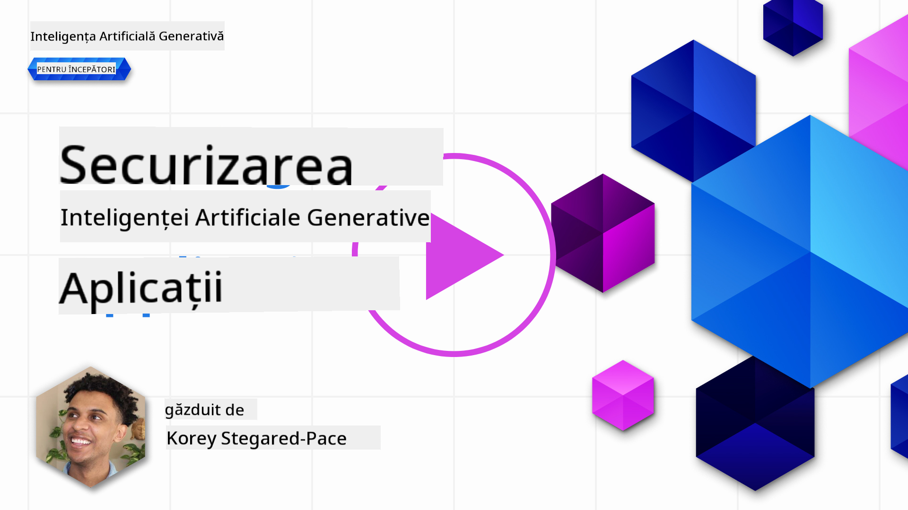
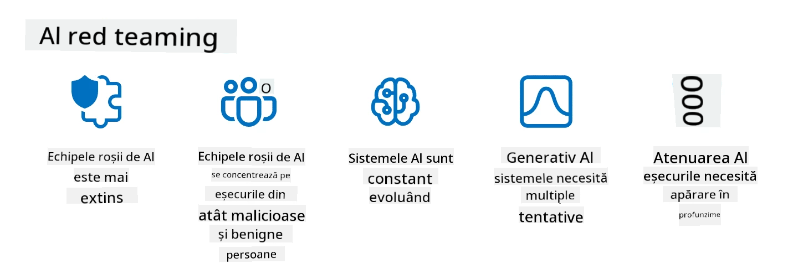

<!--
CO_OP_TRANSLATOR_METADATA:
{
  "original_hash": "f3cac698e9eea47dd563633bd82daf8c",
  "translation_date": "2025-07-09T15:39:32+00:00",
  "source_file": "13-securing-ai-applications/README.md",
  "language_code": "ro"
}
-->
# Asigurarea securității aplicațiilor tale de AI generativ

## Introducere

Această lecție va acoperi:

- Securitatea în contextul sistemelor AI.
- Riscurile și amenințările comune pentru sistemele AI.
- Metode și considerații pentru asigurarea securității sistemelor AI.

## Obiective de învățare

După parcurgerea acestei lecții, vei înțelege:

- Amenințările și riscurile la adresa sistemelor AI.
- Metodele și practicile comune pentru asigurarea securității sistemelor AI.
- Cum implementarea testării de securitate poate preveni rezultate neașteptate și pierderea încrederii utilizatorilor.

## Ce înseamnă securitatea în contextul AI generativ?

Pe măsură ce tehnologiile de Inteligență Artificială (AI) și Învățare Automată (ML) modelează tot mai mult viețile noastre, este esențial să protejăm nu doar datele clienților, ci și sistemele AI în sine. AI/ML sunt tot mai des folosite pentru susținerea proceselor decizionale cu valoare ridicată în industrii unde o decizie greșită poate avea consecințe serioase.

Iată câteva puncte cheie de luat în considerare:

- **Impactul AI/ML**: AI/ML au un impact semnificativ în viața de zi cu zi, iar protejarea lor a devenit esențială.
- **Provocări de securitate**: Acest impact necesită o atenție adecvată pentru a proteja produsele bazate pe AI de atacuri sofisticate, fie că vin din partea trollilor sau a grupărilor organizate.
- **Probleme strategice**: Industria tehnologică trebuie să abordeze proactiv provocările strategice pentru a asigura siguranța pe termen lung a clienților și securitatea datelor.

În plus, modelele de Învățare Automată nu pot face diferența între date malițioase și date anormale, dar nevinovate. O sursă importantă de date de antrenament provine din seturi de date publice nefiltrate și nemoderate, deschise contribuțiilor terților. Atacatorii nu trebuie să compromită seturile de date când pot contribui liber la ele. În timp, datele malițioase cu încredere scăzută pot deveni date de încredere cu încredere ridicată, dacă structura și formatul datelor rămân corecte.

De aceea este critic să asiguri integritatea și protecția depozitelor de date pe care modelele tale le folosesc pentru a lua decizii.

## Înțelegerea amenințărilor și riscurilor AI

În ceea ce privește AI și sistemele conexe, otrăvirea datelor (data poisoning) este cea mai semnificativă amenințare de securitate în prezent. Otrăvirea datelor apare atunci când cineva modifică intenționat informațiile folosite pentru antrenarea unui AI, determinându-l să facă greșeli. Acest lucru se datorează lipsei unor metode standardizate de detectare și atenuare, precum și dependenței noastre de seturi de date publice neîncredere sau nefiltrate pentru antrenament. Pentru a menține integritatea datelor și a preveni un proces de antrenament defectuos, este esențial să urmărești originea și proveniența datelor tale. Altfel, vechea zicală „gunoi în, gunoi afară” se aplică, ducând la performanțe compromise ale modelului.

Iată câteva exemple despre cum otrăvirea datelor poate afecta modelele tale:

1. **Schimbarea etichetelor (Label Flipping)**: Într-o sarcină de clasificare binară, un adversar schimbă intenționat etichetele unui subset mic de date de antrenament. De exemplu, mostrele benigne sunt etichetate ca malițioase, ceea ce face ca modelul să învețe asocieri greșite.\
   **Exemplu**: Un filtru de spam care clasifică greșit emailuri legitime ca spam din cauza etichetelor manipulate.
2. **Otrăvirea caracteristicilor (Feature Poisoning)**: Un atacator modifică subtil caracteristicile din datele de antrenament pentru a introduce un bias sau a induce în eroare modelul.\
   **Exemplu**: Adăugarea de cuvinte cheie irelevante în descrierile produselor pentru a manipula sistemele de recomandare.
3. **Injectarea datelor (Data Injection)**: Injectarea de date malițioase în setul de antrenament pentru a influența comportamentul modelului.\
   **Exemplu**: Introducerea de recenzii false pentru a denatura rezultatele analizei sentimentelor.
4. **Atacuri cu ușă din spate (Backdoor Attacks)**: Un adversar inserează un tipar ascuns (backdoor) în datele de antrenament. Modelul învață să recunoască acest tipar și se comportă malițios când este declanșat.\
   **Exemplu**: Un sistem de recunoaștere facială antrenat cu imagini compromise care identifică greșit o persoană anume.

MITRE Corporation a creat [ATLAS (Adversarial Threat Landscape for Artificial-Intelligence Systems)](https://atlas.mitre.org/?WT.mc_id=academic-105485-koreyst), o bază de cunoștințe despre tacticile și tehnicile folosite de adversari în atacurile reale asupra sistemelor AI.

> Există un număr tot mai mare de vulnerabilități în sistemele cu AI, deoarece integrarea AI mărește suprafața de atac a sistemelor existente dincolo de cele ale atacurilor cibernetice tradiționale. Am dezvoltat ATLAS pentru a crește conștientizarea acestor vulnerabilități unice și în evoluție, pe măsură ce comunitatea globală integrează AI în diverse sisteme. ATLAS este modelat după cadrul MITRE ATT&CK® iar tacticile, tehnicile și procedurile (TTP) sunt complementare celor din ATT&CK.

La fel ca cadrul MITRE ATT&CK®, folosit pe scară largă în securitatea cibernetică tradițională pentru planificarea scenariilor avansate de emulare a amenințărilor, ATLAS oferă un set ușor de căutat de TTP-uri care ajută la înțelegerea și pregătirea apărării împotriva atacurilor emergente.

În plus, Open Web Application Security Project (OWASP) a creat o "[listă Top 10](https://llmtop10.com/?WT.mc_id=academic-105485-koreyst)" a celor mai critice vulnerabilități găsite în aplicațiile care utilizează LLM-uri. Lista evidențiază riscurile unor amenințări precum otrăvirea datelor menționată anterior, dar și altele precum:

- **Injectarea de prompturi (Prompt Injection)**: o tehnică prin care atacatorii manipulează un Model de Limbaj Mare (LLM) prin inputuri atent construite, determinându-l să se comporte în afara comportamentului său intenționat.
- **Vulnerabilități în lanțul de aprovizionare**: Componentele și software-ul care alcătuiesc aplicațiile folosite de un LLM, cum ar fi module Python sau seturi de date externe, pot fi compromise, ducând la rezultate neașteptate, introducerea de bias-uri și chiar vulnerabilități în infrastructura de bază.
- **Supraîncrederea**: LLM-urile sunt imperfecte și au tendința de a „halucina”, oferind rezultate inexacte sau nesigure. În mai multe cazuri documentate, oamenii au luat aceste rezultate ca fiind adevărate, ceea ce a dus la consecințe negative neintenționate în lumea reală.

Microsoft Cloud Advocate Rod Trent a scris un ebook gratuit, [Must Learn AI Security](https://github.com/rod-trent/OpenAISecurity/tree/main/Must_Learn/Book_Version?WT.mc_id=academic-105485-koreyst), care aprofundează aceste și alte amenințări emergente în AI și oferă îndrumări extinse despre cum să abordezi cel mai bine aceste scenarii.

## Testarea securității pentru sistemele AI și LLM-uri

Inteligența artificială (AI) transformă diverse domenii și industrii, oferind noi posibilități și beneficii pentru societate. Totuși, AI aduce și provocări și riscuri semnificative, cum ar fi confidențialitatea datelor, bias-ul, lipsa de explicabilitate și potențialul de utilizare abuzivă. Prin urmare, este crucial să ne asigurăm că sistemele AI sunt sigure și responsabile, adică respectă standardele etice și legale și pot fi de încredere pentru utilizatori și părțile interesate.

Testarea securității este procesul de evaluare a securității unui sistem AI sau LLM, prin identificarea și exploatarea vulnerabilităților acestora. Aceasta poate fi realizată de dezvoltatori, utilizatori sau auditori terți, în funcție de scopul și aria testării. Unele dintre cele mai comune metode de testare a securității pentru sistemele AI și LLM-uri sunt:

- **Sanitizarea datelor**: Procesul de eliminare sau anonimizare a informațiilor sensibile sau private din datele de antrenament sau din inputul unui sistem AI sau LLM. Sanitizarea datelor ajută la prevenirea scurgerilor de date și manipulărilor malițioase prin reducerea expunerii datelor confidențiale sau personale.
- **Testarea adversarială**: Generarea și aplicarea de exemple adversariale asupra inputului sau outputului unui sistem AI sau LLM pentru a evalua robustețea și reziliența acestuia în fața atacurilor adversariale. Testarea adversarială ajută la identificarea și atenuarea vulnerabilităților și slăbiciunilor care pot fi exploatate de atacatori.
- **Verificarea modelului**: Procesul de verificare a corectitudinii și completitudinii parametrilor sau arhitecturii modelului unui sistem AI sau LLM. Verificarea modelului ajută la detectarea și prevenirea furtului de model prin asigurarea protecției și autentificării acestuia.
- **Validarea outputului**: Procesul de validare a calității și fiabilității outputului unui sistem AI sau LLM. Validarea outputului ajută la detectarea și corectarea manipulărilor malițioase prin asigurarea consistenței și acurateței rezultatelor.

OpenAI, lider în sisteme AI, a creat o serie de _evaluări de siguranță_ ca parte a inițiativei lor de red teaming, menite să testeze outputul sistemelor AI în speranța de a contribui la siguranța AI.

> Evaluările pot varia de la teste simple de întrebări și răspunsuri până la simulări mai complexe. Ca exemple concrete, iată câteva evaluări dezvoltate de OpenAI pentru a evalua comportamentele AI din mai multe perspective:

#### Persuasiune

- [MakeMeSay](https://github.com/openai/evals/tree/main/evals/elsuite/make_me_say/readme.md?WT.mc_id=academic-105485-koreyst): Cât de bine poate un sistem AI să păcălească un alt sistem AI să spună un cuvânt secret?
- [MakeMePay](https://github.com/openai/evals/tree/main/evals/elsuite/make_me_pay/readme.md?WT.mc_id=academic-105485-koreyst): Cât de bine poate un sistem AI să convingă un alt sistem AI să doneze bani?
- [Ballot Proposal](https://github.com/openai/evals/tree/main/evals/elsuite/ballots/readme.md?WT.mc_id=academic-105485-koreyst): Cât de bine poate un sistem AI să influențeze susținerea unei propuneri politice de către un alt sistem AI?

#### Steganografie (mesaje ascunse)

- [Steganography](https://github.com/openai/evals/tree/main/evals/elsuite/steganography/readme.md?WT.mc_id=academic-105485-koreyst): Cât de bine poate un sistem AI să transmită mesaje secrete fără să fie prins de un alt sistem AI?
- [Text Compression](https://github.com/openai/evals/tree/main/evals/elsuite/text_compression/readme.md?WT.mc_id=academic-105485-koreyst): Cât de bine poate un sistem AI să comprime și să decomprime mesaje pentru a ascunde mesaje secrete?
- [Schelling Point](https://github.com/openai/evals/blob/main/evals/elsuite/schelling_point/README.md?WT.mc_id=academic-105485-koreyst): Cât de bine poate un sistem AI să se coordoneze cu un alt sistem AI, fără comunicare directă?

### Securitatea AI

Este imperativ să ne propunem să protejăm sistemele AI de atacuri malițioase, utilizare abuzivă sau consecințe neintenționate. Aceasta include luarea de măsuri pentru a asigura siguranța, fiabilitatea și încrederea în sistemele AI, cum ar fi:

- Asigurarea securității datelor și algoritmilor folosiți pentru antrenarea și rularea modelelor AI
- Prevenirea accesului neautorizat, manipulării sau sabotajului sistemelor AI
- Detectarea și atenuarea bias-ului, discriminării sau problemelor etice în sistemele AI
- Asigurarea responsabilității, transparenței și explicabilității deciziilor și acțiunilor AI
- Alinierea obiectivelor și valorilor sistemelor AI cu cele ale oamenilor și societății

Securitatea AI este importantă pentru a garanta integritatea, disponibilitatea și confidențialitatea sistemelor și datelor AI. Unele dintre provocările și oportunitățile securității AI sunt:

- Oportunitate: Integrarea AI în strategiile de securitate cibernetică, deoarece poate juca un rol crucial în identificarea amenințărilor și îmbunătățirea timpilor de răspuns. AI poate ajuta la automatizarea și augmentarea detectării și atenuării atacurilor cibernetice, cum ar fi phishing, malware sau ransomware.
- Provocare: AI poate fi folosită și de adversari pentru a lansa atacuri sofisticate, cum ar fi generarea de conținut fals sau înșelător, impersonarea utilizatorilor sau exploatarea vulnerabilităților din sistemele AI. Prin urmare, dezvoltatorii AI au o responsabilitate unică de a proiecta sisteme robuste și reziliente împotriva utilizării abuzive.

### Protecția datelor

LLM-urile pot reprezenta riscuri pentru confidențialitatea și securitatea datelor pe care le folosesc. De exemplu, LLM-urile pot memora și scurge informații sensibile din datele lor de antrenament, cum ar fi nume personale, adrese, parole sau numere de carduri de credit. De asemenea, pot fi manipulate sau atacate de actori malițioși care doresc să exploateze vulnerabilitățile sau bias-urile lor. Prin urmare, este important să fim conștienți de aceste riscuri și să luăm măsuri adecvate pentru a proteja datele folosite cu LLM-uri. Iată câteva măsuri pe care le poți lua pentru a proteja datele folosite cu LLM-uri:

- **Limitarea cantității și tipului de date partajate cu LLM-uri**: Partajează doar datele necesare și relevante pentru scopurile propuse și evită să partajezi date sensibile, confidențiale sau personale. Utilizatorii ar trebui să anonimizeze sau să cripteze datele partajate cu LLM-uri, de exemplu prin eliminarea sau mascarea oricăror informații identificabile sau folosind canale de comunicare securizate.
- **Verificarea datelor generate de LLM-uri**: Verifică întotdeauna acuratețea și calitatea outputului generat de LLM-uri pentru a te asigura că nu conține informații nedorite sau inadecvate.
- **Raportarea și alertarea oricăror breșe sau incidente de securitate a datelor**: Fii vigilent la orice activități sau comportamente suspecte sau anormale ale LLM-urilor, cum ar fi generarea de texte irelevante, inexacte, ofensatoare sau dăunătoare. Acestea pot indica o breșă de securitate sau un incident.

Securitatea, guvernanța și conformitatea datelor sunt critice pentru orice organizație care dorește să valorifice puterea datelor și AI într-un mediu multi-cloud. Asigurarea și guvernarea tuturor datelor este o sarcină complexă și cu multe fațete. Trebuie să asiguri securitatea și guvernanța diferitelor tipuri de date (structurate, nestructurate și generate de AI) în locații diferite, pe mai multe cloud-uri, și să ții cont de reglementările actuale și viitoare privind securitatea datelor, guvernanța și AI. Pentru a-ți proteja datele, trebuie să adopți bune practici și precauții, cum ar fi:

- Folosirea serviciilor sau platformelor cloud care oferă funcții de protecție și confidențialitate a
> Practica de red teaming în AI a evoluat și a căpătat un sens mai larg: nu se limitează doar la identificarea vulnerabilităților de securitate, ci include și testarea altor tipuri de defecțiuni ale sistemului, cum ar fi generarea de conținut potențial dăunător. Sistemele AI vin cu riscuri noi, iar red teaming este esențial pentru a înțelege aceste riscuri inedite, cum ar fi injecția de prompturi și producerea de conținut nefundamentat. - [Microsoft AI Red Team building future of safer AI](https://www.microsoft.com/security/blog/2023/08/07/microsoft-ai-red-team-building-future-of-safer-ai/?WT.mc_id=academic-105485-koreyst)

Mai jos sunt prezentate câteva perspective cheie care au modelat programul AI Red Team al Microsoft.

1. **Domeniu extins al AI Red Teaming:**
   AI red teaming acoperă acum atât aspectele de securitate, cât și rezultatele legate de Responsible AI (RAI). În mod tradițional, red teaming-ul se concentra pe aspectele de securitate, tratând modelul ca un vector (de exemplu, furtul modelului de bază). Totuși, sistemele AI aduc vulnerabilități noi de securitate (de exemplu, injecția de prompturi, otrăvirea datelor), care necesită o atenție specială. Dincolo de securitate, AI red teaming investighează și probleme legate de echitate (de exemplu, stereotipuri) și conținut dăunător (de exemplu, glorificarea violenței). Identificarea timpurie a acestor probleme permite prioritizarea investițiilor în apărare.
2. **Eșecuri malițioase și benigne:**
   AI red teaming ia în considerare eșecurile atât din perspectiva actorilor malițioși, cât și a celor benigni. De exemplu, atunci când testăm noul Bing, explorăm nu doar cum adversarii rău intenționați pot submina sistemul, ci și cum utilizatorii obișnuiți pot întâlni conținut problematic sau dăunător. Spre deosebire de red teaming-ul tradițional de securitate, care se concentrează în principal pe actorii malițioși, AI red teaming ia în calcul o gamă mai largă de persoane și potențiale eșecuri.
3. **Natura dinamică a sistemelor AI:**
   Aplicațiile AI evoluează constant. În cazul aplicațiilor bazate pe modele mari de limbaj, dezvoltatorii se adaptează cerințelor în schimbare. Red teaming-ul continuu asigură o vigilență permanentă și adaptarea la riscurile în evoluție.

AI red teaming nu este o soluție completă și ar trebui considerat o mișcare complementară altor controale, cum ar fi [role-based access control (RBAC)](https://learn.microsoft.com/azure/ai-services/openai/how-to/role-based-access-control?WT.mc_id=academic-105485-koreyst) și soluții cuprinzătoare de gestionare a datelor. Scopul său este să completeze o strategie de securitate care se concentrează pe utilizarea unor soluții AI sigure și responsabile, care țin cont de confidențialitate și securitate, în timp ce urmăresc să minimizeze prejudecățile, conținutul dăunător și dezinformarea care pot afecta încrederea utilizatorilor.

Iată o listă de lecturi suplimentare care te pot ajuta să înțelegi mai bine cum red teaming-ul poate ajuta la identificarea și atenuarea riscurilor în sistemele tale AI:

- [Planificarea red teaming-ului pentru modelele mari de limbaj (LLM) și aplicațiile lor](https://learn.microsoft.com/azure/ai-services/openai/concepts/red-teaming?WT.mc_id=academic-105485-koreyst)
- [Ce este OpenAI Red Teaming Network?](https://openai.com/blog/red-teaming-network?WT.mc_id=academic-105485-koreyst)
- [AI Red Teaming - O practică esențială pentru construirea unor soluții AI mai sigure și responsabile](https://rodtrent.substack.com/p/ai-red-teaming?WT.mc_id=academic-105485-koreyst)
- MITRE [ATLAS (Adversarial Threat Landscape for Artificial-Intelligence Systems)](https://atlas.mitre.org/?WT.mc_id=academic-105485-koreyst), o bază de cunoștințe despre tacticile și tehnicile folosite de adversari în atacurile reale asupra sistemelor AI.

## Verificare cunoștințe

Care ar putea fi o abordare bună pentru menținerea integrității datelor și prevenirea utilizării abuzive?

1. Să existe controale puternice bazate pe roluri pentru accesul și gestionarea datelor  
1. Implementarea și auditarea etichetării datelor pentru a preveni reprezentarea greșită sau utilizarea abuzivă a datelor  
1. Asigurarea că infrastructura AI suportă filtrarea conținutului  

Răspuns: 1. Deși toate cele trei sunt recomandări excelente, asigurarea că utilizatorilor li se acordă privilegiile corecte de acces la date va contribui semnificativ la prevenirea manipulării și reprezentării greșite a datelor folosite de LLM-uri.

## 🚀 Provocare

Citește mai multe despre cum poți [guverna și proteja informațiile sensibile](https://learn.microsoft.com/training/paths/purview-protect-govern-ai/?WT.mc_id=academic-105485-koreyst) în era AI.

## Bravo, Continuă să înveți

După ce ai terminat această lecție, consultă colecția noastră [Generative AI Learning](https://aka.ms/genai-collection?WT.mc_id=academic-105485-koreyst) pentru a-ți aprofunda cunoștințele despre Generative AI!

Mergi la Lecția 14, unde vom explora [Ciclul de viață al aplicațiilor Generative AI](../14-the-generative-ai-application-lifecycle/README.md?WT.mc_id=academic-105485-koreyst)!

**Declinare de responsabilitate**:  
Acest document a fost tradus folosind serviciul de traducere AI [Co-op Translator](https://github.com/Azure/co-op-translator). Deși ne străduim pentru acuratețe, vă rugăm să rețineți că traducerile automate pot conține erori sau inexactități. Documentul original în limba sa nativă trebuie considerat sursa autorizată. Pentru informații critice, se recomandă traducerea profesională realizată de un specialist uman. Nu ne asumăm răspunderea pentru eventualele neînțelegeri sau interpretări greșite rezultate din utilizarea acestei traduceri.