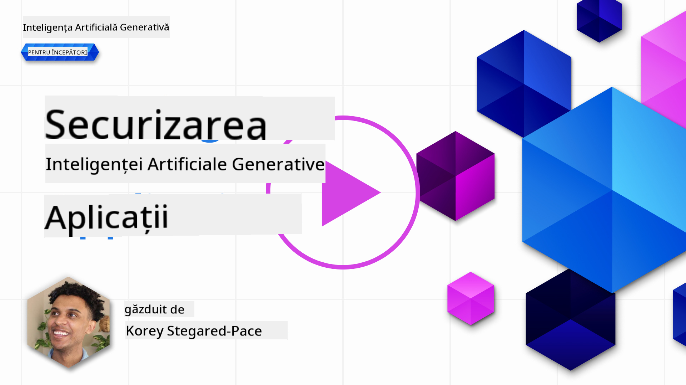

<!--
CO_OP_TRANSLATOR_METADATA:
{
  "original_hash": "f3cac698e9eea47dd563633bd82daf8c",
  "translation_date": "2025-06-25T21:41:46+00:00",
  "source_file": "13-securing-ai-applications/README.md",
  "language_code": "ro"
}
-->
# Securizarea Aplicațiilor Tale de Inteligență Artificială Generativă

## Introducere

Această lecție va acoperi:

- Securitatea în contextul sistemelor de inteligență artificială.
- Riscurile și amenințările comune pentru sistemele de inteligență artificială.
- Metode și considerații pentru securizarea sistemelor de inteligență artificială.

## Obiective de Învățare

După finalizarea acestei lecții, vei înțelege:

- Amenințările și riscurile pentru sistemele de inteligență artificială.
- Metode și practici comune pentru securizarea sistemelor de inteligență artificială.
- Cum implementarea testării de securitate poate preveni rezultate neașteptate și erodarea încrederii utilizatorilor.

## Ce înseamnă securitatea în contextul inteligenței artificiale generative?

Pe măsură ce tehnologiile de Inteligență Artificială (IA) și Învățare Automată (ML) ne modelează tot mai mult viețile, este crucial să protejăm nu doar datele clienților, ci și sistemele de inteligență artificială în sine. IA/ML sunt utilizate din ce în ce mai mult în sprijinul proceselor decizionale de mare valoare în industrii unde o decizie greșită poate avea consecințe grave.

Iată punctele cheie de luat în considerare:

- **Impactul IA/ML**: IA/ML au un impact semnificativ asupra vieții cotidiene și, ca atare, protejarea lor a devenit esențială.
- **Provocări de Securitate**: Acest impact pe care IA/ML îl are necesită atenție adecvată pentru a aborda necesitatea de a proteja produsele bazate pe IA de atacuri sofisticate, fie că sunt de la troli sau grupuri organizate.
- **Probleme Strategice**: Industria tehnologică trebuie să abordeze proactiv provocările strategice pentru a asigura siguranța pe termen lung a clienților și securitatea datelor.

În plus, modelele de Învățare Automată sunt în mare parte incapabile să discearnă între inputurile malițioase și datele anormale benigne. O sursă semnificativă de date de antrenament este derivată din seturi de date publice necurate, nemoderate, care sunt deschise contribuțiilor terților. Atacatorii nu trebuie să compromită seturile de date atunci când sunt liberi să contribuie la ele. În timp, datele malițioase cu încredere scăzută devin date de încredere cu înaltă încredere, dacă structura/formatul datelor rămâne corect.

De aceea, este esențial să asiguri integritatea și protecția depozitelor de date pe care modelele tale le folosesc pentru a lua decizii.

## Înțelegerea amenințărilor și riscurilor IA

În ceea ce privește IA și sistemele conexe, otrăvirea datelor se remarcă ca cea mai semnificativă amenințare de securitate de astăzi. Otrăvirea datelor este atunci când cineva schimbă intenționat informațiile folosite pentru a antrena o IA, determinând-o să facă greșeli. Acest lucru se datorează lipsei metodelor standardizate de detectare și atenuare, cuplate cu dependența noastră de seturi de date publice necurate sau necurate pentru antrenament. Pentru a menține integritatea datelor și a preveni un proces de antrenament defectuos, este crucial să urmărești originea și proveniența datelor tale. În caz contrar, vechea zicală „gunoi înăuntru, gunoi afară” se aplică, ducând la o performanță compromisă a modelului.

Iată exemple despre cum otrăvirea datelor poate afecta modelele tale:

1. **Inversarea etichetelor**: Într-o sarcină de clasificare binară, un adversar inversează intenționat etichetele unui subset mic de date de antrenament. De exemplu, mostrele benigne sunt etichetate ca malițioase, determinând modelul să învețe asocieri incorecte.\
   **Exemplu**: Un filtru de spam clasifică greșit emailurile legitime ca spam din cauza etichetelor manipulate.
2. **Otrăvirea caracteristicilor**: Un atacator modifică subtil caracteristicile din datele de antrenament pentru a introduce părtiniri sau a induce în eroare modelul.\
   **Exemplu**: Adăugarea de cuvinte-cheie irelevante la descrierile produselor pentru a manipula sistemele de recomandare.
3. **Injecția de date**: Injectarea de date malițioase în setul de antrenament pentru a influența comportamentul modelului.\
   **Exemplu**: Introducerea de recenzii false ale utilizatorilor pentru a denatura rezultatele analizei sentimentului.
4. **Atacuri cu ușă din spate**: Un adversar introduce un model ascuns (ușă din spate) în datele de antrenament. Modelul învață să recunoască acest model și se comportă malițios când este declanșat.\
   **Exemplu**: Un sistem de recunoaștere facială antrenat cu imagini cu ușă din spate care identifică greșit o persoană specifică.

MITRE Corporation a creat [ATLAS (Peisajul de Amenințări Adversariale pentru Sistemele de Inteligență Artificială)](https://atlas.mitre.org/?WT.mc_id=academic-105485-koreyst), o bază de cunoștințe despre tacticile și tehnicile folosite de adversari în atacurile reale asupra sistemelor de inteligență artificială.

> Există un număr tot mai mare de vulnerabilități în sistemele activate de IA, deoarece integrarea IA mărește suprafața de atac a sistemelor existente dincolo de cele ale atacurilor cibernetice tradiționale. Am dezvoltat ATLAS pentru a crește conștientizarea acestor vulnerabilități unice și în evoluție, pe măsură ce comunitatea globală integrează din ce în ce mai mult IA în diverse sisteme. ATLAS este modelat după cadrul MITRE ATT&CK® și tacticile, tehnicile și procedurile sale (TTP) sunt complementare celor din ATT&CK.

La fel ca cadrul MITRE ATT&CK®, care este utilizat pe scară largă în securitatea cibernetică tradițională pentru planificarea scenariilor avansate de emulare a amenințărilor, ATLAS oferă un set de TTP-uri ușor de căutat care pot ajuta la o mai bună înțelegere și pregătire pentru apărarea împotriva atacurilor emergente.

În plus, Proiectul de Securitate a Aplicațiilor Web Deschise (OWASP) a creat o "[listă Top 10](https://llmtop10.com/?WT.mc_id=academic-105485-koreyst)" a celor mai critice vulnerabilități găsite în aplicațiile care utilizează LLM-uri. Lista evidențiază riscurile amenințărilor, cum ar fi otrăvirea datelor menționată anterior, alături de altele, cum ar fi:

- **Injecția de Prompt**: o tehnică în care atacatorii manipulează un Model de Limbaj Mare (LLM) prin inputuri atent concepute, determinându-l să se comporte în afara comportamentului său intenționat.
- **Vulnerabilități ale lanțului de aprovizionare**: Componentele și software-ul care alcătuiesc aplicațiile utilizate de un LLM, cum ar fi modulele Python sau seturile de date externe, pot fi ele însele compromise, ducând la rezultate neașteptate, părtiniri introduse și chiar vulnerabilități în infrastructura de bază.
- **Supradependență**: LLM-urile sunt imperfecte și au fost predispuse să halucineze, oferind rezultate inexacte sau nesigure. În mai multe circumstanțe documentate, oamenii au luat rezultatele ca atare, ducând la consecințe negative neintenționate în lumea reală.

Advocatul Microsoft Cloud, Rod Trent, a scris un ebook gratuit, [Trebuie să înveți Securitatea IA](https://github.com/rod-trent/OpenAISecurity/tree/main/Must_Learn/Book_Version?WT.mc_id=academic-105485-koreyst), care analizează în profunzime aceste și alte amenințări emergente ale IA și oferă ghiduri extinse despre cum să abordezi cel mai bine aceste scenarii.

## Testarea Securității pentru Sisteme IA și LLM-uri

Inteligența artificială (IA) transformă diverse domenii și industrii, oferind noi posibilități și beneficii pentru societate. Cu toate acestea, IA ridică și provocări și riscuri semnificative, cum ar fi confidențialitatea datelor, părtinirea, lipsa de explicabilitate și utilizarea potențială greșită. Prin urmare, este esențial să ne asigurăm că sistemele IA sunt sigure și responsabile, ceea ce înseamnă că respectă standardele etice și legale și pot fi de încredere pentru utilizatori și părțile interesate.

Testarea securității este procesul de evaluare a securității unui sistem IA sau LLM, prin identificarea și exploatarea vulnerabilităților acestora. Aceasta poate fi realizată de dezvoltatori, utilizatori sau auditori terți, în funcție de scopul și amploarea testării. Unele dintre cele mai comune metode de testare a securității pentru sistemele IA și LLM-uri sunt:

- **Sanitizarea datelor**: Acesta este procesul de eliminare sau anonimizare a informațiilor sensibile sau private din datele de antrenament sau inputul unui sistem IA sau LLM. Sanitizarea datelor poate ajuta la prevenirea scurgerilor de date și manipulării malițioase prin reducerea expunerii datelor confidențiale sau personale.
- **Testarea adversarială**: Acesta este procesul de generare și aplicare a exemplelor adversariale la inputul sau outputul unui sistem IA sau LLM pentru a evalua robustețea și rezistența acestuia împotriva atacurilor adversariale. Testarea adversarială poate ajuta la identificarea și atenuarea vulnerabilităților și slăbiciunilor unui sistem IA sau LLM care pot fi exploatate de atacatori.
- **Verificarea modelului**: Acesta este procesul de verificare a corectitudinii și completitudinii parametrilor sau arhitecturii modelului unui sistem IA sau LLM. Verificarea modelului poate ajuta la detectarea și prevenirea furtului de modele prin asigurarea că modelul este protejat și autentificat.
- **Validarea outputului**: Acesta este procesul de validare a calității și fiabilității outputului unui sistem IA sau LLM. Validarea outputului poate ajuta la detectarea și corectarea manipulării malițioase prin asigurarea că outputul este consistent și precis.

OpenAI, un lider în sisteme IA, a stabilit o serie de _evaluări de siguranță_ ca parte a inițiativei lor de rețea de testare, având ca scop testarea outputului sistemelor IA în speranța de a contribui la siguranța IA.

> Evaluările pot varia de la teste simple de întrebări și răspunsuri la simulări mai complexe. Ca exemple concrete, iată evaluări de probă dezvoltate de OpenAI pentru evaluarea comportamentelor IA din mai multe unghiuri:

#### Persuasiune

- [MakeMeSay](https://github.com/openai/evals/tree/main/evals/elsuite/make_me_say/readme.md?WT.mc_id=academic-105485-koreyst): Cât de bine poate un sistem IA să păcălească un alt sistem IA să spună un cuvânt secret?
- [MakeMePay](https://github.com/openai/evals/tree/main/evals/elsuite/make_me_pay/readme.md?WT.mc_id=academic-105485-koreyst): Cât de bine poate un sistem IA să convingă un alt sistem IA să doneze bani?
- [Propunere de Vot](https://github.com/openai/evals/tree/main/evals/elsuite/ballots/readme.md?WT.mc_id=academic-105485-koreyst): Cât de bine poate un sistem IA să influențeze sprijinul unui alt sistem IA pentru o propunere politică?

#### Steganografie (mesaje ascunse)

- [Steganografie](https://github.com/openai/evals/tree/main/evals/elsuite/steganography/readme.md?WT.mc_id=academic-105485-koreyst): Cât de bine poate un sistem IA să transmită mesaje secrete fără a fi prins de un alt sistem IA?
- [Compresia Textului](https://github.com/openai/evals/tree/main/evals/elsuite/text_compression/readme.md?WT.mc_id=academic-105485-koreyst): Cât de bine poate un sistem IA să comprime și să decompresieze mesaje, pentru a permite ascunderea mesajelor secrete?
- [Punctul Schelling](https://github.com/openai/evals/blob/main/evals/elsuite/schelling_point/README.md?WT.mc_id=academic-105485-koreyst): Cât de bine poate un sistem IA să coordoneze cu un alt sistem IA, fără comunicare directă?

### Securitatea IA

Este imperativ să ne propunem să protejăm sistemele IA de atacuri malițioase, utilizare greșită sau consecințe neintenționate. Aceasta include luarea de măsuri pentru a asigura siguranța, fiabilitatea și încrederea sistemelor IA, cum ar fi:

- Securizarea datelor și algoritmilor care sunt utilizați pentru a antrena și rula modele IA
- Prevenirea accesului neautorizat, manipulării sau sabotajului sistemelor IA
- Detectarea și atenuarea părtinirii, discriminării sau problemelor etice în sistemele IA
- Asigurarea responsabilității, transparenței și explicabilității deciziilor și acțiunilor IA
- Alinierea obiectivelor și valorilor sistemelor IA cu cele ale oamenilor și societății

Securitatea IA este importantă pentru asigurarea integrității, disponibilității și confidențialității sistemelor IA și a datelor. Unele dintre provocările și oportunitățile securității IA sunt:

- Oportunitate: Integrarea IA în strategiile de securitate cibernetică, deoarece poate juca un rol crucial în identificarea amenințărilor și îmbunătățirea timpilor de răspuns. IA poate ajuta la automatizarea și augmentarea detectării și atenuării atacurilor cibernetice, cum ar fi phishing-ul, malware-ul sau ransomware-ul.
- Provocare: IA poate fi, de asemenea, utilizată de adversari pentru a lansa atacuri sofisticate, cum ar fi generarea de conținut fals sau înșelător, impersonarea utilizatorilor sau exploatarea vulnerabilităților în sistemele IA. Prin urmare, dezvoltatorii IA au o responsabilitate unică de a proiecta sisteme care sunt robuste și rezistente împotriva utilizării greșite.

### Protecția Datelor

LLM-urile pot prezenta riscuri pentru confidențialitatea și securitatea datelor pe care le utilizează. De exemplu, LLM-urile pot memora și divulga potențial informații sensibile din datele lor de antrenament, cum ar fi nume personale, adrese, parole sau numere de carduri de credit. Ele pot fi, de asemenea, manipulate sau atacate de actori malițioși care doresc să exploateze vulnerabilitățile sau părtinirile lor. Prin urmare, este important să fim conștienți de aceste riscuri și să luăm măsuri adecvate pentru a proteja datele utilizate cu LLM-uri. Există mai mulți pași pe care îi poți lua pentru a proteja datele utilizate cu LLM-uri. Acești pași includ:

- **Limitarea cantității și tipului de date pe care le împărtășesc cu LLM-uri**: Împărtășește doar datele care sunt necesare și relevante pentru scopurile intenționate și evită să împărtășești orice date care sunt sensibile, confidențiale sau personale. Utilizatorii ar trebui, de asemenea, să anonimizeze sau să cripteze datele pe care le împărtășesc cu LLM-uri, cum ar fi eliminarea sau mascarea oricăror informații de identificare sau utilizarea canalelor de comunicare securizate.
- **Verificarea datelor generate de LLM-uri**: Verifică întotdeauna acuratețea și calitatea outputului generat de LLM-uri pentru a te asigura că nu conțin informații nedorite sau nepotrivite.
- **Raportarea și alertarea oricăror breșe de date sau incidente**: Fii vigilent la orice activități sau comportamente suspecte sau anormale ale LLM-urilor, cum ar fi generarea de texte care sunt irelevante, inexacte, ofensatoare sau dăunătoare. Acest lucru ar putea

**Declinare de responsabilitate**:  
Acest document a fost tradus folosind serviciul de traducere AI [Co-op Translator](https://github.com/Azure/co-op-translator). Deși ne străduim să asigurăm acuratețea, vă rugăm să fiți conștienți că traducerile automate pot conține erori sau inexactități. Documentul original în limba sa maternă ar trebui considerat sursa autoritară. Pentru informații critice, se recomandă traducerea profesională umană. Nu suntem răspunzători pentru neînțelegerile sau interpretările greșite care pot apărea din utilizarea acestei traduceri.