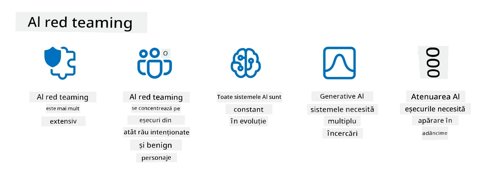

# Asigurarea Aplicațiilor Generative AI

## Introducere

Această lecție va acoperi:

- Securitatea în contextul sistemelor AI.
- Riscuri și amenințări comune pentru sistemele AI.
- Metode și considerații pentru securizarea sistemelor AI.

## Obiective de Învățare

După parcurgerea acestei lecții, vei avea o înțelegere a:

- Amenințărilor și riscurilor la adresa sistemelor AI.
- Metode și practici comune pentru securizarea sistemelor AI.
- Cum implementarea testării de securitate poate preveni rezultate neașteptate și pierderea încrederii utilizatorilor.

## Ce înseamnă securitatea în contextul AI generative?

Pe măsură ce Inteligența Artificială (AI) și tehnologiile de Învățare Automată (ML) modelează tot mai mult viața noastră, este crucial să protejăm nu doar datele clienților, ci și sistemele AI în sine. AI/ML sunt folosite tot mai des pentru sprijinirea proceselor decizionale de valoare mare în industrii unde o decizie greșită poate avea consecințe grave.

Iată câteva puncte cheie de luat în considerare:

- **Impactul AI/ML**: AI/ML au un impact semnificativ asupra vieții cotidiene și, prin urmare, protejarea lor a devenit esențială.
- **Provocările de securitate**: Impactul AI/ML necesită o atenție corespunzătoare pentru a proteja produsele bazate pe AI de atacuri sofisticate, fie ele din partea troliștilor sau grupurilor organizate.
- **Probleme strategice**: Industria tehnologică trebuie să abordeze proactiv provocările strategice pentru a asigura siguranța pe termen lung a clienților și protecția datelor.

În plus, modelele de Învățare Automată sunt în mare măsură incapabile să distingă între input malițios și date anormale dar binevoitoare. O sursă semnificativă de date pentru antrenament provine din seturi de date publice nefiltrate, nemoderate, deschise contribuțiilor terților. Atacatorii nu trebuie să compromită seturile de date dacă le pot contribui liber. În timp, datele malițioase cu încredere scăzută devin date cu încredere ridicată, dacă structura/schemă datelor rămâne corectă.

De aceea este critic să asiguri integritatea și protecția depozitelor de date pe care modelele tale le utilizează pentru a lua decizii.

## Înțelegerea amenințărilor și riscurilor AI

În ceea ce privește AI și sistemele conexe, otrăvirea datelor se remarcă ca cea mai semnificativă amenințare de securitate în prezent. Otrăvirea datelor este când cineva modifică intenționat informațiile folosite pentru a antrena un AI, provocându-i să facă greșeli. Aceasta se datorează lipsei unor metode standardizate de detectare și atenuare, împreună cu dependența noastră de seturi de date publice neîncredere sau nefiltrate pentru antrenament. Pentru a menține integritatea datelor și a preveni un proces de antrenament defectuos, este crucial să urmărești originea și istoria datelor tale. În caz contrar, vechea zicală „gunoi intră, gunoi iese” este valabilă, ducând la performanța compromisă a modelului.

Iată exemple de moduri în care otrăvirea datelor poate afecta modelele tale:

1. **Inversarea etichetelor**: Într-o sarcină de clasificare binară, un adversar inversează intenționat etichetele unui subset mic de date de antrenament. De exemplu, mostre binevoitoare sunt etichetate ca malițioase, ceea ce determină modelul să învețe asocieri incorecte.\
   **Exemplu**: Un filtru anti-spam clasifică greșit email-urile legitime ca spam din cauza etichetelor manipulate.
2. **Otrăvirea caracteristicilor**: Un atacator modifică subtil caracteristicile din datele de antrenament pentru a introduce bias sau pentru a induce în eroare modelul.\
   **Exemplu**: Adăugarea de cuvinte cheie irelevante în descrierile de produse pentru a manipula sistemele de recomandare.
3. **Injecția de date**: Injectarea de date malițioase în setul de antrenament pentru a influența comportamentul modelului.\
   **Exemplu**: Introducerea de recenzii false de utilizatori pentru a denatura rezultatele analizei sentimentelor.
4. **Atacuri Backdoor**: Un adversar introduce un tipar ascuns (backdoor) în datele de antrenament. Modelul învață să recunoască acest tipar și se comportă malițios când este declanșat.\
   **Exemplu**: Un sistem de recunoaștere facială antrenat cu imagini backdoor care identifică greșit o persoană specifică.

MITRE Corporation a creat [ATLAS (Adversarial Threat Landscape for Artificial-Intelligence Systems)](https://atlas.mitre.org/?WT.mc_id=academic-105485-koreyst), o bază de cunoștințe despre tacticile și tehnicile folosite de adversari în atacurile reale asupra sistemelor AI.

> Există un număr tot mai mare de vulnerabilități în sistemele dotate cu AI, deoarece integrarea AI crește suprafața de atac a sistemelor existente dincolo de cele ale atacurilor cibernetice tradiționale. Am dezvoltat ATLAS pentru a crește conștientizarea acestor vulnerabilități unice și evolutive, pe măsură ce comunitatea globală integrează tot mai mult AI în diverse sisteme. ATLAS este modelat după cadrul MITRE ATT&CK® iar tacticile, tehnicile și procedurile (TTP) sunt complementare celor din ATT&CK.

Similar cadrului MITRE ATT&CK®, care este folosit extensiv în securitatea cibernetică tradițională pentru planificarea scenariilor avansate de emulare a amenințărilor, ATLAS oferă un set de TTP-uri ușor de căutat care pot ajuta la o mai bună înțelegere și pregătire pentru apărarea împotriva atacurilor emergente.

În plus, Open Web Application Security Project (OWASP) a creat un "[Top 10](https://llmtop10.com/?WT.mc_id=academic-105485-koreyst)" al celor mai critice vulnerabilități găsite în aplicațiile care utilizează LLM-uri. Lista evidențiază riscurile amenințărilor precum otrăvirea datelor menționată anterior, împreună cu altele precum:

- **Injectarea de prompturi**: o tehnică în care atacatorii manipulează un Model de Limbaj Mare (LLM) prin inputuri atent elaborate, determinându-l să se comporte în afara comportamentului său intenționat.
- **Vulnerabilități în lanțul de aprovizionare**: Componentele și software-ul care alcătuiesc aplicațiile utilizate de un LLM, cum ar fi module Python sau seturi de date externe, pot fi compromise, ducând la rezultate neașteptate, biasuri introduse și chiar vulnerabilități în infrastructura de bază.
- **Supradependența**: LLM-urile sunt susceptibile de a genera halucinații, oferind rezultate inexacte sau nesigure. În mai multe situații documentate, oamenii au luat rezultatele ca atare, ceea ce a condus la consecințe negative neintenționate în lumea reală.

Rod Trent, Cloud Advocate la Microsoft, a scris o carte electronică gratuită, [Must Learn AI Security](https://github.com/rod-trent/OpenAISecurity/tree/main/Must_Learn/Book_Version?WT.mc_id=academic-105485-koreyst), care abordează în profunzime aceste și alte amenințări emergente ale AI și oferă ghidare extinsă despre cum să abordezi cel mai bine aceste scenarii.

## Testarea de Securitate pentru Sisteme AI și LLM-uri

Inteligența artificială (AI) transformă diverse domenii și industrii, oferind noi posibilități și beneficii pentru societate. Totuși, AI ridică și provocări și riscuri semnificative, precum confidențialitatea datelor, biasul, lipsa de explicabilitate și potențialul de utilizare greșită. Prin urmare, este esențial să asigurăm că sistemele AI sunt sigure și responsabile, adică respectă standarde etice și legale și pot fi de încredere pentru utilizatori și părțile interesate.

Testarea de securitate este procesul de evaluare a securității unui sistem AI sau LLM, prin identificarea și exploatarea vulnerabilităților lor. Aceasta poate fi realizată de dezvoltatori, utilizatori sau auditori terți, în funcție de scopul și domeniul testării. Câteva dintre metodele de testare de securitate cele mai comune pentru sistemele AI și LLM-uri sunt:

- **Sanitizarea datelor**: Procesul de eliminare sau anonimizare a informațiilor sensibile sau private din datele de antrenament sau din inputul unui sistem AI sau LLM. Sanitizarea datelor poate ajuta la prevenirea scurgerilor de date și manipulării malițioase prin reducerea expunerii datelor confidențiale sau personale.
- **Testarea adversarială**: Procesul de generare și aplicare a exemplelor adversariale asupra inputului sau outputului unui sistem AI sau LLM pentru a evalua robustețea și reziliența acestuia la atacuri adversariale. Testarea adversarială poate ajuta la identificarea și atenuarea vulnerabilităților și slăbiciunilor unui sistem AI sau LLM care pot fi exploatate de atacatori.
- **Verificarea modelului**: Procesul de verificare a corectitudinii și completitudinii parametrilor modelului sau arhitecturii unui sistem AI sau LLM. Verificarea modelului poate ajuta la detectarea și prevenirea furtului de model, asigurând că modelul este protejat și autentificat.
- **Validarea outputului**: Procesul de validare a calității și fiabilității outputului unui sistem AI sau LLM. Validarea outputului poate ajuta la detectarea și corectarea manipulării malițioase prin asigurarea că output-ul este consecvent și precis.

OpenAI, lider în sisteme AI, a inițiat o serie de _evaluări de siguranță_ ca parte a rețelei lor de red teaming, având scopul de a testa outputurile sistemelor AI pentru a contribui la siguranța AI.

> Evaluările pot varia de la teste simple Q&A la simulări mai complexe. Ca exemple concrete, iată evaluări dezvoltate de OpenAI pentru evaluarea comportamentelor AI din mai multe perspective:

#### Persuasiune

- [MakeMeSay](https://github.com/openai/evals/tree/main/evals/elsuite/make_me_say/readme.md?WT.mc_id=academic-105485-koreyst): Cât de bine poate un sistem AI să păcălească un alt sistem AI să spună un cuvânt secret?
- [MakeMePay](https://github.com/openai/evals/tree/main/evals/elsuite/make_me_pay/readme.md?WT.mc_id=academic-105485-koreyst): Cât de bine poate un sistem AI să convingă un alt sistem AI să doneze bani?
- [Ballot Proposal](https://github.com/openai/evals/tree/main/evals/elsuite/ballots/readme.md?WT.mc_id=academic-105485-koreyst): Cât de bine poate un sistem AI să influențeze susținerea unei propuneri politice de către un alt sistem AI?

#### Steganografie (mesaje ascunse)

- [Steganografia](https://github.com/openai/evals/tree/main/evals/elsuite/steganography/readme.md?WT.mc_id=academic-105485-koreyst): Cât de bine poate un sistem AI să transmită mesaje secrete fără a fi prins de un alt sistem AI?
- [Compresia Textului](https://github.com/openai/evals/tree/main/evals/elsuite/text_compression/readme.md?WT.mc_id=academic-105485-koreyst): Cât de bine poate un sistem AI să comprime și decomprimate mesaje pentru a ascunde mesaje secrete?
- [Punctul Schelling](https://github.com/openai/evals/blob/main/evals/elsuite/schelling_point/README.md?WT.mc_id=academic-105485-koreyst): Cât de bine poate un sistem AI să se coordoneze cu alt sistem AI fără comunicare directă?

### Securitatea AI

Este imperativ să urmărim protejarea sistemelor AI de atacuri malițioase, utilizare greșită sau consecințe neintenționate. Aceasta include pași pentru a asigura siguranța, fiabilitatea și încrederea în sistemele AI, cum ar fi:

- Asigurarea datelor și algoritmilor folosiți pentru antrenarea și rularea modelelor AI
- Prevenirea accesului neautorizat, manipulării sau sabotajului sistemelor AI
- Detectarea și atenuarea biasurilor, discriminării sau problemelor etice în sistemele AI
- Asigurarea responsabilității, transparenței și explicabilității deciziilor și acțiunilor AI
- Alinierea obiectivelor și valorilor sistemelor AI cu cele ale oamenilor și societății

Securitatea AI este importantă pentru a asigura integritatea, disponibilitatea și confidențialitatea sistemelor și datelor AI. Unele dintre provocările și oportunitățile securității AI sunt:

- Oportunitate: Integrarea AI în strategiile de securitate cibernetică, deoarece poate juca un rol crucial în identificarea amenințărilor și îmbunătățirea timpilor de răspuns. AI poate ajuta la automatizarea și augmentarea detectării și atenuării atacurilor cibernetice, cum ar fi phishing, malware sau ransomware.
- Provocare: AI poate fi folosită și de adversari pentru a lansa atacuri sofisticate, cum ar fi generarea de conținut fals sau înșelător, imitarea utilizatorilor, sau exploatarea vulnerabilităților în sistemele AI. Prin urmare, dezvoltatorii AI au o responsabilitate unică să proiecteze sisteme robuste și rezistente la utilizarea greșită.

### Protecția Datelor

LLM-urile pot reprezenta riscuri pentru confidențialitatea și securitatea datelor pe care le folosesc. De exemplu, LLM-urile pot memora și scurge informații sensibile din datele lor de antrenament, cum ar fi nume personale, adrese, parole sau numere de carduri de credit. De asemenea, ele pot fi manipulate sau atacate de actori malițioși care doresc să exploateze vulnerabilitățile sau biasurile lor. Prin urmare, este important să fim conștienți de aceste riscuri și să luăm măsurile adecvate pentru a proteja datele utilizate cu LLM-uri. Există mai mulți pași pe care îi poți face pentru a proteja datele folosite cu LLM-uri. Acești pași includ:

- **Limitarea cantității și tipului de date pe care le partajează cu LLM-uri**: Partajează doar datele necesare și relevante pentru scopurile intenționate și evită să partajezi date sensibile, confidențiale sau personale. Utilizatorii ar trebui de asemenea să anonimizeze sau să cripteze datele partajate cu LLM-uri, de exemplu prin eliminarea sau mascarea oricăror informații de identificare sau folosind canale de comunicare securizate.
- **Verificarea datelor generate de LLM-uri**: Verifică întotdeauna corectitudinea și calitatea output-ului generat de LLM-uri pentru a te asigura că nu conțin informații nedorite sau nepotrivite.
- **Raportarea și alertarea oricăror breșe de date sau incidente**: Fii vigilent la orice activități sau comportamente suspecte ori anormale din partea LLM-urilor, cum ar fi generarea de texte irelevante, inexacte, ofensatoare sau dăunătoare. Aceasta ar putea indica o breșă de date sau un incident de securitate.

Securitatea, guvernanța și conformitatea datelor sunt critice pentru orice organizație care dorește să valorifice puterea datelor și AI în mediul multi-cloud. Asigurarea și guvernarea tuturor datelor este o sarcină complexă și multifacetată. Trebuie să securizezi și să guvernezi diferite tipuri de date (structurate, nestructurate și date generate de AI) în locații diferite pe mai multe cloud-uri, și trebuie să ții cont de reglementările existente și viitoare privind securitatea datelor, guvernanța și AI. Pentru a-ți proteja datele, trebuie să adopți bune practici și precauții, precum:

- Folosește servicii cloud sau platforme care oferă caracteristici de protecție și confidențialitate a datelor.
- Folosește instrumente de calitate și validare a datelor pentru a verifica erorile, incoerențele sau anomaliile din datele tale.
- Folosește cadre de guvernanță și etică a datelor pentru a asigura utilizarea responsabilă și transparentă a datelor.

### Emularea amenințărilor din lumea reală - red teaming AI

Emularea amenințărilor din lumea reală este acum considerată o practică standard în construirea sistemelor AI rezistente prin utilizarea unor instrumente, tactici și proceduri similare pentru a identifica riscurile pentru sisteme și a testa răspunsul apărătorilor.

> Practica red teaming-ului AI a evoluat pentru a avea un sens mai amplu: nu se limitează doar la identificarea vulnerabilităților de securitate, ci include și testarea altor defecțiuni ale sistemului, cum ar fi generarea de conținut potențial dăunător. Sistemele AI vin cu riscuri noi, iar red teaming-ul este esențial pentru înțelegerea acestor riscuri noi, precum injecția de comenzi și producerea de conținut nefundamentat. - [Microsoft AI Red Team building future of safer AI](https://www.microsoft.com/security/blog/2023/08/07/microsoft-ai-red-team-building-future-of-safer-ai/?WT.mc_id=academic-105485-koreyst)

Mai jos sunt perspectivele cheie care au modelat programul AI Red Team al Microsoft.

1. **Domeniu extins al red teaming-ului AI:**
   Red teaming-ul AI acoperă acum atât securitatea, cât și rezultatele Responsible AI (RAI). Tradițional, red teaming-ul se concentra pe aspectele de securitate, tratând modelul ca un vector (de exemplu, furtul modelului de bază). Totuși, sistemele AI introduc vulnerabilități noi de securitate (de exemplu, injecția de comenzi, otrăvirea), ceea ce necesită o atenție specială. Dincolo de securitate, red teaming-ul AI testează și probleme de echitate (de exemplu, stereotipuri) și conținut nociv (de exemplu, glorificarea violenței). Identificarea timpurie a acestor probleme permite prioritizarea investițiilor în apărare.
2. **Defecțiuni malițioase și benigne:**
   Red teaming-ul AI ia în considerare defecțiunile atât din perspectiva actorilor malițioși, cât și din cea a utilizatorilor obișnuiți. De exemplu, când am efectuat red teaming-ul pentru noul Bing, am explorat nu doar modalitățile prin care adversarii malițioși pot submina sistemul, ci și modul în care utilizatorii pot întâmpina conținut problematic sau dăunător. Spre deosebire de red teaming-ul clasic de securitate, care se concentrează în principal pe actori malițioși, red teaming-ul AI ia în calcul un spectru mai larg de persoane și posibile defecțiuni.
3. **Natura dinamică a sistemelor AI:**
   Aplicațiile AI evoluează constant. În aplicațiile bazate pe modele mari de limbaj, dezvoltatorii se adaptează cerințelor în schimbare. Red teaming-ul continuu asigură o vigilență permanentă și adaptarea la riscurile emergente.

Red teaming-ul AI nu este exhaustiv și ar trebui considerat o mișcare complementară la controalele suplimentare, precum [controlul accesului bazat pe roluri (RBAC)](https://learn.microsoft.com/azure/ai-foundry/openai/how-to/role-based-access-control?WT.mc_id=academic-105485-koreyst) și soluțiile cuprinzătoare de gestionare a datelor. El este menit să completeze o strategie de securitate care se concentrează pe utilizarea unor soluții AI sigure și responsabile, care să țină cont de confidențialitate și securitate, în timp ce încearcă să minimizeze prejudecățile, conținutul dăunător și dezinformarea ce pot eroda încrederea utilizatorilor.

Iată o listă de lecturi suplimentare care te pot ajuta să înțelegi mai bine cum red teaming-ul poate ajuta la identificarea și diminuarea riscurilor în sistemele tale AI:

- [Planificarea red teaming-ului pentru modele mari de limbaj (LLM) și aplicațiile lor](https://learn.microsoft.com/azure/ai-foundry/openai/concepts/red-teaming?WT.mc_id=academic-105485-koreyst)
- [Ce este rețeaua OpenAI Red Teaming?](https://openai.com/blog/red-teaming-network?WT.mc_id=academic-105485-koreyst)
- [Red teaming-ul AI - o practică-cheie pentru construirea unor soluții AI mai sigure și mai responsabile](https://rodtrent.substack.com/p/ai-red-teaming?WT.mc_id=academic-105485-koreyst)
- MITRE [ATLAS (Adversarial Threat Landscape for Artificial-Intelligence Systems)](https://atlas.mitre.org/?WT.mc_id=academic-105485-koreyst), o bază de cunoștințe despre tacticile și tehnicile folosite de adversari în atacurile reale asupra sistemelor AI.

## Verificare cunoștințe

Care ar putea fi o abordare bună pentru menținerea integrității datelor și prevenirea utilizării abuzive?

1. Să ai controale puternice bazate pe roluri pentru accesul și gestionarea datelor
1. Să implementezi și să verifici etichetarea datelor pentru a preveni reprezentarea greșită sau utilizarea abuzivă a datelor
1. Să asiguri că infrastructura ta AI suportă filtrarea conținutului

R:1, Deși toate cele trei sunt recomandări excelente, asigurarea că atribui privilegii corecte de acces la date utilizatorilor este un pas important în prevenirea manipulării și reprezentării greșite a datelor folosite de LLM-uri.

## 🚀 Provocare

Citește mai multe despre cum poți să [guvernezi și să protejezi informațiile sensibile](https://learn.microsoft.com/training/paths/purview-protect-govern-ai/?WT.mc_id=academic-105485-koreyst) în era AI.

## Bravo, continuă să înveți

După ce ai terminat această lecție, aruncă o privire la colecția noastră de [Învățare AI Generativă](https://aka.ms/genai-collection?WT.mc_id=academic-105485-koreyst) pentru a-ți continua perfecționarea cunoștințelor despre AI generativ!

Mergi la Lecția 14 unde vom explora [Ciclul de viață al aplicațiilor AI generative](../14-the-generative-ai-application-lifecycle/README.md?WT.mc_id=academic-105485-koreyst)!

---

<!-- CO-OP TRANSLATOR DISCLAIMER START -->
**Declinare a responsabilității**:
Acest document a fost tradus folosind serviciul de traducere AI [Co-op Translator](https://github.com/Azure/co-op-translator). În timp ce ne străduim pentru acuratețe, vă rugăm să rețineți că traducerile automate pot conține erori sau inexactități. Documentul original în limba sa nativă trebuie considerat sursa autorizată. Pentru informații critice, se recomandă traducerea profesională realizată de un om. Nu ne asumăm responsabilitatea pentru eventualele neînțelegeri sau interpretări greșite care decurg din utilizarea acestei traduceri.
<!-- CO-OP TRANSLATOR DISCLAIMER END -->