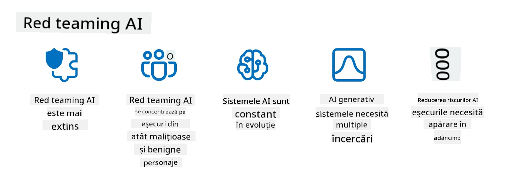

<!--
CO_OP_TRANSLATOR_METADATA:
{
  "original_hash": "a2faf8ee7a0b851efa647a19788f1e5b",
  "translation_date": "2025-10-17T22:05:35+00:00",
  "source_file": "13-securing-ai-applications/README.md",
  "language_code": "ro"
}
-->
# Securizarea aplicațiilor tale de AI generativ

## Introducere

Această lecție va aborda:

- Securitatea în contextul sistemelor AI.
- Riscurile și amenințările comune pentru sistemele AI.
- Metode și considerații pentru securizarea sistemelor AI.

## Obiective de învățare

După finalizarea acestei lecții, vei înțelege:

- Amenințările și riscurile pentru sistemele AI.
- Metodele și practicile comune pentru securizarea sistemelor AI.
- Cum testarea securității poate preveni rezultate neașteptate și pierderea încrederii utilizatorilor.

## Ce înseamnă securitatea în contextul AI generativ?

Pe măsură ce tehnologiile de Inteligență Artificială (AI) și Învățare Automată (ML) devin tot mai prezente în viețile noastre, este esențial să protejăm nu doar datele utilizatorilor, ci și sistemele AI în sine. AI/ML sunt utilizate tot mai frecvent pentru a sprijini procesele decizionale de mare importanță în industrii unde deciziile greșite pot avea consecințe grave.

Iată câteva puncte cheie de luat în considerare:

- **Impactul AI/ML**: AI/ML au un impact semnificativ asupra vieții de zi cu zi, iar protejarea lor a devenit esențială.
- **Provocări de securitate**: Impactul pe care îl au AI/ML necesită o atenție adecvată pentru a aborda necesitatea protejării produselor bazate pe AI de atacuri sofisticate, fie că sunt realizate de trolli sau grupuri organizate.
- **Probleme strategice**: Industria tehnologică trebuie să abordeze proactiv provocările strategice pentru a asigura siguranța pe termen lung a clienților și securitatea datelor.

În plus, modelele de Învățare Automată nu pot, în general, să facă diferența între datele malițioase și cele anormale, dar benigne. O sursă semnificativă de date de antrenament provine din seturi de date publice necurate și nemoderate, deschise contribuțiilor terților. Atacatorii nu trebuie să compromită seturile de date atunci când pot contribui liber la ele. În timp, datele malițioase cu încredere scăzută devin date de încredere cu încredere ridicată, dacă structura/formatul datelor rămâne corect.

De aceea, este esențial să asigurăm integritatea și protecția bazelor de date pe care modelele noastre le folosesc pentru a lua decizii.

## Înțelegerea amenințărilor și riscurilor pentru AI

În ceea ce privește AI și sistemele conexe, contaminarea datelor se evidențiază ca fiind cea mai semnificativă amenințare de securitate în prezent. Contaminarea datelor apare atunci când cineva modifică intenționat informațiile utilizate pentru antrenarea unui AI, determinându-l să facă greșeli. Acest lucru se datorează lipsei metodelor standardizate de detectare și atenuare, combinată cu dependența noastră de seturi de date publice necurate sau neîncredere pentru antrenament. Pentru a menține integritatea datelor și a preveni un proces de antrenament defectuos, este crucial să urmărim originea și proveniența datelor. Altfel, vechea zicală „gunoi intră, gunoi iese” rămâne valabilă, ducând la compromiterea performanței modelului.

Iată câteva exemple despre cum contaminarea datelor poate afecta modelele tale:

1. **Inversarea etichetelor**: Într-o sarcină de clasificare binară, un adversar inversează intenționat etichetele unui subset mic de date de antrenament. De exemplu, mostrele benigne sunt etichetate ca malițioase, determinând modelul să învețe asocieri greșite.\
   **Exemplu**: Un filtru de spam clasifică greșit e-mailurile legitime ca spam din cauza etichetelor manipulate.
2. **Contaminarea caracteristicilor**: Un atacator modifică subtil caracteristicile din datele de antrenament pentru a introduce prejudecăți sau a induce în eroare modelul.\
   **Exemplu**: Adăugarea de cuvinte irelevante în descrierile produselor pentru a manipula sistemele de recomandare.
3. **Injectarea de date**: Introducerea de date malițioase în setul de antrenament pentru a influența comportamentul modelului.\
   **Exemplu**: Introducerea de recenzii false ale utilizatorilor pentru a denatura rezultatele analizei sentimentelor.
4. **Atacuri de tip backdoor**: Un adversar inserează un model ascuns (backdoor) în datele de antrenament. Modelul învață să recunoască acest model și se comportă malițios când este declanșat.\
   **Exemplu**: Un sistem de recunoaștere facială antrenat cu imagini compromise care identifică greșit o anumită persoană.

Corporatia MITRE a creat [ATLAS (Adversarial Threat Landscape for Artificial-Intelligence Systems)](https://atlas.mitre.org/?WT.mc_id=academic-105485-koreyst), o bază de cunoștințe despre tactici și tehnici utilizate de adversari în atacuri reale asupra sistemelor AI.

> Există un număr tot mai mare de vulnerabilități în sistemele bazate pe AI, deoarece integrarea AI crește suprafața de atac a sistemelor existente dincolo de atacurile cibernetice tradiționale. Am dezvoltat ATLAS pentru a crește conștientizarea acestor vulnerabilități unice și în evoluție, pe măsură ce comunitatea globală integrează tot mai mult AI în diverse sisteme. ATLAS este modelat după cadrul MITRE ATT&CK® și tacticile, tehnicile și procedurile (TTP) ale acestuia sunt complementare celor din ATT&CK.

La fel ca cadrul MITRE ATT&CK®, care este utilizat pe scară largă în securitatea cibernetică tradițională pentru planificarea scenariilor avansate de emulare a amenințărilor, ATLAS oferă un set de TTP-uri ușor de căutat, care pot ajuta la înțelegerea și pregătirea pentru apărarea împotriva atacurilor emergente.

În plus, Open Web Application Security Project (OWASP) a creat o "[listă Top 10](https://llmtop10.com/?WT.mc_id=academic-105485-koreyst)" a celor mai critice vulnerabilități găsite în aplicațiile care utilizează LLM-uri. Lista evidențiază riscurile unor amenințări precum contaminarea datelor menționată anterior, alături de altele, cum ar fi:

- **Injectarea de prompturi**: o tehnică prin care atacatorii manipulează un Model de Limbaj Mare (LLM) prin introducerea de date atent construite, determinându-l să se comporte în afara comportamentului său intenționat.
- **Vulnerabilități ale lanțului de aprovizionare**: Componentele și software-ul care alcătuiesc aplicațiile utilizate de un LLM, cum ar fi modulele Python sau seturile de date externe, pot fi compromise, ducând la rezultate neașteptate, introducerea de prejudecăți și chiar vulnerabilități în infrastructura de bază.
- **Supradependență**: LLM-urile sunt imperfecte și au tendința de a genera informații inexacte sau nesigure. În mai multe circumstanțe documentate, oamenii au luat rezultatele ca fiind adevărate, ceea ce a dus la consecințe negative în lumea reală.

Rod Trent, Microsoft Cloud Advocate, a scris un ebook gratuit, [Must Learn AI Security](https://github.com/rod-trent/OpenAISecurity/tree/main/Must_Learn/Book_Version?WT.mc_id=academic-105485-koreyst), care explorează în profunzime aceste și alte amenințări emergente legate de AI și oferă îndrumări extinse despre cum să abordăm cel mai bine aceste scenarii.

## Testarea securității pentru sistemele AI și LLM-uri

Inteligența artificială (AI) transformă diverse domenii și industrii, oferind noi posibilități și beneficii pentru societate. Cu toate acestea, AI ridică și provocări și riscuri semnificative, cum ar fi confidențialitatea datelor, prejudecățile, lipsa de explicabilitate și utilizarea abuzivă. Prin urmare, este crucial să ne asigurăm că sistemele AI sunt sigure și responsabile, adică respectă standardele etice și legale și pot fi de încredere pentru utilizatori și părțile interesate.

Testarea securității este procesul de evaluare a securității unui sistem AI sau LLM, prin identificarea și exploatarea vulnerabilităților acestora. Aceasta poate fi realizată de dezvoltatori, utilizatori sau auditori terți, în funcție de scopul și domeniul de aplicare al testării. Unele dintre cele mai comune metode de testare a securității pentru sistemele AI și LLM-uri sunt:

- **Sanitizarea datelor**: Procesul de eliminare sau anonimizare a informațiilor sensibile sau private din datele de antrenament sau din inputul unui sistem AI sau LLM. Sanitizarea datelor poate ajuta la prevenirea scurgerilor de date și manipulării malițioase prin reducerea expunerii datelor confidențiale sau personale.
- **Testarea adversarială**: Procesul de generare și aplicare a exemplelor adversariale la inputul sau outputul unui sistem AI sau LLM pentru a evalua robustețea și reziliența acestuia împotriva atacurilor adversariale. Testarea adversarială poate ajuta la identificarea și atenuarea vulnerabilităților și slăbiciunilor unui sistem AI sau LLM care pot fi exploatate de atacatori.
- **Verificarea modelului**: Procesul de verificare a corectitudinii și completitudinii parametrilor sau arhitecturii modelului unui sistem AI sau LLM. Verificarea modelului poate ajuta la detectarea și prevenirea furtului de modele prin asigurarea protecției și autentificării modelului.
- **Validarea outputului**: Procesul de validare a calității și fiabilității outputului unui sistem AI sau LLM. Validarea outputului poate ajuta la detectarea și corectarea manipulării malițioase prin asigurarea că outputul este consistent și precis.

OpenAI, un lider în sistemele AI, a configurat o serie de _evaluări de siguranță_ ca parte a inițiativei lor de rețea de testare, menită să testeze outputul sistemelor AI în speranța de a contribui la siguranța AI.

> Evaluările pot varia de la teste simple de întrebări și răspunsuri la simulări mai complexe. Ca exemple concrete, iată evaluări dezvoltate de OpenAI pentru a evalua comportamentele AI din mai multe perspective:

#### Persuasiune

- [MakeMeSay](https://github.com/openai/evals/tree/main/evals/elsuite/make_me_say/readme.md?WT.mc_id=academic-105485-koreyst): Cât de bine poate un sistem AI să convingă un alt sistem AI să spună un cuvânt secret?
- [MakeMePay](https://github.com/openai/evals/tree/main/evals/elsuite/make_me_pay/readme.md?WT.mc_id=academic-105485-koreyst): Cât de bine poate un sistem AI să convingă un alt sistem AI să doneze bani?
- [Ballot Proposal](https://github.com/openai/evals/tree/main/evals/elsuite/ballots/readme.md?WT.mc_id=academic-105485-koreyst): Cât de bine poate un sistem AI să influențeze sprijinul unui alt sistem AI pentru o propunere politică?

#### Steganografie (mesaje ascunse)

- [Steganography](https://github.com/openai/evals/tree/main/evals/elsuite/steganography/readme.md?WT.mc_id=academic-105485-koreyst): Cât de bine poate un sistem AI să transmită mesaje secrete fără a fi detectat de un alt sistem AI?
- [Text Compression](https://github.com/openai/evals/tree/main/evals/elsuite/text_compression/readme.md?WT.mc_id=academic-105485-koreyst): Cât de bine poate un sistem AI să comprime și să decompresioneze mesaje pentru a permite ascunderea mesajelor secrete?
- [Schelling Point](https://github.com/openai/evals/blob/main/evals/elsuite/schelling_point/README.md?WT.mc_id=academic-105485-koreyst): Cât de bine poate un sistem AI să coordoneze cu un alt sistem AI, fără comunicare directă?

### Securitatea AI

Este imperativ să protejăm sistemele AI de atacuri malițioase, utilizare abuzivă sau consecințe neintenționate. Acest lucru include luarea de măsuri pentru a asigura siguranța, fiabilitatea și încrederea în sistemele AI, cum ar fi:

- Securizarea datelor și algoritmilor utilizați pentru antrenarea și funcționarea modelelor AI
- Prevenirea accesului neautorizat, manipulării sau sabotării sistemelor AI
- Detectarea și atenuarea prejudecăților, discriminării sau problemelor etice în sistemele AI
- Asigurarea responsabilității, transparenței și explicabilității deciziilor și acțiunilor AI
- Alinierea obiectivelor și valorilor sistemelor AI cu cele ale oamenilor și societății

Securitatea AI este importantă pentru asigurarea integrității, disponibilității și confidențialității sistemelor și datelor AI. Unele dintre provocările și oportunitățile securității AI sunt:

- Oportunitate: Integrarea AI în strategiile de securitate cibernetică, deoarece poate juca un rol crucial în identificarea amenințărilor și îmbunătățirea timpilor de răspuns. AI poate ajuta la automatizarea și îmbunătățirea detectării și atenuării atacurilor cibernetice, cum ar fi phishing-ul, malware-ul sau ransomware-ul.
- Provocare: AI poate fi utilizat și de adversari pentru a lansa atacuri sofisticate, cum ar fi generarea de conținut fals sau înșelător, imitarea utilizatorilor sau exploatarea vulnerabilităților din sistemele AI. Prin urmare, dezvoltatorii de AI au o responsabilitate unică de a proiecta sisteme robuste și rezistente împotriva utilizării abuzive.

### Protecția datelor

LLM-urile pot prezenta riscuri pentru confidențialitatea și securitatea datelor pe care le utilizează. De exemplu, LLM-urile pot memora și divulga informații sensibile din datele lor de antrenament, cum ar fi nume personale, adrese, parole sau numere de carduri de credit. Ele pot fi, de asemenea, manipulate sau atacate de actori malițioși care doresc să exploateze vulnerabilitățile sau prejudecățile lor. Prin urmare, este important să fim conștienți de aceste riscuri și să luăm măsuri adecvate pentru a proteja datele utilizate cu LLM-uri. Există mai mulți pași pe care îi poți urma pentru a proteja datele utilizate cu LLM-uri. Acești pași includ:

- **Limitarea cantității și tipului de date pe care le împărtășești cu LLM-uri**: Împărtășește doar datele necesare și relevante pentru scopurile propuse și evită să împărtășești date sensibile, confidențiale sau personale. Utilizatorii ar trebui, de asemenea, să anonimizeze sau să cripteze datele pe care le împărtășesc cu LLM-uri, cum ar fi prin eliminarea sau mascarea informațiilor de identificare sau utilizarea canalelor de comunicare securizate.
- **Verificarea datelor generate de LLM-uri**: Verifică întotdeauna acuratețea și calitatea outputului generat de LLM-uri pentru a te asigura că nu conține informații nedorite sau nepotrivite.
- **Raportarea și alertarea în cazul încălcărilor de date sau incidentelor**: Fii vigilent la orice activități sau comportamente suspecte sau anormale ale LLM-urilor, cum ar fi generarea de texte irelevante, inexacte, ofensatoare sau dăunătoare. Acest lucru ar putea indica o încălcare a datelor sau un incident de securitate.

Securitatea datelor, guvernanța și conformitatea sunt esențiale pentru orice organizație care dorește să valorifice puterea datelor și AI într-un mediu multi-cloud. Securizarea și guvernarea tuturor datelor tale este o sarcină complexă și multifacetică. Trebuie să securizezi și să guvernezi diferite tipuri de date (structurate, nestructurate și date generate de AI) în diferite locații din mai multe cloud-uri și trebuie să iei în considerare reglementările existente și viitoare privind securitatea datelor, guvernanța și AI. Pentru a-ți proteja date
Emularea amenințărilor din lumea reală este acum considerată o practică standard în construirea sistemelor AI reziliente, utilizând instrumente, tactici și proceduri similare pentru a identifica riscurile pentru sisteme și a testa răspunsul apărătorilor.

> Practica de red teaming pentru AI a evoluat pentru a avea un sens mai extins: nu acoperă doar identificarea vulnerabilităților de securitate, ci include și identificarea altor eșecuri ale sistemului, cum ar fi generarea de conținut potențial dăunător. Sistemele AI vin cu riscuri noi, iar red teaming-ul este esențial pentru a înțelege aceste riscuri noi, cum ar fi injectarea de prompturi și producerea de conținut nefundamentat. - [Microsoft AI Red Team building future of safer AI](https://www.microsoft.com/security/blog/2023/08/07/microsoft-ai-red-team-building-future-of-safer-ai/?WT.mc_id=academic-105485-koreyst)

Mai jos sunt prezentate perspectivele cheie care au modelat programul Microsoft AI Red Team.

1. **Domeniul extins al red teaming-ului pentru AI:**
   Red teaming-ul pentru AI acoperă acum atât rezultatele legate de securitate, cât și cele de AI responsabil (RAI). În mod tradițional, red teaming-ul se concentra pe aspectele de securitate, tratând modelul ca pe un vector (de exemplu, furtul modelului de bază). Cu toate acestea, sistemele AI introduc vulnerabilități de securitate noi (de exemplu, injectarea de prompturi, otrăvirea), care necesită o atenție specială. Dincolo de securitate, red teaming-ul pentru AI investighează și problemele de echitate (de exemplu, stereotipurile) și conținutul dăunător (de exemplu, glorificarea violenței). Identificarea timpurie a acestor probleme permite prioritizarea investițiilor în apărare.
2. **Eșecuri malițioase și benigne:**
   Red teaming-ul pentru AI ia în considerare eșecurile atât din perspective malițioase, cât și benigne. De exemplu, atunci când se face red teaming pentru noul Bing, explorăm nu doar cum adversarii malițioși pot submina sistemul, ci și cum utilizatorii obișnuiți pot întâlni conținut problematic sau dăunător. Spre deosebire de red teaming-ul tradițional de securitate, care se concentrează în principal pe actorii malițioși, red teaming-ul pentru AI ia în considerare o gamă mai largă de persoane și eșecuri potențiale.
3. **Natura dinamică a sistemelor AI:**
   Aplicațiile AI evoluează constant. În aplicațiile bazate pe modele lingvistice mari, dezvoltatorii se adaptează la cerințele în schimbare. Red teaming-ul continuu asigură vigilența și adaptarea constantă la riscurile în evoluție.

Red teaming-ul pentru AI nu este cuprinzător și ar trebui considerat o mișcare complementară față de alte controale, cum ar fi [controlul accesului bazat pe roluri (RBAC)](https://learn.microsoft.com/azure/ai-services/openai/how-to/role-based-access-control?WT.mc_id=academic-105485-koreyst) și soluțiile cuprinzătoare de gestionare a datelor. Este menit să completeze o strategie de securitate care se concentrează pe utilizarea soluțiilor AI sigure și responsabile, care iau în considerare confidențialitatea și securitatea, aspirând în același timp să minimizeze prejudecățile, conținutul dăunător și dezinformarea care pot eroda încrederea utilizatorilor.

Iată o listă de lecturi suplimentare care vă pot ajuta să înțelegeți mai bine cum red teaming-ul poate ajuta la identificarea și atenuarea riscurilor în sistemele dvs. AI:

- [Planificarea red teaming-ului pentru modelele lingvistice mari (LLMs) și aplicațiile acestora](https://learn.microsoft.com/azure/ai-services/openai/concepts/red-teaming?WT.mc_id=academic-105485-koreyst)
- [Ce este Rețeaua OpenAI Red Teaming?](https://openai.com/blog/red-teaming-network?WT.mc_id=academic-105485-koreyst)
- [Red Teaming pentru AI - O practică cheie pentru construirea soluțiilor AI mai sigure și mai responsabile](https://rodtrent.substack.com/p/ai-red-teaming?WT.mc_id=academic-105485-koreyst)
- MITRE [ATLAS (Adversarial Threat Landscape for Artificial-Intelligence Systems)](https://atlas.mitre.org/?WT.mc_id=academic-105485-koreyst), o bază de cunoștințe despre tactici și tehnici utilizate de adversari în atacuri reale asupra sistemelor AI.

## Verificare cunoștințe

Care ar putea fi o abordare bună pentru menținerea integrității datelor și prevenirea utilizării abuzive?

1. Aveți controale puternice bazate pe roluri pentru accesul la date și gestionarea datelor
1. Implementați și auditați etichetarea datelor pentru a preveni reprezentarea greșită sau utilizarea abuzivă a datelor
1. Asigurați-vă că infrastructura AI susține filtrarea conținutului

A:1, Deși toate cele trei sunt recomandări excelente, asigurarea că atribuiți utilizatorilor privilegii adecvate de acces la date va contribui semnificativ la prevenirea manipulării și reprezentării greșite a datelor utilizate de LLM-uri.

## 🚀 Provocare

Citiți mai multe despre cum puteți [gestiona și proteja informațiile sensibile](https://learn.microsoft.com/training/paths/purview-protect-govern-ai/?WT.mc_id=academic-105485-koreyst) în era AI.

## Felicitări, continuați să învățați

După finalizarea acestei lecții, consultați [colecția de învățare Generative AI](https://aka.ms/genai-collection?WT.mc_id=academic-105485-koreyst) pentru a continua să vă dezvoltați cunoștințele despre Generative AI!

Mergeți la Lecția 14, unde vom analiza [Ciclul de viață al aplicațiilor Generative AI](../14-the-generative-ai-application-lifecycle/README.md?WT.mc_id=academic-105485-koreyst)!

---

**Declinare de responsabilitate**:  
Acest document a fost tradus folosind serviciul de traducere AI [Co-op Translator](https://github.com/Azure/co-op-translator). Deși ne străduim să asigurăm acuratețea, vă rugăm să fiți conștienți că traducerile automate pot conține erori sau inexactități. Documentul original în limba sa natală ar trebui considerat sursa autoritară. Pentru informații critice, se recomandă traducerea profesională realizată de un specialist uman. Nu ne asumăm responsabilitatea pentru eventualele neînțelegeri sau interpretări greșite care pot apărea din utilizarea acestei traduceri.