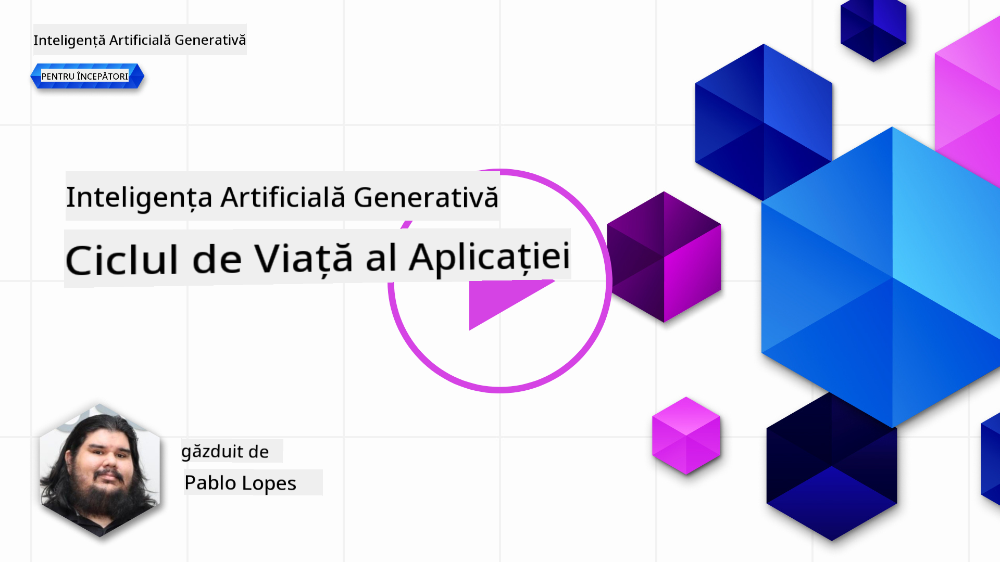
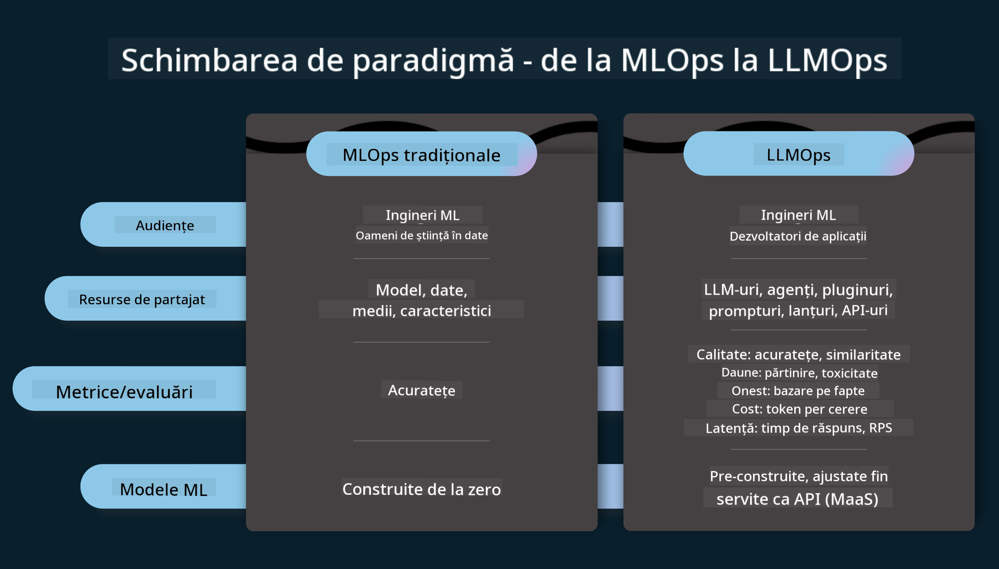
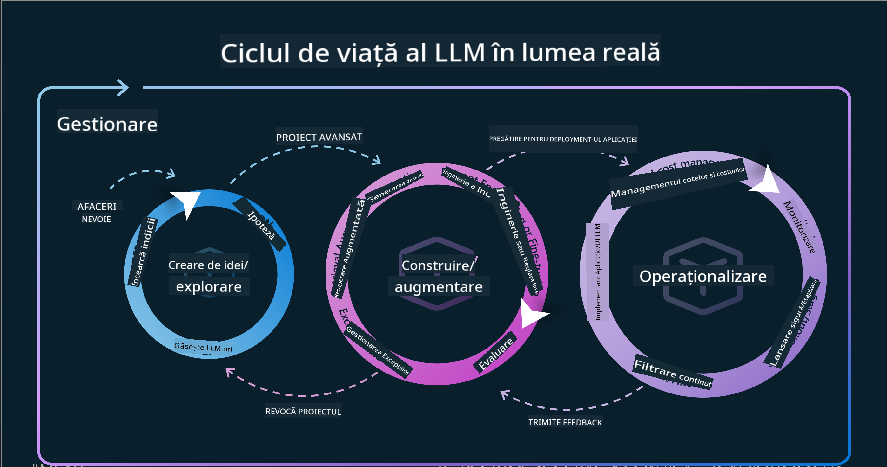
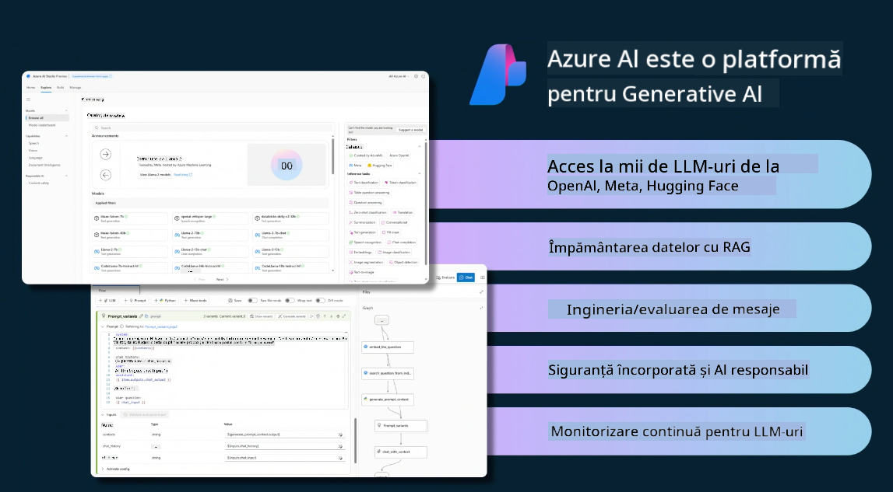
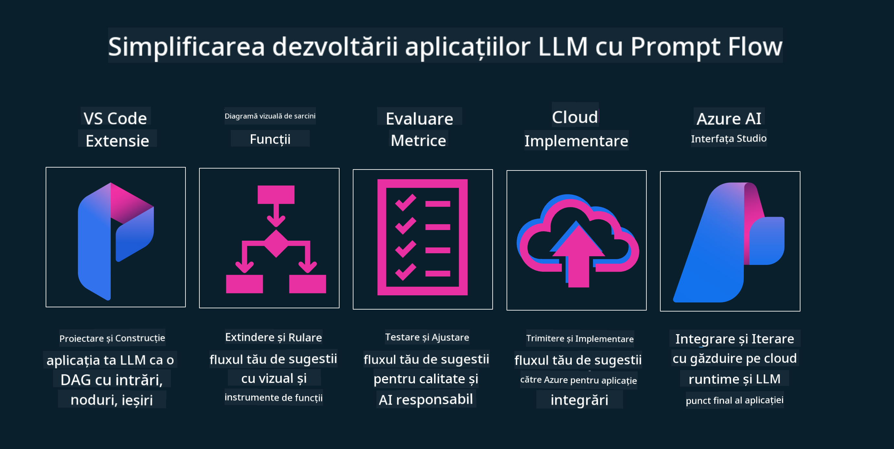

<!--
CO_OP_TRANSLATOR_METADATA:
{
  "original_hash": "27a5347a5022d5ef0a72ab029b03526a",
  "translation_date": "2025-05-20T00:56:14+00:00",
  "source_file": "14-the-generative-ai-application-lifecycle/README.md",
  "language_code": "ro"
}
-->

# Ciclul de viață al aplicațiilor AI generative

O întrebare importantă pentru toate aplicațiile AI este relevanța funcțiilor AI, deoarece AI este un domeniu care evoluează rapid. Pentru a te asigura că aplicația ta rămâne relevantă, fiabilă și robustă, trebuie să o monitorizezi, evaluezi și îmbunătățești continuu. Aici intervine ciclul de viață al AI generative.

Ciclul de viață al AI generative este un cadru care te ghidează prin etapele de dezvoltare, implementare și întreținere a unei aplicații AI generative. Te ajută să definești obiectivele, să măsori performanța, să identifici provocările și să implementezi soluțiile. De asemenea, te ajută să aliniezi aplicația cu standardele etice și legale ale domeniului tău și ale părților interesate. Urmând ciclul de viață al AI generative, te poți asigura că aplicația ta oferă mereu valoare și satisface utilizatorii.

## Introducere

În acest capitol, vei:

- Înțelege schimbarea de paradigmă de la MLOps la LLMOps
- Ciclul de viață LLM
- Instrumente pentru ciclul de viață
- Metrificarea și evaluarea ciclului de viață

## Înțelege schimbarea de paradigmă de la MLOps la LLMOps

LLM-urile sunt un nou instrument în arsenalul Inteligenței Artificiale, fiind extrem de puternice în sarcinile de analiză și generare pentru aplicații. Totuși, această putere are unele consecințe în modul în care eficientizăm sarcinile de AI și învățare automată clasică.

Astfel, avem nevoie de un nou paradigm pentru a adapta acest instrument într-un mod dinamic, cu stimulentele corecte. Putem categoriza aplicațiile AI mai vechi ca "Aplicații ML" și aplicațiile AI mai noi ca "Aplicații GenAI" sau doar "Aplicații AI", reflectând tehnologia și tehnicile predominante folosite la acel moment. Aceasta schimbă narațiunea noastră în mai multe moduri, uită-te la următoarea comparație.

Observă că în LLMOps, ne concentrăm mai mult pe dezvoltatorii de aplicații, folosind integrațiile ca punct cheie, folosind "Modele ca serviciu" și gândindu-ne la următoarele puncte pentru metrici.

- Calitate: Calitatea răspunsului
- Daune: AI responsabil
- Onestitate: Fundamentarea răspunsului (Are sens? Este corect?)
- Cost: Bugetul soluției
- Latență: Timpul mediu pentru răspunsul token

## Ciclul de viață LLM

Mai întâi, pentru a înțelege ciclul de viață și modificările, să observăm următoarea infografică.

După cum poți observa, acesta este diferit de ciclurile de viață obișnuite din MLOps. LLM-urile au multe cerințe noi, cum ar fi Prompting, tehnici diferite pentru a îmbunătăți calitatea (Fine-Tuning, RAG, Meta-Prompts), evaluare și responsabilitate diferită cu AI responsabil, și în final, noi metrici de evaluare (Calitate, Daune, Onestitate, Cost și Latență).

De exemplu, aruncă o privire la modul în care ideăm. Folosind ingineria de prompturi pentru a experimenta cu diverse LLM-uri pentru a explora posibilități și a testa dacă ipotezele lor ar putea fi corecte.

Observă că acest proces nu este liniar, ci bucle integrate, iterative și cu un ciclu general.

Cum am putea explora acești pași? Să intrăm în detaliu în modul în care am putea construi un ciclu de viață.

Acesta poate părea puțin complicat, să ne concentrăm mai întâi pe cele trei mari etape.

1. Ideare/Explorare: Explorare, aici putem explora conform nevoilor noastre de afaceri. Prototipare, crearea unui [PromptFlow](https://microsoft.github.io/promptflow/index.html?WT.mc_id=academic-105485-koreyst) și testarea dacă este suficient de eficient pentru ipoteza noastră.
1. Construire/Augmentare: Implementare, acum, începem să evaluăm pentru seturi de date mai mari și să implementăm tehnici, cum ar fi Fine-tuning și RAG, pentru a verifica robustețea soluției noastre. Dacă nu este, reimplementarea, adăugarea de noi pași în fluxul nostru sau restructurarea datelor ar putea ajuta. După testarea fluxului nostru și a scalei noastre, dacă funcționează și verificăm metricile noastre, este gata pentru următorul pas.
1. Operaționalizare: Integrare, acum adăugăm sisteme de monitorizare și alerte în sistemul nostru, implementare și integrare a aplicației în aplicația noastră.

Apoi, avem ciclul general de Management, concentrându-ne pe securitate, conformitate și guvernanță.

Felicitări, acum ai aplicația AI gata de utilizare și operațională. Pentru o experiență practică, aruncă o privire la [Demo-ul Contoso Chat.](https://nitya.github.io/contoso-chat/?WT.mc_id=academic-105485-koreys)

Acum, ce instrumente am putea folosi?

## Instrumente pentru ciclul de viață

Pentru instrumente, Microsoft oferă [Azure AI Platform](https://azure.microsoft.com/solutions/ai/?WT.mc_id=academic-105485-koreys) și [PromptFlow](https://microsoft.github.io/promptflow/index.html?WT.mc_id=academic-105485-koreyst) pentru a facilita și face ciclul tău ușor de implementat și gata de utilizare.

[Azure AI Platform](https://azure.microsoft.com/solutions/ai/?WT.mc_id=academic-105485-koreys), îți permite să folosești [AI Studio](https://ai.azure.com/?WT.mc_id=academic-105485-koreys). AI Studio este un portal web care îți permite să explorezi modele, exemple și instrumente. Gestionarea resurselor tale, fluxuri de dezvoltare UI și opțiuni SDK/CLI pentru dezvoltarea Code-First.

Azure AI îți permite să folosești multiple resurse pentru a gestiona operațiunile, serviciile, proiectele, căutările vectoriale și nevoile de baze de date.

Construiește, de la Proof-of-Concept(POC) până la aplicații la scară largă cu PromptFlow:

- Proiectează și construiește aplicații din VS Code, cu instrumente vizuale și funcționale
- Testează și ajustează aplicațiile tale pentru AI de calitate, cu ușurință.
- Folosește Azure AI Studio pentru a integra și itera cu cloud, împinge și implementează pentru integrare rapidă.

## Grozav! Continuă învățarea!

Minunat, acum învață mai multe despre cum structurăm o aplicație pentru a folosi conceptele cu [Aplicația Contoso Chat](https://nitya.github.io/contoso-chat/?WT.mc_id=academic-105485-koreyst), pentru a verifica cum Advocacy-ul Cloud adaugă aceste concepte în demonstrații. Pentru mai mult conținut, verifică sesiunea noastră [Ignite breakout!
](https://www.youtube.com/watch?v=DdOylyrTOWg)

Acum, verifică Lecția 15, pentru a înțelege cum [Generarea augmentată prin recuperare și bazele de date vectoriale](../15-rag-and-vector-databases/README.md?WT.mc_id=academic-105485-koreyst) impactează AI generativă și pentru a crea aplicații mai captivante!

**Declinarea responsabilității**:  
Acest document a fost tradus folosind serviciul de traducere AI [Co-op Translator](https://github.com/Azure/co-op-translator). Deși ne străduim să asigurăm acuratețea, vă rugăm să fiți conștienți că traducerile automate pot conține erori sau inexactități. Documentul original în limba sa nativă ar trebui considerat sursa autoritară. Pentru informații critice, se recomandă traducerea umană profesională. Nu ne asumăm responsabilitatea pentru eventualele neînțelegeri sau interpretări greșite care pot apărea din utilizarea acestei traduceri.