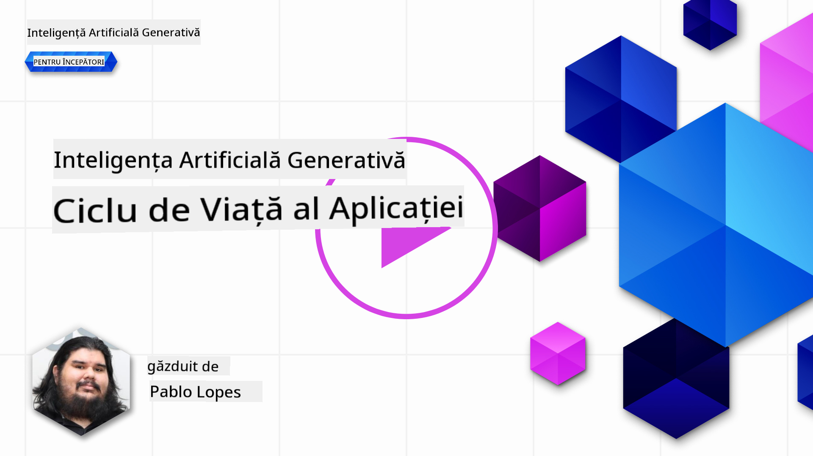
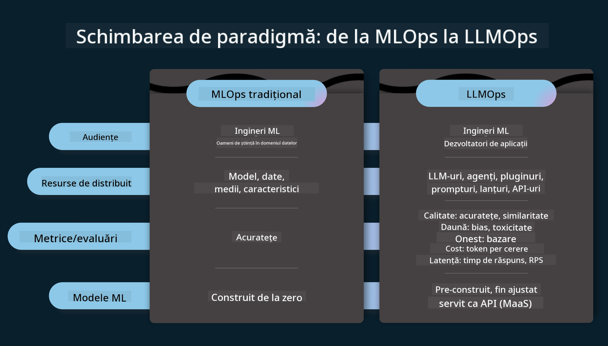
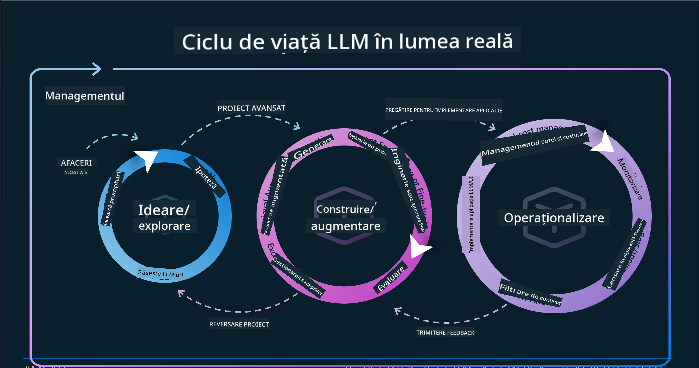
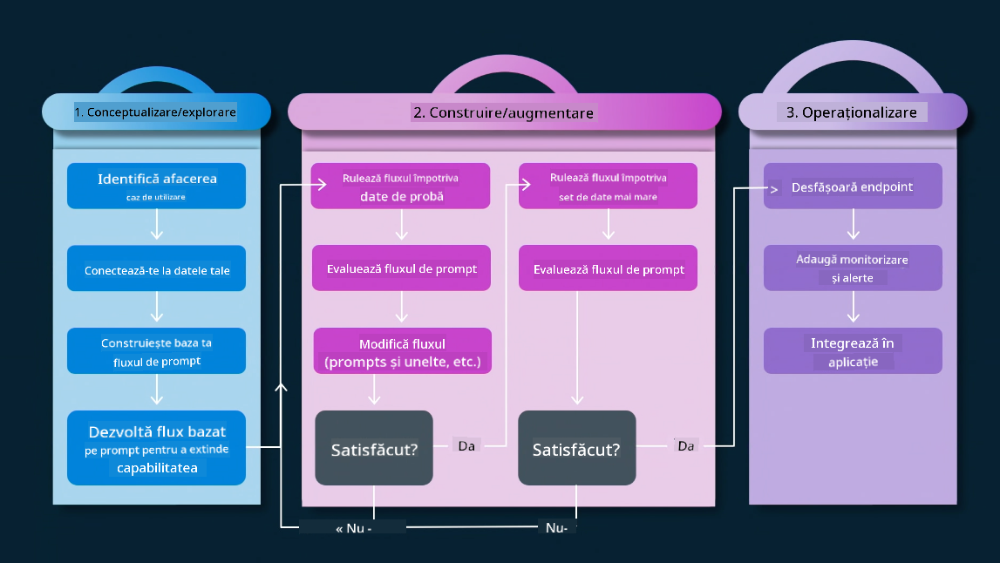
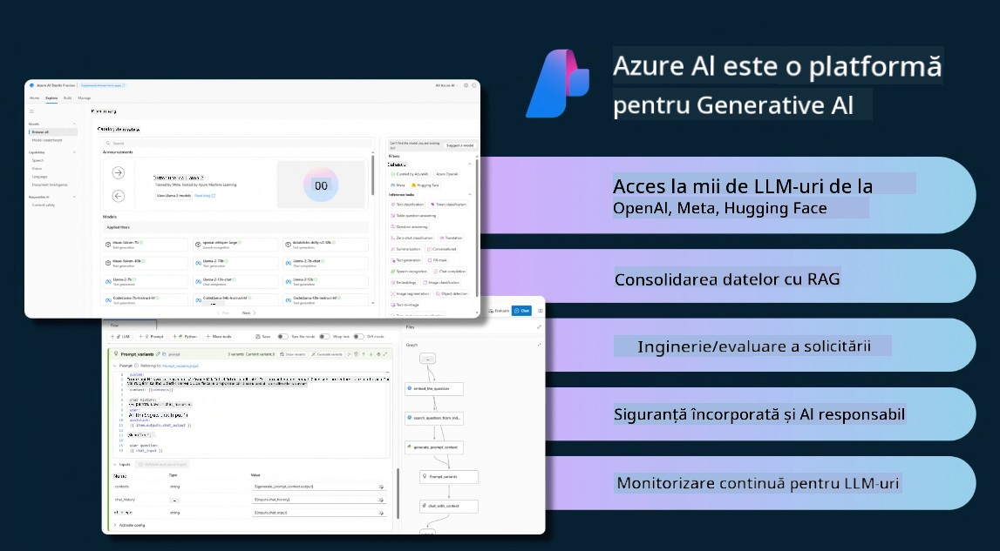
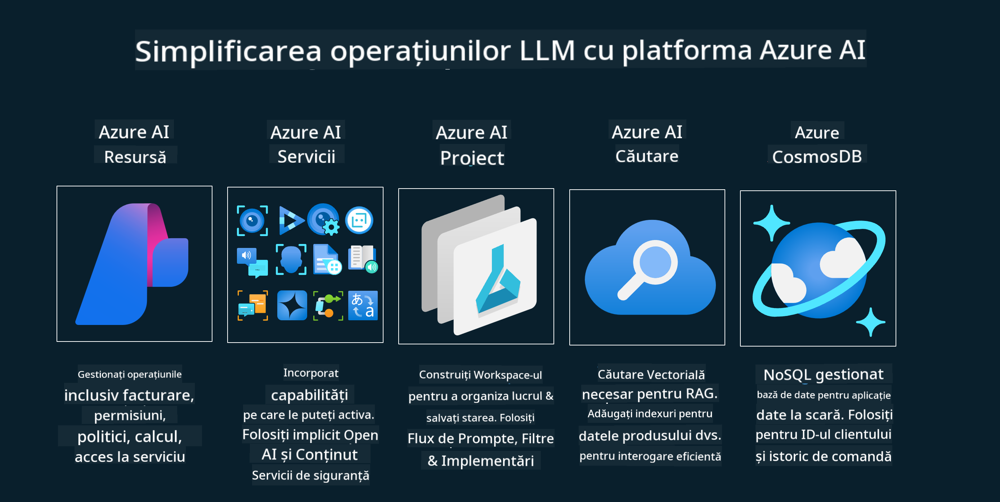
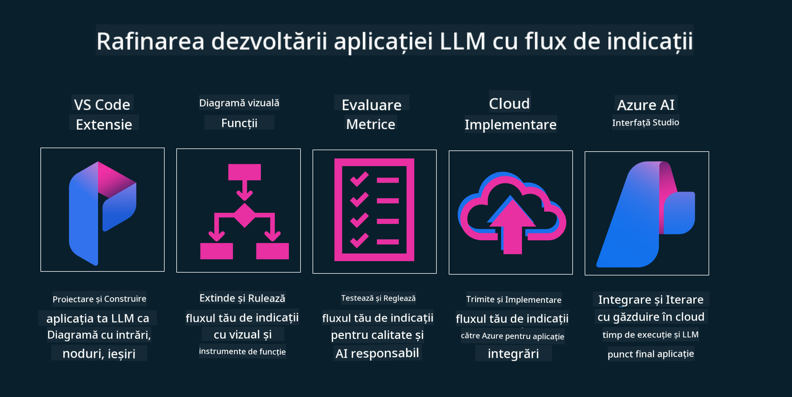

<!--
CO_OP_TRANSLATOR_METADATA:
{
  "original_hash": "27a5347a5022d5ef0a72ab029b03526a",
  "translation_date": "2025-06-25T22:10:35+00:00",
  "source_file": "14-the-generative-ai-application-lifecycle/README.md",
  "language_code": "ro"
}
-->

# Ciclu de viață al aplicației AI generative

O întrebare importantă pentru toate aplicațiile AI este relevanța caracteristicilor AI, având în vedere că AI este un domeniu care evoluează rapid. Pentru a vă asigura că aplicația rămâne relevantă, de încredere și robustă, trebuie să o monitorizați, evaluați și îmbunătățiți continuu. Aici intervine ciclul de viață al AI generative.

Ciclul de viață al AI generative este un cadru care vă ghidează prin etapele de dezvoltare, implementare și întreținere a unei aplicații AI generative. Vă ajută să definiți obiectivele, să măsurați performanța, să identificați provocările și să implementați soluțiile. De asemenea, vă ajută să aliniați aplicația la standardele etice și legale ale domeniului și ale părților interesate. Urmând ciclul de viață al AI generative, vă puteți asigura că aplicația oferă întotdeauna valoare și satisface utilizatorii.

## Introducere

În acest capitol, veți:

- Înțelege schimbarea de paradigmă de la MLOps la LLMOps
- Ciclul de viață al LLM
- Instrumente pentru ciclul de viață
- Metrificarea și evaluarea ciclului de viață

## Înțelege schimbarea de paradigmă de la MLOps la LLMOps

LLM-urile sunt un nou instrument în arsenalul Inteligenței Artificiale, fiind extrem de puternice în sarcini de analiză și generare pentru aplicații. Totuși, această putere are unele consecințe asupra modului în care optimizăm sarcinile AI și de învățare automată clasică.

Astfel, avem nevoie de un nou Paradigm pentru a adapta acest instrument într-un mod dinamic, cu stimulentele corecte. Putem categorisi aplicațiile AI mai vechi ca "Aplicații ML" și aplicațiile AI mai noi ca "Aplicații GenAI" sau pur și simplu "Aplicații AI", reflectând tehnologia și tehnicile mainstream folosite la momentul respectiv. Aceasta schimbă narațiunea noastră în mai multe moduri, priviți următoarea comparație.

Observați că în LLMOps, ne concentrăm mai mult pe dezvoltatorii de aplicații, folosind integrarea ca punct cheie, utilizând "Modele-ca-un-Serviciu" și gândindu-ne la următoarele puncte pentru metrici.

- Calitate: Calitatea răspunsului
- Daună: AI responsabilă
- Onestitate: Fundamentele răspunsului (Are sens? Este corect?)
- Cost: Bugetul soluției
- Latență: Timpul mediu pentru răspunsul token

## Ciclul de viață al LLM

Pentru început, pentru a înțelege ciclul de viață și modificările, să notăm următoarea infografică.

După cum puteți observa, aceasta este diferită de ciclurile de viață obișnuite din MLOps. LLM-urile au multe cerințe noi, cum ar fi Prompting, tehnici diferite pentru a îmbunătăți calitatea (Fine-Tuning, RAG, Meta-Prompts), evaluare și responsabilitate diferită cu AI responsabilă, și, în final, noi metrici de evaluare (Calitate, Daună, Onestitate, Cost și Latență).

De exemplu, să vedem cum ideăm. Folosind ingineria prompturilor pentru a experimenta cu diverse LLM-uri pentru a explora posibilitățile de a testa dacă ipoteza lor ar putea fi corectă.

Observați că aceasta nu este liniară, ci bucle integrate, iterative și cu un ciclu general.

Cum am putea explora acești pași? Să intrăm în detaliu cum am putea construi un ciclu de viață.

Acest lucru poate părea puțin complicat, să ne concentrăm mai întâi pe cei trei pași mari.

1. Ideare/Explorare: Explorare, aici putem explora conform nevoilor noastre de afaceri. Prototipare, crearea unui [PromptFlow](https://microsoft.github.io/promptflow/index.html?WT.mc_id=academic-105485-koreyst) și testarea dacă este suficient de eficient pentru ipoteza noastră.
2. Construire/Augmentare: Implementare, acum, începem să evaluăm pentru seturi de date mai mari, implementând tehnici precum Fine-tuning și RAG, pentru a verifica robustețea soluției noastre. Dacă nu este, reimplementarea, adăugarea de noi pași în fluxul nostru sau restructurarea datelor, ar putea ajuta. După testarea fluxului nostru și a scalabilității, dacă funcționează și verificăm metricile noastre, este gata pentru pasul următor.
3. Operaționalizare: Integrare, acum adăugând sisteme de monitorizare și alerte în sistemul nostru, implementare și integrarea aplicației în aplicația noastră.

Apoi, avem ciclul general de Management, concentrându-ne pe securitate, conformitate și guvernanță.

Felicitări, acum aveți aplicația AI gata de utilizare și operațională. Pentru o experiență practică, aruncați o privire la [Demo-ul Contoso Chat.](https://nitya.github.io/contoso-chat/?WT.mc_id=academic-105485-koreys)

Acum, ce instrumente am putea folosi?

## Instrumente pentru ciclul de viață

Pentru instrumente, Microsoft oferă [Platforma Azure AI](https://azure.microsoft.com/solutions/ai/?WT.mc_id=academic-105485-koreys) și [PromptFlow](https://microsoft.github.io/promptflow/index.html?WT.mc_id=academic-105485-koreyst) pentru a facilita și a face ciclul ușor de implementat și gata de utilizare.

[Platforma Azure AI](https://azure.microsoft.com/solutions/ai/?WT.mc_id=academic-105485-koreys) vă permite să utilizați [AI Studio](https://ai.azure.com/?WT.mc_id=academic-105485-koreys). AI Studio este un portal web care vă permite să explorați modele, mostre și instrumente. Gestionați-vă resursele, fluxurile de dezvoltare UI și opțiunile SDK/CLI pentru dezvoltarea Code-First.

Azure AI vă permite să utilizați multiple resurse, pentru a gestiona operațiunile, serviciile, proiectele, căutarea vectorială și nevoile de baze de date.

Construiți, de la Proof-of-Concept(POC) până la aplicații de mare anvergură cu PromptFlow:

- Proiectați și construiți aplicații din VS Code, cu instrumente vizuale și funcționale
- Testați și ajustați aplicațiile pentru AI de calitate, cu ușurință.
- Utilizați Azure AI Studio pentru a integra și itera cu cloud, împingeți și implementați pentru o integrare rapidă.

## Grozav! Continuați învățarea!

Minunat, acum învățați mai multe despre cum structurăm o aplicație pentru a folosi conceptele cu [Aplicația Contoso Chat](https://nitya.github.io/contoso-chat/?WT.mc_id=academic-105485-koreyst), pentru a vedea cum Advocacy Cloud adaugă aceste concepte în demonstrații. Pentru mai mult conținut, verificați sesiunea noastră de la [Ignite!
](https://www.youtube.com/watch?v=DdOylyrTOWg)

Acum, verificați Lecția 15, pentru a înțelege cum [Generarea Augmentată prin Regăsire și Bazele de Date Vectoriale](../15-rag-and-vector-databases/README.md?WT.mc_id=academic-105485-koreyst) impactează AI generativă și pentru a crea aplicații mai captivante!

**Declinarea responsabilității**:  
Acest document a fost tradus folosind serviciul de traducere AI [Co-op Translator](https://github.com/Azure/co-op-translator). Deși ne străduim să asigurăm acuratețea, vă rugăm să fiți conștienți de faptul că traducerile automate pot conține erori sau inexactități. Documentul original în limba sa maternă ar trebui considerat sursa autoritară. Pentru informații critice, se recomandă traducerea umană profesională. Nu suntem responsabili pentru eventualele neînțelegeri sau interpretări greșite care pot apărea din utilizarea acestei traduceri.