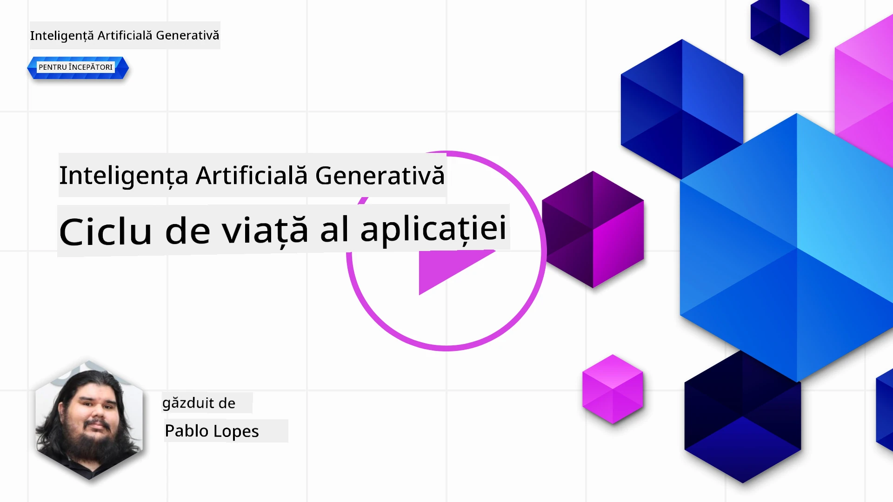
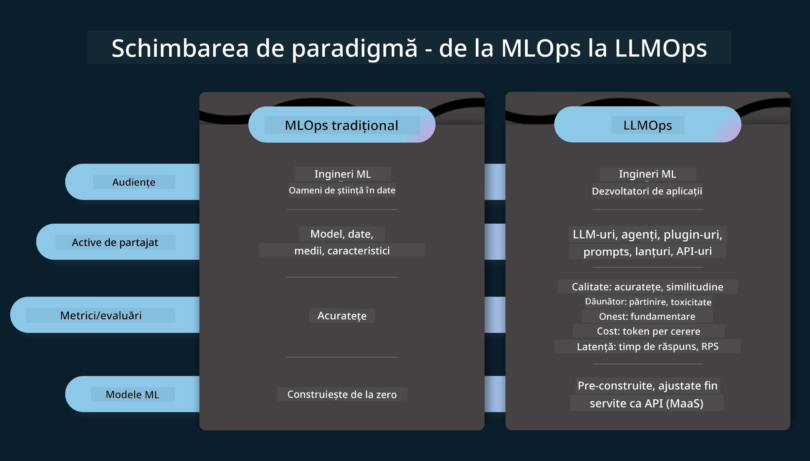
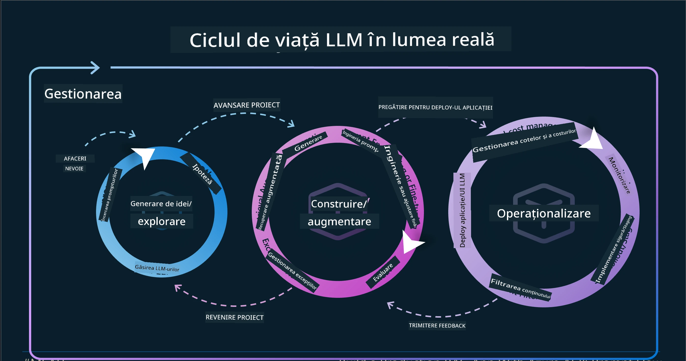
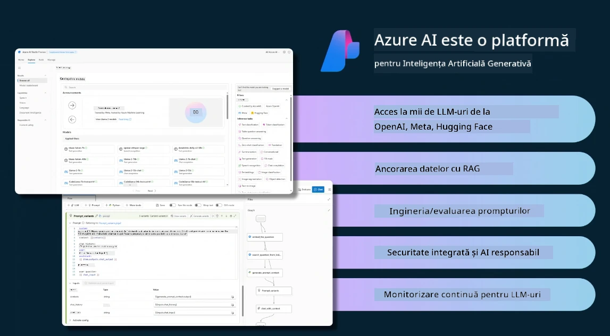
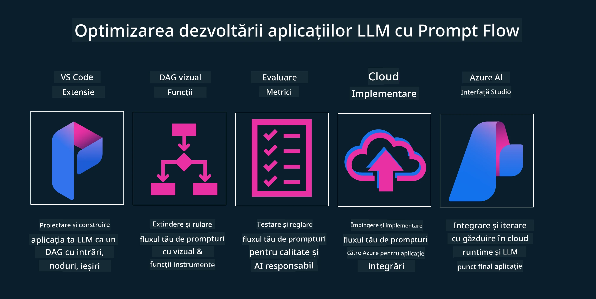

# Ciclu de viață al aplicației AI Generative

O întrebare importantă pentru toate aplicațiile AI este relevanța caracteristicilor AI, deoarece AI este un domeniu care evoluează rapid, pentru a asigura că aplicația ta rămâne relevantă, de încredere și robustă, trebuie să o monitorizezi, evaluezi și îmbunătățești continuu. Aici intervin ciclurile de viață ale AI generative.

Ciclul de viață al AI generative este un cadru care te ghidează prin etapele de dezvoltare, implementare și întreținere a unei aplicații AI generative. Te ajută să-ți definești obiectivele, să-ți măsori performanța, să identifici provocările și să implementezi soluțiile. De asemenea, te ajută să-ți aliniezi aplicația cu standardele etice și legale din domeniul tău și cu așteptările părților interesate. Urmând ciclul de viață al AI generative, te asiguri că aplicația ta oferă în permanență valoare și satisface utilizatorii.

## Introducere

În acest capitol, vei:

- Înțelege schimbarea de paradigmă de la MLOps la LLMOps
- Ciclul de viață LLM
- Instrumente pentru ciclul de viață
- Măsurarea și evaluarea ciclului de viață

## Înțelege schimbarea de paradigmă de la MLOps la LLMOps

LLM-urile sunt un nou instrument în arsenalul Inteligenței Artificiale, sunt incredibil de puternice în sarcini de analiză și generare pentru aplicații, însă această putere are unele consecințe în modul în care raționalizăm sarcinile AI și ale învățării automate clasice.

În acest context, avem nevoie de o nouă paradigmă pentru a adapta acest instrument într-un mod dinamic, cu stimulente corecte. Putem categoria aplicațiile AI mai vechi ca „Aplicații ML” și pe cele noi ca „Aplicații GenAI” sau pur și simplu „Aplicații AI”, reflectând tehnologia și tehnicile mainstream utilizate la momentul respectiv. Acest lucru schimbă narațiunea noastră în multiple moduri, uită-te la comparația următoare.

Observă că în LLMOps, ne concentrăm mai mult pe dezvoltatorii aplicațiilor, folosind integrări ca punct cheie, utilizând „Modele-ca-Serviciu” și gândindu-ne la următorii indicatori pentru metrici.

- Calitate: Calitatea răspunsului
- Daune: AI responsabilă
- Onestitate: Fundamentarea răspunsului (Are sens? Este corect?)
- Cost: Bugetul soluției
- Latență: Timp mediu pentru răspuns pe token

## Ciclul de viață LLM

Mai întâi, pentru a înțelege ciclul de viață și modificările, să observăm următoarea infografică.

După cum observi, acesta este diferit față de ciclurile obișnuite din MLOps. LLM-urile au multe cerințe noi, cum ar fi Promptarea, tehnici diferite pentru îmbunătățirea calității (Fine-Tuning, RAG, Meta-Prompts), evaluare și responsabilitate legată de AI responsabilă, în final, metrici noi de evaluare (Calitate, Daune, Onestitate, Cost și Latență).

De exemplu, uită-te cum generăm idei. Folosind ingineria prompturilor pentru a experimenta cu diverse LLM-uri pentru a explora posibilitățile de a testa dacă ipoteza lor poate fi corectă.

Reține că acest proces nu este liniar, ci bucle integrate, iterative și cu un ciclu general.

Cum am putea explora aceste etape? Să intrăm în detaliu despre cum am putea construi un ciclu de viață.

Aceasta poate părea puțin complicat, să ne concentrăm mai întâi pe cele trei mari etape.

1. Generare de idei/Explorare: Explorare, aici putem explora conform nevoilor noastre de afaceri. Prototipare, crearea unui [PromptFlow](https://microsoft.github.io/promptflow/index.html?WT.mc_id=academic-105485-koreyst) și testarea dacă este suficient de eficient pentru ipoteza noastră.
1. Construire/Augmentare: Implementare, acum începem să evaluăm seturi de date mai mari și să aplicăm tehnici, cum ar fi Fine-tuning și RAG, pentru a verifica robustețea soluției. Dacă nu funcționează, reimplementarea, adăugarea unor noi etape în fluxul nostru sau restructurarea datelor poate ajuta. După testarea fluxului și scalării, dacă funcționează și verificăm metricele, este gata pentru pasul următor.
1. Operaționalizare: Integrare, acum adăugăm sisteme de monitorizare și alerte în sistem, implementare și integrarea aplicației în sistemul nostru.

Apoi, avem ciclul general de management, concentrat pe securitate, conformitate și guvernanță.

Felicitări, acum aplicația ta AI este gata de funcționare și operațională. Pentru o experiență practică, aruncă o privire la [Demo Chat Contoso.](https://nitya.github.io/contoso-chat/?WT.mc_id=academic-105485-koreyst)

Acum, ce instrumente am putea folosi?

## Instrumente pentru ciclul de viață

Pentru instrumentare, Microsoft oferă [Azure AI Platform](https://azure.microsoft.com/solutions/ai/?WT.mc_id=academic-105485-koreyst) iar [PromptFlow](https://microsoft.github.io/promptflow/index.html?WT.mc_id=academic-105485-koreyst) facilitează și face ușor de implementat și gata de utilizare ciclul tău.

[Azure AI Platform](https://azure.microsoft.com/solutions/ai/?WT.mc_id=academic-105485-koreyst) îți permite să folosești [AI Studio](https://ai.azure.com/?WT.mc_id=academic-105485-koreyst). AI Studio este un portal web care îți permite să explorezi modele, exemple și instrumente. Să gestionezi resursele tale, fluxurile de dezvoltare UI și opțiuni SDK/CLI pentru dezvoltarea bazată pe cod.

Azure AI îți permite să utilizezi multiple resurse pentru a gestiona operațiunile, serviciile, proiectele, căutările vectoriale și necesitățile de baze de date.

Construiește, de la Proof-of-Concept(POC) până la aplicații la scară largă cu PromptFlow:

- Proiectează și construiește aplicații din VS Code, cu instrumente vizuale și funcționale
- Testează și ajustează aplicațiile pentru AI de calitate, cu ușurință.
- Folosește Azure AI Studio pentru a integra și itera cu cloud, împinge și implementează pentru o integrare rapidă.

## Grozav! Continuă-ți învățarea!

Minunat, acum află mai multe despre cum structurăm o aplicație pentru a utiliza conceptele cu [Aplicația Contoso Chat](https://nitya.github.io/contoso-chat/?WT.mc_id=academic-105485-koreyst), pentru a vedea cum Cloud Advocacy adaugă aceste concepte în demonstrații. Pentru mai mult conținut, verifică sesiunea noastră de [Ignite breakout!](https://www.youtube.com/watch?v=DdOylyrTOWg)

Acum, verifică Lecția 15 pentru a înțelege cum [Retrieval Augmented Generation și Baze de Date Vectoriale](../15-rag-and-vector-databases/README.md?WT.mc_id=academic-105485-koreyst) impactează AI Generativ și pentru a crea aplicații mai captivante!

---

<!-- CO-OP TRANSLATOR DISCLAIMER START -->
**Declinare de responsabilitate**:  
Acest document a fost tradus folosind serviciul de traducere AI [Co-op Translator](https://github.com/Azure/co-op-translator). Deși ne străduim să asigurăm acuratețea, vă rugăm să țineți cont că traducerile automate pot conține erori sau inexactități. Documentul original în limba sa nativă trebuie considerat sursa autoritară. Pentru informații critice, se recomandă traducerea profesionistă realizată de un specialist uman. Nu ne asumăm răspunderea pentru eventualele neînțelegeri sau interpretări greșite care pot apărea din utilizarea acestei traduceri.
<!-- CO-OP TRANSLATOR DISCLAIMER END -->