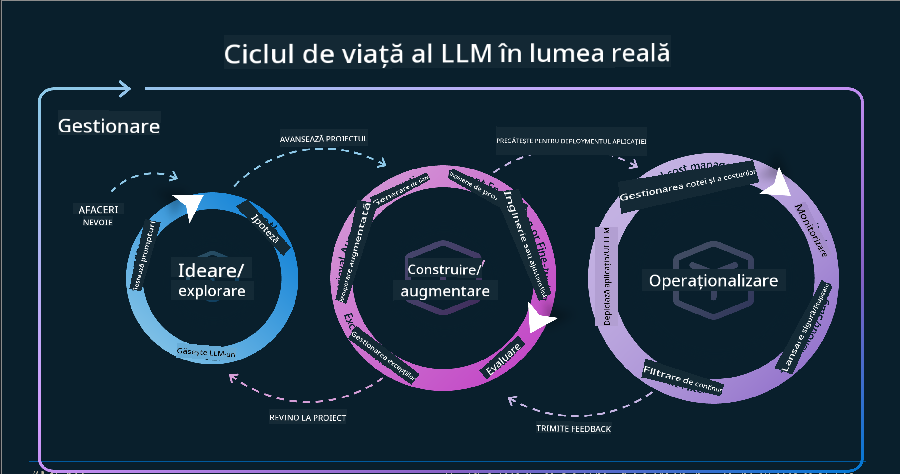

<!--
CO_OP_TRANSLATOR_METADATA:
{
  "original_hash": "27a5347a5022d5ef0a72ab029b03526a",
  "translation_date": "2025-07-09T15:58:37+00:00",
  "source_file": "14-the-generative-ai-application-lifecycle/README.md",
  "language_code": "ro"
}
-->

# Ciclu de viață al aplicațiilor Generative AI

O întrebare importantă pentru toate aplicațiile AI este relevanța funcțiilor AI, deoarece AI este un domeniu în continuă evoluție. Pentru a te asigura că aplicația ta rămâne relevantă, de încredere și robustă, trebuie să o monitorizezi, să o evaluezi și să o îmbunătățești continuu. Aici intervine ciclul de viață al AI generative.

Ciclul de viață al AI generative este un cadru care te ghidează prin etapele dezvoltării, implementării și întreținerii unei aplicații AI generative. Te ajută să-ți definești obiectivele, să-ți măsori performanța, să identifici provocările și să implementezi soluțiile. De asemenea, te ajută să aliniezi aplicația la standardele etice și legale ale domeniului tău și ale părților interesate. Urmând ciclul de viață al AI generative, poți asigura că aplicația ta oferă mereu valoare și satisface utilizatorii.

## Introducere

În acest capitol vei:

- Înțelege schimbarea de paradigmă de la MLOps la LLMOps
- Ciclu de viață LLM
- Unelte pentru ciclul de viață
- Măsurarea și evaluarea ciclului de viață

## Înțelege schimbarea de paradigmă de la MLOps la LLMOps

LLM-urile sunt un nou instrument în arsenalul Inteligenței Artificiale, fiind extrem de puternice în sarcini de analiză și generare pentru aplicații, însă această putere are unele consecințe asupra modului în care optimizăm sarcinile AI și Machine Learning clasice.

Astfel, avem nevoie de o nouă paradigmă pentru a adapta acest instrument într-un mod dinamic, cu stimulente corecte. Putem categorisi aplicațiile AI mai vechi ca „ML Apps” și aplicațiile AI mai noi ca „GenAI Apps” sau pur și simplu „AI Apps”, reflectând tehnologia și tehnicile dominante folosite la momentul respectiv. Aceasta schimbă narațiunea noastră în mai multe moduri, vezi comparația de mai jos.

Observă că în LLMOps ne concentrăm mai mult pe dezvoltatorii de aplicații, folosind integrările ca punct cheie, utilizând „Models-as-a-Service” și gândind în următorii termeni pentru metrici:

- Calitate: Calitatea răspunsului
- Risc: AI responsabil
- Onestitate: Fundamentarea răspunsului (Are sens? Este corect?)
- Cost: Bugetul soluției
- Latență: Timpul mediu pentru răspunsul unui token

## Ciclu de viață LLM

Mai întâi, pentru a înțelege ciclul de viață și modificările, să observăm următoarea infografică.

După cum poți observa, acesta este diferit față de ciclurile obișnuite din MLOps. LLM-urile au multe cerințe noi, precum Prompting, tehnici diferite pentru îmbunătățirea calității (Fine-Tuning, RAG, Meta-Prompts), evaluare și responsabilitate în AI responsabil, și în final, metrici noi de evaluare (Calitate, Risc, Onestitate, Cost și Latență).

De exemplu, uită-te cum generăm idei. Folosim ingineria prompturilor pentru a experimenta cu diverse LLM-uri și a explora posibilitățile de a testa dacă ipoteza noastră ar putea fi corectă.

Reține că acest proces nu este liniar, ci constă în bucle integrate, iterative, cu un ciclu general.

Cum am putea explora acești pași? Hai să detaliem cum am putea construi un ciclu de viață.

Poate părea puțin complicat, să ne concentrăm mai întâi pe cele trei etape mari.

1. Generare de idei/Explorare: Explorare, aici putem explora în funcție de nevoile afacerii noastre. Prototipare, crearea unui [PromptFlow](https://microsoft.github.io/promptflow/index.html?WT.mc_id=academic-105485-koreyst) și testarea dacă este suficient de eficient pentru ipoteza noastră.
1. Construire/Îmbunătățire: Implementare, acum începem să evaluăm pe seturi de date mai mari, implementăm tehnici precum Fine-tuning și RAG pentru a verifica robustețea soluției noastre. Dacă nu funcționează, reimplementarea, adăugarea de pași noi în flux sau restructurarea datelor pot ajuta. După testarea fluxului și a scalabilității, dacă funcționează și metricile sunt bune, este gata pentru pasul următor.
1. Operaționalizare: Integrare, acum adăugăm sisteme de monitorizare și alerte, implementare și integrare în aplicația noastră.

Apoi, avem ciclul general de management, concentrat pe securitate, conformitate și guvernanță.

Felicitări, acum aplicația ta AI este gata și operațională. Pentru o experiență practică, aruncă o privire la [Contoso Chat Demo.](https://nitya.github.io/contoso-chat/?WT.mc_id=academic-105485-koreys)

Acum, ce unelte am putea folosi?

## Unelte pentru ciclul de viață

Pentru unelte, Microsoft oferă [Azure AI Platform](https://azure.microsoft.com/solutions/ai/?WT.mc_id=academic-105485-koreys) iar [PromptFlow](https://microsoft.github.io/promptflow/index.html?WT.mc_id=academic-105485-koreyst) facilitează și face ciclul tău ușor de implementat și gata de utilizare.

[Azure AI Platform](https://azure.microsoft.com/solutions/ai/?WT.mc_id=academic-105485-koreys) îți permite să folosești [AI Studio](https://ai.azure.com/?WT.mc_id=academic-105485-koreys). AI Studio este un portal web care îți permite să explorezi modele, exemple și unelte. Gestionezi resursele, fluxurile de dezvoltare UI și opțiunile SDK/CLI pentru dezvoltare Code-First.

Azure AI îți permite să folosești multiple resurse pentru a-ți gestiona operațiunile, serviciile, proiectele, căutarea vectorială și nevoile de baze de date.

Construiește, de la Proof-of-Concept (POC) până la aplicații la scară largă cu PromptFlow:

- Proiectează și construiește aplicații din VS Code, cu unelte vizuale și funcționale
- Testează și ajustează aplicațiile pentru AI de calitate, cu ușurință
- Folosește Azure AI Studio pentru a integra și itera în cloud, împinge și implementează pentru integrare rapidă

## Grozav! Continuă să înveți!

Minunat, acum află mai multe despre cum structurăm o aplicație pentru a folosi conceptele cu [Contoso Chat App](https://nitya.github.io/contoso-chat/?WT.mc_id=academic-105485-koreyst), pentru a vedea cum Cloud Advocacy adaugă aceste concepte în demonstrații. Pentru mai mult conținut, urmărește sesiunea noastră de la [Ignite breakout!](https://www.youtube.com/watch?v=DdOylyrTOWg)

Acum, verifică Lecția 15, pentru a înțelege cum [Retrieval Augmented Generation și Vector Databases](../15-rag-and-vector-databases/README.md?WT.mc_id=academic-105485-koreyst) influențează Generative AI și pentru a crea aplicații mai captivante!

**Declinare de responsabilitate**:  
Acest document a fost tradus folosind serviciul de traducere AI [Co-op Translator](https://github.com/Azure/co-op-translator). Deși ne străduim pentru acuratețe, vă rugăm să rețineți că traducerile automate pot conține erori sau inexactități. Documentul original în limba sa nativă trebuie considerat sursa autorizată. Pentru informații critice, se recomandă traducerea profesională realizată de un specialist uman. Nu ne asumăm răspunderea pentru eventualele neînțelegeri sau interpretări greșite rezultate din utilizarea acestei traduceri.