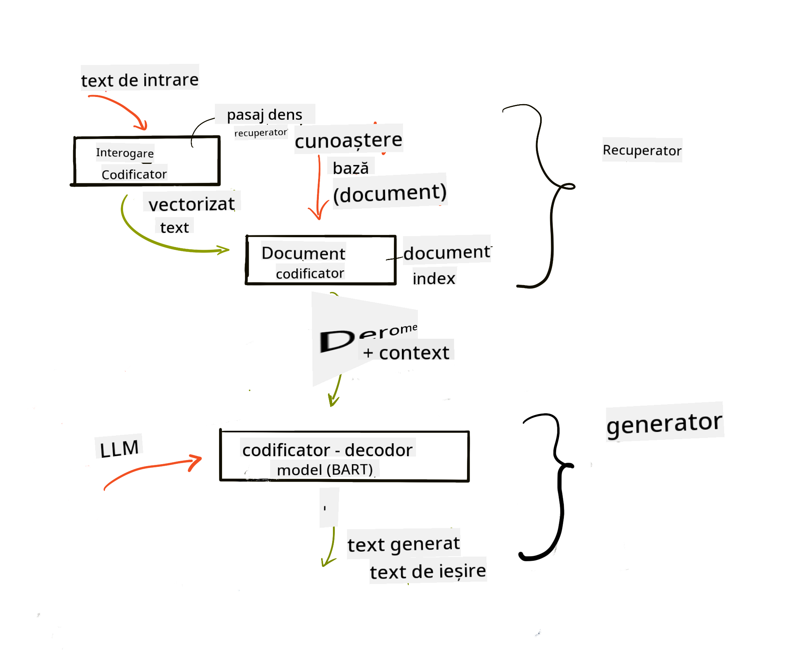
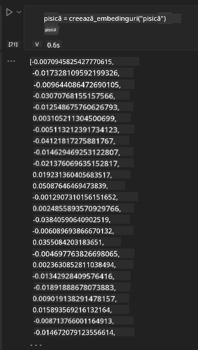

<!--
CO_OP_TRANSLATOR_METADATA:
{
  "original_hash": "e2861bbca91c0567ef32bc77fe054f9e",
  "translation_date": "2025-05-20T01:42:26+00:00",
  "source_file": "15-rag-and-vector-databases/README.md",
  "language_code": "ro"
}
-->
# Generarea Augmentată de Regăsire (RAG) și Baze de Date Vectoriale

[](https://aka.ms/gen-ai-lesson15-gh?WT.mc_id=academic-105485-koreyst)

În lecția despre aplicațiile de căutare, am învățat pe scurt cum să integrezi propriile tale date în Modelele de Limbaj de Mare Anvergură (LLMs). În această lecție, vom aprofunda conceptele de fundamentare a datelor tale în aplicația LLM, mecanismele procesului și metodele de stocare a datelor, inclusiv atât embedding-uri, cât și text.

> **Video în curând**

## Introducere

În această lecție vom acoperi următoarele:

- O introducere în RAG, ce este și de ce este folosit în inteligența artificială (IA).

- Înțelegerea a ce sunt bazele de date vectoriale și crearea uneia pentru aplicația noastră.

- Un exemplu practic despre cum să integrezi RAG într-o aplicație.

## Obiective de Învățare

După finalizarea acestei lecții, vei putea:

- Explica semnificația RAG în regăsirea și procesarea datelor.

- Configura aplicația RAG și fundamenta datele tale într-un LLM

- Integrarea eficientă a RAG și a Bazelor de Date Vectoriale în Aplicațiile LLM.

## Scenariul nostru: îmbunătățirea LLM-urilor noastre cu datele proprii

Pentru această lecție, dorim să adăugăm propriile noastre note în startup-ul educațional, care permite chatbot-ului să obțină mai multe informații despre diferitele subiecte. Folosind notele pe care le avem, cursanții vor putea studia mai bine și înțelege diferitele teme, facilitând revizuirea pentru examenele lor. Pentru a crea scenariul nostru, vom folosi:

- `Azure OpenAI:` LLM-ul pe care îl vom folosi pentru a crea chatbot-ul nostru

- `AI for beginners' lesson on Neural Networks`: acestea vor fi datele pe care ne fundamentăm LLM-ul

- `Azure AI Search` și `Azure Cosmos DB:` baza de date vectorială pentru a stoca datele noastre și a crea un index de căutare

Utilizatorii vor putea crea chestionare de practică din notele lor, carduri de revizuire și le pot rezuma în prezentări concise. Pentru a începe, să vedem ce este RAG și cum funcționează:

## Generarea Augmentată de Regăsire (RAG)

Un chatbot alimentat de un LLM procesează solicitările utilizatorilor pentru a genera răspunsuri. Este conceput să fie interactiv și să interacționeze cu utilizatorii pe o gamă largă de subiecte. Totuși, răspunsurile sale sunt limitate la contextul furnizat și la datele sale de bază de instruire. De exemplu, data limită de cunoaștere a GPT-4 este septembrie 2021, ceea ce înseamnă că nu are cunoștințe despre evenimentele care au avut loc după această perioadă. În plus, datele folosite pentru a antrena LLM-urile exclud informațiile confidențiale, cum ar fi notele personale sau manualul de produse al unei companii.

### Cum funcționează RAG-urile (Generarea Augmentată de Regăsire)


Presupunând că vrei să implementezi un chatbot care creează chestionare din notele tale, vei avea nevoie de o conexiune la baza de cunoștințe. Aici vine în ajutor RAG. RAG-urile funcționează astfel:

- **Baza de cunoștințe:** Înainte de regăsire, aceste documente trebuie să fie ingerate și preprocesate, de obicei descompunând documentele mari în bucăți mai mici, transformându-le în embedding-uri text și stocându-le într-o bază de date.

- **Interogarea utilizatorului:** utilizatorul pune o întrebare

- **Regăsirea:** Când un utilizator pune o întrebare, modelul de embedding regăsește informații relevante din baza noastră de cunoștințe pentru a oferi mai mult context care va fi inclus în solicitare.

- **Generarea Augmentată:** LLM-ul își îmbunătățește răspunsul pe baza datelor regăsite. Permite ca răspunsul generat să fie bazat nu doar pe datele pre-antrenate, ci și pe informații relevante din contextul adăugat. Datele regăsite sunt folosite pentru a augmenta răspunsurile LLM-ului. LLM-ul returnează apoi un răspuns la întrebarea utilizatorului.



Arhitectura pentru RAG-uri este implementată folosind transformatoare constând din două părți: un encoder și un decoder. De exemplu, când un utilizator pune o întrebare, textul de intrare este 'encodat' în vectori care capturează semnificația cuvintelor, iar vectorii sunt 'decodați' în indexul nostru de documente și generează text nou bazat pe interogarea utilizatorului. LLM-ul folosește atât un model encoder-decoder pentru a genera rezultatul.

Două abordări când implementezi RAG conform lucrării propuse: [Generarea Augmentată de Regăsire pentru Sarcini NLP (procesare de limbaj natural) intensive în cunoștințe](https://arxiv.org/pdf/2005.11401.pdf?WT.mc_id=academic-105485-koreyst) sunt:

- **_RAG-Sequence_** folosind documentele regăsite pentru a prezice cel mai bun răspuns posibil la o interogare a utilizatorului

- **RAG-Token** folosind documentele pentru a genera următorul token, apoi le regăsește pentru a răspunde la interogarea utilizatorului

### De ce ai folosi RAG-uri?

- **Bogăția informațiilor:** asigură că răspunsurile text sunt actualizate și curente. Prin urmare, îmbunătățește performanța în sarcinile specifice domeniului prin accesarea bazei de cunoștințe interne.

- Reduce fabricarea prin utilizarea **datelor verificabile** în baza de cunoștințe pentru a oferi context la interogările utilizatorului.

- Este **cost-eficient** deoarece sunt mai economice comparativ cu ajustarea fină a unui LLM

## Crearea unei baze de cunoștințe

Aplicația noastră se bazează pe datele noastre personale, adică lecția despre Rețele Neuronale din curriculum-ul AI Pentru Începători.

### Baze de Date Vectoriale

O bază de date vectorială, spre deosebire de bazele de date tradiționale, este o bază de date specializată concepută pentru a stoca, gestiona și căuta vectori embeddați. Stochează reprezentări numerice ale documentelor. Descompunerea datelor în embedding-uri numerice face mai ușor pentru sistemul nostru AI să înțeleagă și să proceseze datele.

Stocăm embedding-urile noastre în baze de date vectoriale deoarece LLM-urile au o limită a numărului de tokeni pe care îi acceptă ca intrare. Deoarece nu poți trece toate embedding-urile printr-un LLM, va trebui să le descompui în bucăți și când un utilizator pune o întrebare, embedding-urile cele mai asemănătoare întrebării vor fi returnate împreună cu solicitarea. Descompunerea reduce, de asemenea, costurile legate de numărul de tokeni trecuți printr-un LLM.

Unele baze de date vectoriale populare includ Azure Cosmos DB, Clarifyai, Pinecone, Chromadb, ScaNN, Qdrant și DeepLake. Poți crea un model Azure Cosmos DB folosind Azure CLI cu următoarea comandă:

```bash
az login
az group create -n <resource-group-name> -l <location>
az cosmosdb create -n <cosmos-db-name> -r <resource-group-name>
az cosmosdb list-keys -n <cosmos-db-name> -g <resource-group-name>
```

### De la text la embedding-uri

Înainte de a stoca datele noastre, va trebui să le convertim în embedding-uri vectoriale înainte de a fi stocate în baza de date. Dacă lucrezi cu documente mari sau texte lungi, le poți descompune pe baza interogărilor pe care le aștepți. Descompunerea se poate face la nivel de propoziție sau la nivel de paragraf. Deoarece descompunerea derivă semnificații din cuvintele din jurul lor, poți adăuga un alt context unei bucăți, de exemplu, prin adăugarea titlului documentului sau includerea unui text înainte sau după bucata respectivă. Poți descompune datele astfel:

```python
def split_text(text, max_length, min_length):
    words = text.split()
    chunks = []
    current_chunk = []

    for word in words:
        current_chunk.append(word)
        if len(' '.join(current_chunk)) < max_length and len(' '.join(current_chunk)) > min_length:
            chunks.append(' '.join(current_chunk))
            current_chunk = []

    # If the last chunk didn't reach the minimum length, add it anyway
    if current_chunk:
        chunks.append(' '.join(current_chunk))

    return chunks
```

Odată descompus, putem apoi să embedăm textul nostru folosind diferite modele de embedding. Unele modele pe care le poți folosi includ: word2vec, ada-002 de la OpenAI, Azure Computer Vision și multe altele. Selectarea unui model de utilizat va depinde de limbile pe care le folosești, tipul de conținut codificat (text/imagine/audio), dimensiunea intrării pe care o poate codifica și lungimea ieșirii embedding-ului.

Un exemplu de text embedat folosind modelul `text-embedding-ada-002` de la OpenAI este:


## Regăsire și Căutare Vectorială

Când un utilizator pune o întrebare, sistemul de regăsire o transformă într-un vector folosind encoderul de interogare, apoi caută în indexul nostru de căutare a documentelor vectorii relevanți din document care sunt legați de intrare. Odată ce este gata, convertește atât vectorul de intrare, cât și vectorii documentului în text și îl trece prin LLM.

### Regăsire

Regăsirea se întâmplă atunci când sistemul încearcă să găsească rapid documentele din index care satisfac criteriile de căutare. Scopul sistemului de regăsire este de a obține documente care vor fi folosite pentru a oferi context și a fundamenta LLM-ul pe datele tale.

Există mai multe moduri de a efectua căutări în baza noastră de date, cum ar fi:

- **Căutare după cuvinte cheie** - folosită pentru căutări textuale

- **Căutare semantică** - folosește semnificația semantică a cuvintelor

- **Căutare vectorială** - convertește documentele din text în reprezentări vectoriale folosind modele de embedding. Regăsirea se va face prin interogarea documentelor ale căror reprezentări vectoriale sunt cele mai apropiate de întrebarea utilizatorului.

- **Hibrid** - o combinație de căutare după cuvinte cheie și căutare vectorială.

O provocare cu regăsirea apare atunci când nu există un răspuns similar cu interogarea în baza de date, sistemul va returna atunci cele mai bune informații pe care le pot obține, totuși, poți folosi tactici precum stabilirea distanței maxime pentru relevanță sau folosirea căutării hibride care combină atât cuvinte cheie, cât și căutare vectorială. În această lecție vom folosi căutarea hibridă, o combinație de căutare vectorială și după cuvinte cheie. Vom stoca datele noastre într-un dataframe cu coloane care conțin bucățile, precum și embedding-urile.

### Similaritate Vectorială

Sistemul de regăsire va căuta în baza de cunoștințe embedding-uri care sunt apropiate, cel mai apropiat vecin, deoarece sunt texte similare. În scenariul în care un utilizator pune o interogare, aceasta este mai întâi embedată, apoi se potrivește cu embedding-uri similare. Măsurarea comună care este folosită pentru a găsi cât de similare sunt diferite vectori este similaritatea cosinus, care se bazează pe unghiul dintre doi vectori.

Putem măsura similaritatea folosind alte alternative, cum ar fi distanța euclidiană, care este linia dreaptă între punctele finale ale vectorilor și produsul punct care măsoară suma produselor elementelor corespunzătoare ale doi vectori.

### Index de căutare

Când facem regăsire, va trebui să construim un index de căutare pentru baza noastră de cunoștințe înainte de a efectua căutarea. Un index va stoca embedding-urile noastre și poate regăsi rapid cele mai similare bucăți chiar și într-o bază de date mare. Putem crea indexul nostru local folosind:

```python
from sklearn.neighbors import NearestNeighbors

embeddings = flattened_df['embeddings'].to_list()

# Create the search index
nbrs = NearestNeighbors(n_neighbors=5, algorithm='ball_tree').fit(embeddings)

# To query the index, you can use the kneighbors method
distances, indices = nbrs.kneighbors(embeddings)
```

### Reordonare

Odată ce ai interogat baza de date, s-ar putea să fie nevoie să sortezi rezultatele de la cele mai relevante. Un LLM de reordonare utilizează Învățarea Automată pentru a îmbunătăți relevanța rezultatelor căutării prin ordonarea lor de la cele mai relevante. Folosind Azure AI Search, reordonarea se face automat pentru tine folosind un reordonator semantic. Un exemplu despre cum funcționează reordonarea folosind cei mai apropiați vecini:

```python
# Find the most similar documents
distances, indices = nbrs.kneighbors([query_vector])

index = []
# Print the most similar documents
for i in range(3):
    index = indices[0][i]
    for index in indices[0]:
        print(flattened_df['chunks'].iloc[index])
        print(flattened_df['path'].iloc[index])
        print(flattened_df['distances'].iloc[index])
    else:
        print(f"Index {index} not found in DataFrame")
```

## Punând totul împreună

Ultimul pas este adăugarea LLM-ului nostru în amestec pentru a putea obține răspunsuri care sunt fundamentate pe datele noastre. Putem implementa astfel:

```python
user_input = "what is a perceptron?"

def chatbot(user_input):
    # Convert the question to a query vector
    query_vector = create_embeddings(user_input)

    # Find the most similar documents
    distances, indices = nbrs.kneighbors([query_vector])

    # add documents to query  to provide context
    history = []
    for index in indices[0]:
        history.append(flattened_df['chunks'].iloc[index])

    # combine the history and the user input
    history.append(user_input)

    # create a message object
    messages=[
        {"role": "system", "content": "You are an AI assistant that helps with AI questions."},
        {"role": "user", "content": history[-1]}
    ]

    # use chat completion to generate a response
    response = openai.chat.completions.create(
        model="gpt-4",
        temperature=0.7,
        max_tokens=800,
        messages=messages
    )

    return response.choices[0].message

chatbot(user_input)
```

## Evaluarea aplicației noastre

### Metrici de Evaluare

- Calitatea răspunsurilor furnizate asigurându-se că sună natural, fluent și uman

- Fundamentarea datelor: evaluând dacă răspunsul provine din documentele furnizate

- Relevanță: evaluând dacă răspunsul se potrivește și este legat de întrebarea pusă

- Fluență - dacă răspunsul are sens gramatical

## Cazuri de Utilizare pentru folosirea RAG (Generarea Augmentată de Regăsire) și bazele de date vectoriale

Există multe cazuri de utilizare diferite unde apelurile funcționale pot îmbunătăți aplicația ta, cum ar fi:

- Întrebări și Răspunsuri: fundamentarea datelor companiei tale la un chat care poate fi folosit de angajați pentru a pune întrebări.

- Sisteme de Recomandare: unde poți crea un sistem care potrivește cele mai similare valori, de exemplu, filme, restaurante și multe altele.

- Servicii de Chatbot: poți stoca istoricul chatului și personaliza conversația pe baza datelor utilizatorului.

- Căutare de imagini bazată pe embedding-uri vectoriale, utilă atunci când faci recunoaștere de imagini și detectare de anomalii.

## Rezumat

Am acoperit aspectele fundamentale ale RAG de la adăugarea datelor noastre la aplicație, interogarea utilizatorului și ieșirea. Pentru a simplifica crearea RAG, poți folosi cadre precum Semanti Kernel, Langchain sau Autogen.

## Sarcină

Pentru a continua învățarea Generării Augmentate de Regăsire (RAG) poți construi:

- Construiește o interfață pentru aplicație folosind cadrul la alegerea ta

- Utilizează un cadru, fie LangChain, fie Semantic Kernel, și recreează aplicația ta.

Felicitări pentru finalizarea lecției 👏.

## Învățarea nu se oprește aici, continuă călătoria

După finalizarea acestei lecții, verifică [colecția noastră de Învățare a AI Generative](https://aka.ms/genai-collection?WT.mc_id=academic-105485-koreyst) pentru a continua să îți îmbunătățești cunoștințele despre AI Generativă!

**Declinare de responsabilitate**:  
Acest document a fost tradus folosind serviciul de traducere AI [Co-op Translator](https://github.com/Azure/co-op-translator). Deși ne străduim să obținem acuratețe, vă rugăm să fiți conștienți că traducerile automate pot conține erori sau inexactități. Documentul original în limba sa maternă ar trebui considerat sursa autoritară. Pentru informații critice, se recomandă traducerea umană profesională. Nu ne asumăm responsabilitatea pentru neînțelegeri sau interpretări greșite care decurg din utilizarea acestei traduceri.