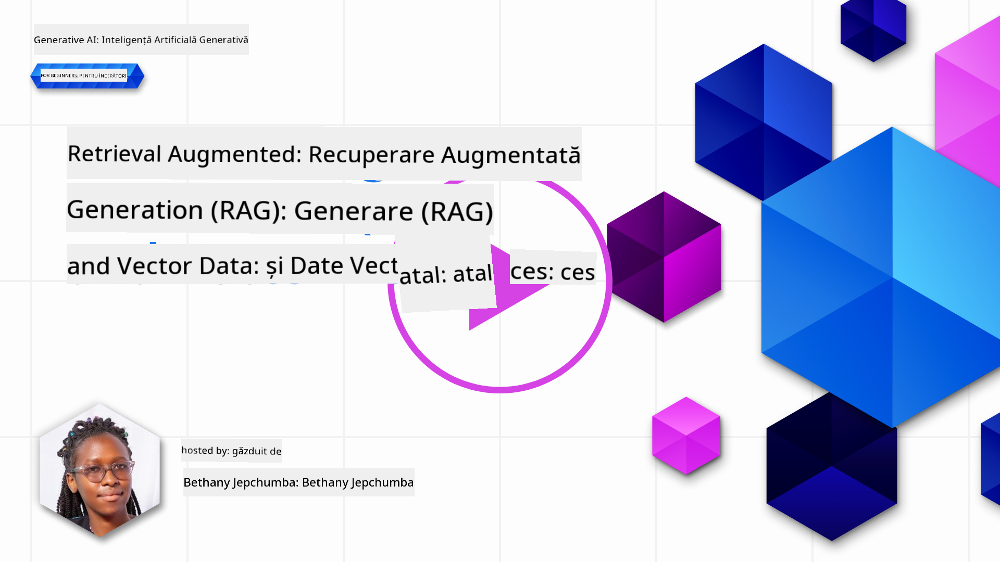
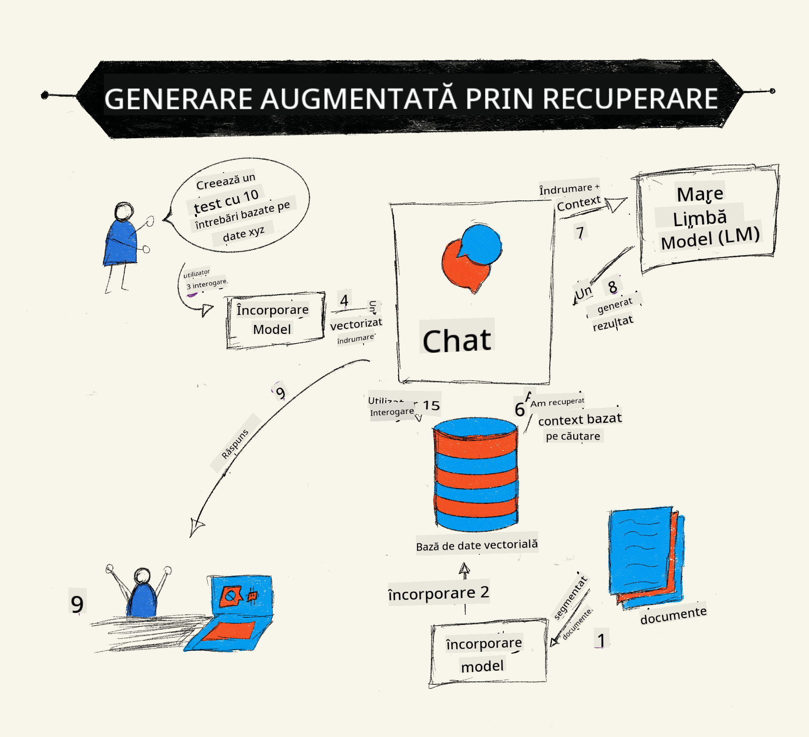
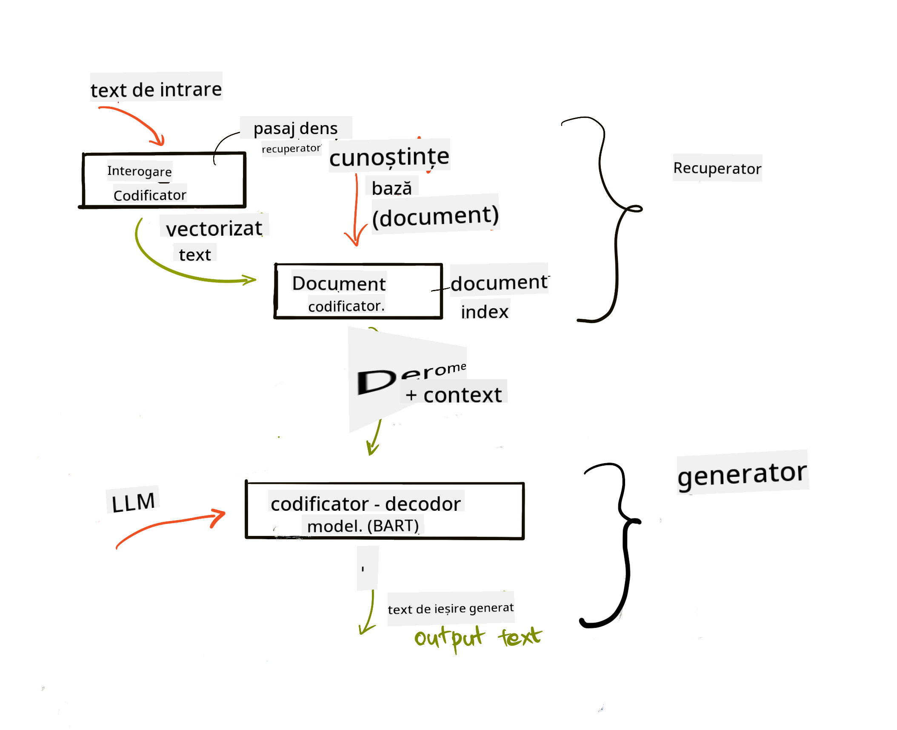

<!--
CO_OP_TRANSLATOR_METADATA:
{
  "original_hash": "e2861bbca91c0567ef32bc77fe054f9e",
  "translation_date": "2025-07-09T16:20:03+00:00",
  "source_file": "15-rag-and-vector-databases/README.md",
  "language_code": "ro"
}
-->
# Retrieval Augmented Generation (RAG) și Baze de Date Vectoriale

[](https://aka.ms/gen-ai-lesson15-gh?WT.mc_id=academic-105485-koreyst)

În lecția despre aplicații de căutare, am învățat pe scurt cum să integrezi propriile date în Modelele Mari de Limbaj (LLM-uri). În această lecție, vom aprofunda conceptele de ancorare a datelor în aplicația ta LLM, mecanica procesului și metodele de stocare a datelor, inclusiv atât embeddings, cât și text.

> **Video în curând**

## Introducere

În această lecție vom acoperi următoarele:

- O introducere în RAG, ce este și de ce este folosit în AI (inteligență artificială).

- Înțelegerea bazelor de date vectoriale și crearea uneia pentru aplicația noastră.

- Un exemplu practic despre cum să integrezi RAG într-o aplicație.

## Obiective de învățare

După finalizarea acestei lecții, vei putea:

- Explica importanța RAG în recuperarea și procesarea datelor.

- Configura o aplicație RAG și ancorează-ți datele într-un LLM.

- Integrarea eficientă a RAG și bazelor de date vectoriale în aplicațiile LLM.

## Scenariul nostru: îmbunătățirea LLM-urilor cu propriile noastre date

Pentru această lecție, dorim să adăugăm propriile noastre notițe în startup-ul educațional, ceea ce permite chatbot-ului să obțină mai multe informații despre diferite subiecte. Folosind notițele pe care le avem, cursanții vor putea studia mai bine și înțelege diferitele teme, facilitând astfel revizuirea pentru examene. Pentru a crea scenariul nostru, vom folosi:

- `Azure OpenAI:` LLM-ul pe care îl vom folosi pentru a crea chatbot-ul nostru

- `Lecția AI pentru începători despre Rețele Neuronale:` aceasta va fi baza de date pe care ne vom ancora LLM-ul

- `Azure AI Search` și `Azure Cosmos DB:` baza de date vectorială pentru stocarea datelor și crearea unui index de căutare

Utilizatorii vor putea crea teste practice din notițele lor, carduri de revizuire și rezumate concise. Pentru a începe, să vedem ce este RAG și cum funcționează:

## Retrieval Augmented Generation (RAG)

Un chatbot alimentat de un LLM procesează prompturile utilizatorilor pentru a genera răspunsuri. Este conceput să fie interactiv și să interacționeze cu utilizatorii pe o gamă largă de subiecte. Totuși, răspunsurile sale sunt limitate la contextul oferit și la datele de antrenament de bază. De exemplu, cunoștințele GPT-4 sunt actualizate până în septembrie 2021, ceea ce înseamnă că nu are informații despre evenimentele care au avut loc după această perioadă. În plus, datele folosite pentru antrenarea LLM-urilor exclud informații confidențiale, cum ar fi notițele personale sau manualul de produs al unei companii.

### Cum funcționează RAG-urile (Retrieval Augmented Generation)



Să presupunem că vrei să lansezi un chatbot care creează teste din notițele tale, vei avea nevoie de o conexiune la baza de cunoștințe. Aici intervine RAG. RAG-urile funcționează astfel:

- **Baza de cunoștințe:** Înainte de recuperare, aceste documente trebuie preluate și preprocesate, de obicei prin împărțirea documentelor mari în bucăți mai mici, transformarea lor în embeddings textuale și stocarea lor într-o bază de date.

- **Întrebarea utilizatorului:** utilizatorul pune o întrebare

- **Recuperare:** Când utilizatorul pune o întrebare, modelul de embedding recuperează informații relevante din baza noastră de cunoștințe pentru a oferi mai mult context care va fi încorporat în prompt.

- **Generare augmentată:** LLM-ul își îmbunătățește răspunsul pe baza datelor recuperate. Astfel, răspunsul generat nu se bazează doar pe datele pre-antrenate, ci și pe informații relevante din contextul adăugat. Datele recuperate sunt folosite pentru a augmenta răspunsurile LLM-ului. LLM-ul returnează apoi un răspuns la întrebarea utilizatorului.



Arhitectura RAG-urilor este implementată folosind transformere, constând din două părți: un encoder și un decoder. De exemplu, când un utilizator pune o întrebare, textul de intrare este „encodat” în vectori care surprind sensul cuvintelor, iar vectorii sunt „decodați” în indexul nostru de documente și generează text nou bazat pe întrebarea utilizatorului. LLM-ul folosește un model encoder-decoder pentru a genera output-ul.

Două abordări pentru implementarea RAG conform lucrării propuse: [Retrieval-Augmented Generation for Knowledge intensive NLP Tasks](https://arxiv.org/pdf/2005.11401.pdf?WT.mc_id=academic-105485-koreyst) sunt:

- **_RAG-Sequence_** folosind documentele recuperate pentru a prezice cel mai bun răspuns posibil la o întrebare a utilizatorului

- **RAG-Token** folosind documentele pentru a genera următorul token, apoi le recuperează pentru a răspunde întrebării utilizatorului

### De ce ai folosi RAG-uri?

- **Bogăția informațiilor:** asigură că răspunsurile textuale sunt actualizate și relevante. Astfel, îmbunătățește performanța în sarcini specifice domeniului prin accesarea bazei interne de cunoștințe.

- Reduce fabricarea de informații prin utilizarea **datelor verificabile** din baza de cunoștințe pentru a oferi context întrebărilor utilizatorilor.

- Este **cost-eficient** deoarece este mai economic comparativ cu fine-tuning-ul unui LLM.

## Crearea unei baze de cunoștințe

Aplicația noastră se bazează pe datele noastre personale, adică lecția despre Rețele Neuronale din curriculumul AI pentru Începători.

### Baze de date vectoriale

O bază de date vectorială, spre deosebire de bazele de date tradiționale, este o bază specializată concepută pentru a stoca, gestiona și căuta vectori încorporați. Aceasta stochează reprezentări numerice ale documentelor. Împărțirea datelor în embeddings numerice face mai ușoară înțelegerea și procesarea datelor de către sistemul nostru AI.

Stocăm embeddings în baze de date vectoriale deoarece LLM-urile au o limită a numărului de tokeni pe care îi pot primi ca input. Deoarece nu poți transmite întregul embedding către un LLM, va trebui să le împărțim în bucăți, iar când un utilizator pune o întrebare, embeddings cele mai apropiate de întrebare vor fi returnate împreună cu promptul. Împărțirea în bucăți reduce și costurile legate de numărul de tokeni procesați de LLM.

Unele baze de date vectoriale populare includ Azure Cosmos DB, Clarifyai, Pinecone, Chromadb, ScaNN, Qdrant și DeepLake. Poți crea un model Azure Cosmos DB folosind Azure CLI cu următoarea comandă:

```bash
az login
az group create -n <resource-group-name> -l <location>
az cosmosdb create -n <cosmos-db-name> -r <resource-group-name>
az cosmosdb list-keys -n <cosmos-db-name> -g <resource-group-name>
```

### Din text în embeddings

Înainte să stocăm datele, trebuie să le convertim în embeddings vectoriale înainte de a le salva în baza de date. Dacă lucrezi cu documente mari sau texte lungi, le poți împărți în bucăți în funcție de întrebările pe care le aștepți. Împărțirea poate fi făcută la nivel de propoziție sau paragraf. Deoarece împărțirea derivă sensul din cuvintele din jur, poți adăuga context suplimentar unei bucăți, de exemplu, titlul documentului sau un text înainte sau după bucata respectivă. Poți împărți datele astfel:

```python
def split_text(text, max_length, min_length):
    words = text.split()
    chunks = []
    current_chunk = []

    for word in words:
        current_chunk.append(word)
        if len(' '.join(current_chunk)) < max_length and len(' '.join(current_chunk)) > min_length:
            chunks.append(' '.join(current_chunk))
            current_chunk = []

    # If the last chunk didn't reach the minimum length, add it anyway
    if current_chunk:
        chunks.append(' '.join(current_chunk))

    return chunks
```

Odată împărțite, putem apoi să încorporăm textul folosind diferite modele de embedding. Unele modele pe care le poți folosi includ: word2vec, ada-002 de la OpenAI, Azure Computer Vision și multe altele. Alegerea modelului depinde de limbile folosite, tipul de conținut codificat (text/imagine/audio), dimensiunea inputului pe care îl poate codifica și lungimea output-ului embedding.

Un exemplu de text încorporat folosind modelul `text-embedding-ada-002` de la OpenAI este:


## Recuperare și căutare vectorială

Când un utilizator pune o întrebare, retriever-ul o transformă într-un vector folosind encoder-ul de interogări, apoi caută în indexul nostru de documente vectorii relevanți care sunt legați de input. După aceea, convertește atât vectorul de input, cât și vectorii documentelor în text și le transmite LLM-ului.

### Recuperare

Recuperarea are loc când sistemul încearcă să găsească rapid documentele din index care satisfac criteriile de căutare. Scopul retriever-ului este să obțină documente care vor fi folosite pentru a oferi context și a ancora LLM-ul pe datele tale.

Există mai multe metode de căutare în baza noastră de date, cum ar fi:

- **Căutare după cuvinte cheie** - folosită pentru căutări textuale

- **Căutare semantică** - folosește sensul semantic al cuvintelor

- **Căutare vectorială** - convertește documentele din text în reprezentări vectoriale folosind modele de embedding. Recuperarea se face prin interogarea documentelor ale căror vectori sunt cei mai apropiați de întrebarea utilizatorului.

- **Hibridă** - o combinație între căutarea după cuvinte cheie și căutarea vectorială.

O provocare la recuperare apare când nu există un răspuns similar în baza de date; sistemul va returna atunci cele mai bune informații disponibile, însă poți folosi tactici precum setarea unei distanțe maxime pentru relevanță sau utilizarea căutării hibride care combină ambele metode. În această lecție vom folosi căutarea hibridă, o combinație între căutarea vectorială și cea după cuvinte cheie. Vom stoca datele într-un dataframe cu coloane care conțin bucățile de text și embeddings.

### Similaritatea vectorială

Retriever-ul va căuta în baza de cunoștințe embeddings care sunt apropiate între ele, cel mai apropiat vecin, deoarece sunt texte similare. În scenariu, când un utilizator pune o întrebare, aceasta este mai întâi încorporată, apoi comparată cu embeddings similare. Măsura comună folosită pentru a determina cât de similare sunt vectorii este similaritatea cosinus, bazată pe unghiul dintre doi vectori.

Putem măsura similaritatea și folosind alte metode, cum ar fi distanța Euclidiană, care este linia dreaptă dintre capetele vectorilor, și produsul scalar, care măsoară suma produselor elementelor corespunzătoare a doi vectori.

### Indexul de căutare

Pentru a face recuperarea, trebuie să construim un index de căutare pentru baza noastră de cunoștințe înainte de a efectua căutarea. Un index va stoca embeddings și poate recupera rapid cele mai similare bucăți chiar și într-o bază de date mare. Putem crea indexul local folosind:

```python
from sklearn.neighbors import NearestNeighbors

embeddings = flattened_df['embeddings'].to_list()

# Create the search index
nbrs = NearestNeighbors(n_neighbors=5, algorithm='ball_tree').fit(embeddings)

# To query the index, you can use the kneighbors method
distances, indices = nbrs.kneighbors(embeddings)
```

### Re-rangare

După ce ai interogat baza de date, poate fi necesar să sortezi rezultatele de la cele mai relevante. Un LLM de re-rangare folosește Machine Learning pentru a îmbunătăți relevanța rezultatelor de căutare prin ordonarea lor de la cele mai relevante. Folosind Azure AI Search, re-rangarea se face automat cu un semantic reranker. Un exemplu de cum funcționează re-rangarea folosind cei mai apropiați vecini:

```python
# Find the most similar documents
distances, indices = nbrs.kneighbors([query_vector])

index = []
# Print the most similar documents
for i in range(3):
    index = indices[0][i]
    for index in indices[0]:
        print(flattened_df['chunks'].iloc[index])
        print(flattened_df['path'].iloc[index])
        print(flattened_df['distances'].iloc[index])
    else:
        print(f"Index {index} not found in DataFrame")
```

## Punând totul cap la cap

Ultimul pas este să adăugăm LLM-ul în ecuație pentru a putea obține răspunsuri ancorate în datele noastre. Putem implementa astfel:

```python
user_input = "what is a perceptron?"

def chatbot(user_input):
    # Convert the question to a query vector
    query_vector = create_embeddings(user_input)

    # Find the most similar documents
    distances, indices = nbrs.kneighbors([query_vector])

    # add documents to query  to provide context
    history = []
    for index in indices[0]:
        history.append(flattened_df['chunks'].iloc[index])

    # combine the history and the user input
    history.append(user_input)

    # create a message object
    messages=[
        {"role": "system", "content": "You are an AI assistant that helps with AI questions."},
        {"role": "user", "content": history[-1]}
    ]

    # use chat completion to generate a response
    response = openai.chat.completions.create(
        model="gpt-4",
        temperature=0.7,
        max_tokens=800,
        messages=messages
    )

    return response.choices[0].message

chatbot(user_input)
```

## Evaluarea aplicației noastre

### Metrici de evaluare

- Calitatea răspunsurilor oferite, asigurându-se că sună natural, fluent și uman

- Ancorarea datelor: evaluarea dacă răspunsul provine din documentele furnizate

- Relevanța: evaluarea dacă răspunsul corespunde și este legat de întrebarea pusă

- Fluența - dacă răspunsul are sens din punct de vedere gramatical

## Cazuri de utilizare pentru RAG (Retrieval Augmented Generation) și baze de date vectoriale

Există multe cazuri de utilizare în care apelurile funcțiilor pot îmbunătăți aplicația ta, cum ar fi:

- Întrebări și răspunsuri: ancorarea datelor companiei tale într-un chat folosit de angajați pentru a pune întrebări.

- Sisteme de recomandare: unde poți crea un sistem care potrivește cele mai similare valori, de exemplu filme, restaurante și altele.

- Servicii chatbot: poți stoca istoricul conversațiilor și personaliza dialogul pe baza datelor utilizatorului.

- Căutare de imagini bazată pe embeddings vectoriale, utilă în recunoașterea imaginilor și detectarea anomaliilor.

## Rezumat

Am acoperit aspectele fundamentale ale RAG, de la adăugarea datelor în aplicație, întrebarea utilizatorului și output-ul. Pentru a simplifica crearea RAG, poți folosi framework-uri precum Semantic Kernel, Langchain sau Autogen.

## Tema

Pentru a continua învățarea despre Retrieval Augmented Generation (RAG), poți construi:

- Un front-end pentru aplicație folosind framework-ul preferat

- Folosește un framework, fie LangChain, fie Semantic Kernel, și recreează aplicația ta.

Felicitări pentru finalizarea lecției 👏.

## Învățarea nu se oprește aici, continuă călătoria

După ce ai terminat această lecție, consultă colecția noastră [Generative AI Learning collection](https://aka.ms/genai-collection?WT.mc_id=academic-105485-koreyst) pentru a-ți continua dezvoltarea cunoștințelor în Generative AI!

**Declinare de responsabilitate**:  
Acest document a fost tradus folosind serviciul de traducere AI [Co-op Translator](https://github.com/Azure/co-op-translator). Deși ne străduim pentru acuratețe, vă rugăm să rețineți că traducerile automate pot conține erori sau inexactități. Documentul original în limba sa nativă trebuie considerat sursa autorizată. Pentru informații critice, se recomandă traducerea profesională realizată de un specialist uman. Nu ne asumăm răspunderea pentru eventualele neînțelegeri sau interpretări greșite rezultate din utilizarea acestei traduceri.