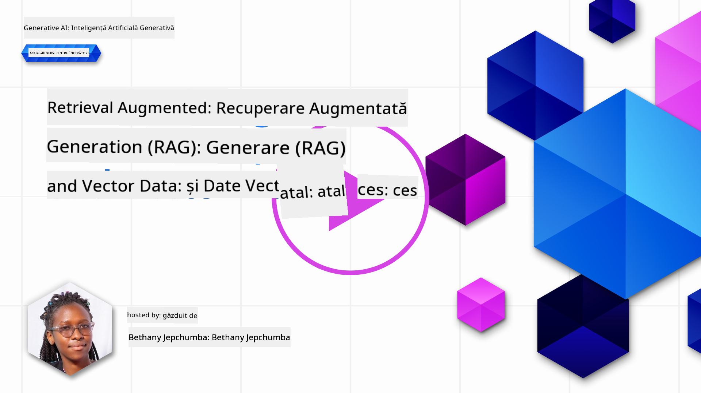
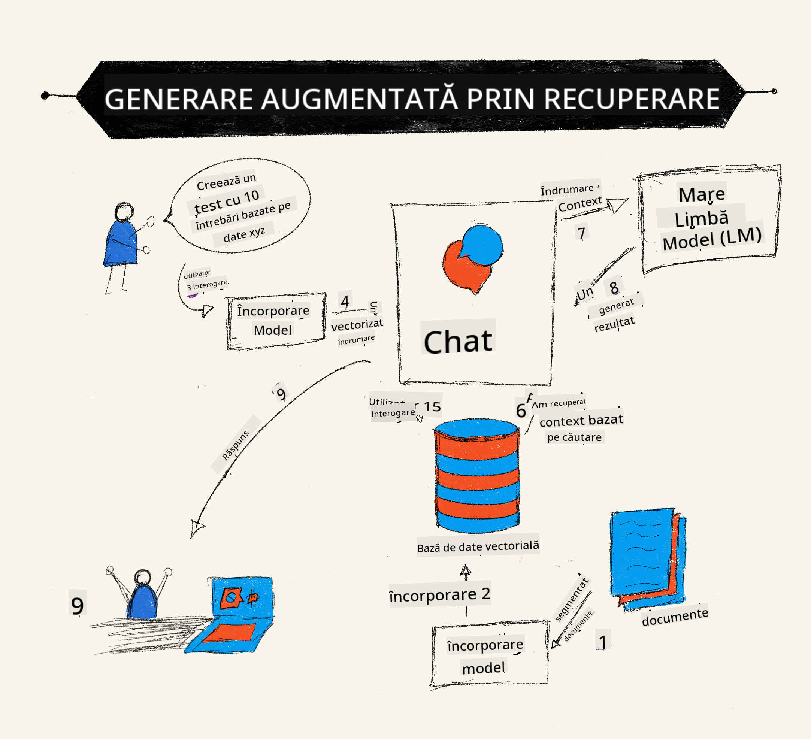
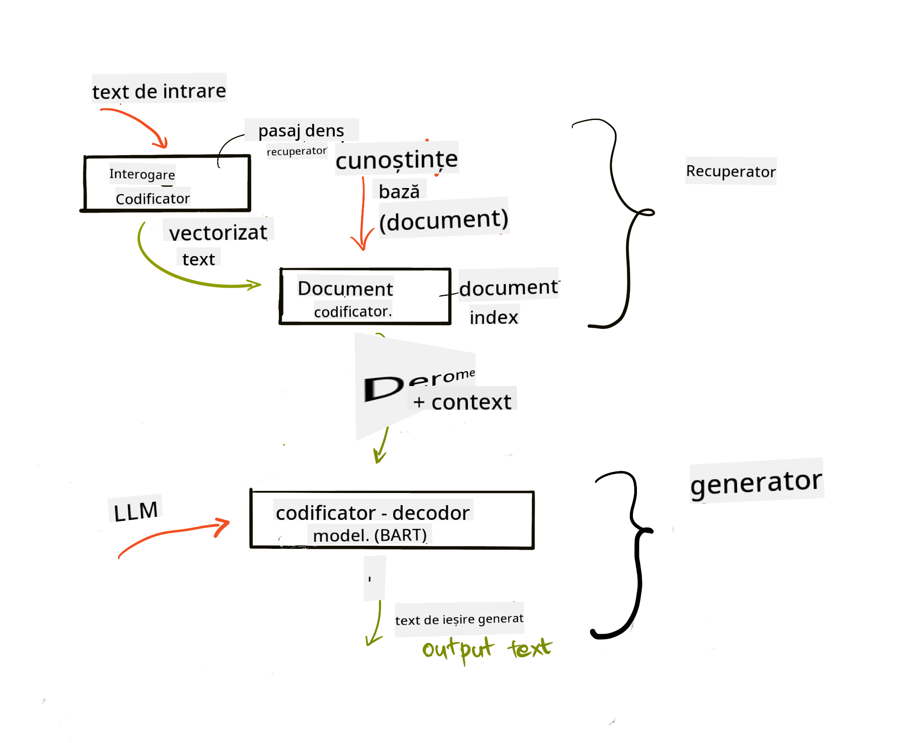
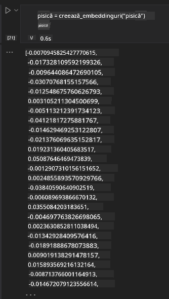

<!--
CO_OP_TRANSLATOR_METADATA:
{
  "original_hash": "e2861bbca91c0567ef32bc77fe054f9e",
  "translation_date": "2025-06-25T22:45:51+00:00",
  "source_file": "15-rag-and-vector-databases/README.md",
  "language_code": "ro"
}
-->
# Generare Augmentată prin Recuperare (RAG) și Baze de Date Vectoriale

[](https://aka.ms/gen-ai-lesson15-gh?WT.mc_id=academic-105485-koreyst)

În lecția despre aplicațiile de căutare, am învățat pe scurt cum să integrezi datele proprii în Modele de Limbaj de Mari Dimensiuni (LLMs). În această lecție, vom aprofunda conceptele de ancorare a datelor tale în aplicația LLM, mecanismele procesului și metodele de stocare a datelor, inclusiv atât embedding-uri, cât și text.

> **Video în curând**

## Introducere

În această lecție vom acoperi următoarele:

- O introducere în RAG, ce este și de ce este utilizat în inteligența artificială (AI).

- Înțelegerea a ceea ce sunt bazele de date vectoriale și crearea uneia pentru aplicația noastră.

- Un exemplu practic despre cum să integrezi RAG într-o aplicație.

## Obiective de învățare

După finalizarea acestei lecții, vei putea:

- Explica semnificația RAG în recuperarea și procesarea datelor.

- Configura o aplicație RAG și ancora datele tale la un LLM.

- Integrarea eficientă a RAG și bazelor de date vectoriale în aplicațiile LLM.

## Scenariul nostru: îmbunătățirea LLM-urilor cu datele noastre

Pentru această lecție, dorim să adăugăm notițele noastre în startup-ul educațional, care permite chatbot-ului să obțină mai multe informații despre diferite subiecte. Folosind notițele pe care le avem, cursanții vor putea studia mai bine și înțelege diferitele teme, făcând mai ușor să se pregătească pentru examenele lor. Pentru a crea scenariul nostru, vom folosi:

- `Azure OpenAI:` LLM-ul pe care îl vom folosi pentru a crea chatbot-ul nostru

- `AI for beginners' lesson on Neural Networks`: acestea vor fi datele pe care ne bazăm LLM-ul

- `Azure AI Search` și `Azure Cosmos DB:` baza de date vectorială pentru a stoca datele noastre și a crea un index de căutare

Utilizatorii vor putea crea chestionare de practică din notițele lor, carduri de revizuire și le vor rezuma în prezentări concise. Pentru a începe, să vedem ce este RAG și cum funcționează:

## Generare Augmentată prin Recuperare (RAG)

Un chatbot alimentat de un LLM procesează solicitările utilizatorilor pentru a genera răspunsuri. Este conceput pentru a fi interactiv și interacționează cu utilizatorii pe o gamă largă de subiecte. Cu toate acestea, răspunsurile sale sunt limitate la contextul oferit și datele sale de instruire de bază. De exemplu, limita de cunoștințe a GPT-4 este septembrie 2021, ceea ce înseamnă că îi lipsesc cunoștințele despre evenimentele care au avut loc după această perioadă. În plus, datele folosite pentru a instrui LLM-urile exclud informații confidențiale, cum ar fi notițele personale sau manualul de produse al unei companii.

### Cum funcționează RAG-urile (Generare Augmentată prin Recuperare)



Presupunem că vrei să implementezi un chatbot care creează chestionare din notițele tale, vei avea nevoie de o conexiune la baza de cunoștințe. Aici intervine RAG. RAG-urile funcționează astfel:

- **Baza de cunoștințe:** Înainte de recuperare, aceste documente trebuie să fie ingerate și preprocesate, de obicei descompunând documentele mari în bucăți mai mici, transformându-le în embedding-uri text și stocându-le într-o bază de date.

- **Întrebarea utilizatorului:** utilizatorul pune o întrebare

- **Recuperare:** Când un utilizator pune o întrebare, modelul de embedding recuperează informații relevante din baza noastră de cunoștințe pentru a oferi mai mult context care va fi încorporat în solicitare.

- **Generare augmentată:** LLM își îmbunătățește răspunsul pe baza datelor recuperate. Permite ca răspunsul generat să nu fie bazat doar pe datele pre-antrenate, ci și pe informații relevante din contextul adăugat. Datele recuperate sunt folosite pentru a augmenta răspunsurile LLM-ului. LLM-ul returnează apoi un răspuns la întrebarea utilizatorului.



Arhitectura pentru RAG-uri este implementată folosind transformatoare constând din două părți: un encoder și un decoder. De exemplu, când un utilizator pune o întrebare, textul de intrare este 'encodat' în vectori care capturează sensul cuvintelor, iar vectorii sunt 'decodificați' în indexul documentului nostru și generează un text nou bazat pe întrebarea utilizatorului. LLM-ul folosește atât un model encoder-decoder pentru a genera rezultatul.

Două abordări când implementezi RAG conform lucrării propuse: [Retrieval-Augmented Generation for Knowledge intensive NLP (natural language processing software) Tasks](https://arxiv.org/pdf/2005.11401.pdf?WT.mc_id=academic-105485-koreyst) sunt:

- **_RAG-Sequence_** folosind documentele recuperate pentru a prezice cel mai bun răspuns posibil la o întrebare a utilizatorului

- **RAG-Token** folosind documente pentru a genera următorul token, apoi le recuperează pentru a răspunde întrebării utilizatorului

### De ce ai folosi RAG-uri? 

- **Bogăția informațiilor:** asigură că răspunsurile text sunt actualizate și curente. Astfel, îmbunătățește performanța în sarcini specifice domeniului prin accesarea bazei de cunoștințe interne.

- Reduce fabricația utilizând **date verificabile** în baza de cunoștințe pentru a oferi context întrebărilor utilizatorilor.

- Este **cost-eficient** deoarece sunt mai economice comparativ cu ajustarea unui LLM

## Crearea unei baze de cunoștințe

Aplicația noastră se bazează pe datele noastre personale, adică lecția despre Rețele Neurale din curriculumul AI pentru Începători.

### Baze de Date Vectoriale

O bază de date vectorială, spre deosebire de bazele de date tradiționale, este o bază de date specializată concepută pentru a stoca, gestiona și căuta vectori încorporați. Stochează reprezentări numerice ale documentelor. Descompunerea datelor în embedding-uri numerice face mai ușor pentru sistemul nostru AI să înțeleagă și să proceseze datele.

Stocăm embedding-urile noastre în baze de date vectoriale deoarece LLM-urile au o limită a numărului de tokeni pe care îi acceptă ca intrare. Deoarece nu poți transmite toate embedding-urile unui LLM, va trebui să le descompunem în bucăți și când un utilizator pune o întrebare, embedding-urile cele mai asemănătoare întrebării vor fi returnate împreună cu solicitarea. Descompunerea reduce, de asemenea, costurile privind numărul de tokeni transmiși printr-un LLM.

Unele baze de date vectoriale populare includ Azure Cosmos DB, Clarifyai, Pinecone, Chromadb, ScaNN, Qdrant și DeepLake. Poți crea un model Azure Cosmos DB folosind Azure CLI cu următoarea comandă:

```bash
az login
az group create -n <resource-group-name> -l <location>
az cosmosdb create -n <cosmos-db-name> -r <resource-group-name>
az cosmosdb list-keys -n <cosmos-db-name> -g <resource-group-name>
```

### De la text la embedding-uri

Înainte de a stoca datele noastre, va trebui să le convertim în embedding-uri vectoriale înainte de a fi stocate în baza de date. Dacă lucrezi cu documente mari sau texte lungi, le poți descompune pe baza întrebărilor pe care le aștepți. Descompunerea poate fi făcută la nivel de propoziție sau la nivel de paragraf. Deoarece descompunerea derivă semnificații din cuvintele din jurul lor, poți adăuga un alt context unei bucăți, de exemplu, adăugând titlul documentului sau incluzând un text înainte sau după bucata respectivă. Poți descompune datele astfel:

```python
def split_text(text, max_length, min_length):
    words = text.split()
    chunks = []
    current_chunk = []

    for word in words:
        current_chunk.append(word)
        if len(' '.join(current_chunk)) < max_length and len(' '.join(current_chunk)) > min_length:
            chunks.append(' '.join(current_chunk))
            current_chunk = []

    # If the last chunk didn't reach the minimum length, add it anyway
    if current_chunk:
        chunks.append(' '.join(current_chunk))

    return chunks
```

Odată descompus, putem încorpora textul nostru folosind diferite modele de embedding. Unele modele pe care le poți folosi includ: word2vec, ada-002 de la OpenAI, Azure Computer Vision și multe altele. Selectarea unui model de utilizat va depinde de limbile pe care le folosești, de tipul de conținut codificat (text/imagini/audio), dimensiunea intrării pe care o poate codifica și lungimea rezultatului embedding-ului.

Un exemplu de text încorporat folosind modelul `text-embedding-ada-002` de la OpenAI este:


## Recuperare și Căutare Vectorială

Când un utilizator pune o întrebare, recuperatorul o transformă într-un vector folosind encoder-ul de interogare, apoi caută în indexul nostru de căutare a documentelor vectori relevanți din document care sunt relaționați cu intrarea. Odată terminat, convertește atât vectorul de intrare, cât și vectorii documentului în text și îl transmite prin LLM.

### Recuperare

Recuperarea are loc atunci când sistemul încearcă să găsească rapid documentele din index care satisfac criteriile de căutare. Scopul recuperatorului este de a obține documente care vor fi folosite pentru a oferi context și a ancora LLM-ul pe datele tale.

Există mai multe moduri de a efectua căutări în baza noastră de date, cum ar fi:

- **Căutare după cuvinte cheie** - utilizată pentru căutările text

- **Căutare semantică** - folosește semnificația semantică a cuvintelor

- **Căutare vectorială** - convertește documentele din text în reprezentări vectoriale folosind modele de embedding. Recuperarea va fi făcută prin interogarea documentelor ale căror reprezentări vectoriale sunt cele mai apropiate de întrebarea utilizatorului.

- **Hibrid** - o combinație între căutarea după cuvinte cheie și căutarea vectorială.

O provocare cu recuperarea apare atunci când nu există un răspuns similar în baza de date la interogare, sistemul va returna apoi cele mai bune informații pe care le poate obține, totuși, poți folosi tactici precum stabilirea distanței maxime pentru relevanță sau utilizarea căutării hibride care combină atât cuvintele cheie, cât și căutarea vectorială. În această lecție vom folosi căutarea hibridă, o combinație între căutarea vectorială și cea după cuvinte cheie. Vom stoca datele noastre într-un dataframe cu coloane care conțin bucățile, precum și embedding-urile.

### Similaritate Vectorială

Recuperatorul va căuta în baza de date a cunoștințelor embedding-uri care sunt apropiate, cel mai apropiat vecin, deoarece sunt texte care sunt similare. În scenariul în care un utilizator pune o întrebare, aceasta este mai întâi încorporată, apoi potrivită cu embedding-uri similare. Măsura comună folosită pentru a determina cât de similare sunt diferite vectori este similaritatea cosinus, care se bazează pe unghiul dintre doi vectori.

Putem măsura similaritatea folosind alte alternative, cum ar fi distanța Euclideană, care este linia dreaptă dintre capetele vectorilor și produsul scalar, care măsoară suma produselor elementelor corespunzătoare ale doi vectori.

### Index de căutare

Când facem recuperare, va trebui să construim un index de căutare pentru baza noastră de cunoștințe înainte de a efectua căutarea. Un index va stoca embedding-urile noastre și poate recupera rapid cele mai similare bucăți chiar și într-o bază de date mare. Putem crea indexul nostru local folosind:

```python
from sklearn.neighbors import NearestNeighbors

embeddings = flattened_df['embeddings'].to_list()

# Create the search index
nbrs = NearestNeighbors(n_neighbors=5, algorithm='ball_tree').fit(embeddings)

# To query the index, you can use the kneighbors method
distances, indices = nbrs.kneighbors(embeddings)
```

### Re-rangare

Odată ce ai interogat baza de date, s-ar putea să ai nevoie să sortezi rezultatele de la cele mai relevante. Un LLM de re-rangare utilizează Învățarea Automată pentru a îmbunătăți relevanța rezultatelor căutării prin ordonarea lor de la cele mai relevante. Folosind Azure AI Search, re-rangarea este făcută automat pentru tine folosind un re-rangator semantic. Un exemplu de cum funcționează re-rangarea folosind cei mai apropiați vecini:

```python
# Find the most similar documents
distances, indices = nbrs.kneighbors([query_vector])

index = []
# Print the most similar documents
for i in range(3):
    index = indices[0][i]
    for index in indices[0]:
        print(flattened_df['chunks'].iloc[index])
        print(flattened_df['path'].iloc[index])
        print(flattened_df['distances'].iloc[index])
    else:
        print(f"Index {index} not found in DataFrame")
```

## Aducerea tuturor împreună

Ultimul pas este adăugarea LLM-ului nostru în mix pentru a putea obține răspunsuri care sunt ancorate pe datele noastre. Putem implementa astfel:

```python
user_input = "what is a perceptron?"

def chatbot(user_input):
    # Convert the question to a query vector
    query_vector = create_embeddings(user_input)

    # Find the most similar documents
    distances, indices = nbrs.kneighbors([query_vector])

    # add documents to query  to provide context
    history = []
    for index in indices[0]:
        history.append(flattened_df['chunks'].iloc[index])

    # combine the history and the user input
    history.append(user_input)

    # create a message object
    messages=[
        {"role": "system", "content": "You are an AI assistant that helps with AI questions."},
        {"role": "user", "content": history[-1]}
    ]

    # use chat completion to generate a response
    response = openai.chat.completions.create(
        model="gpt-4",
        temperature=0.7,
        max_tokens=800,
        messages=messages
    )

    return response.choices[0].message

chatbot(user_input)
```

## Evaluarea aplicației noastre

### Metrici de evaluare

- Calitatea răspunsurilor furnizate, asigurându-se că sună natural, fluent și uman

- Ancorarea datelor: evaluarea dacă răspunsul a venit din documentele furnizate

- Relevanță: evaluarea dacă răspunsul se potrivește și este legat de întrebarea pusă

- Fluență - dacă răspunsul are sens din punct de vedere gramatical

## Cazuri de utilizare pentru utilizarea RAG (Generare Augmentată prin Recuperare) și bazele de date vectoriale

Există multe cazuri de utilizare diferite unde apelurile funcționale pot îmbunătăți aplicația ta, cum ar fi:

- Întrebări și Răspunsuri: ancorarea datelor companiei tale la un chat care poate fi folosit de angajați pentru a pune întrebări.

- Sisteme de Recomandare: unde poți crea un sistem care să potrivească cele mai similare valori, de exemplu, filme, restaurante și multe altele.

- Servicii de chatbot: poți stoca istoricul conversațiilor și personaliza conversația pe baza datelor utilizatorului.

- Căutare de imagini pe baza embedding-urilor vectoriale, utilă când faci recunoaștere de imagini și detectarea anomaliilor.

## Rezumat

Am acoperit domeniile fundamentale ale RAG de la adăugarea datelor noastre la aplicație, interogarea utilizatorului și rezultatul. Pentru a simplifica crearea RAG, poți folosi cadre precum Kernel Semanti, Langchain sau Autogen.

## Temă

Pentru a continua învățarea Generării Augmentate prin Recuperare (RAG) poți construi:

- Construiește un front-end pentru aplicație folosind cadrul ales de tine

- Utilizează un cadru, fie LangChain, fie Kernel Semantic, și recreează aplicația ta.

Felicitări pentru finalizarea lecției 👏.

## Învățarea nu se oprește aici, continuă călătoria

După ce ai finalizat această lecție, verifică colecția noastră de Învățare AI Generativă [Generative AI Learning collection](https://aka.ms/genai-collection?WT.mc_id=academic-105485-koreyst) pentru a continua să îți dezvolți cunoștințele despre AI Generativ!

**Declinarea responsabilității**:  
Acest document a fost tradus folosind serviciul de traducere AI [Co-op Translator](https://github.com/Azure/co-op-translator). Deși ne străduim să asigurăm acuratețea, vă rugăm să rețineți că traducerile automate pot conține erori sau inexactități. Documentul original în limba sa nativă ar trebui considerat sursa autoritară. Pentru informații critice, se recomandă traducerea profesională umană. Nu ne asumăm responsabilitatea pentru neînțelegerile sau interpretările greșite care pot apărea din utilizarea acestei traduceri.