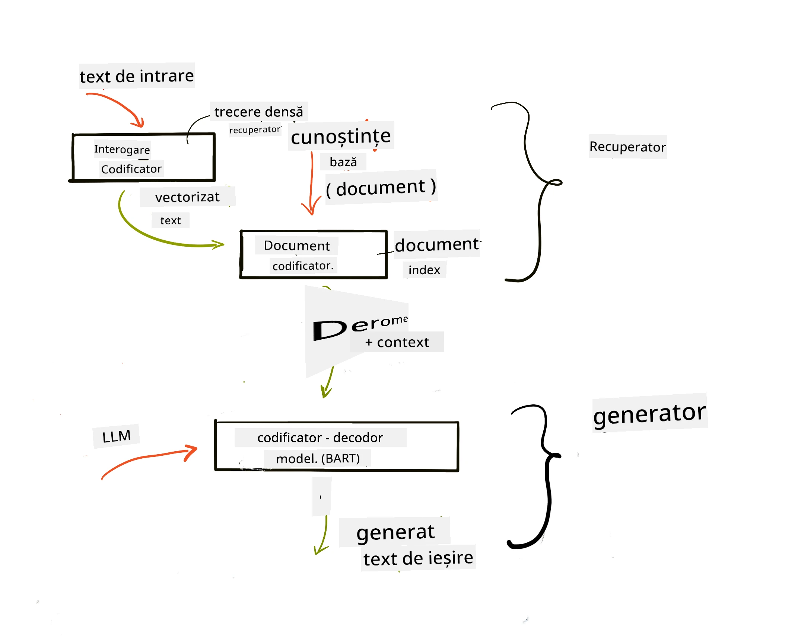

# Generare Augmentată prin Recuperare (RAG) și Baze de Date Vectoriale

[](https://youtu.be/4l8zhHUBeyI?si=BmvDmL1fnHtgQYkL)

În lecția despre aplicații de căutare, am învățat pe scurt cum să integrezi propriile tale date în Modele de Limbaj Mari (LLM-uri). În această lecție, vom aprofunda conceptele de ancorare a datelor în aplicația ta LLM, mecanica procesului și metodele de stocare a datelor, inclusiv atât embeddings, cât și text.

> **Videoclip în curând**

## Introducere

În această lecție vom acoperi următoarele:

- O introducere în RAG, ce este și de ce este utilizat în AI (inteligență artificială).

- Înțelegerea a ceea ce sunt bazele de date vectoriale și crearea uneia pentru aplicația noastră.

- Un exemplu practic despre cum să integrăm RAG într-o aplicație.

## Obiective de Învățare

După finalizarea acestei lecții, vei putea să:

- Explici importanța RAG în recuperarea și procesarea datelor.

- Configurezi o aplicație RAG și să ancorezi datele în LLM

- Integrezi eficient RAG și baze de date vectoriale în aplicații LLM.

## Scenariul nostru: îmbunătățirea LLM-urilor noastre cu propriile date

Pentru această lecție, vrem să adăugăm propriile noastre note în startupul educațional, ceea ce permite chatbot-ului să obțină mai multe informații despre diferite subiecte. Folosind notițele pe care le avem, cursanții vor putea studia mai bine și înțelege mai bine diversele teme, facilitând revizuirea pentru examene. Pentru a crea scenariul nostru, vom folosi:

- `Azure OpenAI:` LLM-ul pe care îl vom folosi pentru a crea chatbot-ul

- `Lecția AI pentru începători despre rețele neuronale`: aceasta va fi baza de date pe care vom ancora LLM-ul nostru

- `Azure AI Search` și `Azure Cosmos DB:` baza de date vectorială pentru a stoca datele și a crea un index de căutare

Utilizatorii vor putea crea chestionare de practică din notele lor, cartonașe de revizuire și vor putea sumariza acestea în prezentări concise. Pentru a începe, să vedem ce este RAG și cum funcționează:

## Generare Augmentată prin Recuperare (RAG)

Un chatbot alimentat de LLM procesează solicitările utilizatorilor pentru a genera răspunsuri. Este conceput să fie interactiv și să interacționeze cu utilizatorii pe o gamă largă de subiecte. Totuși, răspunsurile sale sunt limitate la contextul furnizat și datele sale de antrenament de bază. De exemplu, cunoașterea GPT-4 se oprește în septembrie 2021, ceea ce înseamnă că nu are informații despre evenimentele ulterioare acestei perioade. În plus, datele utilizate pentru antrenarea LLM-urilor exclud informații confidențiale, precum notele personale sau manualul unui produs al unei companii.

### Cum funcționează RAG-urile (Generare Augmentată prin Recuperare)


Să presupunem că vrei să lansezi un chatbot care creează chestionare din notițele tale, vei avea nevoie de o conexiune la baza de cunoștințe. Aici intervine RAG. RAG-urile funcționează astfel:

- **Baza de cunoștințe:** Înainte de recuperare, aceste documente trebuie ingestate și preprocesate, de obicei prin fragmentarea documentelor mari în segmente mai mici, transformarea lor în embeddings textuale și stocarea în baza de date.

- **Întrebarea utilizatorului:** utilizatorul pune o întrebare

- **Recuperarea:** Când utilizatorul pune o întrebare, modelul de embedding recuperează informații relevante din baza noastră de cunoștințe pentru a oferi mai mult context care va fi incorporat în prompt.

- **Generare augmentată:** LLM-ul își îmbunătățește răspunsul bazându-se pe datele recuperate. Aceasta permite ca răspunsul generat să nu se bazeze doar pe datele pre-antrenate, ci și pe informații relevante adăugate din context. Datele recuperate sunt folosite pentru a augmenta răspunsurile LLM-ului. LLM-ul apoi returnează un răspuns la întrebarea utilizatorului.



Arhitectura pentru RAG-uri este implementată folosind transformere, constând din două părți: un encoder și un decoder. De exemplu, când un utilizator pune o întrebare, textul de intrare este 'encodat' în vectori care surprind sensul cuvintelor, iar vectorii sunt 'decodați' în indexul nostru de documente și generează text nou pe baza întrebării utilizatorului. LLM-ul folosește un model encoder-decoder pentru a genera output-ul.

Două abordări în implementarea RAG, conform lucrării propuse: [Retrieval-Augmented Generation for Knowledge intensive NLP (natural language processing software) Tasks](https://arxiv.org/pdf/2005.11401.pdf?WT.mc_id=academic-105485-koreyst) sunt:

- **_RAG-Sequence_** utilizează documentele recuperate pentru a prevedea cel mai bun răspuns posibil la întrebarea utilizatorului

- **RAG-Token** folosește documente pentru a genera următorul token, apoi le recuperează pentru a răspunde întrebării utilizatorului

### De ce să folosești RAG-uri? 

- **Bogăție de informații:** asigură că răspunsurile text sunt actualizate și la zi. Prin urmare, îmbunătățește performanța la sarcini specifice domeniului prin accesarea bazei interne de cunoștințe.

- Reduce fabricarea de informații prin utilizarea **datelor verificabile** din baza de cunoștințe pentru a oferi context la întrebările utilizatorilor.

- Este **economică**, fiind mai accesibilă comparativ cu reglarea fină a unui LLM.

## Crearea unei baze de cunoștințe

Aplicația noastră se bazează pe datele personale, adică lecția despre Rețele Neuronale din curriculumul AI pentru Începători.

### Baze de Date Vectoriale

O bază de date vectorială, spre deosebire de bazele tradiționale, este specializată pentru a stoca, gestiona și căuta vectori embeddați. Ea stochează reprezentări numerice ale documentelor. Fragmentarea datelor în embeddings numerice facilitează sistemului nostru AI înțelegerea și procesarea datelor.

Stocăm embedding-urile în bazele de date vectoriale deoarece LLM-urile au o limită a numărului de tokeni acceptați ca input. Deoarece nu poți trimite toate embedding-urile întregi către un LLM, trebuie să le fragmentăm în bucăți, iar când utilizatorul pune o întrebare, embedding-urile cele mai relevante întrebării vor fi returnate împreună cu promptul. Fragmentarea reduce, de asemenea, costurile legate de numărul de tokeni procesați prin LLM.

Unele baze de date vectoriale populare includ Azure Cosmos DB, Clarifyai, Pinecone, Chromadb, ScaNN, Qdrant și DeepLake. Poți crea un model Azure Cosmos DB folosind Azure CLI cu următoarea comandă:

```bash
az login
az group create -n <resource-group-name> -l <location>
az cosmosdb create -n <cosmos-db-name> -r <resource-group-name>
az cosmosdb list-keys -n <cosmos-db-name> -g <resource-group-name>
```

### Din text în embeddings

Înainte de a stoca datele, trebuie să le convertim în vectori embedding înainte de a le stoca în baza de date. Dacă lucrezi cu documente mari sau texte lungi, le poți fragmenta în funcție de întrebările pe care le anticipezi. Fragmentarea poate fi realizată la nivel de propoziție sau paragraf. Deoarece fragmentarea derivă semnificația din cuvintele înconjurătoare, poți adăuga și alt context unei bucăți, de exemplu, titlul documentului sau includerea unor texte înainte sau după fragment. Poți fragmenta datele astfel:

```python
def split_text(text, max_length, min_length):
    words = text.split()
    chunks = []
    current_chunk = []

    for word in words:
        current_chunk.append(word)
        if len(' '.join(current_chunk)) < max_length and len(' '.join(current_chunk)) > min_length:
            chunks.append(' '.join(current_chunk))
            current_chunk = []

    # Dacă ultima bucată nu a atins lungimea minimă, adaug-o oricum
    if current_chunk:
        chunks.append(' '.join(current_chunk))

    return chunks
```

Odată fragmentate, putem integra textul folosind diferite modele de embedding. Unele modele pe care le poți folosi includ: word2vec, ada-002 de la OpenAI, Azure Computer Vision și altele. Alegerea modelului depinde de limbile utilizate, tipul de conținut codificat (text/imagine/audio), dimensiunea inputului pe care îl pot codifica și lungimea outputului embedding.

Un exemplu de text embeddat folosind modelul `text-embedding-ada-002` de la OpenAI este:


## Recuperare și Căutare Vectorială

Când utilizatorul pune o întrebare, sistemul de recuperare o transformă în vector folosind encoder-ul întrebării, apoi o caută prin indexul nostru de documente pentru vectorii relevanți în document care sunt relaționați cu inputul. După ce face asta, convertește atât vectorul input, cât și vectorii documentului în text și îl trece prin LLM.

### Recuperarea

Recuperarea are loc când sistemul încearcă rapid să găsească documentele din index care satisfac criteriile de căutare. Scopul recuperatorului este să obțină documente care vor fi folosite pentru a oferi context și a ancora LLM pe datele tale.

Există mai multe metode de a efectua căutarea în baza noastră de date, cum ar fi:

- **Căutare după cuvinte cheie** - folosită pentru căutări textuale

- **Căutare vectorială** - convertește documentele din text în reprezentări vectoriale folosind modele embedding, permițând o **căutare semantică** folosind sensul cuvintelor. Recuperarea se va face prin interogarea documentelor ale căror reprezentări vectoriale sunt cele mai apropiate de întrebarea utilizatorului.

- **Hibrid** - o combinație între căutarea după cuvinte cheie și cea vectorială.

O provocare a recuperării apare atunci când nu există un răspuns similar în baza de date, sistemul va returna cele mai bune informații pe care le poate găsi, însă poți folosi tactici precum setarea distanței maxime pentru relevanță sau utilizarea căutării hibride care combină căutarea prin cuvinte cheie și cea vectorială. În această lecție vom folosi căutarea hibridă, o combinație între căutare vectorială și căutare prin cuvinte cheie. Vom stoca datele într-un dataframe cu coloane care conțin segmentele și embedding-urile.

### Similaritatea vectorială

Recuperatorul va căuta în baza de date pentru embeddings care sunt aproape unul de altul, cei mai apropiați vecini, deoarece sunt texte similare. În scenariu, când un utilizator pune o întrebare, aceasta este mai întâi embeddată și apoi potrivită cu embedding-uri similare. Măsurarea comună folosită pentru a determina cât de similare sunt vectorii diferiți este similaritatea cosinusului, care se bazează pe unghiul dintre doi vectori.

Putem măsura similaritatea și folosind alte alternative, cum ar fi distanța euclidiană, care este linia dreaptă dintre capetele vectorilor, și produsul scalar care măsoară suma produselor elementelor corespunzătoare a doi vectori.

### Indexul de căutare

Când facem recuperarea, trebuie să construim un index de căutare pentru baza noastră de cunoștințe înainte de a efectua căutarea. Un index va stoca embedding-urile noastre și poate recupera rapid segmentele cele mai similare chiar și într-o bază de date mare. Putem crea indexul local folosind:

```python
from sklearn.neighbors import NearestNeighbors

embeddings = flattened_df['embeddings'].to_list()

# Creați indexul de căutare
nbrs = NearestNeighbors(n_neighbors=5, algorithm='ball_tree').fit(embeddings)

# Pentru a interoga indexul, puteți folosi metoda kneighbors
distances, indices = nbrs.kneighbors(embeddings)
```

### Re-ordonare

Odată ce ai interogat baza de date, s-ar putea să fie necesar să sortezi rezultatele de la cele mai relevante. Un LLM de re-ordonare utilizează Machine Learning pentru a îmbunătăți relevanța rezultatelor căutării prin ordonarea lor de la cele mai relevante. Folosind Azure AI Search, re-ordonarea se face automat pentru tine, folosind un reordonator semantic. Un exemplu despre cum funcționează re-ordonarea folosind cei mai apropiați vecini:

```python
# Găsiți cele mai similare documente
distances, indices = nbrs.kneighbors([query_vector])

index = []
# Afișați cele mai similare documente
for i in range(3):
    index = indices[0][i]
    for index in indices[0]:
        print(flattened_df['chunks'].iloc[index])
        print(flattened_df['path'].iloc[index])
        print(flattened_df['distances'].iloc[index])
    else:
        print(f"Index {index} not found in DataFrame")
```

## Punând totul cap la cap

Ultimul pas este să adăugăm LLM-ul în ecuație pentru a putea obține răspunsuri ancorate pe datele noastre. Putem implementa astfel:

```python
user_input = "what is a perceptron?"

def chatbot(user_input):
    # Convertește întrebarea într-un vector de interogare
    query_vector = create_embeddings(user_input)

    # Găsește documentele cele mai similare
    distances, indices = nbrs.kneighbors([query_vector])

    # adaugă documente la interogare pentru a oferi context
    history = []
    for index in indices[0]:
        history.append(flattened_df['chunks'].iloc[index])

    # combină istoricul și inputul utilizatorului
    history.append(user_input)

    # creează un obiect mesaj
    messages=[
        {"role": "system", "content": "You are an AI assistant that helps with AI questions."},
        {"role": "user", "content": "\n\n".join(history) }
    ]

    # folosește API-ul Responses pentru a genera un răspuns
    response = client.responses.create(
        model="gpt-4o-mini",
        temperature=0.7,
        max_output_tokens=800,
        input=messages,
        store=False,
    )

    return response.output_text

chatbot(user_input)
```

## Evaluarea aplicației noastre

### Metrice de Evaluare

- Calitatea răspunsurilor furnizate, asigurându-se că sună natural, fluent și uman

- Ancorarea datelor: evaluarea dacă răspunsul provine din documentele furnizate

- Relevanța: evaluarea dacă răspunsul corespunde și este legat de întrebarea pusă

- Fluența - dacă răspunsul are sens din punct de vedere gramatical

## Cazuri de utilizare pentru RAG (Generare Augmentată prin Recuperare) și baze de date vectoriale

Există multe cazuri diferite în care apelurile funcțiilor pot îmbunătăți aplicația ta, cum ar fi:

- Întrebări și Răspunsuri: ancorarea datelor companiei tale într-un chat folosit de angajați pentru a pune întrebări.

- Sisteme de recomandare: unde poți crea un sistem care asociază cele mai similare valori, de ex. filme, restaurante și multe altele.

- Servicii chatbot: poți stoca istoricul conversațiilor și personaliza dialogul bazat pe datele utilizatorului.

- Căutare de imagini bazată pe embeddings vectoriale, utilă în recunoașterea imaginilor și detectarea anomaliilor.

## Rezumat

Am acoperit zonele fundamentale ale RAG-ului, de la adăugarea datelor noastre în aplicație, întrebarea utilizatorului și output-ul. Pentru a simplifica crearea RAG, poți folosi framework-uri precum Semantic Kernel, Langchain sau Autogen.

## Temă

Pentru a-ți continua învățarea despre Generarea Augmentată prin Recuperare (RAG), poți construi:

- Un front-end pentru aplicație folosind framework-ul preferat

- Utilizează un framework, fie LangChain sau Semantic Kernel, și recreează aplicația ta.

Felicitări pentru finalizarea lecției 👏.

## Învățarea nu se oprește aici, continuă călătoria

După finalizarea acestei lecții, consultă colecția noastră [Generative AI Learning collection](https://aka.ms/genai-collection?WT.mc_id=academic-105485-koreyst) pentru a-ți continua avansarea în cunoștințele despre Generative AI!

---

<!-- CO-OP TRANSLATOR DISCLAIMER START -->
**Declinare a responsabilității**:
Acest document a fost tradus folosind serviciul de traducere AI [Co-op Translator](https://github.com/Azure/co-op-translator). În timp ce ne străduim pentru acuratețe, vă rugăm să rețineți că traducerile automate pot conține erori sau inexactități. Documentul original în limba sa nativă trebuie considerat sursa autorizată. Pentru informații critice, se recomandă traducerea profesională realizată de un om. Nu ne asumăm responsabilitatea pentru eventualele neînțelegeri sau interpretări greșite care decurg din utilizarea acestei traduceri.
<!-- CO-OP TRANSLATOR DISCLAIMER END -->