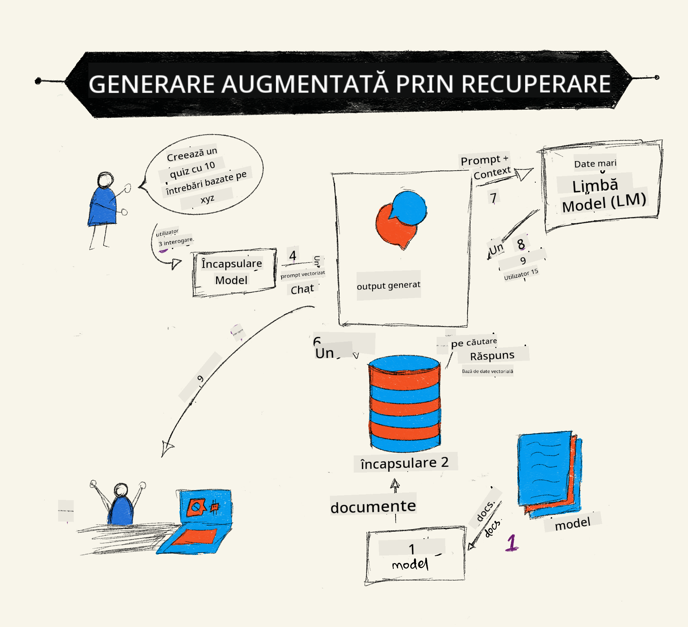
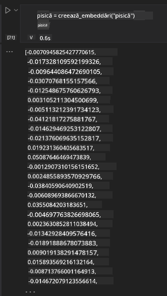

<!--
CO_OP_TRANSLATOR_METADATA:
{
  "original_hash": "b4b0266fbadbba7ded891b6485adc66d",
  "translation_date": "2025-10-17T22:07:04+00:00",
  "source_file": "15-rag-and-vector-databases/README.md",
  "language_code": "ro"
}
-->
# Generarea Augmentată prin Recuperare (RAG) și Baze de Date Vectoriale

[](https://youtu.be/4l8zhHUBeyI?si=BmvDmL1fnHtgQYkL)

În lecția despre aplicațiile de căutare, am învățat pe scurt cum să integrăm propriile date în Modelele de Limbaj Extins (LLMs). În această lecție, vom aprofunda conceptele de ancorare a datelor în aplicația LLM, mecanismele procesului și metodele de stocare a datelor, inclusiv atât încorporările, cât și textul.

> **Video în curând**

## Introducere

În această lecție vom acoperi următoarele:

- O introducere în RAG, ce este și de ce este utilizat în AI (inteligența artificială).

- Înțelegerea bazelor de date vectoriale și crearea uneia pentru aplicația noastră.

- Un exemplu practic despre cum să integrăm RAG într-o aplicație.

## Obiective de învățare

După finalizarea acestei lecții, vei putea:

- Explica semnificația RAG în recuperarea și procesarea datelor.

- Configura o aplicație RAG și să ancorezi datele tale la un LLM.

- Integra eficient RAG și Baze de Date Vectoriale în aplicațiile LLM.

## Scenariul nostru: îmbunătățirea LLM-urilor cu datele noastre

Pentru această lecție, dorim să adăugăm propriile noastre notițe în startup-ul educațional, ceea ce va permite chatbot-ului să obțină mai multe informații despre diferite subiecte. Folosind notițele pe care le avem, cursanții vor putea studia mai bine și înțelege diferite teme, făcând mai ușoară revizuirea pentru examenele lor. Pentru a crea acest scenariu, vom folosi:

- `Azure OpenAI:` LLM-ul pe care îl vom folosi pentru a crea chatbot-ul nostru.

- `Lecția AI pentru începători despre Rețele Neurale:` acestea vor fi datele pe care le ancorăm la LLM-ul nostru.

- `Azure AI Search` și `Azure Cosmos DB:` baza de date vectorială pentru a stoca datele noastre și a crea un index de căutare.

Utilizatorii vor putea crea teste de practică din notițele lor, fișe de revizuire și le vor putea rezuma în prezentări concise. Pentru a începe, să vedem ce este RAG și cum funcționează:

## Generarea Augmentată prin Recuperare (RAG)

Un chatbot alimentat de LLM procesează solicitările utilizatorilor pentru a genera răspunsuri. Este conceput să fie interactiv și să interacționeze cu utilizatorii pe o gamă largă de subiecte. Totuși, răspunsurile sale sunt limitate la contextul oferit și la datele sale de antrenament de bază. De exemplu, limita de cunoștințe a GPT-4 este septembrie 2021, ceea ce înseamnă că îi lipsesc informații despre evenimentele care au avut loc după această perioadă. În plus, datele utilizate pentru antrenarea LLM-urilor exclud informațiile confidențiale, cum ar fi notițele personale sau manualul de produse al unei companii.

### Cum funcționează RAG (Generarea Augmentată prin Recuperare)



Să presupunem că dorești să implementezi un chatbot care creează teste din notițele tale, vei avea nevoie de o conexiune la baza de cunoștințe. Aici intervine RAG. RAG funcționează astfel:

- **Baza de cunoștințe:** Înainte de recuperare, aceste documente trebuie să fie prelucrate și pregătite, de obicei prin împărțirea documentelor mari în fragmente mai mici, transformarea lor în încorporări textuale și stocarea lor într-o bază de date.

- **Interogarea utilizatorului:** utilizatorul pune o întrebare.

- **Recuperare:** Când utilizatorul pune o întrebare, modelul de încorporare recuperează informații relevante din baza noastră de cunoștințe pentru a oferi mai mult context care va fi încorporat în solicitare.

- **Generarea augmentată:** LLM își îmbunătățește răspunsul pe baza datelor recuperate. Acest lucru permite ca răspunsul generat să se bazeze nu doar pe datele pre-antrenate, ci și pe informații relevante din contextul adăugat. Datele recuperate sunt utilizate pentru a augmenta răspunsurile LLM-ului. LLM-ul returnează apoi un răspuns la întrebarea utilizatorului.


Arhitectura RAG este implementată folosind transformatoare care constau din două părți: un encoder și un decoder. De exemplu, când un utilizator pune o întrebare, textul de intrare este 'encodat' în vectori care captează semnificația cuvintelor, iar vectorii sunt 'decodați' în indexul documentului nostru și generează text nou pe baza interogării utilizatorului. LLM-ul folosește atât un model encoder-decoder pentru a genera rezultatul.

Două abordări pentru implementarea RAG conform lucrării propuse: [Generarea Augmentată prin Recuperare pentru Sarcini NLP (procesare de limbaj natural) intensive în cunoștințe](https://arxiv.org/pdf/2005.11401.pdf?WT.mc_id=academic-105485-koreyst) sunt:

- **_RAG-Sequence_** utilizând documentele recuperate pentru a prezice cel mai bun răspuns posibil la o interogare a utilizatorului.

- **RAG-Token** utilizând documentele pentru a genera următorul token, apoi recuperându-le pentru a răspunde la interogarea utilizatorului.

### De ce ai folosi RAG? 

- **Bogăția informațiilor:** asigură că răspunsurile textuale sunt actualizate și relevante. Prin urmare, îmbunătățește performanța în sarcini specifice domeniului prin accesarea bazei de cunoștințe interne.

- Reduce fabricarea informațiilor prin utilizarea **datelor verificabile** din baza de cunoștințe pentru a oferi context interogărilor utilizatorilor.

- Este **cost-eficient** deoarece este mai economic comparativ cu ajustarea fină a unui LLM.

## Crearea unei baze de cunoștințe

Aplicația noastră se bazează pe datele noastre personale, adică lecția despre Rețele Neurale din curriculum-ul AI pentru Începători.

### Baze de Date Vectoriale

O bază de date vectorială, spre deosebire de bazele de date tradiționale, este o bază de date specializată concepută pentru a stoca, gestiona și căuta vectori încorporați. Aceasta stochează reprezentări numerice ale documentelor. Descompunerea datelor în încorporări numerice face mai ușor pentru sistemul nostru AI să înțeleagă și să proceseze datele.

Stocăm încorporările noastre în baze de date vectoriale deoarece LLM-urile au o limită a numărului de token-uri pe care le acceptă ca intrare. Deoarece nu putem transmite toate încorporările unui LLM, va trebui să le împărțim în fragmente, iar când un utilizator pune o întrebare, încorporările cele mai asemănătoare cu întrebarea vor fi returnate împreună cu solicitarea. Fragmentarea reduce, de asemenea, costurile legate de numărul de token-uri transmise printr-un LLM.

Unele baze de date vectoriale populare includ Azure Cosmos DB, Clarifyai, Pinecone, Chromadb, ScaNN, Qdrant și DeepLake. Poți crea un model Azure Cosmos DB folosind Azure CLI cu următoarea comandă:

```bash
az login
az group create -n <resource-group-name> -l <location>
az cosmosdb create -n <cosmos-db-name> -r <resource-group-name>
az cosmosdb list-keys -n <cosmos-db-name> -g <resource-group-name>
```

### De la text la încorporări

Înainte de a stoca datele noastre, va trebui să le convertim în încorporări vectoriale înainte de a fi stocate în baza de date. Dacă lucrezi cu documente mari sau texte lungi, le poți fragmenta pe baza interogărilor pe care le aștepți. Fragmentarea poate fi realizată la nivel de propoziție sau la nivel de paragraf. Deoarece fragmentarea derivă semnificații din cuvintele din jurul lor, poți adăuga un alt context unui fragment, de exemplu, prin adăugarea titlului documentului sau includerea unui text înainte sau după fragment. Poți fragmenta datele astfel:

```python
def split_text(text, max_length, min_length):
    words = text.split()
    chunks = []
    current_chunk = []

    for word in words:
        current_chunk.append(word)
        if len(' '.join(current_chunk)) < max_length and len(' '.join(current_chunk)) > min_length:
            chunks.append(' '.join(current_chunk))
            current_chunk = []

    # If the last chunk didn't reach the minimum length, add it anyway
    if current_chunk:
        chunks.append(' '.join(current_chunk))

    return chunks
```

Odată fragmentate, putem încorpora textul nostru folosind diferite modele de încorporare. Unele modele pe care le poți folosi includ: word2vec, ada-002 de la OpenAI, Azure Computer Vision și multe altele. Selectarea unui model de utilizat va depinde de limbile pe care le folosești, tipul de conținut codificat (text/imagine/audio), dimensiunea intrării pe care o poate codifica și lungimea ieșirii încorporării.

Un exemplu de text încorporat folosind modelul `text-embedding-ada-002` de la OpenAI este:


## Recuperare și Căutare Vectorială

Când un utilizator pune o întrebare, recuperatorul o transformă într-un vector folosind encoder-ul de interogare, apoi caută prin indexul nostru de căutare al documentelor pentru vectori relevanți din document care sunt legați de intrare. Odată ce este finalizat, convertește atât vectorul de intrare, cât și vectorii documentului în text și îi transmite prin LLM.

### Recuperare

Recuperarea are loc atunci când sistemul încearcă să găsească rapid documentele din index care îndeplinesc criteriile de căutare. Scopul recuperatorului este de a obține documente care vor fi utilizate pentru a oferi context și a ancora LLM-ul pe datele tale.

Există mai multe moduri de a efectua căutări în baza noastră de date, cum ar fi:

- **Căutare după cuvinte cheie** - utilizată pentru căutări textuale.

- **Căutare semantică** - folosește semnificația semantică a cuvintelor.

- **Căutare vectorială** - convertește documentele din text în reprezentări vectoriale folosind modele de încorporare. Recuperarea se va face prin interogarea documentelor ale căror reprezentări vectoriale sunt cele mai apropiate de întrebarea utilizatorului.

- **Hibrid** - o combinație între căutarea după cuvinte cheie și căutarea vectorială.

O provocare cu recuperarea apare atunci când nu există un răspuns similar la interogarea din baza de date, sistemul va returna cele mai bune informații pe care le poate obține, totuși, poți folosi tactici precum stabilirea distanței maxime pentru relevanță sau utilizarea căutării hibride care combină atât cuvintele cheie, cât și căutarea vectorială. În această lecție vom folosi căutarea hibridă, o combinație între căutarea vectorială și după cuvinte cheie. Vom stoca datele noastre într-un dataframe cu coloane care conțin fragmentele, precum și încorporările.

### Similaritatea Vectorială

Recuperatorul va căuta în baza de cunoștințe pentru încorporări care sunt apropiate, cele mai apropiate vecine, deoarece sunt texte similare. În scenariul în care un utilizator pune o interogare, aceasta este mai întâi încorporată, apoi potrivită cu încorporările similare. Măsurarea comună utilizată pentru a determina cât de similare sunt diferite vectori este similaritatea cosinusului, care se bazează pe unghiul dintre doi vectori.

Putem măsura similaritatea folosind alte alternative, cum ar fi distanța euclidiană, care este linia dreaptă între punctele finale ale vectorilor, și produsul scalar, care măsoară suma produselor elementelor corespunzătoare ale doi vectori.

### Index de căutare

Când facem recuperare, va trebui să construim un index de căutare pentru baza noastră de cunoștințe înainte de a efectua căutarea. Un index va stoca încorporările noastre și poate recupera rapid cele mai similare fragmente chiar și într-o bază de date mare. Putem crea indexul nostru local folosind:

```python
from sklearn.neighbors import NearestNeighbors

embeddings = flattened_df['embeddings'].to_list()

# Create the search index
nbrs = NearestNeighbors(n_neighbors=5, algorithm='ball_tree').fit(embeddings)

# To query the index, you can use the kneighbors method
distances, indices = nbrs.kneighbors(embeddings)
```

### Reordonare

Odată ce ai interogat baza de date, poate fi necesar să sortezi rezultatele de la cele mai relevante. Un LLM de reordonare utilizează învățarea automată pentru a îmbunătăți relevanța rezultatelor căutării prin ordonarea lor de la cele mai relevante. Folosind Azure AI Search, reordonarea se face automat pentru tine folosind un reordonator semantic. Un exemplu despre cum funcționează reordonarea folosind cei mai apropiați vecini:

```python
# Find the most similar documents
distances, indices = nbrs.kneighbors([query_vector])

index = []
# Print the most similar documents
for i in range(3):
    index = indices[0][i]
    for index in indices[0]:
        print(flattened_df['chunks'].iloc[index])
        print(flattened_df['path'].iloc[index])
        print(flattened_df['distances'].iloc[index])
    else:
        print(f"Index {index} not found in DataFrame")
```

## Punerea tuturor împreună

Ultimul pas este adăugarea LLM-ului nostru în mix pentru a putea obține răspunsuri ancorate pe datele noastre. Putem implementa acest lucru astfel:

```python
user_input = "what is a perceptron?"

def chatbot(user_input):
    # Convert the question to a query vector
    query_vector = create_embeddings(user_input)

    # Find the most similar documents
    distances, indices = nbrs.kneighbors([query_vector])

    # add documents to query  to provide context
    history = []
    for index in indices[0]:
        history.append(flattened_df['chunks'].iloc[index])

    # combine the history and the user input
    history.append(user_input)

    # create a message object
    messages=[
        {"role": "system", "content": "You are an AI assistant that helps with AI questions."},
        {"role": "user", "content": history[-1]}
    ]

    # use chat completion to generate a response
    response = openai.chat.completions.create(
        model="gpt-4",
        temperature=0.7,
        max_tokens=800,
        messages=messages
    )

    return response.choices[0].message

chatbot(user_input)
```

## Evaluarea aplicației noastre

### Metrice de evaluare

- Calitatea răspunsurilor furnizate, asigurându-se că sună natural, fluent și uman.

- Ancorarea datelor: evaluarea dacă răspunsul provine din documentele furnizate.

- Relevanța: evaluarea dacă răspunsul se potrivește și este legat de întrebarea pusă.

- Fluența - dacă răspunsul are sens gramatical.

## Utilizări ale RAG (Generarea Augmentată prin Recuperare) și bazelor de date vectoriale

Există multe utilizări diferite în care apelurile funcționale pot îmbunătăți aplicația ta, cum ar fi:

- Întrebări și răspunsuri: ancorarea datelor companiei tale la un chat care poate fi utilizat de angajați pentru a pune întrebări.

- Sisteme de recomandare: unde poți crea un sistem care să potrivească cele mai similare valori, de exemplu, filme, restaurante și multe altele.

- Servicii de chatbot: poți stoca istoricul conversațiilor și personaliza conversația pe baza datelor utilizatorului.

- Căutare de imagini bazată pe încorporări vectoriale, utilă în recunoașterea imaginilor și detectarea anomaliilor.

## Rezumat

Am acoperit aspectele fundamentale ale RAG, de la adăugarea datelor noastre în aplicație, la interogarea utilizatorului și rezultatul. Pentru a simplifica crearea RAG, poți folosi cadre precum Semantic Kernel, Langchain sau Autogen.

## Temă

Pentru a continua învățarea despre Generarea Augmentată prin Recuperare (RAG), poți construi:

- O interfață pentru aplicație folosind cadrul ales de tine.

- Utiliza un cadru, fie LangChain, fie Semantic Kernel, și să recreezi aplicația ta.

Felicitări pentru finalizarea lecției 👏.

## Învățarea nu se oprește aici, continuă călătoria

După finalizarea acestei lecții, consultă [Colecția de Învățare AI Generativă](https://aka.ms/genai-collection?WT.mc_id=academic-105485-koreyst) pentru a continua să îți dezvolți cunoștințele despre AI Generativă!

---

**Declinare de responsabilitate**:  
Acest document a fost tradus folosind serviciul de traducere AI [Co-op Translator](https://github.com/Azure/co-op-translator). Deși ne străduim să asigurăm acuratețea, vă rugăm să fiți conștienți că traducerile automate pot conține erori sau inexactități. Documentul original în limba sa maternă ar trebui considerat sursa autoritară. Pentru informații critice, se recomandă traducerea profesională realizată de un specialist uman. Nu ne asumăm responsabilitatea pentru eventualele neînțelegeri sau interpretări greșite care pot apărea din utilizarea acestei traduceri.