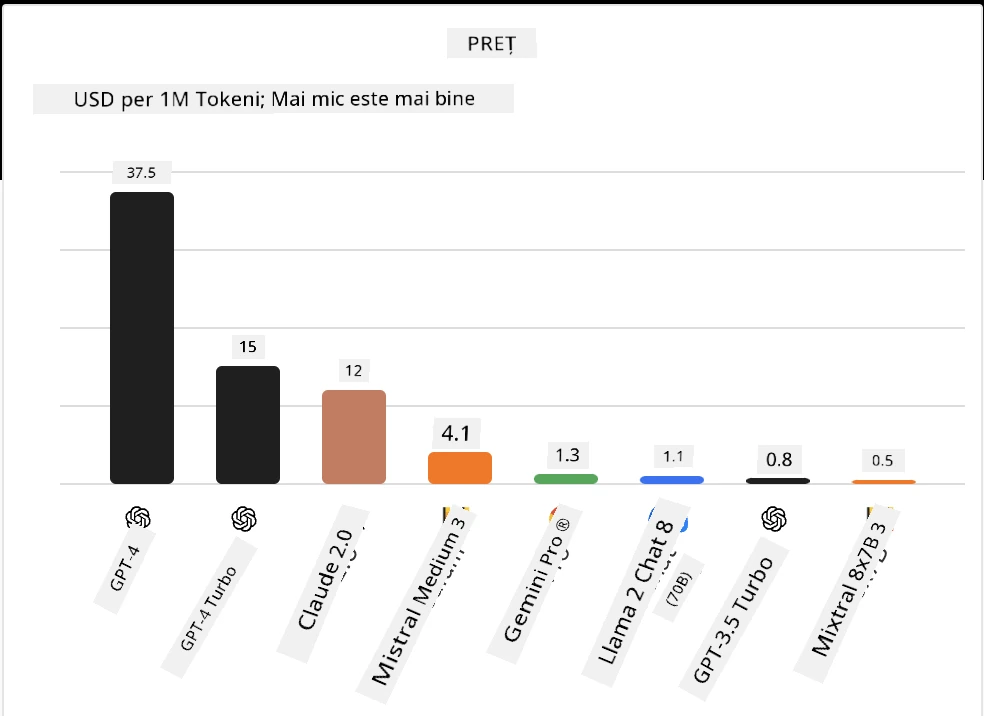
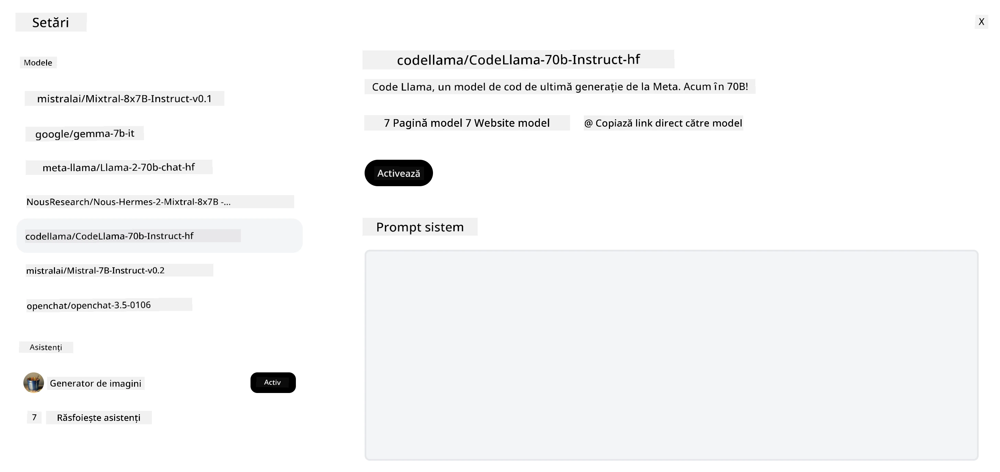
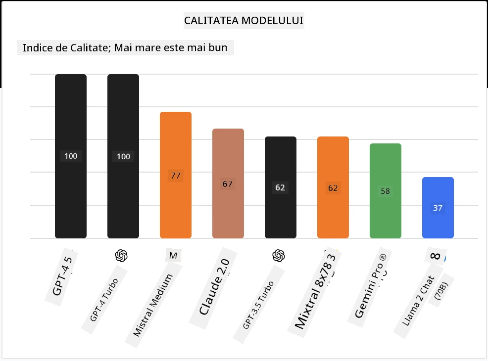

## Introducere

Lumea LLM-urilor open-source este captivantă și în continuă evoluție. Această lecție își propune să ofere o privire detaliată asupra modelelor open source. Dacă căutați informații despre cum se compară modelele proprietare cu cele open source, accesați lecția ["Explorarea și compararea diferitelor LLM-uri"](../02-exploring-and-comparing-different-llms/README.md?WT.mc_id=academic-105485-koreyst). Această lecție va aborda și subiectul fine-tuning-ului, dar o explicație mai detaliată poate fi găsită în lecția ["Fine-Tuning LLMs"](../18-fine-tuning/README.md?WT.mc_id=academic-105485-koreyst).

## Obiective de învățare

- Dobândirea unei înțelegeri a modelelor open source
- Înțelegerea beneficiilor lucrului cu modele open source
- Explorarea modelelor open disponibile pe Hugging Face și Azure AI Studio

## Ce sunt modelele Open Source?

Software-ul open source a jucat un rol crucial în creșterea tehnologiei în diverse domenii. Open Source Initiative (OSI) a definit [10 criterii pentru software](https://web.archive.org/web/20241126001143/https://opensource.org/osd?WT.mc_id=academic-105485-koreyst) pentru a fi clasificat ca open source. Codul sursă trebuie să fie împărtășit deschis sub o licență aprobată de OSI.

Deși dezvoltarea LLM-urilor are elemente similare cu dezvoltarea software-ului, procesul nu este exact același. Acest lucru a generat multe discuții în comunitate despre definiția open source în contextul LLM-urilor. Pentru ca un model să fie aliniat cu definiția tradițională a open source, următoarele informații ar trebui să fie disponibile public:

- Seturile de date folosite pentru antrenarea modelului.
- Greutățile complete ale modelului ca parte a antrenamentului.
- Codul de evaluare.
- Codul de fine-tuning.
- Greutățile complete ale modelului și metricile de antrenament.

În prezent, există doar câteva modele care corespund acestui criteriu. Modelul [OLMo creat de Allen Institute for Artificial Intelligence (AllenAI)](https://huggingface.co/allenai/OLMo-7B?WT.mc_id=academic-105485-koreyst) este unul care se încadrează în această categorie.

Pentru această lecție, ne vom referi la modele ca "modele open" pe viitor, deoarece este posibil să nu corespundă criteriilor de mai sus la momentul scrierii.

## Beneficiile modelelor Open

**Foarte personalizabile** - Deoarece modelele open sunt lansate cu informații detaliate despre antrenament, cercetătorii și dezvoltatorii pot modifica intern modelul. Acest lucru permite crearea de modele foarte specializate, ajustate fin pentru o anumită sarcină sau domeniu de studiu. Câteva exemple sunt generarea de cod, operații matematice și biologie.

**Cost** - Costul per token pentru utilizarea și implementarea acestor modele este mai mic decât cel al modelelor proprietare. Când construiți aplicații Generative AI, ar trebui să analizați performanța în raport cu prețul când lucrați cu aceste modele pentru cazul dvs. de utilizare.

Sursa: Artificial Analysis

**Flexibilitate** - Lucrul cu modelele open vă permite să fiți flexibil în ceea ce privește utilizarea diferitelor modele sau combinarea lor. Un exemplu este [HuggingChat Assistants](https://huggingface.co/chat?WT.mc_id=academic-105485-koreyst), unde un utilizator poate selecta modelul folosit direct în interfața utilizatorului:

## Explorarea diferitelor modele open

### Llama 2

[LLama2](https://huggingface.co/meta-llama?WT.mc_id=academic-105485-koreyst), dezvoltat de Meta, este un model open optimizat pentru aplicații bazate pe chat. Acest lucru se datorează metodei sale de fine-tuning, care a inclus o cantitate mare de dialog și feedback uman. Cu această metodă, modelul produce rezultate mai aliniate cu așteptările umane, oferind o experiență mai bună utilizatorului.

Câteva exemple de versiuni fine-tunate ale Llama includ [Japanese Llama](https://huggingface.co/elyza/ELYZA-japanese-Llama-2-7b?WT.mc_id=academic-105485-koreyst), specializat în japoneză, și [Llama Pro](https://huggingface.co/TencentARC/LLaMA-Pro-8B?WT.mc_id=academic-105485-koreyst), o versiune îmbunătățită a modelului de bază.

### Mistral

[Mistral](https://huggingface.co/mistralai?WT.mc_id=academic-105485-koreyst) este un model open cu un puternic accent pe performanță și eficiență. Folosește abordarea Mixture-of-Experts, care combină un grup de modele experte specializate într-un singur sistem, unde, în funcție de intrare, anumite modele sunt selectate pentru a fi utilizate. Acest lucru face calculul mai eficient, deoarece modelele abordează doar intrările în care sunt specializate.

Câteva exemple de versiuni fine-tunate ale Mistral includ [BioMistral](https://huggingface.co/BioMistral/BioMistral-7B?text=Mon+nom+est+Thomas+et+mon+principal?WT.mc_id=academic-105485-koreyst), care este concentrat pe domeniul medical, și [OpenMath Mistral](https://huggingface.co/nvidia/OpenMath-Mistral-7B-v0.1-hf?WT.mc_id=academic-105485-koreyst), care realizează calcule matematice.

### Falcon

[Falcon](https://huggingface.co/tiiuae?WT.mc_id=academic-105485-koreyst) este un LLM creat de Technology Innovation Institute (**TII**). Falcon-40B a fost antrenat pe 40 de miliarde de parametri și a demonstrat performanțe mai bune decât GPT-3 cu un buget de calcul mai mic. Acest lucru se datorează utilizării algoritmului FlashAttention și atenției multiquery, care îi permit să reducă cerințele de memorie în timpul inferenței. Cu acest timp redus de inferență, Falcon-40B este potrivit pentru aplicații de chat.

Câteva exemple de versiuni fine-tunate ale Falcon sunt [OpenAssistant](https://huggingface.co/OpenAssistant/falcon-40b-sft-top1-560?WT.mc_id=academic-105485-koreyst), un asistent construit pe modele open, și [GPT4ALL](https://huggingface.co/nomic-ai/gpt4all-falcon?WT.mc_id=academic-105485-koreyst), care oferă performanțe superioare modelului de bază.

## Cum să alegi

Nu există un răspuns unic pentru alegerea unui model open. Un punct bun de plecare este să folosiți funcția de filtrare după sarcină din Azure AI Studio. Aceasta vă va ajuta să înțelegeți pentru ce tipuri de sarcini a fost antrenat modelul. Hugging Face menține, de asemenea, un LLM Leaderboard care vă arată cele mai performante modele pe baza anumitor metrici.

Când doriți să comparați LLM-uri din diferite categorii, [Artificial Analysis](https://artificialanalysis.ai/?WT.mc_id=academic-105485-koreyst) este o altă resursă excelentă:

Sursa: Artificial Analysis

Dacă lucrați la un caz specific de utilizare, căutarea versiunilor fine-tunate concentrate pe același domeniu poate fi eficientă. Experimentarea cu mai multe modele open pentru a vedea cum performează conform așteptărilor dvs. și ale utilizatorilor este o altă practică bună.

## Pașii următori

Partea cea mai bună la modelele open este că puteți începe să lucrați cu ele destul de rapid. Consultați [Azure AI Foundry Model Catalog](https://ai.azure.com?WT.mc_id=academic-105485-koreyst), care include o colecție specifică Hugging Face cu aceste modele discutate aici.

## Învățarea nu se oprește aici, continuă călătoria

După ce ați terminat această lecție, consultați colecția noastră [Generative AI Learning](https://aka.ms/genai-collection?WT.mc_id=academic-105485-koreyst) pentru a continua să vă dezvoltați cunoștințele despre Generative AI!

---

<!-- CO-OP TRANSLATOR DISCLAIMER START -->
**Declinare de responsabilitate**:  
Acest document a fost tradus folosind serviciul de traducere AI [Co-op Translator](https://github.com/Azure/co-op-translator). Deși ne străduim pentru acuratețe, vă rugăm să rețineți că traducerile automate pot conține erori sau inexactități. Documentul original în limba sa nativă trebuie considerat sursa autorizată. Pentru informații critice, se recomandă traducerea profesională realizată de un specialist uman. Nu ne asumăm responsabilitatea pentru eventualele neînțelegeri sau interpretări greșite rezultate din utilizarea acestei traduceri.
<!-- CO-OP TRANSLATOR DISCLAIMER END -->