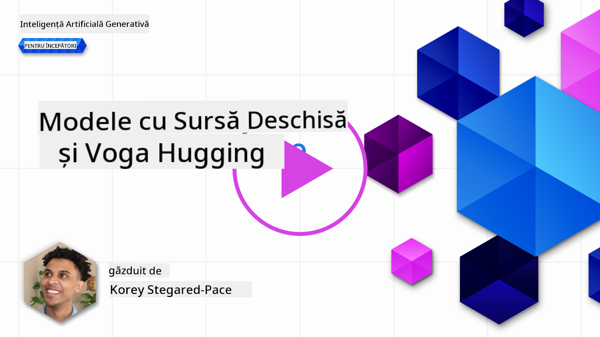
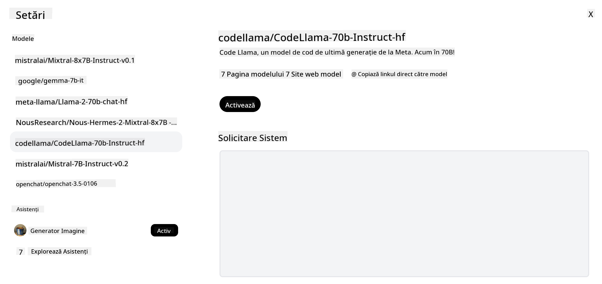

<!--
CO_OP_TRANSLATOR_METADATA:
{
  "original_hash": "0bba96e53ab841d99db731892a51fab8",
  "translation_date": "2025-06-26T00:03:47+00:00",
  "source_file": "16-open-source-models/README.md",
  "language_code": "ro"
}
-->

## Introducere

Lumea LLM-urilor open source este captivantă și în continuă evoluție. Această lecție își propune să ofere o privire detaliată asupra modelelor open source. Dacă căutați informații despre cum se compară modelele proprietare cu cele open source, accesați lecția ["Explorarea și Compararea Diferitelor LLM-uri"](../02-exploring-and-comparing-different-llms/README.md?WT.mc_id=academic-105485-koreyst). Această lecție va aborda și subiectul ajustării fine, dar o explicație mai detaliată poate fi găsită în lecția ["Ajustarea Fină a LLM-urilor"](../18-fine-tuning/README.md?WT.mc_id=academic-105485-koreyst).

## Obiective de învățare

- Obțineți o înțelegere a modelelor open source
- Înțelegeți beneficiile lucrului cu modele open source
- Explorați modelele disponibile pe Hugging Face și Azure AI Studio

## Ce sunt Modelele Open Source?

Software-ul open source a jucat un rol crucial în creșterea tehnologiei în diverse domenii. Inițiativa Open Source (OSI) a definit [10 criterii pentru software](https://web.archive.org/web/20241126001143/https://opensource.org/osd?WT.mc_id=academic-105485-koreyst) pentru a fi clasificat ca open source. Codul sursă trebuie să fie distribuit deschis sub o licență aprobată de OSI.

Deși dezvoltarea LLM-urilor are elemente similare cu dezvoltarea software-ului, procesul nu este exact același. Acest lucru a generat multe discuții în comunitate despre definiția open source în contextul LLM-urilor. Pentru ca un model să fie aliniat cu definiția tradițională de open source, următoarele informații ar trebui să fie disponibile public:

- Seturi de date utilizate pentru antrenarea modelului.
- Greutățile complete ale modelului ca parte a antrenamentului.
- Codul de evaluare.
- Codul de ajustare fină.
- Greutățile complete ale modelului și metricile de antrenament.

În prezent, există doar câteva modele care se potrivesc cu acest criteriu. Modelul [OLMo creat de Allen Institute for Artificial Intelligence (AllenAI)](https://huggingface.co/allenai/OLMo-7B?WT.mc_id=academic-105485-koreyst) este unul care se încadrează în această categorie.

Pentru această lecție, ne vom referi la modele ca "modele deschise" de acum înainte, deoarece este posibil să nu se potrivească cu criteriile de mai sus la momentul redactării.

## Beneficiile Modelelor Deschise

**Foarte Personalizabil** - Deoarece modelele deschise sunt lansate cu informații detaliate de antrenament, cercetătorii și dezvoltatorii pot modifica structura internă a modelului. Acest lucru permite crearea de modele extrem de specializate care sunt ajustate fin pentru o sarcină sau un domeniu de studiu specific. Unele exemple includ generarea de cod, operații matematice și biologie.

**Cost** - Costul pe token pentru utilizarea și implementarea acestor modele este mai mic decât cel al modelelor proprietare. Când construiți aplicații AI generative, ar trebui să analizați performanța versus prețul atunci când lucrați cu aceste modele pentru cazul dvs. de utilizare.

Sursa: Analiză Artificială

**Flexibilitate** - Lucrul cu modele deschise vă permite să fiți flexibil în termeni de utilizare a diferitelor modele sau combinarea lor. Un exemplu în acest sens este [HuggingChat Assistants](https://huggingface.co/chat?WT.mc_id=academic-105485-koreyst) unde un utilizator poate selecta modelul utilizat direct în interfața de utilizator:

## Explorarea Diferitelor Modele Deschise

### Llama 2

[LLama2](https://huggingface.co/meta-llama?WT.mc_id=academic-105485-koreyst), dezvoltat de Meta, este un model deschis optimizat pentru aplicații bazate pe chat. Acest lucru se datorează metodei sale de ajustare fină, care a inclus o cantitate mare de dialog și feedback uman. Cu această metodă, modelul produce mai multe rezultate care sunt aliniate la așteptările umane, oferind o experiență mai bună utilizatorului.

Unele exemple de versiuni ajustate fin ale Llama includ [Llama Japonez](https://huggingface.co/elyza/ELYZA-japanese-Llama-2-7b?WT.mc_id=academic-105485-koreyst), care se specializează în japoneză și [Llama Pro](https://huggingface.co/TencentARC/LLaMA-Pro-8B?WT.mc_id=academic-105485-koreyst), care este o versiune îmbunătățită a modelului de bază.

### Mistral

[Mistral](https://huggingface.co/mistralai?WT.mc_id=academic-105485-koreyst) este un model deschis cu un accent puternic pe performanță ridicată și eficiență. Folosește abordarea Mixture-of-Experts, care combină un grup de modele expert specializate într-un sistem unde, în funcție de intrare, anumite modele sunt selectate pentru a fi utilizate. Acest lucru face ca calculul să fie mai eficient, deoarece modelele abordează doar intrările în care sunt specializate.

Unele exemple de versiuni ajustate fin ale Mistral includ [BioMistral](https://huggingface.co/BioMistral/BioMistral-7B?text=Mon+nom+est+Thomas+et+mon+principal?WT.mc_id=academic-105485-koreyst), care se concentrează pe domeniul medical și [OpenMath Mistral](https://huggingface.co/nvidia/OpenMath-Mistral-7B-v0.1-hf?WT.mc_id=academic-105485-koreyst), care efectuează calcule matematice.

### Falcon

[Falcon](https://huggingface.co/tiiuae?WT.mc_id=academic-105485-koreyst) este un LLM creat de Institutul de Inovare Tehnologică (**TII**). Falcon-40B a fost antrenat pe 40 de miliarde de parametri, ceea ce s-a demonstrat că performează mai bine decât GPT-3 cu un buget de calcul mai mic. Acest lucru se datorează utilizării algoritmului FlashAttention și atenției multiquery care îi permite să reducă cerințele de memorie în timpul inferenței. Cu acest timp de inferență redus, Falcon-40B este potrivit pentru aplicații de chat.

Unele exemple de versiuni ajustate fin ale Falcon sunt [OpenAssistant](https://huggingface.co/OpenAssistant/falcon-40b-sft-top1-560?WT.mc_id=academic-105485-koreyst), un asistent construit pe modele deschise și [GPT4ALL](https://huggingface.co/nomic-ai/gpt4all-falcon?WT.mc_id=academic-105485-koreyst), care oferă o performanță mai ridicată decât modelul de bază.

## Cum să Alegi

Nu există un singur răspuns pentru alegerea unui model deschis. Un bun punct de plecare este utilizarea funcției de filtrare după sarcină din Azure AI Studio. Acest lucru vă va ajuta să înțelegeți pentru ce tipuri de sarcini a fost antrenat modelul. Hugging Face menține de asemenea un clasament LLM care vă arată cele mai performante modele pe baza anumitor metrici.

Când doriți să comparați LLM-uri pe diferite tipuri, [Artificial Analysis](https://artificialanalysis.ai/?WT.mc_id=academic-105485-koreyst) este o altă resursă excelentă:

Sursa: Analiză Artificială

Dacă lucrați la un caz de utilizare specific, căutarea versiunilor ajustate fin care se concentrează pe aceeași zonă poate fi eficientă. Experimentarea cu mai multe modele deschise pentru a vedea cum performează conform așteptărilor dvs. și ale utilizatorilor dvs. este o altă practică bună.

## Următorii Pași

Partea cea mai bună a modelelor deschise este că puteți începe să lucrați cu ele destul de repede. Consultați [Catalogul de Modele Azure AI Studio](https://ai.azure.com?WT.mc_id=academic-105485-koreyst), care prezintă o colecție specifică Hugging Face cu aceste modele discutate aici.

## Învățarea nu se oprește aici, continuați Călătoria

După ce ați finalizat această lecție, consultați colecția noastră de [Învățare AI Generativă](https://aka.ms/genai-collection?WT.mc_id=academic-105485-koreyst) pentru a continua să vă îmbunătățiți cunoștințele despre AI Generativă!

**Declinarea responsabilității**:  
Acest document a fost tradus folosind serviciul de traducere AI [Co-op Translator](https://github.com/Azure/co-op-translator). Deși ne străduim să asigurăm acuratețea, vă rugăm să fiți conștienți că traducerile automate pot conține erori sau inexactități. Documentul original în limba sa maternă ar trebui considerat sursa autoritară. Pentru informații critice, se recomandă traducerea umană profesională. Nu suntem responsabili pentru niciun fel de neînțelegeri sau interpretări greșite care apar din utilizarea acestei traduceri.