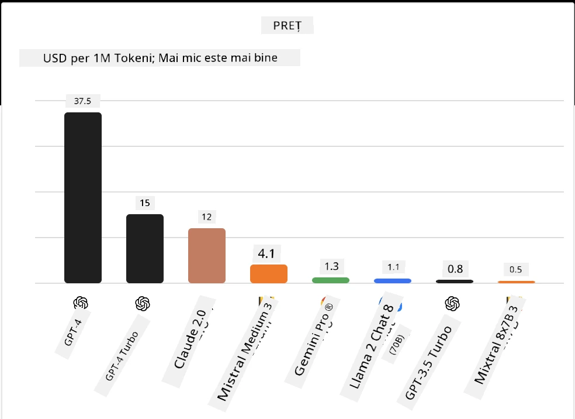
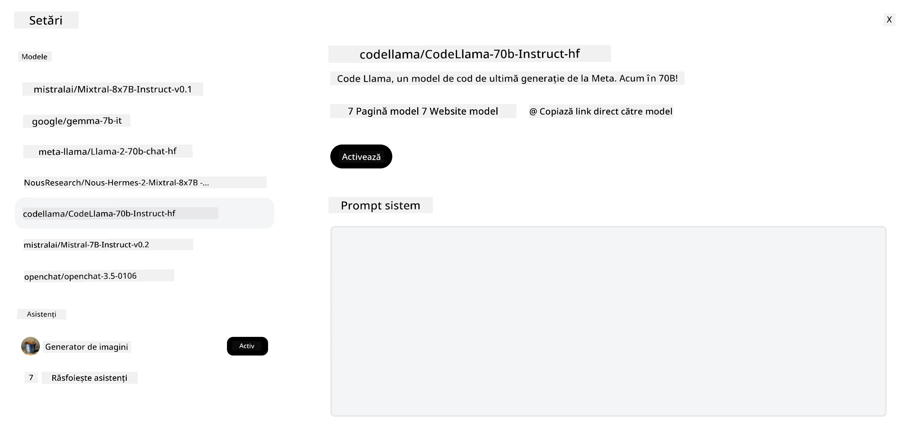
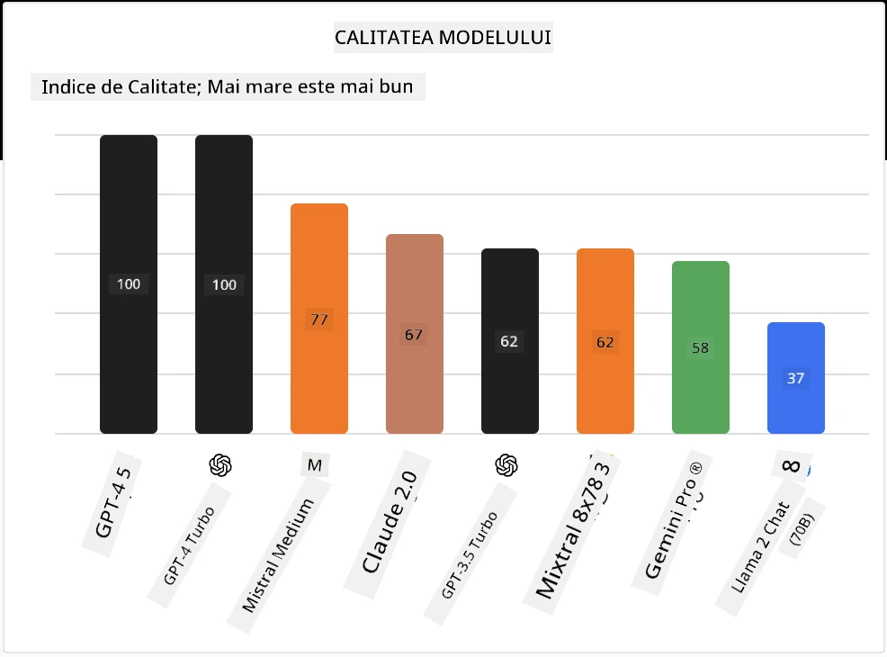

## Introducere

Lumea LLM-urilor open-source este interesantă și în continuă evoluție. Această lecție își propune să ofere o privire detaliată asupra modelelor open source. Dacă dorești informații despre cum se compară modelele proprietare cu cele open source, accesează lecția ["Explorarea și Compararea Diferitelor LLM-uri"](../02-exploring-and-comparing-different-llms/README.md?WT.mc_id=academic-105485-koreyst). Această lecție va aborda și subiectul ajustării fine, dar o explicație mai detaliată poate fi găsită în lecția ["Fine-Tuning LLMs"](../18-fine-tuning/README.md?WT.mc_id=academic-105485-koreyst).

## Obiective de învățare

- Dobândirea unei înțelegeri a modelelor open source
- Înțelegerea beneficiilor lucrului cu modelele open source
- Explorarea modelelor deschise disponibile pe Hugging Face și în catalogul de modele Microsoft Foundry

## Ce sunt Modelele Open Source?

Software-ul open source a jucat un rol crucial în dezvoltarea tehnologiei în diverse domenii. Inițiativa Open Source (OSI) a definit [10 criterii pentru software](https://web.archive.org/web/20241126001143/https://opensource.org/osd?WT.mc_id=academic-105485-koreyst) pentru a fi clasificat ca open source. Codul sursă trebuie să fie distribuit deschis sub o licență aprobată de OSI.

Deși dezvoltarea LLM-urilor are elemente similare cu dezvoltarea software-ului, procesul nu este exact același. Acest fapt a generat multe discuții în comunitate privind definiția open source în contextul LLM-urilor. Pentru ca un model să fie în acord cu definiția tradițională de open source, următoarele informații ar trebui să fie public disponibile:

- Seturile de date folosite pentru antrenarea modelului.
- Greutățile complete ale modelului ca parte a antrenamentului.
- Codul de evaluare.
- Codul de fine-tuning.
- Greutățile complete ale modelului și metricele de antrenament.

În prezent există doar câteva modele care îndeplinesc aceste criterii. [Modelul OLMo creat de Allen Institute for Artificial Intelligence (AllenAI)](https://huggingface.co/allenai/OLMo-7B?WT.mc_id=academic-105485-koreyst) este unul care se încadrează în această categorie.

Pentru această lecție, ne vom referi la modele ca „modele deschise” deoarece este posibil ca acestea să nu îndeplinească criteriile de mai sus la momentul scrierii.

## Beneficiile modelelor deschise

**Foarte personalizabile** - Deoarece modelele deschise sunt lansate cu informații detaliate despre antrenament, cercetătorii și dezvoltatorii pot modifica componentele interne ale modelului. Aceasta permite crearea de modele foarte specializate, ajustate fin pentru o sarcină specifică sau un domeniu de studiu. Exemple includ generarea de cod, operații matematice și biologie.

**Cost** - Costul per token pentru utilizarea și implementarea acestor modele este mai mic decât în cazul modelelor proprietare. Atunci când construiești aplicații de inteligență artificială generativă, este bine să analizezi raportul performanță-preț pentru cazul tău de utilizare.

Sursa: Artificial Analysis

**Flexibilitate** - Lucrul cu modelele deschise îți oferă flexibilitate în utilizarea mai multor modele diferite sau în combinarea lor. Un exemplu este [HuggingChat Assistants](https://huggingface.co/chat?WT.mc_id=academic-105485-koreyst), unde utilizatorul poate selecta modelul folosit direct din interfața utilizatorului:

## Explorarea diferitelor modele deschise

### Llama 2

[Llama2](https://huggingface.co/meta-llama?WT.mc_id=academic-105485-koreyst), dezvoltat de Meta, este un model deschis optimizat pentru aplicații bazate pe chat. Acest lucru se datorează metodei sale de fine-tuning, care a inclus un volum mare de dialoguri și feedback uman. Prin această metodă, modelul produce rezultate mai aliniate la așteptările umane, oferind o experiență mai bună utilizatorului.

Exemple de versiuni fine-tunate ale Llama includ [Japanese Llama](https://huggingface.co/elyza/ELYZA-japanese-Llama-2-7b?WT.mc_id=academic-105485-koreyst), specializat în limba japoneză și [Llama Pro](https://huggingface.co/TencentARC/LLaMA-Pro-8B?WT.mc_id=academic-105485-koreyst), o versiune îmbunătățită a modelului de bază.

### Mistral

[Mistral](https://huggingface.co/mistralai?WT.mc_id=academic-105485-koreyst) este un model deschis cu un puternic accent pe performanță și eficiență ridicate. Folosește abordarea Mixture-of-Experts, care combină un grup de modele experte specializate într-un singur sistem, unde, în funcție de input, anumite modele sunt selectate pentru a fi utilizate. Aceasta face calculul mai eficient, deoarece modelele se ocupă numai de intrările în care sunt specializate.

Exemple de versiuni fine-tunate ale modelului Mistral includ [BioMistral](https://huggingface.co/BioMistral/BioMistral-7B?text=Mon+nom+est+Thomas+et+mon+principal?WT.mc_id=academic-105485-koreyst), care se concentrează pe domeniul medical și [OpenMath Mistral](https://huggingface.co/nvidia/OpenMath-Mistral-7B-v0.1-hf?WT.mc_id=academic-105485-koreyst), care realizează calcule matematice.

### Falcon

[Falcon](https://huggingface.co/tiiuae?WT.mc_id=academic-105485-koreyst) este un LLM creat de Technology Innovation Institute (**TII**). Falcon-40B a fost antrenat cu 40 de miliarde de parametri și a demonstrat performanțe superioare față de GPT-3, cu un buget de calcul mai mic. Acest lucru se datorează utilizării algoritmului FlashAttention și a atenției multiquery, care reduc cerințele de memorie la momentul inferenței. Cu acest timp redus de inferență, Falcon-40B este potrivit pentru aplicații de chat.

Exemple de versiuni fine-tunate ale Falcon includ [OpenAssistant](https://huggingface.co/OpenAssistant/falcon-40b-sft-top1-560?WT.mc_id=academic-105485-koreyst), un asistent construit pe modele deschise, și [GPT4ALL](https://huggingface.co/nomic-ai/gpt4all-falcon?WT.mc_id=academic-105485-koreyst), care oferă performanțe mai bune decât modelul de bază.

## Cum să alegi

Nu există un răspuns universal pentru alegerea unui model deschis. Un punct bun de pornire este utilizarea funcției de filtrare după sarcină din catalogul de modele Microsoft Foundry. Aceasta te va ajuta să înțelegi pentru ce tipuri de sarcini a fost antrenat modelul. Hugging Face întreține, de asemenea, un LLM Leaderboard care arată cele mai performante modele pe baza anumitor metrici.

Pentru comparația LLM-urilor din diverse categorii, [Artificial Analysis](https://artificialanalysis.ai/?WT.mc_id=academic-105485-koreyst) este o altă resursă excelentă:

Sursa: Artificial Analysis

Dacă lucrezi pe un caz specific de utilizare, căutarea versiunilor fine-tunate care se concentrează pe același domeniu poate fi eficientă. Experimentarea cu mai multe modele deschise pentru a vedea cum performează conform așteptărilor tale și ale utilizatorilor tăi este o altă practică bună.

## Pașii următori

Partea cea mai bună la modelele deschise este că poți începe să lucrezi cu ele destul de repede. Consultă [catalogul de modele Microsoft Foundry](https://ai.azure.com?WT.mc_id=academic-105485-koreyst), care include o colecție specifică Hugging Face cu aceste modele discutate aici.

## Învățarea nu se oprește aici, continuă călătoria

După terminarea acestei lecții, consultă colecția noastră de [Generative AI Learning](https://aka.ms/genai-collection?WT.mc_id=academic-105485-koreyst) pentru a-ți continua dezvoltarea cunoștințelor despre Inteligența Artificială Generativă!

---

<!-- CO-OP TRANSLATOR DISCLAIMER START -->
**Declinare a responsabilității**:
Acest document a fost tradus folosind serviciul de traducere AI [Co-op Translator](https://github.com/Azure/co-op-translator). În timp ce ne străduim pentru acuratețe, vă rugăm să rețineți că traducerile automate pot conține erori sau inexactități. Documentul original în limba sa nativă trebuie considerat sursa autorizată. Pentru informații critice, se recomandă traducerea profesională realizată de un om. Nu ne asumăm responsabilitatea pentru eventualele neînțelegeri sau interpretări greșite care decurg din utilizarea acestei traduceri.
<!-- CO-OP TRANSLATOR DISCLAIMER END -->