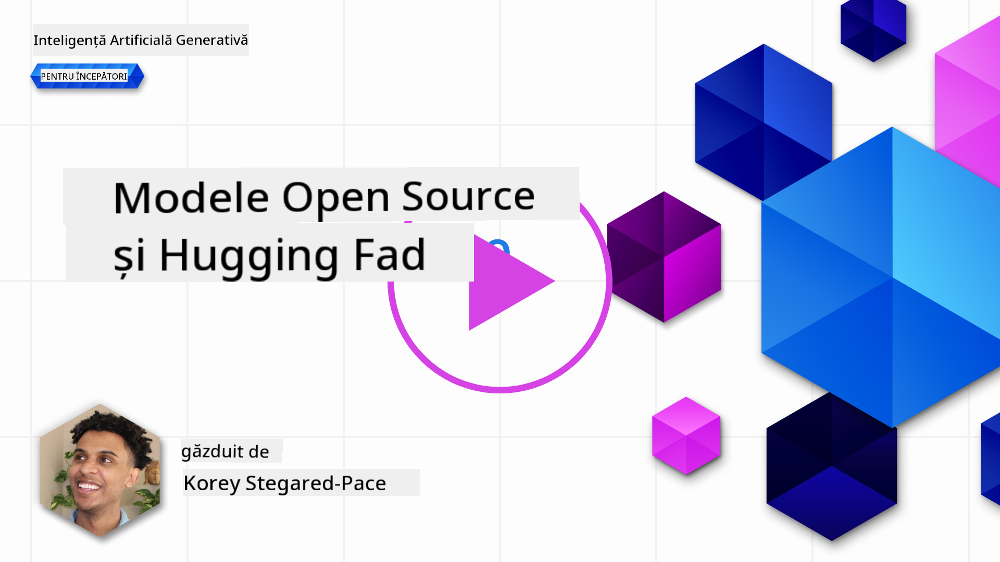

<!--
CO_OP_TRANSLATOR_METADATA:
{
  "original_hash": "0bba96e53ab841d99db731892a51fab8",
  "translation_date": "2025-07-09T17:14:50+00:00",
  "source_file": "16-open-source-models/README.md",
  "language_code": "ro"
}
-->

## Introducere

Lumea LLM-urilor open source este captivantă și în continuă evoluție. Această lecție își propune să ofere o privire detaliată asupra modelelor open source. Dacă dorești informații despre cum se compară modelele proprietare cu cele open source, accesează lecția ["Explorarea și compararea diferitelor LLM-uri"](../02-exploring-and-comparing-different-llms/README.md?WT.mc_id=academic-105485-koreyst). De asemenea, această lecție va aborda subiectul fine-tuning-ului, dar o explicație mai detaliată poate fi găsită în lecția ["Fine-Tuning LLMs"](../18-fine-tuning/README.md?WT.mc_id=academic-105485-koreyst).

## Obiective de învățare

- Să înțelegi ce sunt modelele open source  
- Să înțelegi beneficiile lucrului cu modele open source  
- Să explorezi modelele open disponibile pe Hugging Face și Azure AI Studio  

## Ce sunt modelele Open Source?

Software-ul open source a jucat un rol esențial în dezvoltarea tehnologiei în diverse domenii. Open Source Initiative (OSI) a definit [10 criterii pentru software](https://web.archive.org/web/20241126001143/https://opensource.org/osd?WT.mc_id=academic-105485-koreyst) pentru a fi clasificat ca open source. Codul sursă trebuie să fie distribuit deschis sub o licență aprobată de OSI.

Deși dezvoltarea LLM-urilor are elemente similare cu dezvoltarea software-ului, procesul nu este identic. Acest lucru a generat multe discuții în comunitate despre definiția open source în contextul LLM-urilor. Pentru ca un model să fie considerat conform definiției tradiționale de open source, următoarele informații ar trebui să fie disponibile public:

- Seturile de date folosite pentru antrenarea modelului  
- Greutățile complete ale modelului ca parte a antrenamentului  
- Codul de evaluare  
- Codul de fine-tuning  
- Greutățile complete ale modelului și metricile de antrenament  

În prezent, există doar câteva modele care îndeplinesc aceste criterii. Modelul [OLMo creat de Allen Institute for Artificial Intelligence (AllenAI)](https://huggingface.co/allenai/OLMo-7B?WT.mc_id=academic-105485-koreyst) este unul care se încadrează în această categorie.

Pentru această lecție, vom folosi termenul „modele open” pentru a ne referi la aceste modele, deoarece este posibil ca ele să nu respecte toate criteriile de mai sus la momentul scrierii.

## Beneficiile modelelor Open

**Foarte personalizabile** – Deoarece modelele open sunt lansate cu informații detaliate despre antrenament, cercetătorii și dezvoltatorii pot modifica structura internă a modelului. Acest lucru permite crearea unor modele foarte specializate, ajustate pentru o anumită sarcină sau domeniu de studiu. Exemple includ generarea de cod, operații matematice și biologie.

**Cost** – Costul per token pentru utilizarea și implementarea acestor modele este mai mic decât cel al modelelor proprietare. Atunci când construiești aplicații Generative AI, este important să analizezi raportul performanță-preț în funcție de cazul tău de utilizare.

  
Sursa: Artificial Analysis

**Flexibilitate** – Lucrul cu modele open îți oferă flexibilitate în utilizarea diferitelor modele sau combinarea lor. Un exemplu este [HuggingChat Assistants](https://huggingface.co/chat?WT.mc_id=academic-105485-koreyst), unde utilizatorul poate selecta modelul folosit direct din interfața utilizator:

## Explorarea diferitelor modele open

### Llama 2

[LLama2](https://huggingface.co/meta-llama?WT.mc_id=academic-105485-koreyst), dezvoltat de Meta, este un model open optimizat pentru aplicații bazate pe chat. Acest lucru se datorează metodei sale de fine-tuning, care a inclus o cantitate mare de dialog și feedback uman. Prin această metodă, modelul produce rezultate mai aliniate așteptărilor umane, oferind o experiență mai bună utilizatorului.

Unele versiuni fine-tunate ale Llama includ [Japanese Llama](https://huggingface.co/elyza/ELYZA-japanese-Llama-2-7b?WT.mc_id=academic-105485-koreyst), specializat pe limba japoneză, și [Llama Pro](https://huggingface.co/TencentARC/LLaMA-Pro-8B?WT.mc_id=academic-105485-koreyst), o versiune îmbunătățită a modelului de bază.

### Mistral

[Mistral](https://huggingface.co/mistralai?WT.mc_id=academic-105485-koreyst) este un model open axat pe performanță ridicată și eficiență. Folosește abordarea Mixture-of-Experts, care combină un grup de modele specializate într-un singur sistem, unde, în funcție de input, anumite modele sunt selectate pentru a fi utilizate. Aceasta face calculul mai eficient, deoarece modelele procesează doar tipurile de input pentru care sunt specializate.

Unele versiuni fine-tunate ale Mistral includ [BioMistral](https://huggingface.co/BioMistral/BioMistral-7B?text=Mon+nom+est+Thomas+et+mon+principal?WT.mc_id=academic-105485-koreyst), axat pe domeniul medical, și [OpenMath Mistral](https://huggingface.co/nvidia/OpenMath-Mistral-7B-v0.1-hf?WT.mc_id=academic-105485-koreyst), care realizează calcule matematice.

### Falcon

[Falcon](https://huggingface.co/tiiuae?WT.mc_id=academic-105485-koreyst) este un LLM creat de Technology Innovation Institute (**TII**). Falcon-40B a fost antrenat pe 40 de miliarde de parametri și a demonstrat performanțe mai bune decât GPT-3, cu un buget de calcul mai mic. Acest lucru se datorează utilizării algoritmului FlashAttention și a atenției multiquery, care reduc cerințele de memorie în timpul inferenței. Datorită timpului redus de inferență, Falcon-40B este potrivit pentru aplicații de chat.

Unele versiuni fine-tunate ale Falcon sunt [OpenAssistant](https://huggingface.co/OpenAssistant/falcon-40b-sft-top1-560?WT.mc_id=academic-105485-koreyst), un asistent construit pe modele open, și [GPT4ALL](https://huggingface.co/nomic-ai/gpt4all-falcon?WT.mc_id=academic-105485-koreyst), care oferă performanțe superioare modelului de bază.

## Cum să alegi

Nu există un răspuns unic pentru alegerea unui model open. Un punct bun de plecare este să folosești funcția de filtrare după sarcină din Azure AI Studio. Aceasta te va ajuta să înțelegi pentru ce tipuri de sarcini a fost antrenat modelul. Hugging Face menține, de asemenea, un LLM Leaderboard care arată cele mai performante modele pe baza anumitor metrici.

Pentru a compara LLM-uri din diferite categorii, [Artificial Analysis](https://artificialanalysis.ai/?WT.mc_id=academic-105485-koreyst) este o resursă excelentă:

  
Sursa: Artificial Analysis

Dacă lucrezi la un caz specific, căutarea versiunilor fine-tunate axate pe același domeniu poate fi eficientă. Experimentarea cu mai multe modele open pentru a vedea cum performează în funcție de așteptările tale și ale utilizatorilor este o practică recomandată.

## Pașii următori

Partea cea mai bună la modelele open este că poți începe să lucrezi cu ele destul de rapid. Consultă [Catalogul de modele Azure AI Studio](https://ai.azure.com?WT.mc_id=academic-105485-koreyst), care include o colecție specifică Hugging Face cu modelele discutate aici.

## Învățarea nu se oprește aici, continuă călătoria

După ce ai terminat această lecție, explorează colecția noastră de [Învățare Generative AI](https://aka.ms/genai-collection?WT.mc_id=academic-105485-koreyst) pentru a-ți continua dezvoltarea cunoștințelor în Generative AI!

**Declinare de responsabilitate**:  
Acest document a fost tradus folosind serviciul de traducere AI [Co-op Translator](https://github.com/Azure/co-op-translator). Deși ne străduim pentru acuratețe, vă rugăm să rețineți că traducerile automate pot conține erori sau inexactități. Documentul original în limba sa nativă trebuie considerat sursa autorizată. Pentru informații critice, se recomandă traducerea profesională realizată de un specialist uman. Nu ne asumăm răspunderea pentru eventualele neînțelegeri sau interpretări greșite rezultate din utilizarea acestei traduceri.