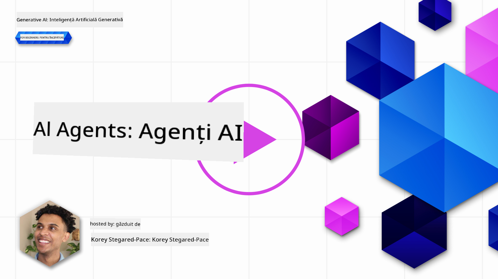
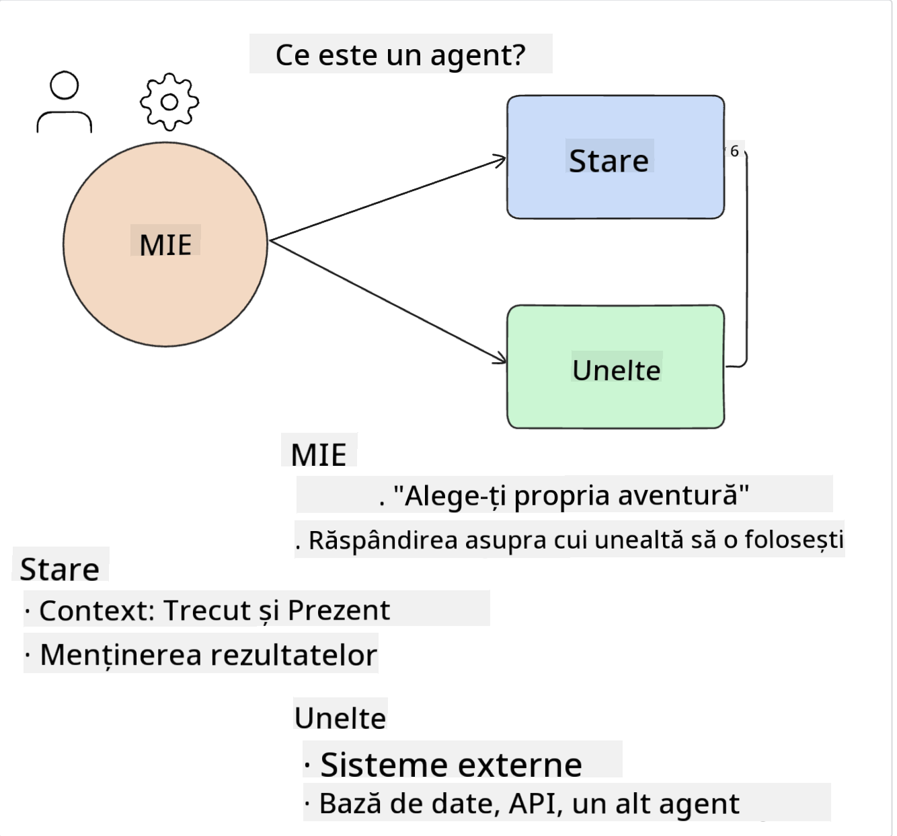
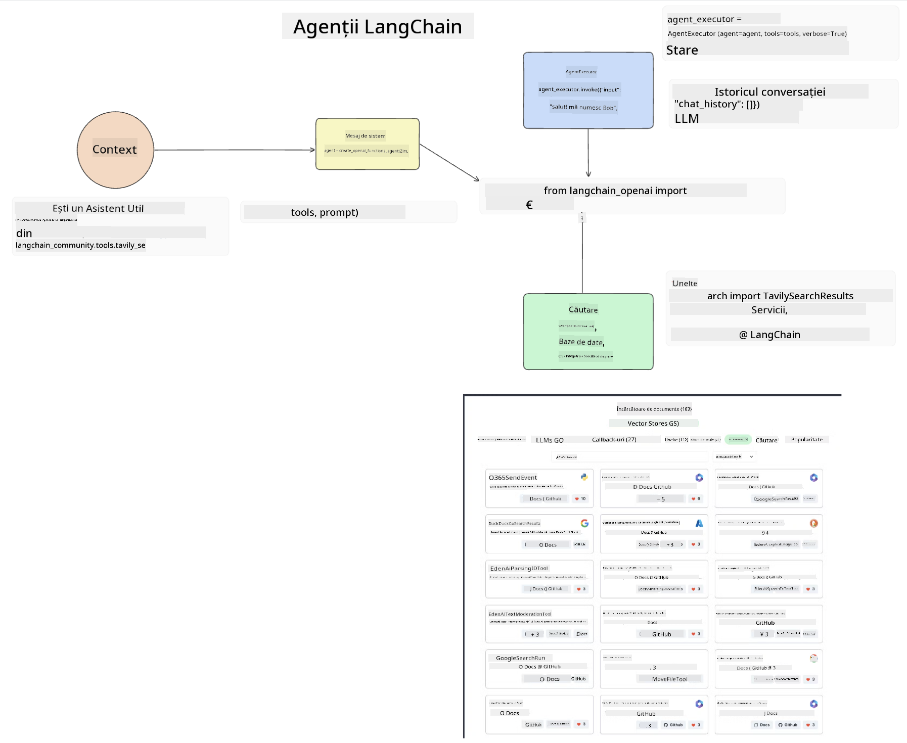
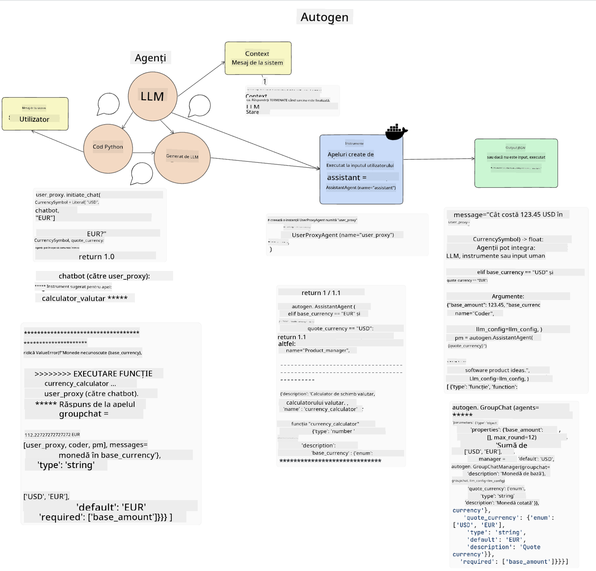
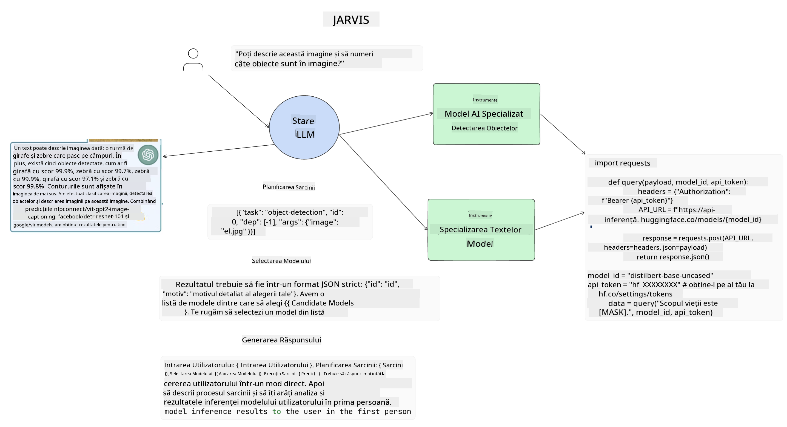

<!--
CO_OP_TRANSLATOR_METADATA:
{
  "original_hash": "11f03c81f190d9cbafd0f977dcbede6c",
  "translation_date": "2025-05-20T07:31:34+00:00",
  "source_file": "17-ai-agents/README.md",
  "language_code": "ro"
}
-->
[](https://aka.ms/gen-ai-lesson17-gh?WT.mc_id=academic-105485-koreyst)

## Introducere

Agenții AI reprezintă o evoluție interesantă în domeniul AI generativ, permițând modelelor de limbaj mari (LLMs) să evolueze de la asistenți la agenți capabili să ia măsuri. Cadrele de lucru pentru agenți AI permit dezvoltatorilor să creeze aplicații care oferă LLM-urilor acces la instrumente și gestionarea stării. Aceste cadre de lucru îmbunătățesc, de asemenea, vizibilitatea, permițând utilizatorilor și dezvoltatorilor să monitorizeze acțiunile planificate de LLM-uri, îmbunătățind astfel gestionarea experienței.

Lecția va acoperi următoarele aspecte:

- Înțelegerea a ceea ce este un agent AI - Ce este exact un agent AI?
- Explorarea a patru cadre de lucru diferite pentru agenți AI - Ce le face unice?
- Aplicarea acestor agenți AI în diferite cazuri de utilizare - Când ar trebui să folosim agenți AI?

## Obiective de învățare

După parcurgerea acestei lecții, vei putea:

- Explica ce sunt agenții AI și cum pot fi utilizați.
- Înțelege diferențele dintre unele dintre cele mai populare cadre de lucru pentru agenți AI și cum diferă acestea.
- Înțelege cum funcționează agenții AI pentru a construi aplicații cu ei.

## Ce sunt agenții AI?

Agenții AI reprezintă un domeniu foarte interesant în lumea AI generativ. Cu acest entuziasm vine uneori și o confuzie a termenilor și aplicarea lor. Pentru a simplifica lucrurile și a include majoritatea instrumentelor care se referă la agenții AI, vom folosi această definiție:

Agenții AI permit modelelor de limbaj mari (LLMs) să îndeplinească sarcini oferindu-le acces la un **stat** și **instrumente**.



Să definim acești termeni:

**Modele de limbaj mari** - Acestea sunt modelele menționate pe parcursul acestui curs, cum ar fi GPT-3.5, GPT-4, Llama-2, etc.

**Stat** - Acesta se referă la contextul în care LLM-ul lucrează. LLM-ul folosește contextul acțiunilor sale trecute și contextul curent, ghidându-și luarea deciziilor pentru acțiunile ulterioare. Cadrele de lucru pentru agenți AI permit dezvoltatorilor să mențină acest context mai ușor.

**Instrumente** - Pentru a finaliza sarcina pe care utilizatorul a solicitat-o și pe care LLM-ul a planificat-o, LLM-ul are nevoie de acces la instrumente. Unele exemple de instrumente pot fi o bază de date, un API, o aplicație externă sau chiar un alt LLM!

Aceste definiții sperăm să vă ofere o bază solidă pe măsură ce explorăm modul în care sunt implementate. Să explorăm câteva cadre de lucru diferite pentru agenți AI:

## Agenți LangChain

[Agenții LangChain](https://python.langchain.com/docs/how_to/#agents?WT.mc_id=academic-105485-koreyst) sunt o implementare a definițiilor pe care le-am oferit mai sus.

Pentru a gestiona **statul**, se folosește o funcție încorporată numită `AgentExecutor`. Aceasta acceptă `agent` definite și `tools` disponibile pentru ea.

`Agent Executor` stochează, de asemenea, istoricul conversațiilor pentru a oferi contextul conversației.



LangChain oferă un [catalog de instrumente](https://integrations.langchain.com/tools?WT.mc_id=academic-105485-koreyst) care pot fi importate în aplicația ta, la care LLM-ul poate avea acces. Acestea sunt realizate de comunitate și de echipa LangChain.

Poți apoi să definești aceste instrumente și să le transmiți către `Agent Executor`.

Vizibilitatea este un alt aspect important atunci când vorbim despre agenți AI. Este important pentru dezvoltatorii de aplicații să înțeleagă ce instrument folosește LLM-ul și de ce. Pentru asta, echipa de la LangChain a dezvoltat LangSmith.

## AutoGen

Următorul cadru de lucru pentru agenți AI pe care îl vom discuta este [AutoGen](https://microsoft.github.io/autogen/?WT.mc_id=academic-105485-koreyst). Principala preocupare a AutoGen este conversația. Agenții sunt atât **conversabili**, cât și **personalizabili**.

**Conversabili -** LLM-urile pot începe și continua o conversație cu un alt LLM pentru a finaliza o sarcină. Acest lucru se face prin crearea `AssistantAgents` și oferindu-le un mesaj de sistem specific.

```python

autogen.AssistantAgent( name="Coder", llm_config=llm_config, ) pm = autogen.AssistantAgent( name="Product_manager", system_message="Creative in software product ideas.", llm_config=llm_config, )

```

**Personalizabili** - Agenții pot fi definiți nu doar ca LLM-uri, ci și ca un utilizator sau un instrument. Ca dezvoltator, poți defini un `UserProxyAgent` care este responsabil pentru interacțiunea cu utilizatorul pentru feedback în finalizarea unei sarcini. Acest feedback poate continua execuția sarcinii sau o poate opri.

```python
user_proxy = UserProxyAgent(name="user_proxy")
```

### Stat și Instrumente

Pentru a schimba și gestiona statul, un Agent asistent generează cod Python pentru a finaliza sarcina.

Iată un exemplu al procesului:



#### LLM Definit cu un Mesaj de Sistem

```python
system_message="For weather related tasks, only use the functions you have been provided with. Reply TERMINATE when the task is done."
```

Acest mesaj de sistem direcționează acest LLM specific către funcțiile relevante pentru sarcina sa. Amintește-ți, cu AutoGen poți avea mai mulți Asistenți Agenți definiți cu mesaje de sistem diferite.

#### Conversația este Inițiată de Utilizator

```python
user_proxy.initiate_chat( chatbot, message="I am planning a trip to NYC next week, can you help me pick out what to wear? ", )

```

Acest mesaj de la user_proxy (Om) este ceea ce va începe procesul Agentului de a explora funcțiile posibile pe care ar trebui să le execute.

#### Funcția este Executată

```bash
chatbot (to user_proxy):

***** Suggested tool Call: get_weather ***** Arguments: {"location":"New York City, NY","time_periond:"7","temperature_unit":"Celsius"} ******************************************************** --------------------------------------------------------------------------------

>>>>>>>> EXECUTING FUNCTION get_weather... user_proxy (to chatbot): ***** Response from calling function "get_weather" ***** 112.22727272727272 EUR ****************************************************************

```

Odată ce conversația inițială este procesată, Agentul va trimite instrumentul sugerat pentru a fi apelat. În acest caz, este o funcție numită `get_weather`. Depending on your configuration, this function can be automatically executed and read by the Agent or can be executed based on user input.

You can find a list of [AutoGen code samples](https://microsoft.github.io/autogen/docs/Examples/?WT.mc_id=academic-105485-koreyst) to further explore how to get started building.

## Taskweaver

The next agent framework we will explore is [Taskweaver](https://microsoft.github.io/TaskWeaver/?WT.mc_id=academic-105485-koreyst). It is known as a "code-first" agent because instead of working strictly with `strings` , it can work with DataFrames in Python. This becomes extremely useful for data analysis and generation tasks. This can be things like creating graphs and charts or generating random numbers.

### State and Tools

To manage the state of the conversation, TaskWeaver uses the concept of a `Planner`. The `Planner` is a LLM that takes the request from the users and maps out the tasks that need to be completed to fulfill this request.

To complete the tasks the `Planner` is exposed to the collection of tools called `Plugins`. Acestea pot fi clase Python sau un interpret general de cod. Aceste pluginuri sunt stocate ca încorporări astfel încât LLM-ul să poată căuta mai bine pluginul corect.


Iată un exemplu de plugin pentru a gestiona detectarea anomaliilor:

```python
class AnomalyDetectionPlugin(Plugin): def __call__(self, df: pd.DataFrame, time_col_name: str, value_col_name: str):
```

Codul este verificat înainte de a fi executat. O altă caracteristică pentru gestionarea contextului în Taskweaver este `experience`. Experience allows for the context of a conversation to be stored over to the long term in a YAML file. This can be configured so that the LLM improves over time on certain tasks given that it is exposed to prior conversations.

## JARVIS

The last agent framework we will explore is [JARVIS](https://github.com/microsoft/JARVIS?tab=readme-ov-file?WT.mc_id=academic-105485-koreyst). What makes JARVIS unique is that it uses an LLM to manage the `state` al conversației și `tools` sunt alte modele AI. Fiecare dintre modelele AI sunt modele specializate care îndeplinesc anumite sarcini, cum ar fi detectarea obiectelor, transcrierea sau subtitrarea imaginilor.



LLM-ul, fiind un model de scop general, primește cererea de la utilizator și identifică sarcina specifică și orice argumente/date necesare pentru a finaliza sarcina.

```python
[{"task": "object-detection", "id": 0, "dep": [-1], "args": {"image": "e1.jpg" }}]
```

LLM-ul apoi formatează cererea într-un mod pe care modelul AI specializat îl poate interpreta, cum ar fi JSON. Odată ce modelul AI a returnat predicția sa bazată pe sarcină, LLM-ul primește răspunsul.

Dacă sunt necesare mai multe modele pentru a finaliza sarcina, va interpreta și răspunsul de la acele modele înainte de a le aduce împreună pentru a genera răspunsul către utilizator.

Exemplul de mai jos arată cum ar funcționa acest lucru atunci când un utilizator solicită o descriere și numărul obiectelor dintr-o imagine:

## Temă

Pentru a continua învățarea despre agenții AI, poți construi cu AutoGen:

- O aplicație care simulează o întâlnire de afaceri cu diferite departamente ale unei startup-uri de educație.
- Creează mesaje de sistem care să ghideze LLM-urile în înțelegerea diferitelor personalități și priorități și să permită utilizatorului să prezinte o idee de produs nou.
- LLM-ul ar trebui apoi să genereze întrebări de urmărire din partea fiecărui departament pentru a rafina și îmbunătăți prezentarea și ideea de produs.

## Învățarea nu se oprește aici, continuă călătoria

După ce ai finalizat această lecție, verifică [colecția noastră de învățare AI generativă](https://aka.ms/genai-collection?WT.mc_id=academic-105485-koreyst) pentru a continua să îți îmbunătățești cunoștințele despre AI generativ!

**Declinarea responsabilității**:  
Acest document a fost tradus folosind serviciul de traducere AI [Co-op Translator](https://github.com/Azure/co-op-translator). Deși ne străduim să asigurăm acuratețea, vă rugăm să fiți conștienți că traducerile automate pot conține erori sau inexactități. Documentul original în limba sa maternă ar trebui considerat sursa autoritară. Pentru informații critice, se recomandă traducerea profesională umană. Nu suntem responsabili pentru eventualele neînțelegeri sau interpretări greșite care pot apărea din utilizarea acestei traduceri.