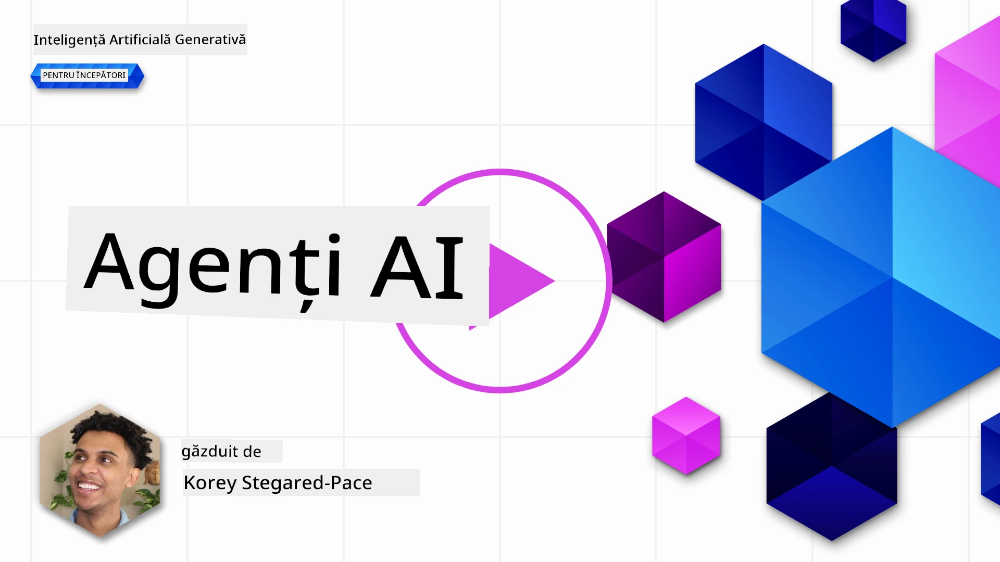
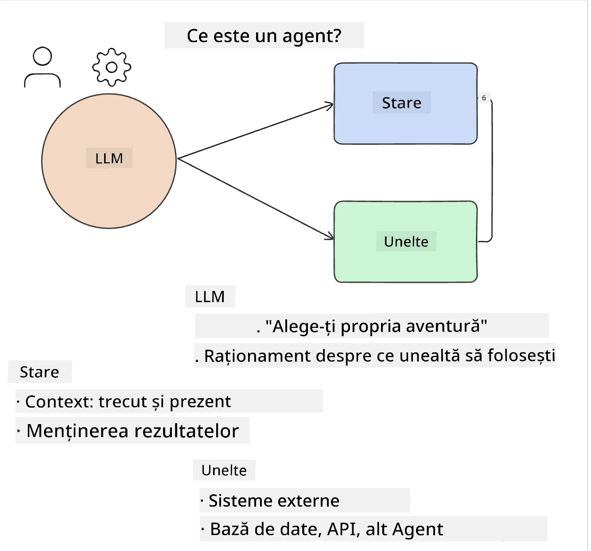
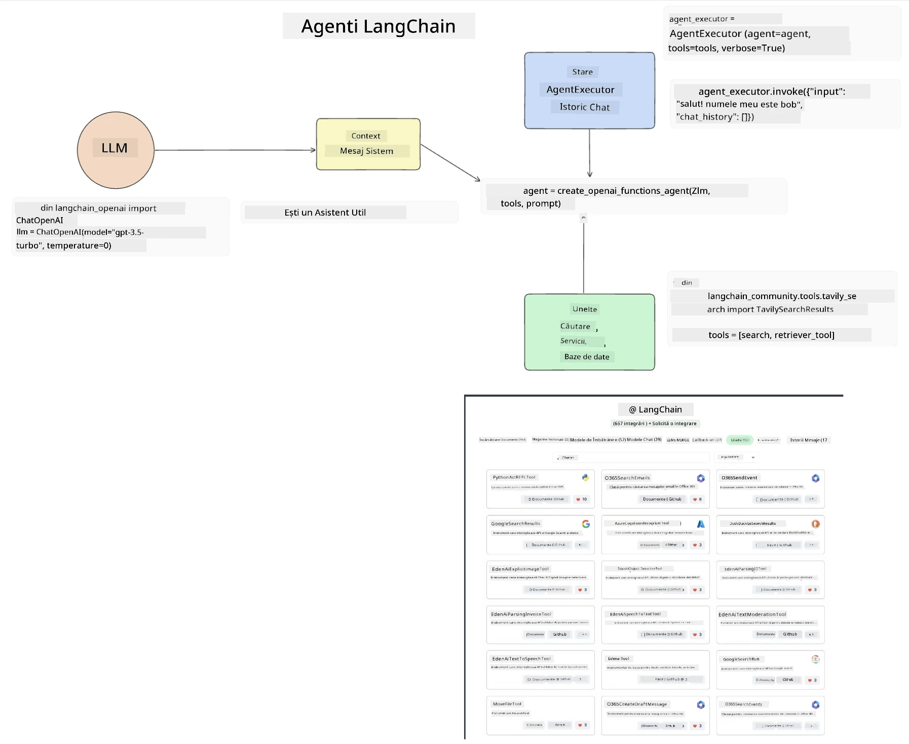
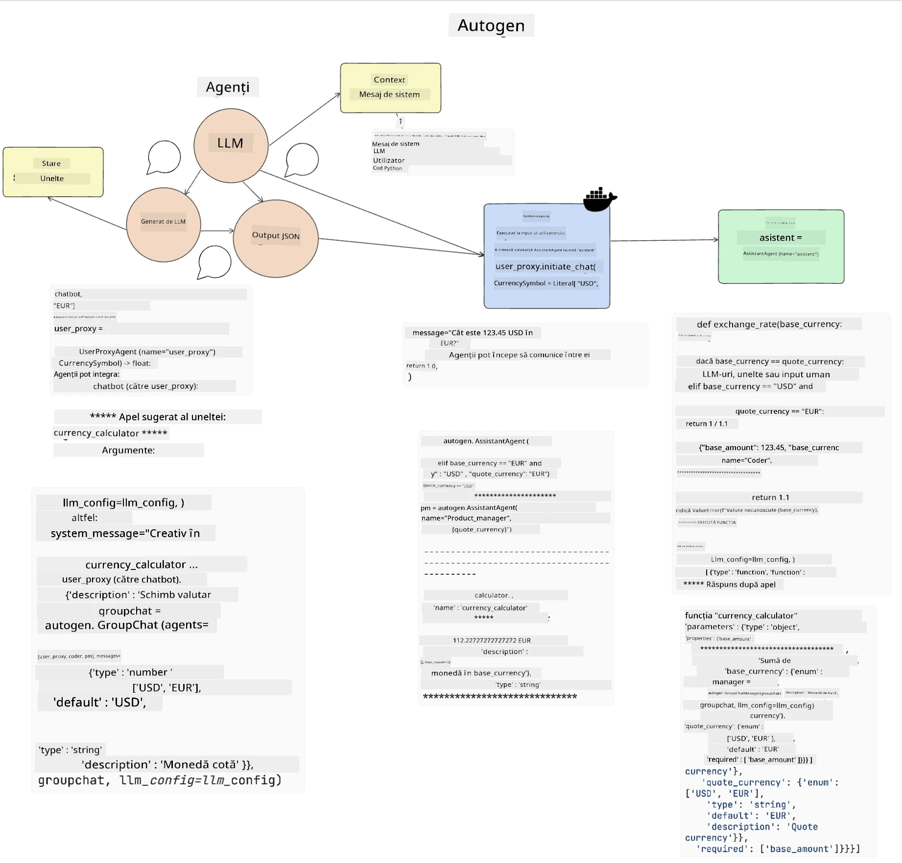
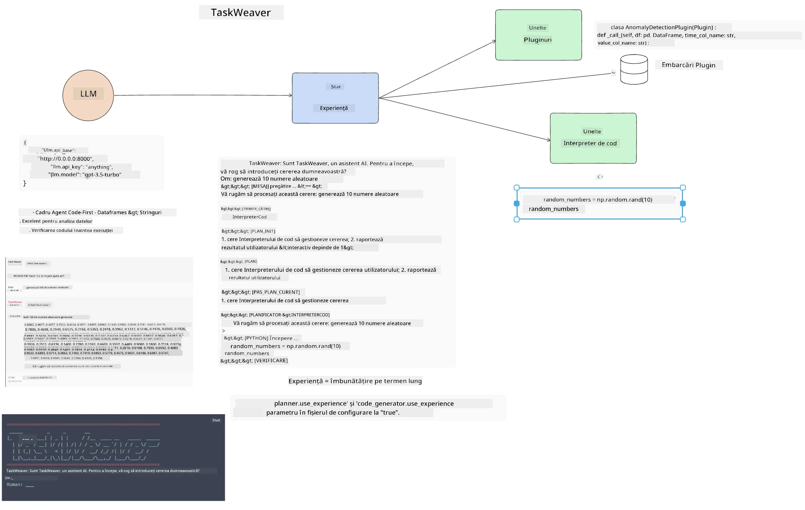
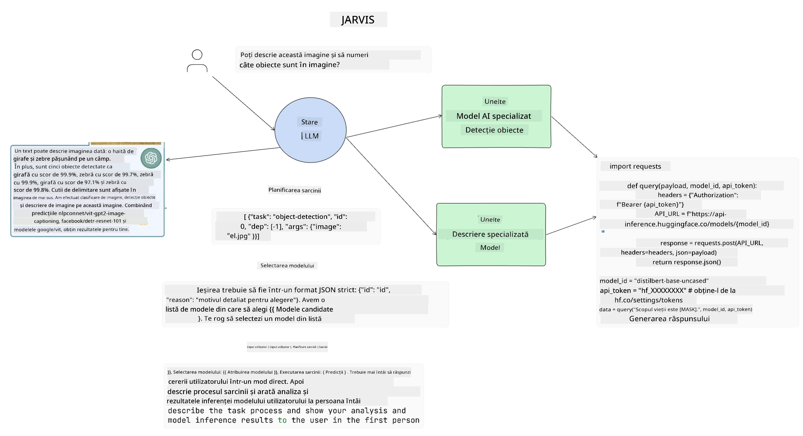

[](https://youtu.be/yAXVW-lUINc?si=bOtW9nL6jc3XJgOM)

## Introducere

Agenții AI reprezintă o dezvoltare interesantă în AI Generativ, permițând Modelelor Mari de Limbaj (LLMs) să evolueze de la asistenți la agenți capabili să întreprindă acțiuni. Framework-urile pentru Agenți AI permit dezvoltatorilor să creeze aplicații care oferă LLM-urilor acces la instrumente și gestionarea stării. Aceste cadre îmbunătățesc, de asemenea, vizibilitatea, permițând utilizatorilor și dezvoltatorilor să monitorizeze acțiunile planificate de LLM-uri, îmbunătățind astfel gestionarea experienței.

Lecția va acoperi următoarele domenii:

- Înțelegerea a ceea ce este un Agent AI – Ce este exact un Agent AI?
- Explorarea a patru diferite Framework-uri de Agenți AI – Ce le face unice?
- Aplicarea acestor Agenți AI în diferite cazuri de utilizare – Când ar trebui să folosim Agenți AI?

## Obiectivele învățării

După ce parcurgi această lecție, vei putea:

- Explica ce sunt Agenții AI și cum pot fi folosiți.
- Avea o înțelegere a diferențelor dintre unele dintre cele mai populare Framework-uri de Agenți AI și cum diferă ele.
- Înțelege cum funcționează Agenții AI pentru a construi aplicații cu aceștia.

## Ce sunt Agenții AI?

Agenții AI sunt un domeniu foarte interesant în lumea AI Generativ. Odată cu acest entuziasm vine uneori o confuzie de termeni și aplicarea lor. Pentru a păstra lucrurile simple și incluzive pentru majoritatea uneltelor care fac referire la Agenții AI, vom folosi această definiție:

Agenții AI permit Modelelor Mari de Limbaj (LLMs) să efectueze sarcini oferindu-le acces la un **stat** și **unelte**.



Să definim acești termeni:

**Modele Mari de Limbaj** – Acestea sunt modelele la care se face referire pe tot parcursul acestui curs, cum ar fi GPT-3.5, GPT-4, Llama-2, etc.

**Stat** – Acesta se referă la contextul în care lucrează LLM-ul. LLM folosește contextul acțiunilor sale anterioare și contextul curent, ghidând procesul decizional pentru acțiunile ulterioare. Framework-urile pentru Agenți AI permit dezvoltatorilor să gestioneze acest context mai ușor.

**Unelte** – Pentru a finaliza sarcina pe care utilizatorul a solicitat-o și pe care LLM a planificat-o, LLM-ul are nevoie de acces la unelte. Exemple de unelte pot fi o bază de date, un API, o aplicație externă sau chiar un alt LLM!

Aceste definiții sperăm să-ți ofere o bază solidă pe parcurs, în timp ce vom examina cum sunt implementate acestea. Să explorăm câteva framework-uri diferite pentru Agenți AI:

## Agenții LangChain

[Agenții LangChain](https://python.langchain.com/docs/how_to/#agents?WT.mc_id=academic-105485-koreyst) sunt o implementare a definițiilor pe care le-am oferit mai sus.

Pentru a gestiona **statul**, folosește o funcție integrată numită `AgentExecutor`. Aceasta acceptă `agentul` definit și `uneltele` disponibile pentru acesta.

`AgentExecutor` stochează, de asemenea, istoricul conversațiilor pentru a oferi contextul dialogului.



LangChain oferă un [catalog de unelte](https://integrations.langchain.com/tools?WT.mc_id=academic-105485-koreyst) care pot fi importate în aplicația ta și la care LLM-ul poate avea acces. Acestea sunt realizate de comunitate și de echipa LangChain.

Poți apoi defini aceste unelte și să le transmiți la `AgentExecutor`.

Vizibilitatea este un alt aspect important atunci când vorbim despre Agenți AI. Este important pentru dezvoltatorii de aplicații să înțeleagă ce unealtă folosește LLM-ul și de ce. Pentru aceasta, echipa LangChain a dezvoltat LangSmith.

## AutoGen

Următorul framework pentru Agenți AI pe care îl vom discuta este [AutoGen](https://microsoft.github.io/autogen/?WT.mc_id=academic-105485-koreyst). Focusul principal al AutoGen este conversația. Agenții sunt atât **conversabili**, cât și **personalizabili**.

**Conversabili -** LLM-urile pot începe și continua o conversație cu un alt LLM pentru a finaliza o sarcină. Acest lucru se face prin crearea de `AssistantAgents` care primesc un mesaj de sistem specific.

```python

autogen.AssistantAgent( name="Coder", llm_config=llm_config, ) pm = autogen.AssistantAgent( name="Product_manager", system_message="Creative in software product ideas.", llm_config=llm_config, )

```

**Personalizabili** - Agenții pot fi definiți nu doar ca LLM-uri, ci pot fi și utilizatori sau unelte. Ca dezvoltator, poți defini un `UserProxyAgent` care este responsabil pentru a interacționa cu utilizatorul pentru feedback în realizarea unei sarcini. Acest feedback poate continua execuția sarcinii sau o poate opri.

```python
user_proxy = UserProxyAgent(name="user_proxy")
```

### Stat și Unelte

Pentru a schimba și gestiona statul, un Agent asistent generează cod Python pentru a îndeplini sarcina.

Iată un exemplu al procesului:



#### LLM definit printr-un mesaj de sistem

```python
system_message="For weather related tasks, only use the functions you have been provided with. Reply TERMINATE when the task is done."
```

Acest mesaj de sistem direcționează acest LLM specific către funcțiile relevante pentru sarcina sa. Amintește-ți, cu AutoGen poți avea mai mulți AssistantAgents definiți cu mesaje de sistem diferite.

#### Conversația este inițiată de utilizator

```python
user_proxy.initiate_chat( chatbot, message="I am planning a trip to NYC next week, can you help me pick out what to wear? ", )

```

Acest mesaj de la user_proxy (Umant) este ceea ce va începe procesul Agentului de a explora funcțiile posibile pe care ar trebui să le execute.

#### Funcția este executată

```bash
chatbot (to user_proxy):

***** Suggested tool Call: get_weather ***** Arguments: {"location":"New York City, NY","time_periond:"7","temperature_unit":"Celsius"} ******************************************************** --------------------------------------------------------------------------------

>>>>>>>> EXECUTING FUNCTION get_weather... user_proxy (to chatbot): ***** Response from calling function "get_weather" ***** 112.22727272727272 EUR ****************************************************************

```

Odată ce conversația inițială este procesată, Agentul va trimite sugestia de unealtă de apelat. În acest caz, este o funcție numită `get_weather` (obține vremea). În funcție de configurația ta, această funcție poate fi executată automat și citită de Agent sau poate fi executată pe baza inputului utilizatorului.

Poți găsi o listă de [exemple de cod AutoGen](https://microsoft.github.io/autogen/docs/Examples/?WT.mc_id=academic-105485-koreyst) pentru a explora mai mult cum să începi să construiești.

## Taskweaver

Următorul framework pe care îl vom explora este [Taskweaver](https://microsoft.github.io/TaskWeaver/?WT.mc_id=academic-105485-koreyst). Este cunoscut ca un agent „code-first” deoarece, în loc să lucreze strict cu `stringuri`, poate lucra cu DataFrames în Python. Acest lucru devine extrem de util pentru sarcini de analiză și generare de date. Pot fi lucruri precum crearea de grafice și diagrame sau generarea de numere aleatorii.

### Stat și Unelte

Pentru a gestiona statul conversației, TaskWeaver folosește conceptul unui `Planner` (Planificator). `Planner` este un LLM care ia cererea utilizatorilor și cartografiază sarcinile care trebuie finalizate pentru a îndeplini această cerere.

Pentru a îndeplini sarcinile, `Planner` are acces la colecția de unelte numite `Plugins`. Acestea pot fi clase Python sau un interpret general de cod. Aceste plugin-uri sunt stocate ca embedding-uri astfel încât LLM-ul să poată căuta mai bine plugin-ul corect.



Iată un exemplu de plugin pentru gestionarea detectării anomaliilor:

```python
class AnomalyDetectionPlugin(Plugin): def __call__(self, df: pd.DataFrame, time_col_name: str, value_col_name: str):
```

Codul este verificat înainte de execuție. O altă funcționalitate pentru gestionarea contextului în Taskweaver este `experience` (experiență). Experiența permite ca contextul unei conversații să fie stocat pe termen lung într-un fișier YAML. Acest lucru poate fi configurat astfel încât LLM să se îmbunătățească în timp la anumite sarcini, dat fiind că este expus la conversații anterioare.

## JARVIS

Ultimul framework pentru agenți pe care îl vom explora este [JARVIS](https://github.com/microsoft/JARVIS?tab=readme-ov-file&WT.mc_id=academic-105485-koreyst). Ce face JARVIS unic este că folosește un LLM pentru a gestiona `statul` conversației, iar `uneltele` sunt alte modele AI. Fiecare dintre aceste modele AI sunt modele specializate care efectuează anumite sarcini, cum ar fi detectarea obiectelor, transcrierea sau realizarea de subtitrări pentru imagini.



LLM-ul, fiind un model cu scop general, primește cererea de la utilizator și identifică sarcina specifică și orice argument/date necesare pentru a îndeplini sarcina.

```python
[{"task": "object-detection", "id": 0, "dep": [-1], "args": {"image": "e1.jpg" }}]
```

LLM-ul apoi formatează cererea într-un mod pe care modelul AI specializat îl poate interpreta, cum ar fi JSON. Odată ce modelul AI a returnat predicția bazată pe sarcină, LLM-ul primește răspunsul.

Dacă este necesar un număr mai mare de modele pentru a îndeplini sarcina, acesta va interpreta și răspunsul de la acele modele înainte de a le reuni pentru a genera răspunsul către utilizator.

Exemplul de mai jos arată cum ar funcționa acest lucru când un utilizator solicită o descriere și numără obiectele dintr-o imagine:

## Temă

Pentru a-ți continua învățarea Agenților AI poți construi cu AutoGen:

- O aplicație care simulează o întâlnire de afaceri cu diferite departamente ale unei startup educaționale.
- Creează mesaje de sistem care să ghideze LLM-urile să înțeleagă diferite personaje și priorități și să permită utilizatorului să propună o idee nouă de produs.
- LLM-ul ar trebui apoi să genereze întrebări de urmărire din partea fiecărui departament pentru a rafina și îmbunătăți prezentarea și ideea de produs.

## Învățarea nu se oprește aici, continuă călătoria

După ce ai terminat această lecție, consultă colecția noastră de [Învățare AI Generativă](https://aka.ms/genai-collection?WT.mc_id=academic-105485-koreyst) pentru a-ți continua creșterea în cunoștințe despre AI Generativ!

---

<!-- CO-OP TRANSLATOR DISCLAIMER START -->
**Declinare de responsabilitate**:  
Acest document a fost tradus folosind serviciul de traducere AI [Co-op Translator](https://github.com/Azure/co-op-translator). Deși ne străduim pentru acuratețe, vă rugăm să fiți conștienți că traducerile automate pot conține erori sau inexactități. Documentul original în limba sa nativă trebuie considerat sursa autorizată. Pentru informații critice, se recomandă traducerea profesională umană. Nu ne asumăm responsabilitatea pentru orice neînțelegeri sau interpretări greșite rezultate din utilizarea acestei traduceri.
<!-- CO-OP TRANSLATOR DISCLAIMER END -->