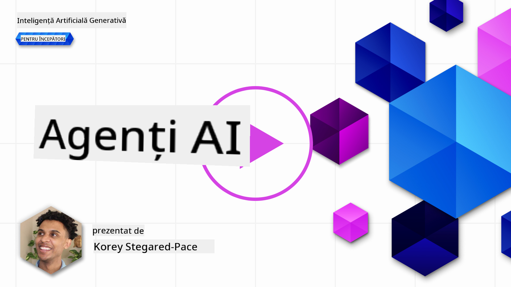
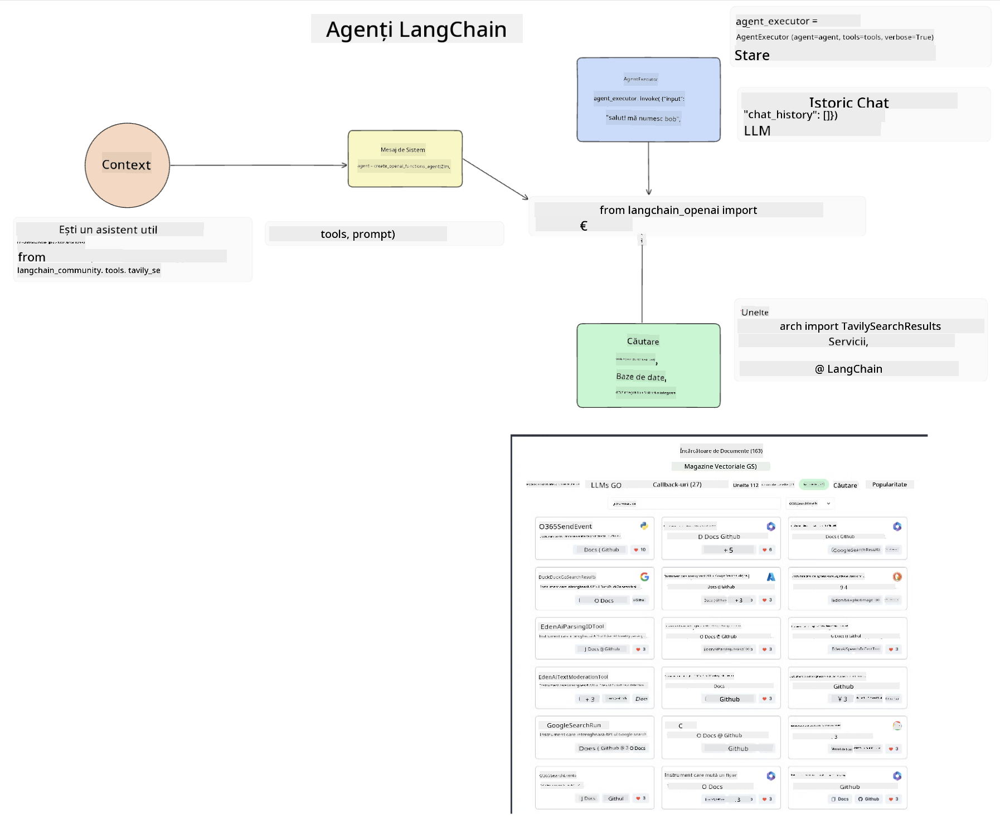

<!--
CO_OP_TRANSLATOR_METADATA:
{
  "original_hash": "8e8d1f6a63da606af7176a87ff8e92b6",
  "translation_date": "2025-10-17T22:12:18+00:00",
  "source_file": "17-ai-agents/README.md",
  "language_code": "ro"
}
-->
[](https://youtu.be/yAXVW-lUINc?si=bOtW9nL6jc3XJgOM)

## Introducere

Agenții AI reprezintă o dezvoltare captivantă în domeniul AI Generativ, permițând modelelor lingvistice mari (LLMs) să evolueze de la simple asistenți la agenți capabili să ia decizii și să acționeze. Framework-urile pentru agenți AI permit dezvoltatorilor să creeze aplicații care oferă LLM-urilor acces la instrumente și gestionarea stării. Aceste framework-uri îmbunătățesc, de asemenea, vizibilitatea, permițând utilizatorilor și dezvoltatorilor să monitorizeze acțiunile planificate de LLM-uri, îmbunătățind astfel gestionarea experienței.

Lecția va acoperi următoarele aspecte:

- Înțelegerea conceptului de Agent AI - Ce este exact un Agent AI?
- Explorarea a patru framework-uri diferite pentru Agenți AI - Ce le face unice?
- Aplicarea acestor Agenți AI în diverse cazuri de utilizare - Când ar trebui să folosim Agenți AI?

## Obiective de învățare

După parcurgerea acestei lecții, vei putea:

- Explica ce sunt Agenții AI și cum pot fi utilizați.
- Înțelege diferențele dintre unele dintre cele mai populare framework-uri pentru Agenți AI și ce le face diferite.
- Înțelege cum funcționează Agenții AI pentru a construi aplicații cu ajutorul lor.

## Ce sunt Agenții AI?

Agenții AI reprezintă un domeniu foarte interesant în lumea AI Generativ. Cu acest entuziasm vine uneori și o confuzie legată de termeni și aplicarea lor. Pentru a simplifica lucrurile și pentru a include majoritatea instrumentelor care se referă la Agenți AI, vom folosi următoarea definiție:

Agenții AI permit modelelor lingvistice mari (LLMs) să îndeplinească sarcini oferindu-le acces la un **context** și **instrumente**.


Să definim acești termeni:

**Modele lingvistice mari** - Acestea sunt modelele menționate pe parcursul acestui curs, cum ar fi GPT-3.5, GPT-4, Llama-2 etc.

**Context** - Se referă la contextul în care LLM-ul lucrează. LLM-ul folosește contextul acțiunilor sale anterioare și contextul curent pentru a-și ghida deciziile în acțiunile ulterioare. Framework-urile pentru Agenți AI permit dezvoltatorilor să gestioneze mai ușor acest context.

**Instrumente** - Pentru a finaliza sarcina solicitată de utilizator și planificată de LLM, acesta are nevoie de acces la instrumente. Exemple de instrumente pot fi o bază de date, un API, o aplicație externă sau chiar un alt LLM!

Aceste definiții sperăm să îți ofere o bază solidă pe măsură ce explorăm modul în care sunt implementate. Să explorăm câteva framework-uri diferite pentru Agenți AI:

## Agenți LangChain

[Agenții LangChain](https://python.langchain.com/docs/how_to/#agents?WT.mc_id=academic-105485-koreyst) reprezintă o implementare a definițiilor pe care le-am oferit mai sus.

Pentru a gestiona **contextul**, folosește o funcție încorporată numită `AgentExecutor`. Aceasta acceptă `agentul` definit și `instrumentele` disponibile pentru acesta.

`AgentExecutor` stochează, de asemenea, istoricul conversațiilor pentru a oferi contextul discuției.



LangChain oferă un [catalog de instrumente](https://integrations.langchain.com/tools?WT.mc_id=academic-105485-koreyst) care pot fi importate în aplicația ta, oferind LLM-ului acces la ele. Acestea sunt create de comunitate și de echipa LangChain.

Poți defini aceste instrumente și să le transmiți către `AgentExecutor`.

Vizibilitatea este un alt aspect important atunci când vorbim despre Agenți AI. Este esențial pentru dezvoltatorii de aplicații să înțeleagă ce instrument folosește LLM-ul și de ce. Pentru aceasta, echipa LangChain a dezvoltat LangSmith.

## AutoGen

Următorul framework pentru Agenți AI pe care îl vom discuta este [AutoGen](https://microsoft.github.io/autogen/?WT.mc_id=academic-105485-koreyst). Principalul său obiectiv este conversația. Agenții sunt atât **conversabili**, cât și **personalizabili**.

**Conversabili -** LLM-urile pot iniția și continua o conversație cu un alt LLM pentru a finaliza o sarcină. Acest lucru se realizează prin crearea de `AssistantAgents` și oferindu-le un mesaj specific de sistem.

```python

autogen.AssistantAgent( name="Coder", llm_config=llm_config, ) pm = autogen.AssistantAgent( name="Product_manager", system_message="Creative in software product ideas.", llm_config=llm_config, )

```

**Personalizabili** - Agenții pot fi definiți nu doar ca LLM-uri, ci și ca utilizatori sau instrumente. Ca dezvoltator, poți defini un `UserProxyAgent`, care este responsabil pentru interacțiunea cu utilizatorul pentru feedback în finalizarea unei sarcini. Acest feedback poate continua execuția sarcinii sau o poate opri.

```python
user_proxy = UserProxyAgent(name="user_proxy")
```

### Context și Instrumente

Pentru a schimba și gestiona contextul, un Agent asistent generează cod Python pentru a finaliza sarcina.

Iată un exemplu al procesului:


#### LLM definit cu un mesaj de sistem

```python
system_message="For weather related tasks, only use the functions you have been provided with. Reply TERMINATE when the task is done."
```

Acest mesaj de sistem direcționează acest LLM specific către funcțiile relevante pentru sarcina sa. Amintește-ți, cu AutoGen poți avea mai mulți AssistantAgents definiți cu mesaje de sistem diferite.

#### Conversația este inițiată de utilizator

```python
user_proxy.initiate_chat( chatbot, message="I am planning a trip to NYC next week, can you help me pick out what to wear? ", )

```

Acest mesaj de la user_proxy (Utilizatorul) este cel care va începe procesul prin care Agentul explorează funcțiile posibile pe care ar trebui să le execute.

#### Funcția este executată

```bash
chatbot (to user_proxy):

***** Suggested tool Call: get_weather ***** Arguments: {"location":"New York City, NY","time_periond:"7","temperature_unit":"Celsius"} ******************************************************** --------------------------------------------------------------------------------

>>>>>>>> EXECUTING FUNCTION get_weather... user_proxy (to chatbot): ***** Response from calling function "get_weather" ***** 112.22727272727272 EUR ****************************************************************

```

Odată ce conversația inițială este procesată, Agentul va sugera instrumentul care trebuie apelat. În acest caz, este o funcție numită `get_weather`. În funcție de configurația ta, această funcție poate fi executată automat și citită de Agent sau poate fi executată pe baza inputului utilizatorului.

Poți găsi o listă de [exemple de cod AutoGen](https://microsoft.github.io/autogen/docs/Examples/?WT.mc_id=academic-105485-koreyst) pentru a explora mai departe cum să începi să construiești.

## Taskweaver

Următorul framework pentru agenți pe care îl vom explora este [Taskweaver](https://microsoft.github.io/TaskWeaver/?WT.mc_id=academic-105485-koreyst). Este cunoscut ca un agent "code-first" deoarece, în loc să lucreze strict cu `șiruri de caractere`, poate lucra cu DataFrames în Python. Acest lucru devine extrem de util pentru sarcini de analiză și generare de date, cum ar fi crearea de grafice și diagrame sau generarea de numere aleatorii.

### Context și Instrumente

Pentru a gestiona contextul conversației, TaskWeaver folosește conceptul de `Planner`. `Planner` este un LLM care preia cererea utilizatorilor și planifică sarcinile care trebuie îndeplinite pentru a satisface această cerere.

Pentru a finaliza sarcinile, `Planner` are acces la o colecție de instrumente numite `Plugins`. Acestea pot fi clase Python sau un interpret general de cod. Aceste plugin-uri sunt stocate ca embeddings pentru ca LLM-ul să poată căuta mai bine plugin-ul corect.


Iată un exemplu de plugin pentru detectarea anomaliilor:

```python
class AnomalyDetectionPlugin(Plugin): def __call__(self, df: pd.DataFrame, time_col_name: str, value_col_name: str):
```

Codul este verificat înainte de a fi executat. O altă caracteristică pentru gestionarea contextului în Taskweaver este `experience`. Aceasta permite ca contextul unei conversații să fie stocat pe termen lung într-un fișier YAML. Acest lucru poate fi configurat astfel încât LLM-ul să se îmbunătățească în timp pe anumite sarcini, având în vedere că este expus la conversații anterioare.

## JARVIS

Ultimul framework pentru agenți pe care îl vom explora este [JARVIS](https://github.com/microsoft/JARVIS?tab=readme-ov-file?WT.mc_id=academic-105485-koreyst). Ce face JARVIS unic este faptul că folosește un LLM pentru a gestiona `contextul` conversației, iar `instrumentele` sunt alte modele AI. Fiecare dintre modelele AI sunt modele specializate care îndeplinesc anumite sarcini, cum ar fi detectarea obiectelor, transcrierea sau descrierea imaginilor.


LLM-ul, fiind un model cu scop general, primește cererea de la utilizator și identifică sarcina specifică și orice argumente/date necesare pentru a finaliza sarcina.

```python
[{"task": "object-detection", "id": 0, "dep": [-1], "args": {"image": "e1.jpg" }}]
```

LLM-ul formatează apoi cererea într-un mod pe care modelul AI specializat îl poate interpreta, cum ar fi JSON. Odată ce modelul AI a returnat predicția sa bazată pe sarcină, LLM-ul primește răspunsul.

Dacă sunt necesare mai multe modele pentru a finaliza sarcina, LLM-ul va interpreta, de asemenea, răspunsurile de la acele modele înainte de a le combina pentru a genera răspunsul pentru utilizator.

Exemplul de mai jos arată cum ar funcționa acest lucru atunci când un utilizator solicită o descriere și numărul de obiecte dintr-o imagine:

## Temă

Pentru a-ți continua învățarea despre Agenții AI, poți construi cu AutoGen:

- O aplicație care simulează o întâlnire de afaceri cu diferite departamente ale unui startup educațional.
- Creează mesaje de sistem care să ghideze LLM-urile în înțelegerea diferitelor personalități și priorități și să permită utilizatorului să prezinte o idee de produs nou.
- LLM-ul ar trebui apoi să genereze întrebări suplimentare din partea fiecărui departament pentru a rafina și îmbunătăți ideea de produs.

## Învățarea nu se oprește aici, continuă călătoria

După ce ai finalizat această lecție, consultă [colecția noastră de învățare AI Generativ](https://aka.ms/genai-collection?WT.mc_id=academic-105485-koreyst) pentru a-ți dezvolta în continuare cunoștințele despre AI Generativ!

---

**Declinare de responsabilitate**:  
Acest document a fost tradus folosind serviciul de traducere AI [Co-op Translator](https://github.com/Azure/co-op-translator). Deși ne străduim să asigurăm acuratețea, vă rugăm să fiți conștienți că traducerile automate pot conține erori sau inexactități. Documentul original în limba sa natală ar trebui considerat sursa autoritară. Pentru informații critice, se recomandă traducerea profesională realizată de oameni. Nu ne asumăm responsabilitatea pentru neînțelegerile sau interpretările greșite care pot apărea din utilizarea acestei traduceri.