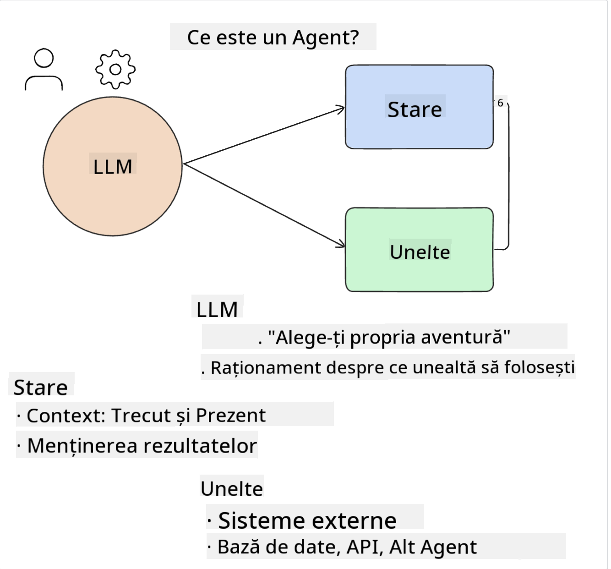
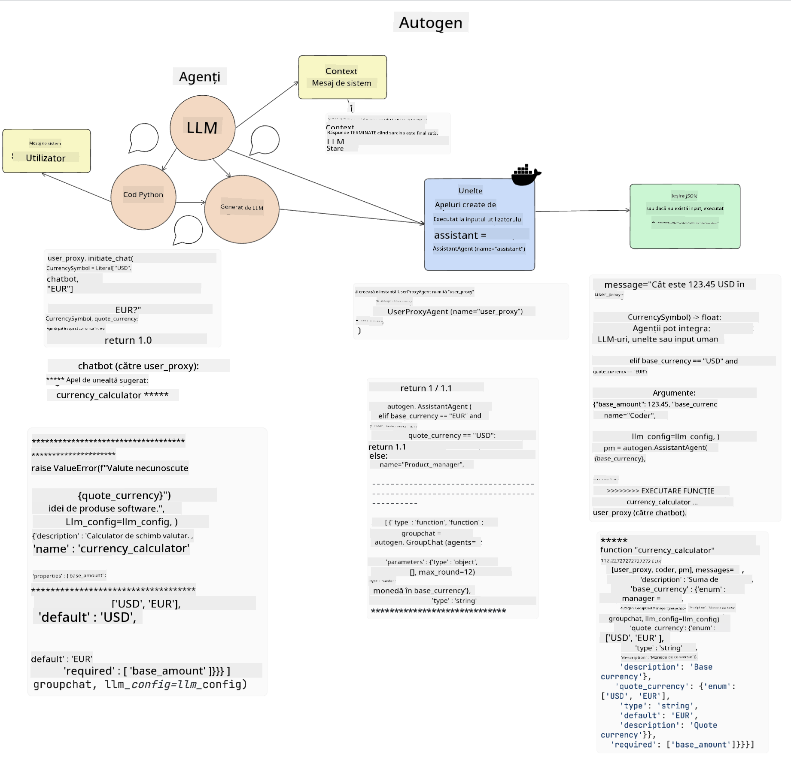
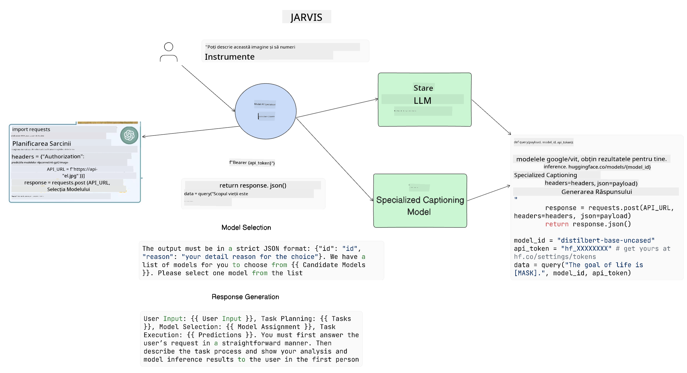

<!--
CO_OP_TRANSLATOR_METADATA:
{
  "original_hash": "11f03c81f190d9cbafd0f977dcbede6c",
  "translation_date": "2025-07-09T17:31:13+00:00",
  "source_file": "17-ai-agents/README.md",
  "language_code": "ro"
}
-->
[](https://aka.ms/gen-ai-lesson17-gh?WT.mc_id=academic-105485-koreyst)

## Introducere

AI Agents reprezintă o evoluție interesantă în Generative AI, permițând modelelor mari de limbaj (LLMs) să treacă de la simple asistenți la agenți capabili să întreprindă acțiuni. Framework-urile pentru AI Agent oferă dezvoltatorilor posibilitatea de a crea aplicații care dau LLM-urilor acces la unelte și gestionarea stării. Aceste framework-uri îmbunătățesc și vizibilitatea, permițând utilizatorilor și dezvoltatorilor să monitorizeze acțiunile planificate de LLM-uri, îmbunătățind astfel gestionarea experienței.

Lecția va acoperi următoarele aspecte:

- Înțelegerea a ceea ce este un AI Agent - Ce este exact un AI Agent?
- Explorarea a patru framework-uri diferite pentru AI Agent - Ce le face unice?
- Aplicarea acestor AI Agents în diferite cazuri de utilizare - Când ar trebui să folosim AI Agents?

## Obiective de învățare

După parcurgerea acestei lecții, vei putea:

- Explica ce sunt AI Agents și cum pot fi folosiți.
- Înțelege diferențele dintre unele dintre cele mai populare framework-uri pentru AI Agent și cum diferă acestea.
- Înțelege modul în care funcționează AI Agents pentru a putea construi aplicații cu ajutorul lor.

## Ce sunt AI Agents?

AI Agents reprezintă un domeniu foarte interesant în lumea Generative AI. Odată cu acest entuziasm apare uneori și o confuzie legată de termeni și aplicarea lor. Pentru a păstra lucrurile simple și incluzive pentru majoritatea uneltelor care se referă la AI Agents, vom folosi această definiție:

AI Agents permit modelelor mari de limbaj (LLMs) să îndeplinească sarcini oferindu-le acces la un **stat** și la **unelte**.



Să definim acești termeni:

**Large Language Models** - Acestea sunt modelele menționate pe parcursul acestui curs, cum ar fi GPT-3.5, GPT-4, Llama-2 etc.

**Stat** - Se referă la contextul în care lucrează LLM-ul. LLM-ul folosește contextul acțiunilor sale anterioare și contextul curent pentru a-și ghida deciziile pentru acțiunile următoare. Framework-urile pentru AI Agent permit dezvoltatorilor să gestioneze mai ușor acest context.

**Unelte** - Pentru a îndeplini sarcina solicitată de utilizator și planificată de LLM, acesta are nevoie de acces la unelte. Exemple de unelte pot fi o bază de date, un API, o aplicație externă sau chiar un alt LLM!

Aceste definiții sperăm să-ți ofere o bază solidă pe măsură ce vom analiza modul în care sunt implementate. Să explorăm câteva framework-uri diferite pentru AI Agent:

## LangChain Agents

[LangChain Agents](https://python.langchain.com/docs/how_to/#agents?WT.mc_id=academic-105485-koreyst) este o implementare a definițiilor oferite mai sus.

Pentru a gestiona **statul**, folosește o funcție încorporată numită `AgentExecutor`. Aceasta primește `agentul` definit și `uneltele` disponibile.

`AgentExecutor` stochează și istoricul conversației pentru a oferi contextul discuției.


LangChain oferă un [catalog de unelte](https://integrations.langchain.com/tools?WT.mc_id=academic-105485-koreyst) care pot fi importate în aplicația ta și la care LLM-ul poate avea acces. Acestea sunt create de comunitate și de echipa LangChain.

Poți apoi să definești aceste unelte și să le transmiți către `AgentExecutor`.

Vizibilitatea este un alt aspect important când vorbim despre AI Agents. Este esențial ca dezvoltatorii de aplicații să înțeleagă ce unealtă folosește LLM-ul și de ce. Pentru asta, echipa LangChain a dezvoltat LangSmith.

## AutoGen

Următorul framework pentru AI Agent pe care îl vom discuta este [AutoGen](https://microsoft.github.io/autogen/?WT.mc_id=academic-105485-koreyst). Principalul focus al AutoGen este conversația. Agenții sunt atât **conversabili**, cât și **personalizabili**.

**Conversabili -** LLM-urile pot iniția și continua o conversație cu un alt LLM pentru a îndeplini o sarcină. Acest lucru se face prin crearea de `AssistantAgents` și atribuirea unui mesaj de sistem specific.

```python

autogen.AssistantAgent( name="Coder", llm_config=llm_config, ) pm = autogen.AssistantAgent( name="Product_manager", system_message="Creative in software product ideas.", llm_config=llm_config, )

```

**Personalizabili** - Agenții pot fi definiți nu doar ca LLM-uri, ci și ca utilizatori sau unelte. Ca dezvoltator, poți defini un `UserProxyAgent` care este responsabil pentru interacțiunea cu utilizatorul pentru feedback în îndeplinirea unei sarcini. Acest feedback poate continua execuția sarcinii sau o poate opri.

```python
user_proxy = UserProxyAgent(name="user_proxy")
```

### Stat și Unelte

Pentru a schimba și gestiona statul, un Agent asistent generează cod Python pentru a îndeplini sarcina.

Iată un exemplu al procesului:



#### LLM definit cu un mesaj de sistem

```python
system_message="For weather related tasks, only use the functions you have been provided with. Reply TERMINATE when the task is done."
```

Acest mesaj de sistem direcționează LLM-ul specific către funcțiile relevante pentru sarcina sa. Ține minte, cu AutoGen poți avea mai mulți AssistantAgents definiți, fiecare cu mesaje de sistem diferite.

#### Conversația este inițiată de utilizator

```python
user_proxy.initiate_chat( chatbot, message="I am planning a trip to NYC next week, can you help me pick out what to wear? ", )

```

Acest mesaj de la user_proxy (om) este cel care va porni procesul prin care Agentul explorează funcțiile posibile pe care ar trebui să le execute.

#### Funcția este executată

```bash
chatbot (to user_proxy):

***** Suggested tool Call: get_weather ***** Arguments: {"location":"New York City, NY","time_periond:"7","temperature_unit":"Celsius"} ******************************************************** --------------------------------------------------------------------------------

>>>>>>>> EXECUTING FUNCTION get_weather... user_proxy (to chatbot): ***** Response from calling function "get_weather" ***** 112.22727272727272 EUR ****************************************************************

```

Odată ce conversația inițială este procesată, Agentul va trimite sugestia de unealtă de apelat. În acest caz, este o funcție numită `get_weather`. În funcție de configurația ta, această funcție poate fi executată automat și citită de Agent sau poate fi executată pe baza inputului utilizatorului.

Poți găsi o listă de [exemple de cod AutoGen](https://microsoft.github.io/autogen/docs/Examples/?WT.mc_id=academic-105485-koreyst) pentru a explora mai departe cum să începi să construiești.

## Taskweaver

Următorul framework pentru agenți pe care îl vom explora este [Taskweaver](https://microsoft.github.io/TaskWeaver/?WT.mc_id=academic-105485-koreyst). Este cunoscut ca un agent „code-first” deoarece, în loc să lucreze strict cu `stringuri`, poate lucra cu DataFrames în Python. Acest lucru devine extrem de util pentru sarcini de analiză și generare de date. Acestea pot fi, de exemplu, crearea de grafice și diagrame sau generarea de numere aleatorii.

### Stat și Unelte

Pentru a gestiona statul conversației, TaskWeaver folosește conceptul de `Planner`. `Planner` este un LLM care preia cererea utilizatorilor și trasează sarcinile care trebuie îndeplinite pentru a satisface această cerere.

Pentru a îndeplini sarcinile, `Planner` are acces la o colecție de unelte numite `Plugins`. Acestea pot fi clase Python sau un interpret general de cod. Aceste pluginuri sunt stocate ca embeddings pentru ca LLM-ul să poată căuta mai eficient pluginul corect.


Iată un exemplu de plugin pentru gestionarea detectării anomaliilor:

```python
class AnomalyDetectionPlugin(Plugin): def __call__(self, df: pd.DataFrame, time_col_name: str, value_col_name: str):
```

Codul este verificat înainte de execuție. O altă caracteristică pentru gestionarea contextului în Taskweaver este `experience`. Experience permite stocarea contextului unei conversații pe termen lung într-un fișier YAML. Acest lucru poate fi configurat astfel încât LLM-ul să se îmbunătățească în timp pe anumite sarcini, având acces la conversațiile anterioare.

## JARVIS

Ultimul framework pentru agenți pe care îl vom explora este [JARVIS](https://github.com/microsoft/JARVIS?tab=readme-ov-file?WT.mc_id=academic-105485-koreyst). Ce face JARVIS unic este faptul că folosește un LLM pentru a gestiona `statul` conversației, iar `uneltele` sunt alte modele AI. Fiecare dintre aceste modele AI sunt modele specializate care îndeplinesc anumite sarcini, cum ar fi detectarea obiectelor, transcrierea sau generarea de descrieri pentru imagini.



LLM-ul, fiind un model cu scop general, primește cererea utilizatorului și identifică sarcina specifică și orice argumente/date necesare pentru a o îndeplini.

```python
[{"task": "object-detection", "id": 0, "dep": [-1], "args": {"image": "e1.jpg" }}]
```

LLM-ul formatează apoi cererea într-un mod pe care modelul AI specializat îl poate interpreta, cum ar fi JSON. Odată ce modelul AI a returnat predicția bazată pe sarcină, LLM-ul primește răspunsul.

Dacă sunt necesare mai multe modele pentru a îndeplini sarcina, LLM-ul va interpreta și răspunsurile de la aceste modele înainte de a le combina pentru a genera răspunsul către utilizator.

Exemplul de mai jos arată cum ar funcționa acest proces când un utilizator solicită o descriere și numărătoarea obiectelor dintr-o imagine:

## Tema

Pentru a continua învățarea despre AI Agents, poți construi cu AutoGen:

- O aplicație care simulează o ședință de afaceri cu diferite departamente ale unei startup educaționale.
- Creează mesaje de sistem care să ghideze LLM-urile în înțelegerea diferitelor personaje și priorități și să permită utilizatorului să prezinte o idee nouă de produs.
- LLM-ul ar trebui apoi să genereze întrebări de urmărire din partea fiecărui departament pentru a rafina și îmbunătăți prezentarea și ideea de produs.

## Învățarea nu se oprește aici, continuă călătoria

După ce ai terminat această lecție, consultă colecția noastră de [Generative AI Learning](https://aka.ms/genai-collection?WT.mc_id=academic-105485-koreyst) pentru a-ți continua dezvoltarea cunoștințelor în Generative AI!

**Declinare de responsabilitate**:  
Acest document a fost tradus folosind serviciul de traducere AI [Co-op Translator](https://github.com/Azure/co-op-translator). Deși ne străduim pentru acuratețe, vă rugăm să rețineți că traducerile automate pot conține erori sau inexactități. Documentul original în limba sa nativă trebuie considerat sursa autorizată. Pentru informații critice, se recomandă traducerea profesională realizată de un specialist uman. Nu ne asumăm răspunderea pentru eventualele neînțelegeri sau interpretări greșite rezultate din utilizarea acestei traduceri.