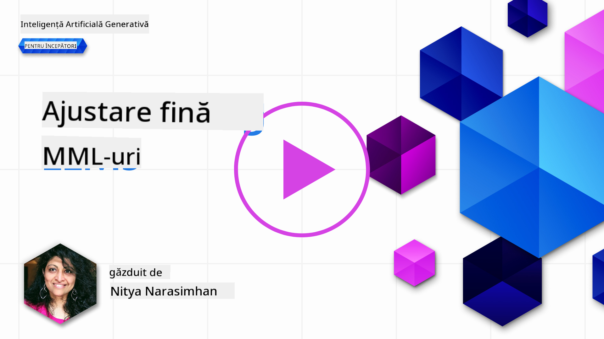
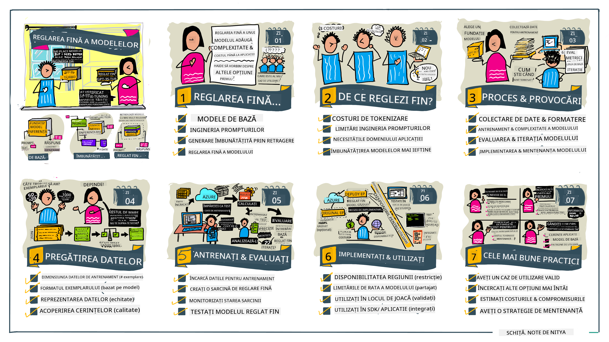

<!--
CO_OP_TRANSLATOR_METADATA:
{
  "original_hash": "68664f7e754a892ae1d8d5e2b7bd2081",
  "translation_date": "2025-07-09T17:49:35+00:00",
  "source_file": "18-fine-tuning/README.md",
  "language_code": "ro"
}
-->

# Ajustarea fină a LLM-ului tău

Folosirea modelelor mari de limbaj pentru a construi aplicații AI generative vine cu noi provocări. O problemă esențială este asigurarea calității răspunsurilor (acuratețe și relevanță) în conținutul generat de model pentru o anumită cerere a utilizatorului. În lecțiile anterioare, am discutat tehnici precum ingineria promptului și generarea augmentată cu recuperare, care încearcă să rezolve problema prin _modificarea inputului promptului_ către modelul existent.

În lecția de astăzi, discutăm o a treia tehnică, **ajustarea fină**, care încearcă să abordeze provocarea prin _re-antrenarea modelului în sine_ cu date suplimentare. Haideți să intrăm în detalii.

## Obiective de învățare

Această lecție introduce conceptul de ajustare fină pentru modelele de limbaj pre-antrenate, explorează beneficiile și provocările acestei abordări și oferă îndrumări despre când și cum să folosești ajustarea fină pentru a îmbunătăți performanța modelelor tale AI generative.

La finalul acestei lecții, ar trebui să poți răspunde la următoarele întrebări:

- Ce este ajustarea fină pentru modelele de limbaj?
- Când și de ce este utilă ajustarea fină?
- Cum pot ajusta fin un model pre-antrenat?
- Care sunt limitările ajustării fine?

Ești gata? Să începem.

## Ghid ilustrat

Vrei să ai o imagine de ansamblu a ceea ce vom acoperi înainte să intrăm în detalii? Consultă acest ghid ilustrat care descrie parcursul de învățare pentru această lecție – de la înțelegerea conceptelor de bază și motivația pentru ajustarea fină, până la procesul și cele mai bune practici pentru executarea sarcinii de ajustare fină. Este un subiect fascinant pentru explorare, așa că nu uita să verifici pagina [Resurse](./RESOURCES.md?WT.mc_id=academic-105485-koreyst) pentru linkuri suplimentare care să susțină călătoria ta de învățare autodirijată!

## Ce este ajustarea fină pentru modelele de limbaj?

Prin definiție, modelele mari de limbaj sunt _pre-antrenate_ pe cantități mari de text provenit din surse diverse, inclusiv internetul. Așa cum am învățat în lecțiile anterioare, avem nevoie de tehnici precum _ingineria promptului_ și _generarea augmentată cu recuperare_ pentru a îmbunătăți calitatea răspunsurilor modelului la întrebările utilizatorului („prompts”).

O tehnică populară de inginerie a promptului implică oferirea modelului mai multă îndrumare despre ce se așteaptă în răspuns, fie prin furnizarea de _instrucțiuni_ (îndrumare explicită), fie prin _oferirea câtorva exemple_ (îndrumare implicită). Aceasta se numește _învățare cu puține exemple_ (few-shot learning), dar are două limitări:

- Limitele de tokeni ale modelului pot restricționa numărul de exemple pe care le poți oferi și pot limita eficiența.
- Costurile tokenilor pot face adăugarea de exemple la fiecare prompt costisitoare și pot limita flexibilitatea.

Ajustarea fină este o practică comună în sistemele de învățare automată, unde luăm un model pre-antrenat și îl re-antrenăm cu date noi pentru a-i îmbunătăți performanța pe o sarcină specifică. În contextul modelelor de limbaj, putem ajusta fin modelul pre-antrenat _cu un set selectat de exemple pentru o anumită sarcină sau domeniu de aplicare_ pentru a crea un **model personalizat** care poate fi mai precis și mai relevant pentru acea sarcină sau domeniu specific. Un beneficiu suplimentar al ajustării fine este că poate reduce și numărul de exemple necesare pentru învățarea cu puține exemple – reducând astfel utilizarea tokenilor și costurile aferente.

## Când și de ce ar trebui să ajustăm fin modelele?

În _acest_ context, când vorbim despre ajustarea fină, ne referim la ajustarea fină **supravegheată**, unde re-antrenarea se face prin **adăugarea de date noi** care nu au făcut parte din setul original de antrenament. Aceasta este diferită de o abordare de ajustare fină nesupravegheată, unde modelul este re-antrenat pe datele originale, dar cu hiperparametri diferiți.

Ce este important de reținut este că ajustarea fină este o tehnică avansată care necesită un anumit nivel de expertiză pentru a obține rezultatele dorite. Dacă este făcută incorect, poate să nu aducă îmbunătățirile așteptate și chiar să degradeze performanța modelului pentru domeniul tău țintă.

Așadar, înainte să înveți „cum” să ajustezi fin modelele de limbaj, trebuie să știi „de ce” ar trebui să alegi această cale și „când” să începi procesul de ajustare fină. Începe prin a-ți pune următoarele întrebări:

- **Caz de utilizare**: Care este _cazul tău de utilizare_ pentru ajustarea fină? Ce aspect al modelului pre-antrenat actual vrei să îmbunătățești?
- **Alternative**: Ai încercat _alte tehnici_ pentru a obține rezultatele dorite? Folosește-le pentru a crea un punct de referință pentru comparație.
  - Ingineria promptului: Încearcă tehnici precum few-shot prompting cu exemple relevante de răspunsuri la prompturi. Evaluează calitatea răspunsurilor.
  - Generare augmentată cu recuperare: Încearcă să completezi prompturile cu rezultate obținute prin căutarea în datele tale. Evaluează calitatea răspunsurilor.
- **Costuri**: Ai identificat costurile pentru ajustarea fină?
  - Posibilitatea de ajustare – este modelul pre-antrenat disponibil pentru ajustare fină?
  - Efort – pentru pregătirea datelor de antrenament, evaluarea și rafinarea modelului.
  - Resurse de calcul – pentru rularea joburilor de ajustare fină și pentru implementarea modelului ajustat.
  - Date – acces la exemple de calitate suficientă pentru impactul ajustării fine.
- **Beneficii**: Ai confirmat beneficiile ajustării fine?
  - Calitate – modelul ajustat fin a depășit punctul de referință?
  - Cost – reduce utilizarea tokenilor prin simplificarea prompturilor?
  - Extensibilitate – poți reutiliza modelul de bază pentru noi domenii?

Răspunzând acestor întrebări, ar trebui să poți decide dacă ajustarea fină este abordarea potrivită pentru cazul tău de utilizare. Ideal, această abordare este valabilă doar dacă beneficiile depășesc costurile. Odată ce decizi să continui, este timpul să te gândești _cum_ poți ajusta fin modelul pre-antrenat.

Vrei să afli mai multe despre procesul decizional? Urmărește [To fine-tune or not to fine-tune](https://www.youtube.com/watch?v=0Jo-z-MFxJs)

## Cum putem ajusta fin un model pre-antrenat?

Pentru a ajusta fin un model pre-antrenat, ai nevoie de:

- un model pre-antrenat pentru ajustare fină
- un set de date pentru ajustare fină
- un mediu de antrenament pentru a rula jobul de ajustare fină
- un mediu de găzduire pentru a implementa modelul ajustat fin

## Ajustarea fină în practică

Resursele următoare oferă tutoriale pas cu pas care te ghidează printr-un exemplu real folosind un model selectat cu un set de date curat. Pentru a parcurge aceste tutoriale, ai nevoie de un cont la furnizorul specific, împreună cu acces la modelul și seturile de date relevante.

| Furnizor    | Tutorial                                                                                                                                                                       | Descriere                                                                                                                                                                                                                                                                                                                                                                                                                        |
| ----------- | ------------------------------------------------------------------------------------------------------------------------------------------------------------------------------ | -------------------------------------------------------------------------------------------------------------------------------------------------------------------------------------------------------------------------------------------------------------------------------------------------------------------------------------------------------------------------------------------------------------------------------- |
| OpenAI      | [Cum să ajustezi fin modelele de chat](https://github.com/openai/openai-cookbook/blob/main/examples/How_to_finetune_chat_models.ipynb?WT.mc_id=academic-105485-koreyst)          | Învață cum să ajustezi fin un `gpt-35-turbo` pentru un domeniu specific („asistent de rețete”) prin pregătirea datelor de antrenament, rularea jobului de ajustare fină și folosirea modelului ajustat pentru inferență.                                                                                                                                                                                                           |
| Azure OpenAI| [Tutorial de ajustare fină GPT 3.5 Turbo](https://learn.microsoft.com/azure/ai-services/openai/tutorials/fine-tune?tabs=python-new%2Ccommand-line?WT.mc_id=academic-105485-koreyst) | Învață cum să ajustezi fin un model `gpt-35-turbo-0613` **pe Azure** prin pași pentru crearea și încărcarea datelor de antrenament, rularea jobului de ajustare fină. Implementarea și utilizarea noului model.                                                                                                                                                                                                                      |
| Hugging Face| [Ajustarea fină a LLM-urilor cu Hugging Face](https://www.philschmid.de/fine-tune-llms-in-2024-with-trl?WT.mc_id=academic-105485-koreyst)                                     | Acest articol te ghidează prin ajustarea fină a unui _LLM deschis_ (ex: `CodeLlama 7B`) folosind biblioteca [transformers](https://huggingface.co/docs/transformers/index?WT.mc_id=academic-105485-koreyst) și [Transformer Reinforcement Learning (TRL)](https://huggingface.co/docs/trl/index?WT.mc_id=academic-105485-koreyst) cu seturi de date deschise pe Hugging Face.                                                                 |
|             |                                                                                                                                                                                |                                                                                                                                                                                                                                                                                                                                                                                                                                  |
| 🤗 AutoTrain| [Ajustarea fină a LLM-urilor cu AutoTrain](https://github.com/huggingface/autotrain-advanced/?WT.mc_id=academic-105485-koreyst)                                               | AutoTrain (sau AutoTrain Advanced) este o bibliotecă Python dezvoltată de Hugging Face care permite ajustarea fină pentru multe sarcini diferite, inclusiv ajustarea fină a LLM-urilor. AutoTrain este o soluție fără cod, iar ajustarea fină poate fi făcută în propriul tău cloud, pe Hugging Face Spaces sau local. Suportă interfață web, CLI și antrenament prin fișiere de configurare yaml.                                         |
|             |                                                                                                                                                                                |                                                                                                                                                                                                                                                                                                                                                                                                                                  |

## Tema

Alege unul dintre tutorialele de mai sus și parcurge-l. _Este posibil să replicăm o versiune a acestor tutoriale în Jupyter Notebooks în acest repo doar pentru referință. Te rugăm să folosești sursele originale direct pentru a obține cele mai recente versiuni_.

## Bravo! Continuă să înveți.

După ce ai terminat această lecție, consultă colecția noastră [Generative AI Learning](https://aka.ms/genai-collection?WT.mc_id=academic-105485-koreyst) pentru a-ți continua dezvoltarea cunoștințelor despre AI generativ!

Felicitări!! Ai finalizat ultima lecție din seria v2 pentru acest curs! Nu te opri din învățat și construit. \*\*Verifică pagina [RESURSE](RESOURCES.md?WT.mc_id=academic-105485-koreyst) pentru o listă de sugestii suplimentare doar pentru acest subiect.

Seria noastră v1 de lecții a fost de asemenea actualizată cu mai multe teme și concepte. Așa că ia-ți un moment să-ți reîmprospătezi cunoștințele – și te rugăm să [împărtășești întrebările și feedback-ul tău](https://github.com/microsoft/generative-ai-for-beginners/issues?WT.mc_id=academic-105485-koreyst) pentru a ne ajuta să îmbunătățim aceste lecții pentru comunitate.

**Declinare de responsabilitate**:  
Acest document a fost tradus folosind serviciul de traducere AI [Co-op Translator](https://github.com/Azure/co-op-translator). Deși ne străduim pentru acuratețe, vă rugăm să rețineți că traducerile automate pot conține erori sau inexactități. Documentul original în limba sa nativă trebuie considerat sursa autorizată. Pentru informații critice, se recomandă traducerea profesională realizată de un specialist uman. Nu ne asumăm răspunderea pentru eventualele neînțelegeri sau interpretări greșite rezultate din utilizarea acestei traduceri.