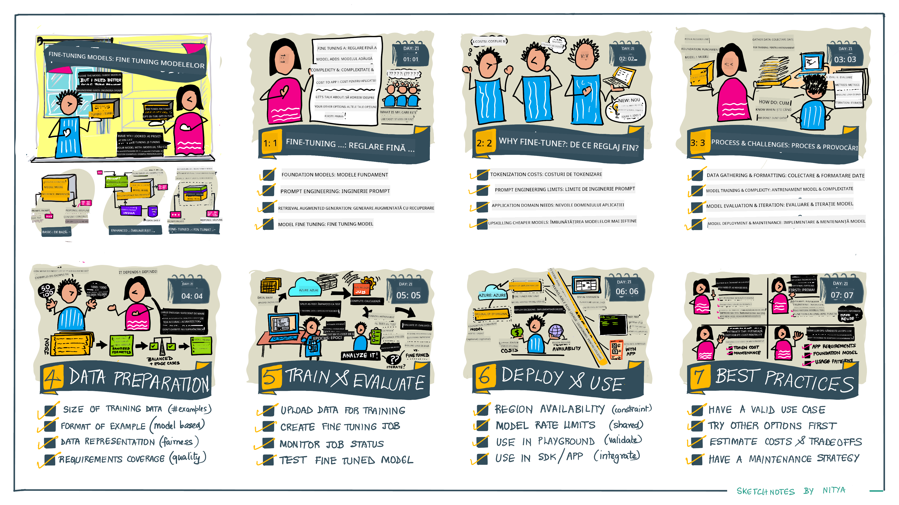

<!--
CO_OP_TRANSLATOR_METADATA:
{
  "original_hash": "68664f7e754a892ae1d8d5e2b7bd2081",
  "translation_date": "2025-05-20T07:58:21+00:00",
  "source_file": "18-fine-tuning/README.md",
  "language_code": "ro"
}
-->

# Ajustarea fină a LLM-ului tău

Utilizarea modelelor mari de limbaj pentru a construi aplicații AI generative vine cu noi provocări. O problemă cheie este asigurarea calității răspunsurilor (acuratețe și relevanță) în conținutul generat de model pentru o cerere dată a utilizatorului. În lecțiile anterioare, am discutat tehnici precum ingineria prompturilor și generarea augmentată prin regăsire, care încearcă să rezolve problema prin _modificarea intrării promptului_ în modelul existent.

În lecția de astăzi, discutăm o a treia tehnică, **ajustarea fină**, care încearcă să abordeze provocarea prin _re-antrenarea modelului în sine_ cu date suplimentare. Să intrăm în detalii.

## Obiectivele Învățării

Această lecție introduce conceptul de ajustare fină pentru modelele de limbaj pre-antrenate, explorează beneficiile și provocările acestei abordări și oferă îndrumări despre când și cum să folosești ajustarea fină pentru a îmbunătăți performanța modelelor tale AI generative.

Până la sfârșitul acestei lecții, ar trebui să poți răspunde la următoarele întrebări:

- Ce este ajustarea fină pentru modelele de limbaj?
- Când și de ce este utilă ajustarea fină?
- Cum pot ajusta fin un model pre-antrenat?
- Care sunt limitările ajustării fine?

Gata? Să începem.

## Ghid Ilustrat

Vrei să obții o imagine de ansamblu asupra a ceea ce vom acoperi înainte de a intra în detalii? Verifică acest ghid ilustrat care descrie parcursul de învățare pentru această lecție - de la învățarea conceptelor de bază și motivația pentru ajustarea fină, până la înțelegerea procesului și a celor mai bune practici pentru realizarea sarcinii de ajustare fină. Este un subiect fascinant de explorat, așa că nu uita să verifici pagina de [Resurse](./RESOURCES.md?WT.mc_id=academic-105485-koreyst) pentru linkuri suplimentare care să sprijine parcursul tău de învățare autodidactă!

## Ce este ajustarea fină pentru modelele de limbaj?

Prin definiție, modelele mari de limbaj sunt _pre-antrenate_ pe cantități mari de text provenind din surse diverse, inclusiv internetul. Așa cum am învățat în lecțiile anterioare, avem nevoie de tehnici precum _ingineria prompturilor_ și _generarea augmentată prin regăsire_ pentru a îmbunătăți calitatea răspunsurilor modelului la întrebările utilizatorului ("prompturi").

O tehnică populară de inginerie a prompturilor implică oferirea modelului de mai multe indicații despre ce se așteaptă în răspuns, fie prin oferirea de _instrucțiuni_ (ghidare explicită) sau _oferindu-i câteva exemple_ (ghidare implicită). Aceasta este cunoscută sub numele de _învățare cu puține exemple_, dar are două limitări:

- Limitele de token ale modelului pot restricționa numărul de exemple pe care le poți oferi și limitează eficacitatea.
- Costurile token ale modelului pot face ca adăugarea de exemple la fiecare prompt să fie costisitoare și să limiteze flexibilitatea.

Ajustarea fină este o practică obișnuită în sistemele de învățare automată, unde luăm un model pre-antrenat și îl re-antrenăm cu date noi pentru a-i îmbunătăți performanța pe o sarcină specifică. În contextul modelelor de limbaj, putem ajusta fin modelul pre-antrenat _cu un set curat de exemple pentru o sarcină sau un domeniu de aplicație dat_ pentru a crea un **model personalizat** care poate fi mai precis și mai relevant pentru acea sarcină sau domeniu specific. Un beneficiu secundar al ajustării fine este că poate reduce și numărul de exemple necesare pentru învățarea cu puține exemple - reducând utilizarea tokenilor și costurile asociate.

## Când și de ce ar trebui să ajustăm fin modelele?

În _acest_ context, când vorbim despre ajustarea fină, ne referim la ajustarea fină **supervizată**, unde re-antrenarea se face prin **adăugarea de date noi** care nu făceau parte din setul de date inițial de antrenament. Acest lucru este diferit de o abordare nesupervizată de ajustare fină, unde modelul este re-antrenat pe datele originale, dar cu hiperparametri diferiți.

Lucrul esențial de reținut este că ajustarea fină este o tehnică avansată care necesită un anumit nivel de expertiză pentru a obține rezultatele dorite. Dacă este făcută incorect, poate să nu ofere îmbunătățirile așteptate și poate chiar să degradeze performanța modelului pentru domeniul tău țintă.

Așadar, înainte de a învăța "cum" să ajustezi fin modelele de limbaj, trebuie să știi "de ce" ar trebui să alegi această cale și "când" să începi procesul de ajustare fină. Începe prin a-ți pune aceste întrebări:

- **Caz de utilizare**: Care este _cazul tău de utilizare_ pentru ajustarea fină? Ce aspect al modelului pre-antrenat actual dorești să îmbunătățești?
- **Alternative**: Ai încercat _alte tehnici_ pentru a obține rezultatele dorite? Folosește-le pentru a crea o bază de comparație.
  - Ingineria prompturilor: Încearcă tehnici precum prompting cu puține exemple cu exemple de răspunsuri relevante la prompturi. Evaluează calitatea răspunsurilor.
  - Generarea Augmentată prin Regăsire: Încearcă să adaugi prompturi cu rezultate de căutare obținute prin căutarea datelor tale. Evaluează calitatea răspunsurilor.
- **Costuri**: Ai identificat costurile pentru ajustarea fină?
  - Capacitate de ajustare - este modelul pre-antrenat disponibil pentru ajustare fină?
  - Efort - pentru pregătirea datelor de antrenament, evaluarea și rafinarea modelului.
  - Resurse de calcul - pentru rularea sarcinilor de ajustare fină și implementarea modelului ajustat fin
  - Date - acces la exemple de calitate suficientă pentru a avea impact asupra ajustării fine
- **Beneficii**: Ai confirmat beneficiile ajustării fine?
  - Calitate - a depășit modelul ajustat fin baza de comparație?
  - Cost - reduce utilizarea tokenilor prin simplificarea prompturilor?
  - Extensibilitate - poți reutiliza modelul de bază pentru domenii noi?

Prin răspunsul la aceste întrebări, ar trebui să poți decide dacă ajustarea fină este abordarea potrivită pentru cazul tău de utilizare. Ideal, abordarea este valabilă doar dacă beneficiile depășesc costurile. Odată ce decizi să continui, este timpul să te gândești la _cum_ poți ajusta fin modelul pre-antrenat.

Vrei să obții mai multe informații despre procesul de luare a deciziilor? Urmărește [Să ajustezi fin sau nu](https://www.youtube.com/watch?v=0Jo-z-MFxJs)

## Cum putem ajusta fin un model pre-antrenat?

Pentru a ajusta fin un model pre-antrenat, ai nevoie de:

- un model pre-antrenat pentru a fi ajustat fin
- un set de date pentru a fi folosit la ajustarea fină
- un mediu de antrenament pentru a rula sarcina de ajustare fină
- un mediu de găzduire pentru a implementa modelul ajustat fin

## Ajustarea Fină în Acțiune

Următoarele resurse oferă tutoriale pas cu pas pentru a te ghida printr-un exemplu real folosind un model selectat cu un set de date curat. Pentru a parcurge aceste tutoriale, ai nevoie de un cont la furnizorul specific, împreună cu acces la modelul și seturile de date relevante.

| Furnizor     | Tutorial                                                                                                                                                                       | Descriere                                                                                                                                                                                                                                                                                                                                                                                                                        |
| ------------ | ------------------------------------------------------------------------------------------------------------------------------------------------------------------------------ | ---------------------------------------------------------------------------------------------------------------------------------------------------------------------------------------------------------------------------------------------------------------------------------------------------------------------------------------------------------------------------------------------------------------------------------- |
| OpenAI       | [Cum să ajustezi fin modelele de chat](https://github.com/openai/openai-cookbook/blob/main/examples/How_to_finetune_chat_models.ipynb?WT.mc_id=academic-105485-koreyst)                | Învață să ajustezi fin un `gpt-35-turbo` pentru un domeniu specific ("asistent de rețete") prin pregătirea datelor de antrenament, rularea sarcinii de ajustare fină și folosirea modelului ajustat fin pentru inferență.                                                                                                                                                                                                                                              |
| Azure OpenAI | [Tutorial de ajustare fină GPT 3.5 Turbo](https://learn.microsoft.com/azure/ai-services/openai/tutorials/fine-tune?tabs=python-new%2Ccommand-line?WT.mc_id=academic-105485-koreyst) | Învață să ajustezi fin un model `gpt-35-turbo-0613` **pe Azure** parcurgând pașii de creare și încărcare a datelor de antrenament, rularea sarcinii de ajustare fină. Implementează și folosește noul model.                                                                                                                                                                                                                                                                 |
| Hugging Face | [Ajustarea fină a LLM-urilor cu Hugging Face](https://www.philschmid.de/fine-tune-llms-in-2024-with-trl?WT.mc_id=academic-105485-koreyst)                                               | Acest articol de blog te ghidează în ajustarea fină a unui _LLM deschis_ (ex: `CodeLlama 7B`) folosind biblioteca [transformers](https://huggingface.co/docs/transformers/index?WT.mc_id=academic-105485-koreyst) și [Învățarea prin Recompensă a Transformatoarelor (TRL)](https://huggingface.co/docs/trl/index?WT.mc_id=academic-105485-koreyst]) cu seturi de date deschise [datasets](https://huggingface.co/docs/datasets/index?WT.mc_id=academic-105485-koreyst) pe Hugging Face. |
|              |                                                                                                                                                                                |                                                                                                                                                                                                                                                                                                                                                                                                                                    |
| 🤗 AutoTrain | [Ajustarea fină a LLM-urilor cu AutoTrain](https://github.com/huggingface/autotrain-advanced/?WT.mc_id=academic-105485-koreyst)                                                         | AutoTrain (sau AutoTrain Advanced) este o bibliotecă Python dezvoltată de Hugging Face care permite ajustarea fină pentru multe sarcini diferite, inclusiv ajustarea fină a LLM-urilor. AutoTrain este o soluție fără cod și ajustarea fină poate fi realizată în propriul tău cloud, pe Hugging Face Spaces sau local. Suportă atât o interfață grafică web, cât și interfața de linie de comandă și antrenamentul prin fișiere de configurare yaml.                                                                               |
|              |                                                                                                                                                                                |                                                                                                                                                                                                                                                                                                                                                                                                                                    |

## Temă

Selectează unul dintre tutorialele de mai sus și parcurge-le. _Putem replica o versiune a acestor tutoriale în Jupyter Notebooks în acest repo doar pentru referință. Te rugăm să folosești sursele originale direct pentru a obține cele mai recente versiuni_.

## Lucru Grozav! Continuă-ți Învățarea.

După ce ai completat această lecție, verifică colecția noastră [Generative AI Learning](https://aka.ms/genai-collection?WT.mc_id=academic-105485-koreyst) pentru a continua să îți îmbunătățești cunoștințele în AI generativă!

Felicitări!! Ai finalizat lecția finală din seria v2 pentru acest curs! Nu te opri din învățat și construit. \*\*Verifică pagina de [RESURSE](RESOURCES.md?WT.mc_id=academic-105485-koreyst) pentru o listă de sugestii suplimentare doar pentru acest subiect.

Seria noastră v1 de lecții a fost de asemenea actualizată cu mai multe teme și concepte. Așadar, ia-ți un minut să-ți reîmprospătezi cunoștințele - și te rugăm [să împărtășești întrebările și feedback-ul tău](https://github.com/microsoft/generative-ai-for-beginners/issues?WT.mc_id=academic-105485-koreyst) pentru a ne ajuta să îmbunătățim aceste lecții pentru comunitate.

**Declinare de responsabilitate**:  
Acest document a fost tradus folosind serviciul de traducere AI [Co-op Translator](https://github.com/Azure/co-op-translator). Deși ne străduim să asigurăm acuratețea, vă rugăm să fiți conștienți de faptul că traducerile automate pot conține erori sau inexactități. Documentul original în limba sa maternă ar trebui să fie considerat sursa autoritară. Pentru informații critice, se recomandă traducerea profesională umană. Nu ne asumăm responsabilitatea pentru eventualele neînțelegeri sau interpretări greșite care pot apărea din utilizarea acestei traduceri.