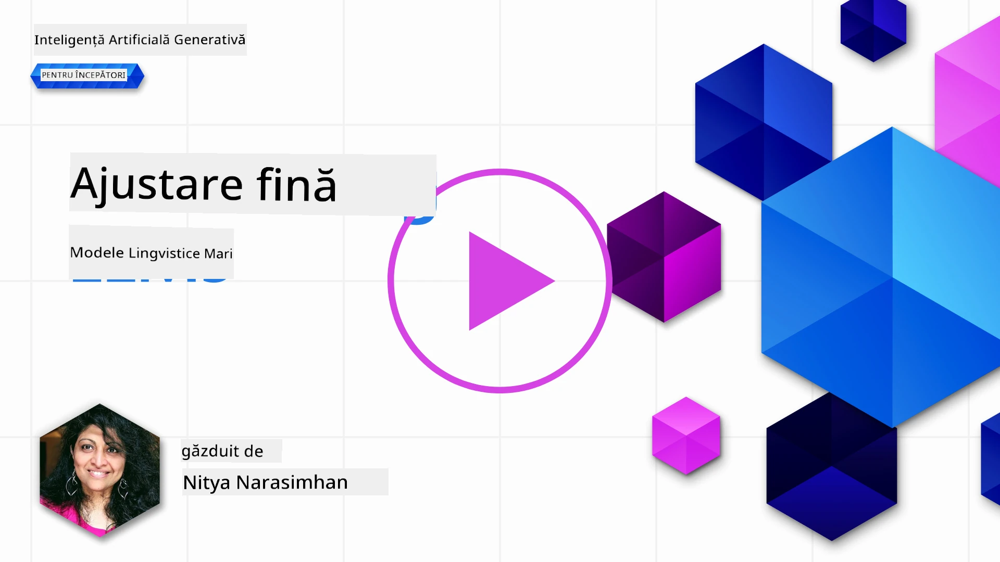
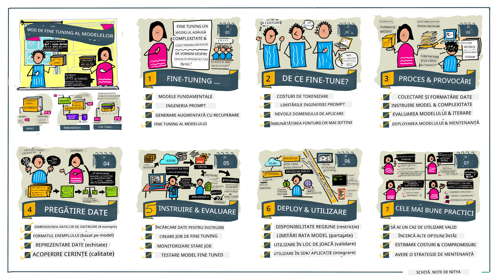

# Ajustarea fină a LLM-ului tău

Utilizarea modelelor mari de limbaj pentru a construi aplicații AI generative vine cu noi provocări. O problemă esențială este asigurarea calității răspunsurilor (acuratețe și relevanță) în conținutul generat de model pentru o anumită cerere a utilizatorului. În lecțiile anterioare, am discutat tehnici precum ingineria promptului și generarea amplificată prin recuperare care încearcă să rezolve problema prin _modificarea inputului promptului_ către modelul existent.

În lecția de astăzi, discutăm o a treia tehnică, **ajustarea fină**, care încearcă să abordeze provocarea prin _reantrenarea modelului însuși_ cu date suplimentare. Haideți să explorăm detaliile.

## Obiective de învățare

Această lecție introduce conceptul de ajustare fină pentru modelele de limbaj pre-antrenate, explorează beneficiile și provocările acestei abordări și oferă ghidaj despre când și cum să folosești ajustarea fină pentru a îmbunătăți performanța modelelor tale AI generative.

La finalul acestei lecții, ar trebui să poți răspunde la următoarele întrebări:

- Ce este ajustarea fină pentru modelele de limbaj?
- Când și de ce este utilă ajustarea fină?
- Cum pot ajusta fin un model pre-antrenat?
- Care sunt limitările ajustării fine?

Ești pregătit? Să începem.

## Ghid ilustrat

Vrei să înțelegi imaginea de ansamblu a ceea ce vom acoperi înainte să intrăm în detalii? Consultă acest ghid ilustrat care descrie traseul de învățare pentru această lecție - de la învățarea conceptelor și motivației pentru ajustarea fină, la înțelegerea procesului și a celor mai bune practici pentru executarea sarcinii de ajustare fină. Este un subiect fascinant pentru explorare, așa că nu uita să verifici pagina de [Resurse](./RESOURCES.md?WT.mc_id=academic-105485-koreyst) pentru linkuri suplimentare care să susțină călătoria ta de învățare autodirijată!

## Ce este ajustarea fină pentru modelele de limbaj?

Prin definiție, modelele mari de limbaj sunt _pre-antrenate_ pe cantități mari de text provenind din diverse surse, inclusiv de pe internet. După cum am învățat în lecțiile anterioare, avem nevoie de tehnici precum _ingineria promptului_ și _generarea amplificată prin recuperare_ pentru a îmbunătăți calitatea răspunsurilor modelului la întrebările ("prompturile") utilizatorului.

O tehnică populară de inginerie a promptului implică oferirea modelului de mai multă ghidare cu privire la ceea ce se așteaptă în răspuns, fie prin furnizarea de _instrucțiuni_ (ghidare explicită), fie _exemplificare cu câteva exemple_ (ghidare implicită). Acesta se numește _învățare cu puține exemple_ (few-shot learning) dar are două limitări:

- Limitele de tokeni ale modelului pot restricționa numărul de exemple pe care le poți oferi și pot limita eficacitatea.
- Costurile pe tokeni ale modelului pot face scumpă adăugarea de exemple la fiecare prompt și pot limita flexibilitatea.

Ajustarea fină este o practică obișnuită în sistemele de învățare automată unde luăm un model pre-antrenat și îl reantrenăm cu date noi pentru a-i îmbunătăți performanța într-o sarcină specifică. În contextul modelelor de limbaj, putem ajusta fin modelul pre-antrenat _cu un set selectat de exemple pentru o anumită sarcină sau domeniu de aplicație_ pentru a crea un **model personalizat** care poate fi mai precis și mai relevant pentru acea sarcină sau domeniu specific. Un beneficiu secundar al ajustării fine este că poate reduce și numărul de exemple necesare în învățarea cu puține exemple - reducând utilizarea tokenilor și costurile aferente.

## Când și de ce ar trebui să ajustăm fin modelele?

În _acest_ context, când vorbim despre ajustarea fină, ne referim la ajustarea fină **supravegheată**, unde reantrenarea se face prin **adăugarea de date noi** care nu au făcut parte din setul original de date de antrenament. Aceasta este diferită de o abordare nesupravegheată de ajustare fină în care modelul este reantrenat pe datele originale, dar cu hiperparametri diferiți.

Ceea ce trebuie să reții este că ajustarea fină este o tehnică avansată care necesită un anumit nivel de expertiză pentru a obține rezultatele dorite. Dacă este făcută incorect, este posibil să nu ofere îmbunătățirile așteptate și poate chiar să degradeze performanța modelului pentru domeniul țintă.

Deci, înainte să înveți "cum" să ajustezi fin modelele de limbaj, trebuie să știi "de ce" să alegi această cale și "când" să începi procesul de ajustare fină. Începe prin a-ți pune aceste întrebări:

- **Caz de utilizare**: Care este _cazul tău de utilizare_ pentru ajustarea fină? Ce aspect al modelului pre-antrenat curent vrei să îmbunătățești?
- **Alternative**: Ai încercat _alte tehnici_ pentru a obține rezultatele dorite? Folosește-le pentru a crea o bază de comparație.
  - Ingineria prompturilor: Încearcă tehnici cum ar fi promptingul cu câteva exemple relevante. Evaluează calitatea răspunsurilor.
  - Generare amplificată prin recuperare: Încearcă să îmbunătățești prompturile cu rezultate obținute prin căutarea în datele tale. Evaluează calitatea răspunsurilor.
- **Costuri**: Ai identificat costurile pentru ajustarea fină?
  - Capacitatea de ajustare - este modelul pre-antrenat disponibil pentru ajustare fină?
  - Efort - pentru pregătirea datelor de antrenament, evaluarea și rafinarea modelului.
  - Resurse de calcul - pentru rularea joburilor de ajustare fină și pentru implementarea modelului ajustat fin.
  - Date - acces la exemple de calitate suficiente pentru impactul ajustării fine.
- **Beneficii**: Ai confirmat beneficiile ajustării fine?
  - Calitate - modelul ajustat fin a depășit baza de referință?
  - Costuri - reduce utilizarea tokenilor prin simplificarea prompturilor?
  - Extensibilitate - poți reutiliza modelul de bază pentru noi domenii?

Răspunzând acestor întrebări, ar trebui să poți decide dacă ajustarea fină este abordarea potrivită pentru cazul tău de utilizare. Ideal, această abordare este valabilă doar dacă beneficiile depășesc costurile. Odată ce decizi să continui, este timpul să te gândești _cum_ poți ajusta fin modelul pre-antrenat.

Vrei să obții mai multe perspective despre procesul decizional? Urmărește [To fine-tune or not to fine-tune](https://www.youtube.com/watch?v=0Jo-z-MFxJs)

## Cum putem ajusta fin un model pre-antrenat?

Pentru a ajusta fin un model pre-antrenat, ai nevoie de:

- un model pre-antrenat pentru ajustare fină
- un set de date pentru ajustare fină
- un mediu de antrenament pentru a rula jobul de ajustare fină
- un mediu de găzduire pentru a implementa modelul ajustat fin

## Ajustarea fină în practică

Resursele următoare oferă tutoriale pas cu pas pentru a te ghida printr-un exemplu real folosind un model selectat cu un set de date selectat. Pentru a lucra cu aceste tutoriale, ai nevoie de un cont la furnizorul specific, împreună cu acces la modelul și seturile de date relevante.

| Furnizor    | Tutorial                                                                                                                                                                       | Descriere                                                                                                                                                                                                                                                                                                                                                                                                                        |
| ----------- | ------------------------------------------------------------------------------------------------------------------------------------------------------------------------------ | -------------------------------------------------------------------------------------------------------------------------------------------------------------------------------------------------------------------------------------------------------------------------------------------------------------------------------------------------------------------------------------------------------------------------------- |
| OpenAI      | [How to fine-tune chat models](https://github.com/openai/openai-cookbook/blob/main/examples/How_to_finetune_chat_models.ipynb?WT.mc_id=academic-105485-koreyst)                | Învață să ajustezi fin un `gpt-35-turbo` pentru un domeniu specific ("asistent rețete") pregătind datele de antrenament, rulând jobul de ajustare fină și folosind modelul ajustat fin pentru inferență.                                                                                                                                                                                                                                    |
| Azure OpenAI| [GPT 3.5 Turbo fine-tuning tutorial](https://learn.microsoft.com/azure/ai-services/openai/tutorials/fine-tune?tabs=python-new%2Ccommand-line&WT.mc_id=academic-105485-koreyst) | Învață să ajustezi fin un model `gpt-35-turbo-0613` **pe Azure** prin pașii de creare și încărcare a datelor de antrenament, rularea jobului de ajustare fină. Implementarea și utilizarea noului model.                                                                                                                                                                                                                              |
| Hugging Face| [Fine-tuning LLMs with Hugging Face](https://www.philschmid.de/fine-tune-llms-in-2024-with-trl?WT.mc_id=academic-105485-koreyst)                                               | Această postare pe blog te ghidează în ajustarea fină a unui _LLM deschis_ (ex: `CodeLlama 7B`) folosind biblioteca [transformers](https://huggingface.co/docs/transformers/index?WT.mc_id=academic-105485-koreyst) și [Transformer Reinforcement Learning (TRL)](https://huggingface.co/docs/trl/index?WT.mc_id=academic-105485-koreyst) cu seturi de date deschise pe Hugging Face. |
|             |                                                                                                                                                                                |                                                                                                                                                                                                                                                                                                                                                                                                                                  |
| 🤗 AutoTrain| [Fine-tuning LLMs with AutoTrain](https://github.com/huggingface/autotrain-advanced/?WT.mc_id=academic-105485-koreyst)                                                         | AutoTrain (sau AutoTrain Advanced) este o bibliotecă Python dezvoltată de Hugging Face care permite ajustarea fină pentru multe sarcini diferite, inclusiv ajustarea fină a LLM-urilor. AutoTrain este o soluție fără cod, iar ajustarea fină poate fi realizată în propriul cloud, pe Hugging Face Spaces sau local. Suportă interfață web, CLI și antrenamente prin fișiere de configurare yaml.                                                                               |
|             |                                                                                                                                                                                |                                                                                                                                                                                                                                                                                                                                                                                                                                  |
| 🦥 Unsloth  | [Fine-tuning LLMs with Unsloth](https://github.com/unslothai/unsloth)                                                         | Unsloth este un cadru open-source care suportă ajustarea fină a LLM-urilor și învățarea cu întărire (RL). Unsloth simplifică antrenamentul local, evaluarea și implementarea cu [notebook-uri](https://github.com/unslothai/notebooks) gata de folosit. Suportă și text-to-speech (TTS), modele BERT și multimodale. Pentru a începe, citește ghidul lor pas cu pas [Fine-tuning LLMs Guide](https://docs.unsloth.ai/get-started/fine-tuning-llms-guide).                                                                             |
|             |                                                                                                                                                                                |                                                                                                                                                                                                                                                                                                                                                                                                                                  |
## Tema

Selectează unul dintre tutorialele de mai sus și parcurge-l. _Este posibil să replicăm o versiune a acestor tutoriale în Jupyter Notebooks în acest repo doar ca referință. Te rugăm să folosești sursele originale pentru a obține cele mai recente versiuni_.

## Felicitări! Continuă-ți învățarea.

După ce ai terminat această lecție, consultă colecția noastră de [Învățare Generativă AI](https://aka.ms/genai-collection?WT.mc_id=academic-105485-koreyst) pentru a-ți continua creșterea cunoștințelor despre Generative AI!

Felicitări!! Ai finalizat lecția finală din seria v2 pentru acest curs! Nu te opri din a învăța și a crea. \*\*Consultă pagina [RESURSE](RESOURCES.md?WT.mc_id=academic-105485-koreyst) pentru o listă cu sugestii suplimentare doar pentru acest subiect.

Seria noastră de lecții v1 a fost, de asemenea, actualizată cu mai multe teme și concepte. Așa că ia-ți un minut să-ți reîmprospătezi cunoștințele și te rugăm [să împărtășești întrebările și feedback-ul tău](https://github.com/microsoft/generative-ai-for-beginners/issues?WT.mc_id=academic-105485-koreyst) pentru a ne ajuta să îmbunătățim aceste lecții pentru comunitate.

---

<!-- CO-OP TRANSLATOR DISCLAIMER START -->
**Declinarea responsabilității**:
Acest document a fost tradus folosind serviciul de traducere AI [Co-op Translator](https://github.com/Azure/co-op-translator). Deși ne străduim pentru acuratețe, vă rugăm să fiți conștienți că traducerile automate pot conține erori sau inexactități. Documentul original în limba sa nativă trebuie considerat sursa autoritară. Pentru informații critice, se recomandă traducerea profesională umană. Nu ne asumăm răspunderea pentru eventualele neînțelegeri sau interpretări eronate rezultând din utilizarea acestei traduceri.
<!-- CO-OP TRANSLATOR DISCLAIMER END -->