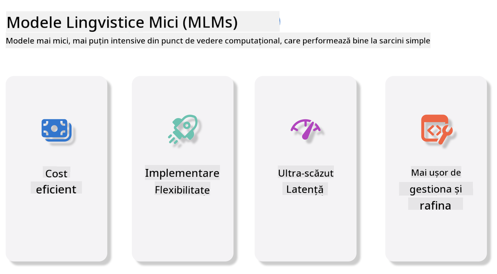
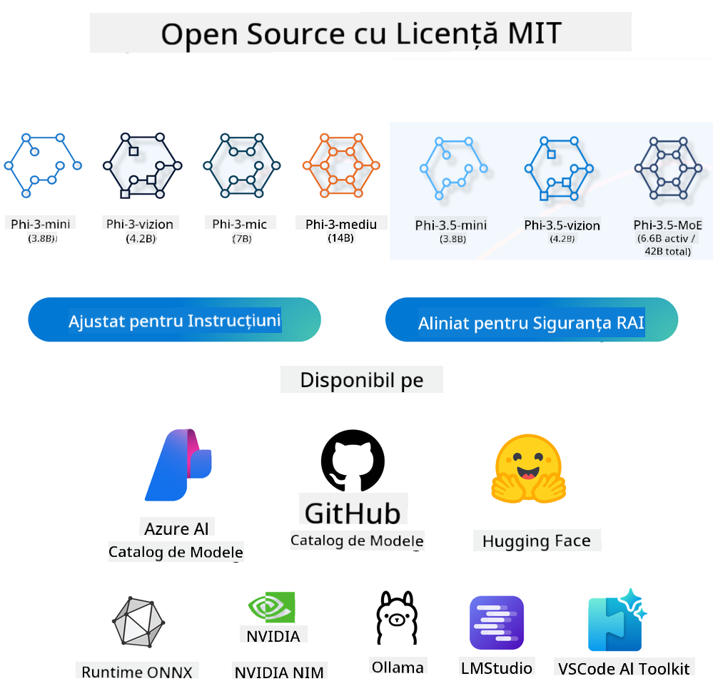
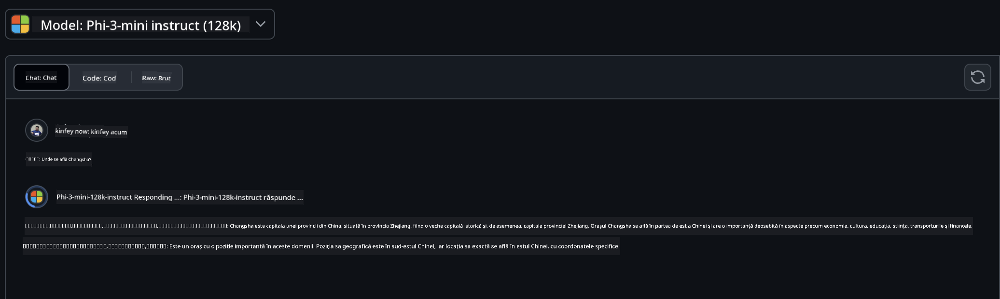
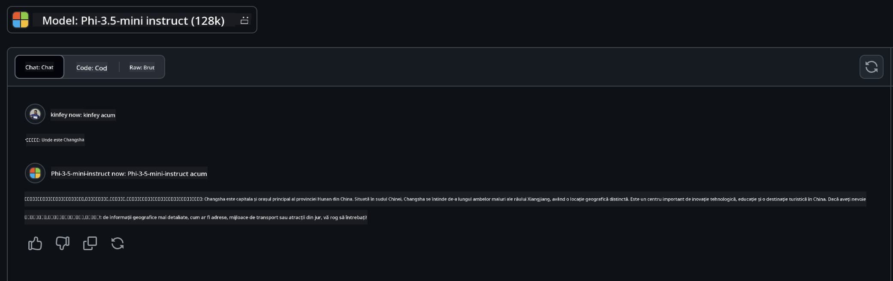

<!--
CO_OP_TRANSLATOR_METADATA:
{
  "original_hash": "124ad36cfe96f74038811b6e2bb93e9d",
  "translation_date": "2025-05-20T10:33:36+00:00",
  "source_file": "19-slm/README.md",
  "language_code": "ro"
}
-->
# Introducere în Modele de Limbaj Mici pentru AI Generativ pentru Începători AI generativ este un domeniu fascinant al inteligenței artificiale care se concentrează pe crearea de sisteme capabile să genereze conținut nou. Acest conținut poate varia de la text și imagini la muzică și chiar medii virtuale întregi. Una dintre cele mai interesante aplicații ale AI generativ este în domeniul modelelor de limbaj. ## Ce sunt Modelele de Limbaj Mici? Un Model de Limbaj Mic (SLM) reprezintă o variantă redusă a unui model de limbaj mare (LLM), valorificând multe dintre principiile și tehnicile arhitecturale ale LLM-urilor, în timp ce prezintă o amprentă computațională semnificativ redusă. SLM-urile sunt un subset de modele de limbaj concepute pentru a genera text asemănător cu cel uman. Spre deosebire de omologii lor mai mari, cum ar fi GPT-4, SLM-urile sunt mai compacte și mai eficiente, făcându-le ideale pentru aplicații în care resursele computaționale sunt limitate. În ciuda dimensiunii lor mai mici, ele pot îndeplini încă o varietate de sarcini. De obicei, SLM-urile sunt construite prin comprimarea sau distilarea LLM-urilor, având ca scop păstrarea unei porțiuni substanțiale din funcționalitatea și capabilitățile lingvistice ale modelului original. Această reducere a dimensiunii modelului scade complexitatea generală, făcând SLM-urile mai eficiente atât în ceea ce privește utilizarea memoriei, cât și cerințele computaționale. În ciuda acestor optimizări, SLM-urile pot îndeplini în continuare o gamă largă de sarcini de procesare a limbajului natural (NLP): - Generarea de Text: Crearea de propoziții sau paragrafe coerente și relevante contextual. - Completarea Textului: Prezicerea și completarea propozițiilor pe baza unui prompt dat. - Traducere: Conversia textului dintr-o limbă în alta. - Rezumare: Condensarea textelor lungi în rezumate mai scurte și mai ușor de digerat. Deși cu unele compromisuri în performanță sau profunzimea înțelegerii comparativ cu omologii lor mai mari. ## Cum Funcționează Modelele de Limbaj Mici? SLM-urile sunt antrenate pe cantități mari de date text. În timpul antrenării, ele învață tiparele și structurile limbajului, permițându-le să genereze text care este atât corect gramatical, cât și adecvat contextual. Procesul de antrenare implică: - Colectarea Datelor: Adunarea unor seturi mari de date text din diverse surse. - Preprocesare: Curățarea și organizarea datelor pentru a le face potrivite pentru antrenare. - Antrenare: Utilizarea algoritmilor de învățare automată pentru a învăța modelul cum să înțeleagă și să genereze text. - Ajustare: Ajustarea modelului pentru a-i îmbunătăți performanța pe sarcini specifice. Dezvoltarea SLM-urilor se aliniază cu nevoia crescândă de modele care pot fi implementate în medii cu resurse limitate, cum ar fi dispozitivele mobile sau platformele de calcul la margine, unde LLM-urile complete pot fi impracticabile din cauza cerințelor lor mari de resurse. Prin concentrarea pe eficiență, SLM-urile echilibrează performanța cu accesibilitatea, permițând aplicarea mai largă în diverse domenii.  ## Obiective de Învățare În această lecție, sperăm să introducem cunoștințele despre SLM și să le combinăm cu Microsoft Phi-3 pentru a învăța diferite scenarii în conținut text, viziune și MoE. Până la sfârșitul acestei lecții, ar trebui să puteți răspunde la următoarele întrebări: - Ce este SLM - Care este diferența dintre SLM și LLM - Ce este Familia Microsoft Phi-3/3.5 - Cum să inferențați Familia Microsoft Phi-3/3.5 Gata? Să începem. ## Distincțiile între Modelele de Limbaj Mari (LLM) și Modelele de Limbaj Mici (SLM) Atât LLM-urile, cât și SLM-urile sunt construite pe principii fundamentale ale învățării automate probabilistice, urmând abordări similare în designul lor arhitectural, metodologiile de antrenare, procesele de generare a datelor și tehnicile de evaluare a modelului. Cu toate acestea, mai mulți factori cheie diferențiază aceste două tipuri de modele. ## Aplicații ale Modelelor de Limbaj Mici SLM-urile au o gamă largă de aplicații, inclusiv: - Chatbots: Oferirea de suport pentru clienți și interacțiunea cu utilizatorii într-o manieră conversațională. - Crearea de Conținut: Asistarea scriitorilor prin generarea de idei sau chiar redactarea întregilor articole. - Educație: Ajutarea studenților cu temele de scriere sau învățarea de noi limbi. - Accesibilitate: Crearea de instrumente pentru persoanele cu dizabilități, cum ar fi sistemele text-to-speech. **Dimensiune** O distincție primară între LLM-uri și SLM-uri constă în scala modelelor. LLM-urile, cum ar fi ChatGPT (GPT-4), pot cuprinde aproximativ 1,76 trilioane de parametri, în timp ce SLM-urile open-source, cum ar fi Mistral 7B, sunt proiectate cu semnificativ mai puțini parametri—aproximativ 7 miliarde. Această disparitate se datorează în principal diferențelor în arhitectura modelului și procesele de antrenare. De exemplu, ChatGPT utilizează un mecanism de auto-atenție într-un cadru encoder-decoder, în timp ce Mistral 7B folosește atenția cu fereastră glisantă, care permite un antrenament mai eficient într-un model doar de decodor. Această variație arhitecturală are implicații profunde pentru complexitatea și performanța acestor modele. **Înțelegere** SLM-urile sunt de obicei optimizate pentru performanță în domenii specifice, făcându-le foarte specializate, dar potențial limitate în capacitatea lor de a oferi o înțelegere contextuală largă în mai multe domenii de cunoaștere. În contrast, LLM-urile își propun să simuleze inteligența asemănătoare cu cea umană la un nivel mai cuprinzător. Antrenate pe seturi de date vaste și diverse, LLM-urile sunt concepute să performeze bine într-o varietate de domenii, oferind o mai mare versatilitate și adaptabilitate. În consecință, LLM-urile sunt mai potrivite pentru o gamă mai largă de sarcini de aval, cum ar fi procesarea limbajului natural și programarea. **Calcul** Antrenarea și implementarea LLM-urilor sunt procese intensive în resurse, necesitând adesea infrastructură computațională semnificativă, inclusiv clustere GPU la scară largă. De exemplu, antrenarea unui model precum ChatGPT de la zero poate necesita mii de GPU-uri pe perioade extinse. În contrast, SLM-urile, cu numărul lor mai mic de parametri, sunt mai accesibile în ceea ce privește resursele computaționale. Modele precum Mistral 7B pot fi antrenate și rulate pe mașini locale echipate cu capabilități GPU moderate, deși antrenarea necesită în continuare câteva ore pe mai multe GPU-uri. **Părtinire** Părtinirea este o problemă cunoscută în LLM-uri, în principal din cauza naturii datelor de antrenare. Aceste modele se bazează adesea pe date brute, disponibile deschis de pe internet, care pot subreprezenta sau reprezenta greșit anumite grupuri, introduce etichetări eronate sau reflecta părtiniri lingvistice influențate de dialect, variații geografice și reguli gramaticale. În plus, complexitatea arhitecturilor LLM poate exacerba inadvertent părtinirea, care poate trece neobservată fără ajustări atente. Pe de altă parte, SLM-urile, fiind antrenate pe seturi de date mai constrânse, specifice domeniului, sunt inerent mai puțin susceptibile la astfel de părtiniri, deși nu sunt imune la ele. **Inferență** Dimensiunea redusă a SLM-urilor le conferă un avantaj semnificativ în ceea ce privește viteza de inferență, permițându-le să genereze rezultate eficient pe hardware local fără a fi nevoie de procesare paralelă extinsă. În contrast, LLM-urile, datorită dimensiunii și complexității lor, necesită adesea resurse computaționale paralele substanțiale pentru a obține timpi de inferență acceptabili. Prezența mai multor utilizatori simultani încetinește și mai mult timpii de răspuns ai LLM-urilor, mai ales când sunt implementate la scară. În concluzie, deși atât LLM-urile, cât și SLM-urile împărtășesc o bază fundamentală în învățarea automată, ele diferă semnificativ în ceea ce privește dimensiunea modelului, cerințele de resurse, înțelegerea contextuală, susceptibilitatea la părtinire și viteza de inferență. Aceste distincții reflectă adecvarea lor respectivă pentru diferite cazuri de utilizare, LLM-urile fiind mai versatile, dar consumatoare de resurse, iar SLM-urile oferind eficiență mai specifică domeniului cu cerințe computaționale reduse. ***Notă：În acest capitol, vom introduce SLM folosind Microsoft Phi-3 / 3.5 ca exemplu.*** ## Introducerea Familiei Phi-3 / Phi-3.5 Familia Phi-3 / 3.5 vizează în principal scenarii de aplicații text, viziune și Agent (MoE): ### Phi-3 / 3.5 Instruct Principal pentru generarea de text, completarea chatului și extragerea informațiilor de conținut, etc. **Phi-3-mini** Modelul de limbaj de 3.8B este disponibil pe Microsoft Azure AI Studio, Hugging Face și Ollama. Modelele Phi-3 depășesc semnificativ modelele de limbaj de dimensiuni egale și mai mari pe repere cheie (vezi numerele de repere de mai jos, numerele mai mari sunt mai bune). Phi-3-mini depășește modelele de două ori mai mari, în timp ce Phi-3-small și Phi-3-medium depășesc modele mai mari, inclusiv GPT-3.5 **Phi-3-small & medium** Cu doar 7B de parametri, Phi-3-small bate GPT-3.5T pe o varietate de repere de limbaj, raționament, codificare și matematică. Phi-3-medium cu 14B de parametri continuă această tendință și depășește Gemini 1.0 Pro. **Phi-3.5-mini** Ne putem gândi la el ca la un upgrade al Phi-3-mini. Deși parametrii rămân neschimbați, îmbunătățește capacitatea de a susține mai multe limbi (Suport 20+ limbi: Arabă, Chineză, Cehă, Daneză, Olandeză, Engleză, Finlandeză, Franceză, Germană, Ebraică, Maghiară, Italiană, Japoneză, Coreeană, Norvegiană, Poloneză, Portugheză, Rusă, Spaniolă, Suedeză, Thailandeză, Turcă, Ucraineană) și adaugă suport mai puternic pentru context lung. Phi-3.5-mini cu 3.8B de parametri depășește modelele de limbaj de aceeași dimensiune și este la fel de performant ca modelele de două ori mai mari. ### Phi-3 / 3.5 Vision Ne putem gândi la modelul Instruct al Phi-3/3.5 ca la capacitatea lui Phi de a înțelege, iar Vision este ceea ce îi oferă lui Phi ochi pentru a înțelege lumea. **Phi-3-Vision** Phi-3-vision, cu doar 4.2B de parametri, continuă această tendință și depășește modele mai mari, cum ar fi Claude-3 Haiku și Gemini 1.0 Pro V pe sarcini generale de raționament vizual, OCR și sarcini de înțelegere a tabelelor și diagramelor. **Phi-3.5-Vision** Phi-3.5-Vision este, de asemenea, un upgrade al Phi-3-Vision, adăugând suport pentru mai multe imagini. Vă puteți gândi la el ca la o îmbunătățire a viziunii, nu numai că poate vedea imagini, ci și videoclipuri. Phi-3.5-vision depășește modele mai mari, cum ar fi Claude-3.5 Sonnet și Gemini 1.5 Flash pe sarcini de înțelegere OCR, tabele și diagrame și este la fel de performant pe sarcini generale de raționament al cunoștințelor vizuale. Suport pentru input multi-frame, adică, efectuează raționament pe mai multe imagini de input. ### Phi-3.5-MoE ***Mixture of Experts(MoE)*** permite modelelor să fie preantrenate cu mult mai puțin calcul, ceea ce înseamnă că puteți scala dramatic dimensiunea modelului sau a setului de date cu același buget de calcul ca un model dens. În special, un model MoE ar trebui să atingă aceeași calitate ca omologul său dens mult mai rapid în timpul preantrenării. Phi-3.5-MoE cuprinde 16x3.8B module de experți. Phi-3.5-MoE cu doar 6.6B de parametri activi atinge un nivel similar de raționament, înțelegere a limbajului și matematică ca modele mult mai mari. Putem utiliza modelul Familia Phi-3/3.5 pe baza diferitelor scenarii. Spre deosebire de LLM, puteți implementa Phi-3/3.5-mini sau Phi-3/3.5-Vision pe dispozitive de margine. ## Cum să utilizați modelele Familia Phi-3/3.5 Sperăm să utilizăm Phi-3/3.5 în diferite scenarii. În continuare, vom folosi Phi-3/3.5 pe baza diferitelor scenarii.  ### Diferența de inferență API-ul Cloud **Modele GitHub** GitHub
Modelele sunt cea mai directă modalitate. Puteți accesa rapid modelul Phi-3/3.5-Instruct prin GitHub Models. Combinat cu Azure AI Inference SDK / OpenAI SDK, puteți accesa API-ul prin cod pentru a finaliza apelul Phi-3/3.5-Instruct. De asemenea, puteți testa diferite efecte prin Playground. - Demo:Compararea efectelor Phi-3-mini și Phi-3.5-mini în scenarii chinezești   **Azure AI Studio** Sau dacă dorim să utilizăm modelele de viziune și MoE, puteți folosi Azure AI Studio pentru a finaliza apelul. Dacă sunteți interesat, puteți citi Phi-3 Cookbook pentru a învăța cum să apelați Phi-3/3.5 Instruct, Vision, MoE prin Azure AI Studio [Faceți clic pe acest link](https://github.com/microsoft/Phi-3CookBook/blob/main/md/02.QuickStart/AzureAIStudio_QuickStart.md?WT.mc_id=academic-105485-koreyst) **NVIDIA NIM** Pe lângă soluțiile bazate pe cloud Model Catalog oferite de Azure și GitHub, puteți utiliza și [Nivida NIM](https://developer.nvidia.com/nim?WT.mc_id=academic-105485-koreyst) pentru a finaliza apelurile relevante. Puteți vizita NIVIDA NIM pentru a finaliza apelurile API ale familiei Phi-3/3.5. NVIDIA NIM (NVIDIA Inference Microservices) este un set de microservicii de inferență accelerată conceput pentru a ajuta dezvoltatorii să implementeze modele AI eficient în diverse medii, inclusiv cloud-uri, centre de date și stații de lucru. Iată câteva caracteristici cheie ale NVIDIA NIM: - **Ușurința implementării:** NIM permite implementarea modelelor AI cu o singură comandă, făcându-l ușor de integrat în fluxurile de lucru existente. - **Performanță optimizată:** Folosește motoarele de inferență pre-optimizate ale NVIDIA, cum ar fi TensorRT și TensorRT-LLM, pentru a asigura latență redusă și debit ridicat. - **Scalabilitate:** NIM suportă autoscalarea pe Kubernetes, permițându-i să gestioneze eficient sarcini de lucru variabile. - **Securitate și control:** Organizațiile pot menține controlul asupra datelor și aplicațiilor lor prin găzduirea proprie a microserviciilor NIM pe infrastructura lor gestionată. - **API-uri standard:** NIM oferă API-uri standard din industrie, făcându-l ușor de construit și integrat aplicații AI precum chatbots, asistenți AI și altele. NIM face parte din NVIDIA AI Enterprise, care își propune să simplifice implementarea și operaționalizarea modelelor AI, asigurându-se că acestea rulează eficient pe GPU-urile NVIDIA. - Demo: Utilizarea Nividia NIM pentru a apela Phi-3.5-Vision-API [[Faceți clic pe acest link](../../../19-slm/python/Phi-3-Vision-Nividia-NIM.ipynb)] ### Inferența Phi-3/3.5 în mediul local Inferența în relație cu Phi-3, sau orice model de limbaj precum GPT-3, se referă la procesul de generare a răspunsurilor sau predicțiilor bazate pe intrarea pe care o primește. Când oferiți un prompt sau o întrebare către Phi-3, acesta folosește rețeaua sa neuronală antrenată pentru a deduce cel mai probabil și relevant răspuns prin analizarea tiparelor și relațiilor din datele pe care a fost antrenat. **Hugging Face Transformer** Hugging Face Transformers este o bibliotecă puternică concepută pentru procesarea limbajului natural (NLP) și alte sarcini de învățare automată. Iată câteva puncte cheie despre aceasta: 1. **Modele pre-antrenate**: Oferă mii de modele pre-antrenate care pot fi utilizate pentru diverse sarcini, cum ar fi clasificarea textului, recunoașterea entităților numite, răspuns la întrebări, sumarizare, traducere și generare de text. 2. **Interoperabilitate între cadre**: Biblioteca suportă multiple cadre de învățare profundă, inclusiv PyTorch, TensorFlow și JAX. Acest lucru vă permite să antrenați un model într-un cadru și să-l utilizați în altul. 3. **Capabilități multimodale**: Pe lângă NLP, Hugging Face Transformers suportă și sarcini în viziunea computerizată (de exemplu, clasificarea imaginilor, detectarea obiectelor) și procesarea audio (de exemplu, recunoașterea vorbirii, clasificarea audio). 4. **Ușurința utilizării**: Biblioteca oferă API-uri și instrumente pentru a descărca și ajusta cu ușurință modelele, făcându-l accesibil atât pentru începători, cât și pentru experți. 5. **Comunitate și resurse**: Hugging Face are o comunitate vibrantă și documentație extinsă, tutoriale și ghiduri pentru a ajuta utilizatorii să înceapă și să profite la maximum de bibliotecă. [documentația oficială](https://huggingface.co/docs/transformers/index?WT.mc_id=academic-105485-koreyst) sau [repositorul GitHub](https://github.com/huggingface/transformers?WT.mc_id=academic-105485-koreyst). Aceasta este metoda cea mai utilizată, dar necesită și accelerare GPU. Până la urmă, scenele precum Vision și MoE necesită multe calcule, care vor fi foarte limitate pe CPU dacă nu sunt cuantificate. - Demo:Utilizarea Transformer pentru a apela Phi-3.5-Instuct [Faceți clic pe acest link](../../../19-slm/python/phi35-instruct-demo.ipynb) - Demo:Utilizarea Transformer pentru a apela Phi-3.5-Vision[Faceți clic pe acest link](../../../19-slm/python/phi35-vision-demo.ipynb) - Demo:Utilizarea Transformer pentru a apela Phi-3.5-MoE[Faceți clic pe acest link](../../../19-slm/python/phi35_moe_demo.ipynb) **Ollama** [Ollama](https://ollama.com/?WT.mc_id=academic-105485-koreyst) este o platformă concepută pentru a facilita rularea modelelor de limbaj mari (LLMs) local pe mașina dumneavoastră. Suportă diverse modele precum Llama 3.1, Phi 3, Mistral și Gemma 2, printre altele. Platforma simplifică procesul prin împachetarea greutăților modelului, configurației și datelor într-un singur pachet, făcându-l mai accesibil pentru utilizatori să personalizeze și să creeze propriile modele. Ollama este disponibil pentru macOS, Linux și Windows. Este un instrument excelent dacă doriți să experimentați sau să implementați LLM-uri fără a depinde de serviciile cloud. Ollama este cea mai directă modalitate, trebuie doar să executați următoarea declarație. ```bash

ollama run phi3.5

``` **ONNX Runtime pentru GenAI** [ONNX Runtime](https://github.com/microsoft/onnxruntime-genai?WT.mc_id=academic-105485-koreyst) este un accelerator de învățare automată de inferență și antrenament cross-platform. ONNX Runtime pentru Generative AI (GENAI) este un instrument puternic care vă ajută să rulați modele AI generative eficient pe diverse platforme. ## Ce este ONNX Runtime? ONNX Runtime este un proiect open-source care permite inferența de înaltă performanță a modelelor de învățare automată. Suportă modele în formatul Open Neural Network Exchange (ONNX), care este un standard pentru reprezentarea modelelor de învățare automată. Inferența ONNX Runtime poate permite experiențe mai rapide pentru clienți și costuri mai mici, suportând modele din cadre de învățare profundă precum PyTorch și TensorFlow/Keras, precum și biblioteci de învățare automată clasice precum scikit-learn, LightGBM, XGBoost, etc. ONNX Runtime este compatibil cu diferite hardware, drivere și sisteme de operare și oferă performanță optimă prin utilizarea acceleratoarelor hardware acolo unde este aplicabil, alături de optimizări și transformări de grafice ## Ce este Generative AI? Generative AI se referă la sisteme AI care pot genera conținut nou, cum ar fi text, imagini sau muzică, bazat pe datele pe care au fost antrenate. Exemple includ modele de limbaj precum GPT-3 și modele de generare a imaginilor precum Stable Diffusion. Biblioteca ONNX Runtime pentru GenAI oferă bucla AI generativă pentru modele ONNX, inclusiv inferența cu ONNX Runtime, procesarea logitilor, căutarea și eșantionarea, și gestionarea cache-ului KV. ## ONNX Runtime pentru GENAI ONNX Runtime pentru GENAI extinde capacitățile ONNX Runtime pentru a suporta modele AI generative. Iată câteva caracteristici cheie: - **Suport larg pentru platforme:** Funcționează pe diverse platforme, inclusiv Windows, Linux, macOS, Android și iOS. - **Suport pentru modele:** Suportă multe modele AI generative populare, cum ar fi LLaMA, GPT-Neo, BLOOM și altele. - **Optimizarea performanței:** Include optimizări pentru diferite acceleratoare hardware precum GPU-urile NVIDIA, GPU-urile AMD și altele. - **Ușurința utilizării:** Oferă API-uri pentru integrarea ușoară în aplicații, permițându-vă să generați text, imagini și alt conținut cu cod minim - Utilizatorii pot apela o metodă generate() la nivel înalt sau pot rula fiecare iterație a modelului într-o buclă, generând un token la un moment dat și actualizând opțional parametrii de generare în interiorul buclei. - ONNX runtime are, de asemenea, suport pentru căutarea greedy/beam și eșantionarea TopP, TopK pentru a genera secvențe de tokenuri și procesarea logitilor încorporată precum penalitățile de repetare. Puteți adăuga cu ușurință scoruri personalizate. ## Începeți Pentru a începe cu ONNX Runtime pentru GENAI, puteți urma acești pași: ### Instalați ONNX Runtime: ```Python
pip install onnxruntime
``` ### Instalați extensiile AI generative: ```Python
pip install onnxruntime-genai
``` ### Rulați un model: Iată un exemplu simplu în Python: ```Python
import onnxruntime_genai as og

model = og.Model('path_to_your_model.onnx')

tokenizer = og.Tokenizer(model)

input_text = "Hello, how are you?"

input_tokens = tokenizer.encode(input_text)

output_tokens = model.generate(input_tokens)

output_text = tokenizer.decode(output_tokens)

print(output_text) 
``` ### Demo:Utilizarea ONNX Runtime GenAI pentru a apela Phi-3.5-Vision ```python

import onnxruntime_genai as og

model_path = './Your Phi-3.5-vision-instruct ONNX Path'

img_path = './Your Image Path'

model = og.Model(model_path)

processor = model.create_multimodal_processor()

tokenizer_stream = processor.create_stream()

text = "Your Prompt"

prompt = "<|user|>\n"

prompt += "<|image_1|>\n"

prompt += f"{text}<|end|>\n"

prompt += "<|assistant|>\n"

image = og.Images.open(img_path)

inputs = processor(prompt, images=image)

params = og.GeneratorParams(model)

params.set_inputs(inputs)

params.set_search_options(max_length=3072)

generator = og.Generator(model, params)

while not generator.is_done():

    generator.compute_logits()
    
    generator.generate_next_token()

    new_token = generator.get_next_tokens()[0]
    
    code += tokenizer_stream.decode(new_token)
    
    print(tokenizer_stream.decode(new_token), end='', flush=True)

``` **Altele** Pe lângă metodele de referință ONNX Runtime și Ollama, putem completa referința modelelor cuantificate bazate pe metodele de referință ale modelului oferite de diferiți producători. Cum ar fi cadrul Apple MLX cu Apple Metal, Qualcomm QNN cu NPU, Intel OpenVINO cu CPU/GPU, etc. Puteți obține mai mult conținut din [Phi-3 Cookbook](https://github.com/microsoft/phi-3cookbook?WT.mc_id=academic-105485-koreyst) ## Mai mult Am învățat elementele de bază ale familiei Phi-3/3.5, dar pentru a învăța mai multe despre SLM avem nevoie de mai multe cunoștințe. Puteți găsi răspunsurile în Phi-3 Cookbook. Dacă doriți să aflați mai multe, vă rugăm să vizitați [Phi-3 Cookbook](https://github.com/microsoft/phi-3cookbook?WT.mc_id=academic-105485-koreyst).

**Declinarea responsabilității**:  
Acest document a fost tradus folosind serviciul de traducere AI [Co-op Translator](https://github.com/Azure/co-op-translator). Deși ne străduim să asigurăm acuratețea, vă rugăm să fiți conștienți că traducerile automate pot conține erori sau inexactități. Documentul original în limba sa natală ar trebui considerat sursa autoritară. Pentru informații critice, se recomandă traducerea profesională umană. Nu ne asumăm responsabilitatea pentru eventualele neînțelegeri sau interpretări greșite care pot apărea din utilizarea acestei traduceri.