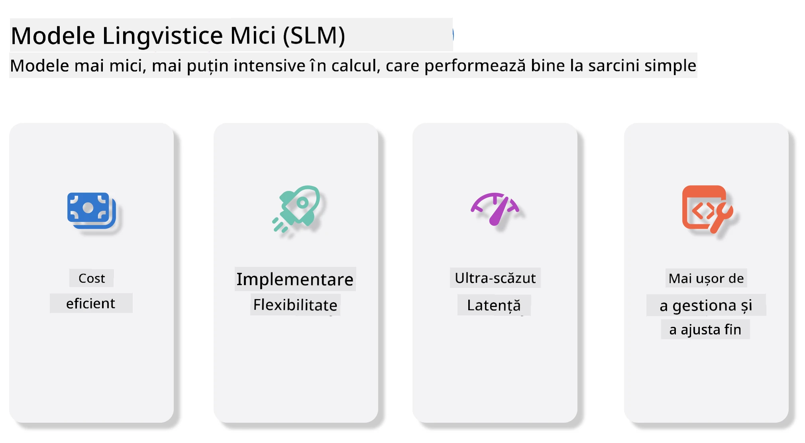
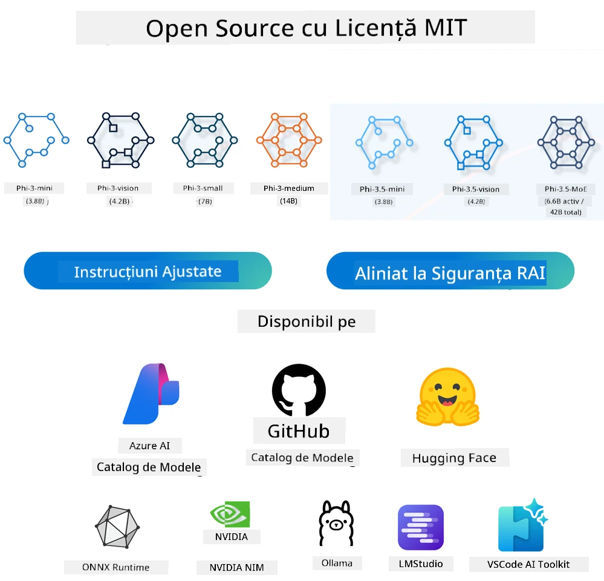
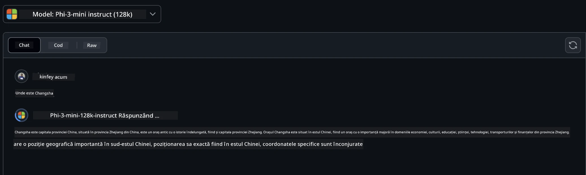
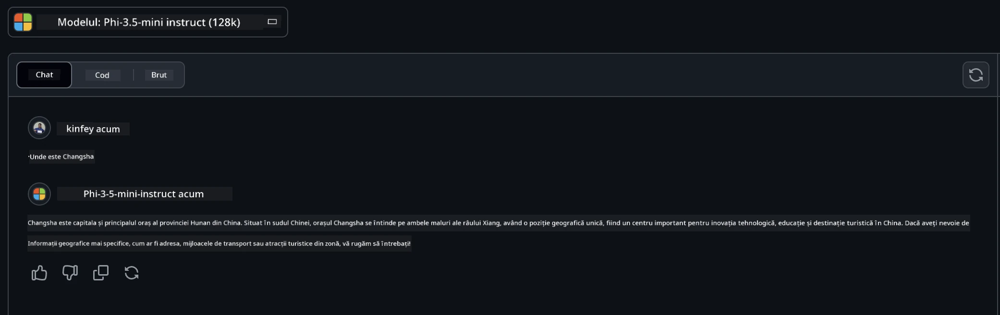

# Introducere în Modelele de Limbaj Mici pentru AI Generativ pentru Începători
AI generativ este un domeniu fascinant al inteligenței artificiale care se concentrează pe crearea sistemelor capabile să genereze conținut nou. Acest conținut poate varia de la text și imagini la muzică și chiar medii virtuale întregi. Una dintre cele mai interesante aplicații ale AI generativ este în sfera modelelor de limbaj.

## Ce Sunt Modelele de Limbaj Mici?

Un Model de Limbaj Mic (SLM) reprezintă o variantă redusă a unui model mare de limbaj (LLM), folosind multe dintre principiile și tehnicile arhitecturale ale LLM-urilor, însă cu o amprentă computațională semnificativ redusă.

SLM-urile sunt un subset de modele de limbaj proiectate să genereze text asemănător cu cel uman. Spre deosebire de omologii lor mai mari, cum ar fi GPT-4, SLM-urile sunt mai compacte și eficiente, făcându-le ideale pentru aplicații în care resursele computaționale sunt limitate. În ciuda dimensiunii lor mai mici, ele pot efectua încă o varietate de sarcini. De obicei, SLM-urile sunt construite prin comprimarea sau distilarea LLM-urilor, cu scopul de a păstra o porțiune substanțială din funcționalitatea și capacitățile lingvistice ale modelului original. Această reducere a dimensiunii modelului scade complexitatea generală, făcând SLM-urile mai eficiente atât în ceea ce privește utilizarea memoriei, cât și cerințele computaționale. În ciuda acestor optimizări, SLM-urile pot efectua încă o gamă largă de sarcini de procesare a limbajului natural (NLP):

- Generare de text: Crearea de propoziții sau paragrafe coerente și contextuale.
- Completare de text: Prezicerea și completarea propozițiilor pe baza unui prompt dat.
- Traducere: Conversia textului dintr-o limbă în alta.
- Rezumare: Condensarea textelor lungi în rezumate mai scurte și mai ușor de înțeles.

Deși cu unele compromisuri în performanță sau adâncimea înțelegerii comparativ cu omologii lor mai mari.

## Cum Funcționează Modelele de Limbaj Mici?
SLM-urile sunt antrenate pe cantități vaste de date text. În timpul antrenamentului, acestea învață pattern-urile și structurile limbajului, ceea ce le permite să genereze texte care sunt atât corecte gramatical, cât și contextuale. Procesul de antrenament implică:

- Colectarea Datelor: Adunarea unor seturi mari de date text din diverse surse.
- Preprocesare: Curățarea și organizarea datelor pentru a le face potrivite pentru antrenament.
- Antrenare: Folosirea algoritmilor de învățare automată pentru a învăța modelul să înțeleagă și să genereze text.
- Ajustare Fină: Reglarea modelului pentru a-i îmbunătăți performanța în sarcini specifice.

Dezvoltarea SLM-urilor se aliniază cu nevoia crescândă de modele ce pot fi implementate în medii cu resurse limitate, cum ar fi dispozitive mobile sau platforme edge computing, unde LLM-urile pe scară largă pot fi nepractice din cauza cerințelor lor ridicate de resurse. Concentrându-se pe eficiență, SLM-urile echilibrează performanța cu accesibilitatea, permițând o aplicare mai largă în diverse domenii.



## Obiective de Învățare

În această lecție, sperăm să introducem cunoștințele despre SLM și să le combinăm cu Microsoft Phi-3 pentru a învăța diferite scenarii în conținut text, viziune și MoE.

La finalul acestei lecții, ar trebui să puteți răspunde la următoarele întrebări:

- Ce este un SLM?
- Care este diferența dintre SLM și LLM?
- Ce este Familia Microsoft Phi-3/3.5?
- Cum se face inferența cu Familia Microsoft Phi-3/3.5?

Pregătit? Să începem.

## Distincțiile dintre Modelele Mari de Limbaj (LLM) și Modelele Mici de Limbaj (SLM)

Atât LLM-urile, cât și SLM-urile sunt construite pe principii fundamentale de învățare automată probabilistică, urmând abordări similare în design-ul arhitectural, metodologii de antrenament, procese de generare a datelor și tehnici de evaluare a modelelor. Totuși, câțiva factori cheie diferențiază aceste două tipuri de modele.

## Aplicații ale Modelelor Mici de Limbaj

SLM-urile au o gamă largă de aplicații, inclusiv:

- Chatboturi: Furnizează suport pentru clienți și interacționează cu utilizatorii într-un mod conversațional.
- Crearea de conținut: Ajută scriitorii generând idei sau chiar schițând articole întregi.
- Educație: Ajută studenții la teme sau la învățarea limbilor străine.
- Accesibilitate: Creează instrumente pentru persoane cu dizabilități, cum ar fi sistemele text-în-vorbire.

**Dimensiunea**

O distincție principală între LLM-uri și SLM-uri constă în scala modelelor. LLM-uri, precum ChatGPT (GPT-4), pot cuprinde aproximativ 1,76 trilioane de parametri, în timp ce SLM-urile open-source precum Mistral 7B sunt proiectate cu un număr semnificativ mai mic de parametri — aproximativ 7 miliarde. Această discrepanță se datorează în primul rând diferențelor în arhitectura modelului și procesele de antrenament. De exemplu, ChatGPT utilizează un mecanism de self-attention într-un cadru encoder-decoder, în timp ce Mistral 7B folosește atenția cu fereastră glisantă, care permite un antrenament mai eficient într-un model de tip decoder-only. Această variație arhitecturală are implicații profunde asupra complexității și performanței acestor modele.

**Înțelegerea**

SLM-urile sunt optimizate în mod tipic pentru performanță în domenii specifice, făcându-le foarte specializate, dar potențial limitate în capacitatea lor de a oferi o înțelegere contextuală largă în mai multe domenii de cunoaștere. În contrast, LLM-urile urmăresc să simuleze inteligența asemănătoare omului pe un nivel mai cuprinzător. Antrenate pe seturi vaste și diverse de date, LLM-urile sunt proiectate să performeze bine în varietate de domenii, oferind o versatilitate și adaptabilitate mai mare. Prin urmare, LLM-urile sunt mai potrivite pentru un spectru mai larg de sarcini ulterioare, cum ar fi procesarea limbajului natural și programarea.

**Calcul**

Antrenarea și implementarea LLM-urilor sunt procese intensive din punct de vedere al resurselor, necesitând de multe ori infrastructură computațională semnificativă, inclusiv clustere GPU pe scară largă. De exemplu, antrenarea unui model ca ChatGPT de la zero poate necesita mii de GPU-uri pentru perioade extinse. În contrast, SLM-urile, cu numărul lor mai mic de parametri, sunt mai accesibile în ceea ce privește resursele computaționale. Modele precum Mistral 7B pot fi antrenate și rulate pe mașini locale echipate cu capacități GPU moderate, deși antrenamentul încă necesită câteva ore pe mai multe GPU-uri.

**Bias**

Bias-ul este o problemă cunoscută în LLM-uri, în principal din cauza naturii datelor de antrenament. Aceste modele se bazează adesea pe date brute, disponibile public pe internet, care pot subreprezenta sau reprezenta greșit anumite grupuri, pot introduce etichetări eronate sau reflectă bias-uri lingvistice influențate de dialect, variații geografice și reguli gramaticale. În plus, complexitatea arhitecturilor LLM poate amplifica în mod inadvertent bias-ul, care poate rămâne neobservat fără o ajustare atentă. În schimb, SLM-urile, fiind antrenate pe seturi de date mai restrânse și specifice domeniului, sunt inerent mai puțin susceptibile la astfel de bias-uri, deși nu sunt complet lipsite de ele.

**Inferență**

Dimensiunea redusă a SLM-urilor le conferă un avantaj semnificativ în termeni de viteză de inferență, permițându-le să genereze rezultate eficient pe hardware local fără nevoie de procesare paralelă extinsă. În contrast, LLM-urile, din cauza dimensiunii și complexității lor, necesită adesea resurse computaționale paralele substanțiale pentru a atinge timpi de inferență acceptabili. Prezența mai multor utilizatori concurenți încetinește și mai mult timpii de răspuns ai LLM-urilor, în special când sunt implementate la scară largă.

În rezumat, deși atât LLM-urile, cât și SLM-urile împărtășesc o bază fundamentală în învățarea automată, ele diferă semnificativ în ceea ce privește dimensiunea modelului, cerințele de resurse, înțelegerea contextuală, susceptibilitatea la bias și viteza de inferență. Aceste distincții reflectă potrivirea lor respectivă pentru diferite cazuri de utilizare, LLM-urile fiind mai versatile dar consumatoare de resurse mari, iar SLM-urile oferind o eficiență specifică domeniului cu cerințe computaționale reduse.

***Notă: În această lecție vom introduce SLM utilizând Microsoft Phi-3 / 3.5 ca exemplu.***

## Introducerea Familiei Phi-3 / Phi-3.5

Familia Phi-3 / 3.5 vizează în principal scenarii de aplicații text, viziune și Agent (MoE):

### Phi-3 / 3.5 Instruct

În principal pentru generare de text, completare conversațională și extragere de informații din conținut, etc.

**Phi-3-mini**

Modelul de limbaj de 3,8 miliarde de parametri este disponibil pe Microsoft Azure AI Studio, Hugging Face și Ollama. Modelele Phi-3 depășesc semnificativ modelele de limbaj de dimensiuni egale și mai mari pe principalele benchmark-uri (vezi cifrele benchmark-urilor de mai jos, valori mai mari sunt mai bune). Phi-3-mini depășește modele de două ori mai mari, în timp ce Phi-3-small și Phi-3-medium depășesc modele mai mari, inclusiv GPT-3.5.

**Phi-3-small & medium**

Cu doar 7 miliarde de parametri, Phi-3-small învinge GPT-3.5T pe o varietate de benchmark-uri limbaj, raționament, codare și matematică.

Phi-3-medium, cu 14 miliarde de parametri, continuă această tendință și depășește Gemini 1.0 Pro.

**Phi-3.5-mini**

Putem considera acest model ca o îmbunătățire a Phi-3-mini. Deși numărul parametrilor rămâne neschimbat, acesta îmbunătățește capacitatea de a susține mai multe limbi (susține peste 20 de limbi: arabă, chineză, cehă, daneză, olandeză, engleză, finlandeză, franceză, germană, ebraică, maghiară, italiană, japoneză, coreeană, norvegiană, poloneză, portugheză, rusă, spaniolă, suedeză, thailandeză, turcă, ucraineană) și adaugă suport mai puternic pentru context extins.

Phi-3.5-mini, cu 3,8 miliarde de parametri, depășește modelele de limbaj de aceeași dimensiune și se află la egalitate cu modele de două ori mai mari.

### Phi-3 / 3.5 Viziune

Putem vedea modelul Instruct al Phi-3/3.5 ca fiind abilitatea Phi de a înțelege, iar Viziunea este ceea ce îi dă lui Phi ochi să înțeleagă lumea.

**Phi-3-Vision**

Phi-3-vision, cu doar 4,2 miliarde de parametri, continuă această tendință și depășește modele mai mari precum Claude-3 Haiku și Gemini 1.0 Pro V în sarcini generale de raționament vizual, OCR și înțelegerea tabelelor și diagramelor.

**Phi-3.5-Vision**

Phi-3.5-Vision este și ea o îmbunătățire a Phi-3-Vision, adăugând suport pentru mai multe imagini. O putem considera o îmbunătățire în viziune, nu doar poți vedea imagini, ci și videoclipuri.

Phi-3.5-vision depășește modele mai mari precum Claude-3.5 Sonnet și Gemini 1.5 Flash în sarcini de OCR, înțelegerea tabelelor și graficelor și este la egalitate în sarcini generale de raționament vizual. Suportă input multi-frame, adică performează raționamente pe mai multe imagini de intrare.

### Phi-3.5-MoE

***Mixture of Experts (MoE)*** permite modelelor să fie preantrenate cu mult mai puține resurse computaționale, ceea ce înseamnă că poți scala dramatic dimensiunea modelului sau setului de date cu același buget computațional ca un model dens. În special, un model MoE ar trebui să atingă aceeași calitate ca omologul său dens mult mai rapid în timpul preantrenamentului.

Phi-3.5-MoE cuprinde 16 module de experți de 3,8 miliarde fiecare. Phi-3.5-MoE, cu doar 6,6 miliarde de parametri activi, atinge un nivel similar de raționament, înțelegere a limbajului și matematică ca modele mult mai mari.

Putem folosi modelul Familiei Phi-3/3.5 pe baza diferitelor scenarii. Spre deosebire de LLM, poți implementa Phi-3/3.5-mini sau Phi-3/3.5-Vision pe dispozitive edge.

## Cum să folosești modelele Familiei Phi-3/3.5

Sperăm să utilizăm Phi-3/3.5 în diferite scenarii. În continuare, vom folosi Phi-3/3.5 pe baza diferitelor scenarii.



### Inferență prin API-uri Cloud

**Modele GitHub**

Modelele GitHub sunt cea mai directă metodă. Poți accesa rapid modelul Phi-3/3.5-Instruct prin Modele GitHub. Combinat cu Azure AI Inference SDK / OpenAI SDK, poți accesa API-ul prin cod pentru a realiza apelul Phi-3/3.5-Instruct. Poți testa și diferite efecte prin Playground.

- Demo: Comparație între efectele Phi-3-mini și Phi-3.5-mini în scenarii în limba chineză





**Azure AI Studio**

Sau dacă dorim să folosim modelele de viziune și MoE, poți utiliza Azure AI Studio pentru a realiza apeluri. Dacă ești interesat, poți citi Phi-3 Cookbook pentru a învăța cum să apelezi Phi-3/3.5 Instruct, Vision, MoE prin Azure AI Studio [Click aici](https://github.com/microsoft/Phi-3CookBook/blob/main/md/02.QuickStart/AzureAIStudio_QuickStart.md?WT.mc_id=academic-105485-koreyst)

**NVIDIA NIM**

Pe lângă soluțiile bazate pe cloud din Catalogul de modele oferite de Azure și GitHub, poți folosi și [NVIDIA NIM](https://developer.nvidia.com/nim?WT.mc_id=academic-105485-koreyst) pentru a realiza apeluri conexe. Poți vizita NVIDIA NIM pentru a efectua apelurile API ale Familiei Phi-3/3.5. NVIDIA NIM (NVIDIA Inference Microservices) este un set de microservicii accelerate pentru inferență, proiectat pentru a ajuta dezvoltatorii să implementeze modele AI eficient în diverse medii, inclusiv cloud-uri, centre de date și stații de lucru.

Iată câteva caracteristici cheie ale NVIDIA NIM:
- **Ușurința implementării:** NIM permite implementarea modelelor AI cu o singură comandă, făcând procesul simplu de integrat în fluxurile de lucru existente.
- **Performanță optimizată:** Utilizează motoarele de inferență pre-optimizate de la NVIDIA, cum ar fi TensorRT și TensorRT-LLM, pentru a asigura latență redusă și debit mare.
- **Scalabilitate:** NIM suportă autoscalarea pe Kubernetes, permițând gestionarea eficientă a volumelor variabile de lucru.
- **Securitate și control:** Organizațiile pot păstra controlul asupra datelor și aplicațiilor prin găzduirea în propriul mediu gestionat a microserviciilor NIM.
- **API-uri standard:** NIM oferă API-uri standard din industrie, facilitând construirea și integrarea aplicațiilor AI precum chatboți, asistenți AI și altele.

NIM face parte din NVIDIA AI Enterprise, care are ca scop simplificarea implementării și operaționalizării modelelor AI, asigurând funcționarea eficientă pe GPU-urile NVIDIA.

- Demo: Utilizarea NVIDIA NIM pentru a apela Phi-3.5-Vision-API  [[Click this link](./python/Phi-3-Vision-Nividia-NIM.ipynb?WT.mc_id=academic-105485-koreyst)]


### Rularea Phi-3/3.5 local
Inferența în relație cu Phi-3, sau orice model de limbaj precum GPT-3, se referă la procesul de generare a răspunsurilor sau predicțiilor pe baza inputului primit. Când furnizați un prompt sau o întrebare lui Phi-3, acesta utilizează rețeaua sa neuronală antrenată pentru a deduce răspunsul cel mai probabil și relevant analizând tiparele și relațiile din datele pe care a fost antrenat.

**Hugging Face Transformer**  
Hugging Face Transformers este o bibliotecă puternică destinată procesării limbajului natural (NLP) și altor sarcini de machine learning. Iată câteva puncte cheie despre aceasta:

1. **Modele pre-antrenate:** Oferă mii de modele pre-antrenate care pot fi utilizate pentru diverse sarcini precum clasificarea textului, recunoașterea entităților numite, răspunsuri la întrebări, sumarizare, traducere și generare de text.

2. **Interoperabilitate între framework-uri:** Biblioteca suportă mai multe framework-uri de deep learning, inclusiv PyTorch, TensorFlow și JAX. Astfel, poți antrena un model într-un framework și îl poți folosi într-altul.

3. **Capabilități multimodale:** Pe lângă NLP, Hugging Face Transformers susține și sarcini din domeniul viziunii computerizate (de exemplu, clasificare de imagini, detecția obiectelor) și procesare audio (de exemplu, recunoaștere vocală, clasificare audio).

4. **Ușurință în utilizare:** Biblioteca oferă API-uri și unelte pentru descărcarea și ajustarea facilă a modelelor, făcând-o accesibilă atât începătorilor, cât și experților.

5. **Comunitate și resurse:** Hugging Face are o comunitate activă și documentație extinsă, tutoriale și ghiduri pentru a ajuta utilizatorii să înceapă și să profite la maximum de bibliotecă. [documentația oficială](https://huggingface.co/docs/transformers/index?WT.mc_id=academic-105485-koreyst) sau depozitul lor [GitHub](https://github.com/huggingface/transformers?WT.mc_id=academic-105485-koreyst).

Aceasta este cea mai utilizată metodă, dar necesită accelerare GPU. Până la urmă, scenarii precum Vision și MoE necesită multe calcule, care vor fi foarte lente pe CPU dacă nu sunt cuantificate.


- Demo: Utilizarea Transformer pentru a apela Phi-3.5-Instruct [Click this link](./python/phi35-instruct-demo.ipynb?WT.mc_id=academic-105485-koreyst)

- Demo: Utilizarea Transformer pentru a apela Phi-3.5-Vision [Click this link](./python/phi35-vision-demo.ipynb?WT.mc_id=academic-105485-koreyst)

- Demo: Utilizarea Transformer pentru a apela Phi-3.5-MoE [Click this link](./python/phi35_moe_demo.ipynb?WT.mc_id=academic-105485-koreyst)

**Ollama**  
[Ollama](https://ollama.com/?WT.mc_id=academic-105485-koreyst) este o platformă creată pentru a facilita rularea locală pe calculator a modelelor mari de limbaj (LLM). Suportă diferite modele precum Llama 3.1, Phi 3, Mistral și Gemma 2, printre altele. Platforma simplifică procesul prin gruparea greutăților modelului, configurației și datelor într-un singur pachet, făcându-l mai accesibil utilizatorilor pentru personalizare și creare de modele proprii. Ollama este disponibil pentru macOS, Linux și Windows. Este un instrument excelent dacă doriți să experimentați sau să implementați LLM-uri fără a depinde de servicii cloud. Ollama este modul cel mai direct, trebuie doar să executați următoarea comandă.


```bash

ollama run phi3.5

```


**ONNX Runtime pentru GenAI**

[ONNX Runtime](https://github.com/microsoft/onnxruntime-genai?WT.mc_id=academic-105485-koreyst) este un accelerator de inferență și antrenament pentru machine learning multiplatformă. ONNX Runtime pentru Inteligență Artificială Generativă (GENAI) este un instrument puternic care vă ajută să rulați modele AI generative eficient pe diverse platforme.

## Ce este ONNX Runtime?  
ONNX Runtime este un proiect open-source care permite inferența de înaltă performanță a modelelor de machine learning. Suportă modele în formatul Open Neural Network Exchange (ONNX), un standard pentru reprezentarea modelelor de machine learning. Inferența ONNX Runtime poate oferi experiențe mai rapide pentru utilizatori și costuri reduse, susținând modele din framework-uri de deep learning precum PyTorch și TensorFlow/Keras, dar și biblioteci clasice de machine learning precum scikit-learn, LightGBM, XGBoost etc. ONNX Runtime este compatibil cu diferite hardware-uri, drivere și sisteme de operare, oferind performanță optimă prin utilizarea acceleratoarelor hardware acolo unde este cazul, împreună cu optimizări și transformări ale grafurilor.

## Ce este Inteligența Artificială Generativă?  
Inteligența Artificială Generativă se referă la sisteme AI care pot genera conținut nou, cum ar fi texte, imagini sau muzică, bazându-se pe datele pe care au fost antrenate. Exemple includ modele de limbaj precum GPT-3 și modele de generare a imaginilor precum Stable Diffusion. Biblioteca ONNX Runtime pentru GenAI furnizează bucla de AI generativă pentru modelele ONNX, incluzând inferența cu ONNX Runtime, procesarea logitilor, căutarea și eșantionarea, și gestionarea cache-ului KV.

## ONNX Runtime pentru GENAI  
ONNX Runtime pentru GENAI extinde capabilitățile ONNX Runtime pentru a susține modele AI generative. Iată câteva caracteristici cheie:

- **Suport larg pentru platforme:** Funcționează pe diverse platforme, inclusiv Windows, Linux, macOS, Android și iOS.
- **Suport pentru modele:** Suportă multe modele populare AI generative, precum LLaMA, GPT-Neo, BLOOM și altele.
- **Optimizare a performanței:** Include optimizări pentru diferite acceleratoare hardware precum GPU-urile NVIDIA, GPU-urile AMD și altele.
- **Ușurința utilizării:** Oferă API-uri pentru integrare ușoară în aplicații, permițând generarea de texte, imagini și alte conținuturi cu cod minim
- Utilizatorii pot apela o metodă de nivel înalt generate(), sau pot rula fiecare iterație a modelului într-un ciclu, generând un token pe rând și, opțional, actualizând parametrii de generare în interiorul ciclului.
- ONNX Runtime are, de asemenea, suport pentru căutare greedy/beam și eșantionare TopP, TopK pentru generarea de secvențe de tokeni și procesare internă a logitilor precum penalizări pentru repetiție. Se poate adăuga foarte ușor și evaluare personalizată.

## Începerea utilizării  
Pentru a începe cu ONNX Runtime pentru GENAI, puteți urma acești pași:

### Instalați ONNX Runtime:  
```Python
pip install onnxruntime
```
### Instalați Extensiile pentru Inteligență Artificială Generativă:  
```Python
pip install onnxruntime-genai
```
  
### Rulați un model: Iată un exemplu simplu în Python:  
```Python
import onnxruntime_genai as og

model = og.Model('path_to_your_model.onnx')

tokenizer = og.Tokenizer(model)

input_text = "Hello, how are you?"

input_tokens = tokenizer.encode(input_text)

output_tokens = model.generate(input_tokens)

output_text = tokenizer.decode(output_tokens)

print(output_text) 
```
### Demo:Utilizarea ONNX Runtime GenAI pentru a apela Phi-3.5-Vision  


```python

import onnxruntime_genai as og

model_path = './Your Phi-3.5-vision-instruct ONNX Path'

img_path = './Your Image Path'

model = og.Model(model_path)

processor = model.create_multimodal_processor()

tokenizer_stream = processor.create_stream()

text = "Your Prompt"

prompt = "<|user|>\n"

prompt += "<|image_1|>\n"

prompt += f"{text}<|end|>\n"

prompt += "<|assistant|>\n"

image = og.Images.open(img_path)

inputs = processor(prompt, images=image)

params = og.GeneratorParams(model)

params.set_inputs(inputs)

params.set_search_options(max_length=3072)

generator = og.Generator(model, params)

while not generator.is_done():

    generator.compute_logits()
    
    generator.generate_next_token()

    new_token = generator.get_next_tokens()[0]
    
    output = tokenizer_stream.decode(new_token)
    
    print(tokenizer_stream.decode(new_token), end='', flush=True)

```


**Altele**

Pe lângă metodele de referință ONNX Runtime și Ollama, putem completa referința modelelor cantitative bazate pe metodele de referință ale modelelor oferite de diferiți producători. De exemplu, cadrul Apple MLX cu Apple Metal, Qualcomm QNN cu NPU, Intel OpenVINO cu CPU/GPU, etc. Puteți găsi mai mult conținut în [Phi-3 Cookbook](https://github.com/microsoft/phi-3cookbook?WT.mc_id=academic-105485-koreyst)


## Mai mult

Am învățat elementele de bază ale familiei Phi-3/3.5, dar pentru a afla mai multe despre SLM avem nevoie de mai multă cunoaștere. Puteți găsi răspunsurile în Phi-3 Cookbook. Dacă doriți să aflați mai multe, vă rugăm să vizitați [Phi-3 Cookbook](https://github.com/microsoft/phi-3cookbook?WT.mc_id=academic-105485-koreyst).

---

<!-- CO-OP TRANSLATOR DISCLAIMER START -->
**Declinarea responsabilității**:  
Acest document a fost tradus folosind serviciul de traducere AI [Co-op Translator](https://github.com/Azure/co-op-translator). Deși ne străduim pentru acuratețe, vă rugăm să aveți în vedere că traducerile automate pot conține erori sau inacurități. Documentul original în limba sa nativă trebuie considerat sursa autoritară. Pentru informații critice, este recomandată traducerea profesională realizată de un traducător uman. Nu ne asumăm răspunderea pentru eventualele neînțelegeri sau interpretări greșite rezultate din utilizarea acestei traduceri.
<!-- CO-OP TRANSLATOR DISCLAIMER END -->