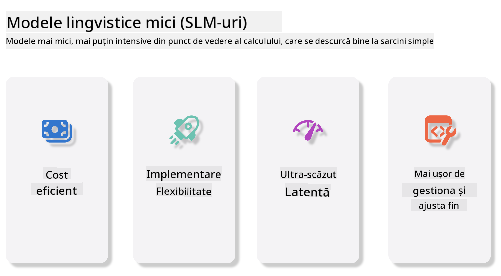
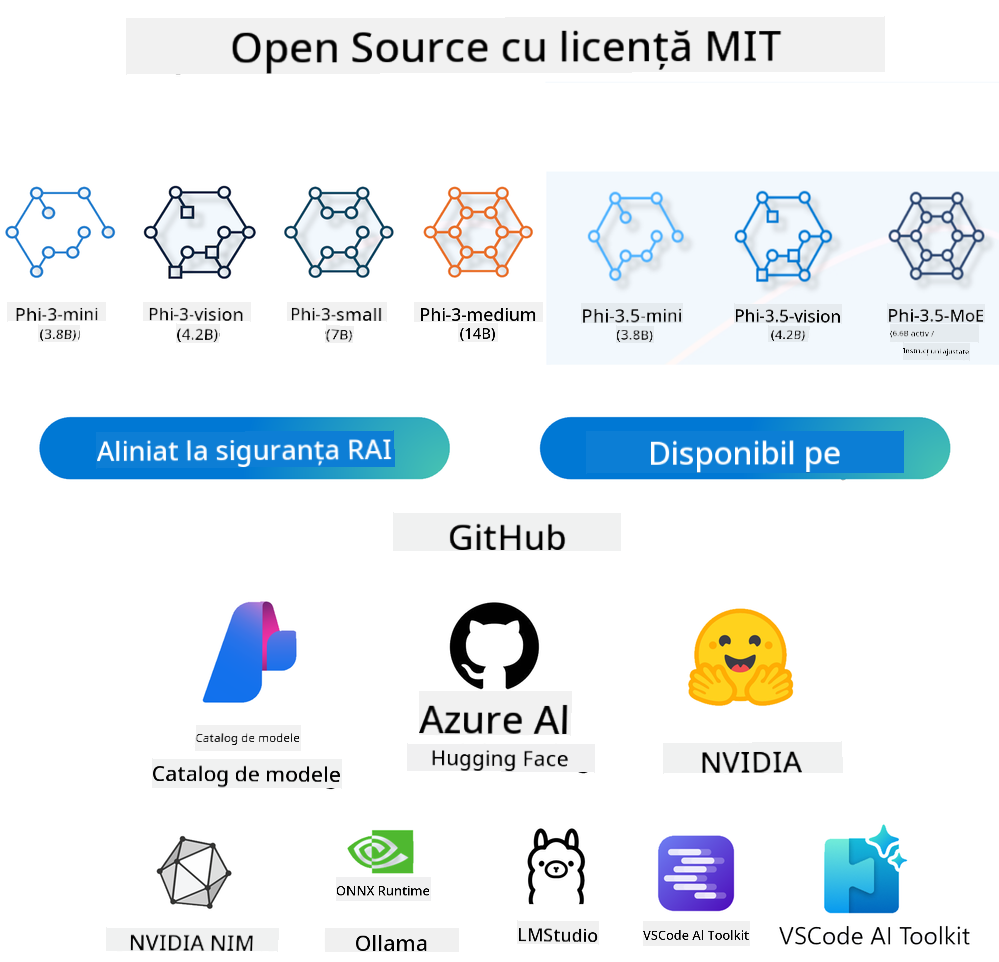

<!--
CO_OP_TRANSLATOR_METADATA:
{
  "original_hash": "124ad36cfe96f74038811b6e2bb93e9d",
  "translation_date": "2025-07-09T18:48:00+00:00",
  "source_file": "19-slm/README.md",
  "language_code": "ro"
}
-->
# Introducere în Modelele de Limbaj Mici pentru AI Generativ destinat Începătorilor  
AI generativ este un domeniu fascinant al inteligenței artificiale care se concentrează pe crearea de sisteme capabile să genereze conținut nou. Acest conținut poate varia de la text și imagini, până la muzică și chiar medii virtuale întregi. Una dintre cele mai interesante aplicații ale AI generativ este în domeniul modelelor de limbaj.

## Ce sunt Modelele de Limbaj Mici?  

Un Model de Limbaj Mic (SLM) reprezintă o variantă redusă a unui model de limbaj mare (LLM), folosind multe dintre principiile arhitecturale și tehnicile LLM-urilor, dar cu o amprentă computațională semnificativ mai mică.

SLM-urile sunt un subset de modele de limbaj concepute pentru a genera text asemănător celui uman. Spre deosebire de omologii lor mai mari, cum ar fi GPT-4, SLM-urile sunt mai compacte și eficiente, fiind ideale pentru aplicații unde resursele computaționale sunt limitate. În ciuda dimensiunii mai mici, ele pot îndeplini o varietate de sarcini. De obicei, SLM-urile sunt construite prin comprimarea sau distilarea LLM-urilor, cu scopul de a păstra o parte substanțială din funcționalitatea și capacitățile lingvistice ale modelului original. Această reducere a dimensiunii modelului scade complexitatea generală, făcând SLM-urile mai eficiente atât în ceea ce privește utilizarea memoriei, cât și cerințele computaționale. În ciuda acestor optimizări, SLM-urile pot realiza o gamă largă de sarcini de procesare a limbajului natural (NLP):

- Generare de text: Crearea de propoziții sau paragrafe coerente și relevante contextual.  
- Completarea textului: Prezicerea și completarea propozițiilor pe baza unui prompt dat.  
- Traducere: Conversia textului dintr-o limbă în alta.  
- Rezumare: Condensarea unor texte lungi în rezumate mai scurte și mai ușor de digerat.

Deși există unele compromisuri în performanță sau profunzimea înțelegerii comparativ cu modelele mai mari.

## Cum Funcționează Modelele de Limbaj Mici?  
SLM-urile sunt antrenate pe cantități mari de date text. În timpul antrenamentului, ele învață tiparele și structurile limbajului, permițându-le să genereze text care este atât gramatical corect, cât și adecvat contextual. Procesul de antrenament implică:

- Colectarea datelor: Adunarea unor seturi mari de date text din diverse surse.  
- Preprocesare: Curățarea și organizarea datelor pentru a le face potrivite pentru antrenament.  
- Antrenament: Folosirea algoritmilor de învățare automată pentru a învăța modelul să înțeleagă și să genereze text.  
- Ajustare fină: Reglarea modelului pentru a-i îmbunătăți performanța pe sarcini specifice.

Dezvoltarea SLM-urilor răspunde nevoii tot mai mari de modele care pot fi implementate în medii cu resurse limitate, cum ar fi dispozitive mobile sau platforme de edge computing, unde LLM-urile complete pot fi nepractice din cauza cerințelor mari de resurse. Prin concentrarea pe eficiență, SLM-urile echilibrează performanța cu accesibilitatea, permițând o aplicare mai largă în diverse domenii.



## Obiective de Învățare  

În această lecție, ne propunem să introducem cunoștințele despre SLM și să le combinăm cu Microsoft Phi-3 pentru a explora diferite scenarii în conținut text, viziune și MoE.

La finalul acestei lecții, ar trebui să puteți răspunde la următoarele întrebări:

- Ce este SLM  
- Care este diferența dintre SLM și LLM  
- Ce este familia Microsoft Phi-3/3.5  
- Cum se face inferența cu familia Microsoft Phi-3/3.5

Sunteți gata? Să începem.

## Diferențele dintre Modelele de Limbaj Mari (LLM) și Modelele de Limbaj Mici (SLM)  

Atât LLM-urile, cât și SLM-urile se bazează pe principii fundamentale ale învățării automate probabilistice, urmând abordări similare în designul arhitectural, metodologiile de antrenament, procesele de generare a datelor și tehnicile de evaluare a modelelor. Totuși, câțiva factori cheie diferențiază aceste două tipuri de modele.

## Aplicații ale Modelelor de Limbaj Mici  

SLM-urile au o gamă largă de aplicații, inclusiv:

- Chatbot-uri: Oferirea de suport clienților și interacțiunea cu utilizatorii într-un mod conversațional.  
- Crearea de conținut: Asistarea scriitorilor prin generarea de idei sau chiar redactarea unor articole întregi.  
- Educație: Ajutarea elevilor la teme sau învățarea unor limbi noi.  
- Accesibilitate: Crearea de instrumente pentru persoanele cu dizabilități, cum ar fi sistemele text-în-vorbire.

**Dimensiunea**  

O diferență principală între LLM-uri și SLM-uri constă în scala modelelor. LLM-uri, precum ChatGPT (GPT-4), pot avea aproximativ 1,76 trilioane de parametri, în timp ce SLM-urile open-source, cum ar fi Mistral 7B, sunt proiectate cu un număr mult mai mic de parametri — aproximativ 7 miliarde. Această diferență se datorează în principal arhitecturii modelului și proceselor de antrenament. De exemplu, ChatGPT folosește un mecanism de auto-atenție într-un cadru encoder-decoder, în timp ce Mistral 7B utilizează atenția cu fereastră glisantă, care permite un antrenament mai eficient într-un model doar decoder. Această variație arhitecturală are implicații profunde asupra complexității și performanței acestor modele.

**Înțelegerea**  

SLM-urile sunt de obicei optimizate pentru performanță în domenii specifice, devenind astfel foarte specializate, dar pot avea o capacitate limitată de a oferi o înțelegere contextuală largă în mai multe domenii de cunoaștere. În contrast, LLM-urile urmăresc să simuleze inteligența umană la un nivel mai cuprinzător. Antrenate pe seturi de date vaste și diverse, LLM-urile sunt concepute să performeze bine în diverse domenii, oferind o versatilitate și adaptabilitate mai mare. Prin urmare, LLM-urile sunt mai potrivite pentru o gamă largă de sarcini ulterioare, cum ar fi procesarea limbajului natural și programarea.

**Computație**  

Antrenamentul și implementarea LLM-urilor sunt procese intensive din punct de vedere al resurselor, necesitând adesea infrastructură computațională semnificativă, inclusiv clustere mari de GPU-uri. De exemplu, antrenarea unui model precum ChatGPT de la zero poate necesita mii de GPU-uri pe perioade îndelungate. În schimb, SLM-urile, cu un număr mai mic de parametri, sunt mai accesibile din punct de vedere al resurselor computaționale. Modele precum Mistral 7B pot fi antrenate și rulate pe mașini locale echipate cu GPU-uri moderate, deși antrenamentul necesită tot câteva ore pe mai multe GPU-uri.

**Bias**  

Biasul este o problemă cunoscută în LLM-uri, în principal din cauza naturii datelor de antrenament. Aceste modele se bazează adesea pe date brute, disponibile public pe internet, care pot subreprezenta sau reprezenta eronat anumite grupuri, pot introduce etichetări greșite sau reflectă biasuri lingvistice influențate de dialect, variații geografice și reguli gramaticale. În plus, complexitatea arhitecturilor LLM poate agrava involuntar biasul, care poate trece neobservat fără o ajustare atentă. Pe de altă parte, SLM-urile, fiind antrenate pe seturi de date mai restrânse și specifice domeniului, sunt în mod inerent mai puțin susceptibile la astfel de biasuri, deși nu sunt complet lipsite de ele.

**Inferență**  

Dimensiunea redusă a SLM-urilor le oferă un avantaj semnificativ în ceea ce privește viteza de inferență, permițându-le să genereze rezultate eficient pe hardware local, fără a necesita procesare paralelă extinsă. În contrast, LLM-urile, din cauza dimensiunii și complexității, necesită adesea resurse computaționale paralele substanțiale pentru a atinge timpi de inferență acceptabili. Prezența mai multor utilizatori concurenți încetinește și mai mult timpii de răspuns ai LLM-urilor, mai ales când sunt implementate la scară largă.

În concluzie, deși atât LLM-urile, cât și SLM-urile împărtășesc o bază fundamentală în învățarea automată, ele diferă semnificativ în ceea ce privește dimensiunea modelului, cerințele de resurse, înțelegerea contextuală, susceptibilitatea la bias și viteza de inferență. Aceste diferențe reflectă potrivirea lor pentru cazuri de utilizare diferite, LLM-urile fiind mai versatile, dar consumatoare de resurse, iar SLM-urile oferind o eficiență mai mare, specifică domeniului, cu cerințe computaționale reduse.

***Note: În acest capitol, vom introduce SLM folosind Microsoft Phi-3 / 3.5 ca exemplu.***

## Introducerea Familiei Phi-3 / Phi-3.5  

Familia Phi-3 / 3.5 se adresează în principal scenariilor de aplicații pentru text, viziune și Agent (MoE):

### Phi-3 / 3.5 Instruct  

Se concentrează în principal pe generarea de text, completarea conversațiilor și extragerea de informații din conținut, etc.

**Phi-3-mini**  

Modelul de limbaj de 3,8 miliarde de parametri este disponibil pe Microsoft Azure AI Studio, Hugging Face și Ollama. Modelele Phi-3 depășesc semnificativ modelele de limbaj de dimensiuni egale sau mai mari pe principalele benchmark-uri (vezi cifrele benchmark-urilor mai jos, valorile mai mari sunt mai bune). Phi-3-mini depășește modele de două ori mai mari, în timp ce Phi-3-small și Phi-3-medium depășesc modele mai mari, inclusiv GPT-3.5.

**Phi-3-small & medium**  

Cu doar 7 miliarde de parametri, Phi-3-small îl depășește pe GPT-3.5T pe o varietate de benchmark-uri de limbaj, raționament, programare și matematică.

Phi-3-medium, cu 14 miliarde de parametri, continuă această tendință și îl depășește pe Gemini 1.0 Pro.

**Phi-3.5-mini**  

Putem considera acest model ca o versiune îmbunătățită a Phi-3-mini. Deși numărul parametrilor rămâne neschimbat, îmbunătățește capacitatea de a susține mai multe limbi (suportă peste 20 de limbi: arabă, chineză, cehă, daneză, olandeză, engleză, finlandeză, franceză, germană, ebraică, maghiară, italiană, japoneză, coreeană, norvegiană, poloneză, portugheză, rusă, spaniolă, suedeză, thailandeză, turcă, ucraineană) și adaugă un suport mai puternic pentru contexte lungi.

Phi-3.5-mini, cu 3,8 miliarde de parametri, depășește modelele de limbaj de aceeași dimensiune și este comparabil cu modele de două ori mai mari.

### Phi-3 / 3.5 Vision  

Putem considera modelul Instruct al Phi-3/3.5 ca abilitatea Phi de a înțelege, iar Vision este ceea ce îi oferă lui Phi „ochi” pentru a înțelege lumea.

**Phi-3-Vision**  

Phi-3-vision, cu doar 4,2 miliarde de parametri, continuă această tendință și depășește modele mai mari precum Claude-3 Haiku și Gemini 1.0 Pro V în sarcini generale de raționament vizual, OCR și înțelegerea tabelelor și diagramelor.

**Phi-3.5-Vision**  

Phi-3.5-Vision este, de asemenea, o versiune îmbunătățită a Phi-3-Vision, adăugând suport pentru imagini multiple. Putem considera aceasta o îmbunătățire în viziune: nu doar că poate vedea imagini, ci și videoclipuri.

Phi-3.5-vision depășește modele mai mari precum Claude-3.5 Sonnet și Gemini 1.5 Flash în sarcini de OCR, înțelegerea tabelelor și graficelor și este comparabil în sarcini generale de raționament vizual. Suportă input multi-frame, adică poate efectua raționamente pe mai multe imagini de intrare.

### Phi-3.5-MoE  

***Mixture of Experts (MoE)*** permite modelelor să fie pre-antrenate cu mult mai puțină putere de calcul, ceea ce înseamnă că poți scala dramatic dimensiunea modelului sau a setului de date cu același buget de calcul ca un model dens. În special, un model MoE ar trebui să atingă aceeași calitate ca omologul său dens mult mai rapid în timpul pre-antrenamentului.

Phi-3.5-MoE cuprinde 16 module de experți de 3,8 miliarde fiecare. Phi-3.5-MoE, cu doar 6,6 miliarde de parametri activi, atinge un nivel similar de raționament, înțelegere a limbajului și matematică ca modele mult mai mari.

Putem folosi modelul din familia Phi-3/3.5 în funcție de diferite scenarii. Spre deosebire de LLM, poți implementa Phi-3/3.5-mini sau Phi-3/3.5-Vision pe dispozitive edge.

## Cum să folosești modelele din familia Phi-3/3.5  

Ne propunem să folosim Phi-3/3.5 în diferite scenarii. În continuare, vom folosi Phi-3/3.5 în funcție de diverse scenarii.



### Diferența de inferență prin API-ul Cloud  

**Modele GitHub**  

Modelele GitHub sunt cea mai directă metodă. Poți accesa rapid modelul Phi-3/3.5-Instruct prin Modele GitHub. Combinat cu Azure AI Inference SDK / OpenAI SDK, poți accesa API-ul prin cod pentru a efectua apeluri către Phi-3/3.5-Instruct. De asemenea, poți testa diferite efecte prin Playground.

- Demo: Compararea efectelor Phi-3-mini și Phi-3.5-mini în scenarii chinezești


**Azure AI Studio**  

Sau, dacă dorim să folosim modelele de viziune și MoE, putem folosi Azure AI Studio pentru a efectua apelurile. Dacă ești interesat, poți citi Phi-3 Cookbook pentru a învăța cum să apelezi Phi-3/3.5 Instruct, Vision, MoE prin Azure AI Studio [Click pe acest link](https://github.com/microsoft/Phi-3CookBook/blob/main/md/02.QuickStart/AzureAIStudio_QuickStart.md?WT.mc_id=academic-105485-koreyst)

**NVIDIA NIM**  

Pe lângă soluțiile bazate pe cloud din Catalogul de Modele oferite de Azure și GitHub, poți folosi și [NVIDIA NIM](https://developer.nvidia.com/nim?WT.mc_id=academic-105485-koreyst) pentru a efectua apeluri relevante. Poți vizita NVIDIA NIM pentru a realiza apelurile API ale familiei Phi-3/3.5. NVIDIA NIM (NVIDIA Inference Microservices) este un set de microservicii accelerate pentru inferență, concepute să ajute dezvoltatorii să implementeze modele AI eficient în diverse medii, inclusiv cloud-uri, centre de date și stații de lucru.

Iată câteva caracteristici cheie ale NVIDIA NIM:

- **Ușurința implementării:** NIM permite implementarea modelelor AI cu o singură comandă, făcând integrarea în fluxurile de lucru existente simplă.  
- **Performanță optimizată:** Folosește motoarele de inferență pre-optimizate NVIDIA, cum ar fi TensorRT și TensorRT-LLM, pentru a as
- **Securitate și Control:** Organizațiile pot păstra controlul asupra datelor și aplicațiilor lor prin găzduirea locală a microserviciilor NIM pe infrastructura proprie administrată.
- **API-uri Standard:** NIM oferă API-uri standard în industrie, facilitând construirea și integrarea aplicațiilor AI precum chatboți, asistenți AI și altele.

NIM face parte din NVIDIA AI Enterprise, care are ca scop simplificarea implementării și operaționalizării modelelor AI, asigurând rularea eficientă pe GPU-urile NVIDIA.

- Demo: Utilizarea Nividia NIM pentru a apela Phi-3.5-Vision-API  [[Click aici](../../../19-slm/python/Phi-3-Vision-Nividia-NIM.ipynb)]


### Inferență Phi-3/3.5 în mediu local
Inferența în legătură cu Phi-3, sau orice model de limbaj precum GPT-3, se referă la procesul de generare a răspunsurilor sau predicțiilor pe baza inputului primit. Când oferi un prompt sau o întrebare lui Phi-3, acesta folosește rețeaua sa neuronală antrenată pentru a deduce cel mai probabil și relevant răspuns, analizând tiparele și relațiile din datele pe care a fost antrenat.

**Hugging Face Transformer**  
Hugging Face Transformers este o bibliotecă puternică destinată procesării limbajului natural (NLP) și altor sarcini de machine learning. Iată câteva puncte cheie despre aceasta:

1. **Modele Preantrenate:** Oferă mii de modele preantrenate care pot fi folosite pentru diverse sarcini, cum ar fi clasificarea textului, recunoașterea entităților numite, răspunsuri la întrebări, sumarizare, traducere și generare de text.

2. **Interoperabilitate între Framework-uri:** Biblioteca suportă mai multe framework-uri de deep learning, inclusiv PyTorch, TensorFlow și JAX. Astfel, poți antrena un model într-un framework și îl poți folosi în altul.

3. **Capabilități Multimodale:** Pe lângă NLP, Hugging Face Transformers suportă și sarcini din domeniul viziunii computerizate (ex. clasificare imagini, detecție obiecte) și procesarea audio (ex. recunoaștere vocală, clasificare audio).

4. **Ușurință în Utilizare:** Biblioteca oferă API-uri și unelte pentru descărcarea și ajustarea ușoară a modelelor, fiind accesibilă atât începătorilor, cât și experților.

5. **Comunitate și Resurse:** Hugging Face are o comunitate activă și o documentație extinsă, tutoriale și ghiduri pentru a ajuta utilizatorii să înceapă și să profite la maximum de bibliotecă.  
[documentație oficială](https://huggingface.co/docs/transformers/index?WT.mc_id=academic-105485-koreyst) sau [repository GitHub](https://github.com/huggingface/transformers?WT.mc_id=academic-105485-koreyst).

Aceasta este metoda cea mai folosită, dar necesită accelerare GPU. Scene precum Vision și MoE implică multe calcule, care vor fi foarte limitate pe CPU dacă nu sunt cuantificate.


- Demo: Utilizarea Transformer pentru a apela Phi-3.5-Instuct [Click aici](../../../19-slm/python/phi35-instruct-demo.ipynb)

- Demo: Utilizarea Transformer pentru a apela Phi-3.5-Vision [Click aici](../../../19-slm/python/phi35-vision-demo.ipynb)

- Demo: Utilizarea Transformer pentru a apela Phi-3.5-MoE [Click aici](../../../19-slm/python/phi35_moe_demo.ipynb)

**Ollama**  
[Ollama](https://ollama.com/?WT.mc_id=academic-105485-koreyst) este o platformă creată pentru a facilita rularea locală a modelelor mari de limbaj (LLM) pe calculatorul tău. Suportă diverse modele precum Llama 3.1, Phi 3, Mistral și Gemma 2, printre altele. Platforma simplifică procesul prin împachetarea greutăților modelului, configurației și datelor într-un singur pachet, făcându-l mai accesibil pentru utilizatori să personalizeze și să creeze propriile modele. Ollama este disponibil pentru macOS, Linux și Windows. Este un instrument excelent dacă dorești să experimentezi sau să implementezi LLM-uri fără a depinde de servicii cloud. Ollama este cea mai directă metodă, trebuie doar să execuți următoarea comandă.


```bash

ollama run phi3.5

```


**ONNX Runtime pentru GenAI**

[ONNX Runtime](https://github.com/microsoft/onnxruntime-genai?WT.mc_id=academic-105485-koreyst) este un accelerator cross-platform pentru inferență și antrenare în machine learning. ONNX Runtime pentru Generative AI (GENAI) este un instrument puternic care te ajută să rulezi modele generative AI eficient pe diverse platforme.

## Ce este ONNX Runtime?  
ONNX Runtime este un proiect open-source care permite inferența de înaltă performanță a modelelor de machine learning. Suportă modele în formatul Open Neural Network Exchange (ONNX), un standard pentru reprezentarea modelelor de machine learning. Inferența ONNX Runtime poate oferi experiențe mai rapide pentru utilizatori și costuri reduse, suportând modele din framework-uri de deep learning precum PyTorch și TensorFlow/Keras, dar și biblioteci clasice de machine learning precum scikit-learn, LightGBM, XGBoost etc. ONNX Runtime este compatibil cu diverse hardware-uri, drivere și sisteme de operare, oferind performanță optimă prin utilizarea acceleratoarelor hardware acolo unde este posibil, împreună cu optimizări și transformări ale grafului.

## Ce este Generative AI?  
Generative AI se referă la sisteme AI care pot genera conținut nou, cum ar fi text, imagini sau muzică, pe baza datelor pe care au fost antrenate. Exemple includ modele de limbaj precum GPT-3 și modele de generare imagini precum Stable Diffusion. Biblioteca ONNX Runtime pentru GenAI oferă bucla generativă AI pentru modelele ONNX, incluzând inferența cu ONNX Runtime, procesarea logits, căutare și eșantionare, precum și gestionarea cache-ului KV.

## ONNX Runtime pentru GENAI  
ONNX Runtime pentru GENAI extinde capabilitățile ONNX Runtime pentru a susține modelele generative AI. Iată câteva caracteristici cheie:

- **Suport larg pentru platforme:** Funcționează pe diverse platforme, inclusiv Windows, Linux, macOS, Android și iOS.  
- **Suport pentru modele:** Suportă multe modele populare de generative AI, cum ar fi LLaMA, GPT-Neo, BLOOM și altele.  
- **Optimizare a performanței:** Include optimizări pentru diferite acceleratoare hardware precum GPU-uri NVIDIA, GPU-uri AMD și altele.  
- **Ușurință în utilizare:** Oferă API-uri pentru integrare facilă în aplicații, permițând generarea de text, imagini și alte conținuturi cu un minim de cod.  
- Utilizatorii pot apela metoda de nivel înalt generate(), sau pot rula fiecare iterație a modelului într-un loop, generând un token pe rând și, opțional, actualizând parametrii de generare în interiorul buclei.  
- ONNX Runtime suportă și căutare greedy/beam și eșantionare TopP, TopK pentru generarea secvențelor de tokeni și procesare integrată a logits, cum ar fi penalizările pentru repetiție. Poți adăuga ușor și scorare personalizată.

## Început rapid  
Pentru a începe cu ONNX Runtime pentru GENAI, poți urma acești pași:

### Instalează ONNX Runtime:  
```Python
pip install onnxruntime
```  
### Instalează extensiile Generative AI:  
```Python
pip install onnxruntime-genai
```

### Rulează un model: Iată un exemplu simplu în Python:  
```Python
import onnxruntime_genai as og

model = og.Model('path_to_your_model.onnx')

tokenizer = og.Tokenizer(model)

input_text = "Hello, how are you?"

input_tokens = tokenizer.encode(input_text)

output_tokens = model.generate(input_tokens)

output_text = tokenizer.decode(output_tokens)

print(output_text) 
```  
### Demo: Utilizarea ONNX Runtime GenAI pentru a apela Phi-3.5-Vision


```python

import onnxruntime_genai as og

model_path = './Your Phi-3.5-vision-instruct ONNX Path'

img_path = './Your Image Path'

model = og.Model(model_path)

processor = model.create_multimodal_processor()

tokenizer_stream = processor.create_stream()

text = "Your Prompt"

prompt = "<|user|>\n"

prompt += "<|image_1|>\n"

prompt += f"{text}<|end|>\n"

prompt += "<|assistant|>\n"

image = og.Images.open(img_path)

inputs = processor(prompt, images=image)

params = og.GeneratorParams(model)

params.set_inputs(inputs)

params.set_search_options(max_length=3072)

generator = og.Generator(model, params)

while not generator.is_done():

    generator.compute_logits()
    
    generator.generate_next_token()

    new_token = generator.get_next_tokens()[0]
    
    code += tokenizer_stream.decode(new_token)
    
    print(tokenizer_stream.decode(new_token), end='', flush=True)

```


**Altele**

Pe lângă metodele de referință ONNX Runtime și Ollama, putem completa referința modelelor cantitative bazate pe metodele de referință oferite de diferiți producători. De exemplu, framework-ul Apple MLX cu Apple Metal, Qualcomm QNN cu NPU, Intel OpenVINO cu CPU/GPU etc. Poți găsi mai multe informații în [Phi-3 Cookbook](https://github.com/microsoft/phi-3cookbook?WT.mc_id=academic-105485-koreyst).


## Mai mult

Am învățat elementele de bază ale familiei Phi-3/3.5, dar pentru a aprofunda SLM avem nevoie de mai multe cunoștințe. Răspunsurile le poți găsi în Phi-3 Cookbook. Dacă vrei să afli mai multe, te rugăm să vizitezi [Phi-3 Cookbook](https://github.com/microsoft/phi-3cookbook?WT.mc_id=academic-105485-koreyst).

**Declinare de responsabilitate**:  
Acest document a fost tradus folosind serviciul de traducere AI [Co-op Translator](https://github.com/Azure/co-op-translator). Deși ne străduim pentru acuratețe, vă rugăm să rețineți că traducerile automate pot conține erori sau inexactități. Documentul original în limba sa nativă trebuie considerat sursa autorizată. Pentru informații critice, se recomandă traducerea profesională realizată de un specialist uman. Nu ne asumăm răspunderea pentru eventualele neînțelegeri sau interpretări greșite rezultate din utilizarea acestei traduceri.