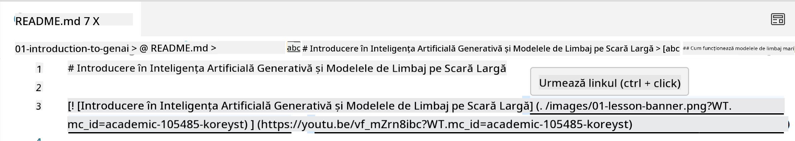
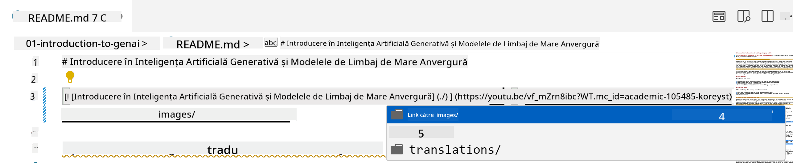
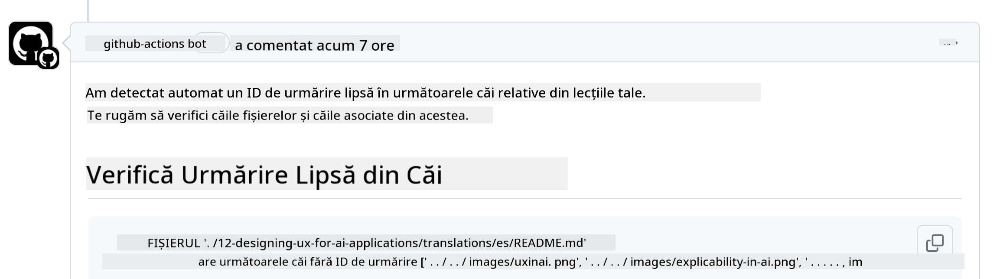
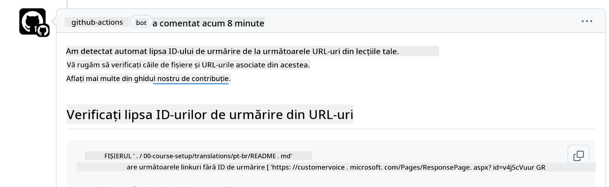
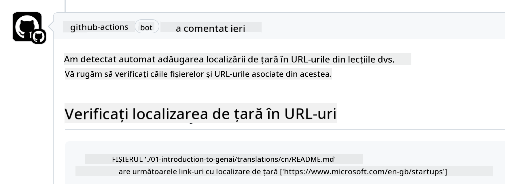

<!--
CO_OP_TRANSLATOR_METADATA:
{
  "original_hash": "57c41f2af71001a2cff9d8eb797cb843",
  "translation_date": "2025-05-19T11:24:55+00:00",
  "source_file": "CONTRIBUTING.md",
  "language_code": "ro"
}
-->
# Contribuții

Acest proiect acceptă contribuții și sugestii. Majoritatea contribuțiilor necesită să
acordați un Acord de Licență pentru Contribuitor (CLA) care declară că aveți dreptul de a,
și chiar acordați, drepturile de a folosi contribuția dvs. Pentru detalii, vizitați
<https://cla.microsoft.com>.

> Important: când traduceți textul în acest depozit, vă rugăm să vă asigurați că nu folosiți traduceri automate. Vom verifica traducerile prin intermediul comunității, așa că vă rugăm să vă oferiți voluntar doar pentru traduceri în limbile în care sunteți proficient.

Când trimiteți un pull request, un CLA-bot va determina automat dacă trebuie să
oferiți un CLA și va decora PR-ul corespunzător (de exemplu, etichetă, comentariu). Urmați pur și simplu
instrucțiunile furnizate de bot. Va trebui să faceți acest lucru o singură dată pentru toate depozitele care folosesc CLA-ul nostru.

## Cod de Conduită

Acest proiect a adoptat [Codul de Conduită Microsoft Open Source](https://opensource.microsoft.com/codeofconduct/?WT.mc_id=academic-105485-koreyst).
Pentru mai multe informații citiți [FAQ-ul Codului de Conduită](https://opensource.microsoft.com/codeofconduct/faq/?WT.mc_id=academic-105485-koreyst) sau contactați [opencode@microsoft.com](mailto:opencode@microsoft.com) pentru orice întrebări sau comentarii suplimentare.

## Întrebări sau Probleme?

Vă rugăm să nu deschideți probleme GitHub pentru întrebări generale de suport, deoarece lista GitHub ar trebui să fie folosită pentru cereri de funcții și rapoarte de erori. În acest fel putem urmări mai ușor problemele reale sau erorile din cod și păstrăm discuțiile generale separate de codul efectiv.

## Greșeli de tipar, Probleme, Erori și contribuții

Ori de câte ori trimiteți modificări la depozitul Generative AI for Beginners, vă rugăm să urmați aceste recomandări.

* Întotdeauna faceți fork la depozit pe propriul cont înainte de a face modificările
* Nu combinați mai multe modificări într-un singur pull request. De exemplu, trimiteți orice corectare de eroare și actualizări de documentație folosind PR-uri separate
* Dacă pull request-ul dvs. arată conflicte de îmbinare, asigurați-vă că actualizați main-ul local pentru a fi o oglindă a ceea ce este în depozitul principal înainte de a face modificările
* Dacă trimiteți o traducere, vă rugăm să creați un PR pentru toate fișierele traduse, deoarece nu acceptăm traduceri parțiale pentru conținut
* Dacă trimiteți o corectare de tipar sau documentație, puteți combina modificările într-un singur PR acolo unde este potrivit

## Orientări Generale pentru Scriere

- Asigurați-vă că toate URL-urile sunt înconjurate de paranteze pătrate urmate de o paranteză fără spații suplimentare în jurul lor sau în interiorul lor ``.
- Asigurați-vă că orice link relativ (adică linkuri către alte fișiere și foldere în depozit) începe cu `./` referindu-se la un fișier sau un folder situat în directorul de lucru curent sau `../` referindu-se la un fișier sau un folder situat într-un director de lucru părinte.
- Asigurați-vă că orice link relativ (adică linkuri către alte fișiere și foldere în depozit) are un ID de urmărire (adică `?` sau `&` apoi `wt.mc_id=` sau `WT.mc_id=`) la sfârșitul său.
- Asigurați-vă că orice URL din următoarele domenii _github.com, microsoft.com, visualstudio.com, aka.ms și azure.com_ are un ID de urmărire (adică `?` sau `&` apoi `wt.mc_id=` sau `WT.mc_id=`) la sfârșitul său.
- Asigurați-vă că linkurile dvs. nu au locale specifice țării în ele (adică `/en-us/` sau `/en/`).
- Asigurați-vă că toate imaginile sunt stocate în folderul `./images`.
- Asigurați-vă că imaginile au nume descriptive folosind caractere englezești, numere și cratime în numele imaginii dvs.

## Fluxuri de lucru GitHub

Când trimiteți un pull request, patru fluxuri de lucru diferite vor fi declanșate pentru a valida regulile anterioare.
Urmați pur și simplu instrucțiunile enumerate aici pentru a trece verificările fluxului de lucru.

- [Verifică Căile Relative Rupte](../..)
- [Verifică Căile Au Urmărire](../..)
- [Verifică URL-urile Au Urmărire](../..)
- [Verifică URL-urile Nu Au Locale](../..)

### Verifică Căile Relative Rupte

Acest flux de lucru asigură că orice cale relativă din fișierele dvs. funcționează.
Acest depozit este implementat pe paginile GitHub, așa că trebuie să fiți foarte atent când tastați linkurile care leagă totul pentru a nu direcționa pe nimeni în locul greșit.

Pentru a vă asigura că linkurile dvs. funcționează corect, folosiți pur și simplu VS code pentru a verifica acest lucru.

De exemplu, când treceți cursorul peste orice link din fișierele dvs., vi se va cere să urmați linkul apăsând pe **ctrl + click**

Dacă faceți clic pe un link și nu funcționează local, atunci, cu siguranță, va declanșa fluxul de lucru și nu va funcționa pe GitHub.

Pentru a rezolva această problemă, încercați să tastați linkul cu ajutorul VS code.

Când tastați `./` sau `../`, VS code vă va solicita să alegeți din opțiunile disponibile conform celor tastate.

Urmați calea făcând clic pe fișierul sau folderul dorit și veți fi sigur că calea dvs. nu este ruptă.

Odată ce adăugați calea relativă corectă, salvați și împingeți modificările dvs., fluxul de lucru va fi declanșat din nou pentru a verifica modificările dvs.
Dacă treceți verificarea, atunci sunteți pe drumul cel bun.

### Verifică Căile Au Urmărire

Acest flux de lucru asigură că orice cale relativă are urmărire în ea.
Acest depozit este implementat pe paginile GitHub, așa că trebuie să urmărim mișcarea între diferitele fișiere și foldere.

Pentru a vă asigura că căile relative au urmărire în ele, verificați pur și simplu pentru textul următor `?wt.mc_id=` la sfârșitul căii.
Dacă este adăugat la căile dvs. relative, atunci veți trece această verificare.

Dacă nu, este posibil să primiți următoarea eroare.

Pentru a rezolva această problemă, încercați să deschideți calea fișierului pe care fluxul de lucru l-a evidențiat și să adăugați ID-ul de urmărire la sfârșitul căilor relative.

Odată ce adăugați ID-ul de urmărire, salvați și împingeți modificările dvs., fluxul de lucru va fi declanșat din nou pentru a verifica modificările dvs.
Dacă treceți verificarea, atunci sunteți pe drumul cel bun.

### Verifică URL-urile Au Urmărire

Acest flux de lucru asigură că orice URL web are urmărire în el.
Acest depozit este disponibil pentru toată lumea, așa că trebuie să vă asigurați că urmăriți accesul pentru a ști de unde vine traficul.

Pentru a vă asigura că URL-urile dvs. au urmărire în ele, verificați pur și simplu pentru textul următor `?wt.mc_id=` la sfârșitul URL-ului.
Dacă este adăugat la URL-urile dvs., atunci veți trece această verificare.

Dacă nu, este posibil să primiți următoarea eroare.

Pentru a rezolva această problemă, încercați să deschideți calea fișierului pe care fluxul de lucru l-a evidențiat și să adăugați ID-ul de urmărire la sfârșitul URL-urilor.

Odată ce adăugați ID-ul de urmărire, salvați și împingeți modificările dvs., fluxul de lucru va fi declanșat din nou pentru a verifica modificările dvs.
Dacă treceți verificarea, atunci sunteți pe drumul cel bun.

### Verifică URL-urile Nu Au Locale

Acest flux de lucru asigură că orice URL web nu are locale specific țării în el.
Acest depozit este disponibil pentru toată lumea din întreaga lume, așa că trebuie să vă asigurați că nu includeți localele țării dvs. în URL-uri.

Pentru a vă asigura că URL-urile dvs. nu au localele țării în ele, verificați pur și simplu pentru textul următor `/en-us/` sau `/en/` sau orice altă locale de limbă oriunde în URL.
Dacă nu este prezent în URL-urile dvs., atunci veți trece această verificare.

Dacă nu, este posibil să primiți următoarea eroare.

Pentru a rezolva această problemă, încercați să deschideți calea fișierului pe care fluxul de lucru l-a evidențiat și să eliminați localele țării din URL-uri.

Odată ce eliminați localele țării, salvați și împingeți modificările dvs., fluxul de lucru va fi declanșat din nou pentru a verifica modificările dvs.
Dacă treceți verificarea, atunci sunteți pe drumul cel bun.

Felicitări! Ne vom întoarce la dvs. cât mai curând posibil cu feedback despre contribuția dvs.

**Declinarea responsabilității**:  
Acest document a fost tradus folosind serviciul de traducere AI [Co-op Translator](https://github.com/Azure/co-op-translator). Deși ne străduim să asigurăm acuratețea, vă rugăm să fiți conștienți că traducerile automate pot conține erori sau inexactități. Documentul original în limba sa natală ar trebui considerat sursa autoritară. Pentru informații critice, se recomandă traducerea umană profesională. Nu suntem responsabili pentru eventualele neînțelegeri sau interpretări greșite care ar putea rezulta din utilizarea acestei traduceri.