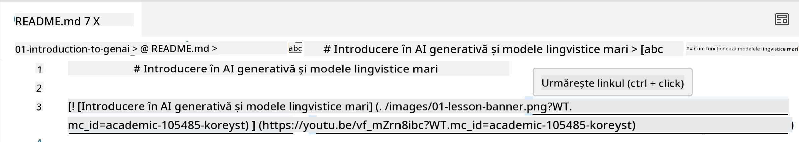
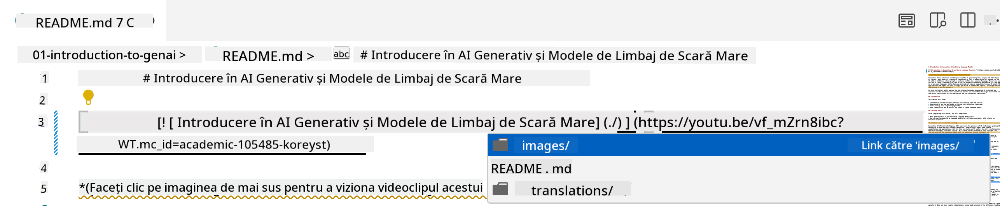
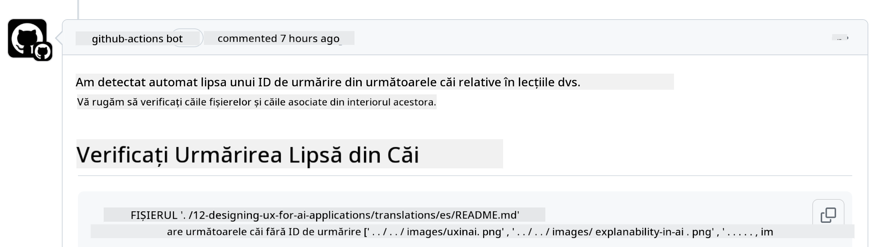
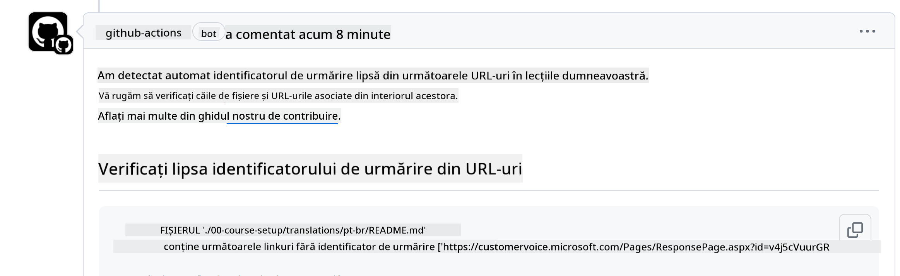
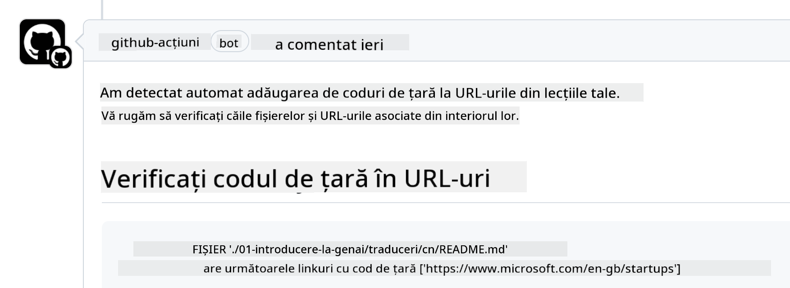

<!--
CO_OP_TRANSLATOR_METADATA:
{
  "original_hash": "57c41f2af71001a2cff9d8eb797cb843",
  "translation_date": "2025-06-25T07:19:30+00:00",
  "source_file": "CONTRIBUTING.md",
  "language_code": "ro"
}
-->
# Contribuții

Acest proiect acceptă contribuții și sugestii. Majoritatea contribuțiilor necesită să fiți de acord cu un Acord de Licență pentru Contribuitori (CLA) care declară că aveți dreptul și acordați efectiv drepturile de a ne folosi contribuția. Pentru detalii, vizitați <https://cla.microsoft.com>.

> Important: când traduceți textul în acest depozit, asigurați-vă că nu folosiți traducerea automată. Vom verifica traducerile prin comunitate, așa că vă rugăm să vă oferiți voluntar doar pentru traduceri în limbile în care sunteți competenți.

Când trimiteți un pull request, un bot CLA va determina automat dacă trebuie să furnizați un CLA și va decora PR-ul corespunzător (de exemplu, etichetă, comentariu). Urmați pur și simplu instrucțiunile furnizate de bot. Va trebui să faceți acest lucru o singură dată pentru toate depozitele care folosesc CLA-ul nostru.

## Cod de Conduită

Acest proiect a adoptat [Codul de Conduită Microsoft pentru Open Source](https://opensource.microsoft.com/codeofconduct/?WT.mc_id=academic-105485-koreyst). Pentru mai multe informații, citiți [Întrebări frecvente despre Codul de Conduită](https://opensource.microsoft.com/codeofconduct/faq/?WT.mc_id=academic-105485-koreyst) sau contactați [opencode@microsoft.com](mailto:opencode@microsoft.com) pentru întrebări sau comentarii suplimentare.

## Întrebări sau Probleme?

Vă rugăm să nu deschideți probleme GitHub pentru întrebări generale de suport, deoarece lista GitHub ar trebui folosită pentru cereri de funcții și rapoarte de erori. În acest fel, putem urmări mai ușor problemele sau erorile reale din cod și să păstrăm discuția generală separată de codul propriu-zis.

## Greșeli de tipar, Probleme, Erori și contribuții

Ori de câte ori trimiteți modificări la depozitul Generative AI for Beginners, vă rugăm să urmați aceste recomandări.

* Întotdeauna bifurcați depozitul în propriul cont înainte de a face modificările
* Nu combinați mai multe modificări într-un singur pull request. De exemplu, trimiteți orice remediere de eroare și actualizări de documentație folosind PR-uri separate
* Dacă pull request-ul dvs. arată conflicte de îmbinare, asigurați-vă că actualizați localul principal pentru a fi o oglindă a ceea ce este în depozitul principal înainte de a face modificările
* Dacă trimiteți o traducere, vă rugăm să creați un singur PR pentru toate fișierele traduse, deoarece nu acceptăm traduceri parțiale pentru conținut
* Dacă trimiteți o corectură de tipar sau de documentație, puteți combina modificările într-un singur PR acolo unde este adecvat

## Ghid General pentru scriere

- Asigurați-vă că toate URL-urile sunt încadrate între paranteze pătrate urmate de o paranteză fără spații suplimentare în jurul lor sau în interiorul lor ``.
- Asigurați-vă că orice link relativ (adică linkuri către alte fișiere și foldere din depozit) începe cu un `./` referindu-se la un fișier sau un folder aflat în directorul de lucru curent sau un `../` referindu-se la un fișier sau un folder aflat într-un director de lucru părinte.
- Asigurați-vă că orice link relativ (adică linkuri către alte fișiere și foldere din depozit) are un ID de urmărire (adică `?` sau `&` apoi `wt.mc_id=` sau `WT.mc_id=`) la sfârșitul său.
- Asigurați-vă că orice URL din următoarele domenii _github.com, microsoft.com, visualstudio.com, aka.ms și azure.com_ are un ID de urmărire (adică `?` sau `&` apoi `wt.mc_id=` sau `WT.mc_id=`) la sfârșitul său.
- Asigurați-vă că linkurile dvs. nu au localizare specifică țării în ele (adică `/en-us/` sau `/en/`).
- Asigurați-vă că toate imaginile sunt stocate în folderul `./images`.
- Asigurați-vă că imaginile au nume descriptive folosind caractere englezești, numere și cratime în numele imaginii dvs.

## Fluxuri de lucru GitHub

Când trimiteți un pull request, patru fluxuri de lucru diferite vor fi declanșate pentru a valida regulile anterioare. Urmați pur și simplu instrucțiunile enumerate aici pentru a trece verificările fluxului de lucru.

- [Verificați Căile Relative Rupte](../..)
- [Verificați Căile Care Au Urmărire](../..)
- [Verificați URL-urile Care Au Urmărire](../..)
- [Verificați URL-urile Care Nu Au Localizare](../..)

### Verificați Căile Relative Rupte

Acest flux de lucru asigură că orice cale relativă din fișierele dvs. funcționează. Acest depozit este implementat pe paginile GitHub, așa că trebuie să fiți foarte atenți când tastați linkurile care leagă totul pentru a nu direcționa pe nimeni în locul greșit.

Pentru a vă asigura că linkurile dvs. funcționează corect, utilizați pur și simplu VS code pentru a verifica acest lucru.

De exemplu, când treceți cu mouse-ul peste orice link din fișierele dvs., vi se va solicita să urmați linkul apăsând pe **ctrl + click**

Dacă faceți clic pe un link și nu funcționează local, atunci cu siguranță va declanșa fluxul de lucru și nu va funcționa pe GitHub.

Pentru a rezolva această problemă, încercați să tastați linkul cu ajutorul VS code.

Când tastați `./` sau `../`, VS code vă va solicita să alegeți din opțiunile disponibile conform celor tastate.

Urmați calea făcând clic pe fișierul sau folderul dorit și veți fi siguri că calea dvs. nu este ruptă.

Odată ce adăugați calea relativă corectă, salvați și împingeți modificările, fluxul de lucru va fi declanșat din nou pentru a verifica modificările. Dacă treceți verificarea, sunteți gata să mergeți mai departe.

### Verificați Căile Care Au Urmărire

Acest flux de lucru asigură că orice cale relativă are urmărire în ea. Acest depozit este implementat pe paginile GitHub, așa că trebuie să urmărim mișcarea între diferitele fișiere și foldere.

Pentru a vă asigura că căile dvs. relative au urmărire în ele, verificați pur și simplu pentru următorul text `?wt.mc_id=` la sfârșitul căii. Dacă este adăugat la căile dvs. relative, atunci veți trece această verificare.

Dacă nu, este posibil să primiți următoarea eroare.

Pentru a rezolva această problemă, încercați să deschideți calea fișierului pe care fluxul de lucru l-a evidențiat și adăugați ID-ul de urmărire la sfârșitul căilor relative.

Odată ce adăugați ID-ul de urmărire, salvați și împingeți modificările, fluxul de lucru va fi declanșat din nou pentru a verifica modificările. Dacă treceți verificarea, sunteți gata să mergeți mai departe.

### Verificați URL-urile Care Au Urmărire

Acest flux de lucru asigură că orice URL web are urmărire în el. Acest depozit este disponibil pentru toată lumea, așa că trebuie să vă asigurați că urmăriți accesul pentru a ști de unde provine traficul.

Pentru a vă asigura că URL-urile dvs. au urmărire în ele, verificați pur și simplu pentru următorul text `?wt.mc_id=` la sfârșitul URL-ului. Dacă este adăugat la URL-urile dvs., atunci veți trece această verificare.

Dacă nu, este posibil să primiți următoarea eroare.

Pentru a rezolva această problemă, încercați să deschideți calea fișierului pe care fluxul de lucru l-a evidențiat și adăugați ID-ul de urmărire la sfârșitul URL-urilor.

Odată ce adăugați ID-ul de urmărire, salvați și împingeți modificările, fluxul de lucru va fi declanșat din nou pentru a verifica modificările. Dacă treceți verificarea, sunteți gata să mergeți mai departe.

### Verificați URL-urile Care Nu Au Localizare

Acest flux de lucru asigură că orice URL web nu are localizare specifică țării în el. Acest depozit este disponibil pentru toată lumea din întreaga lume, așa că trebuie să vă asigurați că nu includeți localizarea țării dvs. în URL-uri.

Pentru a vă asigura că URL-urile dvs. nu au localizare specifică țării în ele, verificați pur și simplu pentru următorul text `/en-us/` sau `/en/` sau orice altă localizare de limbă oriunde în URL. Dacă nu este prezent în URL-urile dvs., atunci veți trece această verificare.

Dacă nu, este posibil să primiți următoarea eroare.

Pentru a rezolva această problemă, încercați să deschideți calea fișierului pe care fluxul de lucru l-a evidențiat și eliminați localizarea țării din URL-uri.

Odată ce eliminați localizarea țării, salvați și împingeți modificările, fluxul de lucru va fi declanșat din nou pentru a verifica modificările. Dacă treceți verificarea, sunteți gata să mergeți mai departe.

Felicitări! Vă vom contacta cât mai curând posibil cu feedback despre contribuția dvs.

**Declinare de responsabilitate**:  
Acest document a fost tradus folosind serviciul de traducere AI [Co-op Translator](https://github.com/Azure/co-op-translator). Deși ne străduim să obținem acuratețea, vă rugăm să fiți conștienți că traducerile automate pot conține erori sau inexactități. Documentul original în limba sa nativă ar trebui să fie considerat sursa autoritară. Pentru informații critice, se recomandă traducerea profesională umană. Nu suntem responsabili pentru niciun fel de neînțelegeri sau interpretări greșite care pot apărea din utilizarea acestei traduceri.