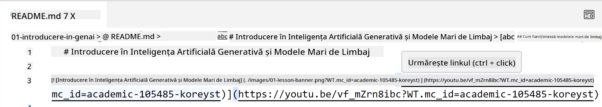
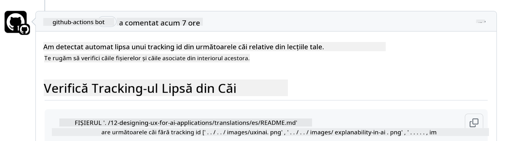
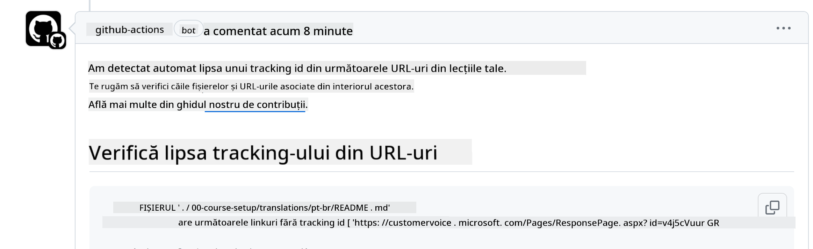

<!--
CO_OP_TRANSLATOR_METADATA:
{
  "original_hash": "57c41f2af71001a2cff9d8eb797cb843",
  "translation_date": "2025-07-09T06:12:29+00:00",
  "source_file": "CONTRIBUTING.md",
  "language_code": "ro"
}
-->
# Contribuții

Acest proiect primește cu plăcere contribuții și sugestii. Majoritatea contribuțiilor necesită să
fii de acord cu un Acord de Licență pentru Contribuitori (CLA) prin care declari că ai dreptul,
și chiar acorzi, drepturile de a folosi contribuția ta. Pentru detalii, vizitează
<https://cla.microsoft.com>.

> Important: când traduci text în acest depozit, te rugăm să te asiguri că nu folosești traducere automată. Vom verifica traducerile prin comunitate, așa că te rugăm să te oferi voluntar doar pentru traduceri în limbile în care ești fluent.

Când trimiți o cerere de pull, un bot CLA va determina automat dacă trebuie
să furnizezi un CLA și va marca PR-ul corespunzător (de exemplu, etichetă, comentariu). Urmează pur și simplu
instrucțiunile oferite de bot. Va trebui să faci acest lucru o singură dată pentru toate depozitele care folosesc CLA-ul nostru.

## Codul de conduită

Acest proiect a adoptat [Microsoft Open Source Code of Conduct](https://opensource.microsoft.com/codeofconduct/?WT.mc_id=academic-105485-koreyst).
Pentru mai multe informații, citește [Code of Conduct FAQ](https://opensource.microsoft.com/codeofconduct/faq/?WT.mc_id=academic-105485-koreyst) sau contactează [opencode@microsoft.com](mailto:opencode@microsoft.com) pentru întrebări sau comentarii suplimentare.

## Întrebări sau probleme?

Te rugăm să nu deschizi probleme pe GitHub pentru întrebări generale de suport, deoarece lista GitHub ar trebui folosită pentru cereri de funcționalități și raportări de erori. Astfel putem urmări mai ușor problemele reale sau bug-urile din cod și păstrăm discuțiile generale separate de codul propriu-zis.

## Greșeli de scriere, probleme, bug-uri și contribuții

Ori de câte ori trimiți modificări în depozitul Generative AI for Beginners, te rugăm să urmezi aceste recomandări.

* Întotdeauna fă fork la depozit în contul tău înainte de a face modificările
* Nu combina mai multe modificări într-o singură cerere de pull. De exemplu, trimite corecturi de bug-uri și actualizări de documentație în PR-uri separate
* Dacă cererea ta de pull arată conflicte de îmbinare, asigură-te că actualizezi ramura locală main pentru a reflecta conținutul ramurii main din depozitul principal înainte de a face modificările
* Dacă trimiți o traducere, te rugăm să creezi o singură cerere de pull pentru toate fișierele traduse, deoarece nu acceptăm traduceri parțiale pentru conținut
* Dacă trimiți o corectură de greșeli de scriere sau documentație, poți combina modificările într-un singur PR, acolo unde este potrivit

## Ghid general pentru scriere

- Asigură-te că toate URL-urile tale sunt încadrate în paranteze drepte urmate de paranteze rotunde, fără spații suplimentare în jur sau în interior ``.
- Asigură-te că orice link relativ (adică linkuri către alte fișiere și foldere din depozit) începe cu `./` referindu-se la un fișier sau folder din directorul curent de lucru sau cu `../` referindu-se la un fișier sau folder dintr-un director părinte.
- Asigură-te că orice link relativ are un ID de urmărire (adică `?` sau `&` urmat de `wt.mc_id=` sau `WT.mc_id=`) la final.
- Asigură-te că orice URL din următoarele domenii _github.com, microsoft.com, visualstudio.com, aka.ms, și azure.com_ are un ID de urmărire (adică `?` sau `&` urmat de `wt.mc_id=` sau `WT.mc_id=`) la final.
- Asigură-te că linkurile tale nu conțin locale specifice unei țări (de exemplu `/en-us/` sau `/en/`).
- Asigură-te că toate imaginile sunt stocate în folderul `./images`.
- Asigură-te că imaginile au nume descriptive folosind caractere englezești, cifre și cratime în numele imaginii.

## Fluxuri de lucru GitHub

Când trimiți o cerere de pull, patru fluxuri de lucru diferite vor fi declanșate pentru a valida regulile de mai sus.
Urmează pur și simplu instrucțiunile listate aici pentru a trece verificările fluxului de lucru.

- [Verifică căile relative rupte](../..)
- [Verifică căile au urmărire](../..)
- [Verifică URL-urile au urmărire](../..)
- [Verifică URL-urile nu au locale](../..)

### Verifică căile relative rupte

Acest flux de lucru se asigură că orice cale relativă din fișierele tale funcționează.
Acest depozit este publicat pe GitHub pages, așa că trebuie să fii foarte atent când tastezi linkurile care leagă totul pentru a nu direcționa pe nimeni în locul greșit.

Pentru a te asigura că linkurile tale funcționează corect, folosește VS Code pentru a verifica.

De exemplu, când treci cursorul peste orice link din fișierele tale, vei primi opțiunea de a urma linkul apăsând **ctrl + click**

Dacă dai click pe un link și nu funcționează local, cu siguranță va declanșa fluxul de lucru și nu va funcționa pe GitHub.

Pentru a rezolva această problemă, încearcă să tastezi linkul cu ajutorul VS Code.

Când tastezi `./` sau `../`, VS Code îți va sugera opțiuni disponibile în funcție de ce ai tastat.

Urmează calea făcând click pe fișierul sau folderul dorit și vei fi sigur că calea ta nu este ruptă.

Odată ce adaugi calea relativă corectă, salvează și împinge modificările, fluxul de lucru va fi declanșat din nou pentru a verifica modificările.
Dacă treci verificarea, ești gata să continui.

### Verifică căile au urmărire

Acest flux de lucru se asigură că orice cale relativă are urmărire în ea.
Acest depozit este publicat pe GitHub pages, așa că trebuie să urmărim mișcarea între diferitele fișiere și foldere.

Pentru a te asigura că căile tale relative au urmărire, verifică dacă la finalul căii apare textul `?wt.mc_id=`.
Dacă este adăugat la căile tale relative, vei trece această verificare.

Dacă nu, poți primi următoarea eroare.

Pentru a rezolva această problemă, deschide calea fișierului evidențiată de fluxul de lucru și adaugă ID-ul de urmărire la finalul căilor relative.

Odată ce adaugi ID-ul de urmărire, salvează și împinge modificările, fluxul de lucru va fi declanșat din nou pentru a verifica modificările.
Dacă treci verificarea, ești gata să continui.

### Verifică URL-urile au urmărire

Acest flux de lucru se asigură că orice URL web are urmărire în el.
Acest depozit este disponibil pentru toată lumea, așa că trebuie să te asiguri că urmărim accesul pentru a ști de unde vine traficul.

Pentru a te asigura că URL-urile tale au urmărire, verifică dacă la finalul URL-ului apare textul `?wt.mc_id=`.
Dacă este adăugat la URL-urile tale, vei trece această verificare.

Dacă nu, poți primi următoarea eroare.

Pentru a rezolva această problemă, deschide calea fișierului evidențiată de fluxul de lucru și adaugă ID-ul de urmărire la finalul URL-urilor.

Odată ce adaugi ID-ul de urmărire, salvează și împinge modificările, fluxul de lucru va fi declanșat din nou pentru a verifica modificările.
Dacă treci verificarea, ești gata să continui.

### Verifică URL-urile nu au locale

Acest flux de lucru se asigură că orice URL web nu conține locale specifice unei țări.
Acest depozit este disponibil pentru toată lumea din întreaga lume, așa că trebuie să te asiguri să nu incluzi localele țării tale în URL-uri.

Pentru a te asigura că URL-urile tale nu conțin locale de țară, verifică dacă în URL apare textul `/en-us/` sau `/en/` sau orice altă localizare de limbă.
Dacă nu este prezent în URL-urile tale, vei trece această verificare.

Dacă nu, poți primi următoarea eroare.

Pentru a rezolva această problemă, deschide calea fișierului evidențiată de fluxul de lucru și elimină localizarea țării din URL-uri.

Odată ce elimini localizarea țării, salvează și împinge modificările, fluxul de lucru va fi declanșat din nou pentru a verifica modificările.
Dacă treci verificarea, ești gata să continui.

Felicitări! Îți vom răspunde cât mai curând posibil cu feedback despre contribuția ta.

**Declinare de responsabilitate**:  
Acest document a fost tradus folosind serviciul de traducere AI [Co-op Translator](https://github.com/Azure/co-op-translator). Deși ne străduim pentru acuratețe, vă rugăm să rețineți că traducerile automate pot conține erori sau inexactități. Documentul original în limba sa nativă trebuie considerat sursa autorizată. Pentru informații critice, se recomandă traducerea profesională realizată de un specialist uman. Nu ne asumăm răspunderea pentru eventualele neînțelegeri sau interpretări greșite rezultate din utilizarea acestei traduceri.