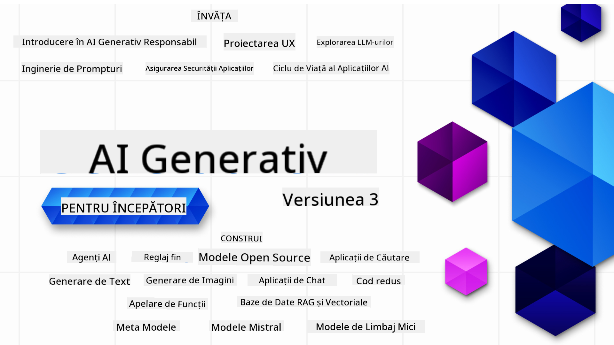

<!--
CO_OP_TRANSLATOR_METADATA:
{
  "original_hash": "ca2afa136ed9aca0634f39f51239746e",
  "translation_date": "2025-08-27T08:55:11+00:00",
  "source_file": "README.md",
  "language_code": "ro"
}
-->

### 21 Lecții care te învață tot ce trebuie să știi pentru a începe să construiești aplicații de Inteligență Artificială Generativă

### 🌐 Suport Multi-Limbă

#### Suportat prin GitHub Action (Automat & Întotdeauna Actualizat)

[Franceză](../fr/README.md) | [Spaniolă](../es/README.md) | [Germană](../de/README.md) | [Rusă](../ru/README.md) | [Arabă](../ar/README.md) | [Persană (Farsi)](../fa/README.md) | [Urdu](../ur/README.md) | [Chineză (Simplificată)](../zh/README.md) | [Chineză (Tradițională, Macau)](../mo/README.md) | [Chineză (Tradițională, Hong Kong)](../hk/README.md) | [Chineză (Tradițională, Taiwan)](../tw/README.md) | [Japoneză](../ja/README.md) | [Coreeană](../ko/README.md) | [Hindi](../hi/README.md) | [Bengaleză](../bn/README.md) | [Marathi](../mr/README.md) | [Nepaleză](../ne/README.md) | [Punjabi (Gurmukhi)](../pa/README.md) | [Portugheză (Portugalia)](../pt/README.md) | [Portugheză (Brazilia)](../br/README.md) | [Italiană](../it/README.md) | [Lituaniană](../lt/README.md) | [Poloneză](../pl/README.md) | [Turcă](../tr/README.md) | [Greacă](../el/README.md) | [Thailandeză](../th/README.md) | [Suedeză](../sv/README.md) | [Daneză](../da/README.md) | [Norvegiană](../no/README.md) | [Finlandeză](../fi/README.md) | [Olandeză](../nl/README.md) | [Ebraică](../he/README.md) | [Vietnameză](../vi/README.md) | [Indoneziană](../id/README.md) | [Malayeză](../ms/README.md) | [Tagalog (Filipineză)](../tl/README.md) | [Swahili](../sw/README.md) | [Maghiară](../hu/README.md) | [Cehă](../cs/README.md) | [Slovacă](../sk/README.md) | [Română](./README.md) | [Bulgară](../bg/README.md) | [Sârbă (Chirilică)](../sr/README.md) | [Croată](../hr/README.md) | [Slovenă](../sl/README.md) | [Ucraineană](../uk/README.md) | [Birmaneză (Myanmar)](../my/README.md)

# Inteligență Artificială Generativă pentru Începători (Versiunea 3) - Un Curs

Învață fundamentele construirii aplicațiilor de Inteligență Artificială Generativă cu cursul nostru cuprinzător de 21 de lecții oferit de Microsoft Cloud Advocates.

## 🌱 Începe

Acest curs conține 21 de lecții. Fiecare lecție acoperă un subiect distinct, așa că poți începe de unde dorești!

Lecțiile sunt etichetate fie ca lecții "Learn" care explică un concept de Inteligență Artificială Generativă, fie ca lecții "Build" care explică un concept și oferă exemple de cod în **Python** și **TypeScript**, atunci când este posibil.

Pentru dezvoltatorii .NET, verifică [Inteligență Artificială Generativă pentru Începători (.NET Edition)](https://github.com/microsoft/Generative-AI-for-beginners-dotnet?WT.mc_id=academic-105485-koreyst)!

Fiecare lecție include și o secțiune "Keep Learning" cu resurse suplimentare pentru învățare.

## Ce Ai Nevoie
### Pentru a rula codul acestui curs, poți folosi fie:
 - [Azure OpenAI Service](https://aka.ms/genai-beginners/azure-open-ai?WT.mc_id=academic-105485-koreyst) - **Lecții:** "aoai-assignment"
 - [GitHub Marketplace Model Catalog](https://aka.ms/genai-beginners/gh-models?WT.mc_id=academic-105485-koreyst) - **Lecții:** "githubmodels"
 - [OpenAI API](https://aka.ms/genai-beginners/open-ai?WT.mc_id=academic-105485-koreyst) - **Lecții:** "oai-assignment" 

- Cunoștințe de bază de Python sau TypeScript sunt utile - \*Pentru începători absoluti, verifică aceste cursuri de [Python](https://aka.ms/genai-beginners/python?WT.mc_id=academic-105485-koreyst) și [TypeScript](https://aka.ms/genai-beginners/typescript?WT.mc_id=academic-105485-koreyst)
- Un cont GitHub pentru a [fork-ui acest întreg repo](https://aka.ms/genai-beginners/github?WT.mc_id=academic-105485-koreyst) în propriul tău cont GitHub

Am creat o lecție **[Course Setup](./00-course-setup/README.md?WT.mc_id=academic-105485-koreyst)** pentru a te ajuta să îți configurezi mediul de dezvoltare.

Nu uita să [adaugi o stea (🌟) acestui repo](https://docs.github.com/en/get-started/exploring-projects-on-github/saving-repositories-with-stars?WT.mc_id=academic-105485-koreyst) pentru a-l găsi mai ușor mai târziu.

## 🧠 Gata de Implementare?

Dacă ești în căutarea unor exemple de cod mai avansate, verifică [colecția noastră de Exemple de Cod pentru Inteligență Artificială Generativă](https://aka.ms/genai-beg-code?WT.mc_id=academic-105485-koreyst) în **Python** și **TypeScript**.

## 🗣️ Întâlnește Alți Cursanți, Obține Suport

Alătură-te [serverului nostru oficial Azure AI Foundry pe Discord](https://aka.ms/genai-discord?WT.mc_id=academic-105485-koreyst) pentru a întâlni și a face networking cu alți cursanți care urmează acest curs și pentru a obține suport.

Pune întrebări sau împărtășește feedback despre produs în [Forum-ul Dezvoltatorilor Azure AI Foundry](https://aka.ms/azureaifoundry/forum) pe Github.

## 🚀 Construiești un Startup?

Vizitează [Microsoft for Startups](https://www.microsoft.com/startups) pentru a afla cum să începi să construiești cu credite Azure astăzi.

## 🙏 Vrei să ajuți?

Ai sugestii sau ai găsit greșeli de ortografie sau cod? [Deschide o problemă](https://github.com/microsoft/generative-ai-for-beginners/issues?WT.mc_id=academic-105485-koreyst) sau [Creează un pull request](https://github.com/microsoft/generative-ai-for-beginners/pulls?WT.mc_id=academic-105485-koreyst)

## 📂 Fiecare lecție include:

- O scurtă introducere video a subiectului
- O lecție scrisă localizată în README
- Exemple de cod în Python și TypeScript care suportă Azure OpenAI și OpenAI API
- Linkuri către resurse suplimentare pentru a continua învățarea

## 🗃️ Lecții

| #   | **Link Lecție**                                                                                                                              | **Descriere**                                                                                 | **Video**                                                                   | **Învățare Suplimentară**                                                      |
| --- | -------------------------------------------------------------------------------------------------------------------------------------------- | --------------------------------------------------------------------------------------------- | --------------------------------------------------------------------------- | ------------------------------------------------------------------------------ |
| 00  | [Course Setup](./00-course-setup/README.md?WT.mc_id=academic-105485-koreyst)                                                                 | **Learn:** Cum să îți configurezi mediul de dezvoltare                                        | Video În Curând                                                              | [Află Mai Multe](https://aka.ms/genai-collection?WT.mc_id=academic-105485-koreyst) |
| 01  | [Introducere în Inteligența Artificială Generativă și LLM-uri](./01-introduction-to-genai/README.md?WT.mc_id=academic-105485-koreyst)         | **Learn:** Înțelegerea a ceea ce este Inteligența Artificială Generativă și cum funcționează LLM-urile. | [Video](https://aka.ms/gen-ai-lesson-1-gh?WT.mc_id=academic-105485-koreyst) | [Află Mai Multe](https://aka.ms/genai-collection?WT.mc_id=academic-105485-koreyst) |
| 02  | [Explorarea și compararea diferitelor LLM-uri](./02-exploring-and-comparing-different-llms/README.md?WT.mc_id=academic-105485-koreyst)        | **Learn:** Cum să alegi modelul potrivit pentru cazul tău de utilizare                        | [Video](https://aka.ms/gen-ai-lesson2-gh?WT.mc_id=academic-105485-koreyst)  | [Află Mai Multe](https://aka.ms/genai-collection?WT.mc_id=academic-105485-koreyst) |
| 03  | [Utilizarea Responsabilă a Inteligenței Artificiale Generative](./03-using-generative-ai-responsibly/README.md?WT.mc_id=academic-105485-koreyst) | **Learn:** Cum să construiești aplicații de Inteligență Artificială Generativă în mod responsabil | [Video](https://aka.ms/gen-ai-lesson3-gh?WT.mc_id=academic-105485-koreyst)  | [Află Mai Multe](https://aka.ms/genai-collection?WT.mc_id=academic-105485-koreyst) |
| 04  | [Înțelegerea Bazelor Ingineriei Prompturilor](./04-prompt-engineering-fundamentals/README.md?WT.mc_id=academic-105485-koreyst)                | **Learn:** Practici de bază pentru Ingineria Prompturilor                                     | [Video](https://aka.ms/gen-ai-lesson4-gh?WT.mc_id=academic-105485-koreyst)  | [Află Mai Multe](https://aka.ms/genai-collection?WT.mc_id=academic-105485-koreyst) |
| 05  | [Crearea Prompturilor Avansate](./05-advanced-prompts/README.md?WT.mc_id=academic-105485-koreyst)                                             | **Learn:** Cum să aplici tehnici de inginerie a prompturilor care îmbunătățesc rezultatele.   | [Video](https://aka.ms/gen-ai-lesson5-gh?WT.mc_id=academic-105485-koreyst)  | [Află Mai Multe](https://aka.ms/genai-collection?WT.mc_id=academic-105485-koreyst) |
| 06  | [Construirea aplicațiilor de generare de text](./06-text-generation-apps/README.md?WT.mc_id=academic-105485-koreyst)                                | **Construiește:** O aplicație de generare de text folosind Azure OpenAI / OpenAI API                                | [Video](https://aka.ms/gen-ai-lesson6-gh?WT.mc_id=academic-105485-koreyst)  | [Află mai multe](https://aka.ms/genai-collection?WT.mc_id=academic-105485-koreyst) |
| 07  | [Construirea aplicațiilor de chat](./07-building-chat-applications/README.md?WT.mc_id=academic-105485-koreyst)                                     | **Construiește:** Tehnici pentru a construi și integra eficient aplicații de chat.               | [Video](https://aka.ms/gen-ai-lessons7-gh?WT.mc_id=academic-105485-koreyst) | [Află mai multe](https://aka.ms/genai-collection?WT.mc_id=academic-105485-koreyst) |
| 08  | [Construirea aplicațiilor de căutare cu baze de date vectoriale](./08-building-search-applications/README.md?WT.mc_id=academic-105485-koreyst)                        | **Construiește:** O aplicație de căutare care utilizează Embeddings pentru a căuta date.                        | [Video](https://aka.ms/gen-ai-lesson8-gh?WT.mc_id=academic-105485-koreyst)  | [Află mai multe](https://aka.ms/genai-collection?WT.mc_id=academic-105485-koreyst) |
| 09  | [Construirea aplicațiilor de generare de imagini](./09-building-image-applications/README.md?WT.mc_id=academic-105485-koreyst)                        | **Construiește:** O aplicație de generare de imagini                                                       | [Video](https://aka.ms/gen-ai-lesson9-gh?WT.mc_id=academic-105485-koreyst)  | [Află mai multe](https://aka.ms/genai-collection?WT.mc_id=academic-105485-koreyst) |
| 10  | [Construirea aplicațiilor AI cu cod redus](./10-building-low-code-ai-applications/README.md?WT.mc_id=academic-105485-koreyst)                       | **Construiește:** O aplicație Generative AI folosind instrumente cu cod redus                                     | [Video](https://aka.ms/gen-ai-lesson10-gh?WT.mc_id=academic-105485-koreyst) | [Află mai multe](https://aka.ms/genai-collection?WT.mc_id=academic-105485-koreyst) |
| 11  | [Integrarea aplicațiilor externe cu apelarea funcțiilor](./11-integrating-with-function-calling/README.md?WT.mc_id=academic-105485-koreyst) | **Construiește:** Ce este apelarea funcțiilor și cazurile sale de utilizare pentru aplicații                          | [Video](https://aka.ms/gen-ai-lesson11-gh?WT.mc_id=academic-105485-koreyst) | [Află mai multe](https://aka.ms/genai-collection?WT.mc_id=academic-105485-koreyst) |
| 12  | [Proiectarea UX pentru aplicații AI](./12-designing-ux-for-ai-applications/README.md?WT.mc_id=academic-105485-koreyst)                         | **Învață:** Cum să aplici principiile de design UX atunci când dezvolți aplicații Generative AI         | [Video](https://aka.ms/gen-ai-lesson12-gh?WT.mc_id=academic-105485-koreyst) | [Află mai multe](https://aka.ms/genai-collection?WT.mc_id=academic-105485-koreyst) |
| 13  | [Securizarea aplicațiilor tale Generative AI](./13-securing-ai-applications/README.md?WT.mc_id=academic-105485-koreyst)                         | **Învață:** Amenințările și riscurile pentru sistemele AI și metodele de a securiza aceste sisteme.             | [Video](https://aka.ms/gen-ai-lesson13-gh?WT.mc_id=academic-105485-koreyst) | [Află mai multe](https://aka.ms/genai-collection?WT.mc_id=academic-105485-koreyst) |
| 14  | [Ciclul de viață al aplicațiilor Generative AI](./14-the-generative-ai-application-lifecycle/README.md?WT.mc_id=academic-105485-koreyst)           | **Învață:** Instrumentele și metricile pentru a gestiona ciclul de viață al LLM și LLMOps                         | [Video](https://aka.ms/gen-ai-lesson14-gh?WT.mc_id=academic-105485-koreyst) | [Află mai multe](https://aka.ms/genai-collection?WT.mc_id=academic-105485-koreyst) |
| 15  | [Generare augmentată prin regăsire (RAG) și baze de date vectoriale](./15-rag-and-vector-databases/README.md?WT.mc_id=academic-105485-koreyst)        | **Construiește:** O aplicație folosind un cadru RAG pentru a regăsi embeddings dintr-o bază de date vectorială  | [Video](https://aka.ms/gen-ai-lesson15-gh?WT.mc_id=academic-105485-koreyst) | [Află mai multe](https://aka.ms/genai-collection?WT.mc_id=academic-105485-koreyst) |
| 16  | [Modele open source și Hugging Face](./16-open-source-models/README.md?WT.mc_id=academic-105485-koreyst)                                    | **Construiește:** O aplicație folosind modele open source disponibile pe Hugging Face                    | [Video](https://aka.ms/gen-ai-lesson16-gh?WT.mc_id=academic-105485-koreyst) | [Află mai multe](https://aka.ms/genai-collection?WT.mc_id=academic-105485-koreyst) |
| 17  | [Agenți AI](./17-ai-agents/README.md?WT.mc_id=academic-105485-koreyst)                                                                       | **Construiește:** O aplicație folosind un cadru de agenți AI                                           | [Video](https://aka.ms/gen-ai-lesson17-gh?WT.mc_id=academic-105485-koreyst) | [Află mai multe](https://aka.ms/genai-collection?WT.mc_id=academic-105485-koreyst) |
| 18  | [Ajustarea fină a LLM-urilor](./18-fine-tuning/README.md?WT.mc_id=academic-105485-koreyst)                                                              | **Învață:** Ce, de ce și cum să ajustezi fin LLM-urile                                            | [Video](https://aka.ms/gen-ai-lesson18-gh?WT.mc_id=academic-105485-koreyst) | [Află mai multe](https://aka.ms/genai-collection?WT.mc_id=academic-105485-koreyst) |
| 19  | [Construirea cu SLM-uri](./19-slm/README.md?WT.mc_id=academic-105485-koreyst)                                                              | **Învață:** Beneficiile construirii cu modele de limbaj mici                                            | Video în curând | [Află mai multe](https://aka.ms/genai-collection?WT.mc_id=academic-105485-koreyst) |
| 20  | [Construirea cu modele Mistral](./20-mistral/README.md?WT.mc_id=academic-105485-koreyst)                                                              | **Învață:** Caracteristicile și diferențele modelelor din familia Mistral                                           | Video în curând | [Află mai multe](https://aka.ms/genai-collection?WT.mc_id=academic-105485-koreyst) |
| 21  | [Construirea cu modele Meta](./21-meta/README.md?WT.mc_id=academic-105485-koreyst)                                                              | **Învață:** Caracteristicile și diferențele modelelor din familia Meta                                           | Video în curând | [Află mai multe](https://aka.ms/genai-collection?WT.mc_id=academic-105485-koreyst) |

### 🌟 Mulțumiri speciale

Mulțumiri speciale lui [**John Aziz**](https://www.linkedin.com/in/john0isaac/) pentru crearea tuturor acțiunilor și fluxurilor de lucru GitHub.

[**Bernhard Merkle**](https://www.linkedin.com/in/bernhard-merkle-738b73/) pentru contribuțiile cheie aduse fiecărei lecții pentru a îmbunătăți experiența de învățare și cod.

## 🎒 Alte cursuri

Echipa noastră produce și alte cursuri! Verifică:

- [**NOU** Protocolul de Context al Modelului pentru Începători](https://github.com/microsoft/mcp-for-beginners)
- [Agenți AI pentru Începători](https://github.com/microsoft/ai-agents-for-beginners)
- [Generative AI pentru Începători folosind .NET](https://github.com/microsoft/Generative-AI-for-beginners-dotnet)
- [Generative AI pentru Începători folosind JavaScript](https://aka.ms/genai-js-course)
- [Generative AI pentru Începători folosind Java](https://aka.ms/genaijava)
- [ML pentru Începători](https://aka.ms/ml-beginners)
- [Știința Datelor pentru Începători](https://aka.ms/datascience-beginners)
- [AI pentru Începători](https://aka.ms/ai-beginners)
- [Securitate cibernetică pentru Începători](https://github.com/microsoft/Security-101)
- [Dezvoltare Web pentru Începători](https://aka.ms/webdev-beginners)
- [IoT pentru Începători](https://aka.ms/iot-beginners)
- [Dezvoltare XR pentru Începători](https://github.com/microsoft/xr-development-for-beginners)
- [Stăpânirea GitHub Copilot pentru Programare în Pereche AI](https://aka.ms/GitHubCopilotAI)
- [Stăpânirea GitHub Copilot pentru Dezvoltatori C#/.NET](https://github.com/microsoft/mastering-github-copilot-for-dotnet-csharp-developers)
- [Alege-ți propria aventură Copilot](https://github.com/microsoft/CopilotAdventures)

---

**Declinarea responsabilității**:  
Acest document a fost tradus folosind serviciul de traducere AI [Co-op Translator](https://github.com/Azure/co-op-translator). Deși depunem eforturi pentru a asigura acuratețea, vă rugăm să rețineți că traducerile automate pot conține erori sau inexactități. Documentul original în limba sa nativă ar trebui considerat sursa autoritară. Pentru informații critice, se recomandă traducerea profesională realizată de un specialist uman. Nu ne asumăm răspunderea pentru eventualele neînțelegeri sau interpretări greșite care pot apărea din utilizarea acestei traduceri.