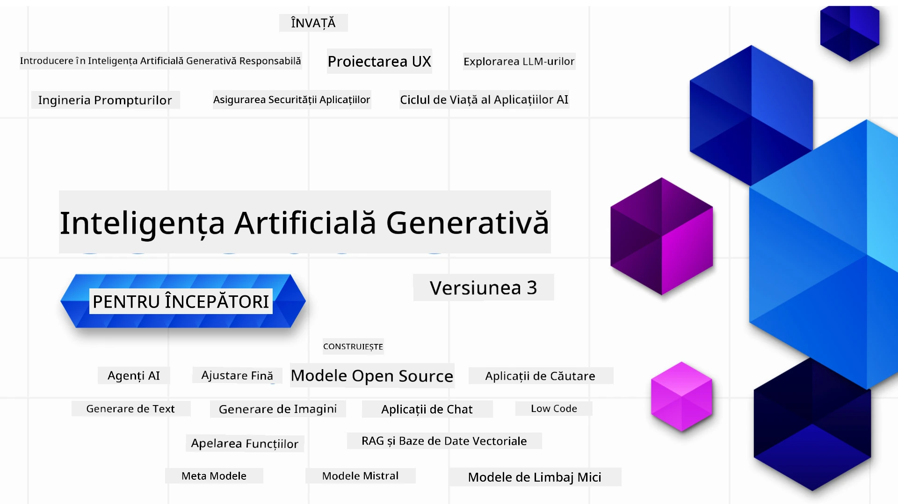

### 21 Lecții care predau tot ce trebuie să știi pentru a începe să construiești aplicații de Inteligență Artificială Generativă

[](https://github.com/microsoft/Generative-AI-For-Beginners/blob/master/LICENSE?WT.mc_id=academic-105485-koreyst)
[](https://GitHub.com/microsoft/Generative-AI-For-Beginners/graphs/contributors/?WT.mc_id=academic-105485-koreyst)
[](https://GitHub.com/microsoft/Generative-AI-For-Beginners/issues/?WT.mc_id=academic-105485-koreyst)
[](https://GitHub.com/microsoft/Generative-AI-For-Beginners/pulls/?WT.mc_id=academic-105485-koreyst)
[](http://makeapullrequest.com?WT.mc_id=academic-105485-koreyst)

[](https://GitHub.com/microsoft/Generative-AI-For-Beginners/watchers/?WT.mc_id=academic-105485-koreyst)
[](https://GitHub.com/microsoft/Generative-AI-For-Beginners/network/?WT.mc_id=academic-105485-koreyst)
[](https://GitHub.com/microsoft/Generative-AI-For-Beginners/stargazers/?WT.mc_id=academic-105485-koreyst)

[](https://discord.gg/nTYy5BXMWG)

### 🌐 Suport Multilingv

#### Suportat prin GitHub Action (Automatizat și Întotdeauna Actualizat)

<!-- CO-OP TRANSLATOR LANGUAGES TABLE START -->
[Arabic](../ar/README.md) | [Bengali](../bn/README.md) | [Bulgarian](../bg/README.md) | [Burmese (Myanmar)](../my/README.md) | [Chinese (Simplified)](../zh-CN/README.md) | [Chinese (Traditional, Hong Kong)](../zh-HK/README.md) | [Chinese (Traditional, Macau)](../zh-MO/README.md) | [Chinese (Traditional, Taiwan)](../zh-TW/README.md) | [Croatian](../hr/README.md) | [Czech](../cs/README.md) | [Danish](../da/README.md) | [Dutch](../nl/README.md) | [Estonian](../et/README.md) | [Finnish](../fi/README.md) | [French](../fr/README.md) | [German](../de/README.md) | [Greek](../el/README.md) | [Hebrew](../he/README.md) | [Hindi](../hi/README.md) | [Hungarian](../hu/README.md) | [Indonesian](../id/README.md) | [Italian](../it/README.md) | [Japanese](../ja/README.md) | [Kannada](../kn/README.md) | [Korean](../ko/README.md) | [Lithuanian](../lt/README.md) | [Malay](../ms/README.md) | [Malayalam](../ml/README.md) | [Marathi](../mr/README.md) | [Nepali](../ne/README.md) | [Nigerian Pidgin](../pcm/README.md) | [Norwegian](../no/README.md) | [Persian (Farsi)](../fa/README.md) | [Polish](../pl/README.md) | [Portuguese (Brazil)](../pt-BR/README.md) | [Portuguese (Portugal)](../pt-PT/README.md) | [Punjabi (Gurmukhi)](../pa/README.md) | [Romanian](./README.md) | [Russian](../ru/README.md) | [Serbian (Cyrillic)](../sr/README.md) | [Slovak](../sk/README.md) | [Slovenian](../sl/README.md) | [Spanish](../es/README.md) | [Swahili](../sw/README.md) | [Swedish](../sv/README.md) | [Tagalog (Filipino)](../tl/README.md) | [Tamil](../ta/README.md) | [Telugu](../te/README.md) | [Thai](../th/README.md) | [Turkish](../tr/README.md) | [Ukrainian](../uk/README.md) | [Urdu](../ur/README.md) | [Vietnamese](../vi/README.md)

> **Preferi să Clonezi Local?**
>
> Acest depozit include traduceri în peste 50 de limbi, ceea ce crește semnificativ dimensiunea descarcării. Pentru a clona fără traduceri, folosește sparse checkout:
>
> **Bash / macOS / Linux:**
> ```bash
> git clone --filter=blob:none --sparse https://github.com/microsoft/generative-ai-for-beginners.git
> cd generative-ai-for-beginners
> git sparse-checkout set --no-cone '/*' '!translations' '!translated_images'
> ```
>
> **CMD (Windows):**
> ```cmd
> git clone --filter=blob:none --sparse https://github.com/microsoft/generative-ai-for-beginners.git
> cd generative-ai-for-beginners
> git sparse-checkout set --no-cone "/*" "!translations" "!translated_images"
> ```
>
> Acest lucru îți oferă tot ce ai nevoie pentru a finaliza cursul cu o descărcare mult mai rapidă.
<!-- CO-OP TRANSLATOR LANGUAGES TABLE END -->

# Inteligență Artificială Generativă pentru Începători (Versiunea 3) - Un Curs

Învață fundamentele construirii aplicațiilor de Inteligență Artificială Generativă cu cursul nostru cuprinzător de 21 de lecții oferit de Microsoft Cloud Advocates.

## 🌱 Începem

Acest curs are 21 de lecții. Fiecare lecție acoperă un subiect propriu, așa că începe de unde dorești!

Lecțiile sunt etichetate fie ca lecții "Learn" care explică un concept de Inteligență Artificială Generativă, fie lecții "Build" care explică un concept și oferă exemple de cod în **Python** și **TypeScript**, când este posibil.

Pentru dezvoltatorii .NET consultați [Inteligența Artificială Generativă pentru Începători (Ediția .NET)](https://github.com/microsoft/Generative-AI-for-beginners-dotnet?WT.mc_id=academic-105485-koreyst)!

Fiecare lecție include, de asemenea, o secțiune "Keep Learning" cu instrumente suplimentare de învățare.

## Ce ai nevoie
### Pentru a rula codul acestui curs, poți folosi fie: 
 - [Azure OpenAI Service](https://aka.ms/genai-beginners/azure-open-ai?WT.mc_id=academic-105485-koreyst) - **Lecții:** "aoai-assignment"
 - [GitHub Marketplace Model Catalog](https://aka.ms/genai-beginners/gh-models?WT.mc_id=academic-105485-koreyst) - **Lecții:** "githubmodels"
 - [OpenAI API](https://aka.ms/genai-beginners/open-ai?WT.mc_id=academic-105485-koreyst) - **Lecții:** "oai-assignment"
   
- Cunoștințe de bază de Python sau TypeScript sunt utile - \*Pentru începători absoluți, vezi aceste cursuri de [Python](https://aka.ms/genai-beginners/python?WT.mc_id=academic-105485-koreyst) și [TypeScript](https://aka.ms/genai-beginners/typescript?WT.mc_id=academic-105485-koreyst)
- Un cont GitHub pentru a [face fork întregului acest depozit](https://aka.ms/genai-beginners/github?WT.mc_id=academic-105485-koreyst) în contul tău GitHub

Am creat o lecție **[Configurarea Cursului](./00-course-setup/README.md?WT.mc_id=academic-105485-koreyst)** pentru a te ajuta să îți configurezi mediul de dezvoltare.

Nu uita să [pui o stea (🌟) acestui depozit](https://docs.github.com/en/get-started/exploring-projects-on-github/saving-repositories-with-stars?WT.mc_id=academic-105485-koreyst) pentru a-l găsi mai ușor mai târziu.

## 🧠 Gata să lansezi?

Dacă cauți exemple de cod mai avansate, vezi colecția noastră de [Exemple de Cod Inteligență Artificială Generativă](https://aka.ms/genai-beg-code?WT.mc_id=academic-105485-koreyst) în ambele limbaje **Python** și **TypeScript**.

## 🗣️ Întâlnește alți cursanți, obține suport

Alătură-te serverului nostru oficial de Discord Azure AI Foundry [aici](https://aka.ms/genai-discord?WT.mc_id=academic-105485-koreyst) pentru a întâlni și a face networking cu alți cursanți care urmează acest curs și pentru a obține suport.

Pune întrebări sau împărtășește feedback despre produs în [Forum-ul dezvoltatorilor Azure AI Foundry](https://aka.ms/azureaifoundry/forum) pe Github.

## 🚀 Construiești o startup?

Vizitează [Microsoft for Startups](https://www.microsoft.com/startups) pentru a afla cum să începi să construiești cu credite Azure chiar azi.

## 🙏 Vrei să ajuți?

Ai sugestii sau ai găsit greșeli de ortografie sau în cod? [Deschide un issue](https://github.com/microsoft/generative-ai-for-beginners/issues?WT.mc_id=academic-105485-koreyst) sau [Creează un pull request](https://github.com/microsoft/generative-ai-for-beginners/pulls?WT.mc_id=academic-105485-koreyst)

## 📂 Fiecare lecție include:

- O scurtă introducere video despre subiect
- O lecție scrisă în README
- Exemple de cod în Python și TypeScript care suportă Azure OpenAI și OpenAI API
- Link-uri către resurse suplimentare pentru a-ți continua învățarea

## 🗃️ Lecții

| #   | **Link Lecție**                                                                                                                              | **Descriere**                                                                         | **Video**                                                                    | **Învățare suplimentară**                                                       |
| --- | -------------------------------------------------------------------------------------------------------------------------------------------- | ------------------------------------------------------------------------------------- | ---------------------------------------------------------------------------- | ------------------------------------------------------------------------------ |
| 00  | [Configurarea Cursului](./00-course-setup/README.md?WT.mc_id=academic-105485-koreyst)                                                         | **Învață:** Cum să-ți configurezi mediul de dezvoltare                               | Videoclip în curând                                                           | [Află mai multe](https://aka.ms/genai-collection?WT.mc_id=academic-105485-koreyst) |
| 01  | [Introducere în Inteligența Artificială Generativă și LLM-uri](./01-introduction-to-genai/README.md?WT.mc_id=academic-105485-koreyst)           | **Învață:** Ce este Inteligența Artificială Generativă și cum funcționează Modelele Mari de Limbaj (LLM) | [Video](https://aka.ms/gen-ai-lesson-1-gh?WT.mc_id=academic-105485-koreyst)   | [Află mai multe](https://aka.ms/genai-collection?WT.mc_id=academic-105485-koreyst) |
| 02  | [Explorarea și compararea diferitelor LLM-uri](./02-exploring-and-comparing-different-llms/README.md?WT.mc_id=academic-105485-koreyst)           | **Învață:** Cum să alegi modelul potrivit pentru cazul tău de utilizare              | [Video](https://aka.ms/gen-ai-lesson2-gh?WT.mc_id=academic-105485-koreyst)    | [Află mai multe](https://aka.ms/genai-collection?WT.mc_id=academic-105485-koreyst) |
| 03  | [Utilizarea responsabilă a Inteligenței Artificiale Generative](./03-using-generative-ai-responsibly/README.md?WT.mc_id=academic-105485-koreyst) | **Învață:** Cum să construiești aplicații de Inteligență Artificială Generativă responsabil | [Video](https://aka.ms/gen-ai-lesson3-gh?WT.mc_id=academic-105485-koreyst)    | [Află mai multe](https://aka.ms/genai-collection?WT.mc_id=academic-105485-koreyst) |
| 04  | [Înțelegerea elementelor de bază ale ingineriei prompturilor](./04-prompt-engineering-fundamentals/README.md?WT.mc_id=academic-105485-koreyst)             | **Învățați:** Cele mai bune practici practice de inginerie a prompturilor                                           | [Video](https://aka.ms/gen-ai-lesson4-gh?WT.mc_id=academic-105485-koreyst)  | [Aflați mai mult](https://aka.ms/genai-collection?WT.mc_id=academic-105485-koreyst) |
| 05  | [Crearea prompturilor avansate](./05-advanced-prompts/README.md?WT.mc_id=academic-105485-koreyst)                                                | **Învățați:** Cum să aplicați tehnici de inginerie a prompturilor care îmbunătățesc rezultatul prompturilor dvs. | [Video](https://aka.ms/gen-ai-lesson5-gh?WT.mc_id=academic-105485-koreyst)  | [Aflați mai mult](https://aka.ms/genai-collection?WT.mc_id=academic-105485-koreyst) |
| 06  | [Construirea de aplicații de generare de text](./06-text-generation-apps/README.md?WT.mc_id=academic-105485-koreyst)                                | **Construiți:** O aplicație de generare text folosind Azure OpenAI / OpenAI API                                | [Video](https://aka.ms/gen-ai-lesson6-gh?WT.mc_id=academic-105485-koreyst)  | [Aflați mai mult](https://aka.ms/genai-collection?WT.mc_id=academic-105485-koreyst) |
| 07  | [Construirea de aplicații de chat](./07-building-chat-applications/README.md?WT.mc_id=academic-105485-koreyst)                                     | **Construiți:** Tehnici pentru construirea și integrarea eficientă a aplicațiilor de chat.               | [Video](https://aka.ms/gen-ai-lessons7-gh?WT.mc_id=academic-105485-koreyst) | [Aflați mai mult](https://aka.ms/genai-collection?WT.mc_id=academic-105485-koreyst) |
| 08  | [Construirea aplicațiilor de căutare și baze de date vectoriale](./08-building-search-applications/README.md?WT.mc_id=academic-105485-koreyst)                        | **Construiți:** O aplicație de căutare care folosește Embeddings pentru a căuta date.                        | [Video](https://aka.ms/gen-ai-lesson8-gh?WT.mc_id=academic-105485-koreyst)  | [Aflați mai mult](https://aka.ms/genai-collection?WT.mc_id=academic-105485-koreyst) |
| 09  | [Construirea aplicațiilor de generare de imagini](./09-building-image-applications/README.md?WT.mc_id=academic-105485-koreyst)                        | **Construiți:** O aplicație de generare de imagini                                                       | [Video](https://aka.ms/gen-ai-lesson9-gh?WT.mc_id=academic-105485-koreyst)  | [Aflați mai mult](https://aka.ms/genai-collection?WT.mc_id=academic-105485-koreyst) |
| 10  | [Construirea aplicațiilor AI cu cod redus](./10-building-low-code-ai-applications/README.md?WT.mc_id=academic-105485-koreyst)                       | **Construiți:** O aplicație AI generativă folosind unelte cu cod redus                                     | [Video](https://aka.ms/gen-ai-lesson10-gh?WT.mc_id=academic-105485-koreyst) | [Aflați mai mult](https://aka.ms/genai-collection?WT.mc_id=academic-105485-koreyst) |
| 11  | [Integrarea aplicațiilor externe cu apelarea funcțiilor](./11-integrating-with-function-calling/README.md?WT.mc_id=academic-105485-koreyst) | **Construiți:** Ce este apelarea funcțiilor și cazurile de utilizare pentru aplicații                          | [Video](https://aka.ms/gen-ai-lesson11-gh?WT.mc_id=academic-105485-koreyst) | [Aflați mai mult](https://aka.ms/genai-collection?WT.mc_id=academic-105485-koreyst) |
| 12  | [Proiectarea UX pentru aplicații AI](./12-designing-ux-for-ai-applications/README.md?WT.mc_id=academic-105485-koreyst)                         | **Învățați:** Cum să aplicați principiile de design UX atunci când dezvoltați aplicații AI generative         | [Video](https://aka.ms/gen-ai-lesson12-gh?WT.mc_id=academic-105485-koreyst) | [Aflați mai mult](https://aka.ms/genai-collection?WT.mc_id=academic-105485-koreyst) |
| 13  | [Asigurarea aplicațiilor dvs. AI generative](./13-securing-ai-applications/README.md?WT.mc_id=academic-105485-koreyst)                         | **Învățați:** Amenințările și riscurile pentru sistemele AI și metodele de protejare a acestor sisteme.             | [Video](https://aka.ms/gen-ai-lesson13-gh?WT.mc_id=academic-105485-koreyst) | [Aflați mai mult](https://aka.ms/genai-collection?WT.mc_id=academic-105485-koreyst) |
| 14  | [Ciclul de viață al aplicației AI generative](./14-the-generative-ai-application-lifecycle/README.md?WT.mc_id=academic-105485-koreyst)           | **Învățați:** Instrumentele și metricile pentru gestionarea ciclului de viață LLM și LLMOps                         | [Video](https://aka.ms/gen-ai-lesson14-gh?WT.mc_id=academic-105485-koreyst) | [Aflați mai mult](https://aka.ms/genai-collection?WT.mc_id=academic-105485-koreyst) |
| 15  | [Generarea augmentată prin recuperare (RAG) și baze de date vectoriale](./15-rag-and-vector-databases/README.md?WT.mc_id=academic-105485-koreyst)        | **Construiți:** O aplicație folosind un cadru RAG pentru a recupera embeddings din baze de date vectoriale  | [Video](https://aka.ms/gen-ai-lesson15-gh?WT.mc_id=academic-105485-koreyst) | [Aflați mai mult](https://aka.ms/genai-collection?WT.mc_id=academic-105485-koreyst) |
| 16  | [Modele Open Source și Hugging Face](./16-open-source-models/README.md?WT.mc_id=academic-105485-koreyst)                                    | **Construiți:** O aplicație folosind modelele open source disponibile pe Hugging Face                    | [Video](https://aka.ms/gen-ai-lesson16-gh?WT.mc_id=academic-105485-koreyst) | [Aflați mai mult](https://aka.ms/genai-collection?WT.mc_id=academic-105485-koreyst) |
| 17  | [Agenti AI](./17-ai-agents/README.md?WT.mc_id=academic-105485-koreyst)                                                                       | **Construiți:** O aplicație folosind un cadru AI Agent                                           | [Video](https://aka.ms/gen-ai-lesson17-gh?WT.mc_id=academic-105485-koreyst) | [Aflați mai mult](https://aka.ms/genai-collection?WT.mc_id=academic-105485-koreyst) |
| 18  | [Fine-Tuning LLMs](./18-fine-tuning/README.md?WT.mc_id=academic-105485-koreyst)                                                              | **Învățați:** Ce, de ce și cum se face fine-tuning-ul modelelor LLM                                            | [Video](https://aka.ms/gen-ai-lesson18-gh?WT.mc_id=academic-105485-koreyst) | [Aflați mai mult](https://aka.ms/genai-collection?WT.mc_id=academic-105485-koreyst) |
| 19  | [Construirea cu SLMs](./19-slm/README.md?WT.mc_id=academic-105485-koreyst)                                                              | **Învățați:** Beneficiile construirii cu modele de limbaj mici                                            | Video în curând | [Aflați mai mult](https://aka.ms/genai-collection?WT.mc_id=academic-105485-koreyst) |
| 20  | [Construirea cu Modelele Mistral](./20-mistral/README.md?WT.mc_id=academic-105485-koreyst)                                                              | **Învățați:** Caracteristicile și diferențele modelelor din familia Mistral                                           | Video în curând | [Aflați mai mult](https://aka.ms/genai-collection?WT.mc_id=academic-105485-koreyst) |
| 21  | [Construirea cu Modelele Meta](./21-meta/README.md?WT.mc_id=academic-105485-koreyst)                                                              | **Învățați:** Caracteristicile și diferențele modelelor din familia Meta                                           | Video în curând | [Aflați mai mult](https://aka.ms/genai-collection?WT.mc_id=academic-105485-koreyst) |

### 🌟 Mulțumiri speciale

Mulțumiri speciale pentru [**John Aziz**](https://www.linkedin.com/in/john0isaac/) pentru crearea tuturor acțiunilor și fluxurilor de lucru GitHub

[**Bernhard Merkle**](https://www.linkedin.com/in/bernhard-merkle-738b73/) pentru contribuțiile cheie aduse fiecărei lecții pentru a îmbunătăți experiența cursantului și a codului. 

## 🎒 Alte cursuri

Echipa noastră produce și alte cursuri! Verificați:

<!-- CO-OP TRANSLATOR OTHER COURSES START -->
### LangChain
[](https://aka.ms/langchain4j-for-beginners)
[](https://aka.ms/langchainjs-for-beginners?WT.mc_id=m365-94501-dwahlin)
[](https://github.com/microsoft/langchain-for-beginners?WT.mc_id=m365-94501-dwahlin)
---

### Azure / Edge / MCP / Agenti
[](https://github.com/microsoft/AZD-for-beginners?WT.mc_id=academic-105485-koreyst)
[](https://github.com/microsoft/edgeai-for-beginners?WT.mc_id=academic-105485-koreyst)
[](https://github.com/microsoft/mcp-for-beginners?WT.mc_id=academic-105485-koreyst)
[](https://github.com/microsoft/ai-agents-for-beginners?WT.mc_id=academic-105485-koreyst)

---
 
### Seria Generative AI
[](https://github.com/microsoft/generative-ai-for-beginners?WT.mc_id=academic-105485-koreyst)
[-9333EA?style=for-the-badge&labelColor=E5E7EB&color=9333EA)](https://github.com/microsoft/Generative-AI-for-beginners-dotnet?WT.mc_id=academic-105485-koreyst)
[-C084FC?style=for-the-badge&labelColor=E5E7EB&color=C084FC)](https://github.com/microsoft/generative-ai-for-beginners-java?WT.mc_id=academic-105485-koreyst)
[-E879F9?style=for-the-badge&labelColor=E5E7EB&color=E879F9)](https://github.com/microsoft/generative-ai-with-javascript?WT.mc_id=academic-105485-koreyst)

---
 
### Învățare de bază
[](https://aka.ms/ml-beginners?WT.mc_id=academic-105485-koreyst)
[](https://aka.ms/datascience-beginners?WT.mc_id=academic-105485-koreyst)
[](https://aka.ms/ai-beginners?WT.mc_id=academic-105485-koreyst)
[](https://github.com/microsoft/Security-101?WT.mc_id=academic-96948-sayoung)
[](https://aka.ms/webdev-beginners?WT.mc_id=academic-105485-koreyst)
[](https://aka.ms/iot-beginners?WT.mc_id=academic-105485-koreyst)
[](https://github.com/microsoft/xr-development-for-beginners?WT.mc_id=academic-105485-koreyst)

---
 
### Seria Copilot
[](https://aka.ms/GitHubCopilotAI?WT.mc_id=academic-105485-koreyst)
[](https://github.com/microsoft/mastering-github-copilot-for-dotnet-csharp-developers?WT.mc_id=academic-105485-koreyst)
[](https://github.com/microsoft/CopilotAdventures?WT.mc_id=academic-105485-koreyst)
<!-- CO-OP TRANSLATOR OTHER COURSES END -->

## Obținerea Ajutorului

Dacă întâmpini dificultăți sau ai întrebări despre construirea aplicațiilor AI. Alătură-te altor cursanți și dezvoltatori experimentați în discuții despre MCP. Este o comunitate suportivă unde întrebările sunt binevenite și cunoștințele sunt împărtășite liber.

[](https://discord.gg/nTYy5BXMWG)

Dacă ai feedback despre produs sau erori în timpul construirii, vizitează:

[](https://aka.ms/foundry/forum)

---

<!-- CO-OP TRANSLATOR DISCLAIMER START -->
**Declinarea responsabilității**:
Acest document a fost tradus folosind serviciul de traducere AI [Co-op Translator](https://github.com/Azure/co-op-translator). Deși depunem eforturi pentru acuratețe, vă rugăm să rețineți că traducerile automate pot conține erori sau inexactități. Documentul original în limba sa nativă trebuie considerat sursa autoritară. Pentru informații critice, se recomandă traducerea profesională realizată de un specialist uman. Nu ne asumăm responsabilitatea pentru eventuale neînțelegeri sau interpretări greșite rezultate din utilizarea acestei traduceri.
<!-- CO-OP TRANSLATOR DISCLAIMER END -->